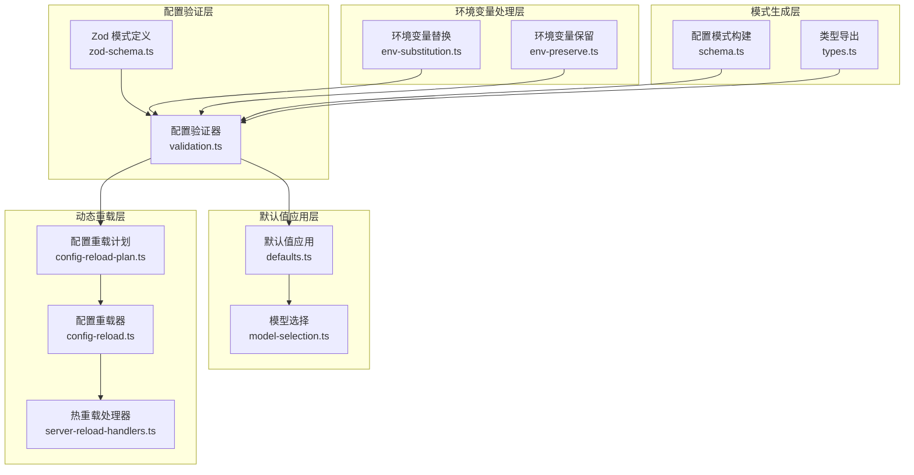
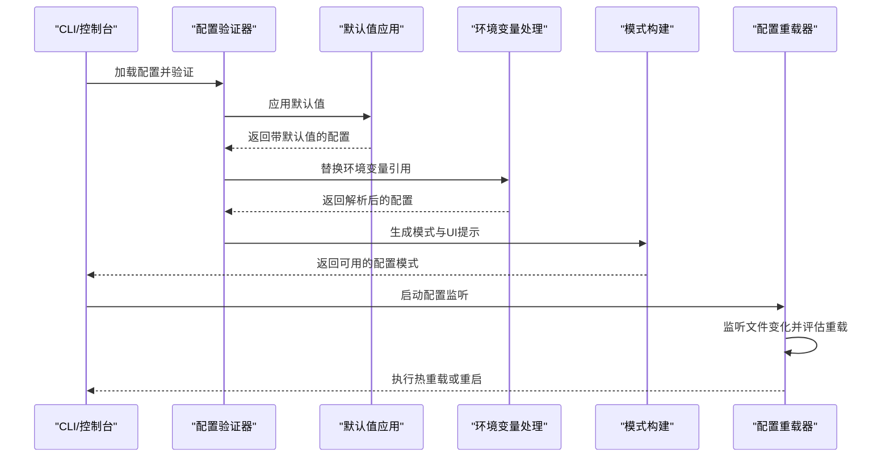
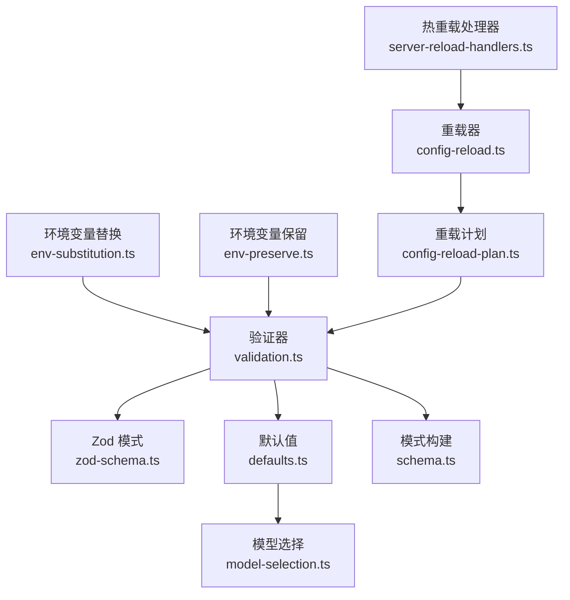

# 代理配置与管理

<cite>
**本文档引用的文件**
- [validation.ts](file://src/config/validation.ts)
- [defaults.ts](file://src/config/defaults.ts)
- [env-substitution.ts](file://src/config/env-substitution.ts)
- [env-preserve.ts](file://src/config/env-preserve.ts)
- [schema.ts](file://src/config/schema.ts)
- [zod-schema.ts](file://src/config/zod-schema.ts)
- [model-selection.ts](file://src/agents/model-selection.ts)
- [config-reload.ts](file://src/gateway/config-reload.ts)
- [config-reload-plan.ts](file://src/gateway/config-reload-plan.ts)
- [server-reload-handlers.ts](file://src/gateway/server-reload-handlers.ts)
- [net.test.ts](file://src/gateway/net.test.ts)
- [audit.test.ts](file://src/security/audit.test.ts)
- [types.ts](file://src/config/types.ts)
</cite>

## 目录
1. [简介](#简介)
2. [项目结构](#项目结构)
3. [核心组件](#核心组件)
4. [架构概览](#架构概览)
5. [详细组件分析](#详细组件分析)
6. [依赖关系分析](#依赖关系分析)
7. [性能考虑](#性能考虑)
8. [故障排除指南](#故障排除指南)
9. [结论](#结论)
10. [附录](#附录)

## 简介

本文件系统性阐述 OpenClaw 代理配置与管理系统的设计理念、实现机制与最佳实践。内容涵盖配置文件结构、默认值设置、配置验证、认证配置、模型选择、运行时参数管理，以及配置继承、环境变量替换、动态配置更新等高级特性。同时提供批量管理多个代理实例的方法与配置模板化策略，帮助用户在复杂场景下实现高效、安全、可维护的代理配置管理。

## 项目结构

OpenClaw 的配置管理由多层模块协同完成：配置验证层（Zod Schema + 自定义校验）、默认值应用层（模型、代理、会话等默认值）、环境变量处理层（替换与保留）、模式生成层（Schema 与 UI 提示）、以及网关动态重载层（热重载与重启策略）。整体架构强调类型安全、可扩展性与运行时可观测性。

**图表来源**
- [zod-schema.ts:1-800](file://src/config/zod-schema.ts#L1-L800)
- [validation.ts:1-624](file://src/config/validation.ts#L1-L624)
- [defaults.ts:1-537](file://src/config/defaults.ts#L1-L537)
- [model-selection.ts:1-729](file://src/agents/model-selection.ts#L1-L729)
- [env-substitution.ts:1-204](file://src/config/env-substitution.ts#L1-L204)
- [env-preserve.ts:1-38](file://src/config/env-preserve.ts#L1-L38)
- [schema.ts:1-712](file://src/config/schema.ts#L1-L712)
- [config-reload-plan.ts:87-150](file://src/gateway/config-reload-plan.ts#L87-L150)
- [config-reload.ts:54-247](file://src/gateway/config-reload.ts#L54-L247)
- [server-reload-handlers.ts:28-74](file://src/gateway/server-reload-handlers.ts#L28-L74)

**章节来源**
- [zod-schema.ts:1-800](file://src/config/zod-schema.ts#L1-L800)
- [validation.ts:1-624](file://src/config/validation.ts#L1-L624)
- [defaults.ts:1-537](file://src/config/defaults.ts#L1-L537)
- [model-selection.ts:1-729](file://src/agents/model-selection.ts#L1-L729)
- [env-substitution.ts:1-204](file://src/config/env-substitution.ts#L1-L204)
- [env-preserve.ts:1-38](file://src/config/env-preserve.ts#L1-L38)
- [schema.ts:1-712](file://src/config/schema.ts#L1-L712)
- [config-reload-plan.ts:87-150](file://src/gateway/config-reload-plan.ts#L87-L150)
- [config-reload.ts:54-247](file://src/gateway/config-reload.ts#L54-L247)
- [server-reload-handlers.ts:28-74](file://src/gateway/server-reload-handlers.ts#L28-L74)

## 核心组件

### 配置验证与模式系统
- Zod 模式定义：通过分层的 Zod Schema 定义配置结构，确保类型安全与约束完整性。
- 自定义验证器：在 Zod 基础上增加业务规则校验（如代理目录重复、头像路径合法性、Tailscale 绑定限制等）。
- 模式构建与 UI 提示：动态合并插件与频道的配置模式，生成面向 UI 的提示信息与敏感字段标记。

**章节来源**
- [zod-schema.ts:1-800](file://src/config/zod-schema.ts#L1-L800)
- [validation.ts:1-624](file://src/config/validation.ts#L1-L624)
- [schema.ts:1-712](file://src/config/schema.ts#L1-L712)

### 默认值应用与继承
- 模型默认值：为模型定义提供合理的默认成本、输入类型、上下文窗口与最大令牌数，并自动补全别名映射。
- 代理默认值：为并发执行、心跳间隔、上下文修剪策略等关键参数设置合理默认值。
- 会话默认值：规范化会话主键等运行时参数。
- 认证与缓存：根据认证模式自动调整缓存保留策略与心跳周期。

**章节来源**
- [defaults.ts:1-537](file://src/config/defaults.ts#L1-L537)

### 环境变量处理
- 环境变量替换：支持 `${VAR_NAME}` 语法，仅匹配大写环境变量，提供缺失变量时的错误或警告回调。
- 环境变量保留：在配置回写时检测已解析值是否来自环境变量引用，若匹配则恢复原始引用，避免凭空修改。

**章节来源**
- [env-substitution.ts:1-204](file://src/config/env-substitution.ts#L1-L204)
- [env-preserve.ts:1-38](file://src/config/env-preserve.ts#L1-L38)

### 模型选择与运行时参数
- 模型解析：支持别名、提供者规范化、模型规范化与别名索引构建，确保模型引用的唯一性与一致性。
- 运行时参数：根据模型能力与配置决定推理级别、思考级别等运行时参数。
- 失败回退：基于允许列表与回退链路，提供稳健的模型选择与降级策略。

**章节来源**
- [model-selection.ts:1-729](file://src/agents/model-selection.ts#L1-L729)

### 动态配置更新
- 重载规则：基于配置路径前缀定义热重载、重启或无操作策略，支持插件与频道贡献自定义规则。
- 重载器：监听配置文件变化，计算变更路径，评估重载计划，按策略执行热重载或重启。
- 热重载处理器：在不中断服务的前提下更新钩子、心跳、浏览器控制等子系统。

**章节来源**
- [config-reload-plan.ts:87-150](file://src/gateway/config-reload-plan.ts#L87-L150)
- [config-reload.ts:54-247](file://src/gateway/config-reload.ts#L54-L247)
- [server-reload-handlers.ts:28-74](file://src/gateway/server-reload-handlers.ts#L28-L74)

## 架构概览

**图表来源**
- [validation.ts:275-321](file://src/config/validation.ts#L275-L321)
- [defaults.ts:213-347](file://src/config/defaults.ts#L213-L347)
- [env-substitution.ts:197-203](file://src/config/env-substitution.ts#L197-L203)
- [schema.ts:449-484](file://src/config/schema.ts#L449-L484)
- [config-reload.ts:72-247](file://src/gateway/config-reload.ts#L72-L247)

## 详细组件分析

### 配置验证与模式系统

#### Zod 模式定义
- 分层设计：将配置拆分为元数据、环境、诊断、日志、浏览器、UI、机密、认证、ACP、模型、代理、工具、绑定、广播、音频、媒体、消息、命令、审批、会话、定时任务、钩子、Web、频道、发现、画布主机、语音、网关等子模块。
- 类型约束：对数值范围、时间格式、URL 协议、枚举集合等进行严格约束，确保配置的正确性与一致性。

**章节来源**
- [zod-schema.ts:1-800](file://src/config/zod-schema.ts#L1-L800)

#### 自定义验证器
- 业务规则：检查代理工作区重复、头像路径合法性、Tailscale 绑定限制等。
- 插件与频道校验：验证插件 ID、频道 ID、心跳目标等，提供详细的错误与警告信息。
- 警告收集：在不阻断启动的前提下收集潜在问题，便于用户修复。

**章节来源**
- [validation.ts:198-273](file://src/config/validation.ts#L198-L273)
- [validation.ts:391-462](file://src/config/validation.ts#L391-L462)
- [validation.ts:464-623](file://src/config/validation.ts#L464-L623)

#### 模式构建与 UI 提示
- 插件与频道模式合并：动态合并插件与频道的配置模式，生成统一的表单模式。
- 敏感字段标记：对机密输入进行敏感标记，避免在 UI 中泄露。
- 子节点查找：支持路径查找与子节点枚举，便于 UI 层构建嵌套表单。

**章节来源**
- [schema.ts:285-350](file://src/config/schema.ts#L285-L350)
- [schema.ts:449-484](file://src/config/schema.ts#L449-L484)
- [schema.ts:678-711](file://src/config/schema.ts#L678-L711)

### 默认值应用与继承

#### 模型默认值
- 成本与输入类型：为模型定义默认成本与输入类型，确保计费与输入兼容性。
- 上下文窗口与最大令牌：根据上下文窗口自动推导最大令牌数，避免越界。
- 别名映射：自动为常用别名添加提供者前缀，提升配置可读性。

**章节来源**
- [defaults.ts:213-347](file://src/config/defaults.ts#L213-L347)

#### 代理默认值
- 并发控制：为代理与子代理设置合理的并发上限，避免资源争用。
- 心跳与上下文修剪：根据认证模式自动设置心跳间隔与上下文修剪策略。
- 缓存保留：针对特定模型自动设置缓存保留策略，优化性能与成本。

**章节来源**
- [defaults.ts:349-507](file://src/config/defaults.ts#L349-L507)

#### 会话默认值
- 主键规范化：统一会话主键为固定值，简化运行时逻辑。
- 警告机制：对非标准主键进行一次性警告，避免长期误用。

**章节来源**
- [defaults.ts:146-170](file://src/config/defaults.ts#L146-L170)

### 环境变量处理

#### 环境变量替换
- 语法支持：支持 `${VAR_NAME}` 与 `$${}` 转义语法，仅匹配大写环境变量。
- 错误处理：缺失变量时抛出异常或回调警告，保证配置加载的可控性。
- 递归替换：对字符串、数组与对象进行深度遍历替换。

**章节来源**
- [env-substitution.ts:1-204](file://src/config/env-substitution.ts#L1-L204)

#### 环境变量保留
- 引用检测：在配置回写时检测值是否来自环境变量引用，若匹配则恢复原样。
- 保持一致性：避免因手动修改导致环境变量引用丢失，确保配置轮转的稳定性。

**章节来源**
- [env-preserve.ts:1-38](file://src/config/env-preserve.ts#L1-L38)

### 模型选择与运行时参数

#### 模型解析流程
- 别名与提供者规范化：支持多种别名与提供者名称变体，统一到标准格式。
- 别名索引：构建别名到模型引用的映射，支持快速解析。
- 解析失败回退：当解析失败时，记录警告并回退到默认模型。

**章节来源**
- [model-selection.ts:273-388](file://src/agents/model-selection.ts#L273-L388)

#### 运行时参数决策
- 推理级别：根据模型能力与配置决定推理级别，确保性能与准确性平衡。
- 思考级别：根据模型与配置决定思考级别，支持从模型到全局的层级覆盖。
- 允许列表与回退：结合允许列表与回退链路，提供稳健的模型选择策略。

**章节来源**
- [model-selection.ts:462-558](file://src/agents/model-selection.ts#L462-L558)
- [model-selection.ts:632-681](file://src/agents/model-selection.ts#L632-L681)

### 动态配置更新

#### 重载规则与评估
- 规则定义：基于配置路径前缀定义热重载、重启或无操作策略。
- 插件与频道扩展：允许插件与频道贡献自定义规则，增强系统的可扩展性。
- 变更路径比较：计算当前配置与新配置的差异路径，指导重载决策。

**章节来源**
- [config-reload-plan.ts:87-150](file://src/gateway/config-reload-plan.ts#L87-L150)

#### 重载器与处理器
- 文件监听：使用文件系统监听器跟踪配置文件变化，支持稳定写入完成检测。
- 重载策略：根据配置中的重载模式（关闭、重启、热重载、混合）执行相应动作。
- 热重载处理：在不中断服务的前提下更新钩子、心跳、浏览器控制等子系统。

**章节来源**
- [config-reload.ts:54-247](file://src/gateway/config-reload.ts#L54-L247)
- [server-reload-handlers.ts:28-74](file://src/gateway/server-reload-handlers.ts#L28-L74)

### 认证配置与可信代理

#### 可信代理地址匹配
- 支持精确 IP、CIDR、IPv6 与混合配置，提供严格的白名单校验。
- 空白与无效条目处理：忽略空白与无效条目，确保配置健壮性。

**章节来源**
- [net.test.ts:51-194](file://src/gateway/net.test.ts#L51-L194)

#### 认证安全审计
- 绑定模式与可信代理组合的安全评估，识别高风险配置（如 LAN 绑定与不可信代理范围）。
- 专用检查项：针对可信代理认证模式进行专项安全审计，提供严重等级与抑制策略。

**章节来源**
- [audit.test.ts:1634-1800](file://src/security/audit.test.ts#L1634-L1800)

## 依赖关系分析

**图表来源**
- [validation.ts:1-624](file://src/config/validation.ts#L1-L624)
- [zod-schema.ts:1-800](file://src/config/zod-schema.ts#L1-L800)
- [defaults.ts:1-537](file://src/config/defaults.ts#L1-L537)
- [model-selection.ts:1-729](file://src/agents/model-selection.ts#L1-L729)
- [env-substitution.ts:1-204](file://src/config/env-substitution.ts#L1-L204)
- [env-preserve.ts:1-38](file://src/config/env-preserve.ts#L1-L38)
- [config-reload-plan.ts:87-150](file://src/gateway/config-reload-plan.ts#L87-L150)
- [config-reload.ts:54-247](file://src/gateway/config-reload.ts#L54-L247)
- [server-reload-handlers.ts:28-74](file://src/gateway/server-reload-handlers.ts#L28-L74)

**章节来源**
- [validation.ts:1-624](file://src/config/validation.ts#L1-L624)
- [zod-schema.ts:1-800](file://src/config/zod-schema.ts#L1-L800)
- [defaults.ts:1-537](file://src/config/defaults.ts#L1-L537)
- [model-selection.ts:1-729](file://src/agents/model-selection.ts#L1-L729)
- [env-substitution.ts:1-204](file://src/config/env-substitution.ts#L1-L204)
- [env-preserve.ts:1-38](file://src/config/env-preserve.ts#L1-L38)
- [config-reload-plan.ts:87-150](file://src/gateway/config-reload-plan.ts#L87-L150)
- [config-reload.ts:54-247](file://src/gateway/config-reload.ts#L54-L247)
- [server-reload-handlers.ts:28-74](file://src/gateway/server-reload-handlers.ts#L28-L74)

## 性能考虑

- 模式缓存：配置模式构建采用缓存机制，减少重复计算开销。
- 热重载优先：优先尝试热重载以降低停机时间，仅在必要时执行重启。
- 文件监听优化：使用稳定写入完成检测与轮询策略，平衡实时性与资源消耗。
- 默认值最小化：仅在必要时应用默认值，避免不必要的配置膨胀。

## 故障排除指南

- 配置验证失败：根据错误路径与提示信息定位问题，检查类型、枚举值与必填字段。
- 环境变量缺失：确认环境变量是否正确设置，或使用 `onMissing` 回调收集警告而非抛错。
- 可信代理配置错误：核对代理地址格式与范围，确保符合网络拓扑要求。
- 动态重载未生效：检查重载模式与规则，确认变更路径是否被正确识别与处理。

**章节来源**
- [validation.ts:117-140](file://src/config/validation.ts#L117-L140)
- [env-substitution.ts:29-37](file://src/config/env-substitution.ts#L29-L37)
- [audit.test.ts:1753-1800](file://src/security/audit.test.ts#L1753-L1800)
- [config-reload.ts:141-182](file://src/gateway/config-reload.ts#L141-L182)

## 结论

OpenClaw 的代理配置与管理系统通过严格的类型约束、完善的默认值应用、灵活的环境变量处理与智能的动态重载机制，实现了高可靠性与高可维护性的配置管理。配合认证安全审计与模式化 UI 提示，用户可以在复杂场景中轻松管理多个代理实例，并通过模板化与批量配置实现规模化部署。

## 附录

### 最佳实践

- 使用 Zod 模式与自定义验证器确保配置的类型安全与业务合规。
- 合理设置默认值，避免在配置文件中重复冗余设置。
- 利用环境变量替换与保留机制，实现配置的环境隔离与轮转。
- 采用热重载策略，在不影响服务的情况下进行配置更新。
- 对可信代理与认证模式进行定期安全审计，及时发现并修复风险配置。

### 批量管理与模板化

- 批量管理：通过统一的配置模式与 UI 表单，批量编辑多个代理实例的相同配置段。
- 模板化：利用模式构建与 UI 提示，为不同场景创建配置模板，复用到多个实例。
- 插件与频道扩展：通过插件与频道贡献的模式，扩展配置能力并保持一致性。

**章节来源**
- [schema.ts:449-484](file://src/config/schema.ts#L449-L484)
- [config-reload-plan.ts:123-137](file://src/gateway/config-reload-plan.ts#L123-L137)