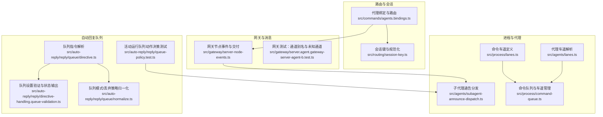
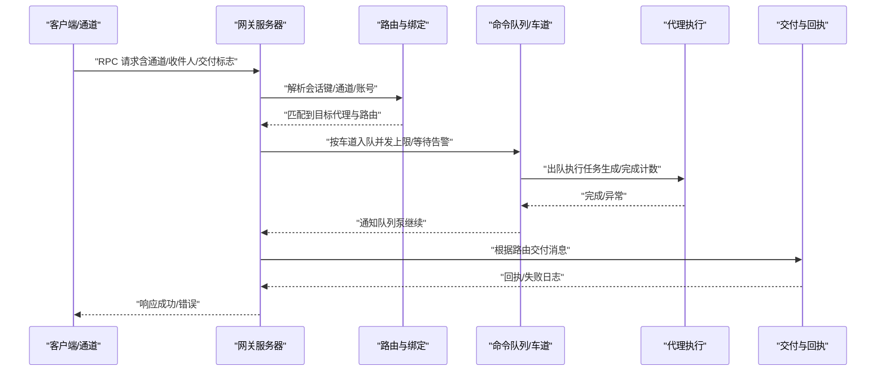
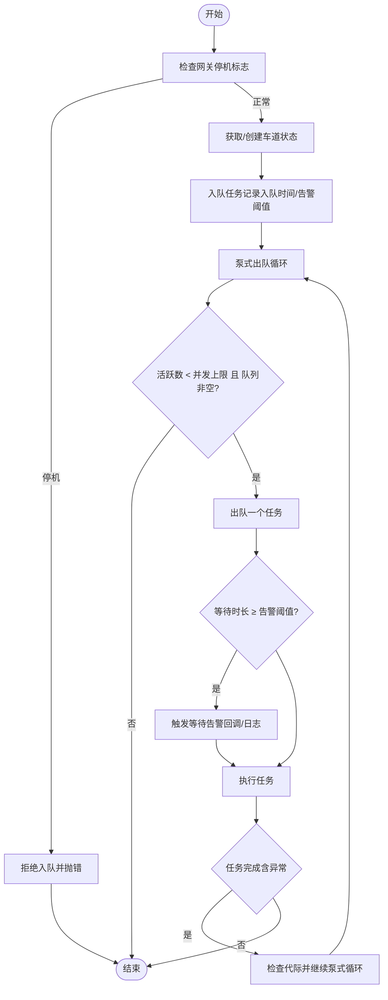
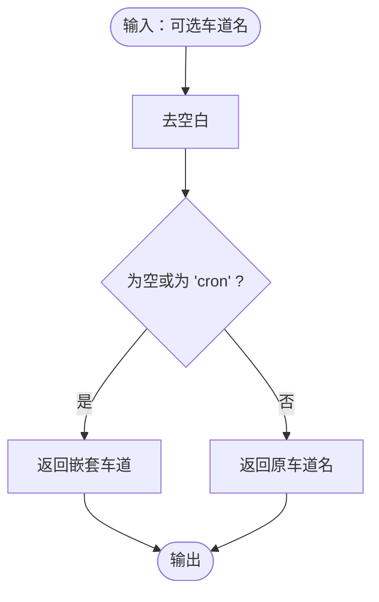
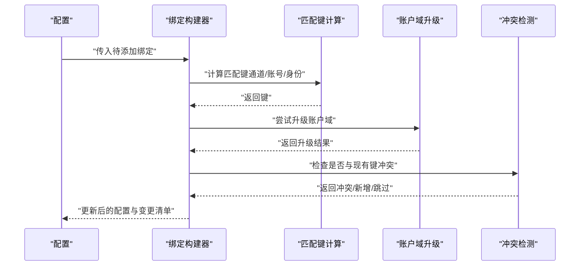
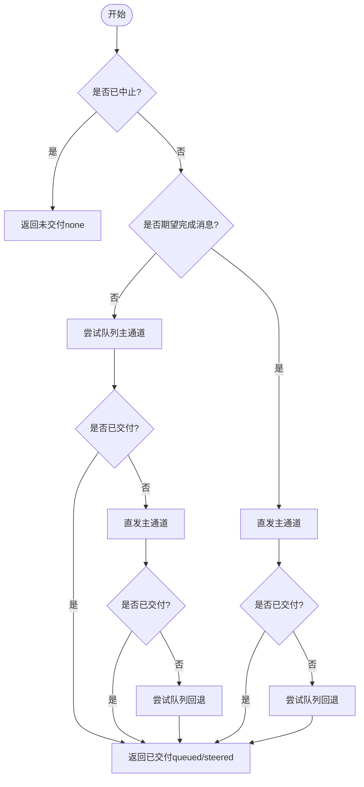
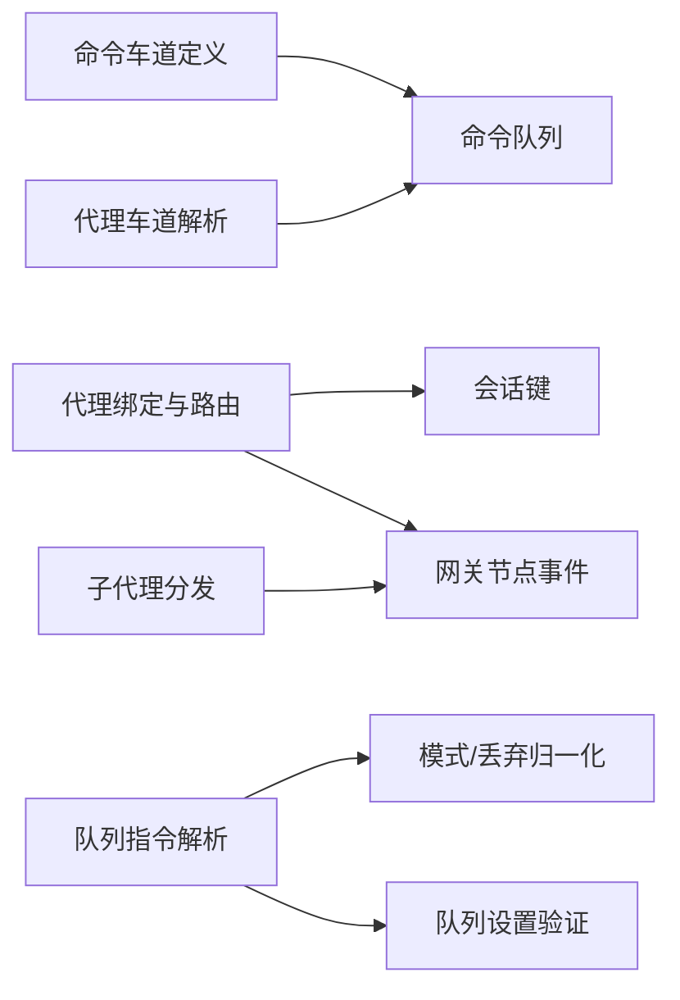

# 代理路由与调度

<cite>
**本文引用的文件**
- [src/process/lanes.ts](file://src/process/lanes.ts)
- [src/agents/lanes.ts](file://src/agents/lanes.ts)
- [src/process/command-queue.ts](file://src/process/command-queue.ts)
- [src/commands/agents.bindings.ts](file://src/commands/agents.bindings.ts)
- [src/routing/session-key.ts](file://src/routing/session-key.ts)
- [src/agents/subagent-announce-dispatch.ts](file://src/agents/subagent-announce-dispatch.ts)
- [src/gateway/server-node-events.ts](file://src/gateway/server-node-events.ts)
- [src/gateway/server.agent.gateway-server-agent-b.test.ts](file://src/gateway/server.agent.gateway-server-agent-b.test.ts)
- [src/auto-reply/reply/queue/directive.ts](file://src/auto-reply/reply/queue/directive.ts)
- [src/auto-reply/reply/queue/normalize.ts](file://src/auto-reply/reply/queue/normalize.ts)
- [src/auto-reply/reply/directive-handling.queue-validation.ts](file://src/auto-reply/reply/directive-handling.queue-validation.ts)
- [src/auto-reply/reply/queue-policy.test.ts](file://src/auto-reply/reply/queue-policy.test.ts)
</cite>

## 目录
1. [简介](#简介)
2. [项目结构](#项目结构)
3. [核心组件](#核心组件)
4. [架构总览](#架构总览)
5. [详细组件分析](#详细组件分析)
6. [依赖关系分析](#依赖关系分析)
7. [性能考量](#性能考量)
8. [故障排查指南](#故障排查指南)
9. [结论](#结论)
10. [附录](#附录)

## 简介
本文件系统化阐述 OpenClaw 的“代理路由与调度”体系，聚焦于多代理环境下的任务路由、资源调度、代理车道（Lanes）概念与实现、任务分配与负载均衡、代理间通信协议与消息路由规则、性能优化与资源限制、监控与调试工具，以及可配置参数与扩展点。内容以源码为依据，辅以图示帮助不同技术背景读者理解。

## 项目结构
围绕“代理路由与调度”的关键模块分布如下：
- 进程级命令队列与车道：提供并发控制、排队、清空、重启恢复等能力
- 代理车道解析：将调用来源映射到合适的执行车道
- 代理绑定与路由：基于会话键与通道匹配，决定目标代理
- 子代理通告分发：在“完成消息期望”与“非完成模式”下选择入队或直发
- 网关节点事件与路由校验：确保消息交付路径与回执正确
- 自动回复队列指令解析与策略：支持队列模式、容量、丢弃策略与去抖

**图表来源**
- [src/process/lanes.ts:1-7](file://src/process/lanes.ts#L1-L7)
- [src/agents/lanes.ts:1-15](file://src/agents/lanes.ts#L1-L15)
- [src/process/command-queue.ts:1-332](file://src/process/command-queue.ts#L1-L332)
- [src/commands/agents.bindings.ts:1-327](file://src/commands/agents.bindings.ts#L1-L327)
- [src/routing/session-key.ts:1-254](file://src/routing/session-key.ts#L1-L254)
- [src/agents/subagent-announce-dispatch.ts:1-104](file://src/agents/subagent-announce-dispatch.ts#L1-L104)
- [src/gateway/server-node-events.ts:390-428](file://src/gateway/server-node-events.ts#L390-L428)
- [src/gateway/server.agent.gateway-server-agent-b.test.ts:184-235](file://src/gateway/server.agent.gateway-server-agent-b.test.ts#L184-L235)
- [src/auto-reply/reply/queue/directive.ts:1-122](file://src/auto-reply/reply/queue/directive.ts#L1-L122)
- [src/auto-reply/reply/queue/normalize.ts:1-44](file://src/auto-reply/reply/queue/normalize.ts#L1-L44)
- [src/auto-reply/reply/directive-handling.queue-validation.ts:19-50](file://src/auto-reply/reply/directive-handling.queue-validation.ts#L19-L50)
- [src/auto-reply/reply/queue-policy.test.ts:1-48](file://src/auto-reply/reply/queue-policy.test.ts#L1-L48)

**章节来源**
- [src/process/lanes.ts:1-7](file://src/process/lanes.ts#L1-L7)
- [src/agents/lanes.ts:1-15](file://src/agents/lanes.ts#L1-L15)
- [src/process/command-queue.ts:1-332](file://src/process/command-queue.ts#L1-L332)
- [src/commands/agents.bindings.ts:1-327](file://src/commands/agents.bindings.ts#L1-L327)
- [src/routing/session-key.ts:1-254](file://src/routing/session-key.ts#L1-L254)
- [src/agents/subagent-announce-dispatch.ts:1-104](file://src/agents/subagent-announce-dispatch.ts#L1-L104)
- [src/gateway/server-node-events.ts:390-428](file://src/gateway/server-node-events.ts#L390-L428)
- [src/gateway/server.agent.gateway-server-agent-b.test.ts:184-235](file://src/gateway/server.agent.gateway-server-agent-b.test.ts#L184-L235)
- [src/auto-reply/reply/queue/directive.ts:1-122](file://src/auto-reply/reply/queue/directive.ts#L1-L122)
- [src/auto-reply/reply/queue/normalize.ts:1-44](file://src/auto-reply/reply/queue/normalize.ts#L1-L44)
- [src/auto-reply/reply/directive-handling.queue-validation.ts:19-50](file://src/auto-reply/reply/directive-handling.queue-validation.ts#L19-L50)
- [src/auto-reply/reply/queue-policy.test.ts:1-48](file://src/auto-reply/reply/queue-policy.test.ts#L1-L48)

## 核心组件
- 命令车道与队列
  - 定义：主车道、定时器车道、子代理车道、嵌套车道
  - 能力：并发上限、排队、出队执行、等待告警、清空车道、网关停机保护、重启后重置
- 代理车道解析
  - 将调用来源（如 cron）映射到嵌套车道，避免定时任务占用定时器车道导致内部工作无法调度
- 代理绑定与路由
  - 基于通道、账号、身份标识构建路由绑定；支持升级账户域范围、冲突检测、批量增删
- 会话键与路由
  - 规范化代理 ID、主键、DM/群组会话键；支持线程化会话键派生
- 子代理通告分发
  - 在“完成消息期望”与“非完成模式”下，优先队列入队或直接投递，并记录阶段结果
- 网关节点事件与交付
  - 解析交付请求与回执，校验通道与接收方，缺失时发出警告
- 自动回复队列指令
  - 解析队列模式、容量、丢弃策略、去抖参数；提供默认值与错误提示

**章节来源**
- [src/process/lanes.ts:1-7](file://src/process/lanes.ts#L1-L7)
- [src/agents/lanes.ts:1-15](file://src/agents/lanes.ts#L1-L15)
- [src/process/command-queue.ts:1-332](file://src/process/command-queue.ts#L1-L332)
- [src/commands/agents.bindings.ts:1-327](file://src/commands/agents.bindings.ts#L1-L327)
- [src/routing/session-key.ts:1-254](file://src/routing/session-key.ts#L1-L254)
- [src/agents/subagent-announce-dispatch.ts:1-104](file://src/agents/subagent-announce-dispatch.ts#L1-L104)
- [src/gateway/server-node-events.ts:390-428](file://src/gateway/server-node-events.ts#L390-L428)
- [src/auto-reply/reply/queue/directive.ts:1-122](file://src/auto-reply/reply/queue/directive.ts#L1-L122)

## 架构总览
下图展示了从“消息进入网关”到“代理执行与交付”的端到端流程，以及队列与车道如何协同保证并发与顺序。

**图表来源**
- [src/gateway/server-node-events.ts:390-428](file://src/gateway/server-node-events.ts#L390-L428)
- [src/process/command-queue.ts:99-151](file://src/process/command-queue.ts#L99-L151)
- [src/commands/agents.bindings.ts:75-159](file://src/commands/agents.bindings.ts#L75-L159)

## 详细组件分析

### 组件A：命令车道与队列（并发与排队）
- 设计要点
  - 每个车道独立维护队列、活跃任务集合、最大并发、代际计数与停机标记
  - 全局单例共享队列状态，确保打包产物中的各入口共享同一调度上下文
  - 出队时记录等待时长与队前人数，超过阈值触发等待告警
  - 支持“网关停机”快速拒绝新任务，避免重启过程中的静默失败
  - 提供清空车道、重置所有车道、等待当前活跃任务结束等运维能力
- 关键流程（泵式出队）
  - 当活跃任务数小于并发上限且队列非空时，持续出队并启动任务
  - 任务完成后检查是否仍处于当前代际，是则继续泵式推进
  - 异常时同样进行代际检查与后续泵式推进，避免死锁
- 复杂度与性能
  - 入队/出队为摊销 O(1)，队列长度与活跃任务数直接影响吞吐
  - 通过并发上限与等待告警，避免饥饿与过载

**图表来源**
- [src/process/command-queue.ts:99-151](file://src/process/command-queue.ts#L99-L151)
- [src/process/command-queue.ts:168-194](file://src/process/command-queue.ts#L168-L194)
- [src/process/command-queue.ts:223-235](file://src/process/command-queue.ts#L223-L235)
- [src/process/command-queue.ts:251-266](file://src/process/command-queue.ts#L251-L266)

**章节来源**
- [src/process/command-queue.ts:1-332](file://src/process/command-queue.ts#L1-L332)

### 组件B：代理车道（Lanes）解析与策略
- 目标
  - 将来自 cron 或未显式指定的调用，安全地映射到嵌套车道，避免定时任务占用定时器车道导致内部工作无法调度
- 行为
  - 默认与 cron 去空白后为“cron”时，返回嵌套车道
  - 其他情况保留原车道名
- 适用场景
  - 子代理嵌套执行、定时任务派生的内部任务

**图表来源**
- [src/agents/lanes.ts:6-14](file://src/agents/lanes.ts#L6-L14)

**章节来源**
- [src/agents/lanes.ts:1-15](file://src/agents/lanes.ts#L1-L15)

### 组件C：代理绑定与路由（会话键与通道）
- 绑定构建
  - 基于通道、账号、身份信息（群组/频道/个人）构建匹配键
  - 支持“账户域升级”：从无账户域升级到有账户域，保持匹配键一致
  - 冲突检测：若同一匹配键已绑定到不同代理，视为冲突
- 会话键
  - 规范化代理 ID、主键、DM/群组/线程化会话键
  - 支持基于身份链接的对等体映射，实现跨标识的会话聚合
- 路由校验
  - 测试覆盖通道别名（如 imsg → iMessage）、未知通道拒绝

**图表来源**
- [src/commands/agents.bindings.ts:75-159](file://src/commands/agents.bindings.ts#L75-L159)
- [src/commands/agents.bindings.ts:161-227](file://src/commands/agents.bindings.ts#L161-L227)
- [src/commands/agents.bindings.ts:264-286](file://src/commands/agents.bindings.ts#L264-L286)
- [src/routing/session-key.ts:73-174](file://src/routing/session-key.ts#L73-L174)

**章节来源**
- [src/commands/agents.bindings.ts:1-327](file://src/commands/agents.bindings.ts#L1-L327)
- [src/routing/session-key.ts:1-254](file://src/routing/session-key.ts#L1-L254)
- [src/gateway/server.agent.gateway-server-agent-b.test.ts:184-235](file://src/gateway/server.agent.gateway-server-agent-b.test.ts#L184-L235)

### 组件D：子代理通告分发（完成消息期望与回退策略）
- 场景
  - “完成消息期望”：等待子代理完成消息才判定交付成功
  - “非完成模式”：优先尝试入队，失败再直发
- 策略
  - 记录阶段：队列主通道、直发主通道、队列回退通道
  - 若队列主通道已交付，则短路；否则直发主通道；若仍失败且允许，再尝试队列回退
- 结果
  - 返回是否交付、交付路径（直发/入队/引导入队/无），并附带阶段明细

**图表来源**
- [src/agents/subagent-announce-dispatch.ts:42-104](file://src/agents/subagent-announce-dispatch.ts#L42-L104)

**章节来源**
- [src/agents/subagent-announce-dispatch.ts:1-104](file://src/agents/subagent-announce-dispatch.ts#L1-L104)
- [src/auto-reply/reply/queue-policy.test.ts:1-48](file://src/auto-reply/reply/queue-policy.test.ts#L1-L48)

### 组件E：网关节点事件与消息交付
- 功能
  - 解析交付请求与回执开关，必要时发送回执
  - 校验交付路由（通道与接收方），缺失时发出警告
- 关键点
  - 当请求交付但缺少路由时，记录警告
  - 回执发送失败时记录警告，不影响主流程

**章节来源**
- [src/gateway/server-node-events.ts:390-428](file://src/gateway/server-node-events.ts#L390-L428)

### 组件F：自动回复队列指令与策略
- 指令解析
  - 支持模式：steer、interrupt、followup、collect、steer+backlog
  - 支持容量、去抖、丢弃策略（old/new/summarize）
- 归一化
  - 对大小写与拼写进行容错处理，统一到内部枚举
- 验证与状态输出
  - 当仅查询状态时，汇总当前生效的模式、去抖、容量、丢弃策略并给出帮助文本
  - 对非法选项给出明确错误提示

**章节来源**
- [src/auto-reply/reply/queue/directive.ts:1-122](file://src/auto-reply/reply/queue/directive.ts#L1-L122)
- [src/auto-reply/reply/queue/normalize.ts:1-44](file://src/auto-reply/reply/queue/normalize.ts#L1-L44)
- [src/auto-reply/reply/directive-handling.queue-validation.ts:19-50](file://src/auto-reply/reply/directive-handling.queue-validation.ts#L19-L50)

## 依赖关系分析
- 耦合与内聚
  - 命令队列与车道是核心内聚模块，其他模块通过接口使用其能力
  - 代理绑定与路由依赖会话键与通道插件元数据
  - 子代理分发与自动回复队列策略相互独立，但都服务于“消息是否交付成功”的判定
- 外部依赖
  - 通道插件提供默认账号解析与强制账户绑定能力
  - 网关事件依赖通道标准化与路由匹配结果

**图表来源**
- [src/process/lanes.ts:1-7](file://src/process/lanes.ts#L1-L7)
- [src/agents/lanes.ts:1-15](file://src/agents/lanes.ts#L1-L15)
- [src/process/command-queue.ts:1-332](file://src/process/command-queue.ts#L1-L332)
- [src/commands/agents.bindings.ts:1-327](file://src/commands/agents.bindings.ts#L1-L327)
- [src/routing/session-key.ts:1-254](file://src/routing/session-key.ts#L1-L254)
- [src/agents/subagent-announce-dispatch.ts:1-104](file://src/agents/subagent-announce-dispatch.ts#L1-L104)
- [src/gateway/server-node-events.ts:390-428](file://src/gateway/server-node-events.ts#L390-L428)
- [src/auto-reply/reply/queue/directive.ts:1-122](file://src/auto-reply/reply/queue/directive.ts#L1-L122)
- [src/auto-reply/reply/queue/normalize.ts:1-44](file://src/auto-reply/reply/queue/normalize.ts#L1-L44)
- [src/auto-reply/reply/directive-handling.queue-validation.ts:19-50](file://src/auto-reply/reply/directive-handling.queue-validation.ts#L19-L50)

**章节来源**
- [src/process/command-queue.ts:1-332](file://src/process/command-queue.ts#L1-L332)
- [src/commands/agents.bindings.ts:1-327](file://src/commands/agents.bindings.ts#L1-L327)

## 性能考量
- 并发上限与队列长度
  - 通过设置每个车道的最大并发，平衡吞吐与资源占用
  - 队列长度与等待告警阈值用于识别潜在阻塞，便于提前扩容或降载
- 代际与重置
  - 重启后重置车道代际并清理活跃任务集合，避免旧任务残留导致的永久阻塞
- 等待告警与日志
  - 长时间等待会触发告警回调与诊断日志，便于定位瓶颈
- 资源限制
  - 网关停机时快速拒绝新任务，避免重启窗口内的资源争用
- 自动回复队列
  - 合理设置去抖、容量与丢弃策略，减少重复与堆积

[本节为通用指导，无需特定文件来源]

## 故障排查指南
- 常见问题
  - 任务长时间排队：检查等待告警日志与队列长度，确认是否需要提升并发或拆分车道
  - 重启后任务不继续：确认是否执行了重置所有车道，确保队列泵被重新触发
  - 交付失败或回执未达：核对通道与接收方是否完整，查看网关事件日志
  - 未知通道或别名不生效：参考通道别名测试，确认插件注册与别名映射
  - 自动回复队列设置无效：检查指令解析与归一化逻辑，确认模式/容量/丢弃策略是否合法
- 排查步骤
  - 查看诊断日志与等待告警
  - 使用队列统计与活跃任务计数接口
  - 执行“等待当前活跃任务结束”以确认停机时机
  - 清空相关车道以释放阻塞

**章节来源**
- [src/process/command-queue.ts:99-151](file://src/process/command-queue.ts#L99-L151)
- [src/process/command-queue.ts:251-266](file://src/process/command-queue.ts#L251-L266)
- [src/gateway/server-node-events.ts:390-428](file://src/gateway/server-node-events.ts#L390-L428)
- [src/gateway/server.agent.gateway-server-agent-b.test.ts:184-235](file://src/gateway/server.agent.gateway-server-agent-b.test.ts#L184-L235)
- [src/auto-reply/reply/queue/directive.ts:1-122](file://src/auto-reply/reply/queue/directive.ts#L1-L122)

## 结论
OpenClaw 的代理路由与调度体系以“车道+队列”为核心，结合“绑定与会话键”实现细粒度路由，并通过“子代理分发策略”与“网关交付校验”保障消息可靠投递。系统提供完善的并发控制、等待告警、停机保护与重启恢复机制，配合自动回复队列的模式/容量/丢弃策略，形成可运维、可观测、可扩展的多代理调度框架。

[本节为总结性内容，无需特定文件来源]

## 附录

### A. 代理车道与队列配置参数
- 车道类型
  - 主车道、定时器车道、子代理车道、嵌套车道
- 关键操作
  - 设置车道并发上限
  - 入队命令（可配置等待告警阈值与回调）
  - 清空车道
  - 重置所有车道
  - 等待当前活跃任务结束
  - 查询队列与活跃任务统计

**章节来源**
- [src/process/lanes.ts:1-7](file://src/process/lanes.ts#L1-L7)
- [src/process/command-queue.ts:161-204](file://src/process/command-queue.ts#L161-L204)
- [src/process/command-queue.ts:223-235](file://src/process/command-queue.ts#L223-L235)
- [src/process/command-queue.ts:251-266](file://src/process/command-queue.ts#L251-L266)
- [src/process/command-queue.ts:288-331](file://src/process/command-queue.ts#L288-L331)
- [src/process/command-queue.ts:206-221](file://src/process/command-queue.ts#L206-L221)

### B. 代理绑定与路由配置参数
- 绑定规格
  - 通道、账号、身份（群组/频道/个人）、角色
- 操作
  - 批量添加、更新、删除绑定
  - 账户域升级、冲突检测、缺失项报告

**章节来源**
- [src/commands/agents.bindings.ts:75-159](file://src/commands/agents.bindings.ts#L75-L159)
- [src/commands/agents.bindings.ts:161-227](file://src/commands/agents.bindings.ts#L161-L227)
- [src/commands/agents.bindings.ts:264-286](file://src/commands/agents.bindings.ts#L264-L286)

### C. 自动回复队列指令参数
- 模式
  - steer、interrupt、followup、collect、steer+backlog
- 容量
  - cap:n（正整数）
- 去抖
  - debounce:<ms|s|m>
- 丢弃策略
  - drop:old|new|summarize
- 状态查询
  - 输出当前生效的模式、去抖、容量、丢弃策略

**章节来源**
- [src/auto-reply/reply/queue/directive.ts:1-122](file://src/auto-reply/reply/queue/directive.ts#L1-L122)
- [src/auto-reply/reply/queue/normalize.ts:1-44](file://src/auto-reply/reply/queue/normalize.ts#L1-L44)
- [src/auto-reply/reply/directive-handling.queue-validation.ts:19-50](file://src/auto-reply/reply/directive-handling.queue-validation.ts#L19-L50)

### D. 代理间通信与消息路由规则
- 通道别名
  - 支持通道别名映射（如 imsg → iMessage）
- 未知通道
  - 拒绝请求并返回无效请求错误
- 交付与回执
  - 根据路由配置决定是否交付与发送回执，缺失时记录警告

**章节来源**
- [src/gateway/server.agent.gateway-server-agent-b.test.ts:184-235](file://src/gateway/server.agent.gateway-server-agent-b.test.ts#L184-L235)
- [src/gateway/server-node-events.ts:390-428](file://src/gateway/server-node-events.ts#L390-L428)