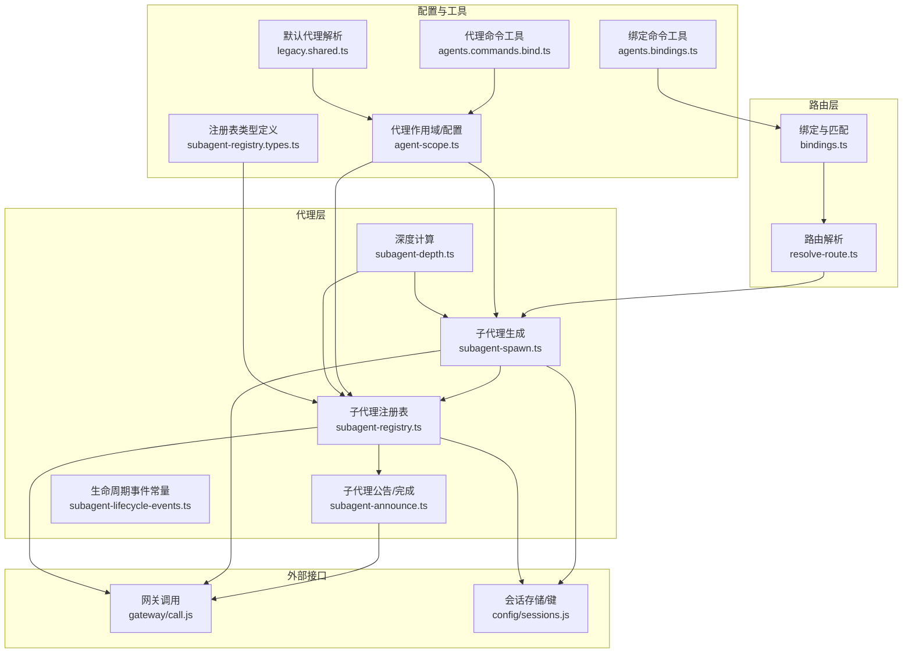
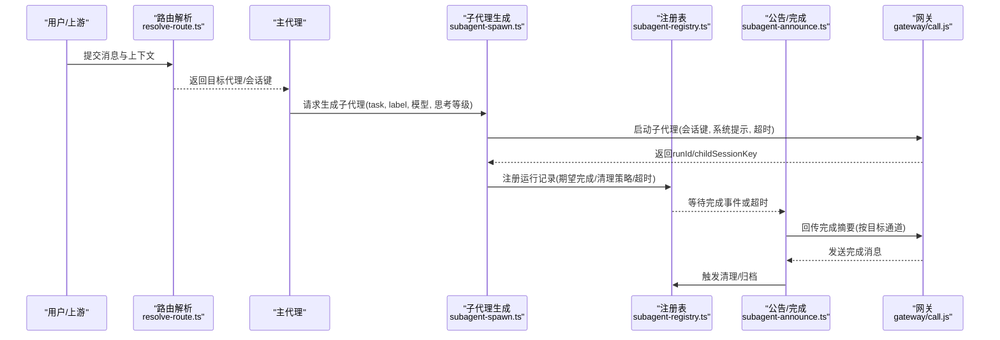
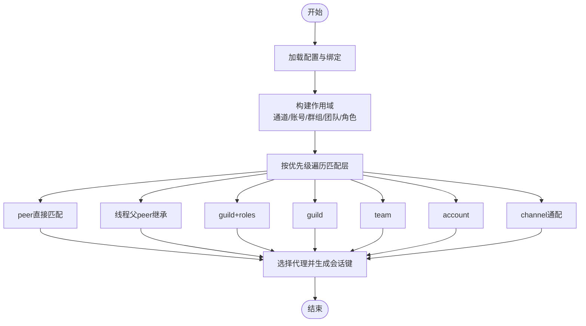
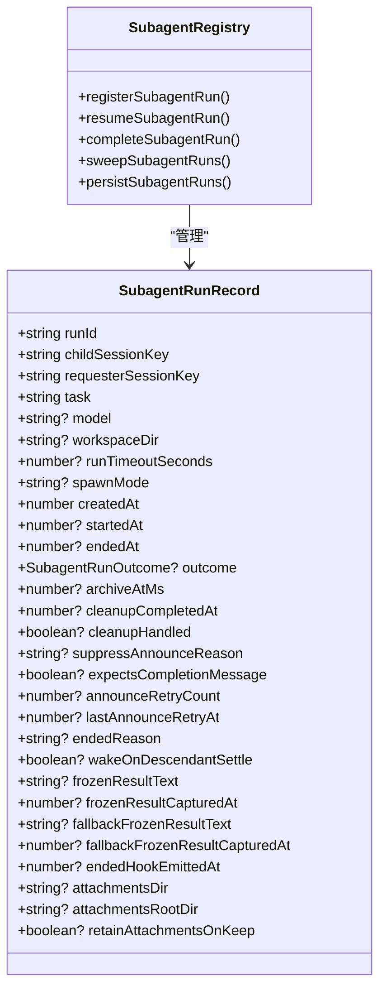
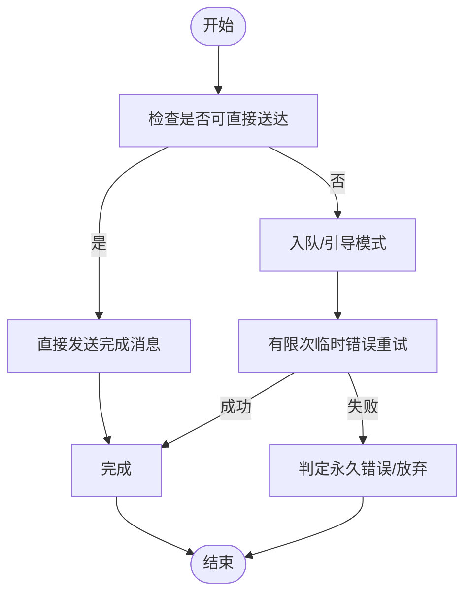
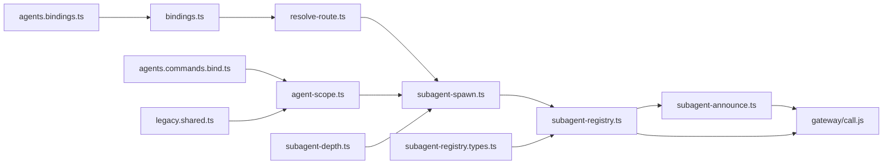

# 多代理路由与协作

<cite>
**本文引用的文件**
- [src/routing/resolve-route.ts](file://src/routing/resolve-route.ts)
- [src/routing/bindings.ts](file://src/routing/bindings.ts)
- [src/agents/subagent-spawn.ts](file://src/agents/subagent-spawn.ts)
- [src/agents/subagent-registry.ts](file://src/agents/subagent-registry.ts)
- [src/agents/subagent-announce.ts](file://src/agents/subagent-announce.ts)
- [src/agents/subagent-lifecycle-events.ts](file://src/agents/subagent-lifecycle-events.ts)
- [src/agents/subagent-registry.types.ts](file://src/agents/subagent-registry.types.ts)
- [src/agents/subagent-depth.ts](file://src/agents/subagent-depth.ts)
- [src/agents/agent-scope.ts](file://src/agents/agent-scope.ts)
- [src/commands/agents.bindings.ts](file://src/commands/agents.bindings.ts)
- [src/commands/agents.commands.bind.ts](file://src/commands/agents.commands.bind.ts)
- [src/config/legacy.shared.ts](file://src/config/legacy.shared.ts)
- [docs/channels/broadcast-groups.md](file://docs/channels/broadcast-groups.md)
</cite>

## 目录
1. [简介](#简介)
2. [项目结构](#项目结构)
3. [核心组件](#核心组件)
4. [架构总览](#架构总览)
5. [详细组件分析](#详细组件分析)
6. [依赖关系分析](#依赖关系分析)
7. [性能考量](#性能考量)
8. [故障排查指南](#故障排查指南)
9. [结论](#结论)
10. [附录](#附录)

## 简介
本文件面向“多代理路由与协作”系统，系统性阐述多代理架构的设计原理、代理注册表管理、子代理生命周期控制、代理间通信与任务分配策略、协作模式、代理深度限制、并发控制与资源调度、路由配置与负载均衡、故障转移机制，以及如何构建复杂代理编排与智能任务分解与执行。

## 项目结构
该仓库采用模块化分层组织，围绕“路由（routing）—代理（agents）—网关（gateway）—会话（sessions）—插件（plugins）”展开。多代理协作的关键能力集中在以下模块：
- 路由与绑定：解析通道、账号、群组/频道、角色等维度的绑定规则，决定消息应路由到哪个代理。
- 子代理编排：负责子代理的生成、注册、生命周期管理、完成通知与清理。
- 代理间通信：通过会话键与网关调用实现跨代理的消息传递与结果回传。
- 配置与约束：默认代理、最大深度、并发上限、超时、附件与沙箱运行时等。

图示来源
- [src/routing/bindings.ts:1-115](file://src/routing/bindings.ts#L1-L115)
- [src/routing/resolve-route.ts:1-805](file://src/routing/resolve-route.ts#L1-L805)
- [src/agents/subagent-spawn.ts:1-789](file://src/agents/subagent-spawn.ts#L1-L789)
- [src/agents/subagent-registry.ts:1-800](file://src/agents/subagent-registry.ts#L1-L800)
- [src/agents/subagent-announce.ts:1-800](file://src/agents/subagent-announce.ts#L1-L800)
- [src/agents/subagent-lifecycle-events.ts:1-48](file://src/agents/subagent-lifecycle-events.ts#L1-L48)
- [src/agents/subagent-depth.ts:1-177](file://src/agents/subagent-depth.ts#L1-L177)
- [src/agents/agent-scope.ts:1-339](file://src/agents/agent-scope.ts#L1-L339)
- [src/agents/subagent-registry.types.ts:1-59](file://src/agents/subagent-registry.types.ts#L1-L59)
- [src/commands/agents.bindings.ts:161-175](file://src/commands/agents.bindings.ts#L161-L175)
- [src/commands/agents.commands.bind.ts:53-91](file://src/commands/agents.commands.bind.ts#L53-L91)
- [src/config/legacy.shared.ts:87-133](file://src/config/legacy.shared.ts#L87-L133)

章节来源
- [src/routing/resolve-route.ts:1-805](file://src/routing/resolve-route.ts#L1-L805)
- [src/routing/bindings.ts:1-115](file://src/routing/bindings.ts#L1-L115)
- [src/agents/subagent-spawn.ts:1-789](file://src/agents/subagent-spawn.ts#L1-L789)
- [src/agents/subagent-registry.ts:1-800](file://src/agents/subagent-registry.ts#L1-L800)
- [src/agents/subagent-announce.ts:1-800](file://src/agents/subagent-announce.ts#L1-L800)
- [src/agents/subagent-lifecycle-events.ts:1-48](file://src/agents/subagent-lifecycle-events.ts#L1-L48)
- [src/agents/subagent-depth.ts:1-177](file://src/agents/subagent-depth.ts#L1-L177)
- [src/agents/agent-scope.ts:1-339](file://src/agents/agent-scope.ts#L1-L339)
- [src/agents/subagent-registry.types.ts:1-59](file://src/agents/subagent-registry.types.ts#L1-L59)
- [src/commands/agents.bindings.ts:161-175](file://src/commands/agents.bindings.ts#L161-L175)
- [src/commands/agents.commands.bind.ts:53-91](file://src/commands/agents.commands.bind.ts#L53-L91)
- [src/config/legacy.shared.ts:87-133](file://src/config/legacy.shared.ts#L87-L133)

## 核心组件
- 路由与绑定
  - 绑定解析与账户映射：根据通道、账号、群组/频道、角色等维度建立代理绑定，支持默认代理与通配绑定。
  - 路由解析：在输入上下文（通道、账号、群组/频道、成员角色）下，按优先级层级匹配绑定，输出目标代理、会话键与最后路由更新策略。
- 子代理编排
  - 子代理生成：校验深度、并发、沙箱、模型与思考等级，准备会话键与系统提示，调用网关启动子代理。
  - 注册表管理：记录子代理运行状态、重试计数、完成冻结结果、清理状态、归档时间等；恢复/清扫/延迟重试。
  - 公告与完成：自动捕获子代理最终回复，构建完成摘要，按目标通道回传完成信息，触发清理流程。
- 生命周期与事件
  - 完成/错误/终止/会话重置/删除等生命周期原因与结果枚举，驱动注册表状态机与钩子。
- 深度与并发控制
  - 深度计算：从会话存储中递归解析 spawnDepth 与 spawnedBy，确保不超过最大深度。
  - 并发控制：限制每个会话活跃子代理数量，避免过载。
- 配置与工具
  - 代理作用域：解析默认代理、工作空间、模型回退、沙箱等。
  - 命令工具：绑定增删改查、冲突检测、默认代理解析。
  - 兼容层：兼容旧版 agents 列表与默认代理解析。

章节来源
- [src/routing/bindings.ts:1-115](file://src/routing/bindings.ts#L1-L115)
- [src/routing/resolve-route.ts:614-800](file://src/routing/resolve-route.ts#L614-L800)
- [src/agents/subagent-spawn.ts:257-789](file://src/agents/subagent-spawn.ts#L257-L789)
- [src/agents/subagent-registry.ts:1-800](file://src/agents/subagent-registry.ts#L1-L800)
- [src/agents/subagent-announce.ts:1-800](file://src/agents/subagent-announce.ts#L1-L800)
- [src/agents/subagent-lifecycle-events.ts:1-48](file://src/agents/subagent-lifecycle-events.ts#L1-L48)
- [src/agents/subagent-depth.ts:124-177](file://src/agents/subagent-depth.ts#L124-L177)
- [src/agents/agent-scope.ts:72-145](file://src/agents/agent-scope.ts#L72-L145)
- [src/commands/agents.bindings.ts:161-175](file://src/commands/agents.bindings.ts#L161-L175)
- [src/commands/agents.commands.bind.ts:53-91](file://src/commands/agents.commands.bind.ts#L53-L91)
- [src/config/legacy.shared.ts:87-133](file://src/config/legacy.shared.ts#L87-L133)

## 架构总览
多代理协作以“路由—编排—通信—清理”为主线，形成闭环：
- 输入消息经路由解析确定目标代理与会话键；
- 主代理通过子代理生成器创建子代理，写入注册表；
- 子代理运行期间，注册表持续跟踪状态、冻结最终结果、处理重试；
- 完成后通过公告机制回传摘要，触发清理与归档；
- 生命周期事件驱动钩子与后续动作。

图示来源
- [src/routing/resolve-route.ts:614-800](file://src/routing/resolve-route.ts#L614-L800)
- [src/agents/subagent-spawn.ts:257-789](file://src/agents/subagent-spawn.ts#L257-L789)
- [src/agents/subagent-registry.ts:1-800](file://src/agents/subagent-registry.ts#L1-L800)
- [src/agents/subagent-announce.ts:1-800](file://src/agents/subagent-announce.ts#L1-L800)

## 详细组件分析

### 路由与绑定（bindings.ts 与 resolve-route.ts）
- 绑定维度
  - 通道/账号/群组/团队/角色：支持精确匹配与通配，优先级按“直接peer > 线程父peer > guild+roles > guild > team > account > channel”逐层降级。
  - 默认代理与首选账号：在未命中时回退至默认代理或绑定中的首选账号。
- 路由决策
  - 会话键生成：结合 agentId、通道、账号、peer、DM作用域与身份链接，生成稳定且可收敛的会话键。
  - 最后路由策略：主会话键与具体会话键分别用于不同场景下的路由更新。
- 缓存优化
  - 绑定评估缓存与路由结果缓存，避免重复计算，提升高并发场景性能。

图示来源
- [src/routing/resolve-route.ts:614-800](file://src/routing/resolve-route.ts#L614-L800)
- [src/routing/bindings.ts:17-115](file://src/routing/bindings.ts#L17-L115)

章节来源
- [src/routing/resolve-route.ts:614-800](file://src/routing/resolve-route.ts#L614-L800)
- [src/routing/bindings.ts:17-115](file://src/routing/bindings.ts#L17-L115)

### 子代理生成与注册（subagent-spawn.ts 与 subagent-registry.ts）
- 生成阶段
  - 参数校验：agentId合法性、深度限制、并发上限、沙箱一致性、模型与思考等级。
  - 会话键与系统提示：为子代理构造任务提示与运行元数据（深度、控制范围、工作空间继承）。
  - 线程绑定：对需要持久会话的场景，通过钩子确保线程绑定可用。
  - 启动子代理：调用网关启动，返回runId与childSessionKey。
  - 注册运行：写入注册表，设置清理策略、期望完成消息、超时与附件信息。
- 注册表管理
  - 运行记录：包含会话键、请求者信息、任务、模型、工作空间、超时、模式（run/session）、冻结结果、重试计数、清理状态、归档时间等。
  - 恢复/清扫：启动时从磁盘恢复，清理孤儿运行，按归档时间定期清扫。
  - 延迟重试：对未完成的子代理按指数退避重试公告，防止无限循环。
  - 生命周期钩子：在完成/错误/终止等事件触发后，发出一次性钩子并进行清理。

图示来源
- [src/agents/subagent-registry.types.ts:6-59](file://src/agents/subagent-registry.types.ts#L6-L59)
- [src/agents/subagent-registry.ts:1-800](file://src/agents/subagent-registry.ts#L1-L800)

章节来源
- [src/agents/subagent-spawn.ts:257-789](file://src/agents/subagent-spawn.ts#L257-L789)
- [src/agents/subagent-registry.ts:1-800](file://src/agents/subagent-registry.ts#L1-L800)
- [src/agents/subagent-registry.types.ts:6-59](file://src/agents/subagent-registry.types.ts#L6-L59)

### 公告与完成（subagent-announce.ts）
- 公告路径
  - 直接送达：当满足直接目标条件时，直接调用网关发送完成消息。
  - 队列/引导：当处于队列/引导模式时，将公告入队并在合适时机发送。
- 错误处理
  - 临时错误重试：对网络/网关不可用等临时错误进行有限次数重试。
  - 永久错误判定：对不支持通道、未知通道、被屏蔽等永久错误不再重试。
- 结果冻结与刷新
  - 冻结最终回复文本，避免后续变化导致的不一致；在等待完成期间可刷新最新摘要。

图示来源
- [src/agents/subagent-announce.ts:595-800](file://src/agents/subagent-announce.ts#L595-L800)

章节来源
- [src/agents/subagent-announce.ts:595-800](file://src/agents/subagent-announce.ts#L595-L800)

### 生命周期与协作（subagent-lifecycle-events.ts 与广播组）
- 生命周期原因与结果
  - 原因：完成、错误、终止、会话重置、会话删除。
  - 结果：ok、error、timeout、killed、reset、deleted。
- 协作模式
  - 广播组支持并行/顺序两种策略，注意共享上下文与速率限制等限制。
  - 未来增强：共享上下文、信号协调、动态选择、优先级等。

章节来源
- [src/agents/subagent-lifecycle-events.ts:1-48](file://src/agents/subagent-lifecycle-events.ts#L1-L48)
- [docs/channels/broadcast-groups.md:414-443](file://docs/channels/broadcast-groups.md#L414-L443)

### 深度限制与并发控制（subagent-depth.ts 与 subagent-spawn.ts）
- 深度限制
  - 从会话存储读取 spawnDepth 与 spawnedBy，递归计算当前深度，超过最大深度则拒绝生成。
- 并发控制
  - 限制每个会话活跃子代理数量，避免资源争用与过载。

章节来源
- [src/agents/subagent-depth.ts:124-177](file://src/agents/subagent-depth.ts#L124-L177)
- [src/agents/subagent-spawn.ts:334-351](file://src/agents/subagent-spawn.ts#L334-L351)

### 配置与命令工具（agent-scope.ts、legacy.shared.ts、agents.bindings.ts、agents.commands.bind.ts）
- 代理作用域
  - 解析默认代理、工作空间、模型回退、沙箱等配置项。
- 默认代理解析
  - 兼容旧版 agents 列表与默认代理回退逻辑。
- 绑定命令
  - 支持增删绑定、冲突检测、缺失绑定识别与报告。

章节来源
- [src/agents/agent-scope.ts:72-145](file://src/agents/agent-scope.ts#L72-L145)
- [src/config/legacy.shared.ts:87-133](file://src/config/legacy.shared.ts#L87-L133)
- [src/commands/agents.bindings.ts:161-175](file://src/commands/agents.bindings.ts#L161-L175)
- [src/commands/agents.commands.bind.ts:53-91](file://src/commands/agents.commands.bind.ts#L53-L91)

## 依赖关系分析
- 路由依赖绑定与会话键规范，输出代理与会话键。
- 子代理生成依赖代理作用域、深度与并发限制、沙箱运行时与模型选择。
- 注册表依赖网关与会话存储，维护运行状态与清理流程。
- 公告依赖路由目标解析与队列/引导策略，处理临时/永久错误。
- 命令工具依赖配置与绑定列表，提供运维与调试能力。

图示来源
- [src/routing/resolve-route.ts:1-805](file://src/routing/resolve-route.ts#L1-L805)
- [src/routing/bindings.ts:1-115](file://src/routing/bindings.ts#L1-L115)
- [src/agents/subagent-spawn.ts:1-789](file://src/agents/subagent-spawn.ts#L1-L789)
- [src/agents/subagent-registry.ts:1-800](file://src/agents/subagent-registry.ts#L1-L800)
- [src/agents/subagent-announce.ts:1-800](file://src/agents/subagent-announce.ts#L1-L800)
- [src/agents/subagent-registry.types.ts:1-59](file://src/agents/subagent-registry.types.ts#L1-L59)
- [src/commands/agents.bindings.ts:161-175](file://src/commands/agents.bindings.ts#L161-L175)
- [src/commands/agents.commands.bind.ts:53-91](file://src/commands/agents.commands.bind.ts#L53-L91)
- [src/config/legacy.shared.ts:87-133](file://src/config/legacy.shared.ts#L87-L133)

## 性能考量
- 路由缓存
  - 绑定评估与路由结果缓存，避免高频重复计算，建议在高并发场景启用。
- 注册表持久化与清扫
  - 定期持久化运行记录，按归档时间清扫，降低内存占用与重启成本。
- 指数退避与超时
  - 公告重试采用指数退避，配合最大重试次数与超时上限，避免风暴式重试。
- 并发上限
  - 严格限制每个会话活跃子代理数量，避免资源争用与抖动。

## 故障排查指南
- 公告失败
  - 临时错误：检查网络/网关状态，确认重试日志与退避间隔。
  - 永久错误：检查通道/账号/会话有效性，必要时调整绑定或路由策略。
- 子代理未完成
  - 检查注册表重试计数与到期时间，确认是否达到最大重试或过期。
  - 查看冻结结果与最终摘要，确认是否已回传但未被消费。
- 深度/并发受限
  - 检查深度计算与并发上限配置，必要时放宽限制或优化任务拆分。
- 绑定冲突/缺失
  - 使用绑定命令工具列出/移除绑定，定位冲突项并修正。

章节来源
- [src/agents/subagent-announce.ts:167-197](file://src/agents/subagent-announce.ts#L167-L197)
- [src/agents/subagent-registry.ts:606-658](file://src/agents/subagent-registry.ts#L606-L658)
- [src/commands/agents.bindings.ts:161-175](file://src/commands/agents.bindings.ts#L161-L175)

## 结论
该多代理路由与协作系统通过“路由—编排—通信—清理”的完整闭环，实现了可扩展、可观测、可恢复的子代理编排能力。路由层提供灵活的绑定与匹配，编排层保证深度与并发约束，通信层确保完成消息可靠回传，清理层维持长期稳定性。结合缓存、指数退避与清扫机制，系统在高并发与复杂场景下仍能保持稳健表现。

## 附录
- 代理深度限制与并发控制
  - 深度：基于会话存储递归解析 spawnDepth 与 spawnedBy，超过最大深度拒绝生成。
  - 并发：限制每个会话活跃子代理数量，避免过载。
- 资源调度与超时
  - 子代理运行超时由配置与调用方参数共同决定，注册表据此进行等待与清理。
- 负载均衡与故障转移
  - 路由层通过绑定与优先级实现负载分摊；公告层对临时错误进行有限重试，永久错误快速失败。
- 广播组协作
  - 支持并行/顺序两种策略，注意共享上下文与速率限制等限制。

章节来源
- [src/agents/subagent-depth.ts:124-177](file://src/agents/subagent-depth.ts#L124-L177)
- [src/agents/subagent-spawn.ts:334-351](file://src/agents/subagent-spawn.ts#L334-L351)
- [src/agents/subagent-registry.ts:701-706](file://src/agents/subagent-registry.ts#L701-L706)
- [docs/channels/broadcast-groups.md:414-443](file://docs/channels/broadcast-groups.md#L414-L443)