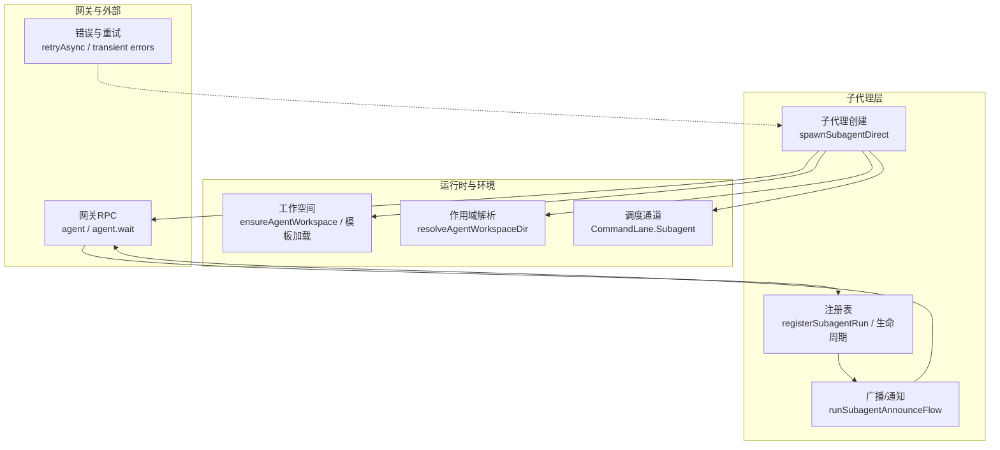
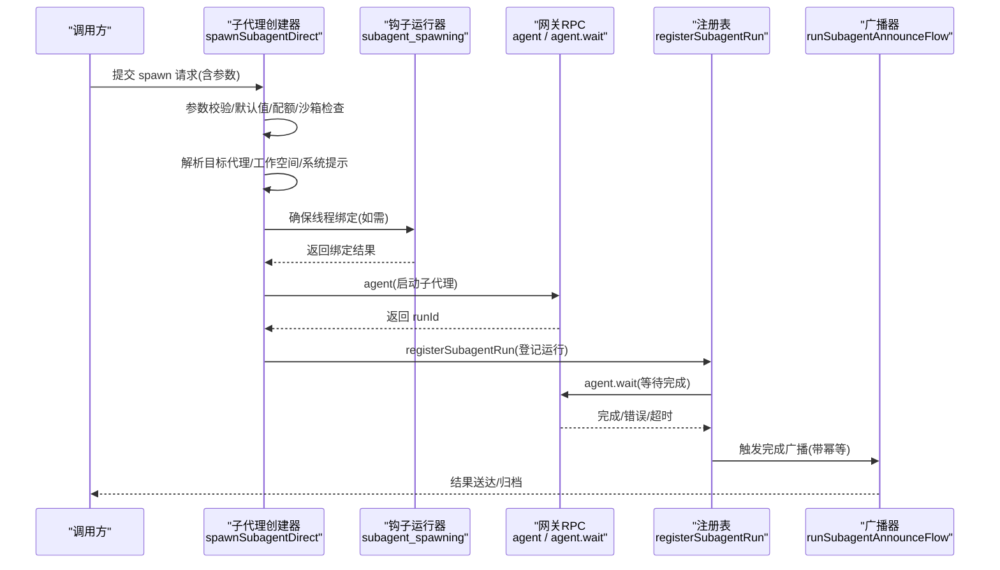
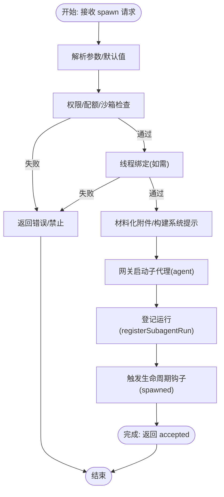
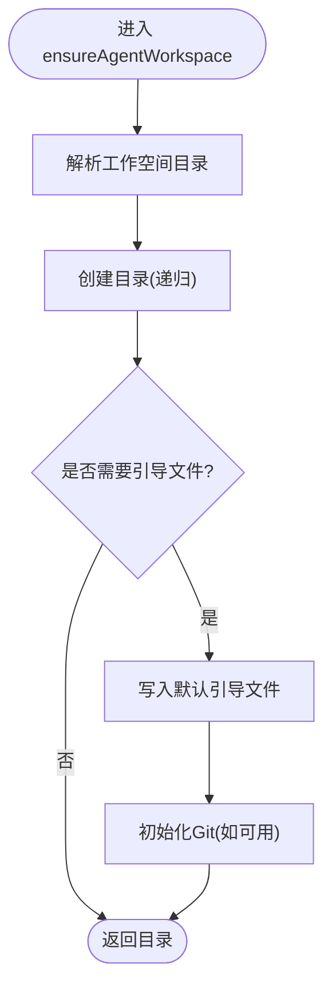
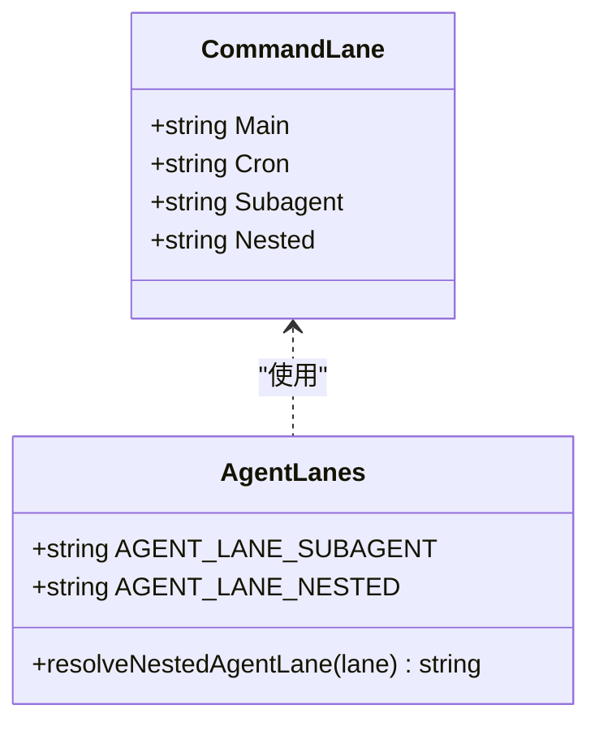
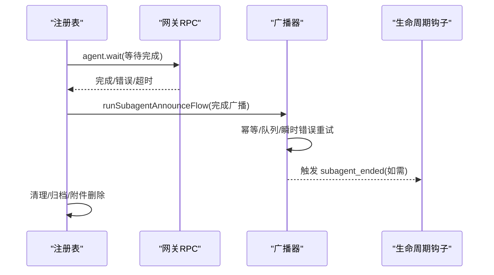
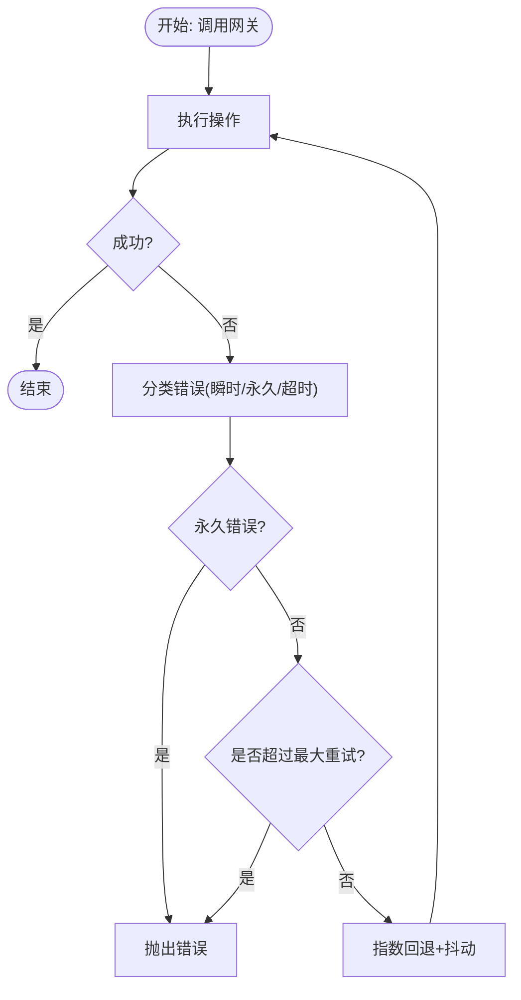
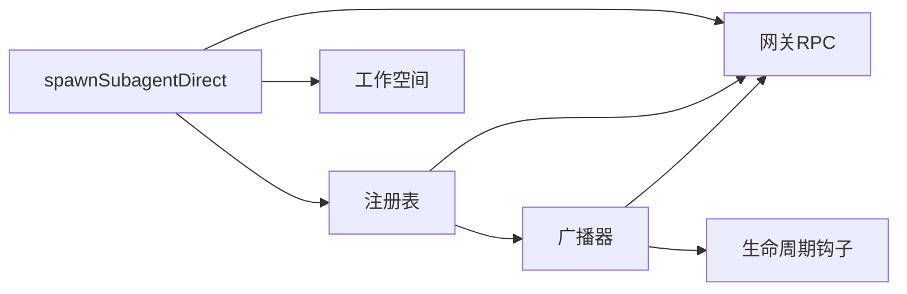

# 子代理创建与启动

<cite>
**本文引用的文件**
- [src/agents/subagent-spawn.ts](file://src/agents/subagent-spawn.ts)
- [src/agents/workspace.ts](file://src/agents/workspace.ts)
- [src/agents/workspace-dirs.ts](file://src/agents/workspace-dirs.ts)
- [src/agents/agent-scope.ts](file://src/agents/agent-scope.ts)
- [src/agents/lanes.ts](file://src/agents/lanes.ts)
- [src/process/lanes.ts](file://src/process/lanes.ts)
- [src/agents/subagent-registry.ts](file://src/agents/subagent-registry.ts)
- [src/agents/subagent-announce.ts](file://src/agents/subagent-announce.ts)
- [src/infra/retry.ts](file://src/infra/retry.ts)
- [src/config/validation.ts](file://src/config/validation.ts)
- [src/gateway/server-methods/agent.ts](file://src/gateway/server-methods/agent.ts)
- [apps/macos/Sources/OpenClaw/AgentWorkspaceConfig.swift](file://apps/macos/Sources/OpenClaw/AgentWorkspaceConfig.swift)
</cite>

## 目录
1. [简介](#简介)
2. [项目结构](#项目结构)
3. [核心组件](#核心组件)
4. [架构总览](#架构总览)
5. [详细组件分析](#详细组件分析)
6. [依赖关系分析](#依赖关系分析)
7. [性能考量](#性能考量)
8. [故障排查指南](#故障排查指南)
9. [结论](#结论)
10. [附录](#附录)

## 简介
本文件系统性阐述 OpenClaw 中“子代理创建与启动”机制，覆盖以下主题：
- 子代理创建流程与启动机制
- spawn 参数配置与环境准备
- 子代理上下文创建与初始化（工作空间、权限、资源）
- 启动调度策略与并发控制
- 失败错误处理与重试策略
- 启动后监控与状态跟踪
- 启动参数验证与配置检查

目标是帮助开发者与运维人员在不深入源码的前提下，理解并正确使用子代理能力。

## 项目结构
围绕子代理的关键模块与职责如下：
- 子代理创建与启动：负责解析参数、校验权限、准备运行时、调用网关启动子代理，并登记运行记录
- 工作空间管理：负责工作空间目录解析、引导文件生成、安全读取与模板加载
- 注册表与生命周期：负责运行记录持久化、事件监听、完成清理、超时与归档
- 广播与通知：负责子代理完成结果的广播、队列与幂等投递
- 调度与并发：通过命令通道与运行通道区分不同任务类型，限制并发与深度
- 错误处理与重试：统一的重试策略与错误分类，支持瞬时与永久性错误

图示来源
- [src/agents/subagent-spawn.ts](file://src/agents/subagent-spawn.ts)
- [src/agents/workspace.ts](file://src/agents/workspace.ts)
- [src/agents/agent-scope.ts](file://src/agents/agent-scope.ts)
- [src/agents/lanes.ts](file://src/agents/lanes.ts)
- [src/process/lanes.ts](file://src/process/lanes.ts)
- [src/agents/subagent-registry.ts](file://src/agents/subagent-registry.ts)
- [src/agents/subagent-announce.ts](file://src/agents/subagent-announce.ts)
- [src/infra/retry.ts](file://src/infra/retry.ts)

章节来源
- [src/agents/subagent-spawn.ts](file://src/agents/subagent-spawn.ts)
- [src/agents/workspace.ts](file://src/agents/workspace.ts)
- [src/agents/agent-scope.ts](file://src/agents/agent-scope.ts)
- [src/agents/lanes.ts](file://src/agents/lanes.ts)
- [src/process/lanes.ts](file://src/process/lanes.ts)
- [src/agents/subagent-registry.ts](file://src/agents/subagent-registry.ts)
- [src/agents/subagent-announce.ts](file://src/agents/subagent-announce.ts)
- [src/infra/retry.ts](file://src/infra/retry.ts)

## 核心组件
- 子代理创建与启动
  - 参数解析与默认值：任务、标签、模型、思考级别、超时、线程绑定、模式、清理策略、沙箱策略、附件挂载路径等
  - 权限与配额：最大派生深度、每会话最大活跃子代理数、允许的目标代理白名单
  - 运行时与沙箱：根据请求者与目标代理的沙箱状态决定是否允许创建
  - 线程绑定：通过钩子确保线程绑定可用，否则拒绝 session 模式
  - 附件与系统提示：材料化附件、构建系统提示、注入子代理上下文
  - 启动与登记：调用网关启动子代理，登记运行记录，触发生命周期钩子
- 工作空间
  - 解析与创建：按代理 ID 或默认策略解析工作空间目录，必要时创建引导文件
  - 安全读取：边界文件打开、内容缓存、大小限制
  - 模板加载：从模板目录加载引导文件内容
- 注册表与生命周期
  - 运行记录：持久化、恢复、监听生命周期事件、等待完成
  - 清理与归档：完成广播、附件清理、超时归档
  - 广播与通知：基于队列与幂等键的投递，支持瞬时错误重试
- 调度与并发
  - 命令通道：区分 main、cron、subagent、nested，避免 cron 占用 subagent 通道
  - 并发限制：每会话活跃子代理上限、最大派生深度
- 错误处理与重试
  - 统一重试：指数回退、抖动、最大尝试次数、可插拔策略
  - 错误分类：瞬时错误与永久错误，针对网关超时可选择不重试

章节来源
- [src/agents/subagent-spawn.ts](file://src/agents/subagent-spawn.ts)
- [src/agents/workspace.ts](file://src/agents/workspace.ts)
- [src/agents/workspace-dirs.ts](file://src/agents/workspace-dirs.ts)
- [src/agents/agent-scope.ts](file://src/agents/agent-scope.ts)
- [src/agents/lanes.ts](file://src/agents/lanes.ts)
- [src/process/lanes.ts](file://src/process/lanes.ts)
- [src/agents/subagent-registry.ts](file://src/agents/subagent-registry.ts)
- [src/agents/subagent-announce.ts](file://src/agents/subagent-announce.ts)
- [src/infra/retry.ts](file://src/infra/retry.ts)

## 架构总览
下图展示一次子代理创建与启动的端到端流程，包括参数校验、工作空间准备、线程绑定、启动与登记、事件监听与完成广播。

图示来源
- [src/agents/subagent-spawn.ts](file://src/agents/subagent-spawn.ts)
- [src/agents/subagent-registry.ts](file://src/agents/subagent-registry.ts)
- [src/agents/subagent-announce.ts](file://src/agents/subagent-announce.ts)

## 详细组件分析

### 子代理创建与启动（spawn）
- 参数与默认值
  - 任务、标签、模型、思考级别、运行超时、线程绑定、模式（run/session）、清理策略（delete/keep）、沙箱策略（inherit/require）、附件与挂载路径
  - 默认超时来自配置；未设置时为 0（无超时）
- 权限与配额
  - 最大派生深度与每会话最大活跃子代理数限制
  - 跨代理 spawn 需满足允许列表（支持通配符）
- 沙箱与运行时
  - 若请求者处于沙箱且目标非沙箱或要求 require，则拒绝
  - 依据会话键解析沙箱状态，确保一致性
- 线程绑定
  - 当请求 thread=true 且模式为 session 时，必须通过钩子确保线程绑定成功
  - 无可用钩子时直接报错
- 附件与系统提示
  - 材料化附件，构建系统提示，注入子代理上下文（请求者渠道、会话、深度、最大深度）
- 启动与登记
  - 通过网关 RPC 启动子代理，设置 lane 为 subagent
  - 登记运行记录（含期望完成消息、清理策略、工作空间、超时等）
  - 触发生命周期钩子（spawned）

图示来源
- [src/agents/subagent-spawn.ts](file://src/agents/subagent-spawn.ts)
- [src/agents/subagent-registry.ts](file://src/agents/subagent-registry.ts)

章节来源
- [src/agents/subagent-spawn.ts](file://src/agents/subagent-spawn.ts)

### 工作空间与上下文初始化
- 目录解析
  - 优先使用代理配置中的 workspace；否则使用默认策略；最后回退到状态目录下的命名空间
  - 路径标准化与大小写处理（跨平台）
- 引导文件
  - 首次创建时写入默认引导文件（如 AGENTS、SOUL、TOOLS、IDENTITY、USER、HEARTBEAT、BOOTSTRAP）
  - Git 初始化（若可用）
- 安全读取
  - 边界文件打开、内容缓存、inode/dev/size/mtime 身份标识，防止越界与缓存污染
- 模板加载
  - 从模板目录加载内容，剥离 front matter，保证一致性

图示来源
- [src/agents/workspace.ts](file://src/agents/workspace.ts)
- [src/agents/agent-scope.ts](file://src/agents/agent-scope.ts)
- [src/agents/workspace-dirs.ts](file://src/agents/workspace-dirs.ts)

章节来源
- [src/agents/workspace.ts](file://src/agents/workspace.ts)
- [src/agents/agent-scope.ts](file://src/agents/agent-scope.ts)
- [src/agents/workspace-dirs.ts](file://src/agents/workspace-dirs.ts)
- [apps/macos/Sources/OpenClaw/AgentWorkspaceConfig.swift](file://apps/macos/Sources/OpenClaw/AgentWorkspaceConfig.swift)

### 启动调度策略与并发控制
- 命令通道
  - 使用枚举区分 main、cron、subagent、nested
  - nested 通道用于嵌套代理运行，避免 cron 通道被占用
- 并发与深度
  - 每会话活跃子代理数上限
  - 最大派生深度限制，防止无限递归
- 运行通道
  - 子代理使用专用 lane，便于隔离与资源控制

图示来源
- [src/process/lanes.ts](file://src/process/lanes.ts)
- [src/agents/lanes.ts](file://src/agents/lanes.ts)

章节来源
- [src/process/lanes.ts](file://src/process/lanes.ts)
- [src/agents/lanes.ts](file://src/agents/lanes.ts)

### 生命周期与完成广播
- 运行记录
  - 持久化存储、恢复、监听生命周期事件（start/end/error）
  - 等待完成（agent.wait），处理超时、错误、正常完成
- 清理与归档
  - 完成广播（runSubagentAnnounceFlow），支持瞬时错误重试
  - 附件清理（delete/keep 策略）
  - 超时归档（archiveAfterMinutes）
- 幂等与队列
  - 基于 announceIdempotencyKey 的幂等投递
  - 队列与分流（steer/followup/collect/interrupt）

图示来源
- [src/agents/subagent-registry.ts](file://src/agents/subagent-registry.ts)
- [src/agents/subagent-announce.ts](file://src/agents/subagent-announce.ts)

章节来源
- [src/agents/subagent-registry.ts](file://src/agents/subagent-registry.ts)
- [src/agents/subagent-announce.ts](file://src/agents/subagent-announce.ts)

### 错误处理与重试策略
- 统一重试
  - 指数回退、抖动、最大尝试次数、可插拔 shouldRetry 与 retryAfterMs
  - 支持 label 标识与 onRetry 回调
- 错误分类
  - 瞬时错误（网络不可达、网关关闭、超时等）自动重试
  - 永久错误（未知渠道、用户不存在、机器人被屏蔽等）直接失败
  - 网关超时可选择不重试
- 子代理启动失败清理
  - 删除临时会话、清理附件、触发生命周期钩子（如已绑定）

图示来源
- [src/infra/retry.ts](file://src/infra/retry.ts)
- [src/agents/subagent-spawn.ts](file://src/agents/subagent-spawn.ts)
- [src/agents/subagent-announce.ts](file://src/agents/subagent-announce.ts)

章节来源
- [src/infra/retry.ts](file://src/infra/retry.ts)
- [src/agents/subagent-spawn.ts](file://src/agents/subagent-spawn.ts)
- [src/agents/subagent-announce.ts](file://src/agents/subagent-announce.ts)

### 启动参数验证与配置检查
- 配置对象验证
  - 使用 Zod Schema 校验，报告字段级问题
  - 检测重复代理目录、头像配置、网关 Tailscale 绑定等
- 代理参数校验
  - 网关侧对 agentId 进行存在性检查，未知 ID 直接拒绝
- 配置写回
  - macOS 端配置项 workspace 的读写封装，确保写回时移除空值与空默认组

章节来源
- [src/config/validation.ts](file://src/config/validation.ts)
- [src/gateway/server-methods/agent.ts](file://src/gateway/server-methods/agent.ts)
- [apps/macos/Sources/OpenClaw/AgentWorkspaceConfig.swift](file://apps/macos/Sources/OpenClaw/AgentWorkspaceConfig.swift)

## 依赖关系分析
- 组件耦合
  - 子代理创建器依赖：钩子运行器（线程绑定）、网关 RPC（启动/等待）、注册表（登记/清理）、工作空间（引导文件）
  - 注册表依赖：网关 RPC（等待）、广播器（完成广播）、生命周期钩子（ended）
  - 广播器依赖：队列系统、幂等键、会话绑定服务
- 外部依赖
  - 网关 RPC：agent、agent.wait、sessions.delete、chat.history
  - 文件系统：工作空间目录、引导文件、模板
  - 配置系统：OpenClaw 配置对象与校验

图示来源
- [src/agents/subagent-spawn.ts](file://src/agents/subagent-spawn.ts)
- [src/agents/subagent-registry.ts](file://src/agents/subagent-registry.ts)
- [src/agents/subagent-announce.ts](file://src/agents/subagent-announce.ts)
- [src/agents/workspace.ts](file://src/agents/workspace.ts)

章节来源
- [src/agents/subagent-spawn.ts](file://src/agents/subagent-spawn.ts)
- [src/agents/subagent-registry.ts](file://src/agents/subagent-registry.ts)
- [src/agents/subagent-announce.ts](file://src/agents/subagent-announce.ts)
- [src/agents/workspace.ts](file://src/agents/workspace.ts)

## 性能考量
- 启动延迟
  - 线程绑定钩子与工作空间准备可能引入额外开销，建议在高频场景下复用已绑定线程与预热工作空间
- 广播与队列
  - 幂等与队列可减少重复投递，但瞬时错误重试会增加往返次数，应结合业务容忍度调整重试策略
- 资源占用
  - 每会话活跃子代理数与最大派生深度限制可有效防止资源耗尽
  - 超时归档与附件清理避免长期占用磁盘与内存

## 故障排查指南
- 常见错误与定位
  - 线程绑定失败：确认已注册 subagent_spawning 钩子，检查请求者渠道与线程 ID
  - 跨代理 spawn 被拒：核对 allowAgents 列表与目标 agentId
  - 沙箱策略冲突：请求者沙箱但目标非沙箱或 require=“require”，需调整目标或继承策略
  - 启动失败：查看网关返回的错误信息，区分瞬时与永久错误；必要时启用重试
- 监控与诊断
  - 通过 agent.wait 获取运行状态与错误摘要
  - 查看注册表运行记录与清理状态，确认是否归档或保留
  - 关注广播器的瞬时错误重试日志与最终放弃条件

章节来源
- [src/agents/subagent-spawn.ts](file://src/agents/subagent-spawn.ts)
- [src/agents/subagent-registry.ts](file://src/agents/subagent-registry.ts)
- [src/agents/subagent-announce.ts](file://src/agents/subagent-announce.ts)
- [src/infra/retry.ts](file://src/infra/retry.ts)

## 结论
OpenClaw 的子代理创建与启动体系以“参数校验—环境准备—线程绑定—启动登记—事件驱动—完成广播—清理归档”为主线，配合统一的重试与错误分类策略，实现了高可靠、可扩展的子代理运行框架。通过通道隔离、并发与深度限制以及工作空间模板化，系统在易用性与安全性之间取得平衡。建议在生产环境中：
- 明确线程绑定需求与钩子可用性
- 合理配置最大派生深度与每会话活跃数
- 使用幂等键与队列降低重复投递风险
- 建立完善的监控与告警，关注瞬时错误与超时

## 附录
- 关键配置项
  - agents.defaults.subagents.runTimeoutSeconds：默认运行超时
  - agents.defaults.subagents.maxSpawnDepth：最大派生深度
  - agents.defaults.subagents.maxChildrenPerAgent：每会话最大活跃子代理数
  - agents.defaults.subagents.allowAgents：允许的目标代理白名单
  - agents.defaults.subagents.archiveAfterMinutes：超时归档时间
  - agents.defaults.subagents.announceTimeoutMs：完成广播超时
- 关键运行参数
  - mode：run/session
  - sandbox：inherit/require
  - cleanup：delete/keep
  - thread：true/false
  - expectsCompletionMessage：是否期望完成消息