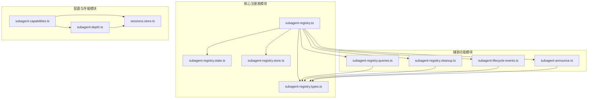
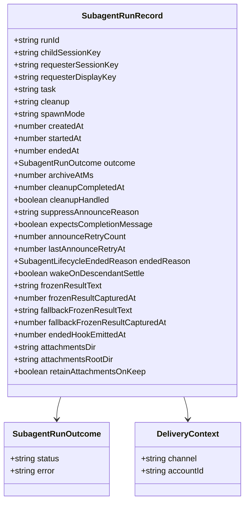
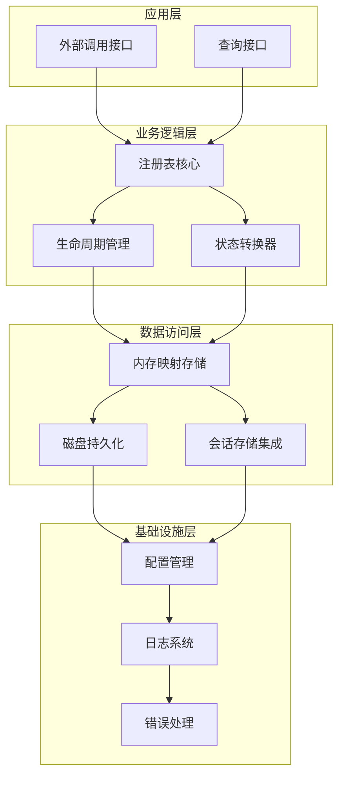
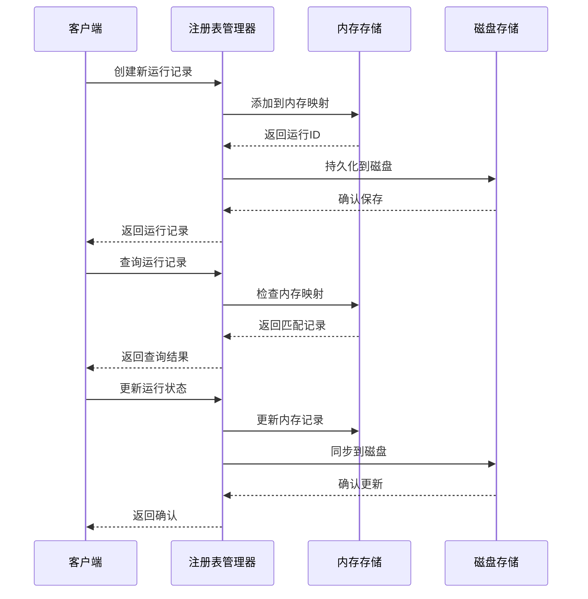
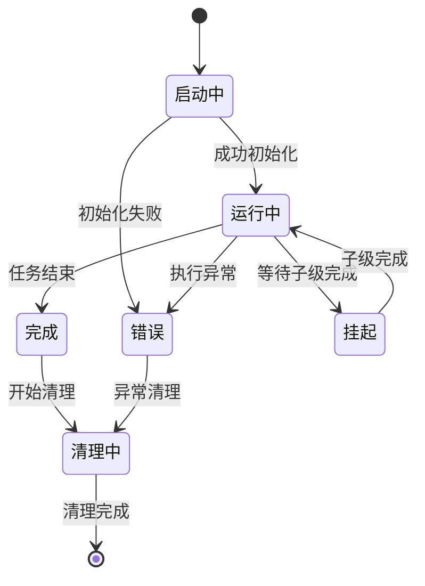
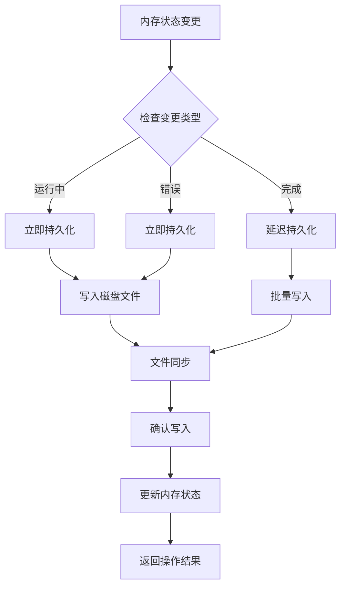
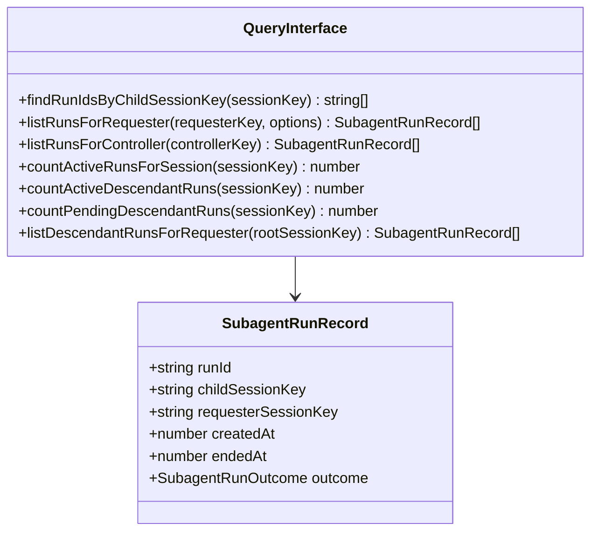
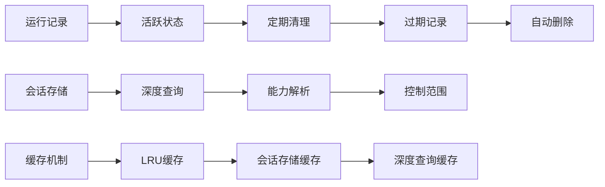
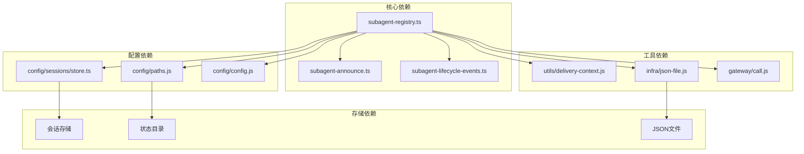

# 子代理注册表管理

<cite>
**本文档引用的文件**
- [subagent-registry.ts](file://src/agents/subagent-registry.ts)
- [subagent-registry.types.ts](file://src/agents/subagent-registry.types.ts)
- [subagent-registry.state.ts](file://src/agents/subagent-registry-state.ts)
- [subagent-registry.store.ts](file://src/agents/subagent-registry.store.ts)
- [subagent-registry.queries.ts](file://src/agents/subagent-registry-queries.ts)
- [subagent-registry.cleanup.ts](file://src/agents/subagent-registry-cleanup.ts)
- [subagent-lifecycle-events.ts](file://src/agents/subagent-lifecycle-events.ts)
- [subagent-announce.ts](file://src/agents/subagent-announce.ts)
- [subagent-capabilities.ts](file://src/agents/subagent-capabilities.ts)
- [subagent-depth.ts](file://src/agents/subagent-depth.ts)
- [sessions.store.ts](file://src/config/sessions/store.ts)
</cite>

## 目录
1. [简介](#简介)
2. [项目结构](#项目结构)
3. [核心组件](#核心组件)
4. [架构概览](#架构概览)
5. [详细组件分析](#详细组件分析)
6. [依赖关系分析](#依赖关系分析)
7. [性能考虑](#性能考虑)
8. [故障排除指南](#故障排除指南)
9. [结论](#结论)

## 简介

子代理注册表管理系统是 OpenClaw 框架中的关键组件，负责管理子代理运行实例的完整生命周期。该系统提供了运行记录的创建、更新、查询和清理功能，支持复杂的子代理状态管理，包括启动、运行中、完成、错误等状态转换。

系统采用内存映射存储与磁盘持久化相结合的策略，确保在进程重启后能够恢复运行状态。通过会话存储集成，系统能够跟踪子代理与其父会话之间的关系，并提供丰富的查询接口来检索运行记录。

## 项目结构

子代理注册表管理系统的文件组织遵循模块化设计原则，主要包含以下核心模块：

**图表来源**
- [subagent-registry.ts:1-800](file://src/agents/subagent-registry.ts#L1-L800)
- [subagent-registry.types.ts:1-59](file://src/agents/subagent-registry.types.ts#L1-L59)
- [subagent-registry.store.ts:1-132](file://src/agents/subagent-registry.store.ts#L1-L132)

**章节来源**
- [subagent-registry.ts:1-800](file://src/agents/subagent-registry.ts#L1-L800)
- [subagent-registry.types.ts:1-59](file://src/agents/subagent-registry.types.ts#L1-L59)
- [subagent-registry.store.ts:1-132](file://src/agents/subagent-registry.store.ts#L1-L132)

## 核心组件

### 数据结构定义

子代理运行记录使用统一的数据结构来表示所有相关信息：

**图表来源**
- [subagent-registry.types.ts:6-58](file://src/agents/subagent-registry.types.ts#L6-L58)

### 状态管理机制

系统实现了完整的生命周期状态管理，包括：

- **运行状态**: `running` - 子代理正在执行任务
- **完成状态**: `done` - 子代理成功完成任务
- **失败状态**: `failed` - 子代理执行过程中发生错误
- **挂起状态**: `active (waiting on children)` - 子代理等待子级完成

**章节来源**
- [subagent-control.ts:170-187](file://src/agents/subagent-control.ts#L170-L187)
- [subagent-registry.types.ts:6-58](file://src/agents/subagent-registry.types.ts#L6-L58)

## 架构概览

子代理注册表管理系统采用分层架构设计，各层职责明确：

**图表来源**
- [subagent-registry.ts:1483-1485](file://src/agents/subagent-registry.ts#L1483-L1485)
- [subagent-registry.state.ts:37-56](file://src/agents/subagent-registry-state.ts#L37-L56)

## 详细组件分析

### 注册表核心管理器

注册表核心管理器负责维护所有子代理运行记录的内存映射，并提供完整的 CRUD 操作：

**图表来源**
- [subagent-registry.ts:135-137](file://src/agents/subagent-registry.ts#L135-L137)
- [subagent-registry.state.ts:7-13](file://src/agents/subagent-registry-state.ts#L7-L13)

### 生命周期管理流程

系统实现了复杂的生命周期管理，支持多种状态转换：

**图表来源**
- [subagent-lifecycle-events.ts:8-19](file://src/agents/subagent-lifecycle-events.ts#L8-L19)
- [subagent-registry.ts:451-530](file://src/agents/subagent-registry.ts#L451-L530)

### 持久化机制

系统采用双层持久化策略，确保数据安全性和可靠性：

**图表来源**
- [subagent-registry.store.ts:120-131](file://src/agents/subagent-registry.store.ts#L120-L131)
- [subagent-registry.state.ts:7-13](file://src/agents/subagent-registry-state.ts#L7-L13)

**章节来源**
- [subagent-registry.ts:135-137](file://src/agents/subagent-registry.ts#L135-L137)
- [subagent-registry.store.ts:48-118](file://src/agents/subagent-registry.store.ts#L48-L118)

### 查询接口实现

系统提供了多种查询接口，支持灵活的数据检索：

**图表来源**
- [subagent-registry.queries.ts:8-87](file://src/agents/subagent-registry-queries.ts#L8-L87)
- [subagent-registry.ts:1430-1481](file://src/agents/subagent-registry.ts#L1430-L1481)

**章节来源**
- [subagent-registry.queries.ts:1-87](file://src/agents/subagent-registry-queries.ts#L1-L87)
- [subagent-registry.ts:1430-1481](file://src/agents/subagent-registry.ts#L1430-L1481)

### 内存管理策略

系统采用了智能的内存管理策略，平衡内存使用和性能：

**图表来源**
- [subagent-depth.ts:124-155](file://src/agents/subagent-depth.ts#L124-L155)
- [subagent-capabilities.ts:122-156](file://src/agents/subagent-capabilities.ts#L122-L156)

**章节来源**
- [subagent-depth.ts:124-155](file://src/agents/subagent-depth.ts#L124-L155)
- [subagent-capabilities.ts:122-156](file://src/agents/subagent-capabilities.ts#L122-L156)

## 依赖关系分析

子代理注册表管理系统与其他组件存在紧密的依赖关系：

**图表来源**
- [subagent-registry.ts:1-62](file://src/agents/subagent-registry.ts#L1-L62)
- [subagent-announce.ts:1-50](file://src/agents/subagent-announce.ts#L1-L50)

**章节来源**
- [subagent-registry.ts:1-62](file://src/agents/subagent-registry.ts#L1-L62)
- [subagent-announce.ts:1-50](file://src/agents/subagent-announce.ts#L1-L50)

## 性能考虑

系统在设计时充分考虑了性能优化：

### 内存优化
- 使用 `Map` 数据结构提供 O(1) 的查找性能
- 实现增量持久化，避免频繁的磁盘 I/O 操作
- 采用缓存机制减少重复的会话存储读取

### 并发处理
- 支持多进程环境下的状态同步
- 实现原子性的状态更新操作
- 提供无锁的数据访问模式

### 资源管理
- 自动清理过期的运行记录
- 智能的内存使用监控
- 可配置的资源限制参数

## 故障排除指南

### 常见问题诊断

**运行记录丢失**
- 检查磁盘权限和存储空间
- 验证 JSON 文件格式正确性
- 确认持久化操作的完整性

**状态同步问题**
- 检查进程间通信机制
- 验证并发访问控制
- 确认状态转换的原子性

**内存泄漏检测**
- 监控运行记录的数量增长
- 检查孤儿运行记录的清理
- 验证定时器的正确释放

**章节来源**
- [subagent-registry.ts:125-133](file://src/agents/subagent-registry.ts#L125-L133)
- [subagent-registry.ts:184-225](file://src/agents/subagent-registry.ts#L184-L225)

## 结论

子代理注册表管理系统是一个功能完整、设计合理的子代理生命周期管理解决方案。系统通过精心设计的数据结构、完善的持久化机制和高效的查询接口，为 OpenClaw 框架提供了强大的子代理管理能力。

系统的主要优势包括：
- **可靠性**: 双层持久化策略确保数据安全
- **可扩展性**: 模块化设计支持功能扩展
- **性能**: 智能缓存和优化算法提升响应速度
- **易用性**: 丰富的查询接口简化开发工作

未来可以考虑的改进方向：
- 增加更多的监控和告警机制
- 优化大规模运行记录的处理性能
- 提供更细粒度的权限控制选项