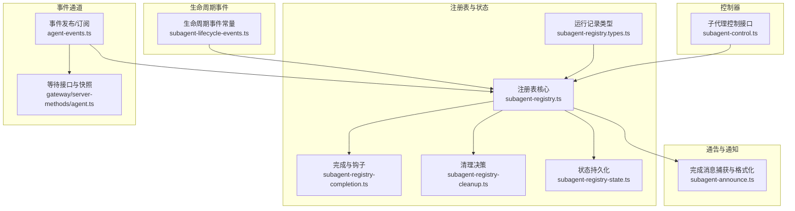
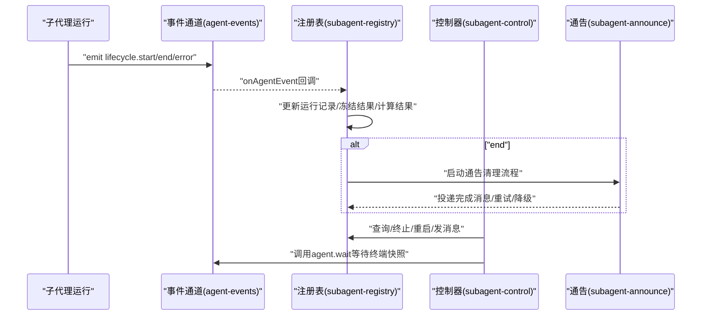
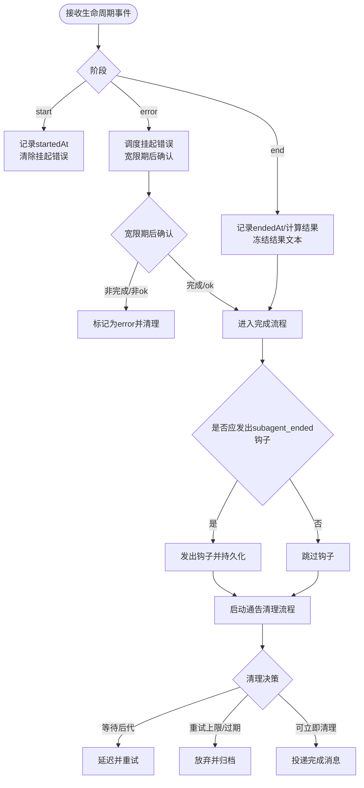
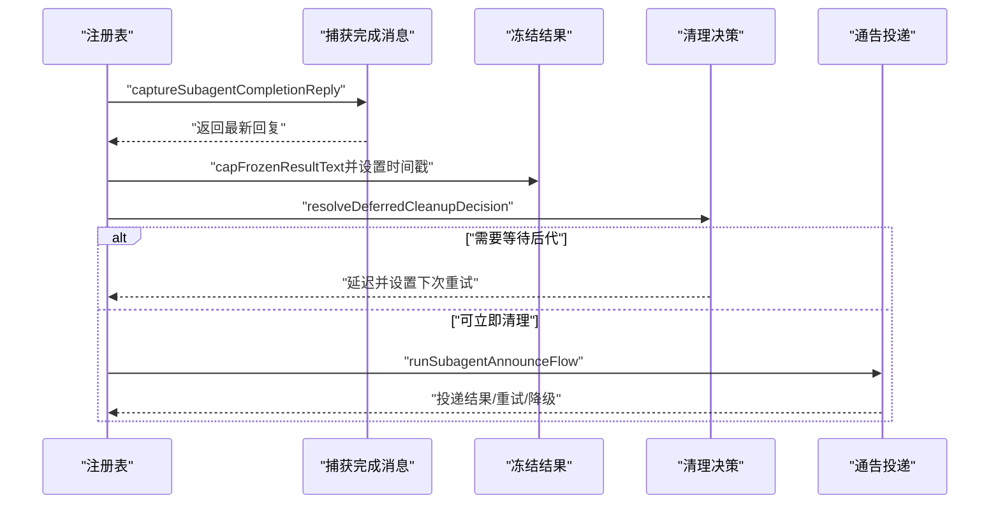
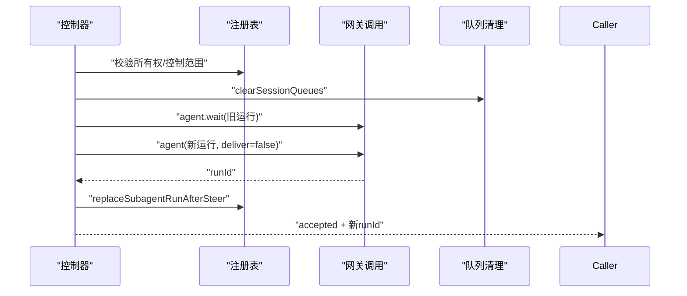
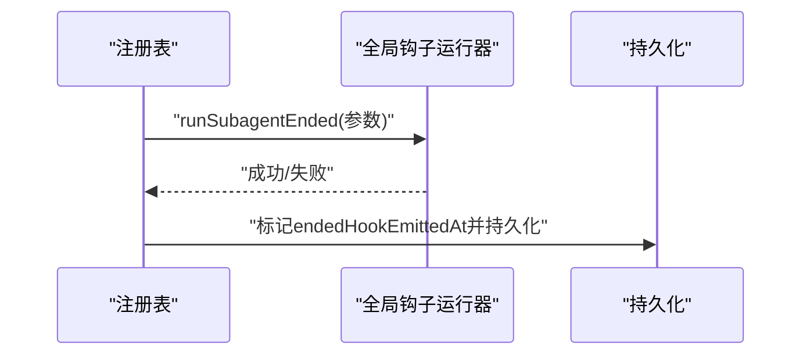
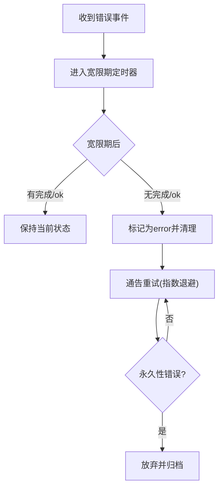
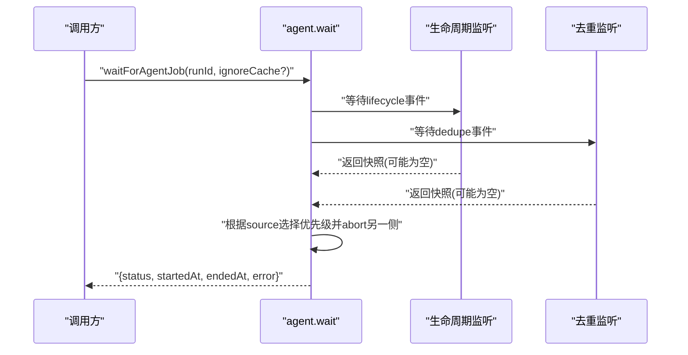
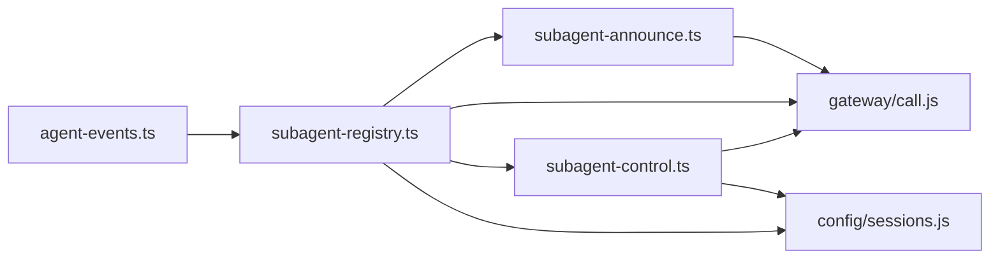

# 子代理生命周期控制

<cite>
**本文引用的文件**
- [subagent-lifecycle-events.ts](file://src/agents/subagent-lifecycle-events.ts)
- [subagent-control.ts](file://src/agents/subagent-control.ts)
- [subagent-registry.ts](file://src/agents/subagent-registry.ts)
- [subagent-registry.types.ts](file://src/agents/subagent-registry.types.ts)
- [subagent-registry-completion.ts](file://src/agents/subagent-registry-completion.ts)
- [subagent-registry-cleanup.ts](file://src/agents/subagent-registry-cleanup.ts)
- [subagent-registry-state.ts](file://src/agents/subagent-registry-state.ts)
- [subagent-announce.ts](file://src/agents/subagent-announce.ts)
- [agent-events.ts](file://src/infra/agent-events.ts)
- [agent.ts](file://src/gateway/server-methods/agent.ts)
- [server-methods.test.ts](file://src/gateway/server-methods/server-methods.test.ts)
</cite>

## 目录
1. [简介](#简介)
2. [项目结构](#项目结构)
3. [核心组件](#核心组件)
4. [架构总览](#架构总览)
5. [详细组件分析](#详细组件分析)
6. [依赖关系分析](#依赖关系分析)
7. [性能考量](#性能考量)
8. [故障排查指南](#故障排查指南)
9. [结论](#结论)
10. [附录](#附录)

## 简介
本文件系统化阐述子代理生命周期控制系统的设计与实现，覆盖从创建到销毁的全链路管理：生命周期事件触发机制（开始/结束/错误）、状态转换规则与条件判断、完成流程（结果冻结、清理与通知）、监听与处理、错误处理与恢复策略（重试与降级），以及生命周期钩子的使用与扩展方式。目标是帮助开发者与运维人员准确理解并高效使用该系统。

## 项目结构
围绕子代理生命周期的关键模块如下：
- 事件与状态：生命周期事件常量、结束原因与结果映射、运行记录类型
- 注册表：运行记录的内存/磁盘持久化、监听器、完成与清理流程
- 控制器：对子代理运行进行终止、重启（“steer”）与消息发送
- 通告与通知：完成消息的构建、投递与重试、降级策略
- 事件通道：全局事件发布/订阅，供上层等待与聚合

**图表来源**
- [subagent-lifecycle-events.ts:1-48](file://src/agents/subagent-lifecycle-events.ts#L1-L48)
- [subagent-registry.types.ts:6-58](file://src/agents/subagent-registry.types.ts#L6-L58)
- [subagent-registry.ts:65-137](file://src/agents/subagent-registry.ts#L65-L137)
- [subagent-registry-completion.ts:44-96](file://src/agents/subagent-registry-completion.ts#L44-L96)
- [subagent-registry-cleanup.ts:23-74](file://src/agents/subagent-registry-cleanup.ts#L23-L74)
- [subagent-registry-state.ts:7-56](file://src/agents/subagent-registry-state.ts#L7-L56)
- [subagent-control.ts:526-784](file://src/agents/subagent-control.ts#L526-L784)
- [subagent-announce.ts:332-343](file://src/agents/subagent-announce.ts#L332-L343)
- [agent-events.ts:62-88](file://src/infra/agent-events.ts#L62-L88)
- [agent.ts:742-771](file://src/gateway/server-methods/agent.ts#L742-L771)

**章节来源**
- [subagent-lifecycle-events.ts:1-48](file://src/agents/subagent-lifecycle-events.ts#L1-L48)
- [subagent-registry.types.ts:6-58](file://src/agents/subagent-registry.types.ts#L6-L58)
- [subagent-registry.ts:65-137](file://src/agents/subagent-registry.ts#L65-L137)
- [subagent-control.ts:526-784](file://src/agents/subagent-control.ts#L526-L784)
- [subagent-announce.ts:332-343](file://src/agents/subagent-announce.ts#L332-L343)
- [agent-events.ts:62-88](file://src/infra/agent-events.ts#L62-L88)
- [agent.ts:742-771](file://src/gateway/server-methods/agent.ts#L742-L771)

## 核心组件
- 生命周期事件与结果映射
  - 结束原因：完成、错误、被杀、会话重置、会话删除
  - 结果映射：ok/error/timeout/killed/reset/deleted
  - 会话类结束原因到结果的解析
- 运行记录类型
  - 包含运行标识、子会话键、控制器键、请求者信息、任务、超时、标签、时间戳、结果、归档时间、清理状态、抑制原因、期望完成消息、重试计数与时间、最终生命周期原因、冻结结果文本及其时间、回退冻结结果及其时间、钩子已发射时间、附件目录等
- 注册表核心
  - 内存Map存储运行记录，支持磁盘持久化/恢复
  - 全局事件监听器，按阶段处理start/end/error
  - 完成流程：冻结结果、计算生命周期结果、决定是否延迟或立即发出subagent_ended钩子、启动通告清理流程
  - 清理流程：基于重试上限、过期时间、是否需要等待后代完成等策略进行重试/放弃
- 控制器接口
  - 终止受控子代理运行（级联终止）
  - “steer”重启（带速率限制、清理队列、等待旧运行稳定、发起新运行）
  - 发送消息给受控子代理并等待结果
- 通告与通知
  - 捕获完成消息、格式化统计信息、构建完成摘要
  - 面向外部渠道的投递与重试，区分瞬时与永久性错误
  - 对内部子代理场景的特殊处理（如直接路由、线程绑定保留）

**章节来源**
- [subagent-lifecycle-events.ts:8-47](file://src/agents/subagent-lifecycle-events.ts#L8-L47)
- [subagent-registry.types.ts:6-58](file://src/agents/subagent-registry.types.ts#L6-L58)
- [subagent-registry.ts:451-530](file://src/agents/subagent-registry.ts#L451-L530)
- [subagent-registry.ts:532-579](file://src/agents/subagent-registry.ts#L532-L579)
- [subagent-control.ts:416-524](file://src/agents/subagent-control.ts#L416-L524)
- [subagent-control.ts:526-760](file://src/agents/subagent-control.ts#L526-L760)
- [subagent-announce.ts:332-343](file://src/agents/subagent-announce.ts#L332-L343)
- [subagent-announce.ts:595-800](file://src/agents/subagent-announce.ts#L595-L800)

## 架构总览
子代理生命周期由“事件驱动 + 注册表状态机 + 控制器动作 + 通告清理”的多层协作构成。事件通道负责将生命周期事件广播；注册表根据事件推进状态并触发完成与清理；控制器在受控范围内执行终止、重启与消息发送；通告模块负责完成消息的构建与投递，并具备重试与降级能力。

**图表来源**
- [agent-events.ts:62-88](file://src/infra/agent-events.ts#L62-L88)
- [subagent-registry.ts:765-820](file://src/agents/subagent-registry.ts#L765-L820)
- [subagent-registry.ts:532-579](file://src/agents/subagent-registry.ts#L532-L579)
- [subagent-control.ts:526-760](file://src/agents/subagent-control.ts#L526-L760)
- [agent.ts:742-771](file://src/gateway/server-methods/agent.ts#L742-L771)

## 详细组件分析

### 生命周期事件与状态转换
- 触发机制
  - 通过事件通道发布“lifecycle”流事件，包含runId、阶段(phase)、时间戳与数据
  - 注册表监听器仅处理生命周期事件，按阶段执行不同分支
- 状态转换规则
  - start：记录startedAt，清除挂起的错误
  - end：计算endedAt，根据aborted标记映射为timeout或ok，冻结结果，进入完成流程
  - error：延迟处理，避免瞬时错误导致过早清理，待宽限期后确认再落定为error
- 条件判断逻辑
  - 是否延迟错误：存在挂起错误定时器则延后
  - 是否冻结结果：首次完成时捕获并截断至最大字节
  - 是否发出subagent_ended钩子：取决于是否保留线程绑定、是否抑制通告（如steer-restart）

**图表来源**
- [agent-events.ts:62-88](file://src/infra/agent-events.ts#L62-L88)
- [subagent-registry.ts:765-820](file://src/agents/subagent-registry.ts#L765-L820)
- [subagent-registry.ts:279-313](file://src/agents/subagent-registry.ts#L279-L313)
- [subagent-registry.ts:451-530](file://src/agents/subagent-registry.ts#L451-L530)
- [subagent-registry.ts:532-579](file://src/agents/subagent-registry.ts#L532-L579)
- [subagent-registry-cleanup.ts:33-74](file://src/agents/subagent-registry-cleanup.ts#L33-L74)

**章节来源**
- [agent-events.ts:62-88](file://src/infra/agent-events.ts#L62-L88)
- [subagent-registry.ts:765-820](file://src/agents/subagent-registry.ts#L765-L820)
- [subagent-registry.ts:279-313](file://src/agents/subagent-registry.ts#L279-L313)
- [subagent-registry.ts:451-530](file://src/agents/subagent-registry.ts#L451-L530)
- [subagent-registry-cleanup.ts:33-74](file://src/agents/subagent-registry-cleanup.ts#L33-L74)

### 完成流程：结果冻结、清理与通知
- 结果冻结
  - 首次完成时捕获最新助手回复作为冻结结果，超过阈值自动截断并附加提示
  - 后续可能刷新（针对仍在等待后代完成的会话）
- 清理流程
  - 基于重试次数、过期时间、是否需要等待后代完成等，决定重试、延迟或放弃
  - 支持“完成消息流”硬性过期上限，防止无限等待
- 通知机制
  - 构建完成摘要、统计信息，投递至请求者所在渠道
  - 对瞬时错误进行指数退避重试，对永久性错误直接放弃
  - 对内部子代理场景采用直连或队列化处理

**图表来源**
- [subagent-registry.ts:379-449](file://src/agents/subagent-registry.ts#L379-L449)
- [subagent-registry.ts:532-579](file://src/agents/subagent-registry.ts#L532-L579)
- [subagent-registry-cleanup.ts:33-74](file://src/agents/subagent-registry-cleanup.ts#L33-L74)
- [subagent-announce.ts:332-343](file://src/agents/subagent-announce.ts#L332-L343)
- [subagent-announce.ts:595-800](file://src/agents/subagent-announce.ts#L595-L800)

**章节来源**
- [subagent-registry.ts:379-449](file://src/agents/subagent-registry.ts#L379-L449)
- [subagent-registry.ts:532-579](file://src/agents/subagent-registry.ts#L532-L579)
- [subagent-registry-cleanup.ts:33-74](file://src/agents/subagent-registry-cleanup.ts#L33-L74)
- [subagent-announce.ts:332-343](file://src/agents/subagent-announce.ts#L332-L343)
- [subagent-announce.ts:595-800](file://src/agents/subagent-announce.ts#L595-L800)

### 控制器：终止、重启与消息发送
- 终止受控子代理运行
  - 校验所有权与控制范围，终止当前运行并级联终止其所有后代
  - 清理队列、标记终止原因、记录abortedLastRun
- 重启（steer）
  - 速率限制、幂等键、清理队列、等待旧运行稳定、发起新运行
  - 替换运行记录，返回接受重启并携带新runId
- 发送消息
  - 构造内部消息通道请求，等待agent.wait获取终端状态
  - 提取最后一条非工具消息中的助手文本作为回复

**图表来源**
- [subagent-control.ts:526-685](file://src/agents/subagent-control.ts#L526-L685)
- [subagent-control.ts:687-760](file://src/agents/subagent-control.ts#L687-L760)

**章节来源**
- [subagent-control.ts:416-524](file://src/agents/subagent-control.ts#L416-L524)
- [subagent-control.ts:526-685](file://src/agents/subagent-control.ts#L526-L685)
- [subagent-control.ts:687-760](file://src/agents/subagent-control.ts#L687-L760)

### 生命周期钩子与监听
- 钩子触发
  - 在完成流程中，若满足条件则仅一次性发出subagent_ended钩子，避免重复触发
  - 钩子参数包含目标会话键、目标类型、原因、发送告别、账户ID、运行ID、结束时间、生命周期结果与错误
- 监听与处理
  - 通过全局钩子运行器统一注册与执行
  - 注册表维护“飞行中”集合，避免并发重复触发

**图表来源**
- [subagent-registry-completion.ts:44-96](file://src/agents/subagent-registry-completion.ts#L44-L96)

**章节来源**
- [subagent-registry-completion.ts:44-96](file://src/agents/subagent-registry-completion.ts#L44-L96)

### 错误处理与恢复策略
- 错误分类
  - 瞬时错误：网络不可达、网关未连接、超时等，允许重试
  - 永久错误：未知渠道、用户屏蔽、会话不存在等，直接放弃
- 恢复策略
  - 通告投递：指数退避重试，最多固定次数
  - 生命周期错误：延迟宽限期（避免瞬时错误导致过早清理），到期后确认为error
  - 清理流程：根据重试次数、过期时间、是否等待后代完成，决定重试、延迟或放弃

**图表来源**
- [subagent-registry.ts:279-313](file://src/agents/subagent-registry.ts#L279-L313)
- [subagent-announce.ts:104-140](file://src/agents/subagent-announce.ts#L104-L140)
- [subagent-registry-cleanup.ts:54-74](file://src/agents/subagent-registry-cleanup.ts#L54-L74)

**章节来源**
- [subagent-registry.ts:279-313](file://src/agents/subagent-registry.ts#L279-L313)
- [subagent-announce.ts:104-140](file://src/agents/subagent-announce.ts#L104-L140)
- [subagent-registry-cleanup.ts:54-74](file://src/agents/subagent-registry-cleanup.ts#L54-L74)

### 等待与快照：生命周期事件与等待接口
- 等待接口
  - agent.wait支持忽略缓存快照，强制等待新鲜事件
  - 当收到lifecycle与dedupe两类事件时，通过abort控制器选择优先级，避免重复响应
- 测试验证
  - 单测验证了生命周期end事件中aborted=true映射为timeout，且可忽略缓存等待新事件

**图表来源**
- [agent.ts:742-771](file://src/gateway/server-methods/agent.ts#L742-L771)
- [server-methods.test.ts:24-109](file://src/gateway/server-methods/server-methods.test.ts#L24-L109)

**章节来源**
- [agent.ts:742-771](file://src/gateway/server-methods/agent.ts#L742-L771)
- [server-methods.test.ts:24-109](file://src/gateway/server-methods/server-methods.test.ts#L24-L109)

## 依赖关系分析
- 耦合与内聚
  - 注册表高度内聚：事件监听、完成流程、清理流程、持久化在同一模块
  - 控制器与注册表松耦合：通过运行记录与会话键交互
  - 通告模块独立：面向外部渠道的投递逻辑，与注册表完成流程解耦
- 外部依赖
  - 事件通道：全局事件发布/订阅
  - 网关调用：用于agent.wait、agent、sessions.delete等RPC
  - 配置与会话存储：用于解析会话键、模型、令牌用量等

**图表来源**
- [agent-events.ts:62-88](file://src/infra/agent-events.ts#L62-L88)
- [subagent-registry.ts:1-60](file://src/agents/subagent-registry.ts#L1-L60)
- [subagent-control.ts:1-50](file://src/agents/subagent-control.ts#L1-L50)
- [subagent-announce.ts:1-50](file://src/agents/subagent-announce.ts#L1-L50)

**章节来源**
- [agent-events.ts:62-88](file://src/infra/agent-events.ts#L62-L88)
- [subagent-registry.ts:1-60](file://src/agents/subagent-registry.ts#L1-L60)
- [subagent-control.ts:1-50](file://src/agents/subagent-control.ts#L1-L50)
- [subagent-announce.ts:1-50](file://src/agents/subagent-announce.ts#L1-L50)

## 性能考量
- 事件监听与缓存
  - 注册表监听器仅处理生命周期事件，减少无关处理开销
  - 快照缓存与忽略缓存选项，避免陈旧状态阻塞等待
- 冷启动与恢复
  - 启动时恢复磁盘持久化运行记录，必要时重新触发等待与清理
- 重试与退避
  - 通告投递采用指数退避，避免对下游造成压力尖峰
- 字节截断
  - 冻结结果文本截断，避免超大消息影响传输与存储

[本节为通用指导，不直接分析具体文件]

## 故障排查指南
- 等待超时
  - 检查生命周期end事件是否携带aborted=true，这会被映射为timeout
  - 使用ignoreCachedSnapshot强制等待新鲜事件
- 通告投递失败
  - 区分瞬时与永久性错误，瞬时错误会自动重试，永久性错误直接放弃
  - 检查渠道配置、会话有效性与路由绑定
- 运行记录异常
  - 查看运行记录中的endedReason、outcome、cleanupCompletedAt、endedHookEmittedAt等字段
  - 确认是否被归档或清理完成
- 控制器操作受限
  - 确认控制范围是否为children，以及所有权校验是否通过
  - 检查速率限制与steer-restart抑制

**章节来源**
- [server-methods.test.ts:24-109](file://src/gateway/server-methods/server-methods.test.ts#L24-L109)
- [subagent-registry.ts:532-579](file://src/agents/subagent-registry.ts#L532-L579)
- [subagent-announce.ts:104-140](file://src/agents/subagent-announce.ts#L104-L140)
- [subagent-control.ts:526-685](file://src/agents/subagent-control.ts#L526-L685)

## 结论
该子代理生命周期控制系统以事件驱动为核心，结合注册表状态机、控制器动作与通告清理，实现了从创建到销毁的闭环管理。通过明确的生命周期事件、严格的状态转换规则、完善的完成流程与错误恢复策略，系统在可靠性与可观测性方面表现稳健。钩子机制与通知模块进一步增强了扩展性与用户体验。

[本节为总结性内容，不直接分析具体文件]

## 附录
- 关键类型与常量
  - 生命周期结束原因与结果映射
  - 运行记录字段说明
- 常用操作路径
  - 注册表初始化与监听：[subagent-registry.ts:765-820](file://src/agents/subagent-registry.ts#L765-L820)
  - 完成与清理：[subagent-registry.ts:451-530](file://src/agents/subagent-registry.ts#L451-L530)
  - 控制器操作：[subagent-control.ts:526-760](file://src/agents/subagent-control.ts#L526-L760)
  - 通告投递：[subagent-announce.ts:595-800](file://src/agents/subagent-announce.ts#L595-L800)
  - 事件通道：[agent-events.ts:62-88](file://src/infra/agent-events.ts#L62-L88)
  - 等待接口与快照：[agent.ts:742-771](file://src/gateway/server-methods/agent.ts#L742-L771)

[本节为补充说明，不直接分析具体文件]