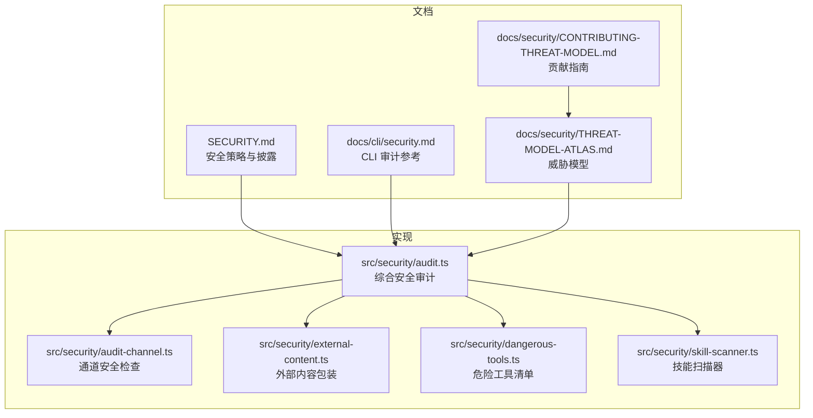
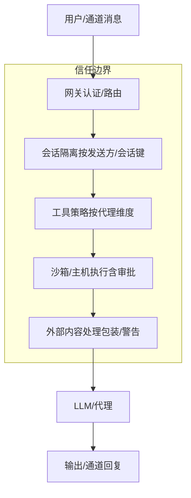
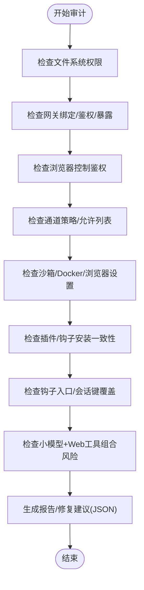
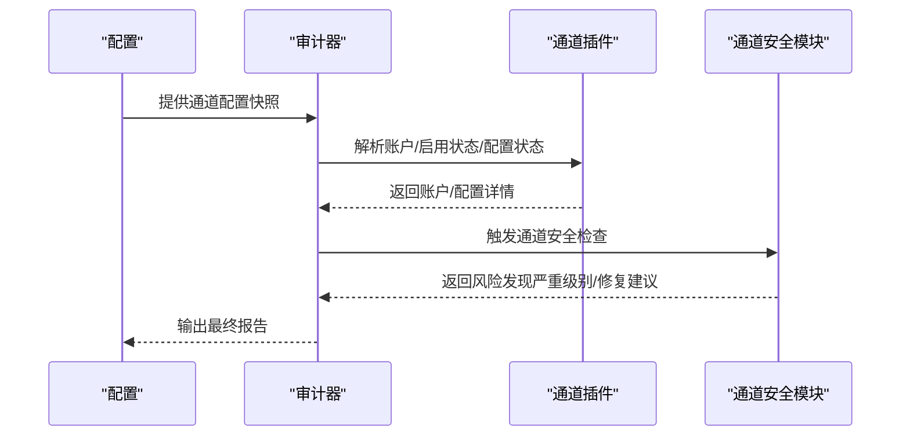
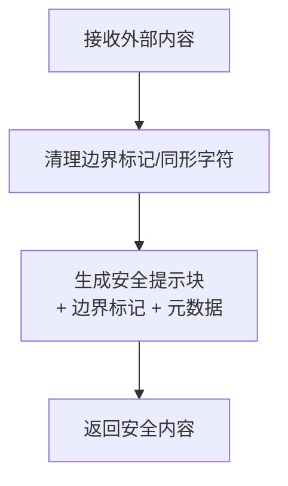
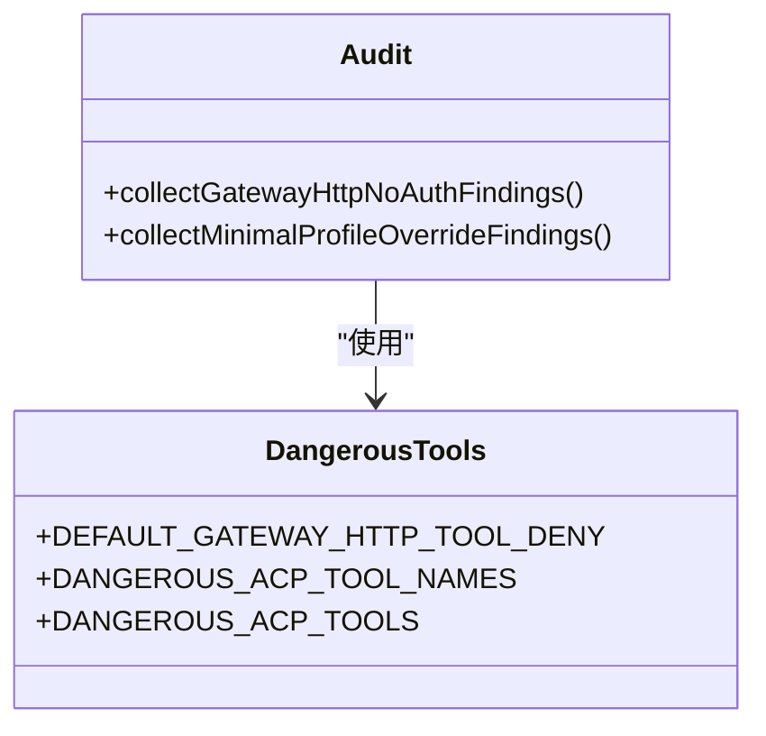
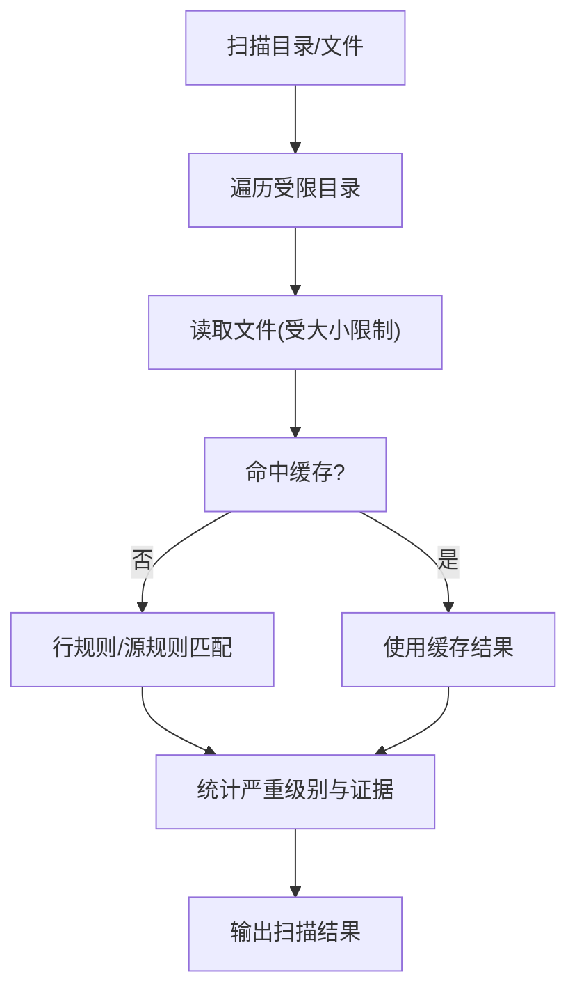
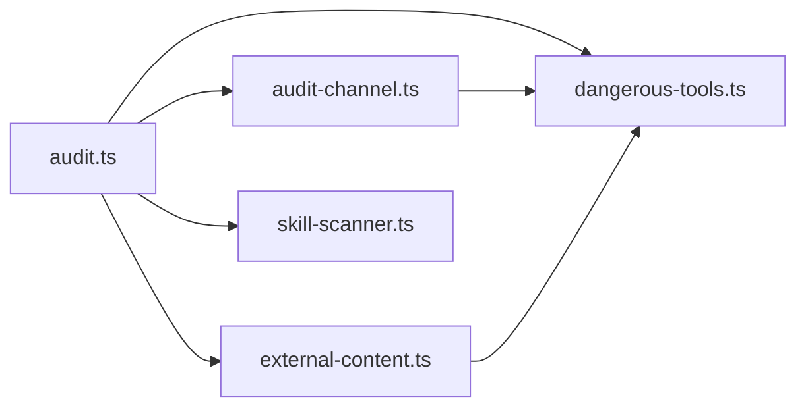

# 安全与权限

<cite>
**本文引用的文件**
- [SECURITY.md](file://SECURITY.md)
- [docs/cli/security.md](file://docs/cli/security.md)
- [docs/security/CONTRIBUTING-THREAT-MODEL.md](file://docs/security/CONTRIBUTING-THREAT-MODEL.md)
- [docs/security/THREAT-MODEL-ATLAS.md](file://docs/security/THREAT-MODEL-ATLAS.md)
- [src/security/audit.ts](file://src/security/audit.ts)
- [src/security/audit-channel.ts](file://src/security/audit-channel.ts)
- [src/security/audit-tool-policy.ts](file://src/security/audit-tool-policy.ts)
- [src/security/dangerous-tools.ts](file://src/security/dangerous-tools.ts)
- [src/security/external-content.ts](file://src/security/external-content.ts)
- [src/security/skill-scanner.ts](file://src/security/skill-scanner.ts)
</cite>

## 目录
1. [引言](#引言)
2. [项目结构](#项目结构)
3. [核心组件](#核心组件)
4. [架构总览](#架构总览)
5. [详细组件分析](#详细组件分析)
6. [依赖关系分析](#依赖关系分析)
7. [性能考量](#性能考量)
8. [故障排查指南](#故障排查指南)
9. [结论](#结论)
10. [附录](#附录)

## 引言
本文件系统化阐述 OpenClaw 的安全模型与权限控制体系，覆盖沙箱机制、访问控制策略、数据保护、威胁建模与缓解、安全审计与修复、漏洞管理与应急响应、合规与最佳实践以及安全测试指南。内容以仓库内现有安全文档与实现为依据，确保可追溯与可操作。

## 项目结构
围绕安全与权限的关键目录与文件：
- 文档层：安全策略、威胁模型、CLI 审计参考
- 实现层：安全审计器、通道安全检查、外部内容包装、危险工具清单、技能扫描器等

图示来源
- [SECURITY.md](file://SECURITY.md)
- [docs/cli/security.md](file://docs/cli/security.md)
- [docs/security/THREAT-MODEL-ATLAS.md](file://docs/security/THREAT-MODEL-ATLAS.md)
- [docs/security/CONTRIBUTING-THREAT-MODEL.md](file://docs/security/CONTRIBUTING-THREAT-MODEL.md)
- [src/security/audit.ts](file://src/security/audit.ts)
- [src/security/audit-channel.ts](file://src/security/audit-channel.ts)
- [src/security/external-content.ts](file://src/security/external-content.ts)
- [src/security/dangerous-tools.ts](file://src/security/dangerous-tools.ts)
- [src/security/skill-scanner.ts](file://src/security/skill-scanner.ts)

章节来源
- [SECURITY.md](file://SECURITY.md)
- [docs/cli/security.md](file://docs/cli/security.md)
- [docs/security/THREAT-MODEL-ATLAS.md](file://docs/security/THREAT-MODEL-ATLAS.md)
- [docs/security/CONTRIBUTING-THREAT-MODEL.md](file://docs/security/CONTRIBUTING-THREAT-MODEL.md)
- [src/security/audit.ts](file://src/security/audit.ts)
- [src/security/audit-channel.ts](file://src/security/audit-channel.ts)
- [src/security/external-content.ts](file://src/security/external-content.ts)
- [src/security/dangerous-tools.ts](file://src/security/dangerous-tools.ts)
- [src/security/skill-scanner.ts](file://src/security/skill-scanner.ts)

## 核心组件
- 安全审计器：聚合文件系统、网关暴露、浏览器控制、通道策略、插件与钩子、沙箱设置、危险参数等检查，并支持深审与自动修复建议。
- 通道安全检查：针对 Discord、Slack、Telegram、Zalouser 等通道的允许列表、组路由、DM 策略与互操作风险进行评估。
- 外部内容包装：对外部输入（邮件、Webhook、Web 搜索/抓取）进行边界标记、安全提示与元数据封装，降低注入与误导风险。
- 危险工具清单：集中定义高危工具（如会话编排、网关控制、交互式登录、执行类等），统一在 HTTP 工具调用与 ACP 场景中约束。
- 技能扫描器：对技能源码进行规则扫描（动态执行、命令执行、可疑网络、环境变量读取、潜在窃密等），辅助供应链安全。

章节来源
- [src/security/audit.ts](file://src/security/audit.ts)
- [src/security/audit-channel.ts](file://src/security/audit-channel.ts)
- [src/security/external-content.ts](file://src/security/external-content.ts)
- [src/security/dangerous-tools.ts](file://src/security/dangerous-tools.ts)
- [src/security/skill-scanner.ts](file://src/security/skill-scanner.ts)

## 架构总览
OpenClaw 的信任模型采用“个人助理”模式：以受信操作者为中心，通过多层边界与控制面（认证、路由、工具策略、沙箱、外部内容处理）共同构成安全基线。威胁模型基于 MITRE ATLAS，识别从侦察、初始访问、执行到持久化、防御规避、发现、数据窃取与影响的完整攻击链。

图示来源
- [docs/security/THREAT-MODEL-ATLAS.md](file://docs/security/THREAT-MODEL-ATLAS.md)

章节来源
- [docs/security/THREAT-MODEL-ATLAS.md](file://docs/security/THREAT-MODEL-ATLAS.md)

## 详细组件分析

### 组件一：安全审计器（综合）
- 职责：收集并汇总各类安全风险，输出严重级别与修复建议；支持深审探测网关可达性与鉴权状态；可按需输出 JSON 供 CI 使用。
- 关键能力：
  - 文件系统权限检查（状态目录、配置文件）
  - 网关绑定与鉴权检查（token/password/trusted-proxy）、反向代理可信度、mDNS 元数据泄露、Tailscale 暴露模式
  - 浏览器控制鉴权缺失告警
  - 钩子入口与会话键覆盖风险
  - 沙箱相关危险配置与 Docker 设置
  - 插件/钩子安装一致性与变更漂移
  - 通道策略与允许列表稳定性（Discord/Slack/Telegram/Zalouser）
  - 小模型与 Web/Browser 工具组合的风险提示
- 修复建议：自动收紧敏感文件权限、切换默认日志脱敏范围、将开放群策略改为白名单、提升通道允许列表稳定性等。

图示来源
- [src/security/audit.ts](file://src/security/audit.ts)

章节来源
- [src/security/audit.ts](file://src/security/audit.ts)
- [docs/cli/security.md](file://docs/cli/security.md)

### 组件二：通道安全检查（按通道）
- 职责：针对各通道的允许列表、组路由、DM 策略与互操作风险进行专项审计。
- 关键点：
  - Discord：斜杠命令启用时的访问组策略、公会/频道用户白名单缺失、名称/标签匹配的可变性与风险。
  - Slack：斜杠命令绕过访问组、未配置允许列表导致命令被拒。
  - Telegram：组/话题允许列表中的无效用户标识、组策略与覆盖项。
  - Zalouser：组路由使用名称匹配的可变性。
  - DM 策略：共享主会话导致上下文泄漏，建议 per-channel-peer 或 per-account-channel-peer。
- 建议：优先使用稳定 ID，避免名称/标签匹配；为所有启用的原生命令配置明确允许列表；开启 per-sender DM 隔离。

图示来源
- [src/security/audit-channel.ts](file://src/security/audit-channel.ts)

章节来源
- [src/security/audit-channel.ts](file://src/security/audit-channel.ts)

### 组件三：外部内容包装（Mitigate Prompt Injection）
- 职责：对外部输入（邮件、Webhook、Web 搜索/抓取）进行安全包装，附加唯一边界标记与安全提示，降低注入与误导风险。
- 关键点：
  - 检测可疑模式（忽略先前指令、系统指令重写、删除数据、执行命令等）
  - 使用随机 ID 的边界标记，防止伪造
  - 对齐多种角度的角括号同形字符折叠，减少边界逃逸尝试
  - 支持构建带上下文的任务/作业信息的安全提示
- 适用场景：web_fetch、web_search、邮件、Webhook 等入口。

图示来源
- [src/security/external-content.ts](file://src/security/external-content.ts)

章节来源
- [src/security/external-content.ts](file://src/security/external-content.ts)

### 组件四：危险工具清单（HTTP/ACP 约束）
- 职责：集中定义高危工具，统一在 HTTP 工具调用与 ACP 场景中限制或强制审批。
- 关键点：
  - 默认禁止通过 HTTP 工具调用的高危工具集合（会话编排、跨会话注入、网关控制、交互式登录等）
  - ACP 中需要显式用户批准的工具集合（exec/spawn/shell/sessions_* 等）
- 价值：降低远程控制面暴露面与静默执行风险。

图示来源
- [src/security/dangerous-tools.ts](file://src/security/dangerous-tools.ts)
- [src/security/audit.ts](file://src/security/audit.ts)

章节来源
- [src/security/dangerous-tools.ts](file://src/security/dangerous-tools.ts)
- [src/security/audit.ts](file://src/security/audit.ts)

### 组件五：技能扫描器（供应链安全）
- 职责：对技能源码进行静态扫描，识别潜在危险模式（动态执行、命令执行、可疑网络、环境变量读取、可能的数据外泄等）。
- 关键点：
  - 行规则与源规则结合，避免误报同时覆盖多场景
  - 缓存策略优化大目录扫描性能
  - 可配置最大文件数与单文件大小上限
- 价值：在技能加载前发现高危模式，辅助供应链安全与发布治理。

图示来源
- [src/security/skill-scanner.ts](file://src/security/skill-scanner.ts)

章节来源
- [src/security/skill-scanner.ts](file://src/security/skill-scanner.ts)

### 组件六：工具策略选择（沙箱/主机）
- 职责：根据代理与会话配置选择合适的工具策略与执行路径（沙箱/主机），并结合审批流降低风险。
- 关键点：
  - 通过策略选择函数决定工具可用性与执行方式
  - 与审计器联动，确保策略与配置一致

章节来源
- [src/security/audit-tool-policy.ts](file://src/security/audit-tool-policy.ts)

## 依赖关系分析
- 审计器依赖通道安全模块、危险工具清单、外部内容包装、技能扫描器等子模块，形成“配置—通道—工具—内容—执行”的闭环检查。
- 危险工具清单为多处检查提供统一约束，避免重复散落。
- 外部内容包装贯穿“输入—提示—执行”，是缓解注入与误导的关键防线。

图示来源
- [src/security/audit.ts](file://src/security/audit.ts)
- [src/security/audit-channel.ts](file://src/security/audit-channel.ts)
- [src/security/dangerous-tools.ts](file://src/security/dangerous-tools.ts)
- [src/security/external-content.ts](file://src/security/external-content.ts)
- [src/security/skill-scanner.ts](file://src/security/skill-scanner.ts)

章节来源
- [src/security/audit.ts](file://src/security/audit.ts)
- [src/security/audit-channel.ts](file://src/security/audit-channel.ts)
- [src/security/dangerous-tools.ts](file://src/security/dangerous-tools.ts)
- [src/security/external-content.ts](file://src/security/external-content.ts)
- [src/security/skill-scanner.ts](file://src/security/skill-scanner.ts)

## 性能考量
- 审计器与技能扫描器均内置缓存与上限控制，避免大目录/大文件带来的性能问题。
- 深审探测仅在显式启用时进行，且可设置超时，避免阻塞。
- 建议在 CI 中使用 JSON 输出与严重级别过滤，快速定位关键风险。

## 故障排查指南
- 报告与披露
  - 发现安全问题请私密上报，遵循披露模板与接受门槛，必要时提供可复现 PoC、影响证明与修复建议。
  - 不满足“可复现/可演示/有修复建议”的报告将被降级或关闭。
- 常见误报与排除
  - 仅提示注入无越权边界的场景、受信操作员触发本地动作、受信插件行为、仅暴露于本地/回环的端点等通常不构成漏洞。
- 审计器常见问题
  - 深审失败：检查鉴权凭据是否正确传递；确认网关可达与防火墙策略。
  - 修复建议未生效：确认未被更高优先级配置覆盖；核对修复范围与目标路径。
- 通道策略问题
  - 斜杠命令被拒：检查是否配置了 owner 允许列表或 per-guild/channel 用户允许列表。
  - 名称/标签匹配风险：改用稳定 ID 并禁用 break-glass 名称匹配模式。
- 外部内容处理
  - 包装后仍被注入：确认边界标记未被篡改；检查同形字符折叠逻辑是否生效。
- 危险工具
  - HTTP 工具调用失败：确认未在默认拒绝列表中；若确需启用，严格限制暴露面与鉴权。

章节来源
- [SECURITY.md](file://SECURITY.md)
- [docs/cli/security.md](file://docs/cli/security.md)
- [src/security/audit.ts](file://src/security/audit.ts)
- [src/security/audit-channel.ts](file://src/security/audit-channel.ts)
- [src/security/external-content.ts](file://src/security/external-content.ts)
- [src/security/dangerous-tools.ts](file://src/security/dangerous-tools.ts)

## 结论
OpenClaw 的安全模型以“个人助理”信任模型为核心，通过多层边界（认证、路由、工具策略、沙箱、外部内容处理、供应链扫描）协同，有效降低提示注入、工具滥用、供应链污染与越权执行等风险。配合威胁模型与持续审计，可实现可观测、可修复、可演进的安全态势。

## 附录

### 安全配置与最佳实践
- 网络与鉴权
  - 默认绑定回环；非回环部署必须配置强令牌或密码，并启用速率限制。
  - 反向代理需可信，避免 Host 头 Origin 回退；mDNS 推荐最小化或关闭。
  - Tailscale 模式优先 serve 或关闭，避免公网暴露。
- 通道与会话
  - 所有启用的原生命令必须配置 owner 允许列表或 per-guild/channel 用户允许列表。
  - 使用稳定 ID 替代名称/标签；共享主会话的 DM 场景应改为 per-channel-peer 或 per-account-channel-peer。
- 工具与执行
  - 默认拒绝高危工具通过 HTTP 调用；ACP 场景对 mutating/执行工具一律要求显式审批。
  - 小模型与 Web/Browser 工具组合需配合沙箱与严格工具策略。
- 外部内容
  - 对所有外部输入进行安全包装与边界标记；对 web_fetch 内容附加安全提示。
- 供应链
  - 启用技能扫描，关注动态执行、命令执行、可疑网络与环境变量读取等高危模式。
  - 对插件/钩子安装记录进行版本一致性校验，避免漂移。

### 合规与披露
- 遵循安全策略与披露流程，提供标题、严重性、影响、受影响组件、技术复现、影响演示、环境、修复建议等要素。
- 保持与维护者的沟通，及时更新 GHSA 与补丁状态。

### 安全测试指南
- 使用 CLI 审计命令进行快速检查与修复建议应用；在 CI 中使用 JSON 输出与严重级别过滤。
- 对关键配置（令牌长度、鉴权模式、暴露面、通道允许列表、沙箱设置）进行回归测试。
- 对外部内容处理与危险工具拦截进行冒烟测试与边界测试。

章节来源
- [docs/cli/security.md](file://docs/cli/security.md)
- [SECURITY.md](file://SECURITY.md)
- [docs/security/THREAT-MODEL-ATLAS.md](file://docs/security/THREAT-MODEL-ATLAS.md)
- [docs/security/CONTRIBUTING-THREAT-MODEL.md](file://docs/security/CONTRIBUTING-THREAT-MODEL.md)
- [src/security/audit.ts](file://src/security/audit.ts)
- [src/security/audit-channel.ts](file://src/security/audit-channel.ts)
- [src/security/external-content.ts](file://src/security/external-content.ts)
- [src/security/dangerous-tools.ts](file://src/security/dangerous-tools.ts)
- [src/security/skill-scanner.ts](file://src/security/skill-scanner.ts)