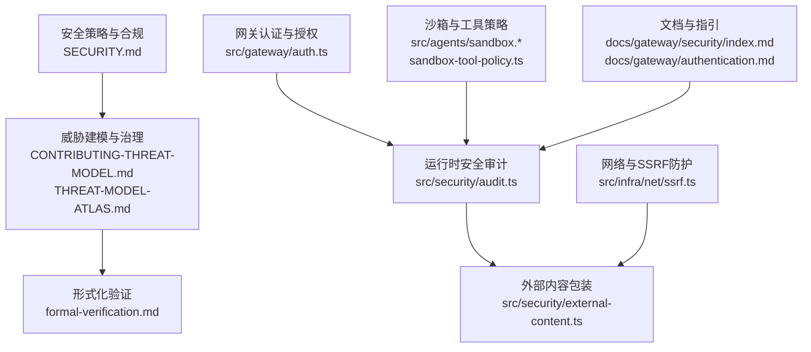
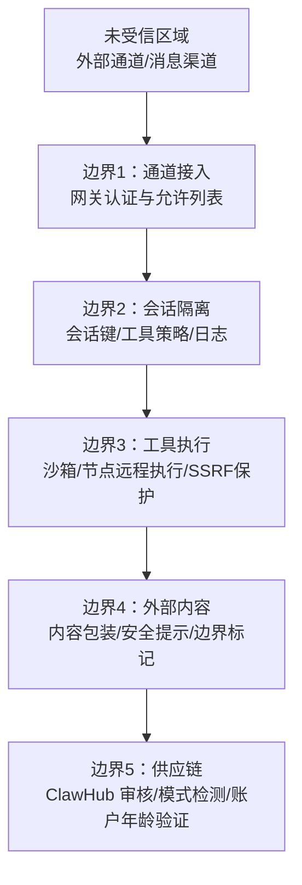
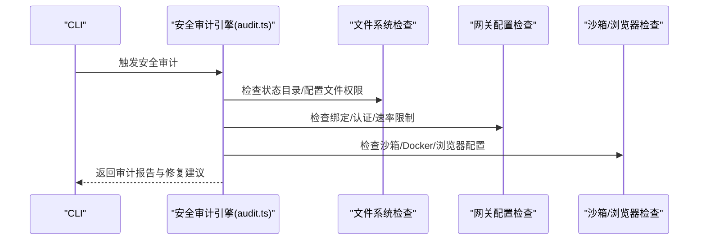
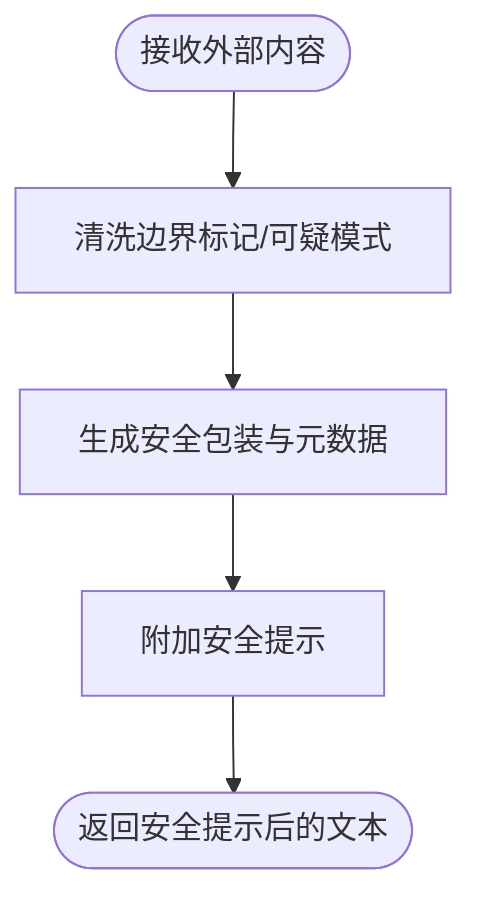
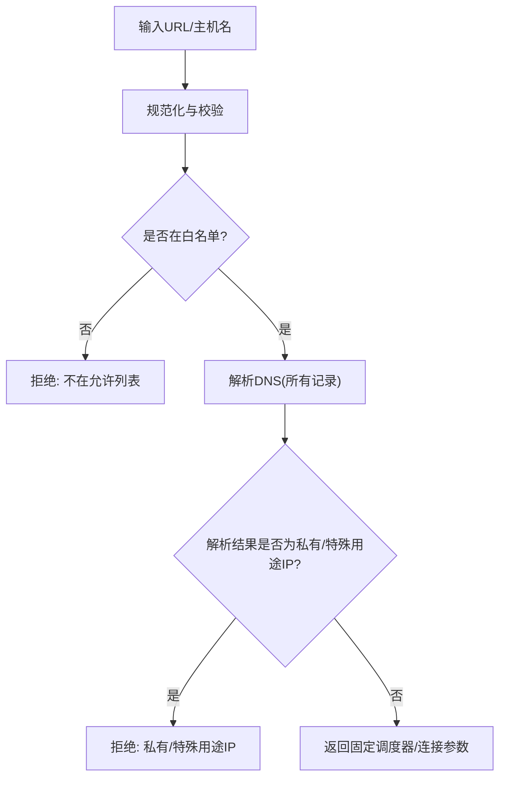
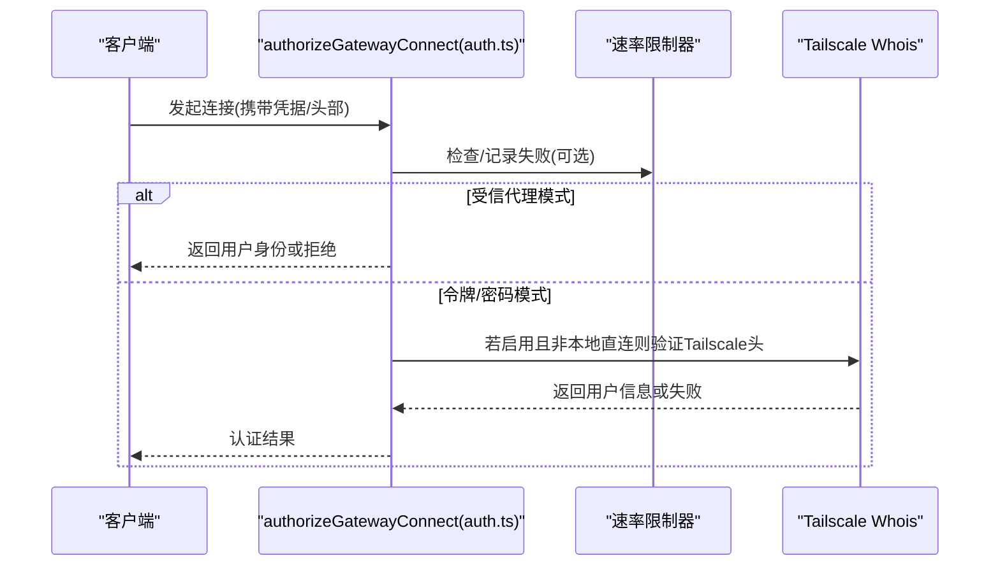
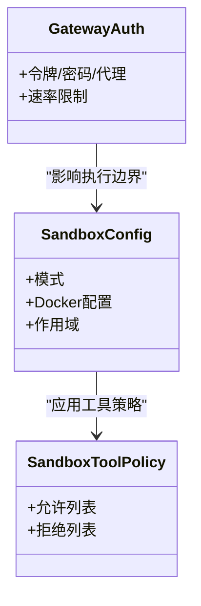
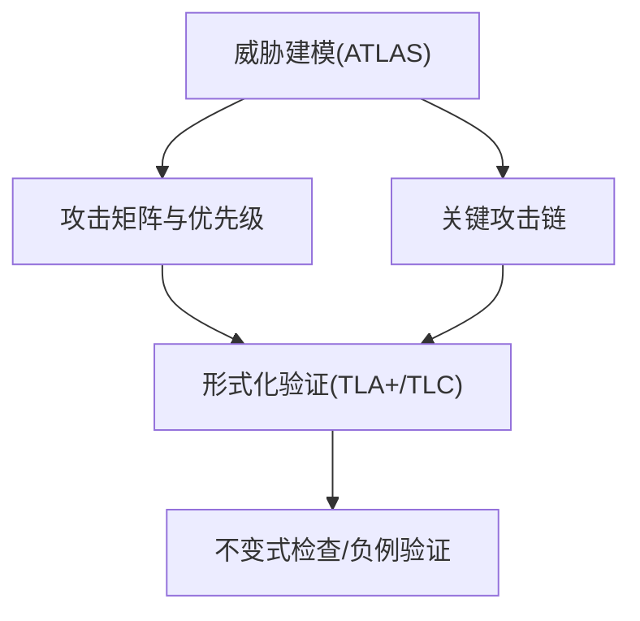
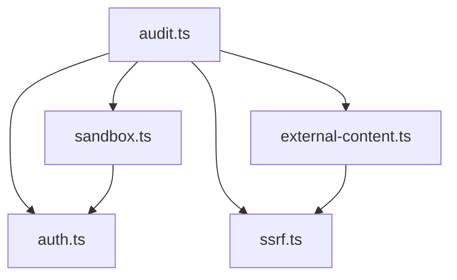

# 安全架构设计

<cite>
**本文引用的文件**
- [SECURITY.md](file://SECURITY.md)
- [CONTRIBUTING-THREAT-MODEL.md](file://docs/security/CONTRIBUTING-THREAT-MODEL.md)
- [THREAT-MODEL-ATLAS.md](file://docs/security/THREAT-MODEL-ATLAS.md)
- [formal-verification.md](file://docs/security/formal-verification.md)
- [audit.ts](file://src/security/audit.ts)
- [audit-extra.sync.ts](file://src/security/audit-extra.sync.ts)
- [external-content.ts](file://src/security/external-content.ts)
- [ssrf.ts](file://src/infra/net/ssrf.ts)
- [auth.ts](file://src/gateway/auth.ts)
- [sandbox.ts](file://src/agents/sandbox.ts)
- [sandbox-tool-policy.ts](file://src/agents/sandbox-tool-policy.ts)
- [authentication.md](file://docs/gateway/authentication.md)
- [index.md](file://docs/gateway/security/index.md)
</cite>

## 目录
1. [引言](#引言)
2. [项目结构](#项目结构)
3. [核心组件](#核心组件)
4. [架构总览](#架构总览)
5. [详细组件分析](#详细组件分析)
6. [依赖分析](#依赖分析)
7. [性能考虑](#性能考虑)
8. [故障排除指南](#故障排除指南)
9. [结论](#结论)
10. [附录](#附录)

## 引言
本文件面向 OpenClaw 的安全架构设计，系统化阐述整体安全架构、威胁模型与风险评估框架，明确安全边界、信任模型与攻击面分析，并给出威胁建模流程、安全控制层次与纵深防御策略。文档同时覆盖系统级安全设计决策、安全假设与约束条件，提供安全架构图与组件交互关系图，以及安全设计原则、合规性要求与安全度量指标。

## 项目结构
OpenClaw 将安全能力以“模块化、分层”的方式组织在以下关键目录与文件中：
- 安全策略与合规：SECURITY.md（披露政策、信任模型、部署假设、运行要求）
- 威胁建模与治理：docs/security/CONTRIBUTING-THREAT-MODEL.md、docs/security/THREAT-MODEL-ATLAS.md
- 形式化验证：docs/security/formal-verification.md
- 运行时安全审计与扫描：src/security/*
- 网络与 SSRF 防护：src/infra/net/ssrf.ts
- 网关认证与授权：src/gateway/auth.ts
- 沙箱与工具策略：src/agents/sandbox.*、src/agents/sandbox-tool-policy.ts
- 外部内容包装与注入防护：src/security/external-content.ts
- 文档与指引：docs/gateway/security/index.md、docs/gateway/authentication.md

图表来源
- [SECURITY.md:1-293](file://SECURITY.md#L1-L293)
- [CONTRIBUTING-THREAT-MODEL.md:1-91](file://docs/security/CONTRIBUTING-THREAT-MODEL.md#L1-L91)
- [THREAT-MODEL-ATLAS.md:1-604](file://docs/security/THREAT-MODEL-ATLAS.md#L1-L604)
- [formal-verification.md:1-168](file://docs/security/formal-verification.md#L1-L168)
- [audit.ts:1-800](file://src/security/audit.ts#L1-L800)
- [external-content.ts:1-355](file://src/security/external-content.ts#L1-L355)
- [ssrf.ts:1-406](file://src/infra/net/ssrf.ts#L1-L406)
- [auth.ts:1-495](file://src/gateway/auth.ts#L1-L495)
- [sandbox.ts:1-84](file://src/agents/sandbox.ts#L1-L84)
- [sandbox-tool-policy.ts:1-37](file://src/agents/sandbox-tool-policy.ts#L1-L37)
- [index.md:60-122](file://docs/gateway/security/index.md#L60-L122)
- [authentication.md:1-180](file://docs/gateway/authentication.md#L1-L180)

章节来源
- [SECURITY.md:1-293](file://SECURITY.md#L1-L293)
- [CONTRIBUTING-THREAT-MODEL.md:1-91](file://docs/security/CONTRIBUTING-THREAT-MODEL.md#L1-L91)
- [THREAT-MODEL-ATLAS.md:1-604](file://docs/security/THREAT-MODEL-ATLAS.md#L1-L604)
- [formal-verification.md:1-168](file://docs/security/formal-verification.md#L1-L168)
- [audit.ts:1-800](file://src/security/audit.ts#L1-L800)
- [external-content.ts:1-355](file://src/security/external-content.ts#L1-L355)
- [ssrf.ts:1-406](file://src/infra/net/ssrf.ts#L1-L406)
- [auth.ts:1-495](file://src/gateway/auth.ts#L1-L495)
- [sandbox.ts:1-84](file://src/agents/sandbox.ts#L1-L84)
- [sandbox-tool-policy.ts:1-37](file://src/agents/sandbox-tool-policy.ts#L1-L37)
- [index.md:60-122](file://docs/gateway/security/index.md#L60-L122)
- [authentication.md:1-180](file://docs/gateway/authentication.md#L1-L180)

## 核心组件
- 安全审计与扫描引擎：负责对配置、文件系统权限、网关暴露面、沙箱与浏览器安全、通道安全等进行自动化检查与修复建议。
- 外部内容包装与注入防护：对外部输入（邮件、Webhook、网页抓取）进行标记、警告与清洗，降低提示注入与边界绕过风险。
- SSRF 防护：通过主机名白名单、私有网络阻断、DNS 固定与代理策略，阻止服务端请求伪造。
- 网关认证与授权：支持令牌/密码/受信代理/设备认证等多种模式，结合速率限制与本地直连判定，确保访问控制。
- 沙箱与工具策略：在容器或远程执行环境中实施工具调用的最小授权与路径隔离，配合执行审批形成多重防线。
- 威胁建模与形式化验证：基于 MITRE ATLAS 的威胁矩阵与攻击链，辅以形式化模型与负例验证，持续改进安全保证。

章节来源
- [audit.ts:1-800](file://src/security/audit.ts#L1-L800)
- [external-content.ts:1-355](file://src/security/external-content.ts#L1-L355)
- [ssrf.ts:1-406](file://src/infra/net/ssrf.ts#L1-L406)
- [auth.ts:1-495](file://src/gateway/auth.ts#L1-L495)
- [sandbox.ts:1-84](file://src/agents/sandbox.ts#L1-L84)
- [sandbox-tool-policy.ts:1-37](file://src/agents/sandbox-tool-policy.ts#L1-L37)
- [THREAT-MODEL-ATLAS.md:1-604](file://docs/security/THREAT-MODEL-ATLAS.md#L1-L604)
- [formal-verification.md:1-168](file://docs/security/formal-verification.md#L1-L168)

## 架构总览
OpenClaw 的安全架构围绕“个人助理”信任模型展开，强调“受信操作员边界”，并通过多层边界与控制实现纵深防御。下图展示从外部通道到执行环境的关键信任边界与数据流。

图表来源
- [THREAT-MODEL-ATLAS.md:56-123](file://docs/security/THREAT-MODEL-ATLAS.md#L56-L123)
- [index.md:60-109](file://docs/gateway/security/index.md#L60-L109)

章节来源
- [THREAT-MODEL-ATLAS.md:56-123](file://docs/security/THREAT-MODEL-ATLAS.md#L56-L123)
- [index.md:60-109](file://docs/gateway/security/index.md#L60-L109)

## 详细组件分析

### 组件A：安全审计与扫描引擎
- 职责：对配置、文件系统权限、网关暴露面、沙箱与浏览器安全、通道安全、插件与技能安全等进行扫描与修复建议。
- 关键能力：
  - 文件系统权限检查（状态目录、配置文件的可读写权限）
  - 网关绑定与认证检查（loopback/非 loopback、令牌/密码/受信代理、速率限制）
  - 浏览器控制端点认证检查
  - 沙箱危险配置检查（Docker 绑定/网络/安全配置）
  - 通道安全与工具策略检查
- 输出：按严重级别汇总的审计报告与修复建议。

图表来源
- [audit.ts:1-800](file://src/security/audit.ts#L1-L800)
- [audit-extra.sync.ts:771-979](file://src/security/audit-extra.sync.ts#L771-L979)

章节来源
- [audit.ts:1-800](file://src/security/audit.ts#L1-L800)
- [audit-extra.sync.ts:771-979](file://src/security/audit-extra.sync.ts#L771-L979)

### 组件B：外部内容包装与注入防护
- 职责：对外部输入进行安全包装，插入唯一边界标记与安全提示，清洗可疑边界标记，降低提示注入与边界绕过风险。
- 关键能力：
  - 安全警告块与元数据标注
  - 唯一边界标记（随机 ID）与清洗逻辑
  - 可疑模式检测与日志记录
  - 钩子来源识别与简化包装

图表来源
- [external-content.ts:1-355](file://src/security/external-content.ts#L1-L355)

章节来源
- [external-content.ts:1-355](file://src/security/external-content.ts#L1-L355)

### 组件C：SSRF 防护
- 职责：通过主机名白名单、私有网络阻断、DNS 固定与代理策略，阻止服务端请求伪造。
- 关键能力：
  - 主机名白名单与后缀匹配
  - 私有/特殊用途 IP 阻断
  - DNS 解析固定与地址去重
  - 代理连接策略（直接/环境代理/显式代理）

图表来源
- [ssrf.ts:1-406](file://src/infra/net/ssrf.ts#L1-L406)

章节来源
- [ssrf.ts:1-406](file://src/infra/net/ssrf.ts#L1-L406)

### 组件D：网关认证与授权
- 职责：支持多种认证模式（令牌/密码/受信代理/设备），结合速率限制与本地直连判定，确保访问控制。
- 关键能力：
  - 认证模式解析与优先级
  - 受信代理用户身份提取与白名单
  - 速率限制与失败计数
  - 本地直连与 Tailscale 头部认证

图表来源
- [auth.ts:1-495](file://src/gateway/auth.ts#L1-L495)

章节来源
- [auth.ts:1-495](file://src/gateway/auth.ts#L1-L495)

### 组件E：沙箱与工具策略
- 职责：在容器或远程执行环境中实施工具调用的最小授权与路径隔离，配合执行审批形成多重防线。
- 关键能力：
  - 沙箱配置解析与作用域
  - 工具策略选择（全局/按提供方/按代理/沙箱）
  - 执行审批与远程命令构建

图表来源
- [sandbox.ts:1-84](file://src/agents/sandbox.ts#L1-L84)
- [sandbox-tool-policy.ts:1-37](file://src/agents/sandbox-tool-policy.ts#L1-L37)
- [auth.ts:1-495](file://src/gateway/auth.ts#L1-L495)

章节来源
- [sandbox.ts:1-84](file://src/agents/sandbox.ts#L1-L84)
- [sandbox-tool-policy.ts:1-37](file://src/agents/sandbox-tool-policy.ts#L1-L37)
- [auth.ts:1-495](file://src/gateway/auth.ts#L1-L495)

### 组件F：威胁建模与形式化验证
- 威胁建模：基于 MITRE ATLAS 的威胁矩阵与攻击链，覆盖侦察、初始访问、执行、持久化、规避、发现、收集与泄露、影响等战术。
- 形式化验证：使用 TLA+/TLC 对关键安全属性进行可执行的负例验证，如网关暴露、节点执行流水线、配对存储一致性等。

图表来源
- [THREAT-MODEL-ATLAS.md:1-604](file://docs/security/THREAT-MODEL-ATLAS.md#L1-L604)
- [formal-verification.md:1-168](file://docs/security/formal-verification.md#L1-L168)

章节来源
- [THREAT-MODEL-ATLAS.md:1-604](file://docs/security/THREAT-MODEL-ATLAS.md#L1-L604)
- [formal-verification.md:1-168](file://docs/security/formal-verification.md#L1-L168)

## 依赖分析
- 组件耦合与内聚：
  - 安全审计引擎内聚于“配置/文件系统/网关/沙箱/通道”等多源输入，耦合于各子系统的解析与检查函数。
  - 外部内容包装与 SSRF 防护在数据处理链上形成前后置依赖。
  - 网关认证与授权为后续工具执行与会话隔离提供信任锚点。
- 直接与间接依赖：
  - 审计引擎依赖认证解析、沙箱配置解析、SSRF 策略、通道插件清单等。
  - 外部内容包装依赖安全提示与边界标记生成；SSRF 依赖主机名与 IP 判定工具。
- 潜在循环依赖：
  - 当前模块划分清晰，未见循环依赖迹象。
- 外部依赖与集成点：
  - 代理与网络栈（Undici）、DNS 解析、Tailscale 身份查询等。

图表来源
- [audit.ts:1-800](file://src/security/audit.ts#L1-L800)
- [auth.ts:1-495](file://src/gateway/auth.ts#L1-L495)
- [ssrf.ts:1-406](file://src/infra/net/ssrf.ts#L1-L406)
- [external-content.ts:1-355](file://src/security/external-content.ts#L1-L355)
- [sandbox.ts:1-84](file://src/agents/sandbox.ts#L1-L84)

章节来源
- [audit.ts:1-800](file://src/security/audit.ts#L1-L800)
- [auth.ts:1-495](file://src/gateway/auth.ts#L1-L495)
- [ssrf.ts:1-406](file://src/infra/net/ssrf.ts#L1-L406)
- [external-content.ts:1-355](file://src/security/external-content.ts#L1-L355)
- [sandbox.ts:1-84](file://src/agents/sandbox.ts#L1-L84)

## 性能考虑
- 审计扫描的性能：
  - 文件系统权限检查与路径遍历需避免重复 IO，建议缓存权限结果。
  - 网络探测与 DNS 查询应设置超时与并发上限，避免阻塞。
- 外部内容包装：
  - 边界标记清洗与正则匹配应避免回溯，必要时预编译正则。
- SSRF 防护：
  - DNS 固定与调度器复用可减少连接开销；代理策略按需启用。
- 认证与授权：
  - 速率限制器应采用高效的数据结构（如滑动窗口），避免频繁落盘。
- 沙箱与工具策略：
  - 工具策略合并与去重应尽量批量处理，减少字符串拼接与集合操作次数。

## 故障排除指南
- 常见问题定位：
  - 网关暴露与认证缺失：检查绑定模式、认证配置与速率限制。
  - 沙箱危险配置：关注 Docker 绑定/网络/安全配置与浏览器 CDP 源范围。
  - 外部内容注入风险：确认包装与安全提示是否生效，边界标记是否被清洗。
  - SSRF 攻击面：核对主机名白名单、私有网络策略与代理配置。
- 诊断步骤：
  - 使用安全审计命令生成报告，逐条修正高危项。
  - 结合形式化验证的负例模型，复现实验性漏洞场景。
  - 查看认证日志与速率限制触发原因，调整策略。

章节来源
- [audit.ts:659-685](file://src/security/audit.ts#L659-L685)
- [audit-extra.sync.ts:771-979](file://src/security/audit-extra.sync.ts#L771-L979)
- [external-content.ts:1-355](file://src/security/external-content.ts#L1-L355)
- [ssrf.ts:1-406](file://src/infra/net/ssrf.ts#L1-L406)
- [auth.ts:1-495](file://src/gateway/auth.ts#L1-L495)

## 结论
OpenClaw 的安全架构以“个人助理”信任模型为核心，通过多层边界与控制（认证、会话隔离、工具执行、外部内容、供应链）实现纵深防御。结合 MITRE ATLAS 的威胁建模与形式化验证，持续提升系统在真实攻击场景下的鲁棒性。建议在生产部署中严格遵循安全基线（认证、绑定、速率限制、沙箱与浏览器配置、外部内容包装与 SSRF 策略），并定期运行安全审计与渗透测试，以维持安全态势。

## 附录
- 安全设计原则
  - 最小权限与默认拒绝
  - 明确边界与信任分离
  - 多层防护与纵深防御
  - 可审计与可观测
  - 可恢复与可回滚
- 合规性要求
  - 令牌长度与强度要求
  - Docker 安全运行参数（只读根文件系统、能力裁剪）
  - 本地/环回部署优先
- 安全度量指标
  - 审计报告中的高危/警告数量趋势
  - 认证失败与速率限制触发次数
  - 外部内容注入尝试拦截率
  - SSRF 阻断命中率
  - 沙箱违规事件数