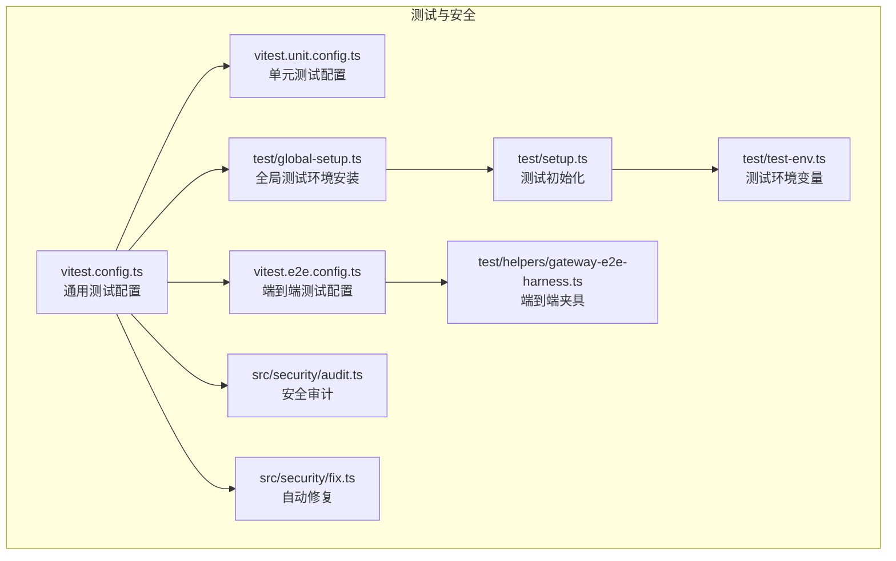
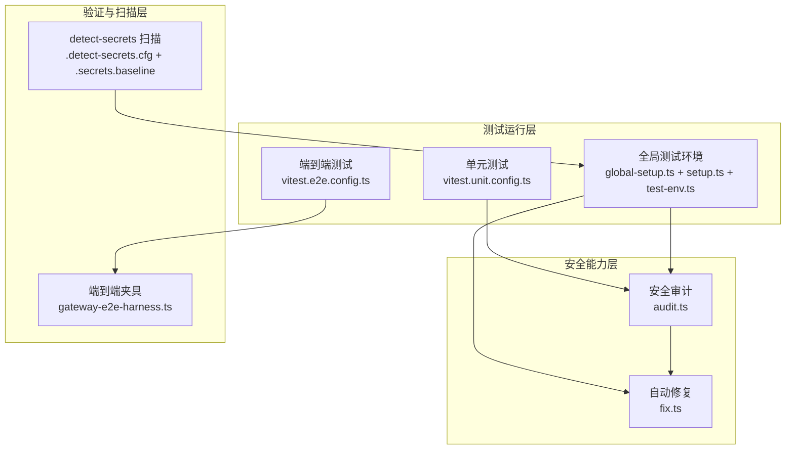
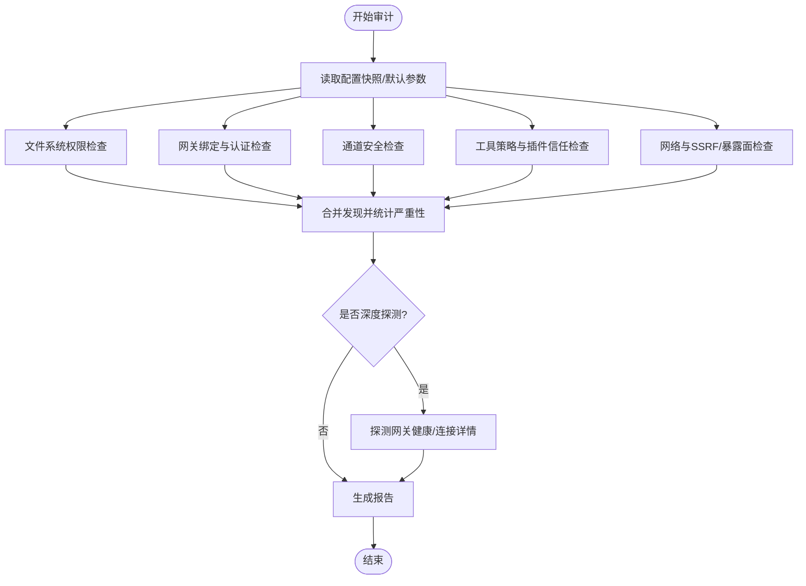
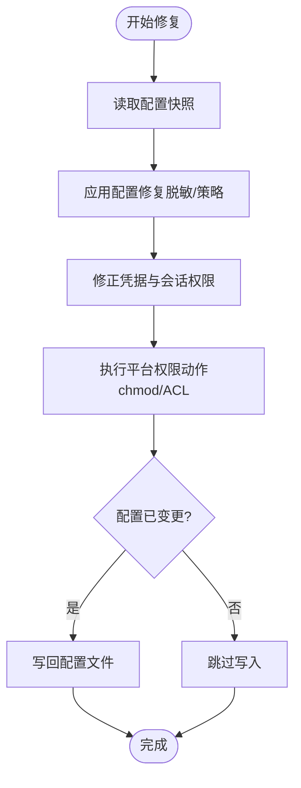
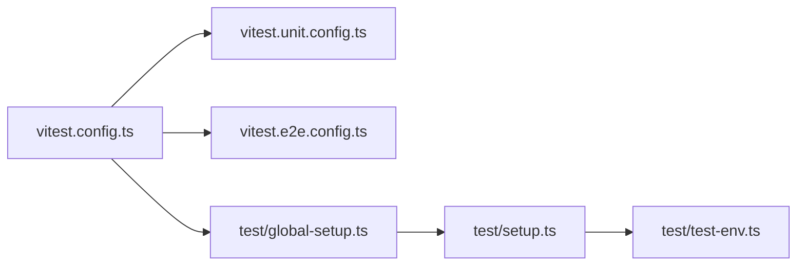
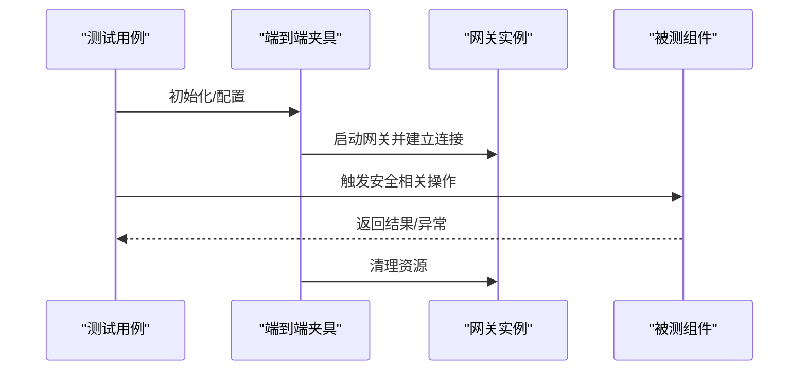
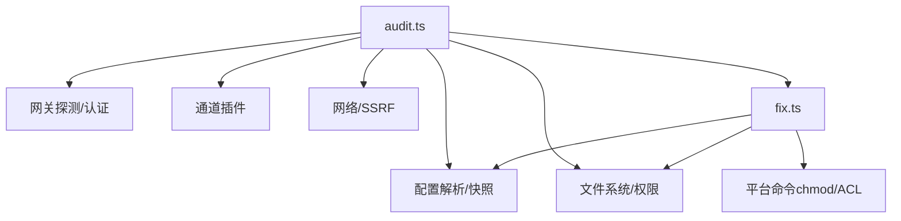

# 安全测试

<cite>
**本文引用的文件**
- [SECURITY.md](file://SECURITY.md)
- [CONTRIBUTING.md](file://CONTRIBUTING.md)
- [vitest.config.ts](file://vitest.config.ts)
- [vitest.unit.config.ts](file://vitest.unit.config.ts)
- [vitest.e2e.config.ts](file://vitest.e2e.config.ts)
- [src/security/audit.ts](file://src/security/audit.ts)
- [src/security/fix.ts](file://src/security/fix.ts)
- [src/security/audit.test.ts](file://src/security/audit.test.ts)
- [src/security/fix.test.ts](file://src/security/fix.test.ts)
- [test/global-setup.ts](file://test/global-setup.ts)
- [test/setup.ts](file://test/setup.ts)
- [test/test-env.ts](file://test/test-env.ts)
- [test/helpers/gateway-e2e-harness.ts](file://test/helpers/gateway-e2e-harness.ts)
- [test/scripts/check-no-random-messaging-tmp.test.ts](file://test/scripts/check-no-random-messaging-tmp.test.ts)
- [.detect-secrets.cfg](file://.detect-secrets.cfg)
- [.secrets.baseline](file://.secrets.baseline)
</cite>

## 目录
1. [简介](#简介)
2. [项目结构](#项目结构)
3. [核心组件](#核心组件)
4. [架构总览](#架构总览)
5. [详细组件分析](#详细组件分析)
6. [依赖关系分析](#依赖关系分析)
7. [性能考量](#性能考量)
8. [故障排查指南](#故障排查指南)
9. [结论](#结论)
10. [附录](#附录)

## 简介
本指南面向 OpenClaw 的安全测试与验证，系统化阐述安全测试方法论、测试工具与自动化测试框架，覆盖渗透测试、漏洞扫描与安全审计流程，并给出单元安全测试、集成测试与端到端安全测试的实践路径。文档同时涵盖安全测试环境搭建、测试数据准备、结果分析、测试用例模板、测试报告格式、缺陷跟踪流程，以及安全回归测试、性能安全测试与安全配置验证方法。

## 项目结构
OpenClaw 在仓库中提供了完善的测试基础设施与安全审计能力：
- 测试运行器：基于 Vitest 的多套配置，分别用于单元测试、端到端测试与扩展测试。
- 安全审计与修复：内置安全审计模块与自动修复能力，支持文件系统权限、网关暴露面、通道安全等检查。
- 测试辅助：全局测试环境安装、测试钩子、端到端测试夹具与脚本校验。
- 漏洞扫描：CI 中集成 detect-secrets 进行机密泄露扫描。

**图表来源**
- [vitest.config.ts:1-156](file://vitest.config.ts#L1-L156)
- [vitest.unit.config.ts:1-28](file://vitest.unit.config.ts#L1-L28)
- [vitest.e2e.config.ts:1-33](file://vitest.e2e.config.ts#L1-L33)
- [test/global-setup.ts:1-7](file://test/global-setup.ts#L1-L7)
- [test/setup.ts](file://test/setup.ts)
- [test/test-env.ts](file://test/test-env.ts)
- [test/helpers/gateway-e2e-harness.ts](file://test/helpers/gateway-e2e-harness.ts)
- [src/security/audit.ts:1-800](file://src/security/audit.ts#L1-L800)
- [src/security/fix.ts:1-478](file://src/security/fix.ts#L1-L478)

**章节来源**
- [vitest.config.ts:1-156](file://vitest.config.ts#L1-L156)
- [vitest.unit.config.ts:1-28](file://vitest.unit.config.ts#L1-L28)
- [vitest.e2e.config.ts:1-33](file://vitest.e2e.config.ts#L1-L33)
- [test/global-setup.ts:1-7](file://test/global-setup.ts#L1-L7)
- [test/setup.ts](file://test/setup.ts)
- [test/test-env.ts](file://test/test-env.ts)
- [test/helpers/gateway-e2e-harness.ts](file://test/helpers/gateway-e2e-harness.ts)

## 核心组件
- 安全审计模块（audit.ts）
  - 聚合文件系统权限、网关绑定与认证、通道安全、插件与工具策略、危险配置标志、浏览器控制等检查项，输出带严重性分级的发现清单与摘要统计。
- 自动修复模块（fix.ts）
  - 针对常见不安全配置与权限问题执行修复动作，如修改目录/文件权限、重置 Windows ACL、调整日志脱敏策略、收紧通道组策略等。
- 测试配置与运行
  - 单元测试：隔离性强，排除大面集成模块；端到端测试：使用进程池确保可重复性；通用配置统一别名解析、覆盖率阈值与排除规则。
- 测试环境与夹具
  - 全局安装测试环境、设置测试钩子、提供端到端网关夹具与脚本校验用例。

**章节来源**
- [src/security/audit.ts:1-800](file://src/security/audit.ts#L1-L800)
- [src/security/fix.ts:1-478](file://src/security/fix.ts#L1-L478)
- [vitest.config.ts:1-156](file://vitest.config.ts#L1-L156)
- [vitest.unit.config.ts:1-28](file://vitest.unit.config.ts#L1-L28)
- [vitest.e2e.config.ts:1-33](file://vitest.e2e.config.ts#L1-L33)
- [test/global-setup.ts:1-7](file://test/global-setup.ts#L1-L7)
- [test/setup.ts](file://test/setup.ts)
- [test/test-env.ts](file://test/test-env.ts)
- [test/helpers/gateway-e2e-harness.ts](file://test/helpers/gateway-e2e-harness.ts)

## 架构总览
下图展示安全测试在 OpenClaw 中的总体架构：从测试运行器到安全审计与修复，再到端到端验证与 CI 扫描。

**图表来源**
- [vitest.unit.config.ts:1-28](file://vitest.unit.config.ts#L1-L28)
- [vitest.e2e.config.ts:1-33](file://vitest.e2e.config.ts#L1-L33)
- [test/global-setup.ts:1-7](file://test/global-setup.ts#L1-L7)
- [test/setup.ts](file://test/setup.ts)
- [test/test-env.ts](file://test/test-env.ts)
- [src/security/audit.ts:1-800](file://src/security/audit.ts#L1-L800)
- [src/security/fix.ts:1-478](file://src/security/fix.ts#L1-L478)
- [test/helpers/gateway-e2e-harness.ts](file://test/helpers/gateway-e2e-harness.ts)
- [.detect-secrets.cfg](file://.detect-secrets.cfg)
- [.secrets.baseline](file://.secrets.baseline)

## 详细组件分析

### 安全审计模块（audit.ts）
- 功能要点
  - 文件系统权限检查：检测状态目录与配置文件的权限风险，输出修复建议。
  - 网关安全检查：绑定地址、认证模式、反向代理信任、受控来源、速率限制等。
  - 通道安全检查：针对特定通道（如 Feishu 文档）的授权行为进行提示。
  - 工具与策略：HTTP 上重新启用危险工具、沙箱与 Docker 标签、插件信任边界等。
  - 报告结构：包含时间戳、严重性计数与发现清单，支持深度探测（可选）。
- 处理逻辑
  - 统一收集各类安全发现，按严重性汇总，支持注入式依赖（如探测函数、插件列表、Windows ACL 执行器等）以提升可测试性。
- 性能与复杂度
  - 权限检查与网络探测为 I/O 密集；通过缓存与按需加载降低开销。

**图表来源**
- [src/security/audit.ts:1-800](file://src/security/audit.ts#L1-L800)

**章节来源**
- [src/security/audit.ts:1-800](file://src/security/audit.ts#L1-L800)

### 自动修复模块（fix.ts）
- 功能要点
  - 权限修复：针对状态目录、配置文件、包含文件、凭据目录与会话文件设置安全权限。
  - 配置修复：调整日志敏感信息脱敏级别、收紧通道组策略、应用白名单策略等。
  - 平台适配：Windows 使用 ACL 重置命令，非 Windows 使用 chmod。
- 处理逻辑
  - 基于审计发现与配置快照，生成最小变更集并写回配置；记录所有动作与错误，便于审计与回滚。

**图表来源**
- [src/security/fix.ts:1-478](file://src/security/fix.ts#L1-L478)

**章节来源**
- [src/security/fix.ts:1-478](file://src/security/fix.ts#L1-L478)

### 测试配置与运行（Vitest）
- 通用配置（vitest.config.ts）
  - 别名解析、超时、环境/全局解桩、进程池、包含/排除规则、覆盖率阈值与锚点。
- 单元测试配置（vitest.unit.config.ts）
  - 排除大面集成模块，聚焦纯函数与小范围逻辑。
- 端到端测试配置（vitest.e2e.config.ts）
  - 使用进程池保证隔离，动态工作线程数，支持显式 verbose 输出。

**图表来源**
- [vitest.config.ts:1-156](file://vitest.config.ts#L1-L156)
- [vitest.unit.config.ts:1-28](file://vitest.unit.config.ts#L1-L28)
- [vitest.e2e.config.ts:1-33](file://vitest.e2e.config.ts#L1-L33)
- [test/global-setup.ts:1-7](file://test/global-setup.ts#L1-L7)
- [test/setup.ts](file://test/setup.ts)
- [test/test-env.ts](file://test/test-env.ts)

**章节来源**
- [vitest.config.ts:1-156](file://vitest.config.ts#L1-L156)
- [vitest.unit.config.ts:1-28](file://vitest.unit.config.ts#L1-L28)
- [vitest.e2e.config.ts:1-33](file://vitest.e2e.config.ts#L1-L33)
- [test/global-setup.ts:1-7](file://test/global-setup.ts#L1-L7)
- [test/setup.ts](file://test/setup.ts)
- [test/test-env.ts](file://test/test-env.ts)

### 端到端测试夹具与脚本校验
- 端到端夹具（gateway-e2e-harness.ts）
  - 提供网关启动、连接、会话与工具调用的端到端场景封装，便于编写安全相关 e2e 用例。
- 脚本校验（test/scripts/*）
  - 包含对消息临时目录随机化、窗口打开等潜在风险的静态检查用例，保障安全基线。

**图表来源**
- [test/helpers/gateway-e2e-harness.ts](file://test/helpers/gateway-e2e-harness.ts)
- [vitest.e2e.config.ts:1-33](file://vitest.e2e.config.ts#L1-L33)

**章节来源**
- [test/helpers/gateway-e2e-harness.ts](file://test/helpers/gateway-e2e-harness.ts)
- [test/scripts/check-no-random-messaging-tmp.test.ts](file://test/scripts/check-no-random-messaging-tmp.test.ts)

### 漏洞扫描与机密泄露检测
- detect-secrets
  - 在 CI 中扫描机密泄露，使用配置文件与基线文件管理误报与历史。
- 运行方式
  - 本地安装指定版本后执行扫描，结合基线文件过滤历史发现。

**章节来源**
- [.detect-secrets.cfg](file://.detect-secrets.cfg)
- [.secrets.baseline](file://.secrets.baseline)
- [SECURITY.md:282-293](file://SECURITY.md#L282-L293)

## 依赖关系分析
- 组件耦合
  - 审计模块依赖配置解析、网关探测、通道插件、文件系统与网络策略等子系统，形成高内聚低耦合的检查集合。
  - 修复模块依赖配置 IO、权限变更与平台命令执行，与审计模块形成“发现—修复”的闭环。
- 外部依赖
  - Vitest 作为测试运行器；Node.js 运行时；Windows ACL 命令（icacls）或 POSIX chmod。
- 可能的循环依赖
  - 审计与修复均依赖配置 IO，但通过只读快照与最小写入避免循环。

**图表来源**
- [src/security/audit.ts:1-800](file://src/security/audit.ts#L1-L800)
- [src/security/fix.ts:1-478](file://src/security/fix.ts#L1-L478)

**章节来源**
- [src/security/audit.ts:1-800](file://src/security/audit.ts#L1-L800)
- [src/security/fix.ts:1-478](file://src/security/fix.ts#L1-L478)

## 性能考量
- 测试并发与隔离
  - 单元测试使用进程池与环境解桩，减少跨文件污染；端到端测试使用进程池确保可重复性。
  - 覆盖率仅统计实际被测试覆盖的源码，避免过度排除导致阈值漂移。
- 审计与修复
  - 权限检查与网络探测为 I/O 密集，建议在 CI 中限制并发并使用缓存；修复阶段尽量批量执行，减少多次 IO。
- Docker 与 Node 版本
  - 严格要求 Node 版本以规避已知安全漏洞；容器运行建议只读文件系统与丢弃多余能力。

**章节来源**
- [vitest.config.ts:1-156](file://vitest.config.ts#L1-L156)
- [vitest.e2e.config.ts:1-33](file://vitest.e2e.config.ts#L1-L33)
- [SECURITY.md:251-293](file://SECURITY.md#L251-L293)

## 故障排查指南
- 审计报告无输出或为空
  - 检查配置路径与状态目录解析是否正确；确认未被排除在覆盖率之外。
- 权限修复失败
  - 核对目标路径是否存在、是否为符号链接、平台是否支持相应命令；查看修复动作返回的错误信息。
- 端到端测试不稳定
  - 检查工作线程数与超时设置；确保全局环境安装与清理钩子正常执行。
- detect-secrets 扫描误报
  - 更新基线文件并调整配置，避免将真实机密误判为误报。

**章节来源**
- [src/security/audit.ts:1-800](file://src/security/audit.ts#L1-L800)
- [src/security/fix.ts:1-478](file://src/security/fix.ts#L1-L478)
- [vitest.config.ts:1-156](file://vitest.config.ts#L1-L156)
- [vitest.e2e.config.ts:1-33](file://vitest.e2e.config.ts#L1-L33)
- [.detect-secrets.cfg](file://.detect-secrets.cfg)
- [.secrets.baseline](file://.secrets.baseline)

## 结论
OpenClaw 的安全测试体系以“审计—修复—验证—扫描”为主线，结合 Vitest 的多层测试配置与端到端夹具，形成可重复、可扩展且可审计的安全测试流程。通过严格的配置与权限基线、自动修复与 CI 扫描，能够有效降低部署与运行风险。

## 附录

### 安全测试方法论与流程
- 渗透测试
  - 以“最小权限+最小暴露面”为目标，优先验证网关绑定、认证与反向代理信任链；结合通道与工具策略验证边界。
- 漏洞扫描
  - 使用 detect-secrets 进行机密泄露扫描；定期更新基线与配置。
- 安全审计
  - 使用内置审计模块生成报告，结合修复模块进行自动修复与人工复核。

**章节来源**
- [SECURITY.md:1-293](file://SECURITY.md#L1-L293)
- [.detect-secrets.cfg](file://.detect-secrets.cfg)
- [.secrets.baseline](file://.secrets.baseline)

### 单元安全测试、集成测试与端到端安全测试
- 单元安全测试
  - 验证权限检查、配置解析与策略判断等纯函数逻辑；使用环境解桩避免外部副作用。
- 集成测试
  - 验证模块间交互与配置 IO；关注覆盖率阈值与排除规则。
- 端到端安全测试
  - 使用端到端夹具模拟真实场景，验证网关、通道与工具在受限策略下的行为。

**章节来源**
- [vitest.unit.config.ts:1-28](file://vitest.unit.config.ts#L1-L28)
- [vitest.config.ts:1-156](file://vitest.config.ts#L1-L156)
- [test/helpers/gateway-e2e-harness.ts](file://test/helpers/gateway-e2e-harness.ts)

### 安全测试环境搭建与测试数据准备
- 环境搭建
  - 使用全局测试环境安装脚本；在 CI 中设置工作线程与超时；确保 Node 版本满足安全要求。
- 测试数据
  - 使用测试夹具与快照；准备不同权限与配置场景的数据集，覆盖边界条件。

**章节来源**
- [test/global-setup.ts:1-7](file://test/global-setup.ts#L1-L7)
- [test/setup.ts](file://test/setup.ts)
- [test/test-env.ts](file://test/test-env.ts)
- [SECURITY.md:251-293](file://SECURITY.md#L251-L293)

### 结果分析与测试报告格式
- 报告字段
  - 时间戳、严重性计数（critical/warn/info）、发现清单（检查 ID、标题、细节、修复建议）。
- 深度探测
  - 可选的网关探测结果与错误信息，便于定位远程暴露面问题。

**章节来源**
- [src/security/audit.ts:75-88](file://src/security/audit.ts#L75-L88)

### 缺陷跟踪流程
- 报告模板
  - 标题、严重性评估、影响、受影响组件、技术复现步骤、演示影响、环境、修复建议。
- 受理与分流
  - 快速通道要求精确路径、版本信息、PoC、证据与范围说明；避免重复与无效报告。

**章节来源**
- [SECURITY.md:20-47](file://SECURITY.md#L20-L47)

### 安全回归测试与性能安全测试
- 回归测试
  - 将安全审计与修复纳入回归矩阵；对权限变更与配置修复进行回归验证。
- 性能安全测试
  - 关注 I/O 密集检查的超时与并发；在 CI 中限制资源消耗并保留关键场景。

**章节来源**
- [src/security/audit.ts:1-800](file://src/security/audit.ts#L1-L800)
- [src/security/fix.ts:1-478](file://src/security/fix.ts#L1-L478)
- [vitest.config.ts:1-156](file://vitest.config.ts#L1-L156)

### 安全配置验证方法
- 常见不安全配置
  - 非 loopback 绑定无认证、受控来源缺失、速率限制缺失、危险配置标志开启、通道组策略为开放等。
- 验证手段
  - 审计模块自动检查；修复模块自动纠偏；端到端场景验证边界。

**章节来源**
- [src/security/audit.ts:352-701](file://src/security/audit.ts#L352-L701)
- [src/security/fix.ts:276-303](file://src/security/fix.ts#L276-L303)