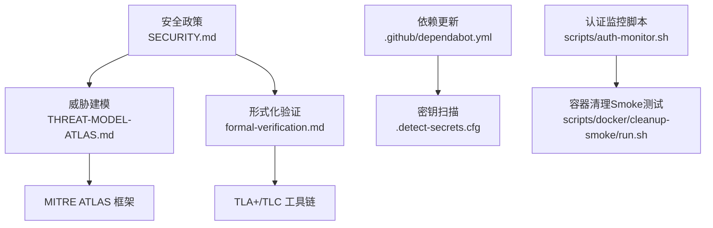
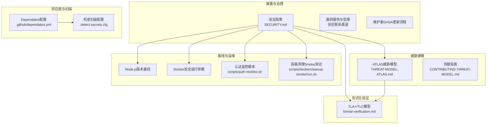
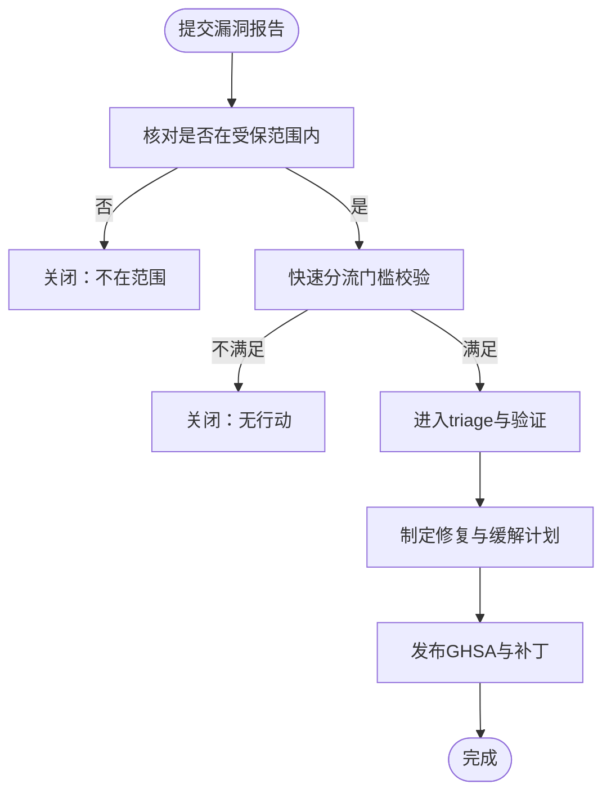
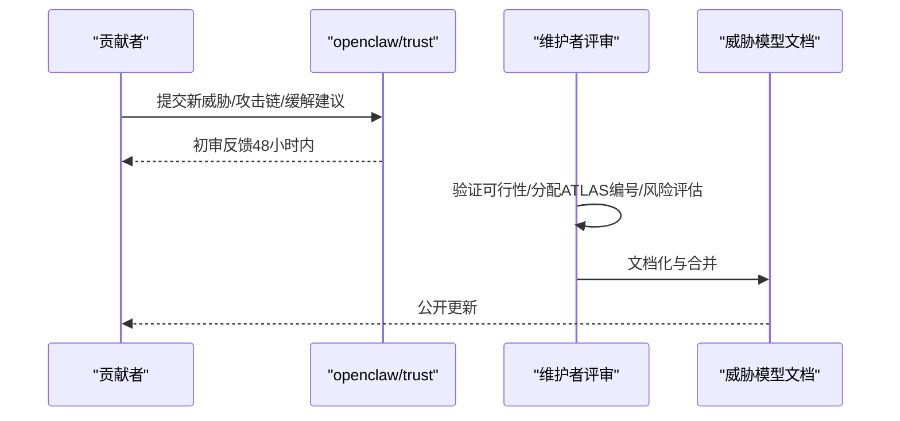
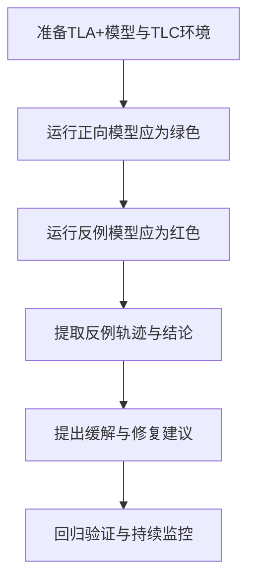
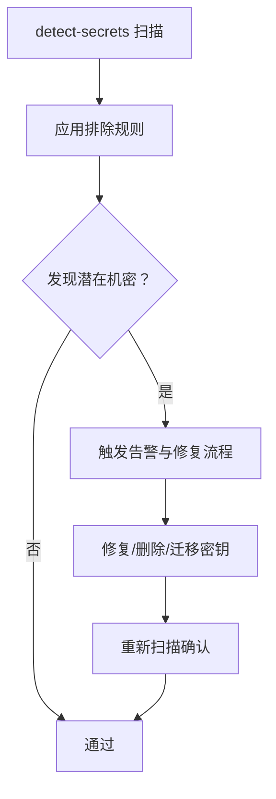
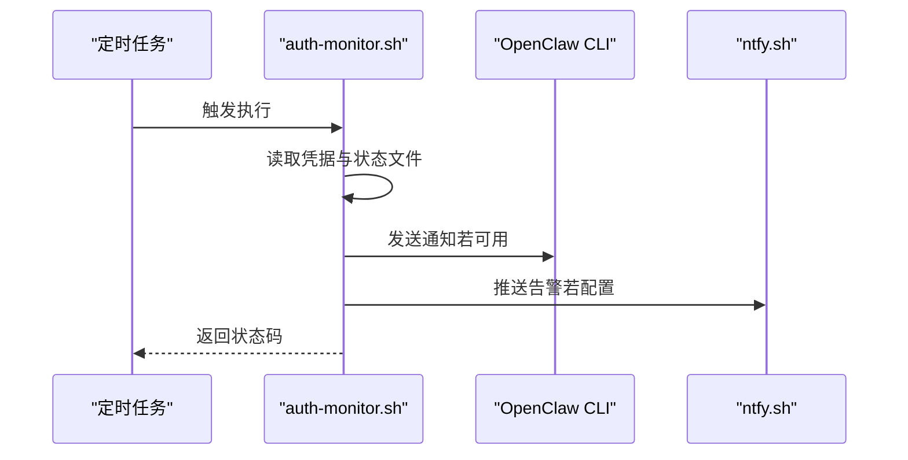
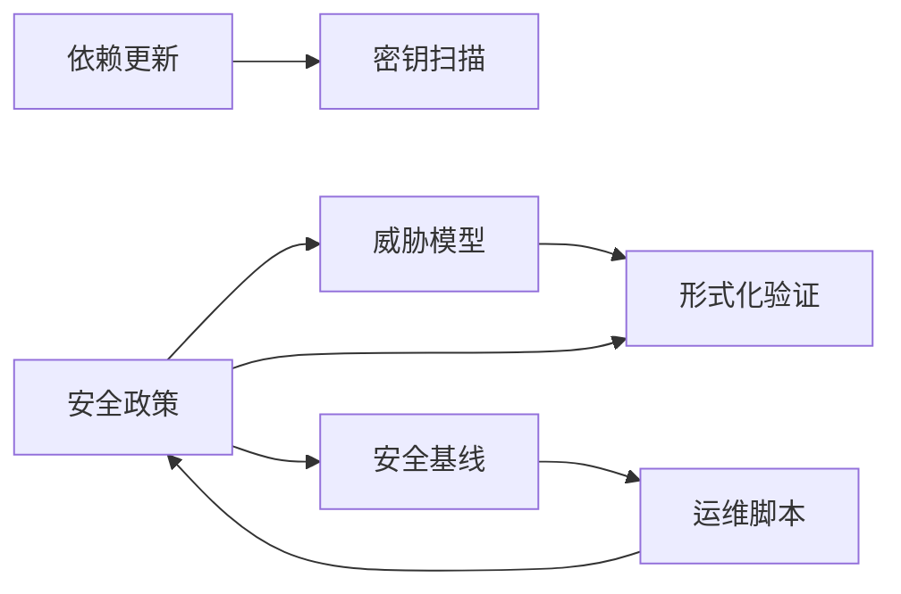

# 安全策略

<cite>
**本文引用的文件**
- [SECURITY.md](file://SECURITY.md)
- [formal-verification.md](file://docs/security/formal-verification.md)
- [CONTRIBUTING-THREAT-MODEL.md](file://docs/security/CONTRIBUTING-THREAT-MODEL.md)
- [THREAT-MODEL-ATLAS.md](file://docs/security/THREAT-MODEL-ATLAS.md)
- [.detect-secrets.cfg](file://.detect-secrets.cfg)
- [.github/dependabot.yml](file://.github/dependabot.yml)
- [scripts/auth-monitor.sh](file://scripts/auth-monitor.sh)
- [scripts/docker/cleanup-smoke/run.sh](file://scripts/docker/cleanup-smoke/run.sh)
</cite>

## 目录
1. [引言](#引言)
2. [项目结构](#项目结构)
3. [核心组件](#核心组件)
4. [架构总览](#架构总览)
5. [详细组件分析](#详细组件分析)
6. [依赖关系分析](#依赖关系分析)
7. [性能考量](#性能考量)
8. [故障排查指南](#故障排查指南)
9. [结论](#结论)
10. [附录](#附录)

## 引言
本文件面向 OpenClaw 的安全策略与合规性框架，系统化梳理安全政策制定、执行与审计流程，结合形式化验证、安全测试与漏洞评估方法，给出安全基线配置、合规性要求与安全度量指标，并覆盖威胁情报集成、安全事件响应与持续改进机制。同时提供可复用的安全策略模板、合规性检查表与安全审计报告格式，以及安全培训计划、应急演练与事件调查方法建议，帮助团队在工程实践中落地“个人助理”信任模型下的纵深防御。

## 项目结构
围绕安全策略与合规性，仓库中与之直接相关的关键位置包括：
- 安全披露与漏洞管理：根目录安全政策文件
- 威胁建模与风险治理：安全文档目录中的威胁模型与贡献指南
- 形式化验证：安全文档中的形式化模型与运行指引
- 供应链与密钥扫描：依赖更新与机密检测配置
- 运维与监控：认证状态监控脚本与容器清理 Smoke 测试
- 配置与基线：Node.js 版本与 Docker 安全运行基线

图表来源
- [SECURITY.md:1-293](file://SECURITY.md#L1-L293)
- [THREAT-MODEL-ATLAS.md:1-604](file://docs/security/THREAT-MODEL-ATLAS.md#L1-L604)
- [formal-verification.md:1-168](file://docs/security/formal-verification.md#L1-L168)
- [.github/dependabot.yml:1-128](file://.github/dependabot.yml#L1-L128)
- [.detect-secrets.cfg:1-46](file://.detect-secrets.cfg#L1-L46)
- [scripts/auth-monitor.sh:1-90](file://scripts/auth-monitor.sh#L1-L90)
- [scripts/docker/cleanup-smoke/run.sh:1-36](file://scripts/docker/cleanup-smoke/run.sh#L1-L36)

章节来源
- [SECURITY.md:1-293](file://SECURITY.md#L1-L293)
- [THREAT-MODEL-ATLAS.md:1-604](file://docs/security/THREAT-MODEL-ATLAS.md#L1-L604)
- [formal-verification.md:1-168](file://docs/security/formal-verification.md#L1-L168)
- [.github/dependabot.yml:1-128](file://.github/dependabot.yml#L1-L128)
- [.detect-secrets.cfg:1-46](file://.detect-secrets.cfg#L1-L46)
- [scripts/auth-monitor.sh:1-90](file://scripts/auth-monitor.sh#L1-L90)
- [scripts/docker/cleanup-smoke/run.sh:1-36](file://scripts/docker/cleanup-smoke/run.sh#L1-L36)

## 核心组件
- 安全披露与漏洞管理：定义漏洞报告入口、必需信息、快速分流门槛、常见误报模式、重复报告处理、维护者更新 GHSA 的注意事项，以及“个人助理”信任模型与受托插件边界等关键假设。
- 威胁建模与风险治理：基于 MITRE ATLAS 的系统化威胁识别、攻击链组合与缓解建议；明确各组件的受信边界与数据流；提供风险矩阵与优先级划分。
- 形式化验证：以 TLA+/TLC 构建可执行的安全回归套件，覆盖网关暴露、节点执行流水线、配对存储、入站控制、路由隔离等高风险路径，并提供模型复现步骤。
- 供应链与密钥扫描：通过 Dependabot 自动化依赖更新与冷却策略；通过 detect-secrets 在 CI 中进行机密泄露扫描，并配置排除规则以降低误报。
- 运维与监控：认证过期监控脚本用于提前预警第三方认证失效；容器清理 Smoke 测试确保重置/卸载流程的可重复性与一致性。
- 安全基线：Node.js 版本要求（含已知漏洞修复）与 Docker 安全运行参数（只读文件系统、丢弃能力等）。

章节来源
- [SECURITY.md:1-293](file://SECURITY.md#L1-L293)
- [THREAT-MODEL-ATLAS.md:1-604](file://docs/security/THREAT-MODEL-ATLAS.md#L1-L604)
- [formal-verification.md:1-168](file://docs/security/formal-verification.md#L1-L168)
- [.github/dependabot.yml:1-128](file://.github/dependabot.yml#L1-L128)
- [.detect-secrets.cfg:1-46](file://.detect-secrets.cfg#L1-L46)
- [scripts/auth-monitor.sh:1-90](file://scripts/auth-monitor.sh#L1-L90)
- [scripts/docker/cleanup-smoke/run.sh:1-36](file://scripts/docker/cleanup-smoke/run.sh#L1-L36)

## 架构总览
下图展示 OpenClaw 安全策略在系统中的映射关系：从“披露—建模—验证—扫描—基线—运维”的闭环，贯穿开发、测试与生产阶段。

图表来源
- [SECURITY.md:1-293](file://SECURITY.md#L1-L293)
- [THREAT-MODEL-ATLAS.md:1-604](file://docs/security/THREAT-MODEL-ATLAS.md#L1-L604)
- [formal-verification.md:1-168](file://docs/security/formal-verification.md#L1-L168)
- [.github/dependabot.yml:1-128](file://.github/dependabot.yml#L1-L128)
- [.detect-secrets.cfg:1-46](file://.detect-secrets.cfg#L1-L46)
- [scripts/auth-monitor.sh:1-90](file://scripts/auth-monitor.sh#L1-L90)
- [scripts/docker/cleanup-smoke/run.sh:1-36](file://scripts/docker/cleanup-smoke/run.sh#L1-L36)

## 详细组件分析

### 组件A：安全披露与漏洞管理（SECURITY.md）
- 披露入口与范围：明确各子项目的报告地址与邮件通道；对“个人助理”信任模型、受托插件边界、多租户场景等进行清晰界定。
- 快速分流门槛：要求提供漏洞路径、版本信息、可复现 PoC、影响证据、作用域说明等，提升 triage 效率。
- 常见误报与拒绝项：列举提示性场景（如仅提示注入、受信操作、同路径替换等），避免无效工单占用资源。
- 维护者流程：提供 GHSA 更新所需的 API 版本头信息，确保字段持久化。

图表来源
- [SECURITY.md:33-47](file://SECURITY.md#L33-L47)
- [SECURITY.md:49-71](file://SECURITY.md#L49-L71)
- [SECURITY.md:87-89](file://SECURITY.md#L87-L89)

章节来源
- [SECURITY.md:1-293](file://SECURITY.md#L1-L293)

### 组件B：威胁建模与风险治理（THREAT-MODEL-ATLAS.md 与 CONTRIBUTING-THREAT-MODEL.md）
- 框架与方法：采用 MITRE ATLAS，结合数据流图，覆盖从侦察、初始访问到执行、持久化、规避、发现、采集与外泄、影响的完整路径。
- 受信边界与数据流：明确通道接入、会话隔离、工具执行、外部内容、供应链等五道边界及关键数据流保护措施。
- 攻击链与缓解：给出关键攻击链（如技能型数据窃取、提示注入到命令执行、间接注入到外泄）与优先级建议。
- 贡献流程：鼓励社区贡献威胁、攻击链与缓解方案，使用 ATLAS 编号体系与风险等级评估。

图表来源
- [CONTRIBUTING-THREAT-MODEL.md:68-74](file://docs/security/CONTRIBUTING-THREAT-MODEL.md#L68-L74)
- [THREAT-MODEL-ATLAS.md:138-527](file://docs/security/THREAT-MODEL-ATLAS.md#L138-L527)

章节来源
- [THREAT-MODEL-ATLAS.md:1-604](file://docs/security/THREAT-MODEL-ATLAS.md#L1-L604)
- [CONTRIBUTING-THREAT-MODEL.md:1-91](file://docs/security/CONTRIBUTING-THREAT-MODEL.md#L1-L91)

### 组件C：形式化验证（formal-verification.md）
- 目标与定位：构建可执行的安全回归套件，覆盖网关暴露、节点执行流水线、配对存储、入站控制、路由隔离等高风险路径。
- 模型与工具：使用 TLA+/TLC，提供模型复现步骤与 Make 目标；强调模型与实现可能存在漂移，结果受限于探索的状态空间。
- 关键模型示例：网关暴露与错误配置、节点执行审批令牌、配对存储容量与幂等、入站跟踪与去重、路由优先级与身份链接等。

图表来源
- [formal-verification.md:37-54](file://docs/security/formal-verification.md#L37-L54)
- [formal-verification.md:56-107](file://docs/security/formal-verification.md#L56-L107)
- [formal-verification.md:108-168](file://docs/security/formal-verification.md#L108-L168)

章节来源
- [formal-verification.md:1-168](file://docs/security/formal-verification.md#L1-L168)

### 组件D：供应链与密钥扫描（.github/dependabot.yml 与 .detect-secrets.cfg）
- 依赖更新：按生态（npm、GitHub Actions、Swift、Gradle、Docker）分组与冷却策略，限制 PR 数量，确保变更可控。
- 密钥扫描：在 CI 中启用 detect-secrets 扫描，配置排除规则以过滤误报（如锁文件、文档示例、签名元数据等）。

图表来源
- [.detect-secrets.cfg:1-46](file://.detect-secrets.cfg#L1-L46)
- [.github/dependabot.yml:13-50](file://.github/dependabot.yml#L13-L50)

章节来源
- [.detect-secrets.cfg:1-46](file://.detect-secrets.cfg#L1-L46)
- [.github/dependabot.yml:1-128](file://.github/dependabot.yml#L1-L128)

### 组件E：安全基线与运维（Node.js 与 Docker）
- Node.js 版本：要求使用包含特定 CVE 修复的 LTS 版本，确保运行时安全基线。
- Docker 安全：官方镜像以非 root 用户运行；建议使用只读文件系统与丢弃多余能力；挂载最小化数据卷。

章节来源
- [SECURITY.md:251-293](file://SECURITY.md#L251-L293)

### 组件F：认证监控与容器清理 Smoke 测试
- 认证监控脚本：周期性检查第三方认证有效期，临近过期或已过期时通过 OpenClaw 或 ntfy 推送告警，避免服务中断。
- 容器清理 Smoke 测试：在受控环境中执行构建、种子状态、重置、卸载等步骤，验证状态清理与卸载一致性。

图表来源
- [scripts/auth-monitor.sh:1-90](file://scripts/auth-monitor.sh#L1-L90)

章节来源
- [scripts/auth-monitor.sh:1-90](file://scripts/auth-monitor.sh#L1-L90)
- [scripts/docker/cleanup-smoke/run.sh:1-36](file://scripts/docker/cleanup-smoke/run.sh#L1-L36)

## 依赖关系分析
- 安全披露政策驱动威胁建模与形式化验证的输入；威胁模型指导修复优先级与缓解策略。
- 供应链与密钥扫描为安全基线提供前置保障，减少引入性风险。
- 运维脚本（认证监控、容器清理）确保运行期可观测性与可恢复性，支撑持续改进闭环。

图表来源
- [SECURITY.md:1-293](file://SECURITY.md#L1-L293)
- [THREAT-MODEL-ATLAS.md:1-604](file://docs/security/THREAT-MODEL-ATLAS.md#L1-L604)
- [formal-verification.md:1-168](file://docs/security/formal-verification.md#L1-L168)
- [.github/dependabot.yml:1-128](file://.github/dependabot.yml#L1-L128)
- [.detect-secrets.cfg:1-46](file://.detect-secrets.cfg#L1-L46)
- [scripts/auth-monitor.sh:1-90](file://scripts/auth-monitor.sh#L1-L90)
- [scripts/docker/cleanup-smoke/run.sh:1-36](file://scripts/docker/cleanup-smoke/run.sh#L1-L36)

章节来源
- [SECURITY.md:1-293](file://SECURITY.md#L1-L293)
- [THREAT-MODEL-ATLAS.md:1-604](file://docs/security/THREAT-MODEL-ATLAS.md#L1-L604)
- [formal-verification.md:1-168](file://docs/security/formal-verification.md#L1-L168)
- [.github/dependabot.yml:1-128](file://.github/dependabot.yml#L1-L128)
- [.detect-secrets.cfg:1-46](file://.detect-secrets.cfg#L1-L46)
- [scripts/auth-monitor.sh:1-90](file://scripts/auth-monitor.sh#L1-L90)
- [scripts/docker/cleanup-smoke/run.sh:1-36](file://scripts/docker/cleanup-smoke/run.sh#L1-L36)

## 性能考量
- 形式化验证的状态空间探索成本与覆盖率权衡：在可接受时间内最大化覆盖关键攻击面，必要时拆分模型或引入不变式。
- 供应链扫描与依赖更新的频率与冷却策略：平衡安全与时效，避免过度 PR 干扰主干稳定性。
- 运维脚本的幂等性与最小化副作用：认证监控与清理测试应尽量短路失败、避免产生残留状态。

## 故障排查指南
- 漏洞报告质量不高导致 triage 延迟：对照“快速分流门槛”逐项补齐路径、版本、PoC、影响证据与作用域说明。
- 常见误报被关闭：参考“常见误报模式”，区分提示注入、受信操作、同路径替换等场景，补充边界绕过证据。
- GHSA 字段缺失：确保请求头包含所需版本号，避免 CVSS 等字段未持久化。
- 认证过期告警：检查通知通道配置与凭据有效性，必要时执行重新认证脚本。
- 容器清理失败：确认构建产物、状态目录与卸载流程一致，逐步回溯至具体步骤。

章节来源
- [SECURITY.md:33-47](file://SECURITY.md#L33-L47)
- [SECURITY.md:49-71](file://SECURITY.md#L49-L71)
- [SECURITY.md:87-89](file://SECURITY.md#L87-L89)
- [scripts/auth-monitor.sh:1-90](file://scripts/auth-monitor.sh#L1-L90)
- [scripts/docker/cleanup-smoke/run.sh:1-36](file://scripts/docker/cleanup-smoke/run.sh#L1-L36)

## 结论
通过“披露—建模—验证—扫描—基线—运维”的闭环，OpenClaw 将安全策略与工程实践深度融合。以 MITRE ATLAS 为方法论，以形式化验证为可执行的回归保障，辅以自动化供应链与密钥扫描、严格的运行基线与运维监控，形成可审计、可改进、可持续的安全运营体系。建议在组织内推广该框架，配套培训与演练，持续完善威胁模型与缓解矩阵。

## 附录

### 安全策略模板（示例要点）
- 政策目标与适用范围
- 披露入口与联系方式
- 报告要素清单（标题、严重性、影响、受影响组件、技术复现、影响演示、环境、修复建议）
- 快速分流门槛与常见误报
- 修复与 GHSA 发布流程
- 信任模型与受托边界说明
- 供应链与密钥扫描策略
- 运行基线（Node.js、Docker）

章节来源
- [SECURITY.md:1-293](file://SECURITY.md#L1-L293)

### 合规性检查表（示例）
- 是否启用 detect-secrets 扫描与基线更新
- 是否配置 Dependabot 分组与冷却策略
- 是否遵循 Node.js 版本与 Docker 安全运行参数
- 是否具备认证过期监控与告警通道
- 是否定期运行形式化模型回归
- 是否有威胁模型文档与缓解跟踪

章节来源
- [.detect-secrets.cfg:1-46](file://.detect-secrets.cfg#L1-L46)
- [.github/dependabot.yml:1-128](file://.github/dependabot.yml#L1-L128)
- [SECURITY.md:251-293](file://SECURITY.md#L251-L293)
- [scripts/auth-monitor.sh:1-90](file://scripts/auth-monitor.sh#L1-L90)
- [formal-verification.md:1-168](file://docs/security/formal-verification.md#L1-L168)

### 安全审计报告格式（示例）
- 审计范围与依据
- 发现问题与风险等级
- 复现步骤与证据
- 修复建议与时间表
- 复查结果与结案说明

章节来源
- [SECURITY.md:20-46](file://SECURITY.md#L20-L46)

### 安全培训计划与应急演练
- 培训内容：MITRE ATLAS 威胁识别、形式化模型入门、密钥扫描与供应链治理、运行基线与运维脚本
- 应急演练：模拟认证过期、容器状态异常、供应链依赖风险等场景，验证告警与处置流程

章节来源
- [THREAT-MODEL-ATLAS.md:1-604](file://docs/security/THREAT-MODEL-ATLAS.md#L1-L604)
- [formal-verification.md:1-168](file://docs/security/formal-verification.md#L1-L168)
- [scripts/auth-monitor.sh:1-90](file://scripts/auth-monitor.sh#L1-L90)

### 安全事件调查方法
- 事件分类与分级
- 证据收集与溯源（日志、配置、凭据、容器状态）
- 根因分析与缓解矩阵更新
- 复盘报告与知识沉淀

章节来源
- [SECURITY.md:1-293](file://SECURITY.md#L1-L293)
- [THREAT-MODEL-ATLAS.md:1-604](file://docs/security/THREAT-MODEL-ATLAS.md#L1-L604)