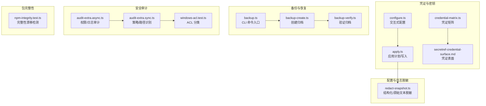
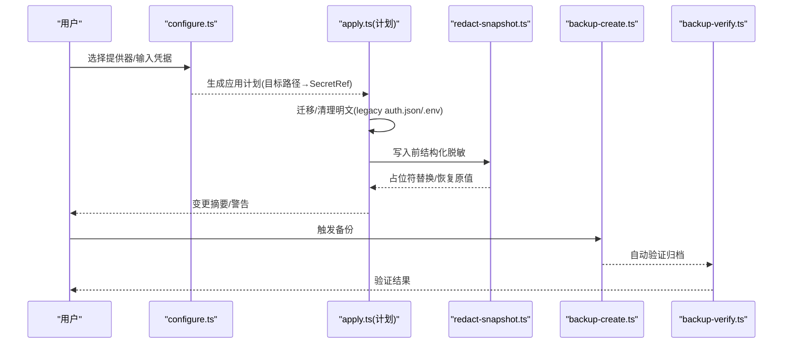
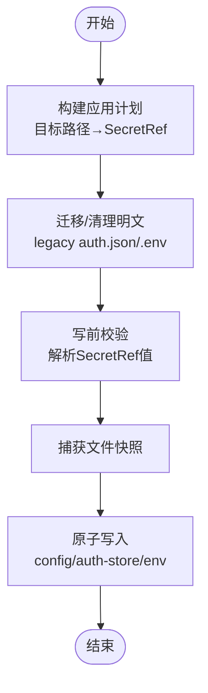
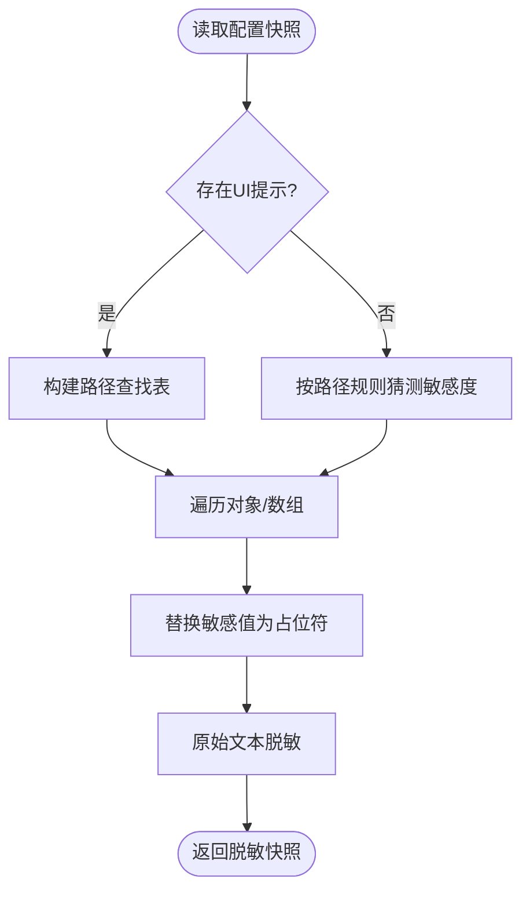
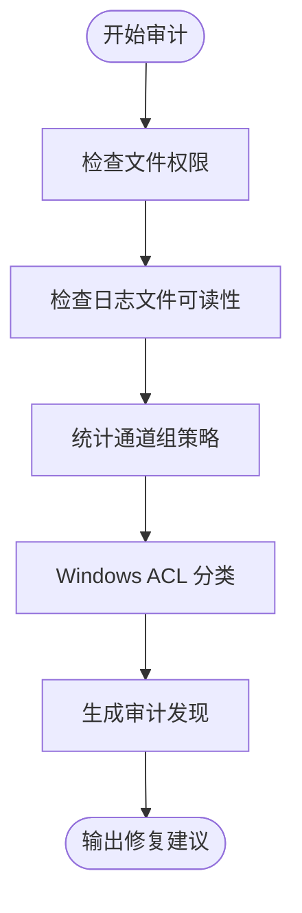
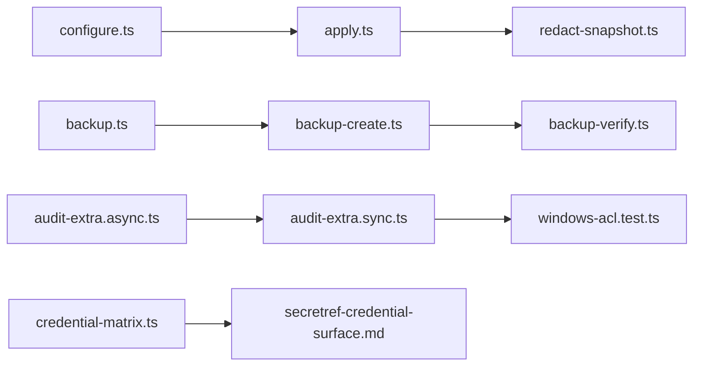

# 数据保护

<cite>
**本文引用的文件**
- [src/secrets/apply.ts](file://src/secrets/apply.ts)
- [src/secrets/configure.ts](file://src/secrets/configure.ts)
- [src/config/redact-snapshot.ts](file://src/config/redact-snapshot.ts)
- [src/infra/backup-create.ts](file://src/infra/backup-create.ts)
- [src/commands/backup-verify.ts](file://src/commands/backup-verify.ts)
- [src/security/audit-extra.async.ts](file://src/security/audit-extra.async.ts)
- [src/security/audit-extra.sync.ts](file://src/security/audit-extra.sync.ts)
- [src/security/windows-acl.test.ts](file://src/security/windows-acl.test.ts)
- [src/infra/npm-integrity.test.ts](file://src/infra/npm-integrity.test.ts)
- [src/commands/backup.ts](file://src/commands/backup.ts)
- [docs/reference/secretref-credential-surface.md](file://docs/reference/secretref-credential-surface.md)
- [src/secrets/credential-matrix.ts](file://src/secrets/credential-matrix.ts)
- [src/security/audit-extra.sync.test.ts](file://src/security/audit-extra.sync.test.ts)
</cite>

## 目录
1. [引言](#引言)
2. [项目结构](#项目结构)
3. [核心组件](#核心组件)
4. [架构总览](#架构总览)
5. [详细组件分析](#详细组件分析)
6. [依赖关系分析](#依赖关系分析)
7. [性能考量](#性能考量)
8. [故障排查指南](#故障排查指南)
9. [结论](#结论)
10. [附录](#附录)

## 引言
本文件系统化梳理 OpenClaw 的数据保护机制，覆盖敏感数据处理、凭证与密钥管理、配置与日志脱敏、备份与恢复、访问审计与合规检查等关键领域。文档面向不同技术背景读者，既提供高层概览，也给出可操作的配置示例、检查清单与应急流程。

## 项目结构
围绕数据保护的关键目录与文件：
- 凭证与密钥管理：src/secrets/*（交互式配置、应用计划、运行时解析）
- 配置与日志脱敏：src/config/redact-snapshot.ts（结构化与原始文本脱敏）
- 备份与恢复：src/infra/backup-create.ts、src/commands/backup-verify.ts、src/commands/backup.ts
- 安全审计：src/security/audit-extra.async.ts、src/security/audit-extra.sync.ts、src/security/windows-acl.test.ts
- 包完整性校验：src/infra/npm-integrity.test.ts
- 凭证表面矩阵：docs/reference/secretref-credential-surface.md、src/secrets/credential-matrix.ts



**图表来源**
- [src/secrets/configure.ts:745-992](file://src/secrets/configure.ts#L745-L992)
- [src/secrets/apply.ts:700-778](file://src/secrets/apply.ts#L700-L778)
- [src/config/redact-snapshot.ts:382-431](file://src/config/redact-snapshot.ts#L382-L431)
- [src/infra/backup-create.ts:272-369](file://src/infra/backup-create.ts#L272-L369)
- [src/commands/backup-verify.ts:92-140](file://src/commands/backup-verify.ts#L92-L140)
- [src/commands/backup.ts:11-32](file://src/commands/backup.ts#L11-L32)
- [src/security/audit-extra.async.ts:1028-1127](file://src/security/audit-extra.async.ts#L1028-L1127)
- [src/security/audit-extra.sync.ts:32-89](file://src/security/audit-extra.sync.ts#L32-L89)
- [src/security/windows-acl.test.ts:297-328](file://src/security/windows-acl.test.ts#L297-L328)
- [src/infra/npm-integrity.test.ts:1-123](file://src/infra/npm-integrity.test.ts#L1-L123)
- [docs/reference/secretref-credential-surface.md:1-91](file://docs/reference/secretref-credential-surface.md#L1-L91)
- [src/secrets/credential-matrix.ts:35-60](file://src/secrets/credential-matrix.ts#L35-L60)

**章节来源**
- [src/secrets/configure.ts:745-992](file://src/secrets/configure.ts#L745-L992)
- [src/secrets/apply.ts:700-778](file://src/secrets/apply.ts#L700-L778)
- [src/config/redact-snapshot.ts:382-431](file://src/config/redact-snapshot.ts#L382-L431)
- [src/infra/backup-create.ts:272-369](file://src/infra/backup-create.ts#L272-L369)
- [src/commands/backup-verify.ts:92-140](file://src/commands/backup-verify.ts#L92-L140)
- [src/commands/backup.ts:11-32](file://src/commands/backup.ts#L11-L32)
- [src/security/audit-extra.async.ts:1028-1127](file://src/security/audit-extra.async.ts#L1028-L1127)
- [src/security/audit-extra.sync.ts:32-89](file://src/security/audit-extra.sync.ts#L32-L89)
- [src/security/windows-acl.test.ts:297-328](file://src/security/windows-acl.test.ts#L297-L328)
- [src/infra/npm-integrity.test.ts:1-123](file://src/infra/npm-integrity.test.ts#L1-L123)
- [docs/reference/secretref-credential-surface.md:1-91](file://docs/reference/secretref-credential-surface.md#L1-L91)
- [src/secrets/credential-matrix.ts:35-60](file://src/secrets/credential-matrix.ts#L35-L60)

## 核心组件
- 凭证与密钥管理
  - 交互式配置：提供环境变量、文件、可执行三种来源的凭据提供器配置，支持别名、白名单、超时、输出大小限制、可信目录、传入环境变量透传等。
  - 应用计划：将目标路径映射为 SecretRef，对 auth-profiles.json、legacy auth.json、.env 等进行安全迁移与清理，确保静态引用替代明文值。
  - 凭证矩阵与表面：定义“用户直接提供的凭据”范围，明确哪些字段支持 SecretRef 配置与审计。
- 配置与日志脱敏
  - 结构化脱敏：基于 UI 提示与路径规则，将敏感字段替换为占位符，并在写回前恢复原值，避免 UI 轮询导致凭据丢失。
  - 原始文本脱敏：收集敏感字符串并按最长优先策略替换，保证 JSON5 源码不泄露。
- 备份与恢复
  - 归档创建：生成带清单的压缩归档，记录包含/跳过路径、运行时版本、平台信息；支持仅配置或包含工作区。
  - 归档验证：解析并校验清单格式与内容，确保路径合法性与完整性。
  - CLI 入口：支持创建后自动验证、JSON 输出、干运行等。
- 安全审计
  - 文件权限审计：检查 auth-profiles.json、日志文件等是否对其他用户可读写，提出修复建议。
  - 策略与路径识别：统计通道组策略、识别同步目录、环境变量引用等。
  - Windows ACL 分类：区分“世界”和“组”可读写，确保审计严重级别准确。
- 包完整性
  - 完整性漂移检测：当解析产物的完整性哈希与预期不符时，发出警告或中止，防止供应链漂移。
- 数据生命周期与分类
  - 生命周期：从采集（SecretRef 解析）、使用（运行时快照）、变更（apply）、备份（归档）、销毁（清理）全流程受控。
  - 分类：依据路径规则与 UI 提示判定敏感度，结合 URL 用户信息脱敏等策略降低泄露面。

**章节来源**
- [src/secrets/configure.ts:745-992](file://src/secrets/configure.ts#L745-L992)
- [src/secrets/apply.ts:179-257](file://src/secrets/apply.ts#L179-L257)
- [src/config/redact-snapshot.ts:382-431](file://src/config/redact-snapshot.ts#L382-L431)
- [src/infra/backup-create.ts:272-369](file://src/infra/backup-create.ts#L272-L369)
- [src/commands/backup-verify.ts:92-140](file://src/commands/backup-verify.ts#L92-L140)
- [src/security/audit-extra.async.ts:1028-1127](file://src/security/audit-extra.async.ts#L1028-L1127)
- [src/security/audit-extra.sync.ts:32-89](file://src/security/audit-extra.sync.ts#L32-L89)
- [src/security/windows-acl.test.ts:297-328](file://src/security/windows-acl.test.ts#L297-L328)
- [src/infra/npm-integrity.test.ts:1-123](file://src/infra/npm-integrity.test.ts#L1-L123)
- [docs/reference/secretref-credential-surface.md:1-91](file://docs/reference/secretref-credential-surface.md#L1-L91)
- [src/secrets/credential-matrix.ts:35-60](file://src/secrets/credential-matrix.ts#L35-L60)

## 架构总览
下图展示从“交互式配置”到“应用计划”、“脱敏”、“备份”的端到端数据保护流程。



**图表来源**
- [src/secrets/configure.ts:745-992](file://src/secrets/configure.ts#L745-L992)
- [src/secrets/apply.ts:179-257](file://src/secrets/apply.ts#L179-L257)
- [src/config/redact-snapshot.ts:382-431](file://src/config/redact-snapshot.ts#L382-L431)
- [src/infra/backup-create.ts:272-369](file://src/infra/backup-create.ts#L272-L369)
- [src/commands/backup-verify.ts:92-140](file://src/commands/backup-verify.ts#L92-L140)

## 详细组件分析

### 组件A：凭证与密钥管理（configure/apply）
- 交互式配置
  - 支持 env/file/exec 三类提供器，允许设置别名、白名单、超时、输出大小、可信目录、传入环境变量等。
  - 对 auth-profiles.json 的新配置进行类型与提供器一致性校验。
- 应用计划
  - 将目标路径转换为 SecretRef，必要时删除旧明文字段，写入 ref 字段。
  - 清理 legacy auth.json 中的明文键，清理 .env 中已迁移的敏感行。
  - 在写入前捕获文件快照，失败时尽力回滚，保障原子性。
- 凭证矩阵与表面
  - 明确“严格用户提供的凭据”范围，限定可配置 SecretRef 的字段集合，便于审计与合规。



**图表来源**
- [src/secrets/apply.ts:179-257](file://src/secrets/apply.ts#L179-L257)
- [src/secrets/apply.ts:700-778](file://src/secrets/apply.ts#L700-L778)
- [src/secrets/configure.ts:745-992](file://src/secrets/configure.ts#L745-L992)
- [src/secrets/credential-matrix.ts:35-60](file://src/secrets/credential-matrix.ts#L35-L60)
- [docs/reference/secretref-credential-surface.md:1-91](file://docs/reference/secretref-credential-surface.md#L1-L91)

**章节来源**
- [src/secrets/configure.ts:745-992](file://src/secrets/configure.ts#L745-L992)
- [src/secrets/apply.ts:179-257](file://src/secrets/apply.ts#L179-L257)
- [src/secrets/apply.ts:700-778](file://src/secrets/apply.ts#L700-L778)
- [src/secrets/credential-matrix.ts:35-60](file://src/secrets/credential-matrix.ts#L35-L60)
- [docs/reference/secretref-credential-surface.md:1-91](file://docs/reference/secretref-credential-surface.md#L1-L91)

### 组件B：配置与日志脱敏（redact-snapshot）
- 结构化脱敏
  - 基于 UI 提示与路径规则，将敏感字段替换为占位符；写回前通过恢复逻辑将占位符还原为原始值，避免 UI 轮询导致凭据丢失。
- 原始文本脱敏
  - 收集敏感字符串，按最长优先策略替换 JSON5 原始文本中的敏感值，确保源码不泄露。
- URL 用户信息脱敏
  - 对包含用户信息的 URL 做剥离处理，降低凭据泄露风险。



**图表来源**
- [src/config/redact-snapshot.ts:382-431](file://src/config/redact-snapshot.ts#L382-L431)
- [src/config/redact-snapshot.ts:15-71](file://src/config/redact-snapshot.ts#L15-L71)

**章节来源**
- [src/config/redact-snapshot.ts:382-431](file://src/config/redact-snapshot.ts#L382-L431)
- [src/config/redact-snapshot.ts:15-71](file://src/config/redact-snapshot.ts#L15-L71)

### 组件C：备份与恢复（backup-create/backup-verify）
- 归档创建
  - 生成清单，记录包含/跳过路径、运行时版本、平台信息；支持仅配置或包含工作区；输出临时归档后发布到最终路径，避免覆盖现有文件。
- 归档验证
  - 校验清单 JSON、schema 版本、必需字段、资产列表合法性；确保归档内路径相对安全且未越界。
- CLI 入口
  - 支持创建后自动验证、JSON 输出、干运行等。

```mermaid
sequenceDiagram
participant CLI as "backup.ts"
participant Create as "backup-create.ts"
participant Verify as "backup-verify.ts"
CLI->>Create : 创建归档(选项)
Create-->>CLI : 返回结果(含清单路径)
CLI->>Verify : 解析并校验清单
Verify-->>CLI : 验证通过/失败
```

**图表来源**
- [src/commands/backup.ts:11-32](file://src/commands/backup.ts#L11-L32)
- [src/infra/backup-create.ts:272-369](file://src/infra/backup-create.ts#L272-L369)
- [src/commands/backup-verify.ts:92-140](file://src/commands/backup-verify.ts#L92-L140)

**章节来源**
- [src/commands/backup.ts:11-32](file://src/commands/backup.ts#L11-L32)
- [src/infra/backup-create.ts:272-369](file://src/infra/backup-create.ts#L272-L369)
- [src/commands/backup-verify.ts:92-140](file://src/commands/backup-verify.ts#L92-L140)

### 组件D：安全审计（audit-extra）
- 权限审计
  - 检查 auth-profiles.json、日志文件等是否对其他用户可读写，若发现风险，给出修复建议（如调整权限掩码）。
- 策略与路径识别
  - 统计通道组策略分布、识别同步目录、环境变量引用等，辅助安全策略制定。
- Windows ACL 分类
  - 正确区分“世界”和“组”可读写，确保审计严重级别准确。



**图表来源**
- [src/security/audit-extra.async.ts:1028-1127](file://src/security/audit-extra.async.ts#L1028-L1127)
- [src/security/audit-extra.sync.ts:32-89](file://src/security/audit-extra.sync.ts#L32-L89)
- [src/security/windows-acl.test.ts:297-328](file://src/security/windows-acl.test.ts#L297-L328)

**章节来源**
- [src/security/audit-extra.async.ts:1028-1127](file://src/security/audit-extra.async.ts#L1028-L1127)
- [src/security/audit-extra.sync.ts:32-89](file://src/security/audit-extra.sync.ts#L32-L89)
- [src/security/windows-acl.test.ts:297-328](file://src/security/windows-acl.test.ts#L297-L328)

### 组件E：包完整性（npm-integrity）
- 当解析产物的完整性哈希与预期不符时，发出默认警告或中止，防止供应链漂移。

**章节来源**
- [src/infra/npm-integrity.test.ts:1-123](file://src/infra/npm-integrity.test.ts#L1-L123)

## 依赖关系分析
- configure.ts 依赖 apply.ts 生成与应用计划；apply.ts 依赖 redact-snapshot.ts 进行写前脱敏；backup.ts 串联 backup-create.ts 与 backup-verify.ts。
- audit-extra.async.ts 与 audit-extra.sync.ts 协作完成权限与策略审计；windows-acl.test.ts 保障 ACL 分类正确性。
- credential-matrix.ts 与 secretref-credential-surface.md 共同定义凭证表面，指导配置与审计范围。



**图表来源**
- [src/secrets/configure.ts:745-992](file://src/secrets/configure.ts#L745-L992)
- [src/secrets/apply.ts:700-778](file://src/secrets/apply.ts#L700-L778)
- [src/config/redact-snapshot.ts:382-431](file://src/config/redact-snapshot.ts#L382-L431)
- [src/commands/backup.ts:11-32](file://src/commands/backup.ts#L11-L32)
- [src/infra/backup-create.ts:272-369](file://src/infra/backup-create.ts#L272-L369)
- [src/commands/backup-verify.ts:92-140](file://src/commands/backup-verify.ts#L92-L140)
- [src/security/audit-extra.async.ts:1028-1127](file://src/security/audit-extra.async.ts#L1028-L1127)
- [src/security/audit-extra.sync.ts:32-89](file://src/security/audit-extra.sync.ts#L32-L89)
- [src/security/windows-acl.test.ts:297-328](file://src/security/windows-acl.test.ts#L297-L328)
- [src/secrets/credential-matrix.ts:35-60](file://src/secrets/credential-matrix.ts#L35-L60)
- [docs/reference/secretref-credential-surface.md:1-91](file://docs/reference/secretref-credential-surface.md#L1-L91)

**章节来源**
- [src/secrets/configure.ts:745-992](file://src/secrets/configure.ts#L745-L992)
- [src/secrets/apply.ts:700-778](file://src/secrets/apply.ts#L700-L778)
- [src/config/redact-snapshot.ts:382-431](file://src/config/redact-snapshot.ts#L382-L431)
- [src/commands/backup.ts:11-32](file://src/commands/backup.ts#L11-L32)
- [src/infra/backup-create.ts:272-369](file://src/infra/backup-create.ts#L272-L369)
- [src/commands/backup-verify.ts:92-140](file://src/commands/backup-verify.ts#L92-L140)
- [src/security/audit-extra.async.ts:1028-1127](file://src/security/audit-extra.async.ts#L1028-L1127)
- [src/security/audit-extra.sync.ts:32-89](file://src/security/audit-extra.sync.ts#L32-L89)
- [src/security/windows-acl.test.ts:297-328](file://src/security/windows-acl.test.ts#L297-L328)
- [src/secrets/credential-matrix.ts:35-60](file://src/secrets/credential-matrix.ts#L35-L60)
- [docs/reference/secretref-credential-surface.md:1-91](file://docs/reference/secretref-credential-surface.md#L1-L91)

## 性能考量
- 脱敏与恢复
  - 结构化脱敏采用路径查找表与最长优先策略，减少重复扫描与替换成本；原始文本脱敏仅在必要时进行，避免对非敏感路径的额外开销。
- 备份
  - 使用 tar.gzip 并启用 portable 模式，减少跨平台差异；临时归档与硬链接/拷贝双策略，提升发布效率并避免覆盖风险。
- 审计
  - 权限检查与策略统计按需执行，避免对无关路径的过度扫描；Windows ACL 分类使用快速判定，降低误判概率。

[本节为通用指导，无需具体文件分析]

## 故障排查指南
- 凭证配置失败
  - 检查提供器别名与来源是否合法；确认目标路径在凭证表面范围内；查看应用计划的警告与错误。
  - 参考：[src/secrets/configure.ts:745-992](file://src/secrets/configure.ts#L745-L992)、[src/secrets/apply.ts:700-778](file://src/secrets/apply.ts#L700-L778)
- 备份失败
  - 确认输出路径不存在或位于源路径之外；检查归档验证错误（清单格式、schema 版本、资产列表）。
  - 参考：[src/infra/backup-create.ts:272-369](file://src/infra/backup-create.ts#L272-L369)、[src/commands/backup-verify.ts:92-140](file://src/commands/backup-verify.ts#L92-L140)
- 权限问题
  - 若 auth-profiles.json 或日志文件对其他用户可读写，按审计建议调整权限掩码；Windows 环境注意 ACL 分类。
  - 参考：[src/security/audit-extra.async.ts:1028-1127](file://src/security/audit-extra.async.ts#L1028-L1127)、[src/security/windows-acl.test.ts:297-328](file://src/security/windows-acl.test.ts#L297-L328)
- 包完整性告警
  - 当完整性哈希与预期不符时，检查依赖解析结果与回调处理；必要时中止并升级依赖。
  - 参考：[src/infra/npm-integrity.test.ts:1-123](file://src/infra/npm-integrity.test.ts#L1-L123)

**章节来源**
- [src/secrets/configure.ts:745-992](file://src/secrets/configure.ts#L745-L992)
- [src/secrets/apply.ts:700-778](file://src/secrets/apply.ts#L700-L778)
- [src/infra/backup-create.ts:272-369](file://src/infra/backup-create.ts#L272-L369)
- [src/commands/backup-verify.ts:92-140](file://src/commands/backup-verify.ts#L92-L140)
- [src/security/audit-extra.async.ts:1028-1127](file://src/security/audit-extra.async.ts#L1028-L1127)
- [src/security/windows-acl.test.ts:297-328](file://src/security/windows-acl.test.ts#L297-L328)
- [src/infra/npm-integrity.test.ts:1-123](file://src/infra/npm-integrity.test.ts#L1-L123)

## 结论
OpenClaw 的数据保护机制以“最小暴露面”为核心：通过 SecretRef 替代明文、严格的文件权限审计、结构化与原始文本双重脱敏、可靠的备份与验证、以及包完整性监控，形成从采集、使用、变更到销毁的闭环。建议在生产环境中结合凭证表面矩阵与审计报告，持续优化访问控制与数据分类策略。

[本节为总结性内容，无需具体文件分析]

## 附录

### 数据保护配置示例（步骤说明）
- 交互式配置提供器
  - 选择 env/file/exec 任一来源，设置别名与参数（如白名单、超时、可信目录等），保存至配置。
  - 参考：[src/secrets/configure.ts:745-992](file://src/secrets/configure.ts#L745-L992)
- 应用计划并写入
  - 生成应用计划，确认变更摘要与警告；开启写入后，系统会清理明文并写入 ref。
  - 参考：[src/secrets/apply.ts:700-778](file://src/secrets/apply.ts#L700-L778)
- 脱敏与恢复
  - 写前进行结构化与原始文本脱敏；写回前恢复占位符对应的原始值。
  - 参考：[src/config/redact-snapshot.ts:382-431](file://src/config/redact-snapshot.ts#L382-L431)
- 备份与验证
  - 创建归档并自动验证；如需仅备份配置，使用相应选项。
  - 参考：[src/commands/backup.ts:11-32](file://src/commands/backup.ts#L11-L32)、[src/infra/backup-create.ts:272-369](file://src/infra/backup-create.ts#L272-L369)、[src/commands/backup-verify.ts:92-140](file://src/commands/backup-verify.ts#L92-L140)

**章节来源**
- [src/secrets/configure.ts:745-992](file://src/secrets/configure.ts#L745-L992)
- [src/secrets/apply.ts:700-778](file://src/secrets/apply.ts#L700-L778)
- [src/config/redact-snapshot.ts:382-431](file://src/config/redact-snapshot.ts#L382-L431)
- [src/commands/backup.ts:11-32](file://src/commands/backup.ts#L11-L32)
- [src/infra/backup-create.ts:272-369](file://src/infra/backup-create.ts#L272-L369)
- [src/commands/backup-verify.ts:92-140](file://src/commands/backup-verify.ts#L92-L140)

### 合规性检查清单
- 凭证表面
  - 确认目标字段在“用户直接提供的凭据”范围内；不在范围内的字段需另行处理。
  - 参考：[docs/reference/secretref-credential-surface.md:1-91](file://docs/reference/secretref-credential-surface.md#L1-L91)、[src/secrets/credential-matrix.ts:35-60](file://src/secrets/credential-matrix.ts#L35-L60)
- 文件权限
  - auth-profiles.json、日志文件不得对其他用户可读写；Windows 环境注意 ACL 分类。
  - 参考：[src/security/audit-extra.async.ts:1028-1127](file://src/security/audit-extra.async.ts#L1028-L1127)、[src/security/windows-acl.test.ts:297-328](file://src/security/windows-acl.test.ts#L297-L328)
- 备份完整性
  - 归档清单格式与内容必须有效；资产列表与路径均合法。
  - 参考：[src/commands/backup-verify.ts:92-140](file://src/commands/backup-verify.ts#L92-L140)
- 包完整性
  - 依赖解析产物的完整性哈希与预期一致；不一致时中止或升级。
  - 参考：[src/infra/npm-integrity.test.ts:1-123](file://src/infra/npm-integrity.test.ts#L1-L123)

**章节来源**
- [docs/reference/secretref-credential-surface.md:1-91](file://docs/reference/secretref-credential-surface.md#L1-L91)
- [src/secrets/credential-matrix.ts:35-60](file://src/secrets/credential-matrix.ts#L35-L60)
- [src/security/audit-extra.async.ts:1028-1127](file://src/security/audit-extra.async.ts#L1028-L1127)
- [src/security/windows-acl.test.ts:297-328](file://src/security/windows-acl.test.ts#L297-L328)
- [src/commands/backup-verify.ts:92-140](file://src/commands/backup-verify.ts#L92-L140)
- [src/infra/npm-integrity.test.ts:1-123](file://src/infra/npm-integrity.test.ts#L1-L123)

### 数据泄露响应流程
- 快速评估
  - 确定受影响范围（凭证表面、日志、备份）；判断是否涉及外部共享介质。
- 阻断与隔离
  - 立即撤销或轮换相关 SecretRef；限制对 auth-profiles.json、日志文件的访问。
- 修复与验证
  - 重新应用计划，清理遗留明文；执行备份验证与审计报告。
- 回顾与改进
  - 更新访问控制策略；完善凭证表面矩阵与审计规则。

**章节来源**
- [src/secrets/apply.ts:700-778](file://src/secrets/apply.ts#L700-L778)
- [src/commands/backup-verify.ts:92-140](file://src/commands/backup-verify.ts#L92-L140)
- [src/security/audit-extra.async.ts:1028-1127](file://src/security/audit-extra.async.ts#L1028-L1127)

### 数据完整性验证、备份验证与灾难恢复测试方法
- 数据完整性验证
  - 使用包完整性检测工具，比较解析产物的完整性哈希与预期值；不一致则中止或升级。
  - 参考：[src/infra/npm-integrity.test.ts:1-123](file://src/infra/npm-integrity.test.ts#L1-L123)
- 备份验证
  - 解析清单 JSON，校验 schema 版本、必需字段、资产列表；确保路径相对安全且未越界。
  - 参考：[src/commands/backup-verify.ts:92-140](file://src/commands/backup-verify.ts#L92-L140)
- 灾难恢复测试
  - 从备份中提取清单与资产，验证可读性与完整性；模拟恢复流程，确认配置与状态可重建。

**章节来源**
- [src/infra/npm-integrity.test.ts:1-123](file://src/infra/npm-integrity.test.ts#L1-L123)
- [src/commands/backup-verify.ts:92-140](file://src/commands/backup-verify.ts#L92-L140)