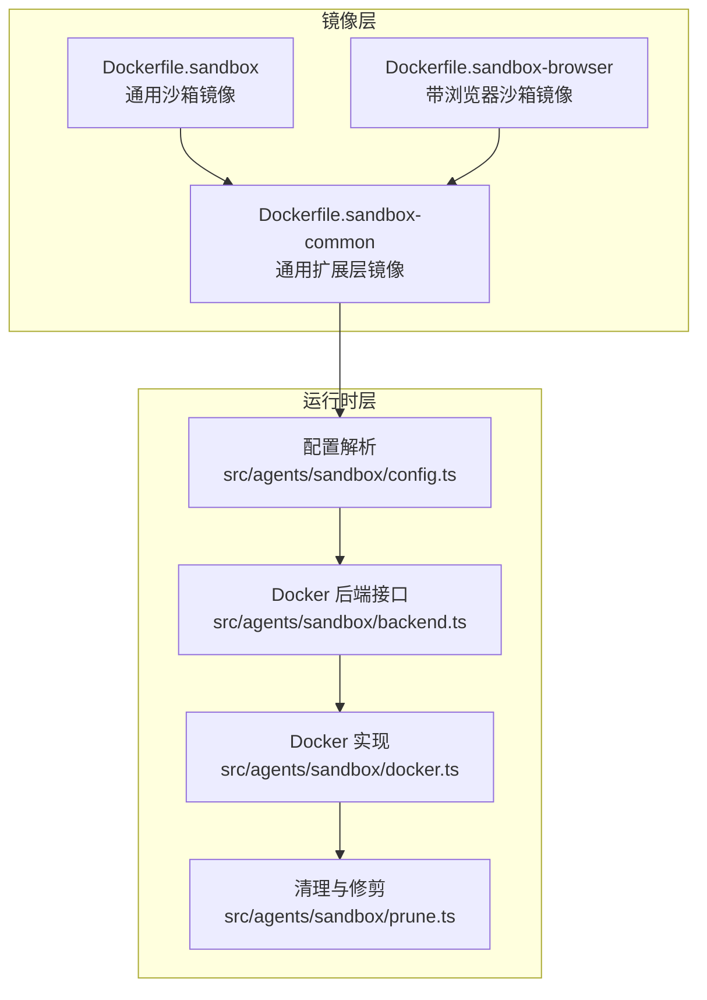
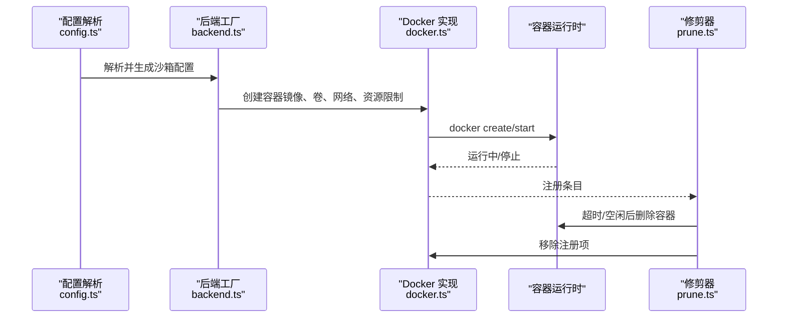
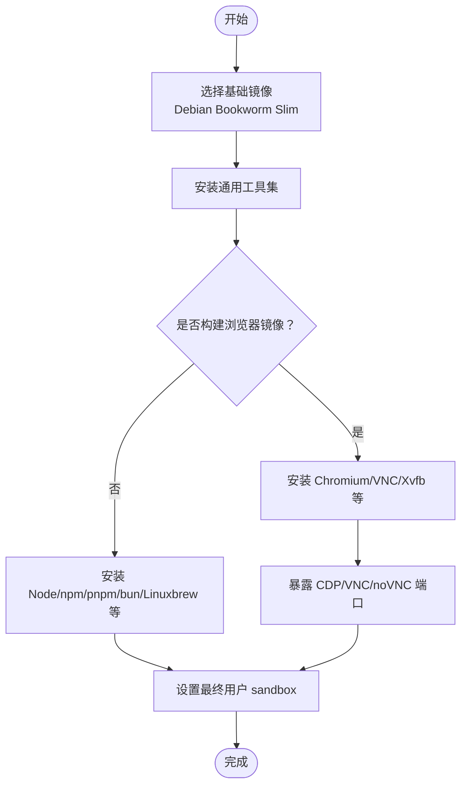
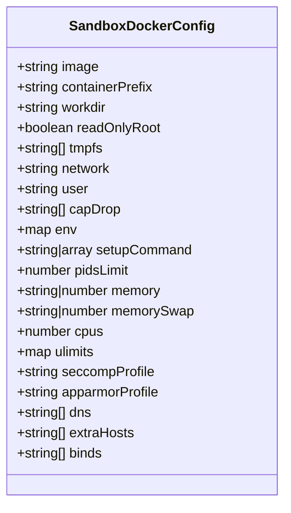
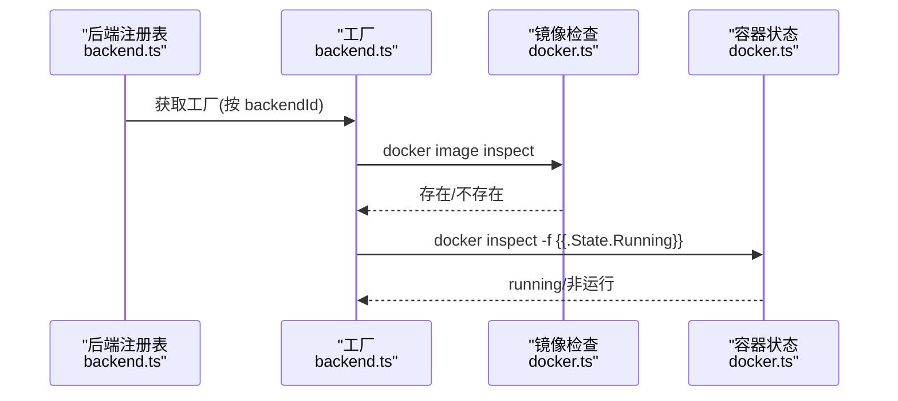
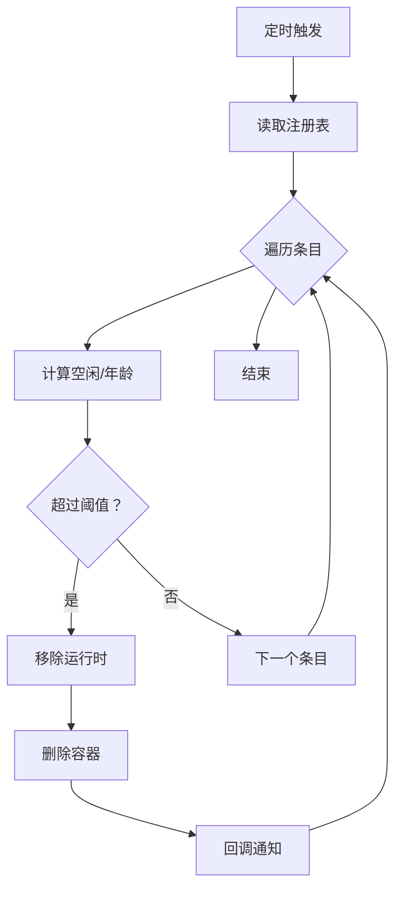
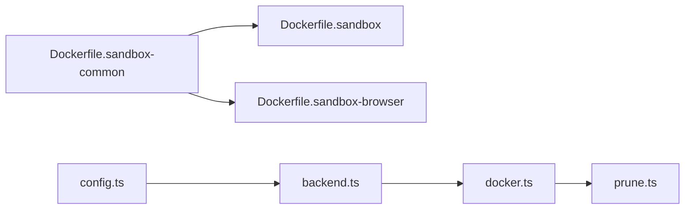

# 沙箱机制

<cite>
**本文引用的文件**
- [Dockerfile.sandbox](file://Dockerfile.sandbox)
- [Dockerfile.sandbox-browser](file://Dockerfile.sandbox-browser)
- [Dockerfile.sandbox-common](file://Dockerfile.sandbox-common)
- [scripts/sandbox-setup.sh](file://scripts/sandbox-setup.sh)
- [scripts/sandbox-browser-setup.sh](file://scripts/sandbox-browser-setup.sh)
- [scripts/sandbox-common-setup.sh](file://scripts/sandbox-common-setup.sh)
- [src/agents/sandbox/types.docker.ts](file://src/agents/sandbox/types.docker.ts)
- [src/agents/sandbox/docker.ts](file://src/agents/sandbox/docker.ts)
- [src/agents/sandbox/config.ts](file://src/agents/sandbox/config.ts)
- [src/agents/sandbox/backend.ts](file://src/agents/sandbox/backend.ts)
- [src/agents/sandbox/prune.ts](file://src/agents/sandbox/prune.ts)
- [src/config/zod-schema.agent-runtime.ts](file://src/config/zod-schema.agent-runtime.ts)
- [src/node-host/exec-policy.ts](file://src/node-host/exec-policy.ts)
- [docs/install/docker.md](file://docs/install/docker.md)
- [docs/zh-CN/install/docker.md](file://docs/zh-CN/install/docker.md)
- [CHANGELOG.md](file://CHANGELOG.md)
- [SECURITY.md](file://SECURITY.md)
- [dist/audit-0_0haEC6.js](file://dist/audit-0_0haEC6.js)
</cite>

## 目录
1. [引言](#引言)
2. [项目结构](#项目结构)
3. [核心组件](#核心组件)
4. [架构总览](#架构总览)
5. [详细组件分析](#详细组件分析)
6. [依赖关系分析](#依赖关系分析)
7. [性能考量](#性能考量)
8. [故障排查指南](#故障排查指南)
9. [结论](#结论)
10. [附录](#附录)

## 引言
本文件系统性阐述 OpenClaw 的容器化沙箱机制，覆盖容器镜像构建、文件系统与进程隔离、配置参数与资源限制、安全策略、启动与生命周期管理、状态监控、跨平台差异、性能优化与故障恢复，并提供配置示例、调试技巧与安全边界验证及渗透测试方法。目标是帮助开发者与运维人员在不同平台上正确部署与维护 OpenClaw 的沙箱能力。

## 项目结构
OpenClaw 的沙箱实现由“镜像层”和“运行时层”两部分组成：
- 镜像层：通过 Dockerfile 定义基础镜像、安装包与用户环境，分别支持通用沙箱、带浏览器的沙箱以及通用扩展层。
- 运行时层：负责解析沙箱配置、调用 Docker 创建与管理容器、执行资源限制与安全策略、清理闲置容器等。

图表来源
- [Dockerfile.sandbox:1-25](file://Dockerfile.sandbox#L1-L25)
- [Dockerfile.sandbox-browser:1-36](file://Dockerfile.sandbox-browser#L1-L36)
- [Dockerfile.sandbox-common:1-49](file://Dockerfile.sandbox-common#L1-L49)
- [src/agents/sandbox/config.ts:82-98](file://src/agents/sandbox/config.ts#L82-L98)
- [src/agents/sandbox/backend.ts:56-107](file://src/agents/sandbox/backend.ts#L56-L107)
- [src/agents/sandbox/docker.ts:244-290](file://src/agents/sandbox/docker.ts#L244-L290)
- [src/agents/sandbox/prune.ts:38-79](file://src/agents/sandbox/prune.ts#L38-L79)

章节来源
- [Dockerfile.sandbox:1-25](file://Dockerfile.sandbox#L1-L25)
- [Dockerfile.sandbox-browser:1-36](file://Dockerfile.sandbox-browser#L1-L36)
- [Dockerfile.sandbox-common:1-49](file://Dockerfile.sandbox-common#L1-L49)
- [scripts/sandbox-setup.sh:1-8](file://scripts/sandbox-setup.sh#L1-L8)
- [scripts/sandbox-browser-setup.sh:1-8](file://scripts/sandbox-browser-setup.sh#L1-L8)
- [scripts/sandbox-common-setup.sh:1-55](file://scripts/sandbox-common-setup.sh#L1-L55)

## 核心组件
- 镜像构建脚本与命令
  - 通用沙箱镜像：[scripts/sandbox-setup.sh:1-8](file://scripts/sandbox-setup.sh#L1-L8)
  - 带浏览器沙箱镜像：[scripts/sandbox-browser-setup.sh:1-8](file://scripts/sandbox-browser-setup.sh#L1-L8)
  - 通用扩展层镜像：[scripts/sandbox-common-setup.sh:1-55](file://scripts/sandbox-common-setup.sh#L1-L55)
- Dockerfile 定义
  - 通用沙箱：[Dockerfile.sandbox:1-25](file://Dockerfile.sandbox#L1-L25)
  - 浏览器沙箱：[Dockerfile.sandbox-browser:1-36](file://Dockerfile.sandbox-browser#L1-L36)
  - 通用扩展层：[Dockerfile.sandbox-common:1-49](file://Dockerfile.sandbox-common#L1-L49)
- 配置解析与类型约束
  - 类型定义与必填项：[src/agents/sandbox/types.docker.ts:1-13](file://src/agents/sandbox/types.docker.ts#L1-L13)
  - 配置合并与环境变量处理：[src/agents/sandbox/config.ts:82-98](file://src/agents/sandbox/config.ts#L82-L98)
  - Docker 运行时配置 Schema（含资源限制与安全选项）：[src/config/zod-schema.agent-runtime.ts:96-134](file://src/config/zod-schema.agent-runtime.ts#L96-L134)
- Docker 后端与运行时管理
  - 后端注册与工厂接口：[src/agents/sandbox/backend.ts:56-107](file://src/agents/sandbox/backend.ts#L56-L107)
  - 镜像存在性检查与容器状态查询：[src/agents/sandbox/docker.ts:244-290](file://src/agents/sandbox/docker.ts#L244-L290)
- 生命周期与清理
  - 容器修剪与过期回收：[src/agents/sandbox/prune.ts:38-79](file://src/agents/sandbox/prune.ts#L38-L79)
- 安全策略与执行策略
  - 系统执行策略评估：[src/node-host/exec-policy.ts:52-83](file://src/node-host/exec-policy.ts#L52-L83)

章节来源
- [scripts/sandbox-setup.sh:1-8](file://scripts/sandbox-setup.sh#L1-L8)
- [scripts/sandbox-browser-setup.sh:1-8](file://scripts/sandbox-browser-setup.sh#L1-L8)
- [scripts/sandbox-common-setup.sh:1-55](file://scripts/sandbox-common-setup.sh#L1-L55)
- [Dockerfile.sandbox:1-25](file://Dockerfile.sandbox#L1-L25)
- [Dockerfile.sandbox-browser:1-36](file://Dockerfile.sandbox-browser#L1-L36)
- [Dockerfile.sandbox-common:1-49](file://Dockerfile.sandbox-common#L1-L49)
- [src/agents/sandbox/types.docker.ts:1-13](file://src/agents/sandbox/types.docker.ts#L1-L13)
- [src/agents/sandbox/config.ts:82-98](file://src/agents/sandbox/config.ts#L82-L98)
- [src/config/zod-schema.agent-runtime.ts:96-134](file://src/config/zod-schema.agent-runtime.ts#L96-L134)
- [src/agents/sandbox/backend.ts:56-107](file://src/agents/sandbox/backend.ts#L56-L107)
- [src/agents/sandbox/docker.ts:244-290](file://src/agents/sandbox/docker.ts#L244-L290)
- [src/agents/sandbox/prune.ts:38-79](file://src/agents/sandbox/prune.ts#L38-L79)
- [src/node-host/exec-policy.ts:52-83](file://src/node-host/exec-policy.ts#L52-L83)

## 架构总览
下图展示从配置到容器运行、再到生命周期管理的整体流程。

图表来源
- [src/agents/sandbox/config.ts:82-98](file://src/agents/sandbox/config.ts#L82-L98)
- [src/agents/sandbox/backend.ts:56-107](file://src/agents/sandbox/backend.ts#L56-L107)
- [src/agents/sandbox/docker.ts:244-290](file://src/agents/sandbox/docker.ts#L244-L290)
- [src/agents/sandbox/prune.ts:38-79](file://src/agents/sandbox/prune.ts#L38-L79)

## 详细组件分析

### 组件一：镜像与构建脚本
- 通用沙箱镜像
  - 基于 Debian Bookworm Slim，安装常用工具集，创建非特权用户，设置默认 CMD。
  - 参考路径：[Dockerfile.sandbox:1-25](file://Dockerfile.sandbox#L1-L25)
  - 构建脚本：[scripts/sandbox-setup.sh:1-8](file://scripts/sandbox-setup.sh#L1-L8)
- 带浏览器沙箱镜像
  - 在通用基础上增加 Chromium、VNC/WebSockify/Xvfb 等，暴露 CDP、VNC、noVNC 端口，入口为浏览器脚本。
  - 参考路径：[Dockerfile.sandbox-browser:1-36](file://Dockerfile.sandbox-browser#L1-L36)
  - 构建脚本：[scripts/sandbox-browser-setup.sh:1-8](file://scripts/sandbox-browser-setup.sh#L1-L8)
- 通用扩展层镜像
  - 作为公共基座，安装 Node/npm/pnpm/bun、Go/Rust 工具链、Linuxbrew 等，支持自定义打包与最终用户切换。
  - 参考路径：[Dockerfile.sandbox-common:1-49](file://Dockerfile.sandbox-common#L1-L49)
  - 构建脚本：[scripts/sandbox-common-setup.sh:1-55](file://scripts/sandbox-common-setup.sh#L1-L55)

图表来源
- [Dockerfile.sandbox:1-25](file://Dockerfile.sandbox#L1-L25)
- [Dockerfile.sandbox-browser:1-36](file://Dockerfile.sandbox-browser#L1-L36)
- [Dockerfile.sandbox-common:1-49](file://Dockerfile.sandbox-common#L1-L49)

章节来源
- [Dockerfile.sandbox:1-25](file://Dockerfile.sandbox#L1-L25)
- [Dockerfile.sandbox-browser:1-36](file://Dockerfile.sandbox-browser#L1-L36)
- [Dockerfile.sandbox-common:1-49](file://Dockerfile.sandbox-common#L1-L49)
- [scripts/sandbox-setup.sh:1-8](file://scripts/sandbox-setup.sh#L1-L8)
- [scripts/sandbox-browser-setup.sh:1-8](file://scripts/sandbox-browser-setup.sh#L1-L8)
- [scripts/sandbox-common-setup.sh:1-55](file://scripts/sandbox-common-setup.sh#L1-L55)

### 组件二：配置解析与类型约束
- 必填字段与类型推导
  - 通过类型别名确保 Docker 配置的关键字段在运行前得到校验与补齐。
  - 参考路径：[src/agents/sandbox/types.docker.ts:1-13](file://src/agents/sandbox/types.docker.ts#L1-L13)
- 配置合并策略
  - 全局与代理级配置合并，环境变量与 ulimits 的层级覆盖，绑定挂载的拼接。
  - 参考路径：[src/agents/sandbox/config.ts:82-98](file://src/agents/sandbox/config.ts#L82-L98)
- 运行时配置 Schema（资源限制与安全）
  - 包括镜像、容器前缀、工作目录、只读根文件系统、tmpfs、网络、用户、capability drop、环境变量、初始化命令、PID 数量限制、内存/CPU、ulimit、seccomp/AppArmor、DNS/extra hosts、bind 挂载等。
  - 参考路径：[src/config/zod-schema.agent-runtime.ts:96-134](file://src/config/zod-schema.agent-runtime.ts#L96-L134)

图表来源
- [src/config/zod-schema.agent-runtime.ts:96-134](file://src/config/zod-schema.agent-runtime.ts#L96-L134)
- [src/agents/sandbox/types.docker.ts:1-13](file://src/agents/sandbox/types.docker.ts#L1-L13)

章节来源
- [src/agents/sandbox/types.docker.ts:1-13](file://src/agents/sandbox/types.docker.ts#L1-L13)
- [src/agents/sandbox/config.ts:82-98](file://src/agents/sandbox/config.ts#L82-L98)
- [src/config/zod-schema.agent-runtime.ts:96-134](file://src/config/zod-schema.agent-runtime.ts#L96-L134)

### 组件三：Docker 后端与运行时管理
- 后端注册与工厂模式
  - 支持按后端 ID 注册工厂与管理器，统一描述运行时、移除运行时等。
  - 参考路径：[src/agents/sandbox/backend.ts:56-107](file://src/agents/sandbox/backend.ts#L56-L107)
- 镜像与容器状态
  - 检查镜像是否存在；查询容器运行状态；规范化资源限制输入。
  - 参考路径：[src/agents/sandbox/docker.ts:244-290](file://src/agents/sandbox/docker.ts#L244-L290)

图表来源
- [src/agents/sandbox/backend.ts:56-107](file://src/agents/sandbox/backend.ts#L56-L107)
- [src/agents/sandbox/docker.ts:244-290](file://src/agents/sandbox/docker.ts#L244-L290)

章节来源
- [src/agents/sandbox/backend.ts:56-107](file://src/agents/sandbox/backend.ts#L56-L107)
- [src/agents/sandbox/docker.ts:244-290](file://src/agents/sandbox/docker.ts#L244-L290)

### 组件四：生命周期与状态监控
- 容器修剪与回收
  - 基于空闲时间与最大存活时间进行扫描与删除，失败忽略但记录日志。
  - 参考路径：[src/agents/sandbox/prune.ts:38-79](file://src/agents/sandbox/prune.ts#L38-L79)
- 运行时信息
  - 描述运行时状态、配置标签一致性、实际配置标签等，便于诊断。
  - 参考路径：[src/agents/sandbox/backend.ts:56-61](file://src/agents/sandbox/backend.ts#L56-L61)

图表来源
- [src/agents/sandbox/prune.ts:38-79](file://src/agents/sandbox/prune.ts#L38-L79)
- [src/agents/sandbox/backend.ts:56-61](file://src/agents/sandbox/backend.ts#L56-L61)

章节来源
- [src/agents/sandbox/prune.ts:38-79](file://src/agents/sandbox/prune.ts#L38-L79)
- [src/agents/sandbox/backend.ts:56-61](file://src/agents/sandbox/backend.ts#L56-L61)

### 组件五：安全策略与执行策略
- 执行策略评估
  - 根据安全级别、白名单满足度、审批决策、Windows Shell 包装器等因素综合判定允许与否，并输出事件原因与错误信息。
  - 参考路径：[src/node-host/exec-policy.ts:52-83](file://src/node-host/exec-policy.ts#L52-L83)
- 多用户信任模型与沙箱模式
  - 记录多用户启发式与个人助理信任模型，建议在共享访问场景下采用全量沙箱模式、仅工作区文件系统、减少工具面等。
  - 参考路径：[CHANGELOG.md:1531-1531](file://CHANGELOG.md#L1531-L1531)
- 审计与配置提示
  - 当配置了 Docker 设置但沙箱模式关闭时，审计器会给出修复建议。
  - 参考路径：[dist/audit-0_0haEC6.js:899-921](file://dist/audit-0_0haEC6.js#L899-L921)

章节来源
- [src/node-host/exec-policy.ts:52-83](file://src/node-host/exec-policy.ts#L52-L83)
- [CHANGELOG.md:1531-1531](file://CHANGELOG.md#L1531-L1531)
- [dist/audit-0_0haEC6.js:899-921](file://dist/audit-0_0haEC6.js#L899-L921)

## 依赖关系分析
- 镜像层依赖
  - 通用扩展层镜像以通用沙箱为基础，再叠加工具链与包管理器。
  - 浏览器镜像独立构建，但也可基于通用扩展层进一步定制。
- 运行时层依赖
  - 配置解析依赖全局与代理级配置，最终生成 Docker 运行时参数。
  - Docker 后端依赖 Docker CLI/守护进程，负责容器生命周期管理。
  - 清理模块依赖注册表与后端管理器，实现自动回收。

图表来源
- [Dockerfile.sandbox-common:1-49](file://Dockerfile.sandbox-common#L1-L49)
- [Dockerfile.sandbox:1-25](file://Dockerfile.sandbox#L1-L25)
- [Dockerfile.sandbox-browser:1-36](file://Dockerfile.sandbox-browser#L1-L36)
- [src/agents/sandbox/config.ts:82-98](file://src/agents/sandbox/config.ts#L82-L98)
- [src/agents/sandbox/backend.ts:56-107](file://src/agents/sandbox/backend.ts#L56-L107)
- [src/agents/sandbox/docker.ts:244-290](file://src/agents/sandbox/docker.ts#L244-L290)
- [src/agents/sandbox/prune.ts:38-79](file://src/agents/sandbox/prune.ts#L38-L79)

章节来源
- [Dockerfile.sandbox-common:1-49](file://Dockerfile.sandbox-common#L1-L49)
- [Dockerfile.sandbox:1-25](file://Dockerfile.sandbox#L1-L25)
- [Dockerfile.sandbox-browser:1-36](file://Dockerfile.sandbox-browser#L1-L36)
- [src/agents/sandbox/config.ts:82-98](file://src/agents/sandbox/config.ts#L82-L98)
- [src/agents/sandbox/backend.ts:56-107](file://src/agents/sandbox/backend.ts#L56-L107)
- [src/agents/sandbox/docker.ts:244-290](file://src/agents/sandbox/docker.ts#L244-L290)
- [src/agents/sandbox/prune.ts:38-79](file://src/agents/sandbox/prune.ts#L38-L79)

## 性能考量
- 镜像缓存与分层
  - 使用 Docker BuildKit 缓存 apt 缓存与列表，提升重复构建速度。
  - 参考路径：[Dockerfile.sandbox:7-8](file://Dockerfile.sandbox#L7-L8)、[Dockerfile.sandbox-browser:7-8](file://Dockerfile.sandbox-browser#L7-L8)、[Dockerfile.sandbox-common:24-25](file://Dockerfile.sandbox-common#L24-L25)
- 构建加速
  - 通过 buildx 与 cache-from/cache-to 参数配合，缩短本地与 CI 构建时间。
  - 参考路径：[scripts/sandbox-common-setup.sh:26-34](file://scripts/sandbox-common-setup.sh#L26-L34)
- 资源限制
  - 通过 pids/memory/cpus/ulimits 等参数控制容器资源占用，避免资源争用。
  - 参考路径：[src/config/zod-schema.agent-runtime.ts:111-129](file://src/config/zod-schema.agent-runtime.ts#L111-L129)
- 文件系统隔离
  - tmpfs 与只读根文件系统减少持久化开销与写扩散风险。
  - 参考路径：[src/config/zod-schema.agent-runtime.ts:101-102](file://src/config/zod-schema.agent-runtime.ts#L101-L102)

[本节为通用性能建议，不直接分析具体文件]

## 故障排查指南
- 镜像缺失
  - 现象：提示沙箱镜像不存在。
  - 处理：先构建通用镜像，再构建扩展层或浏览器镜像。
  - 参考路径：[src/agents/sandbox/docker.ts:258-269](file://src/agents/sandbox/docker.ts#L258-L269)
- 容器状态异常
  - 现象：容器已存在但未运行。
  - 处理：检查容器状态与日志，必要时删除旧容器后重试。
  - 参考路径：[src/agents/sandbox/docker.ts:271-279](file://src/agents/sandbox/docker.ts#L271-L279)
- 配置误用
  - 现象：配置了 Docker 设置但沙箱模式关闭。
  - 处理：启用沙箱模式或移除冗余配置。
  - 参考路径：[dist/audit-0_0haEC6.js:899-921](file://dist/audit-0_0haEC6.js#L899-L921)
- 多用户共享风险
  - 建议：采用全量沙箱模式、工作区范围文件系统、降低工具面、避免在共享运行时放置个人身份凭据。
  - 参考路径：[CHANGELOG.md:1531-1531](file://CHANGELOG.md#L1531-L1531)

章节来源
- [src/agents/sandbox/docker.ts:258-269](file://src/agents/sandbox/docker.ts#L258-L269)
- [src/agents/sandbox/docker.ts:271-279](file://src/agents/sandbox/docker.ts#L271-L279)
- [dist/audit-0_0haEC6.js:899-921](file://dist/audit-0_0haEC6.js#L899-L921)
- [CHANGELOG.md:1531-1531](file://CHANGELOG.md#L1531-L1531)

## 结论
OpenClaw 的沙箱机制通过标准化的镜像层与灵活的运行时层实现容器化隔离与资源控制。结合严格的配置 Schema、后端工厂模式与自动修剪策略，能够在多平台环境下稳定运行。建议在生产环境中启用全量沙箱模式、最小化工具面、严格限制资源并定期清理闲置容器，以获得更高的安全性与稳定性。

[本节为总结性内容，不直接分析具体文件]

## 附录

### 沙箱配置参数速查
- 基础参数
  - image：容器镜像名称
  - containerPrefix：容器名前缀
  - workdir：工作目录
  - readOnlyRoot：只读根文件系统
  - tmpfs：临时文件系统挂载点
  - network：网络模式
  - user：容器内用户
  - capDrop：丢弃的 capability 列表
  - env：环境变量映射
  - setupCommand：初始化命令（字符串或数组）
- 资源限制
  - pidsLimit：进程数上限
  - memory/memorySwap：内存与交换限制
  - cpus：CPU 配额
  - ulimits：ulimit 映射（支持软硬限制）
- 安全与网络
  - seccompProfile/apparmorProfile：安全配置文件
  - dns/extraHosts：DNS 与额外主机
  - binds：卷挂载列表
- 参考路径
  - [src/config/zod-schema.agent-runtime.ts:96-134](file://src/config/zod-schema.agent-runtime.ts#L96-L134)

章节来源
- [src/config/zod-schema.agent-runtime.ts:96-134](file://src/config/zod-schema.agent-runtime.ts#L96-L134)

### 平台差异与安装指引
- 安装与构建
  - 通用沙箱镜像构建：[scripts/sandbox-setup.sh:1-8](file://scripts/sandbox-setup.sh#L1-L8)
  - 浏览器沙箱镜像构建：[scripts/sandbox-browser-setup.sh:1-8](file://scripts/sandbox-browser-setup.sh#L1-L8)
  - 通用扩展层镜像构建：[scripts/sandbox-common-setup.sh:1-55](file://scripts/sandbox-common-setup.sh#L1-L55)
- 文档参考
  - 英文安装文档（含 Docker 构建示例）：[docs/install/docker.md:679-794](file://docs/install/docker.md#L679-L794)
  - 中文安装文档（含 Docker 构建示例）：[docs/zh-CN/install/docker.md:410-440](file://docs/zh-CN/install/docker.md#L410-L440)

章节来源
- [scripts/sandbox-setup.sh:1-8](file://scripts/sandbox-setup.sh#L1-L8)
- [scripts/sandbox-browser-setup.sh:1-8](file://scripts/sandbox-browser-setup.sh#L1-L8)
- [scripts/sandbox-common-setup.sh:1-55](file://scripts/sandbox-common-setup.sh#L1-L55)
- [docs/install/docker.md:679-794](file://docs/install/docker.md#L679-L794)
- [docs/zh-CN/install/docker.md:410-440](file://docs/zh-CN/install/docker.md#L410-L440)

### 沙箱启动流程与生命周期
- 启动流程
  - 解析配置 → 后端工厂创建 → 检查镜像 → 创建并启动容器 → 注册条目 → 运行中
  - 参考路径：[src/agents/sandbox/config.ts:82-98](file://src/agents/sandbox/config.ts#L82-L98)、[src/agents/sandbox/backend.ts:56-107](file://src/agents/sandbox/backend.ts#L56-L107)、[src/agents/sandbox/docker.ts:244-290](file://src/agents/sandbox/docker.ts#L244-L290)
- 生命周期管理
  - 定时修剪 → 超时/空闲回收 → 删除容器与注册项
  - 参考路径：[src/agents/sandbox/prune.ts:38-79](file://src/agents/sandbox/prune.ts#L38-L79)

章节来源
- [src/agents/sandbox/config.ts:82-98](file://src/agents/sandbox/config.ts#L82-L98)
- [src/agents/sandbox/backend.ts:56-107](file://src/agents/sandbox/backend.ts#L56-L107)
- [src/agents/sandbox/docker.ts:244-290](file://src/agents/sandbox/docker.ts#L244-L290)
- [src/agents/sandbox/prune.ts:38-79](file://src/agents/sandbox/prune.ts#L38-L79)

### 安全边界验证与渗透测试方法
- 安全边界验证
  - 网络隔离：确认容器网络模式与 DNS/extraHosts 配置，避免越权访问。
  - 文件系统隔离：验证只读根与 tmpfs 使用，防止持久化写扩散。
  - 进程隔离：验证 pidsLimit、ulimits、capDrop、seccomp/AppArmor。
  - 参考路径：[src/config/zod-schema.agent-runtime.ts:101-134](file://src/config/zod-schema.agent-runtime.ts#L101-L134)
- 渗透测试建议
  - 从容器内尝试访问宿主机文件系统、环回接口、其他容器命名空间，验证 capability drop 与 seccomp/AppArmor 生效。
  - 尝试逃逸路径（如挂载敏感路径、利用特权能力），验证只读根与卷挂载白名单。
  - 对浏览器沙箱进行 CDP 与远程桌面访问控制测试，确保仅开放受控端口与来源。
  - 参考路径：[Dockerfile.sandbox-browser:33-33](file://Dockerfile.sandbox-browser#L33-L33)、[CHANGELOG.md:1537-1537](file://CHANGELOG.md#L1537-L1537)

章节来源
- [src/config/zod-schema.agent-runtime.ts:101-134](file://src/config/zod-schema.agent-runtime.ts#L101-L134)
- [Dockerfile.sandbox-browser:33-33](file://Dockerfile.sandbox-browser#L33-L33)
- [CHANGELOG.md:1537-1537](file://CHANGELOG.md#L1537-L1537)