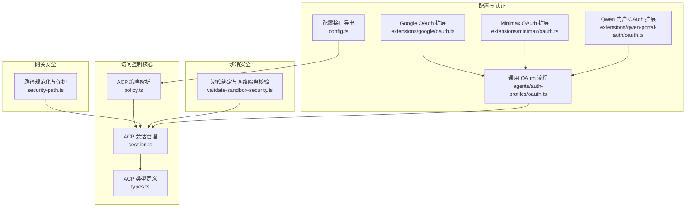
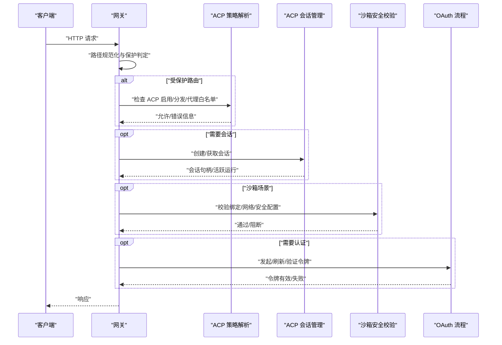
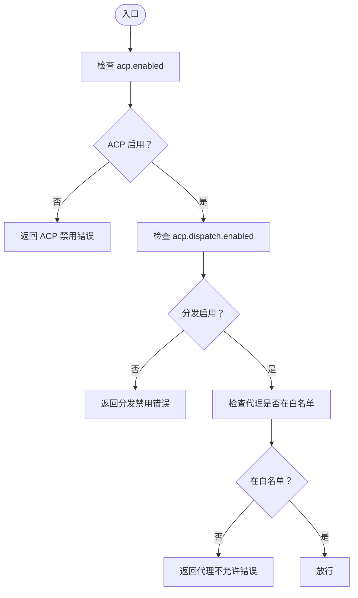
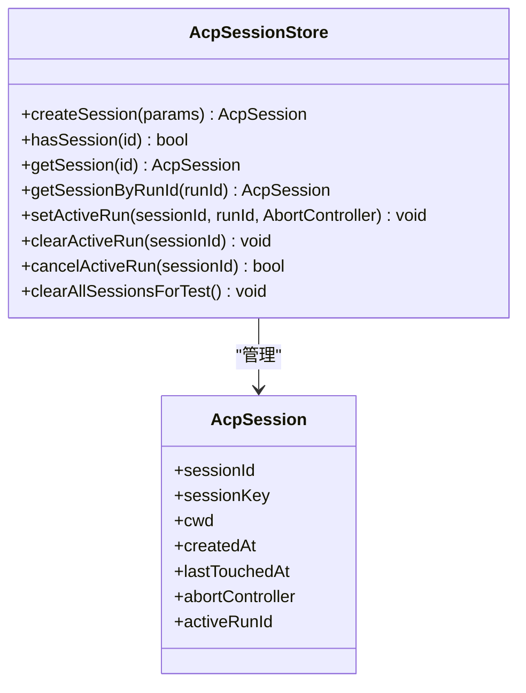
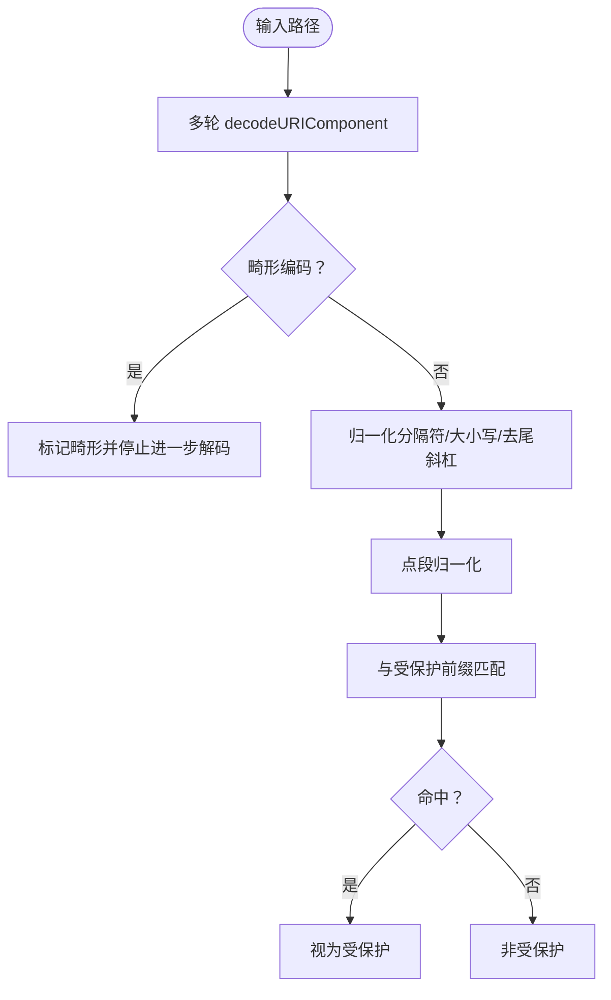
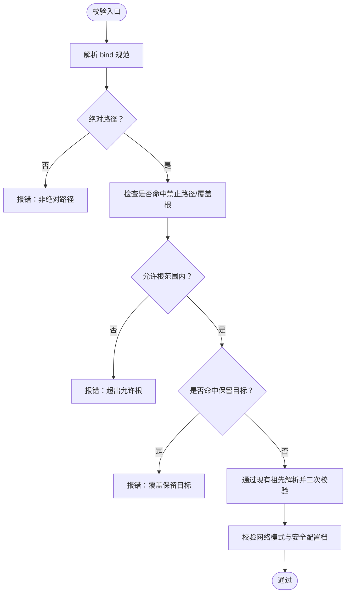
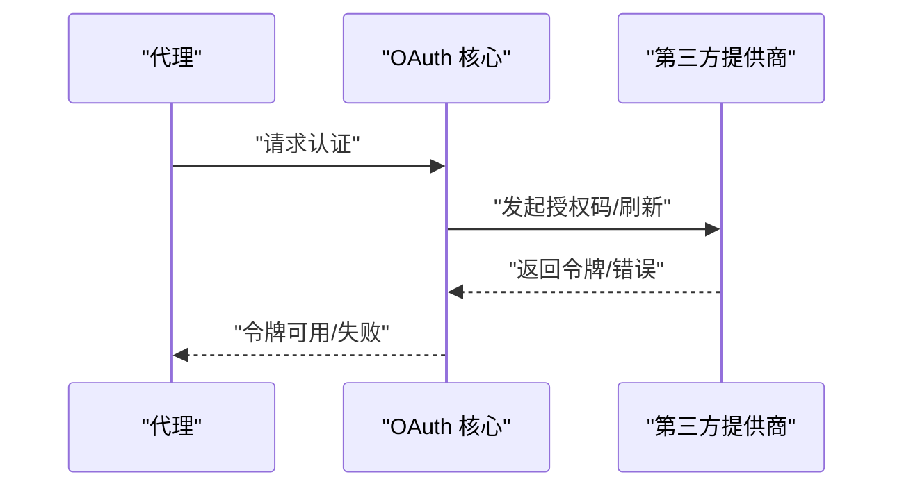
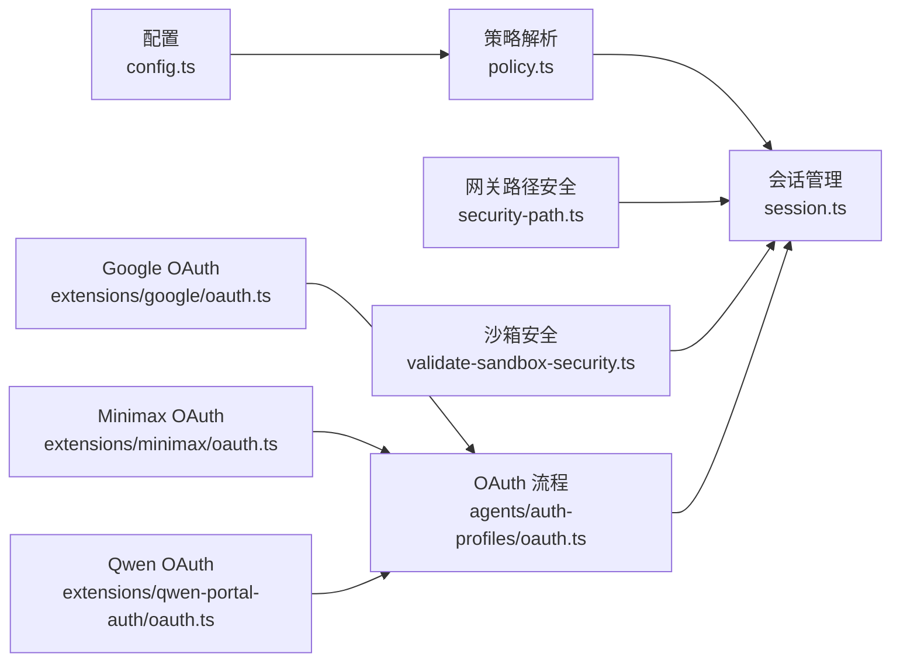

# 访问控制

<cite>
**本文引用的文件**
- [policy.ts](file://src/acp/policy.ts)
- [session.ts](file://src/acp/session.ts)
- [types.ts](file://src/acp/types.ts)
- [security-path.ts](file://src/gateway/security-path.ts)
- [validate-sandbox-security.ts](file://src/agents/sandbox/validate-sandbox-security.ts)
- [config.ts](file://src/config/config.ts)
- [oauth.ts](file://src/agents/auth-profiles/oauth.ts)
- [google/oauth.ts](file://extensions/google/oauth.ts)
- [minimax/oauth.ts](file://extensions/minimax/oauth.ts)
- [qwen-portal-auth/oauth.ts](file://extensions/qwen-portal-auth/oauth.ts)
</cite>

## 目录
1. [简介](#简介)
2. [项目结构](#项目结构)
3. [核心组件](#核心组件)
4. [架构总览](#架构总览)
5. [详细组件分析](#详细组件分析)
6. [依赖关系分析](#依赖关系分析)
7. [性能考量](#性能考量)
8. [故障排查指南](#故障排查指南)
9. [结论](#结论)
10. [附录](#附录)

## 简介
本文件系统性梳理 OpenClaw 的访问控制系统，覆盖身份认证机制、授权策略与会话管理；解释访问控制模型、权限继承与角色管理；阐述认证流程、令牌管理与凭据存储安全；并扩展到多因素认证、OAuth 集成与第三方身份提供商；最后提供访问控制配置示例、权限矩阵与审计日志建议、权限泄露检测、异常访问监控与测试方法。

## 项目结构
OpenClaw 将访问控制能力拆分为“策略解析”“会话管理”“路径安全校验”“沙箱安全”“配置与认证集成”等模块，分别位于 ACP 控制面与运行时、网关安全、代理沙箱、配置与 OAuth 扩展中。

**图表来源**
- [policy.ts:1-71](file://src/acp/policy.ts#L1-L71)
- [session.ts:1-191](file://src/acp/session.ts#L1-L191)
- [types.ts:1-52](file://src/acp/types.ts#L1-L52)
- [security-path.ts:1-162](file://src/gateway/security-path.ts#L1-L162)
- [validate-sandbox-security.ts:1-344](file://src/agents/sandbox/validate-sandbox-security.ts#L1-L344)
- [config.ts:1-29](file://src/config/config.ts#L1-L29)
- [oauth.ts](file://src/agents/auth-profiles/oauth.ts)
- [google/oauth.ts](file://extensions/google/oauth.ts)
- [minimax/oauth.ts](file://extensions/minimax/oauth.ts)
- [qwen-portal-auth/oauth.ts](file://extensions/qwen-portal-auth/oauth.ts)

**章节来源**
- [policy.ts:1-71](file://src/acp/policy.ts#L1-L71)
- [session.ts:1-191](file://src/acp/session.ts#L1-L191)
- [types.ts:1-52](file://src/acp/types.ts#L1-L52)
- [security-path.ts:1-162](file://src/gateway/security-path.ts#L1-L162)
- [validate-sandbox-security.ts:1-344](file://src/agents/sandbox/validate-sandbox-security.ts#L1-L344)
- [config.ts:1-29](file://src/config/config.ts#L1-L29)
- [oauth.ts](file://src/agents/auth-profiles/oauth.ts)
- [google/oauth.ts](file://extensions/google/oauth.ts)
- [minimax/oauth.ts](file://extensions/minimax/oauth.ts)
- [qwen-portal-auth/oauth.ts](file://extensions/qwen-portal-auth/oauth.ts)

## 核心组件
- ACP 策略解析：基于配置解析 ACP 启用状态、分发开关与允许的代理列表，返回运行时错误或提示信息。
- ACP 会话管理：内存会话存储，支持创建、查询、活跃运行关联、超时回收与并发限制。
- ACP 类型定义：会话结构、服务器选项（如网关地址、令牌、会话密钥、速率限制等）。
- 网关路径安全：对请求路径进行多轮解码、规范化、点段归一化与前缀匹配，判定是否受保护路由。
- 沙箱安全：禁止挂载系统关键路径、保留容器目标路径，限制网络模式与安全配置档，防止越权与逃逸。
- 配置接口：统一导出配置加载、验证与写入能力，为访问控制提供运行时参数来源。
- OAuth 集成：通用 OAuth 流程与多扩展提供商（Google、Minimax、Qwen 门户）对接。

**章节来源**
- [policy.ts:11-71](file://src/acp/policy.ts#L11-L71)
- [session.ts:24-191](file://src/acp/session.ts#L24-L191)
- [types.ts:20-52](file://src/acp/types.ts#L20-L52)
- [security-path.ts:45-162](file://src/gateway/security-path.ts#L45-L162)
- [validate-sandbox-security.ts:18-344](file://src/agents/sandbox/validate-sandbox-security.ts#L18-L344)
- [config.ts:1-29](file://src/config/config.ts#L1-L29)
- [oauth.ts](file://src/agents/auth-profiles/oauth.ts)

## 架构总览
下图展示从请求进入网关到 ACP 会话与沙箱安全校验的整体交互：

**图表来源**
- [security-path.ts:106-162](file://src/gateway/security-path.ts#L106-L162)
- [policy.ts:15-47](file://src/acp/policy.ts#L15-L47)
- [session.ts:80-107](file://src/acp/session.ts#L80-L107)
- [validate-sandbox-security.ts:328-344](file://src/agents/sandbox/validate-sandbox-security.ts#L328-L344)
- [oauth.ts](file://src/agents/auth-profiles/oauth.ts)

## 详细组件分析

### ACP 策略解析（访问控制模型与授权）
- 模型要点
  - 全局开关：acp.enabled 控制 ACP 是否启用。
  - 分发开关：acp.dispatch.enabled 控制是否允许分发请求。
  - 代理白名单：acp.allowedAgents 控制允许的代理集合，空集表示不限制。
- 授权判定
  - 若 ACP 关闭或分发关闭，返回明确错误或提示。
  - 若代理不在白名单，返回 ACP 运行时错误。
- 复杂度
  - 白名单匹配为 O(n)，n 为允许代理数量；可考虑使用集合优化至平均 O(1)。

**图表来源**
- [policy.ts:11-71](file://src/acp/policy.ts#L11-L71)

**章节来源**
- [policy.ts:11-71](file://src/acp/policy.ts#L11-L71)

### ACP 会话管理（会话生命周期与并发控制）
- 能力概览
  - 创建会话：支持指定 sessionId 或自动生成，更新最近活跃时间。
  - 查询会话：按 sessionId 或 runId 查询，并自动续期。
  - 活跃运行：记录 activeRunId 与 AbortController，支持取消。
  - 回收策略：基于最大会话数与空闲 TTL，逐出最久未使用且无活跃运行的会话。
  - 并发限制：达到上限抛出错误，提示清理空闲客户端后重试。
- 性能与可靠性
  - 使用 Map 存储，查询/更新近似 O(1)。
  - 回收遍历 O(n)，建议在高并发场景下调优 maxSessions 与 idleTtlMs。

**图表来源**
- [session.ts:4-191](file://src/acp/session.ts#L4-L191)
- [types.ts:20-28](file://src/acp/types.ts#L20-L28)

**章节来源**
- [session.ts:24-191](file://src/acp/session.ts#L24-L191)
- [types.ts:20-45](file://src/acp/types.ts#L20-L45)

### 网关路径安全（路径规范化与保护）
- 规范化流程
  - 多轮解码（最多限制次数），处理不合法编码。
  - 归一化分隔符、去除尾随斜杠、转小写。
  - 点段归一化（resolve dot segments）。
- 前缀匹配
  - 对受保护前缀（如 /api/channels）进行候选路径匹配。
  - 当解码深度受限或存在畸形编码时采取“严格关闭”策略。
- 异常检测
  - 记录解码轮次、畸形编码与前缀匹配结果，便于审计。

**图表来源**
- [security-path.ts:45-162](file://src/gateway/security-path.ts#L45-L162)

**章节来源**
- [security-path.ts:106-162](file://src/gateway/security-path.ts#L106-L162)

### 沙箱安全（绑定挂载与网络隔离）
- 禁止项
  - 系统关键路径与 Docker 套接字路径禁止挂载。
  - 保留容器目标路径（如 /workspace）禁止覆盖。
  - 禁止 unconfined 安全配置档（seccomp/apparmor）。
- 策略校验
  - 绝对路径要求、允许根范围校验、符号链接硬化工序（通过现有祖先解析）。
  - 网络模式限制：禁止 host 与容器命名空间加入。
- 错误格式化
  - 提供清晰的阻断原因与修复建议，便于审计与排障。

**图表来源**
- [validate-sandbox-security.ts:96-344](file://src/agents/sandbox/validate-sandbox-security.ts#L96-L344)

**章节来源**
- [validate-sandbox-security.ts:18-344](file://src/agents/sandbox/validate-sandbox-security.ts#L18-L344)

### OAuth 集成与第三方身份提供商
- 通用流程
  - 代理凭据管理、授权码/刷新流程、令牌持久化与失效处理。
- 扩展提供商
  - Google：完整的 OAuth 流程、HTTP 适配、令牌与项目配置。
  - Minimax：提供 OAuth 集成入口。
  - Qwen 门户：提供 OAuth 集成入口。
- 多因素认证
  - 可通过扩展实现 MFA（如短信/硬件令牌），需在各自提供商扩展中实现相应流程。

**图表来源**
- [oauth.ts](file://src/agents/auth-profiles/oauth.ts)
- [google/oauth.ts](file://extensions/google/oauth.ts)
- [minimax/oauth.ts](file://extensions/minimax/oauth.ts)
- [qwen-portal-auth/oauth.ts](file://extensions/qwen-portal-auth/oauth.ts)

**章节来源**
- [oauth.ts](file://src/agents/auth-profiles/oauth.ts)
- [google/oauth.ts](file://extensions/google/oauth.ts)
- [minimax/oauth.ts](file://extensions/minimax/oauth.ts)
- [qwen-portal-auth/oauth.ts](file://extensions/qwen-portal-auth/oauth.ts)

## 依赖关系分析
- 策略解析依赖配置对象，输出运行时错误或提示，影响后续分发与会话创建。
- 会话管理被网关与沙箱安全共同依赖，作为上下文承载者。
- 路径安全校验在网关层前置执行，决定是否进入受控流程。
- 沙箱安全校验在容器创建阶段强制执行，确保最小暴露面。
- OAuth 流程贯穿代理凭据生命周期，与会话管理协同用于鉴权。

**图表来源**
- [config.ts:1-29](file://src/config/config.ts#L1-L29)
- [policy.ts:11-71](file://src/acp/policy.ts#L11-L71)
- [session.ts:24-191](file://src/acp/session.ts#L24-L191)
- [security-path.ts:106-162](file://src/gateway/security-path.ts#L106-L162)
- [validate-sandbox-security.ts:328-344](file://src/agents/sandbox/validate-sandbox-security.ts#L328-L344)
- [oauth.ts](file://src/agents/auth-profiles/oauth.ts)
- [google/oauth.ts](file://extensions/google/oauth.ts)
- [minimax/oauth.ts](file://extensions/minimax/oauth.ts)
- [qwen-portal-auth/oauth.ts](file://extensions/qwen-portal-auth/oauth.ts)

**章节来源**
- [config.ts:1-29](file://src/config/config.ts#L1-L29)
- [policy.ts:11-71](file://src/acp/policy.ts#L11-L71)
- [session.ts:24-191](file://src/acp/session.ts#L24-L191)
- [security-path.ts:106-162](file://src/gateway/security-path.ts#L106-L162)
- [validate-sandbox-security.ts:328-344](file://src/agents/sandbox/validate-sandbox-security.ts#L328-L344)
- [oauth.ts](file://src/agents/auth-profiles/oauth.ts)
- [google/oauth.ts](file://extensions/google/oauth.ts)
- [minimax/oauth.ts](file://extensions/minimax/oauth.ts)
- [qwen-portal-auth/oauth.ts](file://extensions/qwen-portal-auth/oauth.ts)

## 性能考量
- 会话存储
  - Map 查询/更新近似 O(1)，但回收遍历 O(n)。建议根据并发量调整 maxSessions 与 idleTtlMs。
- 路径规范化
  - 最多进行固定次数解码，避免恶意路径导致 CPU 开销过高。
- 沙箱校验
  - 字符串与集合操作为主，开销较低；符号链接解析通过现有祖先路径减少 IO。

[本节为通用性能讨论，无需列出具体文件来源]

## 故障排查指南
- ACP 分发被禁
  - 现象：请求被拒绝并提示 ACP 或分发禁用。
  - 排查：检查配置中 acp.enabled 与 acp.dispatch.enabled。
  - 参考：[policy.ts:15-47](file://src/acp/policy.ts#L15-L47)
- 代理未被允许
  - 现象：返回代理不允许错误。
  - 排查：核对 acp.allowedAgents 列表与代理 ID 规范化。
  - 参考：[policy.ts:49-71](file://src/acp/policy.ts#L49-L71)
- 会话上限触发
  - 现象：创建会话时报错，提示关闭空闲客户端后重试。
  - 排查：降低并发或增大 maxSessions，缩短 idleTtlMs。
  - 参考：[session.ts:91-95](file://src/acp/session.ts#L91-L95)
- 路径异常
  - 现象：受保护路由被判定为异常或拦截。
  - 排查：检查路径编码、点段与前缀匹配结果。
  - 参考：[security-path.ts:120-162](file://src/gateway/security-path.ts#L120-L162)
- 沙箱阻断
  - 现象：创建容器失败，提示禁止挂载或网络模式。
  - 排查：移除禁止路径挂载、使用 bridge/none 网络模式、避免 unconfined 安全配置档。
  - 参考：[validate-sandbox-security.ts:283-344](file://src/agents/sandbox/validate-sandbox-security.ts#L283-L344)
- OAuth 失败
  - 现象：令牌获取/刷新失败。
  - 排查：确认提供商回调、客户端凭据与令牌有效期。
  - 参考：[oauth.ts](file://src/agents/auth-profiles/oauth.ts)、[google/oauth.ts](file://extensions/google/oauth.ts)

**章节来源**
- [policy.ts:15-71](file://src/acp/policy.ts#L15-L71)
- [session.ts:91-95](file://src/acp/session.ts#L91-L95)
- [security-path.ts:120-162](file://src/gateway/security-path.ts#L120-L162)
- [validate-sandbox-security.ts:283-344](file://src/agents/sandbox/validate-sandbox-security.ts#L283-L344)
- [oauth.ts](file://src/agents/auth-profiles/oauth.ts)
- [google/oauth.ts](file://extensions/google/oauth.ts)

## 结论
OpenClaw 的访问控制以“策略解析 + 会话管理 + 路径安全 + 沙箱安全 + OAuth 集成”为核心，形成从配置到运行时的闭环。策略解析提供细粒度开关与白名单控制；会话管理保障上下文一致性与资源回收；路径与沙箱安全在边界层阻断风险；OAuth 扩展实现多提供商接入。建议结合配置矩阵与审计日志持续优化策略与阈值，强化异常监控与测试覆盖。

[本节为总结性内容，无需列出具体文件来源]

## 附录

### 访问控制配置示例（要点）
- ACP 全局与分发
  - acp.enabled: true/false
  - acp.dispatch.enabled: true/false
- 代理白名单
  - acp.allowedAgents: ["agentA", "agentB"]
- 会话与速率限制
  - defaultSessionKey/defaultSessionLabel
  - sessionCreateRateLimit: { maxRequests, windowMs }
- 网关路径保护
  - 受保护前缀：/api/channels
- 沙箱安全
  - binds/network/seccomp/apparmor 等安全配置遵循禁止项与保留目标规则

**章节来源**
- [policy.ts:11-71](file://src/acp/policy.ts#L11-L71)
- [types.ts:30-45](file://src/acp/types.ts#L30-L45)
- [security-path.ts:157-162](file://src/gateway/security-path.ts#L157-L162)
- [validate-sandbox-security.ts:18-344](file://src/agents/sandbox/validate-sandbox-security.ts#L18-L344)

### 权限矩阵（概念示意）
- 角色/代理
  - 管理员：可启用/禁用 ACP、修改白名单、查看审计日志
  - 运维：调整会话上限与 TTL、查看会话统计
  - 开发者：仅能创建/使用会话、调用受保护路由（受白名单约束）
- 资源
  - 受保护路由：/api/channels
  - 沙箱：仅允许有限挂载与网络模式
  - 凭据：仅在受控环境中存储与使用

[本节为概念性内容，无需列出具体文件来源]

### 审计日志建议
- 记录字段
  - 时间戳、来源 IP、请求路径、规范化后的候选路径、是否受保护、ACP 策略状态、会话 ID、代理 ID、沙箱校验结果、OAuth 状态、错误码与消息。
- 存储与告警
  - 结合集中式日志平台，设置异常模式（高频失败、路径异常、沙箱阻断）告警。

[本节为通用实践建议，无需列出具体文件来源]

### 权限泄露检测与异常监控
- 检测手段
  - 路径异常率、ACP 禁用触发次数、会话创建峰值、沙箱阻断比例、OAuth 失败率。
- 监控指标
  - 基于网关与 ACP 日志构建仪表盘，设定阈值告警。
- 应急处置
  - 临时收紧白名单、禁用分发、降低会话上限、暂停特定提供商。

[本节为通用实践建议，无需列出具体文件来源]

### 访问控制测试方法
- 单元测试
  - 策略解析：覆盖 ACP 关闭、分发关闭、代理未在白名单等分支。
  - 会话管理：覆盖创建、查询、活跃运行、取消、回收与上限触发。
  - 路径安全：覆盖多轮解码、畸形编码、前缀匹配与严格关闭。
  - 沙箱安全：覆盖禁止路径、保留目标、允许根、网络模式与安全配置档。
- 集成测试
  - OAuth 流程：授权码交换、刷新令牌、失败回退。
- 场景化测试
  - 受保护路由访问、跨路径编码攻击、沙箱逃逸尝试。

[本节为通用实践建议，无需列出具体文件来源]