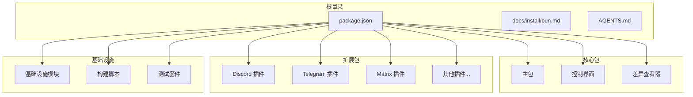
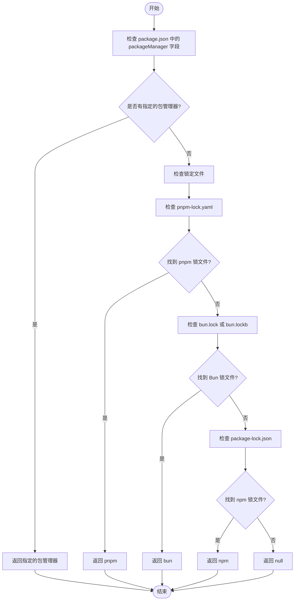
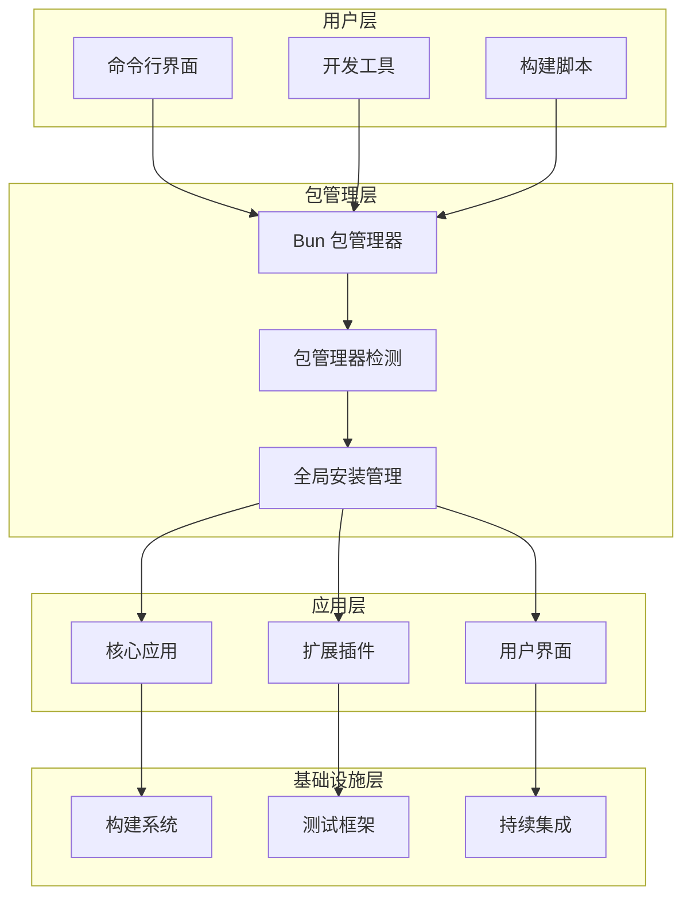
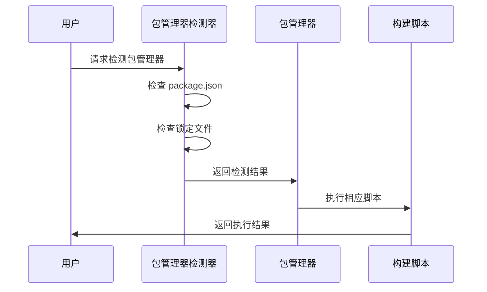
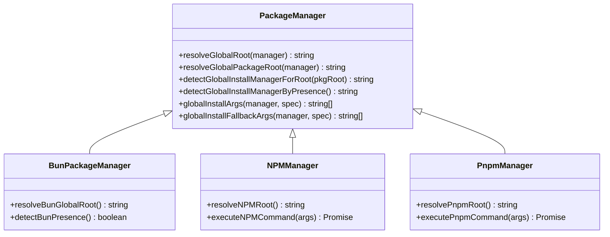

# Bun 安装

<cite>
**本文档引用的文件**
- [docs/install/bun.md](file://docs/install/bun.md)
- [package.json](file://package.json)
- [AGENTS.md](file://AGENTS.md)
- [.npmrc](file://.npmrc)
- [src/infra/detect-package-manager.ts](file://src/infra/detect-package-manager.ts)
- [src/infra/update-global.ts](file://src/infra/update-global.ts)
- [scripts/pre-commit/run-node-tool.sh](file://scripts/pre-commit/run-node-tool.sh)
- [extensions/diffs/package.json](file://extensions/diffs/package.json)
- [ui/package.json](file://ui/package.json)
</cite>

## 目录
1. [简介](#简介)
2. [项目结构](#项目结构)
3. [核心组件](#核心组件)
4. [架构概览](#架构概览)
5. [详细组件分析](#详细组件分析)
6. [依赖关系分析](#依赖关系分析)
7. [性能考虑](#性能考虑)
8. [故障排除指南](#故障排除指南)
9. [结论](#结论)
10. [附录](#附录)

## 简介
本文档为 OpenClaw 项目提供 Bun 包管理器的完整安装和使用指南。Bun 是一个现代的 JavaScript 包管理器，具有以下特点和优势：

- **更快的安装速度**：相比传统包管理器，Bun 提供了显著提升的安装性能
- **内置工具集**：包含构建、测试、打包等开发工具
- **TypeScript 原生支持**：直接运行 TypeScript 文件，无需预编译
- **兼容性**：与现有 npm 生态系统保持高度兼容

在 OpenClaw 项目中，Bun 作为可选的本地运行时，允许开发者使用更快速的开发循环，同时保持与 pnpm 工作流程的兼容性。

## 项目结构
OpenClaw 项目采用多包管理架构，包含多个子包和插件：



**图表来源**
- [package.json:1-481](file://package.json#L1-L481)
- [docs/install/bun.md:1-60](file://docs/install/bun.md#L1-L60)

**章节来源**
- [package.json:1-481](file://package.json#L1-L481)
- [docs/install/bun.md:1-60](file://docs/install/bun.md#L1-L60)

## 核心组件
OpenClaw 项目中与 Bun 相关的核心组件包括：

### 包管理器检测机制
项目实现了智能的包管理器检测功能，能够自动识别当前使用的包管理器类型：



**图表来源**
- [src/infra/detect-package-manager.ts:6-29](file://src/infra/detect-package-manager.ts#L6-L29)

### 全局安装管理器
项目支持多种全局安装管理器，包括 Bun、npm 和 pnpm：

| 管理器 | 全局根路径 | 检测逻辑 |
|--------|------------|----------|
| Bun | `$BUN_INSTALL/install/global/node_modules` | 检查环境变量 `BUN_INSTALL` |
| npm | `npm root -g` | 执行 `npm root -g` 命令 |
| pnpm | `pnpm root -g` | 执行 `pnpm root -g` 命令 |

**章节来源**
- [src/infra/update-global.ts:135-249](file://src/infra/update-global.ts#L135-L249)

## 架构概览
OpenClaw 项目采用分层架构设计，Bun 集成在多个层面：



**图表来源**
- [package.json:214-346](file://package.json#L214-L346)
- [src/infra/detect-package-manager.ts:1-30](file://src/infra/detect-package-manager.ts#L1-L30)

## 详细组件分析

### Bun 安装配置
Bun 在 OpenClaw 项目中的安装配置具有以下特点：

#### 默认安装
```bash
bun install
```

#### 无锁文件安装
```bash
bun install --no-save
```

#### 生命周期脚本处理
Bun 可能会阻止依赖生命周期脚本，除非明确信任：
```bash
bun pm trust @whiskeysockets/baileys protobufjs
```

**章节来源**
- [docs/install/bun.md:22-59](file://docs/install/bun.md#L22-L59)

### 包管理器兼容性
项目实现了对多种包管理器的兼容性支持：



**图表来源**
- [src/infra/detect-package-manager.ts:6-29](file://src/infra/detect-package-manager.ts#L6-L29)

**章节来源**
- [src/infra/detect-package-manager.ts:1-30](file://src/infra/detect-package-manager.ts#L1-L30)

### 全局安装管理
项目提供了统一的全局安装管理接口：



**图表来源**
- [src/infra/update-global.ts:140-259](file://src/infra/update-global.ts#L140-L259)

**章节来源**
- [src/infra/update-global.ts:135-249](file://src/infra/update-global.ts#L135-L249)

### 开发工作流集成
Bun 与 OpenClaw 开发工作流的集成包括：

#### TypeScript 执行
```bash
bun run build
bun run vitest run
```

#### 预提交钩子
```bash
#!/usr/bin/env bash
# 自动选择合适的包管理器执行工具
if [[ -f "$ROOT_DIR/bun.lockb" ]] && command -v bun >/dev/null 2>&1; then
  exec bunx --bun "$tool" "$@"
fi
```

**章节来源**
- [docs/install/bun.md:36-41](file://docs/install/bun.md#L36-L41)
- [scripts/pre-commit/run-node-tool.sh:18-20](file://scripts/pre-commit/run-node-tool.sh#L18-L20)

## 依赖关系分析
OpenClaw 项目中 Bun 相关的依赖关系如下：

```mermaid
graph LR
subgraph "Bun 相关依赖"
BunCore[Bun 核心]
Bunx[Bunx 工具]
BunBuild[Bun 构建工具]
end
subgraph "项目依赖"
OpenClaw[OpenClaw 主包]
DiffsPlugin[@openclaw/diffs]
UI[控制界面]
end
subgraph "外部依赖"
DiscordAPI[Discord API]
TelegramAPI[Telegram API]
MatrixAPI[Matrix API]
OtherChannels[其他渠道 API]
end
BunCore --> OpenClaw
Bunx --> DiffsPlugin
BunBuild --> UI
OpenClaw --> DiscordAPI
OpenClaw --> TelegramAPI
OpenClaw --> MatrixAPI
OpenClaw --> OtherChannels
DiffsPlugin --> Bunx
UI --> BunBuild
```

**图表来源**
- [package.json:347-404](file://package.json#L347-L404)
- [extensions/diffs/package.json:7-8](file://extensions/diffs/package.json#L7-L8)

**章节来源**
- [package.json:347-481](file://package.json#L347-L481)
- [extensions/diffs/package.json:1-21](file://extensions/diffs/package.json#L1-L21)

## 性能考虑
使用 Bun 作为包管理器在 OpenClaw 项目中有以下性能优势：

### 启动时间优化
- **TypeScript 直接执行**：无需预编译即可运行 TypeScript 文件
- **缓存机制**：利用 Bun 的内置缓存减少重复安装时间
- **并行安装**：支持并行依赖解析和安装

### 内存使用优化
- **零配置构建**：简化构建过程，减少内存占用
- **智能依赖管理**：避免重复安装相同版本的依赖包

### 开发体验提升
- **热重载支持**：配合 watch 模式提供快速反馈循环
- **实时错误报告**：提供详细的错误信息和修复建议

## 故障排除指南

### 常见问题及解决方案

#### 生命周期脚本被阻止
**问题**：某些依赖的生命周期脚本被 Bun 阻止执行
**解决方案**：明确信任相关包
```bash
bun pm trust @whiskeysockets/baileys protobufjs
```

#### 锁文件冲突
**问题**：Bun 无法使用 pnpm 锁文件
**解决方案**：使用 Bun 的原生锁文件格式
```bash
# 删除 pnpm 锁文件
rm pnpm-lock.yaml
# 使用 Bun 安装
bun install
```

#### 兼容性问题
**问题**：某些脚本仍硬编码 pnpm
**解决方案**：继续使用 pnpm 运行这些脚本
```bash
# 对于 docs:build、ui:*、protocol:check 等脚本
pnpm docs:build
pnpm ui:build
pnpm protocol:check
```

**章节来源**
- [docs/install/bun.md:43-59](file://docs/install/bun.md#L43-L59)

### 调试技巧
1. **检查包管理器检测**：确认系统正确识别了 Bun
2. **验证全局安装**：检查 Bun 全局包的安装位置
3. **监控性能指标**：对比使用 Bun 前后的安装时间

## 结论
Bun 作为 OpenClaw 项目的包管理器提供了显著的性能优势和开发体验改进。通过智能的包管理器检测、灵活的全局安装管理和完善的兼容性支持，Bun 成为了现代 JavaScript 开发的理想选择。

在实际使用中，建议：
- 优先使用 Bun 进行本地开发和测试
- 仅在必要时使用 pnpm 处理特定脚本
- 定期更新 Bun 版本以获得最新功能和性能改进
- 关注项目文档以获取最新的兼容性信息

## 附录

### 快速参考表

| 操作 | 命令 | 说明 |
|------|------|------|
| 安装依赖 | `bun install` | 默认安装方式 |
| 无锁文件安装 | `bun install --no-save` | 不生成锁文件 |
| 运行构建 | `bun run build` | TypeScript 构建 |
| 运行测试 | `bun run vitest run` | 单元测试执行 |
| 信任包 | `bun pm trust <package>` | 解除生命周期脚本限制 |
| 检测包管理器 | `bun pm type` | 查看当前包管理器类型 |

### 最佳实践建议
1. **开发环境**：使用 Bun 作为主要包管理器
2. **生产环境**：保持与 pnpm 的兼容性
3. **团队协作**：统一使用 Bun 版本
4. **CI/CD**：在持续集成中使用 Bun 加速构建