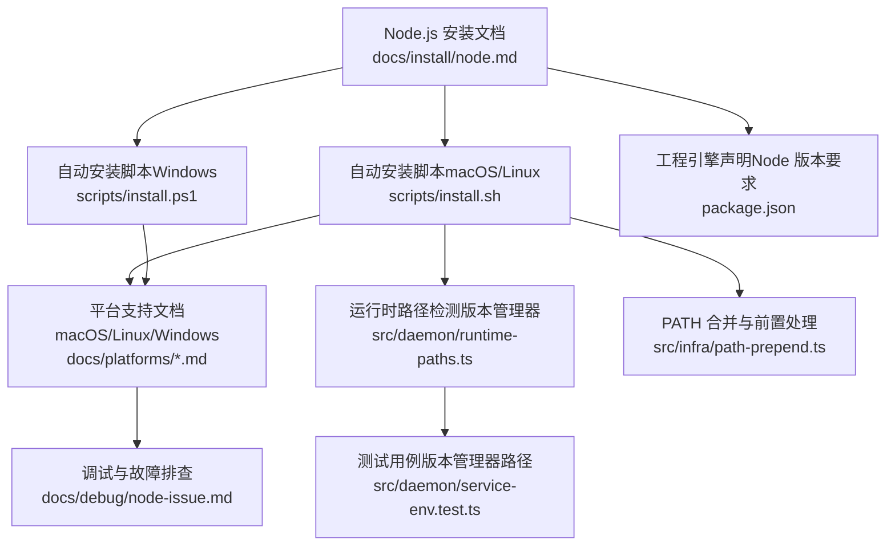
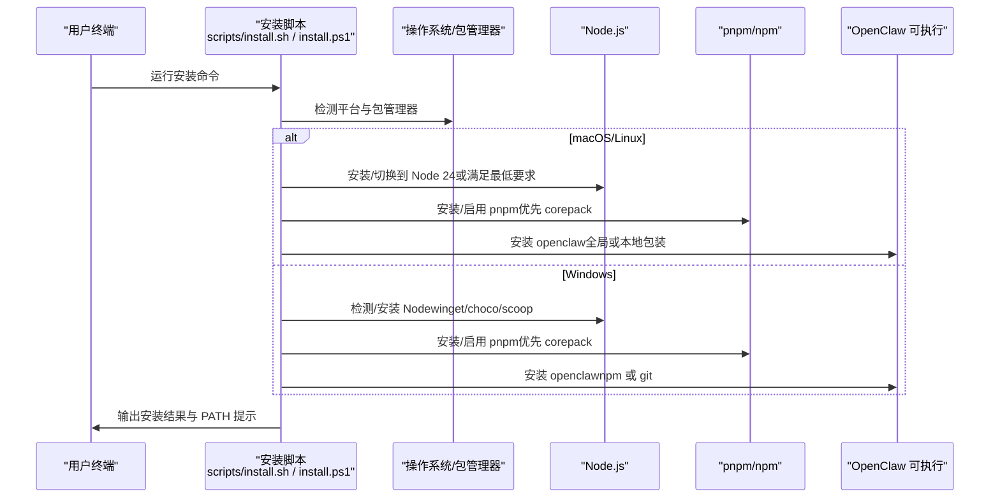
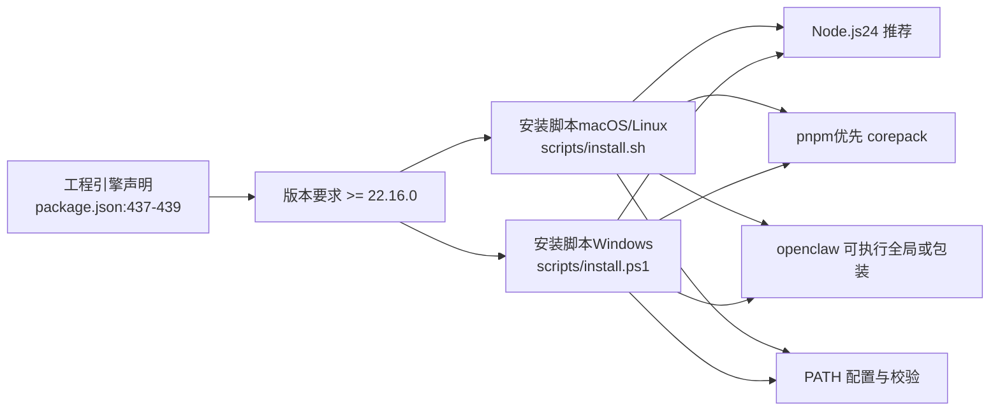

# Node.js 安装

<cite>
**本文引用的文件**
- [docs/install/node.md](file://docs/install/node.md)
- [scripts/install.sh](file://scripts/install.sh)
- [scripts/install.ps1](file://scripts/install.ps1)
- [docs/platforms/macos.md](file://docs/platforms/macos.md)
- [docs/platforms/linux.md](file://docs/platforms/linux.md)
- [docs/platforms/windows.md](file://docs/platforms/windows.md)
- [docs/debug/node-issue.md](file://docs/debug/node-issue.md)
- [src/daemon/runtime-paths.ts](file://src/daemon/runtime-paths.ts)
- [src/daemon/service-env.test.ts](file://src/daemon/service-env.test.ts)
- [src/infra/path-prepend.ts](file://src/infra/path-prepend.ts)
- [package.json](file://package.json)
</cite>

## 目录
1. [简介](#简介)
2. [项目结构](#项目结构)
3. [核心组件](#核心组件)
4. [架构总览](#架构总览)
5. [详细组件分析](#详细组件分析)
6. [依赖关系分析](#依赖关系分析)
7. [性能考虑](#性能考虑)
8. [故障排查指南](#故障排查指南)
9. [结论](#结论)
10. [附录](#附录)

## 简介
本指南面向在 macOS、Linux 与 Windows 平台上安装与配置 Node.js 的用户，重点覆盖：
- 版本要求：Node 22.16+；默认与推荐运行时为 Node 24
- 多平台安装方式：Homebrew、包管理器、直接下载、Windows 包管理器与脚本
- 版本管理器：nvm、fnm、mise、asdf 的使用与初始化
- 版本检查与 PATH 配置最佳实践
- 常见问题定位：命令未找到、权限错误、PATH 缺失等

## 项目结构
围绕 Node.js 安装与运行，仓库提供了多语言文档与自动化安装脚本，帮助用户在不同平台上完成安装、版本选择与环境配置。

图示来源
- [docs/install/node.md:1-139](file://docs/install/node.md#L1-L139)
- [scripts/install.sh:1-2579](file://scripts/install.sh#L1-L2579)
- [scripts/install.ps1:1-360](file://scripts/install.ps1#L1-L360)
- [docs/platforms/macos.md:1-227](file://docs/platforms/macos.md#L1-L227)
- [docs/platforms/linux.md:1-95](file://docs/platforms/linux.md#L1-L95)
- [docs/platforms/windows.md:1-242](file://docs/platforms/windows.md#L1-L242)
- [docs/debug/node-issue.md:1-86](file://docs/debug/node-issue.md#L1-L86)
- [src/daemon/runtime-paths.ts:1-36](file://src/daemon/runtime-paths.ts#L1-L36)
- [src/daemon/service-env.test.ts:111-175](file://src/daemon/service-env.test.ts#L111-L175)
- [src/infra/path-prepend.ts:1-79](file://src/infra/path-prepend.ts#L1-L79)
- [package.json:437-439](file://package.json#L437-L439)

章节来源
- [docs/install/node.md:1-139](file://docs/install/node.md#L1-L139)
- [scripts/install.sh:1-2579](file://scripts/install.sh#L1-L2579)
- [scripts/install.ps1:1-360](file://scripts/install.ps1#L1-L360)
- [docs/platforms/macos.md:1-227](file://docs/platforms/macos.md#L1-L227)
- [docs/platforms/linux.md:1-95](file://docs/platforms/linux.md#L1-L95)
- [docs/platforms/windows.md:1-242](file://docs/platforms/windows.md#L1-L242)
- [docs/debug/node-issue.md:1-86](file://docs/debug/node-issue.md#L1-L86)
- [src/daemon/runtime-paths.ts:1-36](file://src/daemon/runtime-paths.ts#L1-L36)
- [src/daemon/service-env.test.ts:111-175](file://src/daemon/service-env.test.ts#L111-L175)
- [src/infra/path-prepend.ts:1-79](file://src/infra/path-prepend.ts#L1-L79)
- [package.json:437-439](file://package.json#L437-L439)

## 核心组件
- 版本要求与推荐
  - Node 最低要求：22.16+
  - 默认与推荐运行时：24
  - 工程引擎声明：engines 字段要求 >= 22.16.0
- 自动化安装脚本
  - macOS/Linux：自动检测 Node、必要工具、安装 Node 与 pnpm，并确保 openclaw 可执行
  - Windows：自动检测/安装 Node、Git、设置 PATH，并支持 npm/git 安装模式
- 平台支持与建议
  - macOS：推荐 Homebrew；可选直接下载
  - Linux：Ubuntu/Debian 使用 NodeSource；Fedora/RHEL 使用系统包；也可使用版本管理器
  - Windows：推荐 winget 或 Chocolatey；也可直接下载
- 版本管理器集成
  - 支持 nvm、fnm、mise、asdf 等；脚本会识别并提示初始化
- 故障排查
  - openclaw 命令未找到：检查 npm 全局前缀与 PATH
  - 权限错误：Linux 下将 npm prefix 切换到用户目录

章节来源
- [docs/install/node.md:12-139](file://docs/install/node.md#L12-L139)
- [scripts/install.sh:19-22](file://scripts/install.sh#L19-L22)
- [scripts/install.ps1:82-162](file://scripts/install.ps1#L82-L162)
- [docs/platforms/linux.md:18-19](file://docs/platforms/linux.md#L18-L19)
- [docs/platforms/windows.md:29-61](file://docs/platforms/windows.md#L29-L61)
- [src/daemon/runtime-paths.ts:8-17](file://src/daemon/runtime-paths.ts#L8-L17)
- [src/daemon/service-env.test.ts:111-143](file://src/daemon/service-env.test.ts#L111-L143)
- [docs/install/node.md:89-139](file://docs/install/node.md#L89-L139)

## 架构总览
Node.js 安装流程在不同平台上的关键步骤如下：

图示来源
- [scripts/install.sh:1262-1496](file://scripts/install.sh#L1262-L1496)
- [scripts/install.ps1:102-162](file://scripts/install.ps1#L102-L162)
- [scripts/install.sh:1677-1710](file://scripts/install.sh#L1677-L1710)
- [scripts/install.ps1:202-260](file://scripts/install.ps1#L202-L260)

章节来源
- [scripts/install.sh:1262-1496](file://scripts/install.sh#L1262-L1496)
- [scripts/install.ps1:102-162](file://scripts/install.ps1#L102-L162)
- [scripts/install.sh:1677-1710](file://scripts/install.sh#L1677-L1710)
- [scripts/install.ps1:202-260](file://scripts/install.ps1#L202-L260)

## 详细组件分析

### macOS 安装与 Homebrew 推荐
- 推荐通过 Homebrew 安装 Node，确保与系统路径兼容
- 若使用版本管理器（如 nvm/fnm），需在 shell 启动文件中初始化，否则新终端可能无法找到 openclaw
- macOS 应用会以节点形式暴露能力，安装时可选择通过 npm/pnpm 安装全局 CLI

章节来源
- [docs/install/node.md:24-32](file://docs/install/node.md#L24-L32)
- [docs/platforms/macos.md:24](file://docs/platforms/macos.md#L24)
- [docs/install/node.md:70-87](file://docs/install/node.md#L70-L87)

### Linux 安装与包管理器
- Ubuntu/Debian：使用 NodeSource 仓库安装 Node 24
- Fedora/RHEL：使用 dnf/yum 安装
- Arch 系：使用 pacman 安装
- 如遇权限问题，脚本会引导将 npm prefix 切换到用户目录并更新 PATH

章节来源
- [docs/install/node.md:35-49](file://docs/install/node.md#L35-L49)
- [scripts/install.sh:1430-1496](file://scripts/install.sh#L1430-L1496)
- [docs/platforms/linux.md:18-19](file://docs/platforms/linux.md#L18-L19)
- [scripts/install.sh:1584-1613](file://scripts/install.sh#L1584-L1613)

### Windows 安装与包管理器
- 推荐 winget 或 Chocolatey 安装 Node LTS
- 也可使用 Scoop（脚本内探测）
- 安装后自动刷新 PATH 并尝试添加 npm 全局 bin 到用户 PATH
- Windows 原生 CLI 仍在完善中，WSL2 是推荐路径

章节来源
- [docs/install/node.md:52-67](file://docs/install/node.md#L52-L67)
- [scripts/install.ps1:102-162](file://scripts/install.ps1#L102-L162)
- [scripts/install.ps1:290-299](file://scripts/install.ps1#L290-L299)
- [docs/platforms/windows.md:19-28](file://docs/platforms/windows.md#L19-L28)

### 版本管理器（nvm、fnm、mise、asdf）
- 支持多种版本管理器，脚本会识别常见标记路径
- 测试用例覆盖了 macOS 上的默认路径（例如 fnm、nvm、pnpm、volta、asdf 等）
- 初始化建议：在 shell 启动文件中正确加载版本管理器，使 PATH 包含对应 bin 目录

章节来源
- [docs/install/node.md:70-87](file://docs/install/node.md#L70-L87)
- [src/daemon/runtime-paths.ts:8-17](file://src/daemon/runtime-paths.ts#L8-L17)
- [src/daemon/service-env.test.ts:111-143](file://src/daemon/service-env.test.ts#L111-L143)

### 版本检查与 PATH 配置最佳实践
- 版本检查：使用 node -v 确认当前版本是否满足 >= 22.16
- PATH 检查：使用 npm prefix -g 获取全局前缀，确认其已加入 PATH
- 新终端不可用：执行 hash -r（bash）或 rehash（zsh），或在 shell 启动文件中追加 PATH
- Windows：通过系统环境变量设置 PATH

章节来源
- [docs/install/node.md:14-18](file://docs/install/node.md#L14-L18)
- [docs/install/node.md:95-126](file://docs/install/node.md#L95-L126)
- [docs/install/node.md:130-139](file://docs/install/node.md#L130-L139)
- [src/infra/path-prepend.ts:1-79](file://src/infra/path-prepend.ts#L1-L79)

### Node 25 与 tsx 的兼容性注意
- 在 Node 25 环境下使用 tsx 可能出现 __name 相关错误
- 建议在 Node 22/24 下验证 tsx 行为，或采用替代方案（如 tsc watch + 编译输出）

章节来源
- [docs/debug/node-issue.md:23-73](file://docs/debug/node-issue.md#L23-L73)

## 依赖关系分析
Node.js 安装与运行依赖关系如下：

图示来源
- [package.json:437-439](file://package.json#L437-L439)
- [scripts/install.sh:1262-1496](file://scripts/install.sh#L1262-L1496)
- [scripts/install.ps1:102-162](file://scripts/install.ps1#L102-L162)
- [scripts/install.sh:1677-1710](file://scripts/install.sh#L1677-L1710)
- [scripts/install.ps1:202-260](file://scripts/install.ps1#L202-L260)

章节来源
- [package.json:437-439](file://package.json#L437-L439)
- [scripts/install.sh:1262-1496](file://scripts/install.sh#L1262-L1496)
- [scripts/install.ps1:102-162](file://scripts/install.ps1#L102-L162)
- [scripts/install.sh:1677-1710](file://scripts/install.sh#L1677-L1710)
- [scripts/install.ps1:202-260](file://scripts/install.ps1#L202-L260)

## 性能考虑
- 优先使用 Node 24 作为默认运行时，以获得更佳的生态与性能表现
- 在 Linux 上安装构建工具链（make、g++、cmake、python3）有助于减少后续编译等待
- Windows 用户建议通过 WSL2 使用 Linux 子系统，以获得更一致的工具链体验

## 故障排查指南
- openclaw: 命令未找到
  - 检查 npm 全局前缀与 PATH 是否包含 <npm-prefix>/bin（macOS/Linux）或 <npm-prefix>（Windows）
  - 在 shell 启动文件中追加 export PATH="$(npm prefix -g)/bin:$PATH"（macOS/Linux）
  - Windows：在系统环境变量中添加 npm prefix 输出路径
- 权限错误（Linux）
  - 将 npm prefix 切换到用户目录，并将 $HOME/.npm-global/bin 追加到 PATH
- 版本管理器导致的 PATH 问题
  - 确保版本管理器已在 shell 启动文件中初始化
  - 新终端执行 hash -r（bash）或 rehash（zsh）以刷新命令缓存
- Node 25 与 tsx 兼容性
  - 在 Node 22/24 下验证 tsx 行为，或改用 tsc watch + 编译输出

章节来源
- [docs/install/node.md:89-139](file://docs/install/node.md#L89-L139)
- [src/infra/path-prepend.ts:1-79](file://src/infra/path-prepend.ts#L1-L79)
- [docs/debug/node-issue.md:23-73](file://docs/debug/node-issue.md#L23-L73)

## 结论
- Node 22.16+ 为最低要求，推荐使用 Node 24 作为默认运行时
- macOS/Linux/Windows 均提供便捷安装方式：包管理器、脚本与直接下载
- 版本管理器可灵活切换版本，但需确保初始化与 PATH 正确
- 安装完成后，务必检查 PATH 与版本，避免“命令未找到”等问题

## 附录
- 版本检查命令
  - node -v
- PATH 检查与修复
  - macOS/Linux：npm prefix -g；将输出追加到 PATH；hash -r 或 rehash
  - Windows：在系统环境变量中添加 npm prefix 输出路径

章节来源
- [docs/install/node.md:14-18](file://docs/install/node.md#L14-L18)
- [docs/install/node.md:95-126](file://docs/install/node.md#L95-L126)
- [docs/install/node.md:130-139](file://docs/install/node.md#L130-L139)