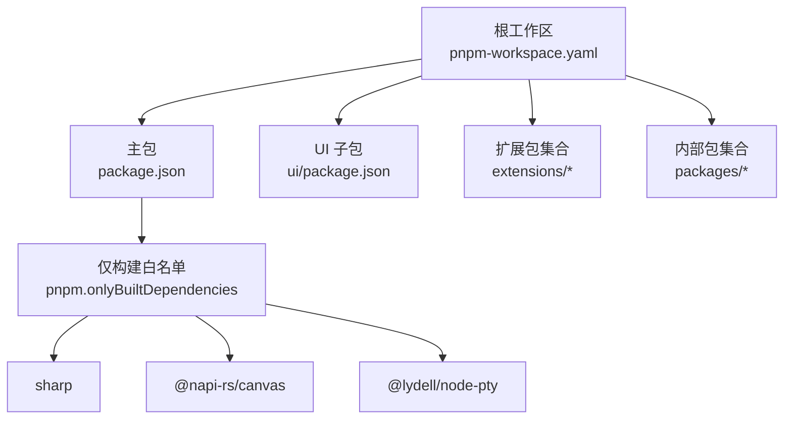
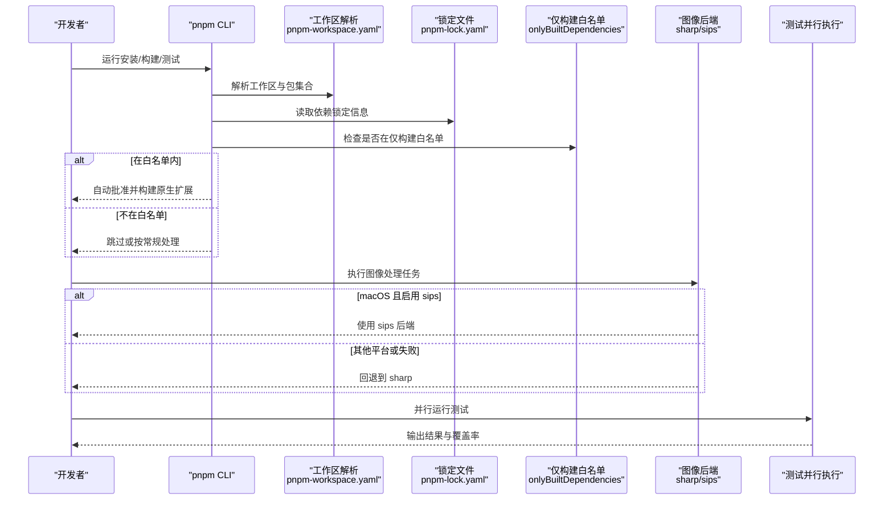
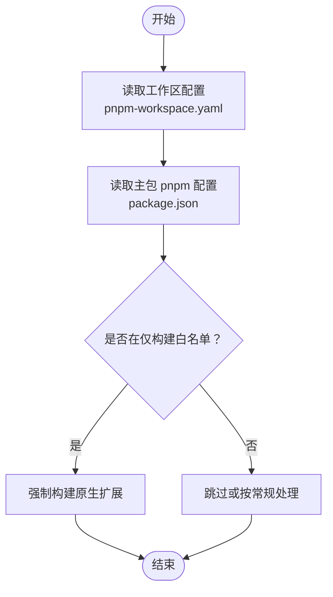
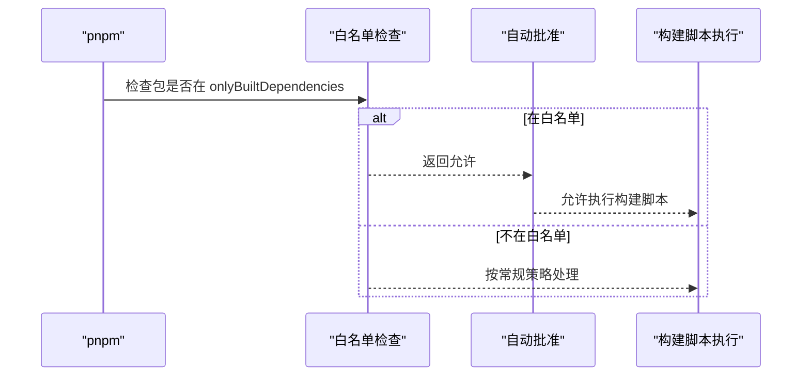
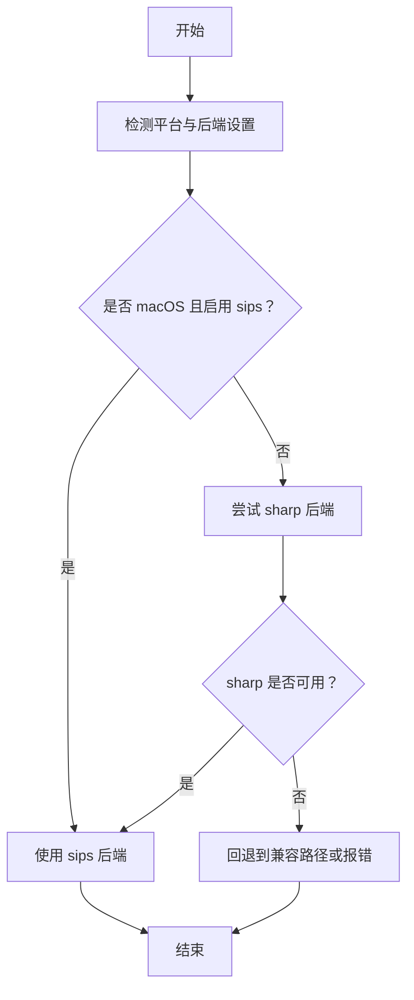
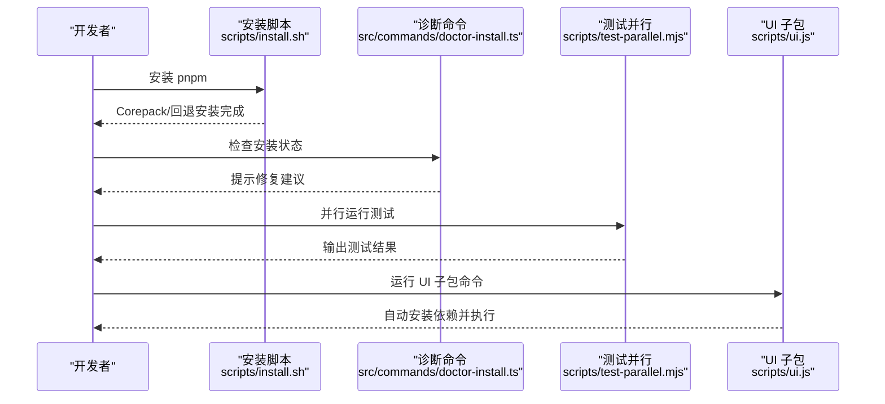
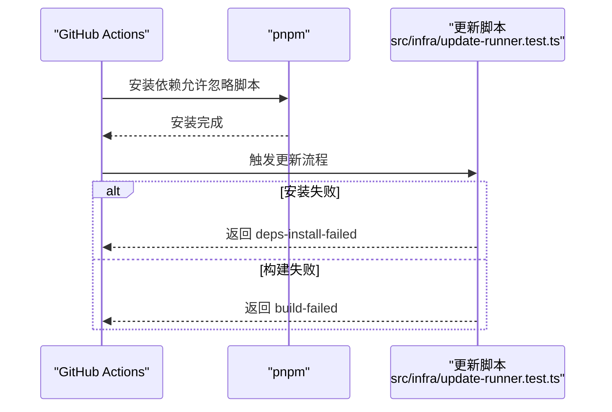
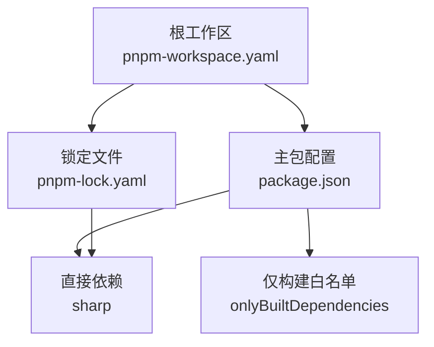

# pnpm 安装

<cite>
**本文引用的文件**
- [pnpm-workspace.yaml](file://pnpm-workspace.yaml)
- [package.json](file://package.json)
- [.npmrc](file://.npmrc)
- [pnpm-lock.yaml](file://pnpm-lock.yaml)
- [AGENTS.md](file://AGENTS.md)
- [scripts/install.sh](file://scripts/install.sh)
- [src/commands/doctor-install.ts](file://src/commands/doctor-install.ts)
- [src/node-host/invoke-system-run-plan.ts](file://src/node-host/invoke-system-run-plan.ts)
- [scripts/ui.js](file://scripts/ui.js)
- [.github/actions/setup-node-env/action.yml](file://.github/actions/setup-node-env/action.yml)
- [src/infra/update-runner.test.ts](file://src/infra/update-runner.test.ts)
</cite>

## 目录
1. [简介](#简介)
2. [项目结构](#项目结构)
3. [核心组件](#核心组件)
4. [架构总览](#架构总览)
5. [详细组件分析](#详细组件分析)
6. [依赖关系分析](#依赖关系分析)
7. [性能考量](#性能考量)
8. [故障排查指南](#故障排查指南)
9. [结论](#结论)
10. [附录](#附录)

## 简介
本指南面向在 OpenClaw 项目中使用 pnpm 的开发者，系统性说明 pnpm 的安装、配置与使用方法，并重点解释项目中的特殊配置：构建脚本批准流程（pnpm 会自动批准构建脚本）、sharp 库的构建错误解决方案，以及 pnpm 的工作原理与性能优势。同时提供与 npm 的差异对比，帮助读者在不同场景下做出正确选择。

## 项目结构
OpenClaw 使用 pnpm 工作区组织多包工程，根目录通过工作区配置声明包集合，并对特定原生扩展进行“仅构建”白名单控制，确保只有被允许的二进制包会被强制编译，从而提升安装与构建稳定性。

图表来源
- [pnpm-workspace.yaml:1-18](file://pnpm-workspace.yaml#L1-L18)
- [package.json:441-479](file://package.json#L441-L479)

章节来源
- [pnpm-workspace.yaml:1-18](file://pnpm-workspace.yaml#L1-L18)
- [package.json:441-479](file://package.json#L441-L479)

## 核心组件
- 工作区配置：定义包集合与“仅构建”白名单，保障原生扩展的可控构建。
- 构建脚本批准机制：通过白名单与配置项，自动批准允许的构建脚本，避免手动干预。
- sharp 构建支持：在 macOS 上优先使用内置图像后端，在其他平台回退到 sharp；当 sharp 构建失败时，系统会自动切换到兼容路径。
- 安装与运行工具链：包含安装脚本、诊断命令、测试并行执行等，统一 pnpm 使用体验。

章节来源
- [pnpm-workspace.yaml:7-17](file://pnpm-workspace.yaml#L7-L17)
- [package.json:459-471](file://package.json#L459-L471)
- [AGENTS.md:288-289](file://AGENTS.md#L288-L289)

## 架构总览
下图展示 pnpm 在 OpenClaw 中的关键交互：工作区解析、安装与构建、测试并行执行、以及 sharp 后端选择逻辑。

图表来源
- [pnpm-workspace.yaml:1-18](file://pnpm-workspace.yaml#L1-L18)
- [pnpm-lock.yaml:1-25](file://pnpm-lock.yaml#L1-L25)
- [package.json:459-471](file://package.json#L459-L471)
- [scripts/install.sh:1677-1710](file://scripts/install.sh#L1677-L1710)
- [src/commands/doctor-install.ts:10-40](file://src/commands/doctor-install.ts#L10-L40)
- [scripts/test-parallel.mjs:633-651](file://scripts/test-parallel.mjs#L633-L651)

## 详细组件分析

### 组件一：工作区与仅构建白名单
- 工作区定义：根工作区将主包、UI、packages 与 extensions 均纳入管理，便于统一安装与构建。
- 仅构建白名单：明确列出需要强制本地编译的原生扩展，如 sharp、@napi-rs/canvas、@lydell/node-pty 等，确保这些包在安装时触发构建脚本，减少跨平台兼容问题。
- 配置位置：工作区文件与主包的 pnpm 字段共同生效。

图表来源
- [pnpm-workspace.yaml:1-18](file://pnpm-workspace.yaml#L1-L18)
- [package.json:459-471](file://package.json#L459-L471)

章节来源
- [pnpm-workspace.yaml:1-18](file://pnpm-workspace.yaml#L1-L18)
- [package.json:459-471](file://package.json#L459-L471)

### 组件二：构建脚本批准流程（自动批准）
- 自动批准机制：当某个包位于“仅构建白名单”中，pnpm 将自动批准其构建脚本，无需人工确认，从而简化安装流程并降低 CI 失败率。
- 适用范围：主要针对 sharp、@napi-rs/canvas 等需要本地编译的原生包。
- 例外与安全：非白名单包仍遵循常规安装策略；若需扩大白名单，应评估安全与兼容性。

图表来源
- [package.json:459-471](file://package.json#L459-L471)
- [pnpm-workspace.yaml:7-17](file://pnpm-workspace.yaml#L7-L17)

章节来源
- [package.json:459-471](file://package.json#L459-L471)
- [pnpm-workspace.yaml:7-17](file://pnpm-workspace.yaml#L7-L17)

### 组件三：sharp 图像库构建错误解决方案
- 后端选择策略：在 macOS 上优先使用系统 sips 后端；在其他平台或失败时回退到 sharp。
- 错误回退：当 sharp 构建失败时，系统会自动切换到兼容路径，保证功能可用。
- 环境变量控制：可通过环境变量调整后端选择，便于调试与适配。

图表来源
- [AGENTS.md:288-289](file://AGENTS.md#L288-L289)
- [pnpm-lock.yaml:179-181](file://pnpm-lock.yaml#L179-L181)

章节来源
- [AGENTS.md:288-289](file://AGENTS.md#L288-L289)
- [pnpm-lock.yaml:179-181](file://pnpm-lock.yaml#L179-L181)

### 组件四：安装与运行工具链
- 安装脚本：提供多通道安装 pnpm 的能力，优先通过 Corepack 启用，失败则回退到 npm 安装，最后确保 pnpm 可用。
- 诊断命令：当检测到非 pnpm 安装痕迹（如存在 package-lock.json 或缺少 .pnpm 目录）时，给出明确提示与修复建议。
- 测试并行：通过并行执行测试，显著缩短 CI 时间；在 Windows 等平台上自动调整执行策略。
- UI 子包运行：UI 子包在缺失依赖时自动触发安装，确保开发体验一致。

图表来源
- [scripts/install.sh:1677-1710](file://scripts/install.sh#L1677-L1710)
- [src/commands/doctor-install.ts:10-40](file://src/commands/doctor-install.ts#L10-L40)
- [scripts/test-parallel.mjs:633-651](file://scripts/test-parallel.mjs#L633-L651)
- [scripts/ui.js:162-203](file://scripts/ui.js#L162-L203)

章节来源
- [scripts/install.sh:1677-1710](file://scripts/install.sh#L1677-L1710)
- [src/commands/doctor-install.ts:10-40](file://src/commands/doctor-install.ts#L10-L40)
- [scripts/test-parallel.mjs:633-651](file://scripts/test-parallel.mjs#L633-L651)
- [scripts/ui.js:162-203](file://scripts/ui.js#L162-L203)

### 组件五：CI 与脚本集成
- CI 行动：GitHub Actions 在安装阶段使用 pnpm，并允许忽略脚本以加速安装。
- 更新流程：更新脚本在安装失败或构建失败时返回明确错误码，便于上层流程中断与告警。

图表来源
- [.github/actions/setup-node-env/action.yml:104-113](file://.github/actions/setup-node-env/action.yml#L104-L113)
- [src/infra/update-runner.test.ts:288-303](file://src/infra/update-runner.test.ts#L288-L303)

章节来源
- [.github/actions/setup-node-env/action.yml:104-113](file://.github/actions/setup-node-env/action.yml#L104-L113)
- [src/infra/update-runner.test.ts:288-303](file://src/infra/update-runner.test.ts#L288-L303)

## 依赖关系分析
- 工作区与锁定文件：工作区定义包集合，锁定文件记录具体版本与解析结果，二者共同决定安装行为。
- 仅构建白名单：与主包 pnpm 配置联动，确保原生扩展在安装时被正确处理。
- 依赖树：项目直接依赖 sharp，其版本由锁定文件固定，避免版本漂移导致的构建不稳定。

图表来源
- [pnpm-workspace.yaml:1-18](file://pnpm-workspace.yaml#L1-L18)
- [pnpm-lock.yaml:179-181](file://pnpm-lock.yaml#L179-L181)
- [package.json:459-471](file://package.json#L459-L471)

章节来源
- [pnpm-workspace.yaml:1-18](file://pnpm-workspace.yaml#L1-L18)
- [pnpm-lock.yaml:179-181](file://pnpm-lock.yaml#L179-L181)
- [package.json:459-471](file://package.json#L459-L471)

## 性能考量
- 仅构建白名单：通过限制需要本地编译的包，减少不必要的原生构建，提升安装速度与稳定性。
- 测试并行：并行执行测试可显著缩短 CI 时间，尤其在多套件场景下收益明显。
- 缓存与复用：pnpm 的内容寻址存储与硬链接机制可减少磁盘占用与网络传输，配合工作区统一管理进一步优化缓存命中。

## 故障排查指南
- 安装失败或非 pnpm 痕迹
  - 现象：检测到 package-lock.json 或缺少 .pnpm 目录。
  - 处理：删除锁文件与 node_modules，改用 pnpm install；确保 tsx 二进制可用。
- 构建失败
  - 现象：仅构建白名单内的原生包构建失败。
  - 处理：检查平台工具链（如 Xcode、Python 等），必要时清理缓存后重试；确认环境变量与后端选择符合预期。
- 测试失败
  - 现象：并行测试中出现资源竞争或内存压力。
  - 处理：根据提示调整测试配置（如低内存模式），或减少并发度。
- CI 安装异常
  - 现象：Actions 安装阶段失败。
  - 处理：确认允许忽略脚本的参数已启用，必要时增加重试与日志输出。

章节来源
- [src/commands/doctor-install.ts:10-40](file://src/commands/doctor-install.ts#L10-L40)
- [scripts/install.sh:1677-1710](file://scripts/install.sh#L1677-L1710)
- [scripts/test-parallel.mjs:633-651](file://scripts/test-parallel.mjs#L633-L651)
- [.github/actions/setup-node-env/action.yml:104-113](file://.github/actions/setup-node-env/action.yml#L104-L113)

## 结论
OpenClaw 通过 pnpm 工作区与“仅构建白名单”机制，实现了对原生扩展的可控安装与构建；结合自动批准流程与 sharp 的后端回退策略，显著提升了安装稳定性与开发效率。配合安装脚本、诊断命令与测试并行执行，整体工具链具备良好的可维护性与可观测性。对于与 npm 的差异，pnpm 更强调确定性与性能，适合大型多包工程与 CI 场景。

## 附录

### pnpm 与 npm 的区别（与本项目相关）
- 确定性安装：pnpm 使用锁定文件与内容寻址存储，避免版本漂移带来的不一致。
- 工作区管理：更自然地管理多包工程，统一安装与构建，减少重复依赖。
- 仅构建白名单：pnpm 支持对特定包强制构建，有助于原生扩展的可控安装。
- CI 友好：允许忽略脚本安装，加速 CI 流程；并行测试与缓存复用进一步提升效率。

### 安装与使用清单
- 安装 pnpm：优先通过 Corepack 启用，失败则回退到 npm 安装。
- 初始化项目：在工作区根目录执行安装，确保所有子包依赖一致。
- 开发与构建：使用项目提供的脚本与命令，避免绕过工具链。
- 诊断与修复：遇到问题时参考诊断命令提示，按步骤修复安装状态。

章节来源
- [scripts/install.sh:1677-1710](file://scripts/install.sh#L1677-L1710)
- [AGENTS.md:94-112](file://AGENTS.md#L94-L112)
- [src/commands/doctor-install.ts:10-40](file://src/commands/doctor-install.ts#L10-L40)