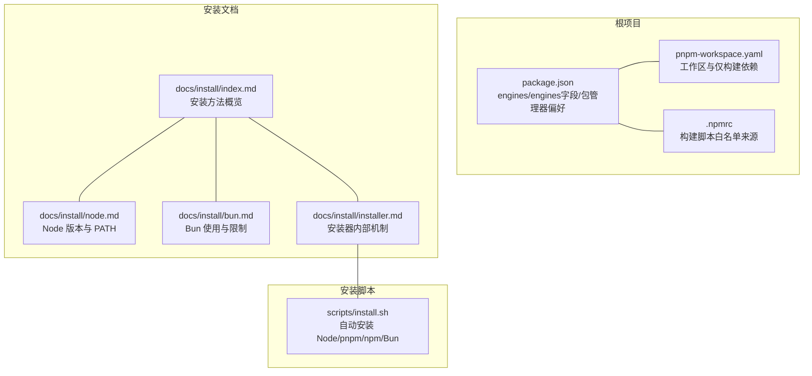
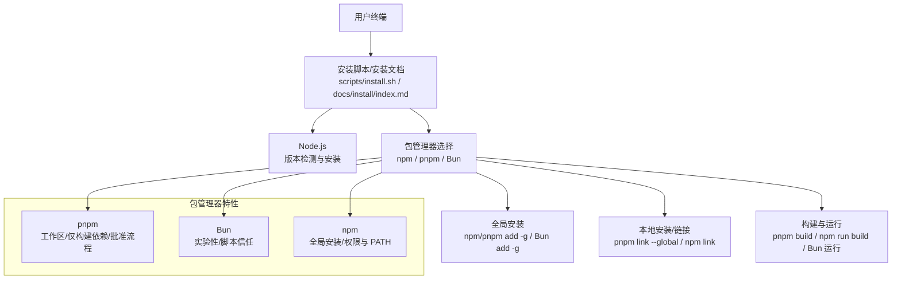
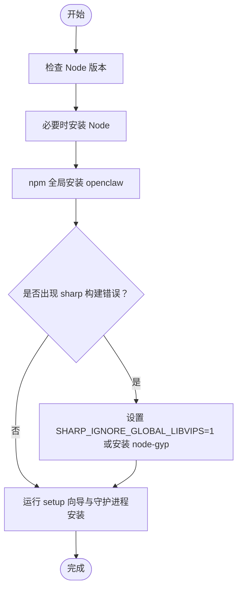
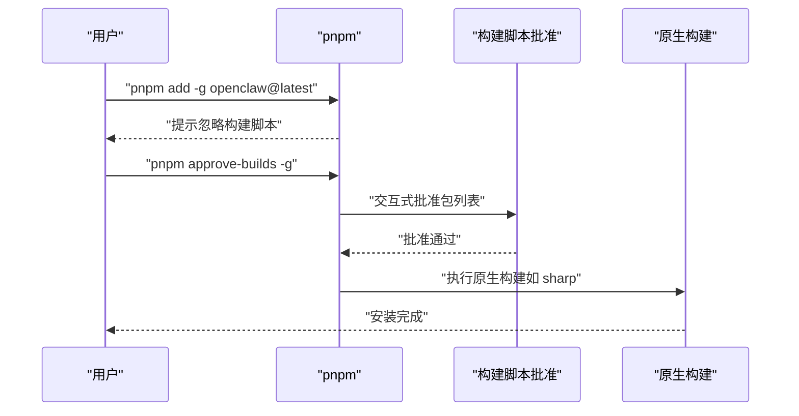
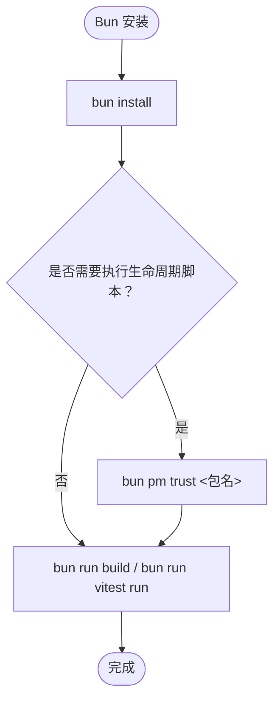
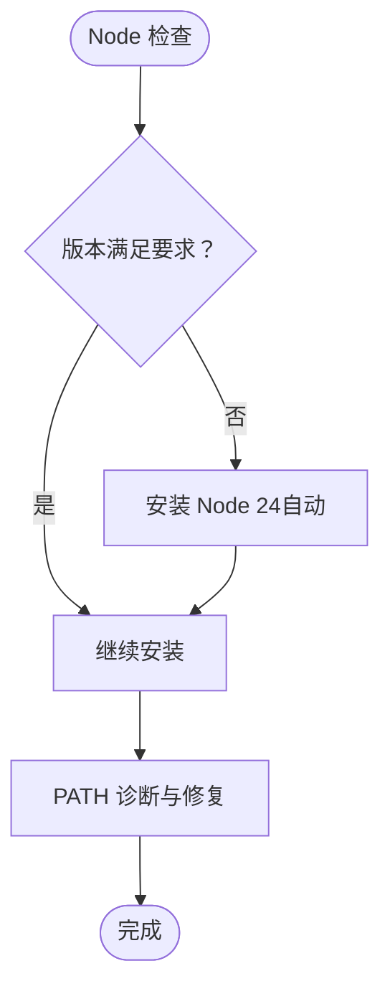
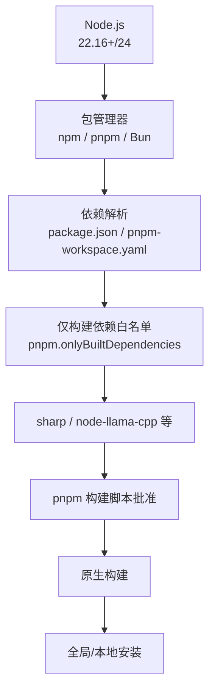

# 包管理器安装

<cite>
**本文引用的文件**
- [package.json](file://package.json)
- [pnpm-workspace.yaml](file://pnpm-workspace.yaml)
- [.npmrc](file://.npmrc)
- [docs/install/index.md](file://docs/install/index.md)
- [docs/install/bun.md](file://docs/install/bun.md)
- [docs/install/node.md](file://docs/install/node.md)
- [docs/install/installer.md](file://docs/install/installer.md)
- [scripts/install.sh](file://scripts/install.sh)
- [src/infra/update-global.ts](file://src/infra/update-global.ts)
- [src/infra/update-runner.ts](file://src/infra/update-runner.ts)
- [src/infra/detect-package-manager.ts](file://src/infra/detect-package-manager.ts)
- [scripts/pre-commit/run-node-tool.sh](file://scripts/pre-commit/run-node-tool.sh)
</cite>

## 目录
1. [简介](#简介)
2. [项目结构](#项目结构)
3. [核心组件](#核心组件)
4. [架构总览](#架构总览)
5. [详细组件分析](#详细组件分析)
6. [依赖关系分析](#依赖关系分析)
7. [性能考量](#性能考量)
8. [故障排查指南](#故障排查指南)
9. [结论](#结论)
10. [附录](#附录)

## 简介
本篇文档聚焦于 OpenClaw 的包管理器安装方式，覆盖 npm、pnpm 与 Bun 的安装路径与差异，包括：
- 全局安装与本地安装
- 开发版本安装（从源码或 GitHub main）
- pnpm 的构建脚本批准流程
- sharp 库的构建错误解决方案
- Node.js 版本管理与 PATH 配置
- 依赖解析与缓存清理的最佳实践
- 不同包管理器的优缺点对比与选择建议

## 项目结构
OpenClaw 使用 pnpm 作为主要工作区与构建工具，同时支持 npm 与 Bun 的安装与运行。关键配置与文档如下：
- 根级 package.json 指定 engines 与 packageManager 字段，声明 Node 最低版本要求与默认包管理器偏好
- pnpm-workspace.yaml 定义工作区范围与仅构建依赖白名单
- .npmrc 中注释说明 pnpm 构建脚本允许列表由 package.json 的 pnpm.onlyBuiltDependencies 决定
- 文档目录 docs/install 下包含安装、Node、Bun、安装器内部机制等说明
- 脚本 scripts/install.sh 提供自动化的安装流程与环境准备

图表来源
- [package.json:437-440](file://package.json#L437-L440)
- [pnpm-workspace.yaml:1-18](file://pnpm-workspace.yaml#L1-L18)
- [.npmrc:1-1](file://.npmrc#L1-L1)
- [docs/install/index.md:14-229](file://docs/install/index.md#L14-L229)
- [docs/install/node.md:10-139](file://docs/install/node.md#L10-L139)
- [docs/install/bun.md:1-60](file://docs/install/bun.md#L1-L60)
- [docs/install/installer.md:10-200](file://docs/install/installer.md#L10-L200)
- [scripts/install.sh:1-200](file://scripts/install.sh#L1-L200)

章节来源
- [package.json:437-440](file://package.json#L437-L440)
- [pnpm-workspace.yaml:1-18](file://pnpm-workspace.yaml#L1-L18)
- [.npmrc:1-1](file://.npmrc#L1-L1)
- [docs/install/index.md:14-229](file://docs/install/index.md#L14-L229)
- [docs/install/node.md:10-139](file://docs/install/node.md#L10-L139)
- [docs/install/bun.md:1-60](file://docs/install/bun.md#L1-L60)
- [docs/install/installer.md:10-200](file://docs/install/installer.md#L10-L200)
- [scripts/install.sh:1-200](file://scripts/install.sh#L1-L200)

## 核心组件
- 包管理器与版本要求
  - Node 最低版本要求与默认推荐版本
  - 包管理器偏好与工作区定义
- 安装方式
  - npm/pnpm 全局安装与开发版本安装
  - pnpm 构建脚本批准流程
  - Bun 的实验性使用与限制
- 依赖与构建
  - 仅构建依赖白名单
  - sharp/libvips 构建问题与规避策略
- 环境与 PATH
  - Node 与包管理器 PATH 配置
  - 安装后命令不可用的诊断与修复

章节来源
- [package.json:437-440](file://package.json#L437-L440)
- [pnpm-workspace.yaml:1-18](file://pnpm-workspace.yaml#L1-L18)
- [docs/install/index.md:72-115](file://docs/install/index.md#L72-L115)
- [docs/install/bun.md:16-60](file://docs/install/bun.md#L16-L60)
- [docs/install/node.md:10-139](file://docs/install/node.md#L10-L139)
- [scripts/install.sh:679-692](file://scripts/install.sh#L679-L692)

## 架构总览
下图展示 OpenClaw 在不同包管理器下的安装与运行路径，以及与 Node 版本管理的关系。

图表来源
- [scripts/install.sh:679-692](file://scripts/install.sh#L679-L692)
- [docs/install/index.md:72-115](file://docs/install/index.md#L72-L115)
- [docs/install/bun.md:16-60](file://docs/install/bun.md#L16-L60)
- [docs/install/node.md:10-139](file://docs/install/node.md#L10-L139)

## 详细组件分析

### npm 安装方式
- 全局安装
  - 使用 npm 全局安装最新版本，随后运行初始化向导与守护进程安装
  - 若存在系统级 libvips（如 macOS Homebrew 安装），可能触发 sharp 原生构建失败，可通过环境变量强制使用预编译二进制
- 本地安装
  - 通过 npm link 将本地构建的 openclaw 命令暴露到全局
- 开发版本安装
  - 支持从 npm 安装 GitHub main 分支 HEAD 版本
- 依赖与缓存
  - npm 的缓存与权限配置需结合 PATH 与全局前缀进行排查

图表来源
- [docs/install/index.md:76-90](file://docs/install/index.md#L76-L90)
- [docs/install/index.md:107-113](file://docs/install/index.md#L107-L113)
- [scripts/install.sh:679-692](file://scripts/install.sh#L679-L692)

章节来源
- [docs/install/index.md:72-115](file://docs/install/index.md#L72-L115)
- [docs/install/index.md:107-113](file://docs/install/index.md#L107-L113)
- [scripts/install.sh:679-692](file://scripts/install.sh#L679-L692)

### pnpm 安装方式
- 全局安装
  - 先全局安装 openclaw，再执行构建脚本批准流程
- 本地安装
  - 在仓库内使用 pnpm install，然后通过 pnpm link --global 链接命令
- 开发版本安装
  - 支持从 npm 安装 GitHub main 分支 HEAD 版本
- 构建脚本批准流程
  - 对包含原生构建脚本的包（如 sharp、node-llama-cpp 等），pnpm 需要显式批准
  - 批准后方可执行原生构建脚本
- 仅构建依赖
  - 通过 pnpm-workspace.yaml 与 package.json 的 pnpm.onlyBuiltDependencies 维护白名单，确保仅允许的包进行原生构建

图表来源
- [docs/install/index.md:92-103](file://docs/install/index.md#L92-L103)
- [pnpm-workspace.yaml:7-17](file://pnpm-workspace.yaml#L7-L17)
- [package.json:459-471](file://package.json#L459-L471)

章节来源
- [docs/install/index.md:92-103](file://docs/install/index.md#L92-L103)
- [pnpm-workspace.yaml:7-17](file://pnpm-workspace.yaml#L7-L17)
- [package.json:459-471](file://package.json#L459-L471)

### Bun 安装方式
- 实验性使用
  - Bun 适合本地快速运行 TypeScript（bun run …、bun --watch …），但不推荐用于网关运行时（WhatsApp/Telegram 存在已知问题）
- 与 pnpm 的差异
  - Bun 无法使用 pnpm-lock.yaml，且部分脚本仍硬编码 pnpm（如 docs:build、ui:*、protocol:check）
- 生命周期脚本
  - 默认可能阻止某些依赖的生命周期脚本，可通过 bun pm trust 显式信任

图表来源
- [docs/install/bun.md:22-55](file://docs/install/bun.md#L22-L55)

章节来源
- [docs/install/bun.md:16-60](file://docs/install/bun.md#L16-L60)
- [docs/install/bun.md:22-55](file://docs/install/bun.md#L22-L55)

### Node.js 版本管理与 PATH
- 版本要求
  - 推荐 Node 24，默认与 LTS（Node 22.16+）仍受支持
- 自动化安装
  - 安装脚本会在缺失时自动安装 Node 24（macOS 使用 Homebrew，Linux 使用 NodeSource）
- PATH 问题诊断
  - 若 openclaw 命令不可用，检查 npm prefix -g 输出是否在 PATH 中，并在 shell 启动文件中追加

图表来源
- [docs/install/node.md:10-139](file://docs/install/node.md#L10-L139)
- [scripts/install.sh:1-200](file://scripts/install.sh#L1-L200)

章节来源
- [docs/install/node.md:10-139](file://docs/install/node.md#L10-L139)
- [scripts/install.sh:1-200](file://scripts/install.sh#L1-L200)

### 依赖解析与缓存清理
- 依赖解析
  - 通过 package.json 的 engines 字段与 packageManager 字段确定 Node 与包管理器偏好
  - pnpm 通过 pnpm-workspace.yaml 与 .npmrc 注释中的白名单控制原生构建包
- 缓存清理
  - npm：可调整全局前缀与权限，避免权限问题导致的安装失败
  - pnpm：利用工作区缓存与仅构建依赖白名单减少重复构建
  - Bun：生命周期脚本可能被阻止，必要时通过信任机制解决

章节来源
- [package.json:437-440](file://package.json#L437-L440)
- [pnpm-workspace.yaml:1-18](file://pnpm-workspace.yaml#L1-L18)
- [.npmrc:1-1](file://.npmrc#L1-L1)
- [docs/install/bun.md:43-55](file://docs/install/bun.md#L43-L55)

## 依赖关系分析
OpenClaw 的安装与运行依赖于 Node 版本、包管理器与原生构建包的协同。下图展示关键依赖与流程：

图表来源
- [package.json:437-440](file://package.json#L437-L440)
- [pnpm-workspace.yaml:7-17](file://pnpm-workspace.yaml#L7-L17)
- [package.json:459-471](file://package.json#L459-L471)

章节来源
- [package.json:437-440](file://package.json#L437-L440)
- [pnpm-workspace.yaml:7-17](file://pnpm-workspace.yaml#L7-L17)
- [package.json:459-471](file://package.json#L459-L471)

## 性能考量
- pnpm 的优势
  - 工作区与共享缓存显著提升安装与构建速度
  - 仅构建依赖白名单减少不必要的原生构建
- npm 的优势
  - 生态成熟，全局安装与 PATH 管理相对简单
- Bun 的优势
  - 本地运行速度快，适合开发调试；但不适用于网关运行时

[本节为通用指导，无需特定文件引用]

## 故障排查指南
- openclaw 命令不可用
  - 检查 npm prefix -g 输出是否在 PATH 中，若不在则追加至 shell 启动文件
- npm 全局安装权限问题
  - 更改 npm 全局前缀至用户可写目录，并将该目录加入 PATH
- sharp 构建错误
  - macOS 上若系统已安装 libvips，设置环境变量以使用预编译二进制
  - 若提示缺少 node-gyp，安装构建工具或使用上述环境变量
- pnpm 构建脚本被忽略
  - 运行 pnpm approve-builds -g 并按提示批准相关包
- Bun 生命周期脚本被阻止
  - 使用 bun pm trust 显式信任所需包

章节来源
- [docs/install/index.md:191-214](file://docs/install/index.md#L191-L214)
- [docs/install/node.md:128-139](file://docs/install/node.md#L128-L139)
- [docs/install/index.md:82-90](file://docs/install/index.md#L82-L90)
- [docs/install/index.md:99-101](file://docs/install/index.md#L99-L101)
- [docs/install/bun.md:43-55](file://docs/install/bun.md#L43-L55)

## 结论
- 对大多数用户，推荐使用安装脚本自动完成 Node 与 OpenClaw 的安装与初始化
- 开发与贡献场景优先选择 pnpm，配合工作区与仅构建依赖白名单，获得最佳安装与构建体验
- 若追求本地运行速度，可在非网关运行时使用 Bun，但需注意生命周期脚本的信任问题
- npm 适合已有 Node 管理体系的用户，注意 PATH 与权限配置

[本节为总结，无需特定文件引用]

## 附录

### 不同包管理器的优缺点与选择建议
- npm
  - 优点：生态成熟、全局安装与 PATH 管理简单
  - 缺点：缓存与去重能力弱于 pnpm
  - 适用：已有 Node 管理体系、对安装速度要求不高
- pnpm
  - 优点：工作区、共享缓存、仅构建依赖白名单、安装与构建速度快
  - 缺点：首次需要批准原生构建脚本
  - 适用：开发与贡献场景、大规模依赖项目
- Bun
  - 优点：本地运行速度快、开发体验佳
  - 缺点：不适用于网关运行时、生命周期脚本可能被阻止
  - 适用：本地开发与调试、非网关运行时

章节来源
- [docs/install/bun.md:16-60](file://docs/install/bun.md#L16-L60)
- [docs/install/index.md:72-115](file://docs/install/index.md#L72-L115)