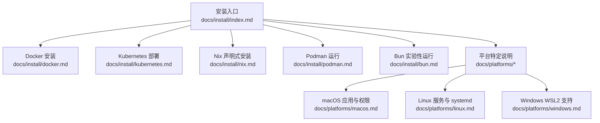
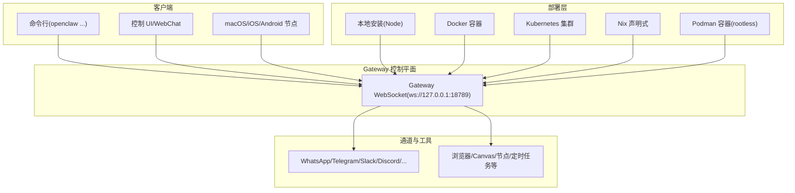
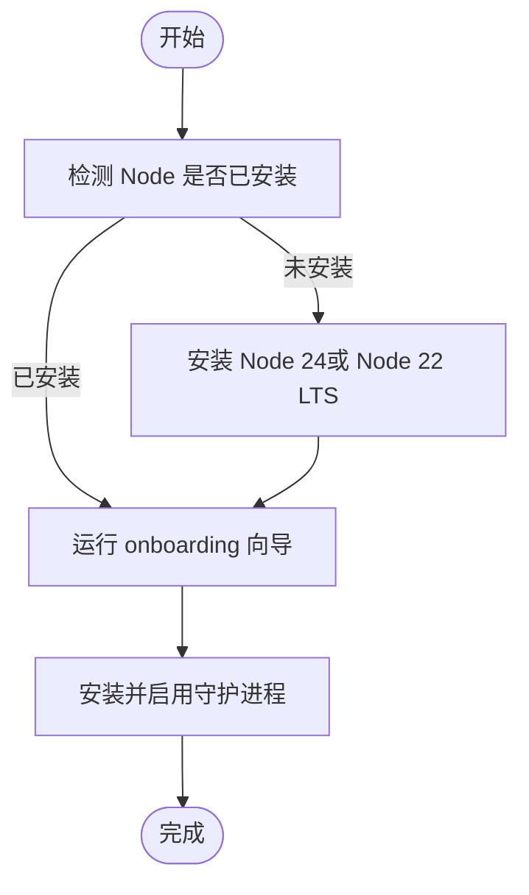
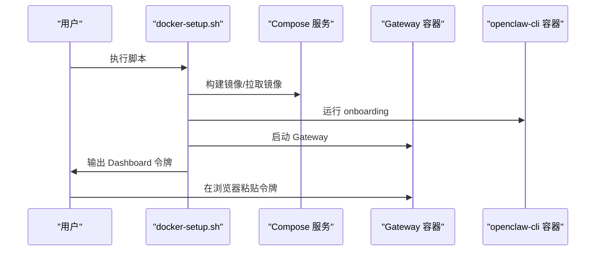
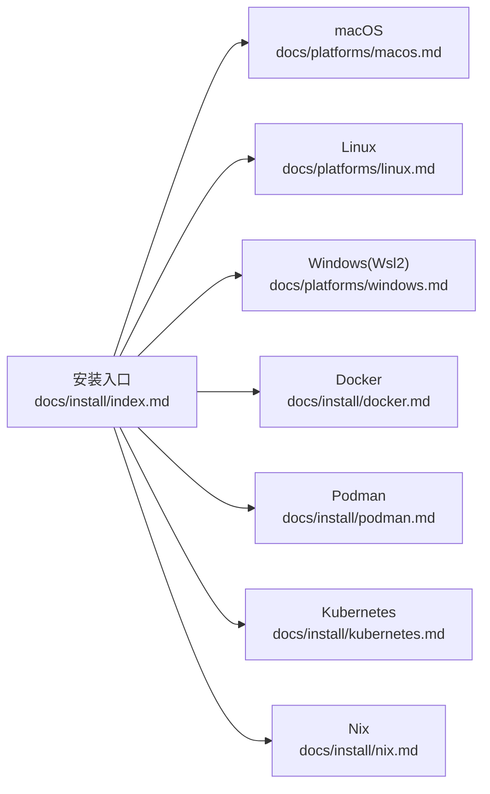

# 安装与配置

<cite>
**本文引用的文件**
- [README.md](file://README.md)
- [docs/install/index.md](file://docs/install/index.md)
- [docs/install/docker.md](file://docs/install/docker.md)
- [docs/install/kubernetes.md](file://docs/install/kubernetes.md)
- [docs/install/nix.md](file://docs/install/nix.md)
- [docs/install/podman.md](file://docs/install/podman.md)
- [docs/install/bun.md](file://docs/install/bun.md)
- [docs/platforms/macos.md](file://docs/platforms/macos.md)
- [docs/platforms/linux.md](file://docs/platforms/linux.md)
- [docs/platforms/windows.md](file://docs/platforms/windows.md)
- [docs/install/uninstall.md](file://docs/install/uninstall.md)
- [docs/install/migrating.md](file://docs/install/migrating.md)
</cite>

## 目录
1. [简介](#简介)
2. [项目结构](#项目结构)
3. [核心组件](#核心组件)
4. [架构总览](#架构总览)
5. [详细组件分析](#详细组件分析)
6. [依赖关系分析](#依赖关系分析)
7. [性能考虑](#性能考虑)
8. [故障排除指南](#故障排除指南)
9. [结论](#结论)
10. [附录](#附录)

## 简介
本指南面向在多平台（macOS、Linux、Windows、iOS、Android）上安装与配置 OpenClaw 的用户，覆盖多种安装方式（Docker、Kubernetes、Nix、Podman、传统包管理器）与最佳实践；并提供生产环境部署要点、安全配置建议、性能优化选项、配置文件详解、环境变量设置、网络拓扑规划、升级迁移策略、备份恢复方案与常见问题排查。

## 项目结构
OpenClaw 提供了从本地安装到容器化/编排化的多种部署路径，并在各平台文档中给出配套的系统服务与权限说明。安装相关的核心内容分布在以下位置：
- 安装与更新：docs/install/*
- 平台适配：docs/platforms/*
- 升级迁移与卸载：docs/install/updating.md、docs/install/migrating.md、docs/install/uninstall.md
- 配置参考与运行时行为：docs/gateway/configuration.md（由 README 引用）

图表来源
- [docs/install/index.md:24-151](file://docs/install/index.md#L24-L151)
- [docs/install/docker.md:35-240](file://docs/install/docker.md#L35-L240)
- [docs/install/kubernetes.md:23-94](file://docs/install/kubernetes.md#L23-L94)
- [docs/install/nix.md:10-99](file://docs/install/nix.md#L10-L99)
- [docs/install/podman.md:8-123](file://docs/install/podman.md#L8-L123)
- [docs/platforms/macos.md:9-227](file://docs/platforms/macos.md#L9-L227)
- [docs/platforms/linux.md:9-95](file://docs/platforms/linux.md#L9-L95)
- [docs/platforms/windows.md:9-242](file://docs/platforms/windows.md#L9-L242)

章节来源
- [docs/install/index.md:10-151](file://docs/install/index.md#L10-L151)

## 核心组件
- 安装方式
  - 官方安装脚本：支持 macOS/Linux/WSL2 与 Windows PowerShell，自动检测/安装 Node 并启动向导。
  - 包管理器安装：npm/pnpm（推荐 Node 24，兼容 Node 22 LTS）。
  - 源码构建：贡献者或本地开发使用，需 pnpm 安装依赖与构建。
  - 其他方式：Docker、Podman、Nix、Ansible、Bun（实验性）。
- 平台适配
  - macOS：菜单栏应用、LaunchAgent、节点能力暴露、远程模式下的 SSH 隧道。
  - Linux：Gateway 用户服务（systemd user unit），适合 VPS/服务器。
  - Windows：推荐 WSL2；原生 Windows 支持逐步完善，仍以 WSL2 为主。
- 生产与运维
  - Docker/Kubernetes：容器化与编排部署，含健康检查、持久化与安全加固。
  - Nix：声明式安装与回滚，禁用自动安装流程，适合可复现与受控环境。
  - Podman：根无须 Podman 容器运行，适合 rootless 场景。
- 升级迁移与卸载
  - 升级通道：stable/beta/dev；doctor 自检；更新后验证。
  - 迁移：复制状态目录与工作区，注意 profile 与权限一致性。
  - 卸载：停止服务、卸载服务、删除状态与工作区、移除 CLI。

章节来源
- [README.md:50-110](file://README.md#L50-L110)
- [docs/install/index.md:24-151](file://docs/install/index.md#L24-L151)
- [docs/platforms/macos.md:26-50](file://docs/platforms/macos.md#L26-L50)
- [docs/platforms/linux.md:37-95](file://docs/platforms/linux.md#L37-L95)
- [docs/platforms/windows.md:19-95](file://docs/platforms/windows.md#L19-L95)
- [docs/install/docker.md:35-240](file://docs/install/docker.md#L35-L240)
- [docs/install/kubernetes.md:23-94](file://docs/install/kubernetes.md#L23-L94)
- [docs/install/nix.md:10-99](file://docs/install/nix.md#L10-L99)
- [docs/install/podman.md:8-123](file://docs/install/podman.md#L8-L123)
- [docs/install/migrating.md:9-132](file://docs/install/migrating.md#L9-L132)
- [docs/install/uninstall.md:9-77](file://docs/install/uninstall.md#L9-L77)

## 架构总览
下图展示了 OpenClaw 在不同平台与部署方式下的关键交互面：Gateway 控制平面、客户端（CLI/浏览器/UI）、通道（多平台消息渠道）、以及可选的容器/编排层。

图表来源
- [README.md:185-239](file://README.md#L185-L239)
- [docs/install/docker.md:35-240](file://docs/install/docker.md#L35-L240)
- [docs/install/kubernetes.md:84-94](file://docs/install/kubernetes.md#L84-L94)
- [docs/install/nix.md:46-81](file://docs/install/nix.md#L46-L81)
- [docs/install/podman.md:88-123](file://docs/install/podman.md#L88-L123)

## 详细组件分析

### 安装方式一：官方安装脚本（macOS/Linux/WSL2 与 Windows）
- 适用场景：首次安装、快速体验、CI/自动化。
- 特点：自动检测/安装 Node，执行 onboarding 向导，生成守护进程。
- 注意事项：Windows 推荐 PowerShell；可跳过 onboarding 仅安装二进制；CI 可通过参数与环境变量控制。

图表来源
- [docs/install/index.md:35-70](file://docs/install/index.md#L35-L70)

章节来源
- [docs/install/index.md:24-70](file://docs/install/index.md#L24-L70)

### 安装方式二：包管理器（npm/pnpm）
- 适用场景：已有 Node 环境或偏好包管理器。
- 特点：pnpm 需要显式批准带构建脚本的包；sharp 构建失败时可使用环境变量强制预编译二进制。
- 注意事项：Node 24 推荐，Node 22 LTS 兼容；源码安装时使用 pnpm。

章节来源
- [docs/install/index.md:72-114](file://docs/install/index.md#L72-L114)

### 安装方式三：从源码构建
- 适用场景：贡献者、需要本地修改与调试。
- 步骤：克隆仓库 → pnpm 安装 → UI 构建 → 构建产物 → 链接 CLI 或直接使用 pnpm openclaw … → 运行 onboarding。

章节来源
- [docs/install/index.md:117-150](file://docs/install/index.md#L117-L150)

### 安装方式四：Docker（容器化 Gateway）
- 适用场景：隔离环境、快速验证、CI/CD。
- 快速开始：执行 docker-setup.sh，自动构建镜像、运行向导、启动 Gateway、生成令牌。
- 关键特性：支持代理沙箱（非必需 Gateway 也在 Docker 中运行）、健康检查、持久化卷、额外挂载、预装系统包与扩展依赖。
- 网络与安全：默认 loopback 绑定，可通过环境变量调整；CLI 与 Gateway 共享网络边界需谨慎；VPS 部署需关注防火墙与 DOCKER-USER 策略。

图表来源
- [docs/install/docker.md:45-84](file://docs/install/docker.md#L45-L84)

章节来源
- [docs/install/docker.md:35-240](file://docs/install/docker.md#L35-L240)

### 安装方式五：Kubernetes（Kustomize）
- 适用场景：集群内最小可用部署、学习与测试。
- 快速开始：设置 Provider API Key → 执行部署脚本 → 端口转发访问 Dashboard → 获取 Gateway 令牌。
- 资源清单：命名空间、Deployment、Service、PVC、ConfigMap、Secret。
- 自定义：编辑 ConfigMap 中 openclaw.json 与 AGENTS.md；添加 Provider 密钥；自定义命名空间与镜像；暴露至 Ingress/LB（需配合 Gateway 绑定与鉴权）。

章节来源
- [docs/install/kubernetes.md:23-168](file://docs/install/kubernetes.md#L23-L168)

### 安装方式六：Nix（声明式安装）
- 适用场景：追求可复现、可回滚、受控环境。
- 特点：通过 nix-openclaw 模块安装 Gateway、macOS 应用与工具；禁用自动安装与自变更流程；Nix 模式下配置与状态路径需显式指向 Nix 管理位置。
- 行为差异：UI 显示只读 Nix 模式提示；缺失依赖会给出 Nix 修复建议。

章节来源
- [docs/install/nix.md:10-99](file://docs/install/nix.md#L10-L99)

### 安装方式七：Podman（根无须容器）
- 适用场景：rootless 场景、替代 Docker。
- 快速开始：一次性设置创建用户、构建镜像、安装启动脚本；手动启动或安装 systemd Quadlet 用户服务。
- 环境与存储：令牌与配置位于宿主目录；默认 loopback 绑定；可映射端口与覆盖路径；注意子 UID/GID 与 cgroups v2。

章节来源
- [docs/install/podman.md:8-123](file://docs/install/podman.md#L8-L123)

### 安装方式八：Bun（实验性）
- 适用场景：本地开发循环（bun run/watch），不推荐用于 Gateway 运行时（WhatsApp/Telegram 已知问题）。
- 注意事项：pnpm 仍为默认构建工具；Bun 无法使用 pnpm-lock.yaml；部分生命周期脚本可能被阻断，必要时显式信任。

章节来源
- [docs/install/bun.md:9-60](file://docs/install/bun.md#L9-L60)

### 平台特定配置

#### macOS
- 角色：菜单栏应用 + Gateway 代理；负责权限与节点能力暴露。
- 服务：LaunchAgent；支持本地/远程模式；Exec 审批与允许列表；深链 openclaw://agent。
- 状态目录：避免 iCloud 同步路径；建议使用本地路径。

章节来源
- [docs/platforms/macos.md:9-227](file://docs/platforms/macos.md#L9-L227)

#### Linux
- 角色：Gateway 完全支持；推荐 Node 作为运行时；Bun 不推荐用于 Gateway。
- 服务：systemd 用户服务；VPS 快速路径：安装 Node → npm 安装 → onboarding → SSH 端口转发。

章节来源
- [docs/platforms/linux.md:9-95](file://docs/platforms/linux.md#L9-L95)

#### Windows（WSL2）
- 角色：推荐 WSL2；原生 Windows 支持逐步完善。
- 服务：WSL 内部安装 Gateway；Windows 端口转发（portproxy）将端口映射到宿主机；开机自启链路（WSL 开机任务 + linger）。
- 注意：Scheduled Tasks 优先但可能受限；fallback 为启动项登录项。

章节来源
- [docs/platforms/windows.md:9-242](file://docs/platforms/windows.md#L9-L242)

### 配置文件与环境变量

- 配置文件
  - 默认位置：~/.openclaw/openclaw.json；可通过 OPENCLAW_CONFIG_PATH 覆盖。
  - 示例：最小配置包含 agent.model。
- 环境变量
  - OPENCLAW_HOME：基础家目录内部路径解析。
  - OPENCLAW_STATE_DIR：可变状态位置。
  - OPENCLAW_CONFIG_PATH：配置文件位置。
  - Docker/Podman：大量环境变量用于镜像构建、挂载、APT 包、扩展依赖、浏览器标志等。
- Nix 模式
  - OPENCLAW_NIX_MODE=1 或 macOS defaults 设置；禁用自动安装与自变更流程。

章节来源
- [README.md:318-338](file://README.md#L318-L338)
- [docs/install/index.md:183-189](file://docs/install/index.md#L183-L189)
- [docs/install/docker.md:59-78](file://docs/install/docker.md#L59-L78)
- [docs/install/podman.md:88-94](file://docs/install/podman.md#L88-L94)
- [docs/install/nix.md:46-81](file://docs/install/nix.md#L46-L81)

### 网络拓扑与暴露
- Docker：默认 LAN 绑定，便于宿主机访问；CLI 与 Gateway 共享网络边界需注意；健康检查端点 /healthz 与 /readyz。
- Kubernetes：默认 loopback 绑定，通过 kubectl port-forward 访问；如需 Ingress/LB，需调整 Gateway 绑定与鉴权。
- macOS 远程：SSH 隧道将本地 UI 组件与远程 Gateway 通信；IP 报告为 127.0.0.1，若需真实客户端 IP 使用直连传输。
- WSL2：通过 netsh portproxy 将宿主机端口转发到 WSL IP；刷新规则需在 WSL 重启后重新配置。

章节来源
- [docs/install/docker.md:508-538](file://docs/install/docker.md#L508-L538)
- [docs/install/kubernetes.md:144-153](file://docs/install/kubernetes.md#L144-L153)
- [docs/platforms/macos.md:200-220](file://docs/platforms/macos.md#L200-L220)
- [docs/platforms/windows.md:140-184](file://docs/platforms/windows.md#L140-L184)

### 安全配置建议
- 默认行为：未知发送者 DM 需要配对码；公开 DM 需显式开启并包含通配符。
- Tailscale：Serve/Funnel 模式下 Gateway 绑定必须为 loopback；可强制密码认证或关闭尾道访问。
- Docker/Podman：非 root 用户运行；限制 Capabilities、禁用 NET_RAW/NET_ADMIN；CLI 与 Gateway 共享网络边界需谨慎。
- Nix：禁用自动安装与自变更；UI 显示只读模式；状态与配置路径需指向 Nix 管理位置。

章节来源
- [README.md:112-125](file://README.md#L112-L125)
- [README.md:213-228](file://README.md#L213-L228)
- [docs/install/docker.md:130-141](file://docs/install/docker.md#L130-L141)
- [docs/install/podman.md:96-100](file://docs/install/podman.md#L96-L100)
- [docs/install/nix.md:76-81](file://docs/install/nix.md#L76-L81)

### 性能优化选项
- Docker：缓存依赖层顺序、持久化 /home/node 与 Playwright 浏览器缓存、按需安装浏览器。
- Kubernetes：资源请求/限制、持久化存储、健康探针与就绪探针。
- Nix：依赖固定版本、可复现构建；避免自动安装导致的额外下载。
- Podman：rootless 子 UID/GID、cgroups v2、日志与容器清理。

章节来源
- [docs/install/docker.md:405-437](file://docs/install/docker.md#L405-L437)
- [docs/install/kubernetes.md:170-178](file://docs/install/kubernetes.md#L170-L178)
- [docs/install/nix.md:76-81](file://docs/install/nix.md#L76-L81)
- [docs/install/podman.md:111-123](file://docs/install/podman.md#L111-L123)

### 升级迁移策略
- 升级通道：stable/beta/dev；doctor 自检；更新后验证。
- 迁移：复制状态目录与工作区；注意 profile 与权限一致性；避免仅复制 openclaw.json；处理权限/所有权；远程/本地模式差异。
- 备份：归档状态目录与工作区；加密存储；避免不安全渠道；怀疑泄露时轮换密钥。

章节来源
- [README.md:89-91](file://README.md#L89-L91)
- [docs/install/migrating.md:9-193](file://docs/install/migrating.md#L9-L193)

### 卸载与清理
- 易路径：停止服务 → 卸载服务 → 删除状态与工作区 → 移除 CLI → 如安装 macOS 应用则删除应用。
- 手动路径：根据平台卸载 LaunchAgent/systemd/schtasks；清理遗留文件与脚本。

章节来源
- [docs/install/uninstall.md:9-129](file://docs/install/uninstall.md#L9-L129)

## 依赖关系分析
- 安装方式与平台耦合度
  - macOS：菜单栏应用 + LaunchAgent；节点能力与权限。
  - Linux：systemd 用户服务；VPS 最佳实践。
  - Windows：WSL2 优先；原生 Windows 逐步完善。
- 容器化与编排
  - Docker/Podman：镜像构建、卷挂载、网络与安全加固。
  - Kubernetes：命名空间、Deployment、Service、PVC、ConfigMap、Secret。
- 配置与环境变量
  - 通用：OPENCLAW_HOME/STATE_DIR/CONFIG_PATH。
  - Docker/Podman：大量构建期与运行期环境变量。
  - Nix：禁用自动安装、Nix 模式开关。

图表来源
- [docs/install/index.md:24-151](file://docs/install/index.md#L24-L151)
- [docs/platforms/macos.md:9-227](file://docs/platforms/macos.md#L9-L227)
- [docs/platforms/linux.md:9-95](file://docs/platforms/linux.md#L9-L95)
- [docs/platforms/windows.md:9-242](file://docs/platforms/windows.md#L9-L242)
- [docs/install/docker.md:35-240](file://docs/install/docker.md#L35-L240)
- [docs/install/podman.md:8-123](file://docs/install/podman.md#L8-L123)
- [docs/install/kubernetes.md:23-94](file://docs/install/kubernetes.md#L23-L94)
- [docs/install/nix.md:10-99](file://docs/install/nix.md#L10-L99)

## 性能考虑
- 构建与缓存
  - Docker：合理安排 Dockerfile 层顺序，避免不必要的 pnpm install 重跑。
  - Nix：固定依赖版本，减少不可复现因素。
- 运行时
  - Docker/Podman：持久化 /home/node 与浏览器缓存；按需安装浏览器，避免 npm override 冲突。
  - Kubernetes：为 Gateway 设置合适的资源限制与探针，确保稳定性。
- I/O 与存储
  - 关注 media/、sessions/、transcript JSONL、cron/runs/*.jsonl 与日志滚动文件的增长热点。

章节来源
- [docs/install/docker.md:405-437](file://docs/install/docker.md#L405-L437)
- [docs/install/kubernetes.md:170-178](file://docs/install/kubernetes.md#L170-L178)
- [docs/install/podman.md:96-100](file://docs/install/podman.md#L96-L100)

## 故障排除指南
- openclaw 未找到
  - 检查 Node/npm 版本与 npm prefix -g；将 $(npm prefix -g)/bin 添加到 PATH。
- Docker 权限与 EACCES
  - 确保宿主绑定挂载拥有正确的 UID/GID（默认 node 用户 uid 1000）。
- Docker 网络与绑定
  - 若出现“Gateway target: ws://...”或反复 pairing required，调整 gateway.mode 与 gateway.bind 为 local/lan。
- Kubernetes 暴露
  - 默认 loopback 绑定，需通过 Ingress/LB 暴露时调整绑定与鉴权。
- Windows WSL2 端口转发
  - netsh portproxy 刷新；允许防火墙；确认监听地址与目标端口。
- 卸载后服务仍在运行
  - 根据平台手动卸载 LaunchAgent/systemd/schtasks；清理遗留文件。

章节来源
- [docs/install/index.md:191-214](file://docs/install/index.md#L191-L214)
- [docs/install/docker.md:392-404](file://docs/install/docker.md#L392-L404)
- [docs/install/kubernetes.md:144-153](file://docs/install/kubernetes.md#L144-L153)
- [docs/platforms/windows.md:140-184](file://docs/platforms/windows.md#L140-L184)
- [docs/install/uninstall.md:78-114](file://docs/install/uninstall.md#L78-L114)

## 结论
OpenClaw 提供了从本地到容器化/编排化的完整安装与配置路径。选择安装方式时应结合平台特性与运维需求：本地安装适合个人开发与快速体验；Docker/Kubernetes/Podman 适合隔离与规模化部署；Nix 适合可复现与受控环境；Windows 推荐 WSL2。生产部署需重视安全加固、网络拓扑与健康监控，并制定升级迁移与备份恢复策略。

## 附录
- 相关链接与参考
  - Getting Started、更新、卸载、迁移、环境变量、安全指南等详见各文档页签与导航。