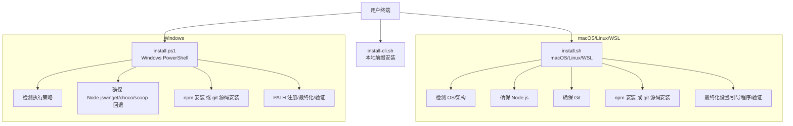
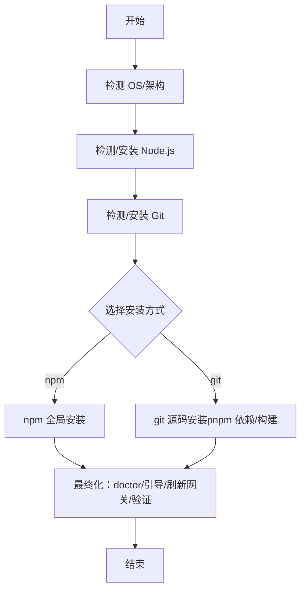
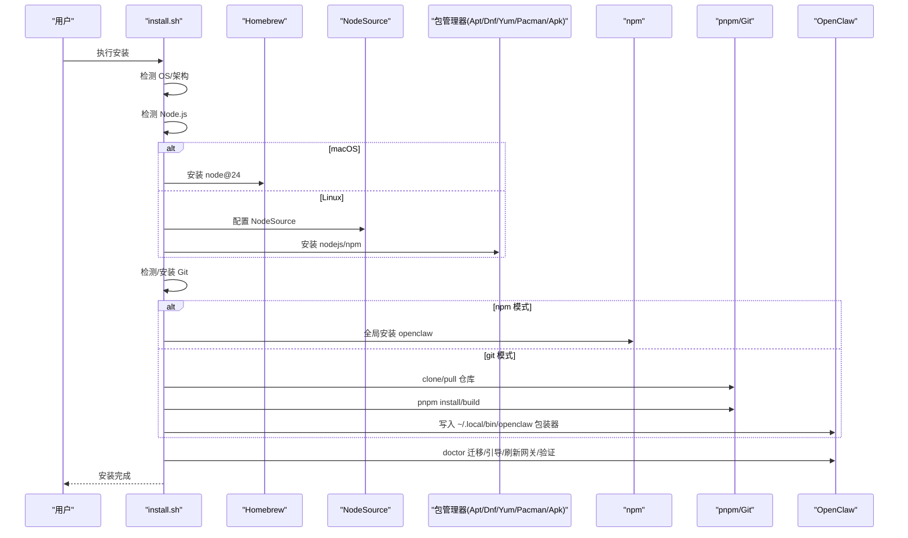
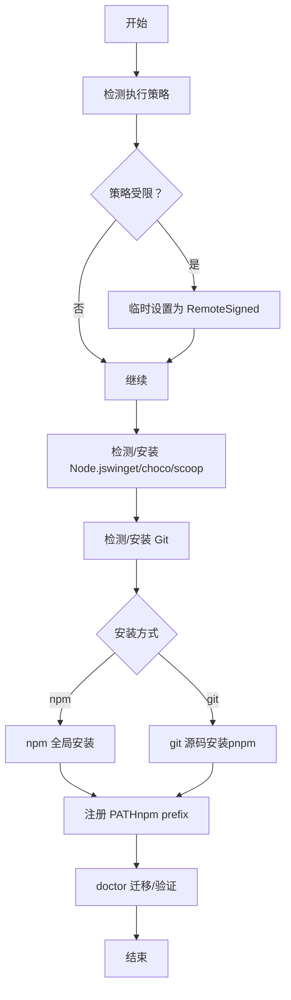
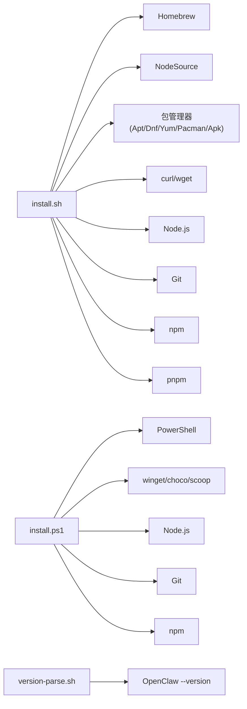

# 安装脚本

<cite>
**本文引用的文件**
- [scripts/install.sh](file://scripts/install.sh)
- [scripts/install.ps1](file://scripts/install.ps1)
- [docs/install/installer.md](file://docs/install/installer.md)
- [scripts/docker/install-sh-common/version-parse.sh](file://scripts/docker/install-sh-common/version-parse.sh)
- [scripts/test-install-sh-docker.sh](file://scripts/test-install-sh-docker.sh)
- [src/cli/daemon-cli/install.ts](file://src/cli/daemon-cli/install.ts)
</cite>

## 目录
1. [简介](#简介)
2. [项目结构](#项目结构)
3. [核心组件](#核心组件)
4. [架构总览](#架构总览)
5. [详细组件分析](#详细组件分析)
6. [依赖关系分析](#依赖关系分析)
7. [性能考虑](#性能考虑)
8. [故障排除指南](#故障排除指南)
9. [结论](#结论)
10. [附录](#附录)

## 简介
本文件面向 OpenClaw 的自动安装脚本，系统性说明以下内容：
- 脚本工作原理与安装流程
- 支持的操作系统：macOS、Linux、WSL2 与 Windows PowerShell
- 参数选项、环境变量与 CI/自动化支持
- 常见问题排查：权限、网络、依赖冲突
- 高级选项：自定义安装路径、跳过引导程序等

## 项目结构
OpenClaw 提供三类安装脚本，分别针对不同平台与使用场景：
- install.sh：适用于 macOS/Linux/WSL，支持 npm 或 git 安装方式
- install.ps1：适用于 Windows PowerShell，支持 npm 或 git 安装方式
- install-cli.sh：本地前缀安装（无需系统 Node），用于隔离环境或 CI

图表来源
- [scripts/install.sh:2278-2579](file://scripts/install.sh#L2278-L2579)
- [scripts/install.ps1:300-360](file://scripts/install.ps1#L300-L360)

章节来源
- [docs/install/installer.md:12-19](file://docs/install/installer.md#L12-L19)

## 核心组件
- install.sh（macOS/Linux/WSL）
  - 自动检测操作系统与架构，必要时安装 Homebrew（macOS）、Node.js（Homebrew/NodeSource/apt/dnf/yum）、Git
  - 支持两种安装模式：npm 全局安装或从 git 源码构建安装
  - 完成后运行 doctor 迁移、尝试引导程序、刷新网关服务、可选验证安装
- install.ps1（Windows PowerShell）
  - 检测执行策略，必要时临时提升到远程签名策略
  - 通过 winget/choco/scoop 安装 Node.js（回退到手动安装提示）
  - 支持 npm 或 git 安装；安装后尝试将 npm prefix bin 写入用户 PATH
- install-cli.sh（本地前缀安装）
  - 下载指定版本 Node 并安装到本地前缀，再以 npm 安装 OpenClaw，写入包装器
  - 适合 CI 或需要隔离运行环境的场景

章节来源
- [docs/install/installer.md:61-169](file://docs/install/installer.md#L61-L169)
- [docs/install/installer.md:251-334](file://docs/install/installer.md#L251-L334)
- [docs/install/installer.md:173-247](file://docs/install/installer.md#L173-L247)

## 架构总览
下图展示 install.sh 的主流程与关键阶段。

图表来源
- [scripts/install.sh:2278-2579](file://scripts/install.sh#L2278-L2579)

章节来源
- [scripts/install.sh:2278-2579](file://scripts/install.sh#L2278-L2579)

## 详细组件分析

### install.sh（macOS/Linux/WSL）
- 支持的操作系统与架构
  - macOS、Linux（含 WSL）、通过 uname 检测 Darwin/Linux
- Node.js 版本要求与安装
  - 默认优先使用 Node 24；最低兼容 Node 22.16+
  - macOS 使用 Homebrew 安装 node@24；Linux 使用 NodeSource 脚本源
- Git 安装
  - macOS 使用 Homebrew；Linux 依据包管理器（apt/dnf/yum/pacman/apk）安装
- 安装方式
  - npm：全局安装，处理 npm 权限问题（Linux 可切换到用户目录）
  - git：克隆/更新仓库，pnpm 安装依赖与构建，写入用户本地包装器
- 最终化步骤
  - doctor 迁移（升级或 git 安装）
  - 引导程序（TTY 存在且未禁用）
  - 刷新已加载的网关服务
  - 可选验证安装（版本与网关健康度）

图表来源
- [scripts/install.sh:1419-1496](file://scripts/install.sh#L1419-L1496)
- [scripts/install.sh:1544-1581](file://scripts/install.sh#L1544-L1581)
- [scripts/install.sh:1907-1955](file://scripts/install.sh#L1907-L1955)
- [scripts/install.sh:2004-2052](file://scripts/install.sh#L2004-L2052)
- [scripts/install.sh:2278-2579](file://scripts/install.sh#L2278-L2579)

章节来源
- [scripts/install.sh:254-270](file://scripts/install.sh#L254-L270)
- [scripts/install.sh:1262-1496](file://scripts/install.sh#L1262-L1496)
- [scripts/install.sh:1544-1581](file://scripts/install.sh#L1544-L1581)
- [scripts/install.sh:1907-1955](file://scripts/install.sh#L1907-L1955)
- [scripts/install.sh:2004-2052](file://scripts/install.sh#L2004-L2052)
- [scripts/install.sh:2278-2579](file://scripts/install.sh#L2278-L2579)

#### 参数与环境变量（install.sh）
- 命令行参数
  - --install-method/--method npm|git
  - --npm、--git、--github
  - --version <版本|标签|规范>
  - --beta
  - --git-dir/--dir <路径>
  - --no-git-update
  - --no-onboard、--onboard
  - --no-prompt
  - --dry-run
  - --verbose
  - --help
- 环境变量
  - OPENCLAW_INSTALL_METHOD、OPENCLAW_VERSION、OPENCLAW_BETA
  - OPENCLAW_GIT_DIR、OPENCLAW_GIT_UPDATE
  - OPENCLAW_NO_PROMPT、OPENCLAW_NO_ONBOARD、OPENCLAW_DRY_RUN
  - OPENCLAW_VERBOSE、OPENCLAW_NPM_LOGLEVEL
  - SHARP_IGNORE_GLOBAL_LIBVIPS

章节来源
- [scripts/install.sh:1003-1046](file://scripts/install.sh#L1003-L1046)
- [scripts/install.sh:1025-1038](file://scripts/install.sh#L1025-L1038)

### install.ps1（Windows PowerShell）
- 执行策略与 Node.js
  - 检测当前执行策略，必要时临时设置为 RemoteSigned
  - 通过 winget -> Chocolatey -> Scoop 安装 Node.js（回退到手动安装提示）
- 安装方式
  - npm：全局安装，支持 -Tag 指定版本/标签/规范
  - git：clone/pull、pnpm 安装与构建，写入 %USERPROFILE%\.local\bin\openclaw.cmd
- 最终化
  - 尝试将 npm prefix bin 写入用户 PATH，运行 doctor（升级或 git 安装）

图表来源
- [scripts/install.ps1:300-360](file://scripts/install.ps1#L300-L360)

章节来源
- [scripts/install.ps1:1-360](file://scripts/install.ps1#L1-L360)

#### 参数与环境变量（install.ps1）
- 命令行参数
  - -InstallMethod npm|git
  - -Tag <标签|版本|规范>
  - -GitDir <路径>
  - -NoOnboard、-NoGitUpdate、-DryRun
- 环境变量
  - OPENCLAW_INSTALL_METHOD、OPENCLAW_GIT_DIR、OPENCLAW_NO_ONBOARD
  - OPENCLAW_GIT_UPDATE、OPENCLAW_DRY_RUN

章节来源
- [scripts/install.ps1:5-12](file://scripts/install.ps1#L5-L12)
- [scripts/install.ps1:310-333](file://scripts/install.ps1#L310-L333)

### install-cli.sh（本地前缀安装）
- 流程
  - 下载指定 Node 版本到本地前缀并校验 SHA-256
  - 安装 Git（若缺失）
  - 在前缀下以 npm 安装 OpenClaw，并写入包装器
- 适用场景
  - CI 或需要隔离运行环境的场景

章节来源
- [docs/install/installer.md:173-247](file://docs/install/installer.md#L173-L247)

### 版本解析辅助（version-parse.sh）
- 作用：从 openclaw --version 输出中提取语义化版本号
- 逻辑：去除回车符，匹配语义化版本正则，取首个匹配项并去除可选前缀 v

章节来源
- [scripts/docker/install-sh-common/version-parse.sh:1-15](file://scripts/docker/install-sh-common/version-parse.sh#L1-L15)
- [scripts/install.sh:2133-2188](file://scripts/install.sh#L2133-L2188)

### CI 与自动化支持
- install.sh（非交互）
  - 使用 --no-prompt、--no-onboard 实现非交互安装
  - 通过环境变量 OPENCLAW_INSTALL_METHOD 等控制行为
- install-cli.sh（JSON 输出）
  - 使用 --json 输出事件流，便于 CI 解析
- install.ps1（非交互）
  - 使用 -NoOnboard 跳过引导程序

章节来源
- [docs/install/installer.md:342-368](file://docs/install/installer.md#L342-L368)

## 依赖关系分析
- install.sh 对外部工具的依赖
  - macOS：Homebrew（安装 Node、Git）、curl/wget（下载）
  - Linux：包管理器（apt/dnf/yum/pacman/apk）、curl/wget、sudo（必要时）
  - 通用：Node.js、Git、npm、pnpm
- install.ps1 对外部工具的依赖
  - PowerShell 5+、winget/choco/scoop（安装 Node.js）
  - Git（必需于 npm 安装）
- 版本解析
  - 通过 openclaw --version 输出解析版本号，回退到 package.json

图表来源
- [scripts/install.sh:42-67](file://scripts/install.sh#L42-L67)
- [scripts/install.sh:1419-1496](file://scripts/install.sh#L1419-L1496)
- [scripts/install.sh:1544-1581](file://scripts/install.sh#L1544-L1581)
- [scripts/install.ps1:102-162](file://scripts/install.ps1#L102-L162)
- [scripts/docker/install-sh-common/version-parse.sh:3-14](file://scripts/docker/install-sh-common/version-parse.sh#L3-L14)

章节来源
- [scripts/install.sh:42-67](file://scripts/install.sh#L42-L67)
- [scripts/install.sh:1419-1496](file://scripts/install.sh#L1419-L1496)
- [scripts/install.sh:1544-1581](file://scripts/install.sh#L1544-L1581)
- [scripts/install.ps1:102-162](file://scripts/install.ps1#L102-L162)
- [scripts/docker/install-sh-common/version-parse.sh:3-14](file://scripts/docker/install-sh-common/version-parse.sh#L3-L14)

## 性能考虑
- 下载器选择与重试
  - 优先 curl，其次 wget；失败时自动重试与超时控制
- 构建工具安装
  - Linux 自动安装 build-essential、python3、make、g++、cmake 等
  - macOS 通过 Homebrew 安装 cmake（若缺失）
- npm 日志级别与静默模式
  - 默认降低 npm 日志级别，避免噪声；verbose 模式提升日志级别
- pnpm 启用与缓存
  - 优先使用 pnpm，否则回退到 npm 安装；Corepack 可启用 pnpm

章节来源
- [scripts/install.sh:42-67](file://scripts/install.sh#L42-L67)
- [scripts/install.sh:569-621](file://scripts/install.sh#L569-L621)
- [scripts/install.sh:623-655](file://scripts/install.sh#L623-L655)
- [scripts/install.sh:675-704](file://scripts/install.sh#L675-L704)
- [scripts/install.sh:1677-1710](file://scripts/install.sh#L1677-L1710)
- [scripts/install.sh:1712-1755](file://scripts/install.sh#L1712-L1755)

## 故障排除指南
- 为什么需要 Git？
  - git 安装方式必须有 Git；npm 安装也会检查/安装 Git，避免 spawn git ENOENT
- Linux 上 npm 报 EACCES 权限错误
  - install.sh 会将 npm prefix 切换到用户目录并在 shell rc 文件追加 PATH
- sharp/libvips 问题
  - 默认关闭全局 libvips 构建；可通过环境变量覆盖
- Windows：npm 报 ENOENT（找不到 git）
  - 安装 Git for Windows，重新打开 PowerShell 后重试
- Windows：openclaw 无法识别
  - 获取 npm prefix 并将其加入用户 PATH（无需 \bin 后缀），重启 PowerShell
- Windows：如何获取更详细的输出
  - install.ps1 当前无 -Verbose 开关；可用 PowerShell 跟踪调试
- 安装后 openclaw 不在 PATH 中
  - 参考 Node.js 故障排查指引

章节来源
- [docs/install/installer.md:372-415](file://docs/install/installer.md#L372-L415)

## 结论
OpenClaw 的安装脚本针对多平台提供了统一而健壮的安装体验：
- install.sh 适配 macOS/Linux/WSL，支持 npm 与 git 两种安装方式，具备完善的依赖检测与错误恢复
- install.ps1 适配 Windows PowerShell，自动处理执行策略与 Node.js 安装
- install-cli.sh 适合需要隔离环境的场景
- 文档与测试脚本共同保障了安装流程的可维护性与可验证性

## 附录

### 安装流程与参数速查
- install.sh
  - 命令行参数与环境变量参考：[scripts/install.sh:1003-1046](file://scripts/install.sh#L1003-L1046)、[scripts/install.sh:1025-1038](file://scripts/install.sh#L1025-L1038)
  - 安装流程参考：[scripts/install.sh:2278-2579](file://scripts/install.sh#L2278-L2579)
- install.ps1
  - 命令行参数与环境变量参考：[scripts/install.ps1:5-12](file://scripts/install.ps1#L5-L12)、[scripts/install.ps1:310-333](file://scripts/install.ps1#L310-L333)
  - 安装流程参考：[scripts/install.ps1:300-360](file://scripts/install.ps1#L300-L360)
- install-cli.sh
  - 参考文档：[docs/install/installer.md:173-247](file://docs/install/installer.md#L173-L247)

### CI 与自动化示例
- install.sh 非交互安装示例：[docs/install/installer.md:347-357](file://docs/install/installer.md#L347-L357)
- install-cli.sh JSON 输出示例：[docs/install/installer.md:358-361](file://docs/install/installer.md#L358-L361)
- install.ps1 非交互安装示例：[docs/install/installer.md:363-367](file://docs/install/installer.md#L363-L367)

### 测试与验证
- Docker 端到端测试脚本
  - [scripts/test-install-sh-docker.sh:1-83](file://scripts/test-install-sh-docker.sh#L1-L83)
- 版本解析辅助
  - [scripts/docker/install-sh-common/version-parse.sh:1-15](file://scripts/docker/install-sh-common/version-parse.sh#L1-L15)