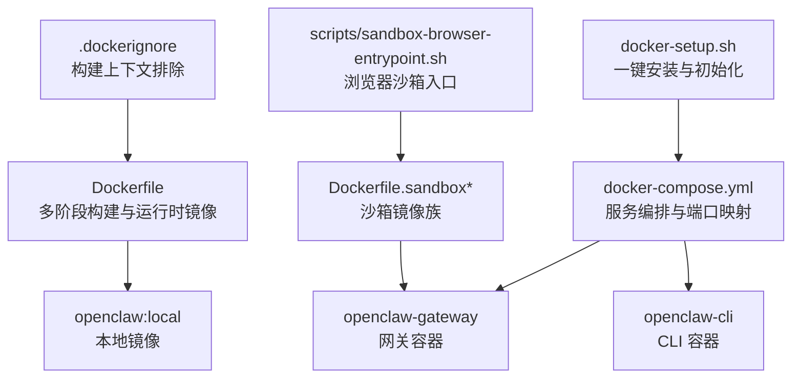
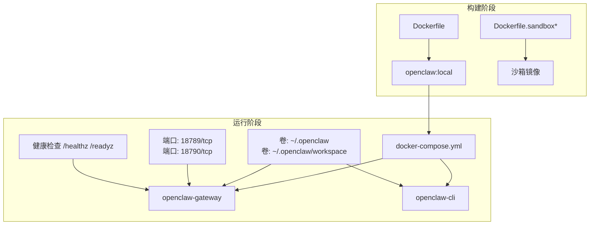
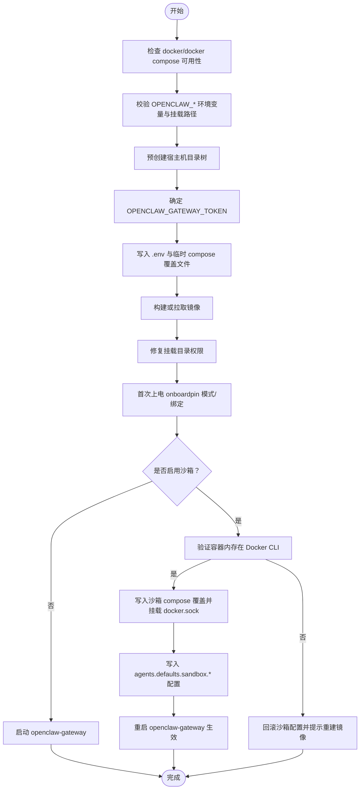
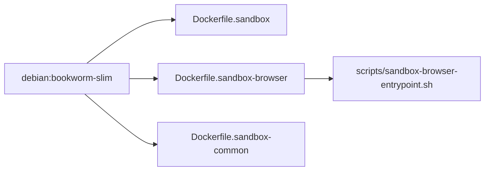
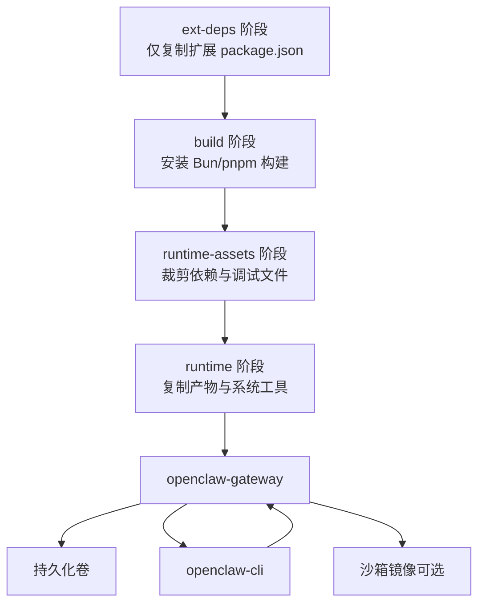

# Docker 部署

<cite>
**本文引用的文件**
- [Dockerfile](file://Dockerfile)
- [docker-compose.yml](file://docker-compose.yml)
- [.dockerignore](file://.dockerignore)
- [docker-setup.sh](file://docker-setup.sh)
- [Dockerfile.sandbox](file://Dockerfile.sandbox)
- [Dockerfile.sandbox-browser](file://Dockerfile.sandbox-browser)
- [Dockerfile.sandbox-common](file://Dockerfile.sandbox-common)
- [scripts/sandbox-browser-entrypoint.sh](file://scripts/sandbox-browser-entrypoint.sh)
</cite>

## 目录
1. [简介](#简介)
2. [项目结构](#项目结构)
3. [核心组件](#核心组件)
4. [架构总览](#架构总览)
5. [详细组件分析](#详细组件分析)
6. [依赖关系分析](#依赖关系分析)
7. [性能考虑](#性能考虑)
8. [故障排除指南](#故障排除指南)
9. [结论](#结论)
10. [附录](#附录)

## 简介
本指南面向在 Docker 环境中部署 OpenClaw 的用户，覆盖从镜像构建到容器运行、环境变量配置、卷挂载与网络配置的完整流程，并提供 docker-compose 配置要点、启动参数与端口映射说明。同时给出生产环境最佳实践（健康检查、资源限制、安全加固），以及故障排除与性能优化建议。

## 项目结构
与 Docker 部署直接相关的核心文件与目录如下：
- 构建与运行镜像：Dockerfile、Dockerfile.sandbox、Dockerfile.sandbox-browser、Dockerfile.sandbox-common
- 编排与运行：docker-compose.yml、docker-setup.sh
- 构建上下文排除：.dockerignore
- 浏览器沙箱入口脚本：scripts/sandbox-browser-entrypoint.sh

**图表来源**
- [Dockerfile:1-250](file://Dockerfile#L1-L250)
- [docker-compose.yml:1-79](file://docker-compose.yml#L1-L79)
- [.dockerignore:1-71](file://.dockerignore#L1-L71)
- [docker-setup.sh:1-617](file://docker-setup.sh#L1-L617)
- [Dockerfile.sandbox:1-25](file://Dockerfile.sandbox#L1-L25)
- [Dockerfile.sandbox-browser:1-36](file://Dockerfile.sandbox-browser#L1-L36)
- [Dockerfile.sandbox-common:1-49](file://Dockerfile.sandbox-common#L1-L49)
- [scripts/sandbox-browser-entrypoint.sh:1-128](file://scripts/sandbox-browser-entrypoint.sh#L1-L128)

**章节来源**
- [Dockerfile:1-250](file://Dockerfile#L1-L250)
- [docker-compose.yml:1-79](file://docker-compose.yml#L1-L79)
- [.dockerignore:1-71](file://.dockerignore#L1-L71)
- [docker-setup.sh:1-617](file://docker-setup.sh#L1-L617)
- [Dockerfile.sandbox:1-25](file://Dockerfile.sandbox#L1-L25)
- [Dockerfile.sandbox-browser:1-36](file://Dockerfile.sandbox-browser#L1-L36)
- [Dockerfile.sandbox-common:1-49](file://Dockerfile.sandbox-common#L1-L49)
- [scripts/sandbox-browser-entrypoint.sh:1-128](file://scripts/sandbox-browser-entrypoint.sh#L1-L128)

## 核心组件
- 运行时镜像（默认与 slim 变体）
  - 基于固定 digest 的 Debian Bookworm（full 或 slim）镜像，使用 Node.js 24 运行时。
  - 多阶段构建：先构建产物，再裁剪至最小运行时层，最终输出轻量镜像。
- 网关服务（openclaw-gateway）
  - 默认绑定到回环地址，通过端口映射对外暴露；支持健康检查与就绪检查。
  - 支持通过环境变量启用令牌认证、允许不安全私有 WebSocket、时区等。
- CLI 服务（openclaw-cli）
  - 与网关共享网络命名空间，提供交互式终端与命令执行能力。
- 沙箱镜像族（可选）
  - 提供基础沙箱、带浏览器的沙箱与通用工具链沙箱，用于隔离代理执行。
- 初始化脚本（docker-setup.sh）
  - 自动校验与生成环境变量、写入 .env、构建或拉取镜像、修复权限、引导首次上电、可选启用沙箱并安全地挂载 Docker Socket。

**章节来源**
- [Dockerfile:103-250](file://Dockerfile#L103-L250)
- [docker-compose.yml:2-79](file://docker-compose.yml#L2-L79)
- [docker-setup.sh:432-496](file://docker-setup.sh#L432-L496)
- [Dockerfile.sandbox:1-25](file://Dockerfile.sandbox#L1-L25)
- [Dockerfile.sandbox-browser:1-36](file://Dockerfile.sandbox-browser#L1-L36)
- [Dockerfile.sandbox-common:1-49](file://Dockerfile.sandbox-common#L1-L49)

## 架构总览
下图展示 Docker 部署的整体架构：镜像构建、编排与运行、数据持久化、网络暴露与可选沙箱。

**图表来源**
- [Dockerfile:1-250](file://Dockerfile#L1-L250)
- [Dockerfile.sandbox:1-25](file://Dockerfile.sandbox#L1-L25)
- [Dockerfile.sandbox-browser:1-36](file://Dockerfile.sandbox-browser#L1-L36)
- [Dockerfile.sandbox-common:1-49](file://Dockerfile.sandbox-common#L1-L49)
- [docker-compose.yml:1-79](file://docker-compose.yml#L1-L79)

## 详细组件分析

### 镜像构建（Dockerfile）
- 多阶段构建
  - ext-deps 阶段仅复制所需扩展的 package.json，避免无关源码变更导致缓存失效。
  - build 阶段安装 Bun、pnpm、构建产物与 UI 资产。
  - runtime-assets 阶段裁剪开发依赖与调试文件。
  - base-default/base-slim 阶段选择 full 或 slim 基础镜像。
  - 最终 runtime 阶段复制裁剪后的资产，安装系统工具与可选组件（如浏览器、Docker CLI）。
- 构建参数
  - OPENCLAW_EXTENSIONS：按空格分隔的扩展名列表，仅提取其 package.json 以加速依赖解析。
  - OPENCLAW_VARIANT：default 或 slim。
  - OPENCLAW_DOCKER_APT_PACKAGES：运行时额外安装的系统包。
  - OPENCLAW_INSTALL_BROWSER：预装 Chromium 与 Playwright 二进制，减少容器启动冷启动时间。
  - OPENCLAW_INSTALL_DOCKER_CLI：安装 Docker CLI，配合沙箱功能。
- 运行时安全与健康检查
  - 非 root 用户运行（node:1000）。
  - 内置健康检查与就绪检查端点。
  - 默认绑定到 127.0.0.1，需通过网络模式或 bind 参数调整以适配宿主机访问。

**章节来源**
- [Dockerfile:1-250](file://Dockerfile#L1-L250)

### docker-compose 配置
- 服务定义
  - openclaw-gateway
    - 环境变量：HOME、TERM、OPENCLAW_GATEWAY_TOKEN、OPENCLAW_ALLOW_INSECURE_PRIVATE_WS、时区 TZ、第三方会话密钥等。
    - 卷挂载：~/.openclaw 与 ~/.openclaw/workspace。
    - 端口映射：默认 18789:18789、18790:18790。
    - 健康检查：内置探针。
    - 启动参数：通过 command 指定 bind 与端口。
  - openclaw-cli
    - 共享 openclaw-gateway 的网络命名空间。
    - 安全加固：丢弃敏感 Linux 能力、禁用新特权。
    - 终端：stdin_open 与 tty 打开，便于交互。
- 网络与安全
  - 网络模式：默认桥接网络；若需直接访问宿主机网络，可参考 host 模式（需谨慎）。
  - 健康检查：内置探针，便于编排层自动重启与流量切换。

**章节来源**
- [docker-compose.yml:1-79](file://docker-compose.yml#L1-L79)

### 初始化脚本（docker-setup.sh）
- 功能概览
  - 校验与生成 OPENCLAW_GATEWAY_TOKEN（优先复用配置或 .env，否则随机生成）。
  - 写入 .env 并生成临时 docker-compose 覆盖文件（用于命名卷或额外挂载）。
  - 构建或拉取镜像（OPENCLAW_IMAGE）。
  - 修复宿主机挂载目录权限，确保容器内 node 用户可写。
  - 引导首次上电（onboard），设置网关模式与绑定策略。
  - 可选启用沙箱：验证镜像内存在 Docker CLI、挂载 Docker Socket、写入沙箱配置并重启网关。
- 关键行为
  - 对挂载路径、时区、额外挂载格式进行严格校验，防止注入与越权。
  - 仅在前置条件满足后才挂载 Docker Socket，避免暴露风险。
  - 通过 openclaw-cli config set 写入网关配置，确保与 docker-compose 一致。

**图表来源**
- [docker-setup.sh:177-617](file://docker-setup.sh#L177-L617)

**章节来源**
- [docker-setup.sh:1-617](file://docker-setup.sh#L1-L617)

### 沙箱镜像族
- Dockerfile.sandbox
  - 基于 Debian Bookworm Slim，安装常用系统工具，以非 root 用户运行。
- Dockerfile.sandbox-browser
  - 在 sandbox 基础上安装 Chromium、Xvfb、novnc、websockify 等，提供可视化浏览器与 VNC/NOVNC 访问。
  - 暴露端口：9222（CDP）、5900（VNC）、6080（NOVNC）。
  - 使用入口脚本 scripts/sandbox-browser-entrypoint.sh 启动虚拟显示与浏览器。
- Dockerfile.sandbox-common
  - 作为通用沙箱的基础层，安装 pnpm、Bun、Homebrew、Node.js、Go、Rust 等工具链。
  - 支持通过构建参数控制安装内容与最终用户。

**图表来源**
- [Dockerfile.sandbox:1-25](file://Dockerfile.sandbox#L1-L25)
- [Dockerfile.sandbox-browser:1-36](file://Dockerfile.sandbox-browser#L1-L36)
- [Dockerfile.sandbox-common:1-49](file://Dockerfile.sandbox-common#L1-L49)
- [scripts/sandbox-browser-entrypoint.sh:1-128](file://scripts/sandbox-browser-entrypoint.sh#L1-L128)

**章节来源**
- [Dockerfile.sandbox:1-25](file://Dockerfile.sandbox#L1-L25)
- [Dockerfile.sandbox-browser:1-36](file://Dockerfile.sandbox-browser#L1-L36)
- [Dockerfile.sandbox-common:1-49](file://Dockerfile.sandbox-common#L1-L49)
- [scripts/sandbox-browser-entrypoint.sh:1-128](file://scripts/sandbox-browser-entrypoint.sh#L1-L128)

### 端口与网络配置
- 网关端口
  - 18789：主服务端口（HTTP/WS）。
  - 18790：桥接/辅助端口（如需要）。
- 绑定策略
  - 默认绑定到 127.0.0.1（安全），但桥接网络下对外不可达。
  - 若需从宿主机或外部访问，应将 bind 设置为 "lan" 并配置认证。
- 网络模式
  - 推荐使用默认桥接网络；如需直连宿主机网络，可使用 host 模式，但需评估安全影响。

**章节来源**
- [Dockerfile:235-248](file://Dockerfile#L235-L248)
- [docker-compose.yml:24-38](file://docker-compose.yml#L24-L38)

### 健康检查与就绪检查
- 内置探针
  - /healthz（liveness）、/readyz（readiness），别名 /health、/ready。
- docker-compose 健康检查
  - 间隔、超时、重试次数与起始等待时间可在 compose 中自定义。

**章节来源**
- [Dockerfile:243-248](file://Dockerfile#L243-L248)
- [docker-compose.yml:39-50](file://docker-compose.yml#L39-L50)

## 依赖关系分析
- 构建期依赖
  - Dockerfile.ext-deps 仅复制扩展 package.json，降低缓存失效概率。
  - pnpm 锁定版本与缓存，减少内存占用与失败率。
- 运行期依赖
  - openclaw-gateway 依赖持久化卷（配置与工作区）。
  - 沙箱功能依赖 Docker CLI 与宿主机 Docker Socket（可选）。
- 编排依赖
  - openclaw-cli 依赖 openclaw-gateway 的网络命名空间与配置。

**图表来源**
- [Dockerfile:27-101](file://Dockerfile#L27-L101)
- [docker-compose.yml:1-79](file://docker-compose.yml#L1-L79)

**章节来源**
- [Dockerfile:27-101](file://Dockerfile#L27-L101)
- [docker-compose.yml:1-79](file://docker-compose.yml#L1-L79)

## 性能考虑
- 构建性能
  - 使用 pnpm 缓存与锁文件，避免重复安装依赖。
  - ext-deps 阶段仅复制扩展元数据，缩短构建时间。
  - 在小内存主机上限制 Node 堆大小，降低 OOM 风险。
- 运行性能
  - 预装浏览器与 Playwright 二进制，减少容器启动时的下载与安装时间。
  - 使用 slim 变体减小镜像体积，提升拉取与启动速度。
- 网络与 I/O
  - 将配置与工作区挂载为卷，避免频繁拷贝与丢失状态。
  - 合理设置 bind 与端口映射，避免不必要的 NAT 与转发开销。

**章节来源**
- [Dockerfile:66-94](file://Dockerfile#L66-L94)
- [Dockerfile:166-190](file://Dockerfile#L166-L190)
- [Dockerfile:108-111](file://Dockerfile#L108-L111)

## 故障排除指南
- 网关无法从宿主机访问
  - 现象：宿主机无法访问 127.0.0.1:18789。
  - 处理：将 OPENCLAW_GATEWAY_BIND 设为 "lan"，并配置 OPENCLAW_GATEWAY_TOKEN。
- 权限问题（EACCES）
  - 现象：容器无法在挂载目录创建文件。
  - 处理：使用 docker-setup.sh 修复权限，或手动 chown 挂载目录。
- 沙箱未生效
  - 现象：agents.defaults.sandbox.* 未按预期工作。
  - 处理：确认镜像已安装 Docker CLI；确认已挂载 /var/run/docker.sock；确认 compose 覆盖文件已应用。
- 健康检查失败
  - 现象：容器被自动重启或流量未切换。
  - 处理：检查 /healthz 与 /readyz 返回值；核对 bind 与认证配置；查看日志。

**章节来源**
- [docker-setup.sh:449-464](file://docker-setup.sh#L449-L464)
- [docker-setup.sh:516-525](file://docker-setup.sh#L516-L525)
- [docker-compose.yml:39-50](file://docker-compose.yml#L39-L50)
- [Dockerfile:243-248](file://Dockerfile#L243-L248)

## 结论
通过 Dockerfile 的多阶段构建与 docker-compose 的编排能力，OpenClaw 可在保证安全性的同时实现快速部署与稳定运行。结合 docker-setup.sh 的自动化流程，用户可以便捷地完成镜像构建、环境准备、权限修复与首次上电。生产环境中建议启用健康检查、合理设置 bind 与认证、按需启用沙箱并严格限制权限与网络暴露面。

## 附录

### 环境变量清单（docker-compose）
- OPENCLAW_GATEWAY_TOKEN：网关访问令牌（建议必填）。
- OPENCLAW_ALLOW_INSECURE_PRIVATE_WS：允许不安全私有 WebSocket（谨慎开启）。
- OPENCLAW_GATEWAY_BIND：网关绑定模式（默认 "lan"，可设为 "loopback"）。
- OPENCLAW_GATEWAY_PORT、OPENCLAW_BRIDGE_PORT：服务端口映射。
- OPENCLAW_CONFIG_DIR、OPENCLAW_WORKSPACE_DIR：配置与工作区挂载路径。
- OPENCLAW_TZ：容器时区。
- CLAUDE_AI_SESSION_KEY、CLAUDE_WEB_SESSION_KEY、CLAUDE_WEB_COOKIE：第三方会话凭据（按需）。

**章节来源**
- [docker-compose.yml:4-12](file://docker-compose.yml#L4-L12)
- [docker-compose.yml:24-38](file://docker-compose.yml#L24-L38)

### 环境变量清单（Dockerfile 构建参数）
- OPENCLAW_EXTENSIONS：按空格分隔的扩展名列表。
- OPENCLAW_VARIANT：default 或 slim。
- OPENCLAW_DOCKER_APT_PACKAGES：运行时系统包列表。
- OPENCLAW_INSTALL_BROWSER：预装浏览器与 Playwright。
- OPENCLAW_INSTALL_DOCKER_CLI：安装 Docker CLI。

**章节来源**
- [Dockerfile:15-20](file://Dockerfile#L15-L20)
- [Dockerfile:166-222](file://Dockerfile#L166-L222)

### 端口与卷映射
- 端口
  - 18789：网关主服务端口。
  - 18790：桥接/辅助端口。
- 卷
  - ~/.openclaw：配置目录。
  - ~/.openclaw/workspace：工作区目录。

**章节来源**
- [docker-compose.yml:24-26](file://docker-compose.yml#L24-L26)
- [docker-compose.yml:13-15](file://docker-compose.yml#L13-L15)

### 生产环境最佳实践
- 健康检查
  - 使用内置 /healthz 与 /readyz，或在 docker-compose 中自定义探针。
- 资源限制
  - 在 docker-compose 中设置内存与 CPU 限制，避免资源争用。
- 安全加固
  - 保持镜像 slim 化；仅在必要时启用 host 网络；限制能力与权限。
  - 沙箱启用前验证 Docker CLI 存在与 socket 可用，避免误暴露。
  - 严格管理 OPENCLAW_GATEWAY_TOKEN，定期轮换。

**章节来源**
- [Dockerfile:243-248](file://Dockerfile#L243-L248)
- [docker-compose.yml:52-79](file://docker-compose.yml#L52-L79)
- [docker-setup.sh:516-525](file://docker-setup.sh#L516-L525)