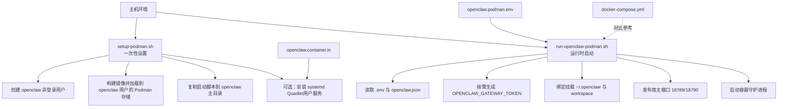
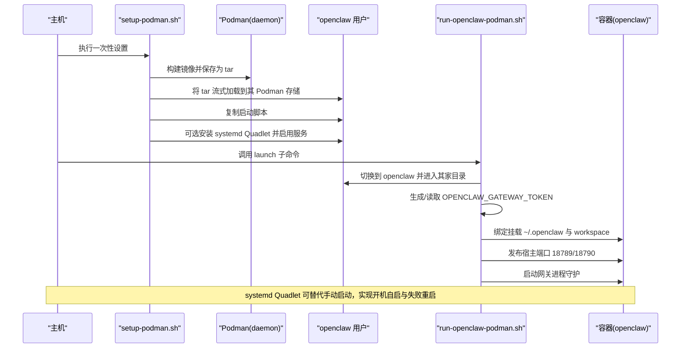
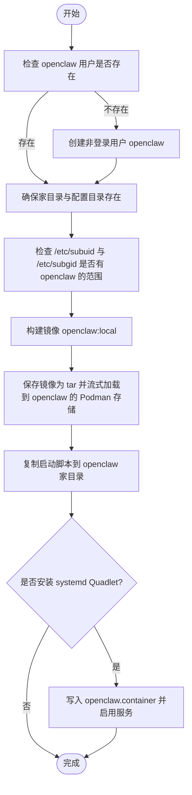
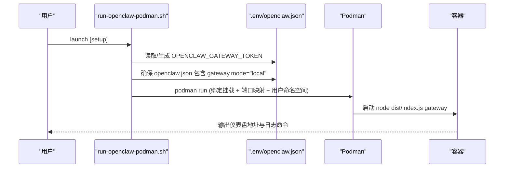
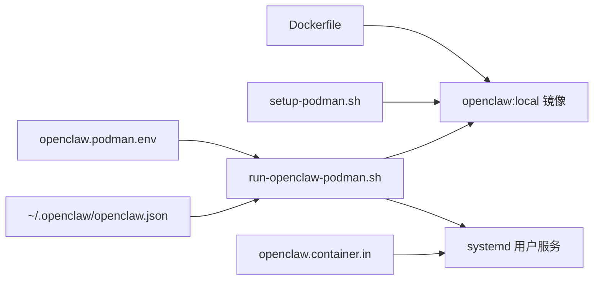

# Podman 部署

<cite>
**本文引用的文件**
- [setup-podman.sh](file://setup-podman.sh)
- [run-openclaw-podman.sh](file://scripts/run-openclaw-podman.sh)
- [openclaw.podman.env](file://openclaw.podman.env)
- [openclaw.container.in](file://scripts/podman/openclaw.container.in)
- [podman.md](file://docs/install/podman.md)
- [docker-compose.yml](file://docker-compose.yml)
- [Dockerfile](file://Dockerfile)
</cite>

## 目录
1. [简介](#简介)
2. [项目结构](#项目结构)
3. [核心组件](#核心组件)
4. [架构总览](#架构总览)
5. [详细组件分析](#详细组件分析)
6. [依赖关系分析](#依赖关系分析)
7. [性能考量](#性能考量)
8. [故障排查指南](#故障排查指南)
9. [结论](#结论)
10. [附录](#附录)

## 简介
本指南面向在 Linux 环境中以 Podman 无根（rootless）模式部署 OpenClaw 网关的用户。内容涵盖：
- Podman 无根容器安装与初始化配置
- 用户与权限管理（非登录用户、子 UID/GID）
- 启动脚本与 systemd Quadlet（可选自启动）
- 卷挂载与网络端口映射
- 与 Docker 的差异对比（安全模型、性能与使用场景）
- 最佳实践与安全建议

## 项目结构
与 Podman 部署直接相关的核心文件与目录如下：
- 一次性主机设置脚本：setup-podman.sh
- 运行时启动脚本：scripts/run-openclaw-podman.sh
- 环境变量模板：openclaw.podman.env
- systemd Quadlet 模板：scripts/podman/openclaw.container.in
- 官方文档：docs/install/podman.md
- Docker Compose 示例（用于对比）：docker-compose.yml
- 多阶段构建镜像定义：Dockerfile

图表来源
- [setup-podman.sh:1-313](file://setup-podman.sh#L1-L313)
- [run-openclaw-podman.sh:1-232](file://scripts/run-openclaw-podman.sh#L1-L232)
- [openclaw.podman.env:1-25](file://openclaw.podman.env#L1-L25)
- [openclaw.container.in:1-29](file://scripts/podman/openclaw.container.in#L1-L29)
- [docker-compose.yml:1-79](file://docker-compose.yml#L1-L79)

章节来源
- [podman.md:1-123](file://docs/install/podman.md#L1-L123)
- [setup-podman.sh:1-313](file://setup-podman.sh#L1-L313)
- [run-openclaw-podman.sh:1-232](file://scripts/run-openclaw-podman.sh#L1-L232)

## 核心组件
- 一次性设置脚本（setup-podman.sh）
  - 创建非登录用户 openclaw
  - 构建镜像并加载到该用户的 Podman 存储
  - 复制启动脚本至 openclaw 主目录
  - 可选安装 systemd Quadlet 用户服务
- 运行时启动脚本（run-openclaw-podman.sh）
  - 解析用户家目录与配置路径
  - 生成或注入 OPENCLAW_GATEWAY_TOKEN
  - 绑定挂载配置与工作空间目录
  - 发布宿主端口并启动容器
  - 支持交互式向导（onboard）
- 环境变量模板（openclaw.podman.env）
  - 提供默认端口映射与令牌占位
  - 可扩展添加第三方 API 密钥
- systemd Quadlet 模板（openclaw.container.in）
  - 描述容器镜像、命名、用户命名空间、卷与端口
  - 作为 systemd 用户服务单元启用自动启动与重启策略

章节来源
- [setup-podman.sh:193-208](file://setup-podman.sh#L193-L208)
- [setup-podman.sh:258-277](file://setup-podman.sh#L258-L277)
- [run-openclaw-podman.sh:105-159](file://scripts/run-openclaw-podman.sh#L105-L159)
- [run-openclaw-podman.sh:202-227](file://scripts/run-openclaw-podman.sh#L202-L227)
- [openclaw.podman.env:1-25](file://openclaw.podman.env#L1-L25)
- [openclaw.container.in:8-21](file://scripts/podman/openclaw.container.in#L8-L21)

## 架构总览
下图展示从主机到容器的控制流与数据流，以及 systemd Quadlet 的集成。

图表来源
- [setup-podman.sh:258-277](file://setup-podman.sh#L258-L277)
- [run-openclaw-podman.sh:202-227](file://scripts/run-openclaw-podman.sh#L202-L227)
- [openclaw.container.in:8-21](file://scripts/podman/openclaw.container.in#L8-L21)

章节来源
- [podman.md:17-66](file://docs/install/podman.md#L17-L66)
- [setup-podman.sh:283-297](file://setup-podman.sh#L283-L297)
- [run-openclaw-podman.sh:50-86](file://scripts/run-openclaw-podman.sh#L50-L86)

## 详细组件分析

### 一次性设置流程（setup-podman.sh）
- 用户与权限
  - 创建非登录用户 openclaw，并为其分配家目录
  - 检查并提示添加子 UID/GID（/etc/subuid 与 /etc/subgid），否则 rootless Podman 可能无法正常工作
  - 为 openclaw 启用“linger”以便无需交互登录即可运行
- 镜像构建与加载
  - 基于仓库 Dockerfile 构建镜像 openclaw:local
  - 将镜像保存为 tar 并通过标准输入流传输到目标用户 Podman 存储，避免私有临时目录可遍历性导致的权限问题
- 启动脚本与 Quadlet
  - 将启动脚本复制到 openclaw 家目录
  - 可选安装 systemd Quadlet 用户服务，启用并启动服务

图表来源
- [setup-podman.sh:193-208](file://setup-podman.sh#L193-L208)
- [setup-podman.sh:224-228](file://setup-podman.sh#L224-L228)
- [setup-podman.sh:258-277](file://setup-podman.sh#L258-L277)
- [setup-podman.sh:279-297](file://setup-podman.sh#L279-L297)

章节来源
- [setup-podman.sh:193-228](file://setup-podman.sh#L193-L228)
- [setup-podman.sh:258-277](file://setup-podman.sh#L258-L277)
- [setup-podman.sh:283-297](file://setup-podman.sh#L283-L297)

### 运行时启动流程（run-openclaw-podman.sh）
- 身份与命名空间
  - 默认使用 --userns=keep-id，使容器内 UID/GID 与宿主一致，便于挂载目录权限匹配
  - 支持覆盖 OPENCLAW_PODMAN_USERNS（auto/keep-id/host）
- 环境与配置
  - 优先从 OPENCLAW_PODMAN_ENV 或 ~/.openclaw/.env 加载环境变量
  - 自动生成 OPENCLAW_GATEWAY_TOKEN 并写回 .env
  - 确保 ~/.openclaw/openclaw.json 存在且包含 gateway.mode="local"
- SELinux 兼容
  - 在 Linux 且 SELinux Enforcing/Permissive 时自动追加挂载选项以重新标记绑定目录
- 卷与端口
  - 绑定挂载 ~/.openclaw 与 ~/.openclaw/workspace
  - 默认发布宿主端口 18789（网关）与 18790（桥接）
- 启动与交互
  - 正常启动：后台守护并输出访问地址
  - 交互式向导：通过 podman run --rm -it 启动 onboard

图表来源
- [run-openclaw-podman.sh:105-159](file://scripts/run-openclaw-podman.sh#L105-L159)
- [run-openclaw-podman.sh:161-181](file://scripts/run-openclaw-podman.sh#L161-L181)
- [run-openclaw-podman.sh:186-200](file://scripts/run-openclaw-podman.sh#L186-L200)
- [run-openclaw-podman.sh:202-227](file://scripts/run-openclaw-podman.sh#L202-L227)

章节来源
- [run-openclaw-podman.sh:105-159](file://scripts/run-openclaw-podman.sh#L105-L159)
- [run-openclaw-podman.sh:161-181](file://scripts/run-openclaw-podman.sh#L161-L181)
- [run-openclaw-podman.sh:186-200](file://scripts/run-openclaw-podman.sh#L186-L200)
- [run-openclaw-podman.sh:202-227](file://scripts/run-openclaw-podman.sh#L202-L227)

### systemd Quadlet（可选）
- 模板位置：~openclaw/.config/containers/systemd/openclaw.container
- 关键点：镜像、容器名、UserNS=keep-id、User、卷、环境文件、端口、拉取策略、执行命令、重启策略
- 启停与日志：通过 systemctl --machine openclaw@ --user 控制

章节来源
- [openclaw.container.in:8-21](file://scripts/podman/openclaw.container.in#L8-L21)
- [podman.md:54-66](file://docs/install/podman.md#L54-L66)
- [setup-podman.sh:283-297](file://setup-podman.sh#L283-L297)

### 环境变量与配置
- 环境模板：openclaw.podman.env
  - OPENCLAW_GATEWAY_TOKEN：必需，可通过脚本自动生成
  - 端口映射：OPENCLAW_PODMAN_GATEWAY_HOST_PORT / OPENCLAW_PODMAN_BRIDGE_HOST_PORT
  - 绑定策略：OPENCLAW_GATEWAY_BIND（默认 loopback；暴露 LAN 需要额外安全配置）
- 运行时注入：启动脚本支持 --env-file 与直接 -e 注入

章节来源
- [openclaw.podman.env:1-25](file://openclaw.podman.env#L1-L25)
- [run-openclaw-podman.sh:183-184](file://scripts/run-openclaw-podman.sh#L183-L184)
- [run-openclaw-podman.sh:103](file://scripts/run-openclaw-podman.sh#L103)

### 卷与网络
- 卷挂载
  - 配置目录：~/.openclaw → /home/node/.openclaw
  - 工作空间：~/.openclaw/workspace → /home/node/.openclaw/workspace
  - SELinux 自动处理：在 Enforcing/Permissive 下追加标签重载选项
- 端口映射
  - 默认 18789（网关）、18790（桥接）
  - 可通过环境变量覆盖宿主端口
- 网络绑定
  - 默认仅本地回环绑定，如需 LAN 访问需显式配置绑定与允许来源

章节来源
- [run-openclaw-podman.sh:208-225](file://scripts/run-openclaw-podman.sh#L208-L225)
- [run-openclaw-podman.sh:103](file://scripts/run-openclaw-podman.sh#L103)
- [podman.md:88-95](file://docs/install/podman.md#L88-L95)

## 依赖关系分析
- 构建与运行镜像
  - Dockerfile 定义多阶段构建，产出最小运行时镜像
  - setup-podman.sh 与 run-openclaw-podman.sh 均基于 openclaw:local
- 配置与环境
  - .env 与 openclaw.json 由脚本生成或读取
  - OPENCLAW_GATEWAY_TOKEN 为启动必需项
- 系统服务
  - Quadlet 依赖 cgroups v2 与 systemd 用户服务

图表来源
- [Dockerfile:1-200](file://Dockerfile#L1-L200)
- [setup-podman.sh:258-277](file://setup-podman.sh#L258-L277)
- [run-openclaw-podman.sh:105-159](file://scripts/run-openclaw-podman.sh#L105-L159)
- [openclaw.podman.env:1-25](file://openclaw.podman.env#L1-L25)
- [openclaw.container.in:8-21](file://scripts/podman/openclaw.container.in#L8-L21)

章节来源
- [Dockerfile:1-200](file://Dockerfile#L1-L200)
- [setup-podman.sh:258-277](file://setup-podman.sh#L258-L277)
- [run-openclaw-podman.sh:105-159](file://scripts/run-openclaw-podman.sh#L105-L159)
- [openclaw.container.in:8-21](file://scripts/podman/openclaw.container.in#L8-L21)

## 性能考量
- 镜像体积与启动时间
  - 多阶段构建减少运行时层大小，有利于快速拉取与启动
  - 可通过构建参数预装浏览器或 Docker CLI 以降低首次运行延迟（仅在需要时启用）
- 文件系统与 I/O
  - 配置与工作空间挂载为持久卷，注意磁盘增长热点（媒体、会话、日志）
- 容器命名空间
  - keep-id 保持 UID/GID 一致性，避免频繁权限修复
- SELinux
  - 自动追加标签重载选项，减少权限错误带来的重试成本

章节来源
- [Dockerfile:96-175](file://Dockerfile#L96-L175)
- [run-openclaw-podman.sh:186-200](file://scripts/run-openclaw-podman.sh#L186-L200)
- [podman.md:96-102](file://docs/install/podman.md#L96-L102)

## 故障排查指南
- 权限与所有权
  - 确保 ~/.openclaw 与 workspace 属于运行脚本的宿主用户（UID/GID 一致）
- 启动阻断
  - 确认 ~/.openclaw/openclaw.json 存在且包含 gateway.mode="local"
- rootless Podman 失败
  - 检查 /etc/subuid 与 /etc/subgid 是否包含 openclaw 的子范围
- 容器名称冲突
  - 启动脚本使用 --replace，必要时手动删除旧容器
- 脚本缺失
  - 确认已执行 setup-podman.sh，启动脚本已复制到 openclaw 家目录
- Quadlet 服务异常
  - 编辑后执行 daemon-reload，确认 cgroups v2 与 systemd 用户服务可用

章节来源
- [podman.md:111-119](file://docs/install/podman.md#L111-L119)
- [run-openclaw-podman.sh:105-159](file://scripts/run-openclaw-podman.sh#L105-L159)
- [setup-podman.sh:224-228](file://setup-podman.sh#L224-L228)

## 结论
通过 setup-podman.sh 与 run-openclaw-podman.sh，OpenClaw 可在 Linux 上以 Podman 无根模式稳定运行。配合 systemd Quadlet 实现开机自启与失败重启，结合合理的卷挂载与端口映射，可在保证安全性的前提下获得良好的可维护性与可扩展性。建议生产环境采用 Quadlet，并严格管理子 UID/GID 与 SELinux 标签重载策略。

## 附录

### 与 Docker 的差异对比
- 安全模型
  - Podman 无守护进程，以用户命名空间隔离；Docker 需要 root 权限守护进程
  - 两者均支持只读根文件系统、最小权限与健康检查
- 性能特点
  - 镜像构建与运行时层相同，性能差异主要来自容器引擎实现与内核特性
  - Podman 在某些 Linux 发行版上具备更简化的权限模型
- 使用场景
  - 开发与单机测试：二者均可
  - 生产与服务器：推荐 Podman 无根模式以降低攻击面；若已有 Docker 生态与守护进程，也可继续使用

章节来源
- [docker-compose.yml:1-79](file://docker-compose.yml#L1-L79)
- [podman.md:10-11](file://docs/install/podman.md#L10-L11)