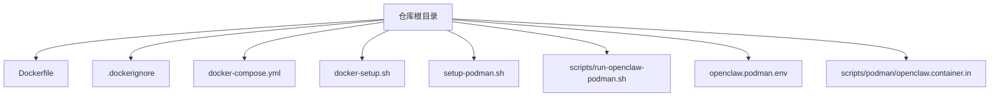
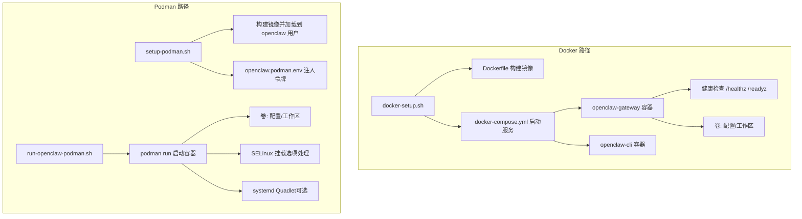
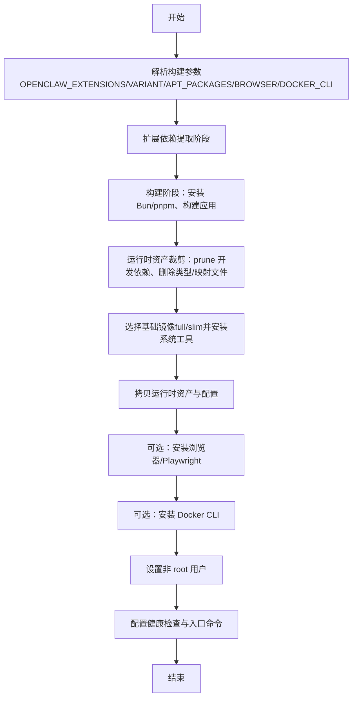
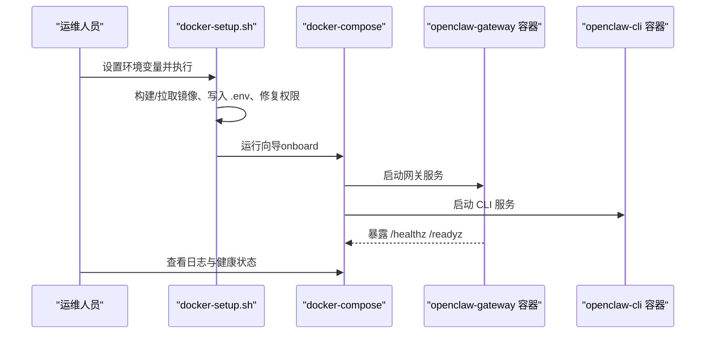
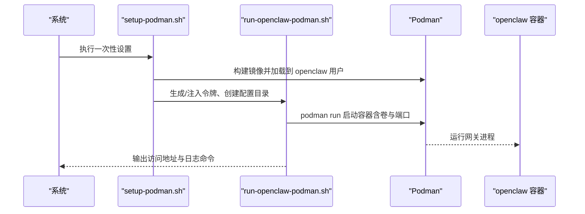
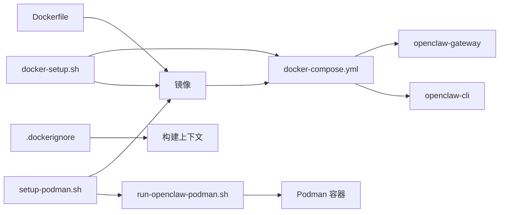

# 容器化部署

<cite>
**本文引用的文件**
- [Dockerfile](file://Dockerfile)
- [.dockerignore](file://.dockerignore)
- [docker-compose.yml](file://docker-compose.yml)
- [docker-setup.sh](file://docker-setup.sh)
- [setup-podman.sh](file://setup-podman.sh)
- [scripts/run-openclaw-podman.sh](file://scripts/run-openclaw-podman.sh)
- [openclaw.podman.env](file://openclaw.podman.env)
- [scripts/podman/openclaw.container.in](file://scripts/podman/openclaw.container.in)
</cite>

## 目录
1. [简介](#简介)
2. [项目结构](#项目结构)
3. [核心组件](#核心组件)
4. [架构总览](#架构总览)
5. [详细组件分析](#详细组件分析)
6. [依赖关系分析](#依赖关系分析)
7. [性能考量](#性能考量)
8. [故障排查指南](#故障排查指南)
9. [结论](#结论)
10. [附录](#附录)

## 简介
本指南面向在生产与开发环境中部署 OpenClaw 的工程团队，系统讲解基于 Docker 与 Podman 的容器化方案，覆盖镜像构建、容器配置、卷挂载、网络拓扑、无根容器运行、安全策略与资源限制、健康检查与日志管理等主题。文档同时提供 docker-compose 示例、环境变量清单与最佳实践，帮助您快速、安全地完成部署。

## 项目结构
OpenClaw 提供了完整的容器化支持：多阶段 Dockerfile、docker-compose 编排、以及针对 Podman 的一键安装与运行脚本。关键文件如下：
- 镜像构建：Dockerfile（含多阶段构建、可选浏览器与 Docker CLI 安装参数）
- 构建上下文排除：.dockerignore（避免无关文件进入镜像）
- 编排与服务：docker-compose.yml（网关与 CLI 服务定义、健康检查、端口映射）
- Docker 部署脚本：docker-setup.sh（自动构建/拉取镜像、写入 .env、初始化配置、可选沙箱）
- Podman 部署脚本：setup-podman.sh（无根用户创建、镜像构建与加载、systemd Quadlet 安装）
- Podman 运行脚本：scripts/run-openclaw-podman.sh（生成/注入令牌、准备配置目录、启动容器）
- Podman 环境模板：openclaw.podman.env（令牌、端口、绑定模式等默认值）
- Quadlet 模板：scripts/podman/openclaw.container.in（systemd 用户服务模板）

**图表来源**
- [Dockerfile](file://Dockerfile)
- [.dockerignore](file://.dockerignore)
- [docker-compose.yml](file://docker-compose.yml)
- [docker-setup.sh](file://docker-setup.sh)
- [setup-podman.sh](file://setup-podman.sh)
- [scripts/run-openclaw-podman.sh](file://scripts/run-openclaw-podman.sh)
- [openclaw.podman.env](file://openclaw.podman.env)
- [scripts/podman/openclaw.container.in](file://scripts/podman/openclaw.container.in)

**章节来源**
- [Dockerfile](file://Dockerfile)
- [.dockerignore](file://.dockerignore)
- [docker-compose.yml](file://docker-compose.yml)
- [docker-setup.sh](file://docker-setup.sh)
- [setup-podman.sh](file://setup-podman.sh)
- [scripts/run-openclaw-podman.sh](file://scripts/run-openclaw-podman.sh)
- [openclaw.podman.env](file://openclaw.podman.env)
- [scripts/podman/openclaw.container.in](file://scripts/podman/openclaw.container.in)

## 核心组件
- Docker 镜像构建
  - 多阶段构建：分离扩展依赖解析、构建与运行时层，最终仅包含运行所需文件与最小系统工具集。
  - 可选参数：OPENCLAW_VARIANT（default/slim）、OPENCLAW_EXTENSIONS、OPENCLAW_DOCKER_APT_PACKAGES、OPENCLAW_INSTALL_BROWSER、OPENCLAW_INSTALL_DOCKER_CLI。
  - 运行时基础镜像固定 digest，确保可复现性；默认以非 root 用户运行。
- docker-compose 编排
  - 服务：openclaw-gateway（网关）、openclaw-cli（CLI 客户端）。
  - 健康检查：内置 /healthz 与 /readyz 探针，适合外部负载均衡与编排平台。
  - 卷：挂载配置与工作区目录，支持沙箱场景下的 Docker socket 挂载。
  - 端口：默认 18789（网关）、18790（桥接）。
- Docker 部署脚本 docker-setup.sh
  - 自动构建或拉取镜像、写入 .env、修复权限、引导向导、设置网关模式与绑定、可选启用沙箱（需 Docker CLI）。
- Podman 部署脚本
  - setup-podman.sh：创建无根用户、构建镜像并加载到目标用户存储、生成/注入令牌、可选安装 systemd Quadlet。
  - scripts/run-openclaw-podman.sh：准备配置与工作区、注入令牌、按需运行向导、启动容器、处理 SELinux 挂载选项。
- 环境与模板
  - openclaw.podman.env：定义令牌、端口、绑定模式与可选提供商密钥。
  - openclaw.container.in：systemd Quadlet 模板，声明镜像、卷、端口、环境与执行命令。

**章节来源**
- [Dockerfile](file://Dockerfile)
- [docker-compose.yml](file://docker-compose.yml)
- [docker-setup.sh](file://docker-setup.sh)
- [setup-podman.sh](file://setup-podman.sh)
- [scripts/run-openclaw-podman.sh](file://scripts/run-openclaw-podman.sh)
- [openclaw.podman.env](file://openclaw.podman.env)
- [scripts/podman/openclaw.container.in](file://scripts/podman/openclaw.container.in)

## 架构总览
下图展示 Docker 与 Podman 两种部署路径的总体交互：镜像构建、容器运行、卷挂载、健康检查与日志输出。

**图表来源**
- [docker-setup.sh](file://docker-setup.sh)
- [Dockerfile](file://Dockerfile)
- [docker-compose.yml](file://docker-compose.yml)
- [setup-podman.sh](file://setup-podman.sh)
- [scripts/run-openclaw-podman.sh](file://scripts/run-openclaw-podman.sh)
- [openclaw.podman.env](file://openclaw.podman.env)
- [scripts/podman/openclaw.container.in](file://scripts/podman/openclaw.container.in)

## 详细组件分析

### Docker 镜像构建流程
- 多阶段构建要点
  - 扩展依赖提取：仅复制所需扩展的 package.json，避免无关源码变更导致缓存失效。
  - 构建阶段：安装 Bun、使用 pnpm 安装依赖与构建产物，剔除开发依赖与映射文件。
  - 运行时阶段：选择 full 或 slim 基础镜像，安装必要系统工具，拷贝运行时资产，设置非 root 用户。
- 可选增强
  - 浏览器自动化：通过参数预装 Chromium 与 Playwright，减少容器启动时的下载时间。
  - Docker CLI：在沙箱场景中需要在容器内调用 docker 命令，可通过参数安装 Docker CLI。
- 安全与合规
  - 固定基础镜像 digest，确保可复现性。
  - 默认以非 root 用户运行，降低逃逸风险。

**图表来源**
- [Dockerfile](file://Dockerfile)

**章节来源**
- [Dockerfile](file://Dockerfile)

### docker-compose 编排与服务
- 服务定义
  - openclaw-gateway：暴露网关与桥接端口，内置健康检查，支持通过环境变量控制绑定模式与认证。
  - openclaw-cli：与网关共享网络，用于执行 CLI 命令与向导。
- 卷与挂载
  - 配置目录与工作区目录分别挂载至容器内的用户主目录，便于持久化与备份。
  - 沙箱场景可挂载 Docker socket，并通过 group_add 将容器加入宿主 docker 组。
- 环境变量
  - 关键变量：OPENCLAW_GATEWAY_TOKEN、OPENCLAW_GATEWAY_BIND、OPENCLAW_TZ、OPENCLAW_CONFIG_DIR、OPENCLAW_WORKSPACE_DIR 等。
- 健康检查
  - 内置 /healthz 与 /readyz 探针，适合外部负载均衡与编排平台。

**图表来源**
- [docker-setup.sh](file://docker-setup.sh)
- [docker-compose.yml](file://docker-compose.yml)

**章节来源**
- [docker-compose.yml](file://docker-compose.yml)
- [docker-setup.sh](file://docker-setup.sh)

### Podman 无根部署与 systemd 集成
- 一次性设置
  - 创建无根用户、构建镜像并加载到该用户的 Podman 存储、生成/注入令牌、初始化最小配置。
  - 可选安装 systemd Quadlet，使容器作为用户服务随系统启动。
- 运行时
  - 准备配置与工作区目录、注入令牌、按需运行向导、启动容器。
  - 自动处理 SELinux 强制/宽容模式下的挂载标签（:Z）。
- 令牌与配置
  - 支持从 openclaw.podman.env 读取或自动生成 OPENCLAW_GATEWAY_TOKEN。
  - 初始化最小 openclaw.json（gateway.mode=local），后续可通过向导完善。

**图表来源**
- [setup-podman.sh](file://setup-podman.sh)
- [scripts/run-openclaw-podman.sh](file://scripts/run-openclaw-podman.sh)
- [openclaw.podman.env](file://openclaw.podman.env)
- [scripts/podman/openclaw.container.in](file://scripts/podman/openclaw.container.in)

**章节来源**
- [setup-podman.sh](file://setup-podman.sh)
- [scripts/run-openclaw-podman.sh](file://scripts/run-openclaw-podman.sh)
- [openclaw.podman.env](file://openclaw.podman.env)
- [scripts/podman/openclaw.container.in](file://scripts/podman/openclaw.container.in)

### 环境变量与网络拓扑
- 环境变量清单（Docker）
  - OPENCLAW_GATEWAY_TOKEN：网关访问令牌（建议随机生成）。
  - OPENCLAW_GATEWAY_BIND：绑定模式（默认 lan，可设为 loopback）。
  - OPENCLAW_TZ：容器时区。
  - OPENCLAW_CONFIG_DIR、OPENCLAW_WORKSPACE_DIR：主机挂载路径。
  - OPENCLAW_DOCKER_APT_PACKAGES、OPENCLAW_EXTENSIONS：构建期可选增强。
  - OPENCLAW_INSTALL_BROWSER、OPENCLAW_INSTALL_DOCKER_CLI：运行期可选增强。
  - OPENCLAW_SANDBOX、OPENCLAW_DOCKER_SOCKET：沙箱相关。
- 网络拓扑
  - 默认端口：18789（网关）、18790（桥接）。
  - 绑定模式：loopback（仅 127.0.0.1）或 lan（0.0.0.0）。若使用桥接网络映射端口，loopback 将导致宿主无法访问，需改为 lan 并配置认证。
  - 沙箱：如需 agents.defaults.sandbox，需在镜像中安装 Docker CLI，并挂载 /var/run/docker.sock。

**章节来源**
- [docker-compose.yml](file://docker-compose.yml)
- [docker-setup.sh](file://docker-setup.sh)
- [Dockerfile](file://Dockerfile)

### 健康检查与日志管理
- 健康检查
  - Dockerfile 中内置 /healthz 与 /readyz 探针，适合容器编排平台与反向代理。
  - docker-compose.yml 中也定义了相同的探针测试逻辑，便于一致性验证。
- 日志管理
  - Docker：使用 docker compose logs -f 查看实时日志。
  - Podman：使用 podman logs -f 容器名查看日志。
  - 建议结合系统日志收集（如 journald、Fluent Bit、Promtail）统一采集与归档。

**章节来源**
- [Dockerfile](file://Dockerfile)
- [docker-compose.yml](file://docker-compose.yml)
- [scripts/run-openclaw-podman.sh](file://scripts/run-openclaw-podman.sh)

## 依赖关系分析
- 构建期依赖
  - Dockerfile 依赖：Node.js 基础镜像、Bun、pnpm、扩展包的 package.json。
  - .dockerignore 控制构建上下文大小，避免不必要的文件进入镜像。
- 运行期依赖
  - docker-compose.yml 依赖：镜像名称、卷路径、环境变量、端口映射。
  - docker-setup.sh 依赖：docker 与 docker compose、宿主磁盘权限、可选 OpenSSL/Python3。
  - Podman 路径依赖：podman、sudo（用户创建与镜像加载）、可选 systemd 与 Quadlet。
- 沙箱依赖
  - 需要在镜像中安装 Docker CLI，并在运行时挂载 /var/run/docker.sock，且容器需加入宿主 docker 组。

**图表来源**
- [Dockerfile](file://Dockerfile)
- [.dockerignore](file://.dockerignore)
- [docker-compose.yml](file://docker-compose.yml)
- [docker-setup.sh](file://docker-setup.sh)
- [setup-podman.sh](file://setup-podman.sh)
- [scripts/run-openclaw-podman.sh](file://scripts/run-openclaw-podman.sh)

**章节来源**
- [Dockerfile](file://Dockerfile)
- [.dockerignore](file://.dockerignore)
- [docker-compose.yml](file://docker-compose.yml)
- [docker-setup.sh](file://docker-setup.sh)
- [setup-podman.sh](file://setup-podman.sh)
- [scripts/run-openclaw-podman.sh](file://scripts/run-openclaw-podman.sh)

## 性能考量
- 构建性能
  - 使用多阶段构建与缓存目录（pnpm store、apt cache）减少重复安装。
  - 在小内存主机上限制 Node 内存使用，避免构建阶段被 OOM 杀死。
- 运行性能
  - 如需频繁启动浏览器自动化，建议在镜像中预装浏览器与 Playwright，减少容器启动时的下载。
  - 对于沙箱场景，预装 Docker CLI 可避免每次执行时的额外安装开销。
- 资源限制
  - 在 docker-compose.yml 中可添加 deploy.resources.limits 配置对 CPU/内存进行限制。
  - Podman 场景可通过 systemd 服务单元或 cgroups 限制资源。

[本节为通用指导，不直接分析具体文件]

## 故障排查指南
- 端口与绑定问题
  - 若使用桥接网络映射端口但绑定为 loopback，宿主将无法访问。请改为 lan 并设置认证令牌。
- 权限与挂载
  - 宿主目录由 root 创建，容器内 node 用户可能无写权限。docker-setup.sh 会以 root 容器短暂运行并修复权限。
  - Podman 在 SELinux Enforcing/Permissive 下自动追加 :Z 选项以允许容器访问挂载目录。
- 沙箱未生效
  - 确认镜像已安装 Docker CLI，且运行时挂载了 /var/run/docker.sock 并加入 docker 组。
  - docker-setup.sh 会在前置条件满足后才应用沙箱配置与 socket 挂载。
- 健康检查失败
  - 检查 /healthz 与 /readyz 是否可达，确认绑定模式与认证配置正确。
  - 使用 docker compose/exec 或 podman logs -f 查看容器日志定位问题。

**章节来源**
- [docker-setup.sh](file://docker-setup.sh)
- [scripts/run-openclaw-podman.sh](file://scripts/run-openclaw-podman.sh)
- [Dockerfile](file://Dockerfile)
- [docker-compose.yml](file://docker-compose.yml)

## 结论
OpenClaw 提供了完善的容器化基础设施：多阶段 Dockerfile、docker-compose 编排、以及针对 Podman 的无根部署与 systemd 集成。通过合理的环境变量、卷挂载与健康检查配置，可在开发与生产环境中实现安全、稳定与可观测的部署。建议优先采用 docker-compose 进行本地开发，生产环境可结合 Podman 与 systemd Quadlet 实现用户态守护与自动重启。

[本节为总结性内容，不直接分析具体文件]

## 附录

### docker-compose 示例与环境变量
- 示例服务定义与端口映射
  - openclaw-gateway：映射 18789/18790，内置健康检查。
  - openclaw-cli：与网关共享网络，用于执行 CLI 命令。
- 关键环境变量
  - OPENCLAW_GATEWAY_TOKEN、OPENCLAW_GATEWAY_BIND、OPENCLAW_TZ、OPENCLAW_CONFIG_DIR、OPENCLAW_WORKSPACE_DIR。
  - OPENCLAW_DOCKER_APT_PACKAGES、OPENCLAW_EXTENSIONS、OPENCLAW_INSTALL_BROWSER、OPENCLAW_INSTALL_DOCKER_CLI。
  - OPENCLAW_SANDBOX、OPENCLAW_DOCKER_SOCKET。

**章节来源**
- [docker-compose.yml](file://docker-compose.yml)
- [docker-setup.sh](file://docker-setup.sh)

### Podman 环境模板与 Quadlet
- openclaw.podman.env
  - 定义 OPENCLAW_GATEWAY_TOKEN、端口映射与绑定模式等默认值。
- systemd Quadlet（可选）
  - 通过 setup-podman.sh 安装 openclaw.container.in，生成用户级服务，实现开机自启与自动重启。

**章节来源**
- [openclaw.podman.env](file://openclaw.podman.env)
- [scripts/podman/openclaw.container.in](file://scripts/podman/openclaw.container.in)
- [setup-podman.sh](file://setup-podman.sh)