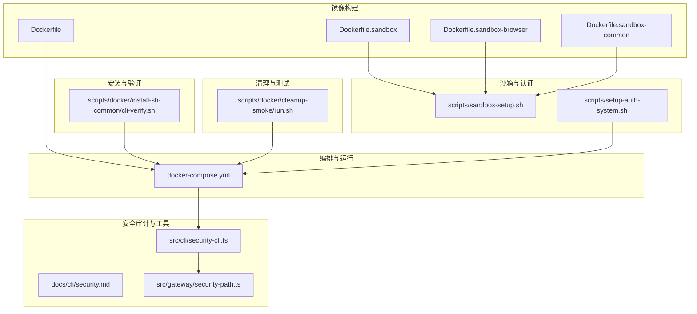
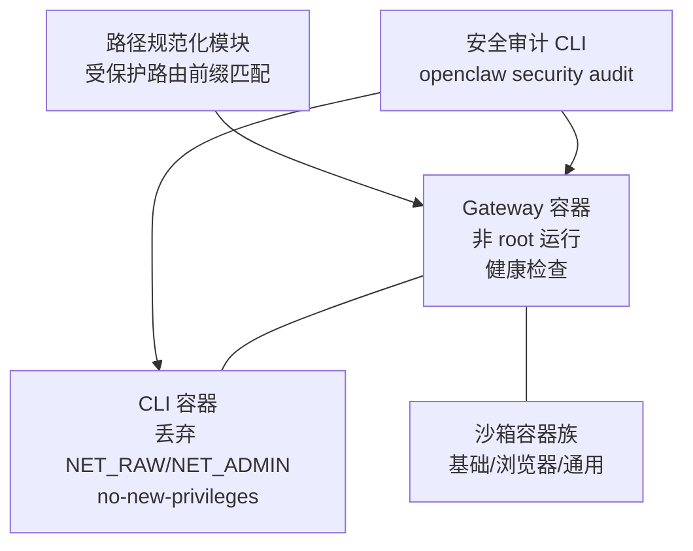
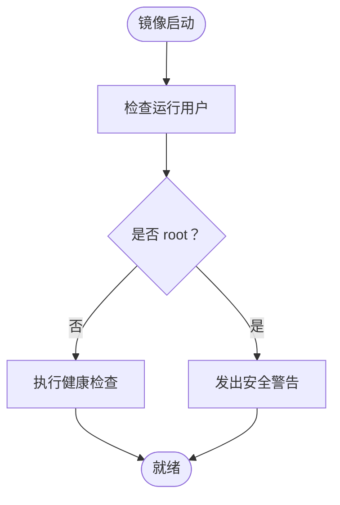
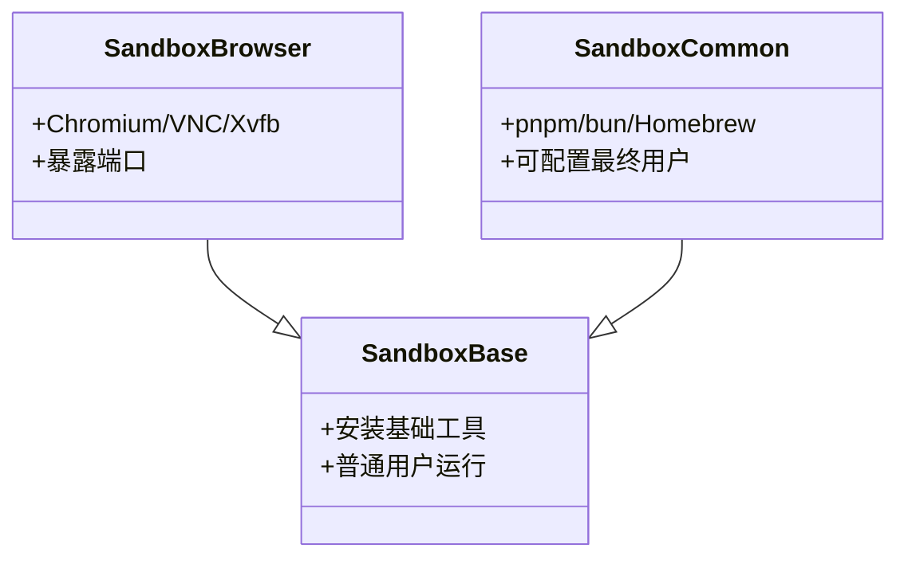
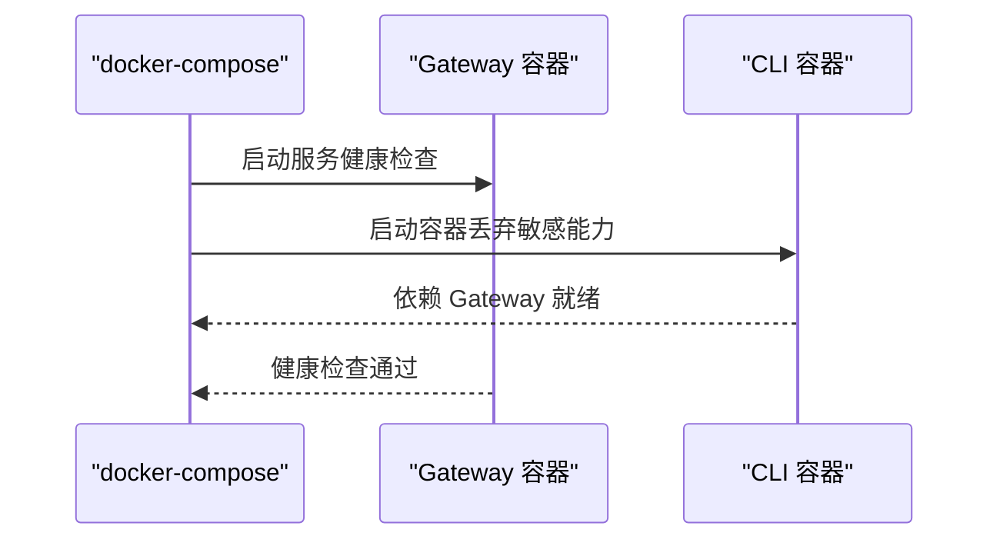
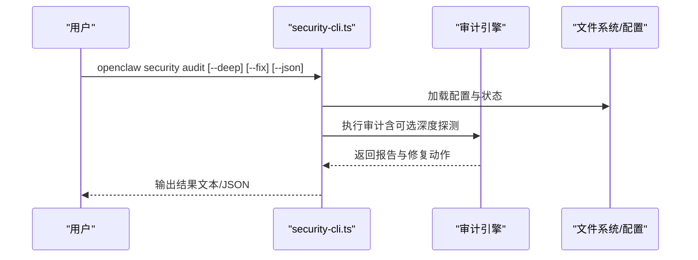
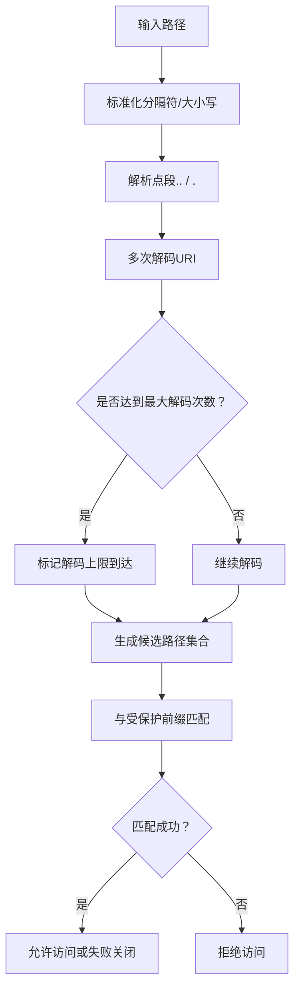
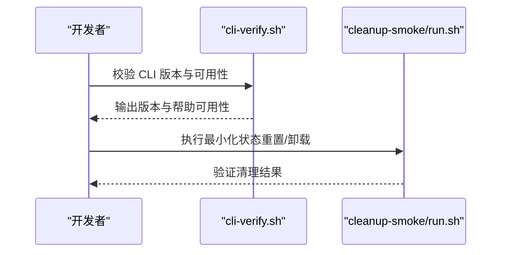
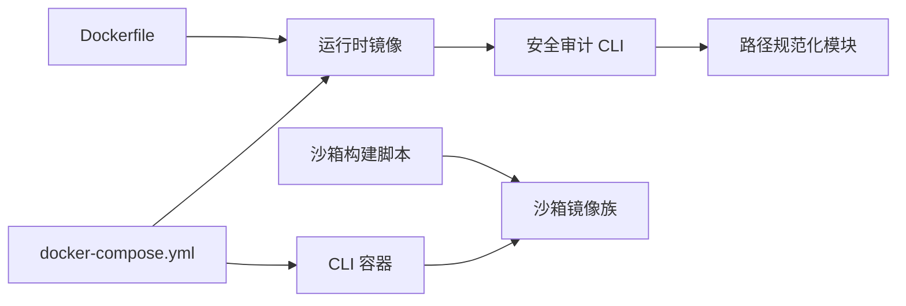

# 容器安全配置

<cite>
**本文引用的文件**
- [Dockerfile](file://Dockerfile)
- [Dockerfile.sandbox](file://Dockerfile.sandbox)
- [Dockerfile.sandbox-browser](file://Dockerfile.sandbox-browser)
- [Dockerfile.sandbox-common](file://Dockerfile.sandbox-common)
- [docker-compose.yml](file://docker-compose.yml)
- [scripts/sandbox-setup.sh](file://scripts/sandbox-setup.sh)
- [scripts/docker/cleanup-smoke/run.sh](file://scripts/docker/cleanup-smoke/run.sh)
- [scripts/docker/install-sh-common/cli-verify.sh](file://scripts/docker/install-sh-common/cli-verify.sh)
- [docs/cli/security.md](file://docs/cli/security.md)
- [src/cli/security-cli.ts](file://src/cli/security-cli.ts)
- [src/gateway/security-path.ts](file://src/gateway/security-path.ts)
- [scripts/setup-auth-system.sh](file://scripts/setup-auth-system.sh)
</cite>

## 目录
1. [简介](#简介)
2. [项目结构](#项目结构)
3. [核心组件](#核心组件)
4. [架构总览](#架构总览)
5. [详细组件分析](#详细组件分析)
6. [依赖关系分析](#依赖关系分析)
7. [性能考量](#性能考量)
8. [故障排查指南](#故障排查指南)
9. [结论](#结论)
10. [附录](#附录)

## 简介
本指南面向在容器环境中部署与运行 OpenClaw 的工程团队，聚焦容器安全配置与加固实践。内容覆盖用户权限管理、文件系统权限、网络隔离、容器间通信安全、数据保护与访问控制，并结合仓库中已有的 Dockerfile、docker-compose 配置、安全审计 CLI 与路径规范化模块，给出可落地的最佳实践与生产级安全审计清单。

## 项目结构
围绕容器安全的关键文件与目录如下：
- 容器镜像构建：Dockerfile 及多份沙箱镜像 Dockerfile（基础、浏览器、通用）
- 编排与运行：docker-compose.yml
- 安全审计与工具：docs/cli/security.md、src/cli/security-cli.ts、src/gateway/security-path.ts
- 安装与验证：scripts/docker/install-sh-common/cli-verify.sh
- 清理与测试：scripts/docker/cleanup-smoke/run.sh
- 沙箱构建脚本：scripts/sandbox-setup.sh
- 认证系统设置：scripts/setup-auth-system.sh

**图表来源**
- [Dockerfile:1-250](file://Dockerfile#L1-L250)
- [Dockerfile.sandbox:1-25](file://Dockerfile.sandbox#L1-L25)
- [Dockerfile.sandbox-browser:1-36](file://Dockerfile.sandbox-browser#L1-L36)
- [Dockerfile.sandbox-common:1-49](file://Dockerfile.sandbox-common#L1-L49)
- [docker-compose.yml:1-79](file://docker-compose.yml#L1-L79)
- [docs/cli/security.md:1-80](file://docs/cli/security.md#L1-L80)
- [src/cli/security-cli.ts:1-200](file://src/cli/security-cli.ts#L1-L200)
- [src/gateway/security-path.ts:1-162](file://src/gateway/security-path.ts#L1-L162)
- [scripts/docker/install-sh-common/cli-verify.sh:1-54](file://scripts/docker/install-sh-common/cli-verify.sh#L1-L54)
- [scripts/docker/cleanup-smoke/run.sh:1-36](file://scripts/docker/cleanup-smoke/run.sh#L1-L36)
- [scripts/sandbox-setup.sh:1-8](file://scripts/sandbox-setup.sh#L1-L8)
- [scripts/setup-auth-system.sh:1-120](file://scripts/setup-auth-system.sh#L1-L120)

**章节来源**
- [Dockerfile:1-250](file://Dockerfile#L1-L250)
- [docker-compose.yml:1-79](file://docker-compose.yml#L1-L79)

## 核心组件
- 运行时镜像与非特权执行
  - 使用非 root 用户运行，降低逃逸风险；镜像基于 Debian Bookworm，按需安装系统工具。
- 沙箱镜像族
  - 基础沙箱镜像、带浏览器的沙箱镜像、通用沙箱镜像（集成包管理器与工具链），统一以普通用户运行。
- 编排与能力限制
  - compose 中对 CLI 容器启用 no-new-privileges 并丢弃敏感 Linux 能力，限制网络能力。
- 安全审计 CLI
  - 提供本地配置与状态审计、可选修复、JSON 输出，便于 CI/CD 集成。
- 路径规范化与访问控制
  - 对受保护路由前缀进行路径归一化与匹配，阻断异常编码与越权访问尝试。
- 安装与验证脚本
  - CLI 版本校验与可用性检查，确保运行一致性。
- 清理与测试流程
  - 提供最小化状态重置与卸载流程，保障测试与回归环境干净。

**章节来源**
- [Dockerfile:230-233](file://Dockerfile#L230-L233)
- [Dockerfile.sandbox:20-21](file://Dockerfile.sandbox#L20-L21)
- [Dockerfile.sandbox-browser:29-30](file://Dockerfile.sandbox-browser#L29-L30)
- [Dockerfile.sandbox-common:47-49](file://Dockerfile.sandbox-common#L47-L49)
- [docker-compose.yml:55-59](file://docker-compose.yml#L55-L59)
- [docs/cli/security.md:17-80](file://docs/cli/security.md#L17-L80)
- [src/cli/security-cli.ts:34-199](file://src/cli/security-cli.ts#L34-L199)
- [src/gateway/security-path.ts:106-162](file://src/gateway/security-path.ts#L106-L162)
- [scripts/docker/install-sh-common/cli-verify.sh:7-53](file://scripts/docker/install-sh-common/cli-verify.sh#L7-L53)
- [scripts/docker/cleanup-smoke/run.sh:19-35](file://scripts/docker/cleanup-smoke/run.sh#L19-L35)

## 架构总览
下图展示容器运行时、编排层、安全审计与沙箱的关系，以及关键安全加固点。

**图表来源**
- [docker-compose.yml:24-38](file://docker-compose.yml#L24-L38)
- [docker-compose.yml:55-59](file://docker-compose.yml#L55-L59)
- [Dockerfile:247-248](file://Dockerfile#L247-L248)
- [src/cli/security-cli.ts:54-86](file://src/cli/security-cli.ts#L54-L86)
- [src/gateway/security-path.ts:157-161](file://src/gateway/security-path.ts#L157-L161)

## 详细组件分析

### 组件一：运行时镜像与非特权执行
- 关键点
  - 明确以非 root 用户运行，减少权限滥用与逃逸风险。
  - 健康检查通过本地探针访问健康端点，便于编排层自动恢复。
  - 支持可选安装浏览器与 Docker CLI，满足特定场景需求但需谨慎评估攻击面。
- 最佳实践
  - 默认不安装 Docker CLI；仅在需要沙箱容器管理时按需开启。
  - 严格限制 apt 包安装范围，避免引入不必要的高危软件包。
  - 使用只读根文件系统与最小权限挂载卷。

**图表来源**
- [Dockerfile:230-233](file://Dockerfile#L230-L233)
- [Dockerfile:247-248](file://Dockerfile#L247-L248)

**章节来源**
- [Dockerfile:230-233](file://Dockerfile#L230-L233)
- [Dockerfile:247-248](file://Dockerfile#L247-L248)

### 组件二：沙箱镜像族与隔离边界
- 组件构成
  - 基础沙箱镜像：提供最小工具集与普通用户。
  - 浏览器沙箱镜像：内置 Chromium、VNC、Xvfb 等，暴露必要端口。
  - 通用沙箱镜像：集成 pnpm、bun、Homebrew 等开发工具链。
- 最佳实践
  - 优先使用通用沙箱镜像作为默认隔离基线。
  - 仅在需要浏览器自动化时启用浏览器沙箱镜像。
  - 通过独立镜像与网络命名空间实现进程级隔离。

**图表来源**
- [Dockerfile.sandbox:20-21](file://Dockerfile.sandbox#L20-L21)
- [Dockerfile.sandbox-browser:11-25](file://Dockerfile.sandbox-browser#L11-L25)
- [Dockerfile.sandbox-common:10-45](file://Dockerfile.sandbox-common#L10-L45)

**章节来源**
- [Dockerfile.sandbox:1-25](file://Dockerfile.sandbox#L1-L25)
- [Dockerfile.sandbox-browser:1-36](file://Dockerfile.sandbox-browser#L1-L36)
- [Dockerfile.sandbox-common:1-49](file://Dockerfile.sandbox-common#L1-L49)
- [scripts/sandbox-setup.sh:1-8](file://scripts/sandbox-setup.sh#L1-L8)

### 组件三：编排与能力限制
- 关键点
  - CLI 容器丢弃 NET_RAW、NET_ADMIN 能力，启用 no-new-privileges。
  - Gateway 服务暴露健康检查端点，支持外部探测。
  - 可选挂载 Docker Socket 实现沙箱容器管理，需配合组 ID 与权限策略。
- 最佳实践
  - 生产环境建议使用主机网络或严格入站访问控制，避免桥接网络导致回环绑定不可达。
  - 如启用 Docker Socket 挂载，务必设置正确的宿主 docker 组 GID，并限制容器权限。

**图表来源**
- [docker-compose.yml:24-38](file://docker-compose.yml#L24-L38)
- [docker-compose.yml:55-59](file://docker-compose.yml#L55-L59)

**章节来源**
- [docker-compose.yml:1-79](file://docker-compose.yml#L1-L79)

### 组件四：安全审计 CLI 与修复
- 功能概览
  - 支持本地审计、深度探测、修复建议、JSON 输出。
  - 针对共享用户、Webhook 入口、沙箱配置、通道白名单等场景给出告警与修复指引。
- 最佳实践
  - 在 CI 中集成 JSON 输出，筛选严重问题并阻断发布。
  - 使用 --fix 应用可逆且确定性的修复（如收紧文件权限、切换群组策略）。

**图表来源**
- [src/cli/security-cli.ts:54-86](file://src/cli/security-cli.ts#L54-L86)
- [docs/cli/security.md:17-80](file://docs/cli/security.md#L17-L80)

**章节来源**
- [docs/cli/security.md:1-80](file://docs/cli/security.md#L1-L80)
- [src/cli/security-cli.ts:1-200](file://src/cli/security-cli.ts#L1-L200)

### 组件五：路径规范化与访问控制
- 功能概览
  - 对受保护路由前缀（如通道相关 API）进行路径归一化、解码与候选集合生成。
  - 防止异常编码与越界访问，必要时采用“失败关闭”策略。
- 最佳实践
  - 将受保护路由前缀集中维护，定期审查与更新。
  - 结合网关鉴权与入站访问控制，形成纵深防御。

**图表来源**
- [src/gateway/security-path.ts:45-95](file://src/gateway/security-path.ts#L45-L95)
- [src/gateway/security-path.ts:137-155](file://src/gateway/security-path.ts#L137-L155)

**章节来源**
- [src/gateway/security-path.ts:1-162](file://src/gateway/security-path.ts#L1-L162)

### 组件六：安装与验证、清理与测试
- 安装与验证
  - CLI 版本检测与可用性检查，确保运行一致性。
- 清理与测试
  - 提供最小化状态重置与卸载流程，便于回归测试与环境复原。

**图表来源**
- [scripts/docker/install-sh-common/cli-verify.sh:7-53](file://scripts/docker/install-sh-common/cli-verify.sh#L7-L53)
- [scripts/docker/cleanup-smoke/run.sh:19-35](file://scripts/docker/cleanup-smoke/run.sh#L19-L35)

**章节来源**
- [scripts/docker/install-sh-common/cli-verify.sh:1-54](file://scripts/docker/install-sh-common/cli-verify.sh#L1-L54)
- [scripts/docker/cleanup-smoke/run.sh:1-36](file://scripts/docker/cleanup-smoke/run.sh#L1-L36)

### 组件七：认证系统设置
- 功能概览
  - 提供长期令牌设置、认证监控（定时任务）、通知渠道配置（ntfy、OpenClaw 消息）、Termux 小部件快速认证。
- 最佳实践
  - 使用 systemd 用户级定时器定期检查认证状态。
  - 为通知渠道配置稳定主题，避免误报与漏报。

**章节来源**
- [scripts/setup-auth-system.sh:1-120](file://scripts/setup-auth-system.sh#L1-L120)

## 依赖关系分析
- 容器镜像与编排
  - 运行时镜像由 Dockerfile 构建，compose 用于编排 Gateway 与 CLI 容器。
- 安全审计与运行时
  - 安全审计 CLI 依赖运行时配置加载与网关探测能力，路径规范化模块为网关路由安全提供支撑。
- 沙箱生态
  - 沙箱镜像族通过统一构建脚本生成，CLI 容器可选择挂载 Docker Socket 以管理沙箱容器。

**图表来源**
- [Dockerfile:113-250](file://Dockerfile#L113-L250)
- [docker-compose.yml:1-79](file://docker-compose.yml#L1-L79)
- [src/cli/security-cli.ts:1-200](file://src/cli/security-cli.ts#L1-L200)
- [src/gateway/security-path.ts:1-162](file://src/gateway/security-path.ts#L1-L162)
- [scripts/sandbox-setup.sh:1-8](file://scripts/sandbox-setup.sh#L1-L8)

**章节来源**
- [Dockerfile:113-250](file://Dockerfile#L113-L250)
- [docker-compose.yml:1-79](file://docker-compose.yml#L1-L79)
- [src/cli/security-cli.ts:1-200](file://src/cli/security-cli.ts#L1-L200)
- [src/gateway/security-path.ts:1-162](file://src/gateway/security-path.ts#L1-L162)
- [scripts/sandbox-setup.sh:1-8](file://scripts/sandbox-setup.sh#L1-L8)

## 性能考量
- 镜像体积与启动时间
  - 使用 slim 基础镜像与多阶段构建，减少运行时体积；按需安装浏览器可显著增加体积与启动时间。
- 运行时资源
  - 通过限制内存与 CPU 资源，避免低内存主机上的 OOM 退出。
- 网络与健康检查
  - 健康检查间隔与超时应结合实际负载调整，避免误判。

[本节为通用指导，无需列出具体文件来源]

## 故障排查指南
- 健康检查失败
  - 检查容器日志与监听地址绑定；若使用桥接网络，确认回环绑定导致的可达性问题。
- 权限问题
  - 确认运行用户为非 root；检查挂载卷权限与所有者。
- 沙箱容器无法管理
  - 若启用 Docker Socket 挂载，核对宿主 docker 组 GID 与容器组加入配置。
- 安全审计告警
  - 使用 JSON 输出定位严重问题；结合 --fix 应用可逆修复；必要时手动调整配置。

**章节来源**
- [Dockerfile:247-248](file://Dockerfile#L247-L248)
- [docker-compose.yml:16-23](file://docker-compose.yml#L16-L23)
- [docs/cli/security.md:51-80](file://docs/cli/security.md#L51-L80)
- [src/cli/security-cli.ts:88-199](file://src/cli/security-cli.ts#L88-L199)

## 结论
通过非 root 运行、能力限制、最小权限挂载、沙箱隔离与安全审计 CLI 的组合，OpenClaw 在容器环境中实现了可操作的安全基线。建议在生产中进一步强化网络隔离、密钥轮换与合规审计流程，并将安全审计纳入持续集成流水线。

[本节为总结性内容，无需列出具体文件来源]

## 附录

### 容器安全最佳实践清单（生产级）
- 用户与权限
  - 默认以非 root 用户运行；避免使用特权模式与保留敏感能力。
- 文件系统
  - 仅挂载必要卷；限制写权限；对敏感文件（凭据、会话）设置最小权限。
- 网络隔离
  - 使用主机网络或严格入站访问控制；避免桥接网络导致的回环绑定不可达。
- 沙箱与容器间通信
  - 通过独立镜像与网络命名空间隔离；仅在必要时挂载 Docker Socket。
- 数据保护与访问控制
  - 启用路径规范化与受保护前缀匹配；结合鉴权与入站访问控制。
- 安全审计与合规
  - 在 CI 中集成安全审计 JSON 输出；对严重问题阻断发布；定期审查配置与策略。

[本节为通用指导，无需列出具体文件来源]