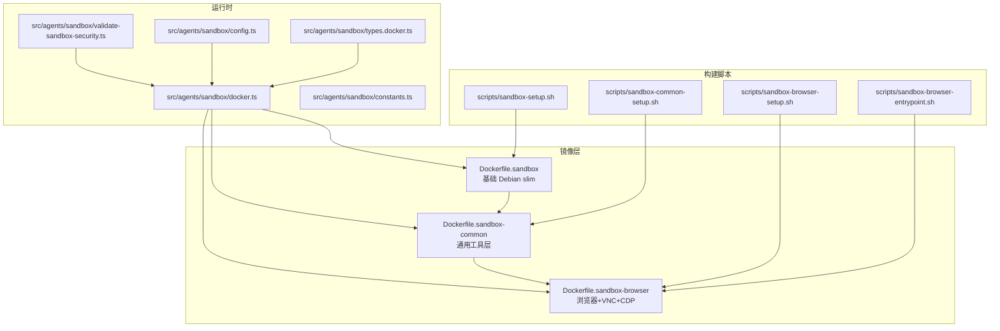
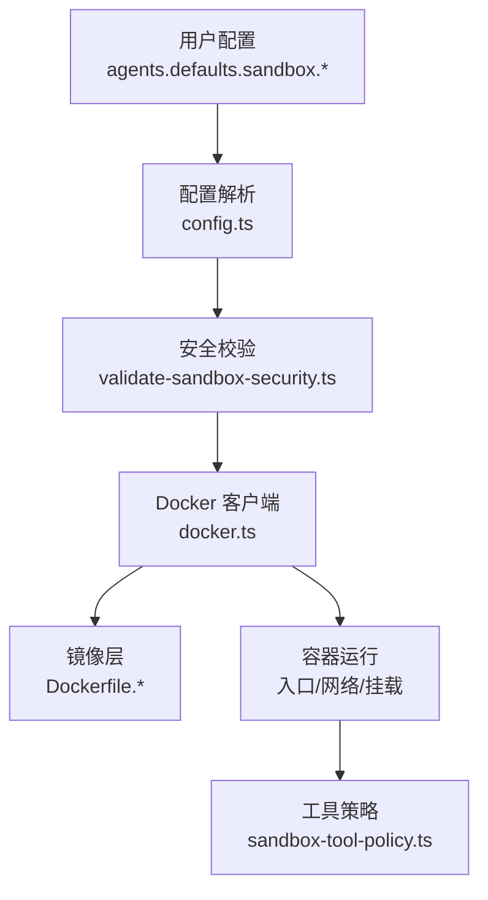
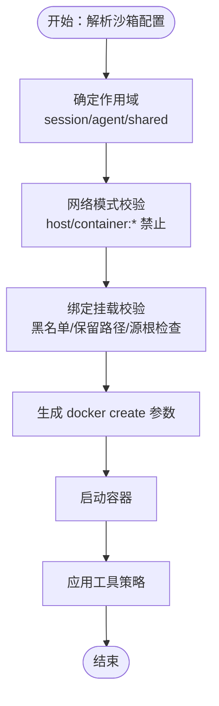
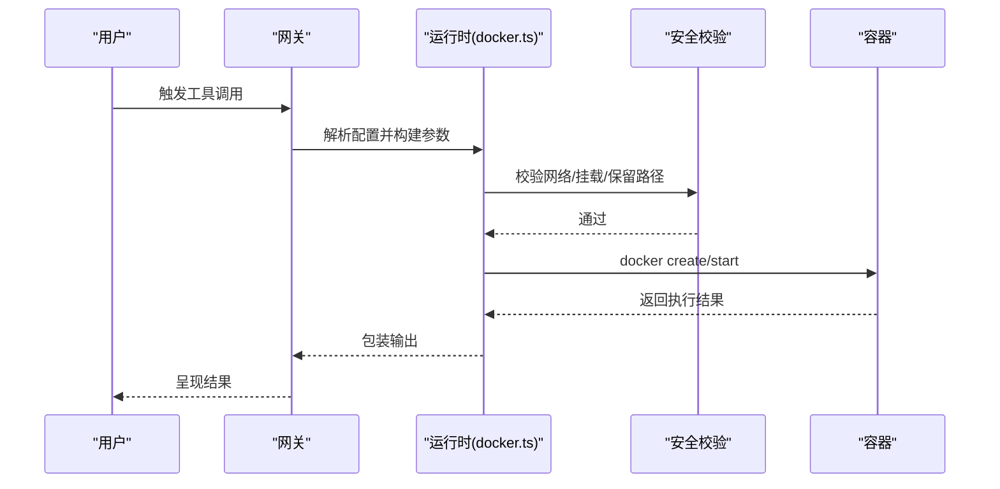
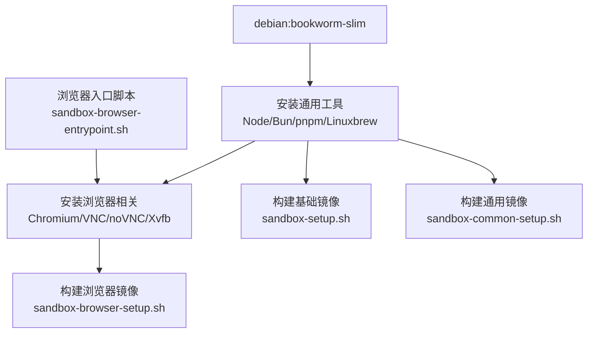
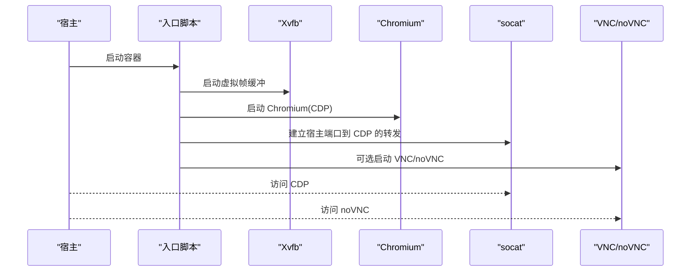
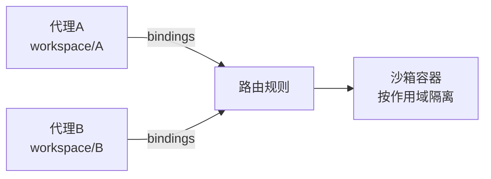
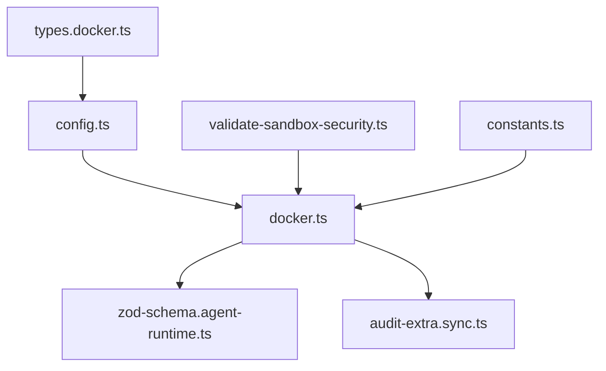

# 沙箱容器化

<cite>
**本文引用的文件**
- [Dockerfile.sandbox](file://Dockerfile.sandbox)
- [Dockerfile.sandbox-common](file://Dockerfile.sandbox-common)
- [Dockerfile.sandbox-browser](file://Dockerfile.sandbox-browser)
- [scripts/sandbox-setup.sh](file://scripts/sandbox-setup.sh)
- [scripts/sandbox-common-setup.sh](file://scripts/sandbox-common-setup.sh)
- [scripts/sandbox-browser-setup.sh](file://scripts/sandbox-browser-setup.sh)
- [scripts/sandbox-browser-entrypoint.sh](file://scripts/sandbox-browser-entrypoint.sh)
- [src/agents/sandbox/docker.ts](file://src/agents/sandbox/docker.ts)
- [src/agents/sandbox/validate-sandbox-security.ts](file://src/agents/sandbox/validate-sandbox-security.ts)
- [src/agents/sandbox/constants.ts](file://src/agents/sandbox/constants.ts)
- [src/agents/sandbox/config.ts](file://src/agents/sandbox/config.ts)
- [src/agents/sandbox/types.docker.ts](file://src/agents/sandbox/types.docker.ts)
- [src/agents/sandbox-tool-policy.ts](file://src/agents/sandbox-tool-policy.ts)
- [src/config/zod-schema.agent-runtime.ts](file://src/config/zod-schema.agent-runtime.ts)
- [src/config/config.sandbox-docker.test.ts](file://src/config/config.sandbox-docker.test.ts)
- [src/commands/doctor-sandbox.ts](file://src/commands/doctor-sandbox.ts)
- [src/security/audit-extra.sync.ts](file://src/security/audit-extra.sync.ts)
- [docs/gateway/sandboxing.md](file://docs/gateway/sandboxing.md)
- [docs/concepts/multi-agent.md](file://docs/concepts/multi-agent.md)
</cite>

## 目录
1. [简介](#简介)
2. [项目结构](#项目结构)
3. [核心组件](#核心组件)
4. [架构总览](#架构总览)
5. [详细组件分析](#详细组件分析)
6. [依赖关系分析](#依赖关系分析)
7. [性能考量](#性能考量)
8. [故障排查指南](#故障排查指南)
9. [结论](#结论)
10. [附录](#附录)

## 简介
本文件系统性阐述 OpenClaw 的沙箱容器化方案，覆盖代理沙箱的工作原理（容器隔离机制、工具执行沙箱、会话隔离策略）、沙箱镜像构建流程（基础镜像选择、工具安装与安全配置）、配置项详解（网络限制、资源配额与安全策略），并扩展到多代理沙箱、浏览器沙箱与自定义沙箱镜像构建。目标是帮助读者在理解代码实现的同时，安全、可控地部署与运维 OpenClaw 的沙箱能力。

## 项目结构
围绕沙箱的核心文件主要分布在以下位置：
- 镜像构建：根目录下的三份 Dockerfile（通用沙箱、浏览器沙箱、公共层）
- 构建脚本：scripts/ 下的 sandbox-* 脚本，负责镜像构建与环境准备
- 运行时实现：src/agents/sandbox/ 下的 Docker 客户端封装、安全校验、常量与配置解析
- 文档：docs/gateway/sandboxing.md 与 docs/concepts/multi-agent.md 提供高层说明与多代理场景

图表来源
- [Dockerfile.sandbox:1-25](file://Dockerfile.sandbox#L1-L25)
- [Dockerfile.sandbox-common:1-49](file://Dockerfile.sandbox-common#L1-L49)
- [Dockerfile.sandbox-browser:1-36](file://Dockerfile.sandbox-browser#L1-L36)
- [scripts/sandbox-setup.sh:1-8](file://scripts/sandbox-setup.sh#L1-L8)
- [scripts/sandbox-common-setup.sh:1-55](file://scripts/sandbox-common-setup.sh#L1-L55)
- [scripts/sandbox-browser-setup.sh:1-8](file://scripts/sandbox-browser-setup.sh#L1-L8)
- [scripts/sandbox-browser-entrypoint.sh:1-128](file://scripts/sandbox-browser-entrypoint.sh#L1-L128)
- [src/agents/sandbox/docker.ts:1-200](file://src/agents/sandbox/docker.ts#L1-L200)
- [src/agents/sandbox/validate-sandbox-security.ts:1-344](file://src/agents/sandbox/validate-sandbox-security.ts#L1-L344)
- [src/agents/sandbox/constants.ts:44-55](file://src/agents/sandbox/constants.ts#L44-L55)
- [src/agents/sandbox/config.ts:82-98](file://src/agents/sandbox/config.ts#L82-L98)
- [src/agents/sandbox/types.docker.ts:1-13](file://src/agents/sandbox/types.docker.ts#L1-L13)

章节来源
- [Dockerfile.sandbox:1-25](file://Dockerfile.sandbox#L1-L25)
- [Dockerfile.sandbox-common:1-49](file://Dockerfile.sandbox-common#L1-L49)
- [Dockerfile.sandbox-browser:1-36](file://Dockerfile.sandbox-browser#L1-L36)
- [scripts/sandbox-setup.sh:1-8](file://scripts/sandbox-setup.sh#L1-L8)
- [scripts/sandbox-common-setup.sh:1-55](file://scripts/sandbox-common-setup.sh#L1-L55)
- [scripts/sandbox-browser-setup.sh:1-8](file://scripts/sandbox-browser-setup.sh#L1-L8)
- [scripts/sandbox-browser-entrypoint.sh:1-128](file://scripts/sandbox-browser-entrypoint.sh#L1-L128)
- [src/agents/sandbox/docker.ts:1-200](file://src/agents/sandbox/docker.ts#L1-L200)

## 核心组件
- 镜像层
  - 基础镜像：基于 Debian bookworm-slim，最小化系统包，减少攻击面
  - 通用层：安装常用开发与系统工具（如 Node/npm/pnpm/bun、Go/Rust、Python 等），支持可选 Homebrew/Linuxbrew
  - 浏览器层：在通用层基础上增加 Chromium、VNC/WebSockify/noVNC、Xvfb 等，暴露 CDP/VNC/HTML5 VNC 端口
- 构建脚本
  - sandbox-setup.sh：构建基础镜像
  - sandbox-common-setup.sh：以基础镜像为父镜像，构建通用镜像；支持通过环境变量控制安装行为与最终用户
  - sandbox-browser-setup.sh：构建浏览器镜像
  - sandbox-browser-entrypoint.sh：浏览器容器入口，负责启动 Xvfb、Chromium、CDP 反向代理、VNC/noVNC
- 运行时实现
  - docker.ts：封装 docker CLI 调用、错误处理、超时与中止信号
  - validate-sandbox-security.ts：绑定挂载黑名单、保留路径、网络模式校验等安全策略
  - constants.ts：默认前缀、网络名、端口、注册表路径等常量
  - config.ts：合并全局与代理级沙箱配置（含 env/ulimits/bind 等）
  - types.docker.ts：约束 Docker 配置必填字段
  - sandbox-tool-policy.ts：工具策略允许/拒绝集合的合并逻辑

章节来源
- [Dockerfile.sandbox:1-25](file://Dockerfile.sandbox#L1-L25)
- [Dockerfile.sandbox-common:1-49](file://Dockerfile.sandbox-common#L1-L49)
- [Dockerfile.sandbox-browser:1-36](file://Dockerfile.sandbox-browser#L1-L36)
- [scripts/sandbox-setup.sh:1-8](file://scripts/sandbox-setup.sh#L1-L8)
- [scripts/sandbox-common-setup.sh:1-55](file://scripts/sandbox-common-setup.sh#L1-L55)
- [scripts/sandbox-browser-setup.sh:1-8](file://scripts/sandbox-browser-setup.sh#L1-L8)
- [scripts/sandbox-browser-entrypoint.sh:1-128](file://scripts/sandbox-browser-entrypoint.sh#L1-L128)
- [src/agents/sandbox/docker.ts:1-200](file://src/agents/sandbox/docker.ts#L1-L200)
- [src/agents/sandbox/validate-sandbox-security.ts:1-344](file://src/agents/sandbox/validate-sandbox-security.ts#L1-L344)
- [src/agents/sandbox/constants.ts:44-55](file://src/agents/sandbox/constants.ts#L44-L55)
- [src/agents/sandbox/config.ts:82-98](file://src/agents/sandbox/config.ts#L82-L98)
- [src/agents/sandbox/types.docker.ts:1-13](file://src/agents/sandbox/types.docker.ts#L1-L13)
- [src/agents/sandbox-tool-policy.ts:1-37](file://src/agents/sandbox-tool-policy.ts#L1-L37)

## 架构总览
OpenClaw 的沙箱由“镜像层 + 构建脚本 + 运行时实现 + 配置校验”构成。运行时通过 docker.ts 调用 Docker，validate-sandbox-security.ts 在创建容器前进行严格的安全校验，config.ts 合并配置，constants.ts 提供默认值与命名约定。

图表来源
- [src/agents/sandbox/config.ts:82-98](file://src/agents/sandbox/config.ts#L82-L98)
- [src/agents/sandbox/validate-sandbox-security.ts:1-344](file://src/agents/sandbox/validate-sandbox-security.ts#L1-L344)
- [src/agents/sandbox/docker.ts:1-200](file://src/agents/sandbox/docker.ts#L1-L200)
- [Dockerfile.sandbox:1-25](file://Dockerfile.sandbox#L1-L25)
- [Dockerfile.sandbox-common:1-49](file://Dockerfile.sandbox-common#L1-L49)
- [Dockerfile.sandbox-browser:1-36](file://Dockerfile.sandbox-browser#L1-L36)
- [src/agents/sandbox-tool-policy.ts:1-37](file://src/agents/sandbox-tool-policy.ts#L1-L37)

## 详细组件分析

### 组件一：容器隔离机制与会话隔离策略
- 隔离维度
  - 网络隔离：默认使用专用桥接网络或 none，避免 host 模式与容器命名空间 join
  - 文件系统隔离：只挂载明确允许的宿主机路径，禁止覆盖关键系统路径与 Docker 套接字
  - 进程与资源隔离：通过 ulimit、cap-drop、只读根文件系统等手段降低权限与资源占用
- 会话隔离策略
  - 支持三种作用域：session（每会话一个容器）、agent（每代理一个容器）、shared（所有会话共享一个容器）
  - 多代理场景下，每个代理拥有独立工作区与会话存储，避免跨代理会话与认证冲突

图表来源
- [src/agents/sandbox/validate-sandbox-security.ts:283-306](file://src/agents/sandbox/validate-sandbox-security.ts#L283-L306)
- [src/agents/sandbox/validate-sandbox-security.ts:234-281](file://src/agents/sandbox/validate-sandbox-security.ts#L234-L281)
- [src/agents/sandbox/config.ts:82-98](file://src/agents/sandbox/config.ts#L82-L98)
- [src/agents/sandbox/docker.ts:317-344](file://src/agents/sandbox/docker.ts#L317-L344)

章节来源
- [src/agents/sandbox/validate-sandbox-security.ts:1-344](file://src/agents/sandbox/validate-sandbox-security.ts#L1-L344)
- [src/agents/sandbox/config.ts:82-98](file://src/agents/sandbox/config.ts#L82-L98)
- [src/agents/sandbox/docker.ts:317-344](file://src/agents/sandbox/docker.ts#L317-L344)
- [docs/concepts/multi-agent.md:502-553](file://docs/concepts/multi-agent.md#L502-L553)

### 组件二：工具执行沙箱
- 执行边界
  - 工具执行（exec、read、write、edit、apply_patch、process 等）在沙箱内进行
  - elevated 工具在宿主上执行，绕过沙箱
- 配置要点
  - 模式：off/non-main/all
  - 作用域：session/agent/shared
  - 后端：docker/ssh/openshell
  - Docker 特定：镜像、网络、cap-drop、ulimit、binds、env 等

图表来源
- [src/agents/sandbox/docker.ts:182-200](file://src/agents/sandbox/docker.ts#L182-L200)
- [src/agents/sandbox/validate-sandbox-security.ts:283-306](file://src/agents/sandbox/validate-sandbox-security.ts#L283-L306)
- [src/agents/sandbox/config.ts:82-98](file://src/agents/sandbox/config.ts#L82-L98)

章节来源
- [src/agents/sandbox/docker.ts:1-200](file://src/agents/sandbox/docker.ts#L1-L200)
- [src/agents/sandbox/validate-sandbox-security.ts:1-344](file://src/agents/sandbox/validate-sandbox-security.ts#L1-L344)
- [src/agents/sandbox/config.ts:82-98](file://src/agents/sandbox/config.ts#L82-L98)
- [docs/gateway/sandboxing.md:39-67](file://docs/gateway/sandboxing.md#L39-L67)

### 组件三：沙箱镜像构建流程
- 基础镜像选择
  - Debian bookworm-slim，精简系统，降低漏洞面
- 工具安装与安全配置
  - 通用层：安装 Node/npm/pnpm/bun、Go/Rust、Python、Linuxbrew 等
  - 浏览器层：Chromium、Xvfb、VNC/noVNC、WebSockify、socat
  - 默认非 root 用户运行，最小权限原则
- 构建脚本
  - sandbox-setup.sh：构建基础镜像
  - sandbox-common-setup.sh：以基础镜像为父镜像，支持环境变量定制
  - sandbox-browser-setup.sh：构建浏览器镜像
  - sandbox-browser-entrypoint.sh：容器入口，启动 Xvfb/Chromium/CDP/VNC

图表来源
- [Dockerfile.sandbox:1-25](file://Dockerfile.sandbox#L1-L25)
- [Dockerfile.sandbox-common:1-49](file://Dockerfile.sandbox-common#L1-L49)
- [Dockerfile.sandbox-browser:1-36](file://Dockerfile.sandbox-browser#L1-L36)
- [scripts/sandbox-setup.sh:1-8](file://scripts/sandbox-setup.sh#L1-L8)
- [scripts/sandbox-common-setup.sh:1-55](file://scripts/sandbox-common-setup.sh#L1-L55)
- [scripts/sandbox-browser-setup.sh:1-8](file://scripts/sandbox-browser-setup.sh#L1-L8)
- [scripts/sandbox-browser-entrypoint.sh:1-128](file://scripts/sandbox-browser-entrypoint.sh#L1-L128)

章节来源
- [Dockerfile.sandbox:1-25](file://Dockerfile.sandbox#L1-L25)
- [Dockerfile.sandbox-common:1-49](file://Dockerfile.sandbox-common#L1-L49)
- [Dockerfile.sandbox-browser:1-36](file://Dockerfile.sandbox-browser#L1-L36)
- [scripts/sandbox-setup.sh:1-8](file://scripts/sandbox-setup.sh#L1-L8)
- [scripts/sandbox-common-setup.sh:1-55](file://scripts/sandbox-common-setup.sh#L1-L55)
- [scripts/sandbox-browser-setup.sh:1-8](file://scripts/sandbox-browser-setup.sh#L1-L8)
- [scripts/sandbox-browser-entrypoint.sh:1-128](file://scripts/sandbox-browser-entrypoint.sh#L1-L128)

### 组件四：浏览器沙箱
- 端口与协议
  - CDP：默认 9222（可通过环境变量调整）
  - VNC：默认 5900
  - HTML5 VNC（noVNC）：默认 6080
- 入口脚本功能
  - 启动 Xvfb，设置 DISPLAY
  - 启动 Chromium，开启远程调试端口
  - 使用 socat 将宿主端口转发到容器内 CDP
  - 可选启用 VNC/noVNC，支持密码保护
- 网络与访问控制
  - 默认使用专用网络，避免与宿主 bridge 暴露
  - 支持 CDP 来源 IP 白名单（cdpSourceRange）

图表来源
- [scripts/sandbox-browser-entrypoint.sh:1-128](file://scripts/sandbox-browser-entrypoint.sh#L1-L128)
- [Dockerfile.sandbox-browser:33-35](file://Dockerfile.sandbox-browser#L33-L35)
- [src/agents/sandbox/constants.ts:44-49](file://src/agents/sandbox/constants.ts#L44-L49)

章节来源
- [scripts/sandbox-browser-entrypoint.sh:1-128](file://scripts/sandbox-browser-entrypoint.sh#L1-L128)
- [Dockerfile.sandbox-browser:1-36](file://Dockerfile.sandbox-browser#L1-L36)
- [src/agents/sandbox/constants.ts:44-49](file://src/agents/sandbox/constants.ts#L44-L49)
- [docs/gateway/sandboxing.md:19-31](file://docs/gateway/sandboxing.md#L19-L31)

### 组件五：多代理沙箱配置
- 多代理隔离
  - 每个代理有独立工作区、状态目录与会话存储
  - 通过 bindings 将入站消息路由到指定代理
- 每代理沙箱配置
  - 支持为不同代理设置不同的沙箱模式、作用域与工具策略
  - 当作用域为 shared 时，忽略代理级 sandbox.docker.* 覆盖

图表来源
- [docs/concepts/multi-agent.md:502-553](file://docs/concepts/multi-agent.md#L502-L553)

章节来源
- [docs/concepts/multi-agent.md:1-553](file://docs/concepts/multi-agent.md#L1-L553)

## 依赖关系分析
- 组件耦合
  - docker.ts 依赖 validate-sandbox-security.ts 进行运行前校验
  - config.ts 为 docker.ts 提供最终配置（包含 env/ulimits/bind 等）
  - types.docker.ts 约束 Docker 配置必填字段
  - constants.ts 为浏览器与容器命名、网络与端口提供统一常量
- 外部依赖
  - Docker CLI（docker 命令可用性检测）
  - 构建缓存（buildx cache-from/cache-to）

图表来源
- [src/agents/sandbox/types.docker.ts:1-13](file://src/agents/sandbox/types.docker.ts#L1-L13)
- [src/agents/sandbox/config.ts:82-98](file://src/agents/sandbox/config.ts#L82-L98)
- [src/agents/sandbox/docker.ts:1-200](file://src/agents/sandbox/docker.ts#L1-L200)
- [src/agents/sandbox/validate-sandbox-security.ts:1-344](file://src/agents/sandbox/validate-sandbox-security.ts#L1-L344)
- [src/agents/sandbox/constants.ts:44-55](file://src/agents/sandbox/constants.ts#L44-L55)
- [src/config/zod-schema.agent-runtime.ts:132-166](file://src/config/zod-schema.agent-runtime.ts#L132-L166)
- [src/security/audit-extra.sync.ts:898-979](file://src/security/audit-extra.sync.ts#L898-L979)

章节来源
- [src/agents/sandbox/docker.ts:1-200](file://src/agents/sandbox/docker.ts#L1-L200)
- [src/agents/sandbox/validate-sandbox-security.ts:1-344](file://src/agents/sandbox/validate-sandbox-security.ts#L1-L344)
- [src/agents/sandbox/config.ts:82-98](file://src/agents/sandbox/config.ts#L82-L98)
- [src/agents/sandbox/types.docker.ts:1-13](file://src/agents/sandbox/types.docker.ts#L1-L13)
- [src/agents/sandbox/constants.ts:44-55](file://src/agents/sandbox/constants.ts#L44-L55)
- [src/config/zod-schema.agent-runtime.ts:132-166](file://src/config/zod-schema.agent-runtime.ts#L132-L166)
- [src/security/audit-extra.sync.ts:898-979](file://src/security/audit-extra.sync.ts#L898-L979)

## 性能考量
- 镜像层优化
  - 使用 debian:bookworm-slim 作为基础，减少镜像体积与扫描时间
  - 通过 apt 缓存挂载（BuildKit mount cache）加速构建
- 运行时开销
  - 浏览器沙箱引入 Xvfb/VNC/noVNC，带来额外内存与 CPU 开销
  - 通过渲染进程数量限制与禁用 GPU/3D API 可降低资源占用
- 构建效率
  - sandbox-common-setup.sh 支持 buildx 与缓存参数，提升重复构建速度

章节来源
- [Dockerfile.sandbox:7-10](file://Dockerfile.sandbox#L7-L10)
- [Dockerfile.sandbox-common:24-28](file://Dockerfile.sandbox-common#L24-L28)
- [scripts/sandbox-common-setup.sh:25-34](file://scripts/sandbox-common-setup.sh#L25-L34)
- [scripts/sandbox-browser-entrypoint.sh:30-87](file://scripts/sandbox-browser-entrypoint.sh#L30-L87)

## 故障排查指南
- Docker 命令不可用
  - 现象：提示未找到 docker 命令
  - 处理：安装 Docker 并确保 docker 在 PATH 中，或关闭沙箱模式
- 危险网络模式
  - 现象：network 设置为 host 或 container:* 时被阻止
  - 处理：改为 bridge/none 或自定义桥接网络，并谨慎使用危险开关
- 绑定挂载问题
  - 现象：挂载系统路径、Docker 套接字或超出允许根路径
  - 处理：修正挂载路径为绝对路径且位于允许根内，必要时使用危险开关（仅在完全信任运行时下）
- 浏览器 CDP 暴露风险
  - 现象：bridge 网络且未限制 CDP 来源
  - 处理：改用专用网络或设置 cdpSourceRange

章节来源
- [src/agents/sandbox/docker.ts:105-125](file://src/agents/sandbox/docker.ts#L105-L125)
- [src/agents/sandbox/validate-sandbox-security.ts:283-306](file://src/agents/sandbox/validate-sandbox-security.ts#L283-L306)
- [src/agents/sandbox/validate-sandbox-security.ts:234-281](file://src/agents/sandbox/validate-sandbox-security.ts#L234-L281)
- [src/security/audit-extra.sync.ts:942-979](file://src/security/audit-extra.sync.ts#L942-L979)
- [src/commands/doctor-sandbox.ts:242-263](file://src/commands/doctor-sandbox.ts#L242-L263)

## 结论
OpenClaw 的沙箱容器化方案以“最小权限、强隔离、可审计”为核心设计原则：通过严格的运行前安全校验、灵活的作用域与后端选择、完善的浏览器沙箱与工具策略，既满足多代理隔离需求，又兼顾易用性与可维护性。建议在生产环境中优先使用专用桥接网络、限制渲染进程数量、严格控制绑定挂载范围，并结合工具策略与审计报告持续加固。

## 附录

### 沙箱配置选项详解（节选）
- 模式与作用域
  - mode：off/non-main/all
  - scope：session/agent/shared
- Docker 配置
  - image：镜像名称
  - network：网络模式（推荐 bridge/none 或专用桥接）
  - capDrop：丢弃的 Linux 能力
  - tmpfs：临时文件系统挂载
  - readOnlyRoot：只读根文件系统
  - binds：宿主机到容器的挂载列表
  - env：环境变量
  - ulimits：进程资源限制
  - setupCommand：容器创建后一次性执行命令
- 浏览器配置
  - enabled：是否启用
  - network：专用网络名
  - cdpSourceRange：CDP 入站来源 IP 白名单
  - headless：无头模式
  - noVNC：是否启用 VNC/noVNC
  - ports：CDP/VNC/noVNC 端口映射
  - userDataDir：用户数据目录挂载
  - 入口脚本支持的环境变量：OPENCLAW_BROWSER_*、CLAWDBOT_BROWSER_* 系列

章节来源
- [docs/gateway/sandboxing.md:39-67](file://docs/gateway/sandboxing.md#L39-L67)
- [src/agents/sandbox/config.ts:82-98](file://src/agents/sandbox/config.ts#L82-L98)
- [src/agents/sandbox/constants.ts:44-49](file://src/agents/sandbox/constants.ts#L44-L49)
- [src/config/zod-schema.agent-runtime.ts:132-166](file://src/config/zod-schema.agent-runtime.ts#L132-L166)
- [src/config/config.sandbox-docker.test.ts:182-277](file://src/config/config.sandbox-docker.test.ts#L182-L277)
- [scripts/sandbox-browser-entrypoint.sh:24-34](file://scripts/sandbox-browser-entrypoint.sh#L24-L34)