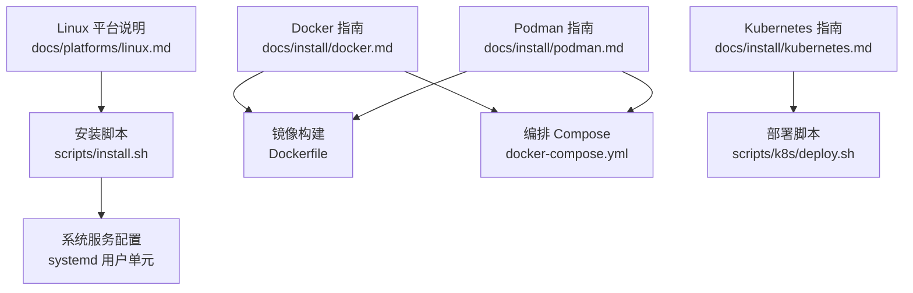
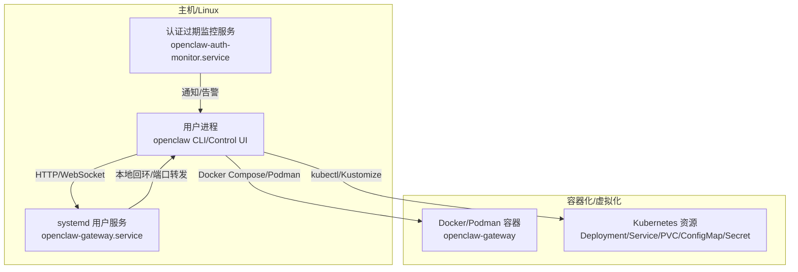
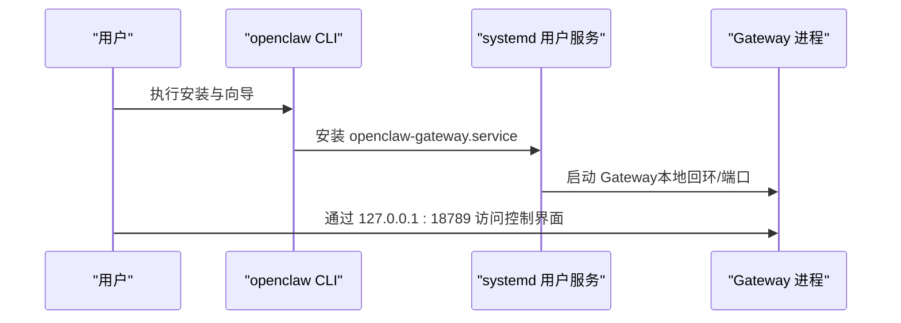
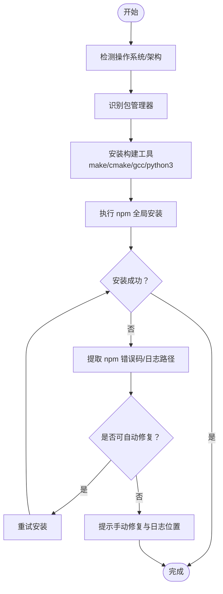
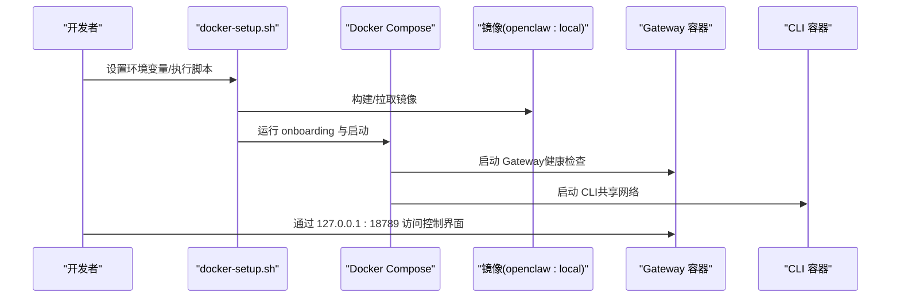
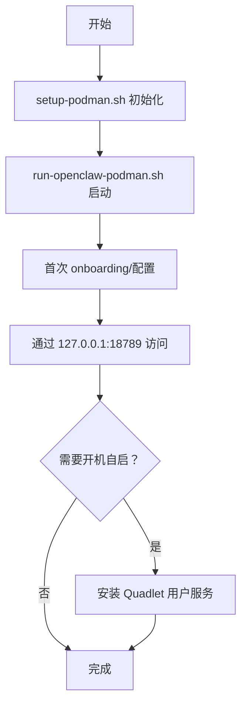
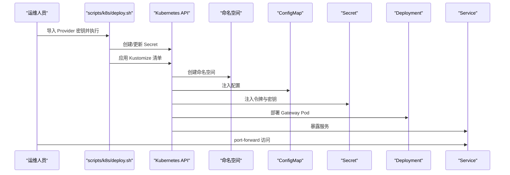
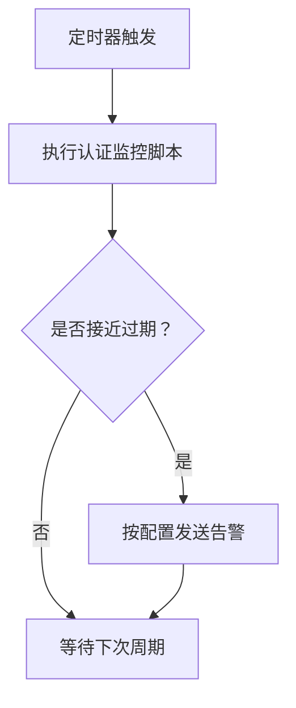
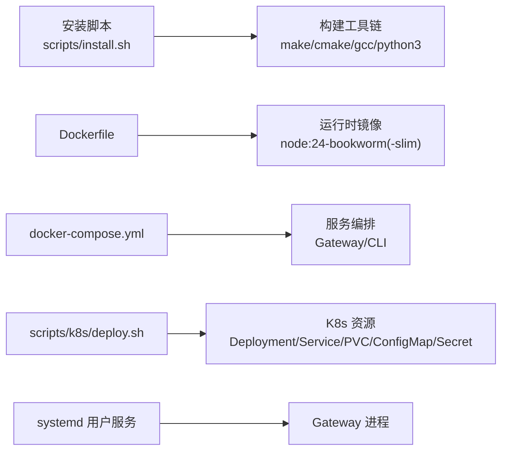

# Linux 安装与配置

<cite>
**本文引用的文件**
- [docs/platforms/linux.md](file://docs/platforms/linux.md)
- [scripts/install.sh](file://scripts/install.sh)
- [scripts/systemd/openclaw-auth-monitor.service](file://scripts/systemd/openclaw-auth-monitor.service)
- [docs/install/docker.md](file://docs/install/docker.md)
- [docs/install/kubernetes.md](file://docs/install/kubernetes.md)
- [docs/install/podman.md](file://docs/install/podman.md)
- [Dockerfile](file://Dockerfile)
- [docker-compose.yml](file://docker-compose.yml)
- [scripts/k8s/deploy.sh](file://scripts/k8s/deploy.sh)
</cite>

## 目录
1. [简介](#简介)
2. [项目结构](#项目结构)
3. [核心组件](#核心组件)
4. [架构总览](#架构总览)
5. [详细组件分析](#详细组件分析)
6. [依赖关系分析](#依赖关系分析)
7. [性能考虑](#性能考虑)
8. [故障排查指南](#故障排查指南)
9. [结论](#结论)
10. [附录](#附录)

## 简介
本指南面向在 Linux 平台上部署与运行 OpenClaw 的用户，覆盖从本地安装到容器化与 Kubernetes 部署的完整路径。内容包括：
- Linux 发行版兼容性与系统依赖
- 权限与安全配置
- 环境要求与桌面集成（Wayland/X11）
- 系统服务配置（systemd 用户服务）
- 容器化部署（Docker/Podman）与 Kubernetes 集成
- 常见问题与性能优化建议

## 项目结构
围绕 Linux 安装与配置的关键文档与脚本如下：
- Linux 平台说明与入门路径：docs/platforms/linux.md
- 通用安装脚本（支持 Linux/macOS）：scripts/install.sh
- systemd 用户服务示例：scripts/systemd/openclaw-auth-monitor.service
- Docker 容器化部署指南：docs/install/docker.md
- Kubernetes 部署指南：docs/install/kubernetes.md
- Podman 部署指南：docs/install/podman.md
- Docker 镜像构建与 Compose 编排：Dockerfile、docker-compose.yml
- Kubernetes 部署脚本：scripts/k8s/deploy.sh

**图表来源**
- [docs/platforms/linux.md](file://docs/platforms/linux.md)
- [scripts/install.sh](file://scripts/install.sh)
- [scripts/systemd/openclaw-auth-monitor.service](file://scripts/systemd/openclaw-auth-monitor.service)
- [docs/install/docker.md](file://docs/install/docker.md)
- [Dockerfile](file://Dockerfile)
- [docker-compose.yml](file://docker-compose.yml)
- [docs/install/kubernetes.md](file://docs/install/kubernetes.md)
- [scripts/k8s/deploy.sh](file://scripts/k8s/deploy.sh)
- [docs/install/podman.md](file://docs/install/podman.md)

**章节来源**
- [docs/platforms/linux.md](file://docs/platforms/linux.md)
- [scripts/install.sh](file://scripts/install.sh)

## 核心组件
- Linux 入门与安装路径：推荐使用 Node 24（兼容 Node 22），通过全局安装或安装脚本完成初始化，并可选择安装为系统服务。
- 安装脚本能力：自动检测系统、下载器、包管理器，必要时自动安装构建工具（如 Debian/Ubuntu 的 build-essential、cmake、gcc 等），并处理 npm 失败的常见原因。
- 系统服务：默认安装 systemd 用户服务；如需共享或始终在线服务器，可改用系统服务。
- 容器化部署：提供 Docker 与 Podman 两种方式，支持代理沙箱、浏览器沙箱、Playwright 浏览器预装等高级场景。
- Kubernetes 部署：通过 Kustomize 快速在集群中部署单实例网关，支持命名空间、持久卷、配置与密钥注入。

**章节来源**
- [docs/platforms/linux.md](file://docs/platforms/linux.md)
- [scripts/install.sh](file://scripts/install.sh)
- [docs/install/docker.md](file://docs/install/docker.md)
- [docs/install/podman.md](file://docs/install/podman.md)
- [docs/install/kubernetes.md](file://docs/install/kubernetes.md)

## 架构总览
下图展示了 Linux 上 OpenClaw 的典型部署形态与组件交互：

**图表来源**
- [docs/platforms/linux.md](file://docs/platforms/linux.md)
- [scripts/systemd/openclaw-auth-monitor.service](file://scripts/systemd/openclaw-auth-monitor.service)
- [docs/install/docker.md](file://docs/install/docker.md)
- [docs/install/kubernetes.md](file://docs/install/kubernetes.md)
- [docs/install/podman.md](file://docs/install/podman.md)

## 详细组件分析

### Linux 安装与系统服务
- 入门路径：安装 Node 24 或 Node 22（≥22.16），全局安装 openclaw，执行向导并安装守护进程。
- systemd 用户服务：默认安装为用户服务；如需系统级服务，参考指南中的最小化示例单元文件。
- 权限与端口：默认绑定到本地回环，可通过端口转发或 LAN 绑定暴露；注意安全边界与防火墙策略。

**图表来源**
- [docs/platforms/linux.md](file://docs/platforms/linux.md)

**章节来源**
- [docs/platforms/linux.md](file://docs/platforms/linux.md)

### 安装脚本与系统依赖
- 自动检测与适配：识别 Linux 发行版（基于包管理器），自动安装构建工具链（make、g++、cmake、python3 等）。
- npm 失败诊断：当检测到缺失构建工具时，尝试自动安装并重试安装；打印 npm 错误码、syscall、errno 与调试日志位置，便于定位问题。
- 下载器与校验：优先 curl/wget，支持校验和验证，确保下载完整性。

**图表来源**
- [scripts/install.sh](file://scripts/install.sh)

**章节来源**
- [scripts/install.sh](file://scripts/install.sh)

### Docker 容器化部署
- 镜像与 Compose：默认使用 node:24-bookworm 基础镜像，支持 slim 变体；Compose 提供网关与 CLI 两个服务，默认只映射必要端口。
- 安全与隔离：非 root 用户运行，健康检查内置；支持通过参数安装 Docker CLI 以启用代理沙箱；可挂载 docker.sock 实现沙箱容器管理。
- 浏览器与 Playwright：可选预装 Chromium 与 Xvfb，减少启动时依赖安装时间；支持自定义渲染进程限制与图形标志。
- 权限与存储：镜像以 node 用户运行，宿主挂载目录需确保 UID/GID 正确；持久化配置与工作区分别挂载至 /home/node/.openclaw 与 /home/node/.openclaw/workspace。

**图表来源**
- [docs/install/docker.md](file://docs/install/docker.md)
- [Dockerfile](file://Dockerfile)
- [docker-compose.yml](file://docker-compose.yml)

**章节来源**
- [docs/install/docker.md](file://docs/install/docker.md)
- [Dockerfile](file://Dockerfile)
- [docker-compose.yml](file://docker-compose.yml)

### Podman 部署（rootless）
- 单次设置：创建专用 openclaw 用户、构建镜像、生成启动脚本；可选安装 Quadlet 用户服务实现开机自启与自动重启。
- 环境与配置：默认以 loopback 绑定，通过端口映射访问；支持通过环境变量覆盖端口与绑定模式；配置与工作区默认位于 openclaw 用户家目录。
- 故障排查：关注 subuid/subgid 配置、容器名称占用、Quadlet 依赖的 cgroups v2 等。

**图表来源**
- [docs/install/podman.md](file://docs/install/podman.md)

**章节来源**
- [docs/install/podman.md](file://docs/install/podman.md)

### Kubernetes 部署
- 快速部署：通过 Kustomize 应用命名空间、Deployment、Service、PVC、ConfigMap 与 Secret；支持在部署前创建 Secret 或由脚本生成。
- 访问方式：默认通过 kubectl port-forward 访问；如需对外暴露，需调整绑定模式与入口策略。
- 可定制化：支持修改镜像、命名空间、Provider 密钥、Agent 指令与配置等。

**图表来源**
- [scripts/k8s/deploy.sh](file://scripts/k8s/deploy.sh)
- [docs/install/kubernetes.md](file://docs/install/kubernetes.md)

**章节来源**
- [scripts/k8s/deploy.sh](file://scripts/k8s/deploy.sh)
- [docs/install/kubernetes.md](file://docs/install/kubernetes.md)

### 认证过期监控服务（systemd）
- 用途：定期检查网关认证状态并在到期前发出告警；支持通过环境变量配置告警阈值与通知通道。
- 集成：作为 systemd 用户定时任务运行，适合与本地或容器化部署配合使用。

**图表来源**
- [scripts/systemd/openclaw-auth-monitor.service](file://scripts/systemd/openclaw-auth-monitor.service)

**章节来源**
- [scripts/systemd/openclaw-auth-monitor.service](file://scripts/systemd/openclaw-auth-monitor.service)

## 依赖关系分析
- 包管理器与构建工具：脚本根据发行版自动安装构建工具，避免 npm 编译失败。
- 容器运行时：Docker/Podman 提供隔离与可移植性；Kubernetes 提供编排与弹性。
- 网络与安全：容器镜像默认非 root 运行并内置健康检查；Kubernetes 使用只读根文件系统与能力降级。

**图表来源**
- [scripts/install.sh](file://scripts/install.sh)
- [Dockerfile](file://Dockerfile)
- [docker-compose.yml](file://docker-compose.yml)
- [scripts/k8s/deploy.sh](file://scripts/k8s/deploy.sh)
- [docs/platforms/linux.md](file://docs/platforms/linux.md)

**章节来源**
- [scripts/install.sh](file://scripts/install.sh)
- [Dockerfile](file://Dockerfile)
- [docker-compose.yml](file://docker-compose.yml)
- [scripts/k8s/deploy.sh](file://scripts/k8s/deploy.sh)
- [docs/platforms/linux.md](file://docs/platforms/linux.md)

## 性能考虑
- 容器镜像层缓存：遵循“先复制依赖再复制源代码”的顺序，提升 pnpm install 层缓存命中率，缩短重建时间。
- 浏览器与 Playwright：在镜像中预装浏览器可显著降低启动时长与依赖安装开销。
- 资源限制：在沙箱与 Kubernetes 中合理设置 CPU、内存与进程数上限，避免资源争用。
- 存储热点：关注媒体、会话与日志目录的增长，必要时进行归档或清理。

## 故障排查指南
- 安装脚本失败
  - 症状：npm 安装失败，提示缺少构建工具。
  - 处理：脚本会尝试自动安装构建工具并重试；若仍失败，查看 npm 错误码与调试日志路径，按提示修复。
- Docker 权限与挂载
  - 症状：/home/node/.openclaw 权限错误（EACCES）。
  - 处理：确保宿主挂载目录属主为 uid 1000；或在容器内以 root 运行（不推荐）。
- Kubernetes 访问
  - 症状：无法通过 Service/Ingress 访问 Gateway。
  - 处理：调整 Gateway 绑定模式为 LAN 并配置 TLS 与允许的 Origin；或使用 port-forward 本地调试。
- Podman Quadlet
  - 症状：服务未找到或启动失败。
  - 处理：执行 daemon-reload，确认 cgroups v2 已启用；检查 subuid/subgid 配置。

**章节来源**
- [scripts/install.sh](file://scripts/install.sh)
- [docs/install/docker.md](file://docs/install/docker.md)
- [docs/install/kubernetes.md](file://docs/install/kubernetes.md)
- [docs/install/podman.md](file://docs/install/podman.md)

## 结论
在 Linux 上部署 OpenClaw 提供了从本地安装到容器化与 Kubernetes 的多条路径。通过安装脚本自动化依赖安装与诊断，结合 systemd 用户服务、Docker/Podman 容器与 Kubernetes 编排，用户可根据自身需求选择最适合的部署形态，并在安全与性能之间取得平衡。

## 附录
- 快速开始（Node 全局安装）
  - 安装 Node 24（或 Node 22 ≥22.16）
  - 全局安装 openclaw
  - 执行向导并安装守护进程
  - 通过 SSH 端口转发访问控制界面
- Docker/Podman 快速开始
  - 使用 docker-setup.sh 或 setup-podman.sh 完成初始化
  - 通过 127.0.0.1:18789 访问控制界面
- Kubernetes 快速开始
  - 导入 Provider 密钥并执行部署脚本
  - 通过 port-forward 访问控制界面

**章节来源**
- [docs/platforms/linux.md](file://docs/platforms/linux.md)
- [docs/install/docker.md](file://docs/install/docker.md)
- [docs/install/podman.md](file://docs/install/podman.md)
- [docs/install/kubernetes.md](file://docs/install/kubernetes.md)