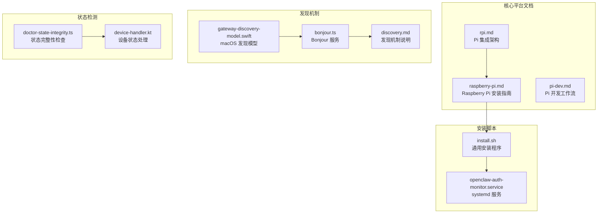
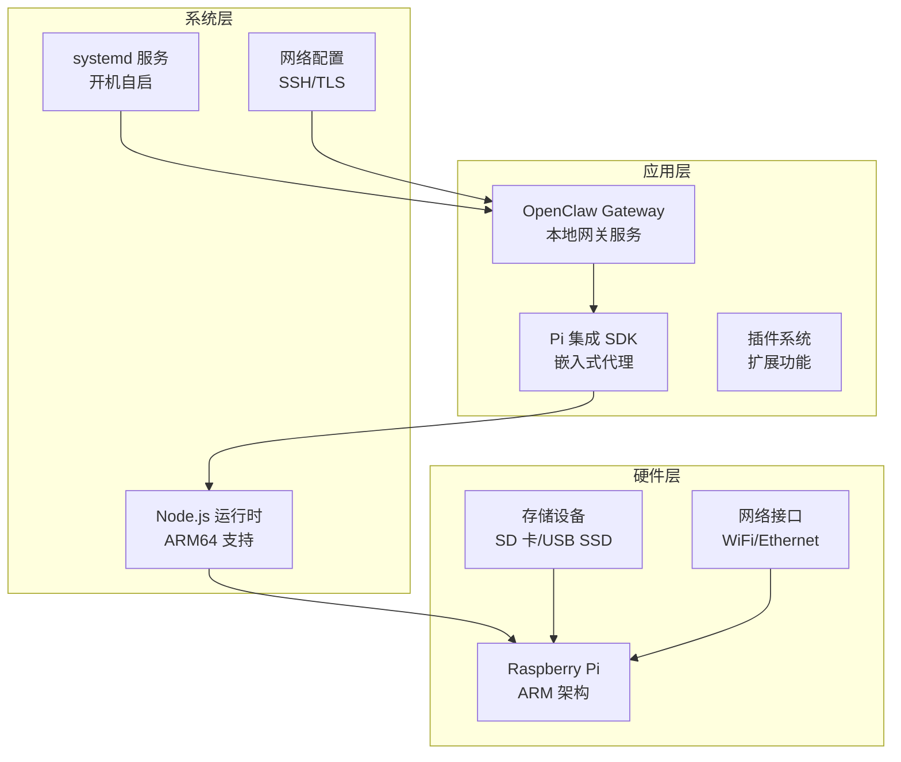
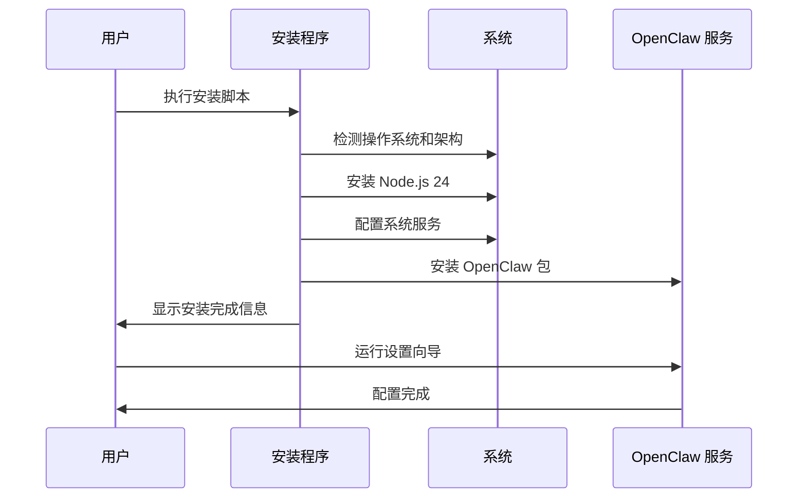
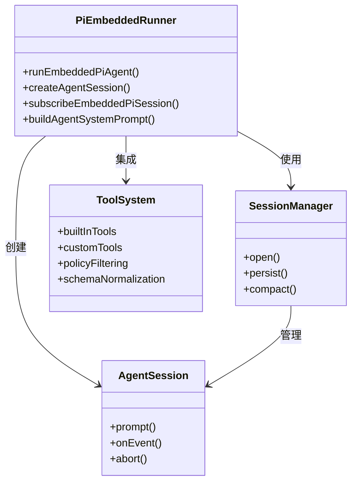
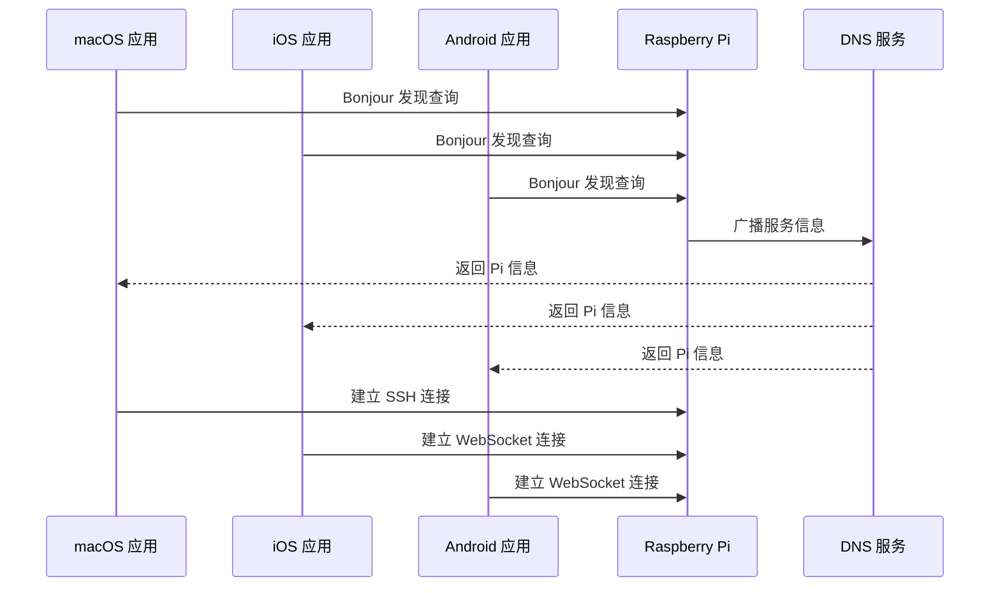
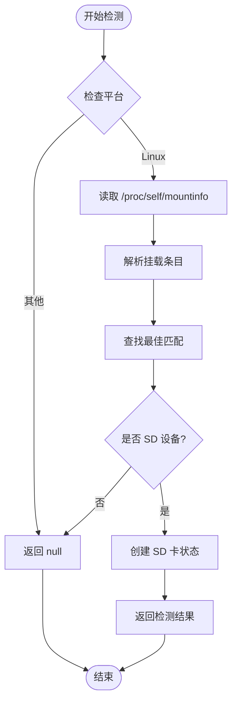
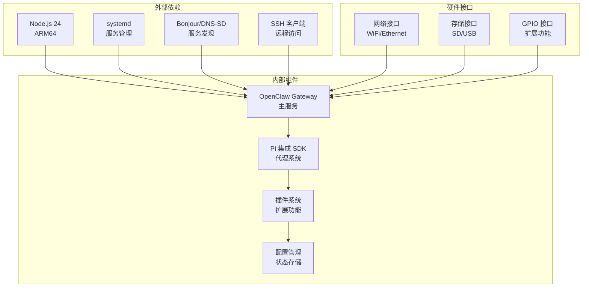
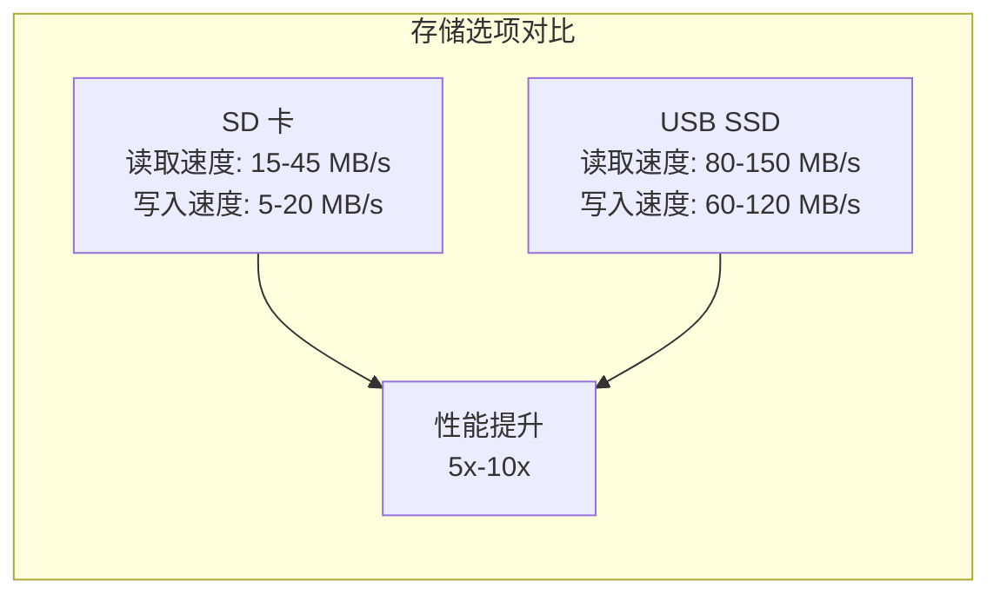
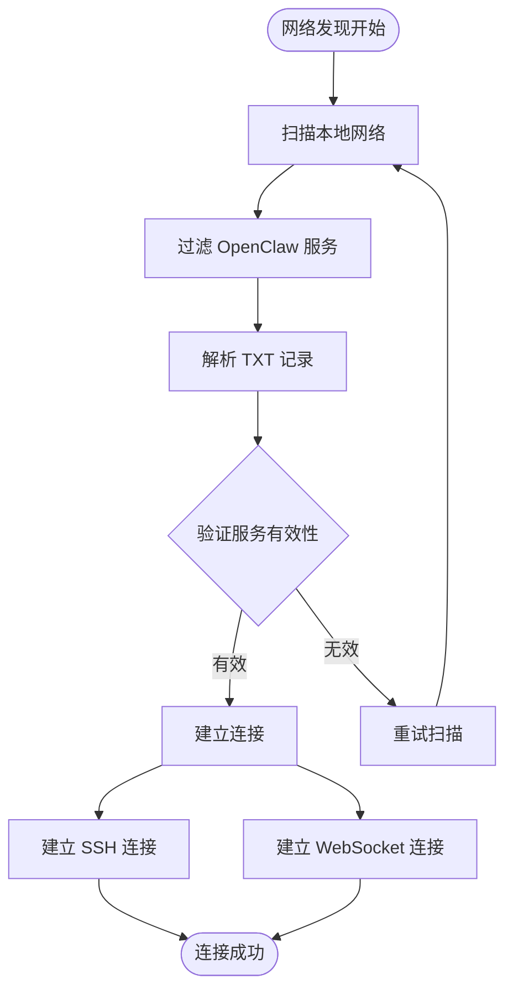

# Raspberry Pi 安装与配置

<cite>
**本文档引用的文件**
- [raspberry-pi.md](file://docs/platforms/raspberry-pi.md)
- [pi.md](file://docs/pi.md)
- [pi-dev.md](file://docs/pi-dev.md)
- [install.sh](file://scripts/install.sh)
- [openclaw-auth-monitor.service](file://scripts/systemd/openclaw-auth-monitor.service)
- [discovery.md](file://docs/zh-CN/gateway/discovery.md)
- [gateway-discovery-model.swift](file://apps/macos/Sources/OpenClawDiscovery/GatewayDiscoveryModel.swift)
- [bonjour.ts](file://src/infra/bonjour.ts)
- [doctor-state-integrity.ts](file://src/commands/doctor-state-integrity.ts)
- [device-handler.kt](file://apps/android/app/src/main/java/ai/openclaw/app/node/DeviceHandler.kt)
</cite>

## 目录
1. [简介](#简介)
2. [项目结构](#项目结构)
3. [核心组件](#核心组件)
4. [架构概览](#架构概览)
5. [详细组件分析](#详细组件分析)
6. [依赖关系分析](#依赖关系分析)
7. [性能考虑](#性能考虑)
8. [故障排除指南](#故障排除指南)
9. [结论](#结论)
10. [附录](#附录)

## 简介

本文档为 Raspberry Pi 嵌入式设备提供 OpenClaw 安装和配置的完整指南。OpenClaw 是一个开源的个人 AI 助手平台，可在 Raspberry Pi 上运行持久、常驻的 Gateway 网关服务。

Raspberry Pi 作为低成本、低功耗的嵌入式计算平台，非常适合运行 OpenClaw。本文档涵盖了从硬件选择、系统配置到性能优化的完整流程。

## 项目结构

OpenClaw 代码库采用模块化设计，主要包含以下关键目录：



**图表来源**
- [pi.md:1-563](file://docs/pi.md#L1-L563)
- [raspberry-pi.md:1-413](file://docs/platforms/raspberry-pi.md#L1-L413)
- [install.sh:1-800](file://scripts/install.sh#L1-L800)

**章节来源**
- [pi.md:1-563](file://docs/pi.md#L1-L563)
- [raspberry-pi.md:1-413](file://docs/platforms/raspberry-pi.md#L1-L413)

## 核心组件

### 硬件兼容性矩阵

| Raspberry Pi 型号 | 内存要求 | 推荐程度 | 说明 |
|------------------|----------|----------|------|
| **Pi 5** | 4GB/8GB | ✅ 最佳 | 性能最强，推荐使用 |
| **Pi 4** | 4GB | ✅ 良好 | 大多数用户的最佳选择 |
| **Pi 4** | 2GB | ✅ 可以 | 需要添加交换空间 |
| **Pi 4** | 1GB | ⚠️ 紧张 | 可行但性能受限 |
| **Pi 3B+** | 1GB | ⚠️ 慢 | 性能较差，不推荐 |
| **Pi Zero 2 W** | 512MB | ❌ 不推荐 | 内存过小 |

**最低配置要求**：
- 1GB 内存，1 核处理器，500MB 磁盘空间
- 64 位操作系统，16GB+ SD 卡或 USB SSD

### 系统要求

- **操作系统**：Raspberry Pi OS Lite (64-bit)
- **网络**：以太网或 WiFi 连接
- **存储**：16GB+ SD 卡或 USB SSD
- **电源**：官方 Pi 电源供应器

**章节来源**
- [raspberry-pi.md:22-42](file://docs/platforms/raspberry-pi.md#L22-L42)

## 架构概览

OpenClaw 在 Raspberry Pi 上的运行架构采用分层设计：



**图表来源**
- [pi.md:135-160](file://docs/pi.md#L135-L160)
- [raspberry-pi.md:110-135](file://docs/platforms/raspberry-pi.md#L110-L135)

## 详细组件分析

### 1. 安装流程

#### 标准安装流程



**图表来源**
- [install.sh:109-127](file://scripts/install.sh#L109-L127)
- [install.sh:254-270](file://scripts/install.sh#L254-L270)

#### 硬件准备阶段

1. **系统镜像刷写**
   - 使用 Raspberry Pi Imager
   - 选择 Raspberry Pi OS Lite (64-bit)
   - 预配置：启用 SSH、设置主机名、配置 WiFi

2. **初始系统设置**
   ```bash
   # 更新系统
   sudo apt update && sudo apt upgrade -y
   
   # 安装必要软件包
   sudo apt install -y git curl build-essential
   
   # 设置时区
   sudo timedatectl set-timezone Asia/Shanghai
   ```

**章节来源**
- [raspberry-pi.md:44-77](file://docs/platforms/raspberry-pi.md#L44-L77)

### 2. 系统配置

#### Node.js 安装配置

OpenClaw 需要 Node.js 24 (ARM64) 版本：

```bash
# 通过 NodeSource 安装
curl -fsSL https://deb.nodesource.com/setup_24.x | sudo -E bash -
sudo apt install -y nodejs

# 验证安装
node --version  # 应显示 v24.x.x
npm --version
```

#### 交换空间配置

对于 2GB 或更少内存的设备：

```bash
# 创建 2GB 交换文件
sudo fallocate -l 2G /swapfile
sudo chmod 600 /swapfile
sudo mkswap /swapfile
sudo swapon /swapfile

# 永久生效
echo '/swapfile none swap sw 0 0' | sudo tee -a /etc/fstab

# 优化低内存
echo 'vm.swappiness=10' | sudo tee -a /etc/sysctl.conf
sudo sysctl -p
```

**章节来源**
- [raspberry-pi.md:79-108](file://docs/platforms/raspberry-pi.md#L79-L108)

### 3. Pi 集成架构

OpenClaw 使用嵌入式方式集成 Pi SDK：



**图表来源**
- [pi.md:139-196](file://docs/pi.md#L139-L196)
- [pi.md:296-331](file://docs/pi.md#L296-L331)

#### 核心运行流程

1. **会话创建**
   - 初始化 SessionManager
   - 创建 AgentSession 实例
   - 应用系统提示词

2. **事件订阅**
   - 订阅工具执行事件
   - 处理消息流事件
   - 管理会话生命周期

3. **工具执行**
   - 工具策略过滤
   - Schema 规范化
   - 异步工具调用

**章节来源**
- [pi.md:135-234](file://docs/pi.md#L135-L234)

### 4. 网络发现机制

OpenClaw 实现了多平台的网络发现机制：



**图表来源**
- [gateway-discovery-model.swift:38-62](file://apps/macos/Sources/OpenClawDiscovery/GatewayDiscoveryModel.swift#L38-L62)
- [bonjour.ts:112-146](file://src/infra/bonjour.ts#L112-L146)

#### 发现服务配置

| 服务属性 | 值 | 说明 |
|----------|----|----- |
| 服务类型 | `_openclaw._tcp` | OpenClaw 服务标识 |
| 端口 | 18789 | 网关端口 |
| SSH 端口 | 22 | SSH 连接端口 |
| 显示名称 | gateway-host | 主机名 |
| 传输协议 | gateway | 传输方式 |

**章节来源**
- [discovery.md:119-124](file://docs/zh-CN/gateway/discovery.md#L119-L124)

### 5. 状态监控与诊断

#### 存储状态检测

OpenClaw 提供了针对 Linux 系统的存储状态检测功能：



**图表来源**
- [doctor-state-integrity.ts:293-306](file://src/commands/doctor-state-integrity.ts#L293-L306)

#### 设备状态收集

Android 应用提供了完整的设备状态收集功能：

| 设备状态类别 | 属性 | 数据类型 | 说明 |
|-------------|------|----------|------|
| 电池状态 | level | number | 电量百分比 (0.0-1.0) |
| 电池状态 | state | string | 充电状态 |
| 电池状态 | lowPowerModeEnabled | boolean | 省电模式 |
| 存储状态 | totalBytes | number | 总存储空间 |
| 存储状态 | freeBytes | number | 可用存储空间 |
| 存储状态 | usedBytes | number | 已用存储空间 |
| 热力状态 | state | string | 设备温度状态 |
| 网络状态 | status | string | 网络连接状态 |
| 网络状态 | isExpensive | boolean | 是否计费网络 |
| 网络状态 | isConstrained | boolean | 网络限制状态 |

**章节来源**
- [device-handler.kt:64-108](file://apps/android/app/src/main/java/ai/openclaw/app/node/DeviceHandler.kt#L64-L108)

## 依赖关系分析

### 系统依赖图



**图表来源**
- [install.sh:545-621](file://scripts/install.sh#L545-L621)
- [pi.md:24-41](file://docs/pi.md#L24-L41)

### 服务依赖关系

OpenClaw 在 Raspberry Pi 上的依赖关系：

1. **基础系统依赖**
   - Node.js 24 (ARM64) - 运行时环境
   - systemd - 服务管理
   - SSH - 远程访问
   - Bonjour - 服务发现

2. **应用依赖**
   - Pi 集成 SDK - 代理系统
   - 插件系统 - 功能扩展
   - 配置管理 - 状态持久化

3. **硬件依赖**
   - ARM64 架构 - 处理器支持
   - 64 位操作系统 - 系统要求
   - USB/SD 存储 - 数据存储

**章节来源**
- [install.sh:109-127](file://scripts/install.sh#L109-L127)
- [pi.md:24-41](file://docs/pi.md#L24-L41)

## 性能考虑

### 存储性能优化

#### USB SSD 性能提升



**图表来源**
- [raspberry-pi.md:187-196](file://docs/platforms/raspberry-pi.md#L187-L196)

#### 内存优化策略

1. **GPU 内存分配**
   ```bash
   # 禁用 GPU 内存分配
   echo 'gpu_mem=16' | sudo tee -a /boot/config.txt
   ```

2. **服务优化**
   ```bash
   # 禁用不必要的服务
   sudo systemctl disable bluetooth avahi-daemon cups
   
   # 优化启动时间
   sudo systemctl edit openclaw
   ```

3. **缓存优化**
   ```bash
   # Node.js 模块编译缓存
   export NODE_COMPILE_CACHE=/var/tmp/openclaw-compile-cache
   export OPENCLAW_NO_RESPAWN=1
   ```

**章节来源**
- [raspberry-pi.md:249-270](file://docs/platforms/raspberry-pi.md#L249-L270)

### 网络性能优化

#### WiFi 连接优化

```bash
# 禁用 WiFi 电源管理
sudo iwconfig wlan0 power off

# 永久配置
echo 'wireless-power off' | sudo tee -a /etc/network/interfaces
```

#### 网络发现优化



**图表来源**
- [gateway-discovery-model.swift:458-497](file://apps/macos/Sources/OpenClawDiscovery/GatewayDiscoveryModel.swift#L458-L497)

## 故障排除指南

### 常见问题诊断

#### 内存不足问题

```bash
# 检查内存使用情况
free -h

# 查看内存压力
cat /proc/meminfo | grep -E "(MemAvailable|SwapTotal|SwapFree)"

# 检查 OOM 杀手日志
dmesg | grep -i "killed\|oom\|memory"
```

#### 性能问题诊断

```bash
# 检查 CPU 温度
vcgencmd measure_temp

# 检查 CPU 频率
vcgencmd measure_clock arm

# 检查存储 I/O
iostat -x 1 5

# 检查网络延迟
ping -c 10 8.8.8.8
```

#### 服务启动问题

```bash
# 查看服务状态
sudo systemctl status openclaw

# 查看服务日志
journalctl -u openclaw --no-pager -n 100

# 检查端口占用
sudo netstat -tulpn | grep 18789

# 检查依赖服务
sudo systemctl list-dependencies openclaw
```

**章节来源**
- [raspberry-pi.md:341-387](file://docs/platforms/raspberry-pi.md#L341-L387)

### ARM 架构兼容性

#### 二进制兼容性检查

| 工具 | ARM64 状态 | 说明 |
|------|------------|------|
| Node.js | ✅ 完全支持 | ARM64 原生支持 |
| WhatsApp (Baileys) | ✅ 纯 JavaScript | 无需二进制 |
| Telegram | ✅ 纯 JavaScript | 无需二进制 |
| gog (Gmail CLI) | ⚠️ 需检查 | 检查 ARM64 版本 |
| Chromium | ✅ 支持 | 通过 apt 安装 |

#### 32 位 vs 64 位检查

```bash
# 检查系统架构
uname -m
# 应显示: aarch64 (64位)

# 检查系统信息
cat /etc/os-release
# 确认为 64 位系统
```

**章节来源**
- [raspberry-pi.md:274-298](file://docs/platforms/raspberry-pi.md#L274-L298)

### 系统服务管理

#### systemd 服务配置

```bash
# 检查服务状态
sudo systemctl is-enabled openclaw
sudo systemctl status openclaw

# 启用开机自启
sudo systemctl enable openclaw

# 重启服务
sudo systemctl restart openclaw

# 查看服务日志
journalctl -u openclaw -f
```

#### 自定义服务配置

```bash
# 创建服务覆盖文件
sudo systemctl edit openclaw

# 添加配置
[Service]
Environment=OPENCLAW_NO_RESPAWN=1
Environment=NODE_COMPILE_CACHE=/var/tmp/openclaw-compile-cache
Restart=always
RestartSec=2
TimeoutStartSec=90
```

**章节来源**
- [raspberry-pi.md:322-335](file://docs/platforms/raspberry-pi.md#L322-L335)

## 结论

Raspberry Pi 为 OpenClaw 提供了一个理想的嵌入式部署平台。通过合理的硬件选择、系统配置和性能优化，可以在保持低成本的同时获得稳定的运行体验。

关键成功因素包括：
- 选择合适的 Raspberry Pi 型号（推荐 Pi 4/5）
- 使用 64 位操作系统和适当的存储解决方案
- 实施有效的内存和存储优化策略
- 建立完善的监控和故障排除机制

OpenClaw 的模块化架构和丰富的生态系统使其能够很好地适应 Raspberry Pi 的资源限制，同时提供强大的 AI 助手功能。

## 附录

### 成本效益分析

| 配置 | 一次性成本 | 月费用 | 说明 |
|------|------------|--------|------|
| **Pi 4 (2GB)** | ~$45 | $0 | + 电源 (~$5/年) |
| **Pi 4 (4GB)** | ~$55 | $0 | 推荐配置 |
| **Pi 5 (4GB)** | ~$60 | $0 | 最佳性能 |
| **Pi 5 (8GB)** | ~$80 | $0 | 未来升级 |
| **DigitalOcean** | $0 | $6/月 | $72/年 |
| **Hetzner** | $0 | €3.79/月 | ~$50/年 |

**盈亏平衡**：Pi 在 6-12 个月内收回成本，相比云 VPS 更具成本效益。

### 最佳实践清单

- ✅ 使用 16GB+ SD 卡或 USB SSD
- ✅ 启用交换空间（2GB 或更少内存）
- ✅ 禁用不必要的系统服务
- ✅ 配置适当的内存优化
- ✅ 设置自动重启策略
- ✅ 实施监控和告警机制
- ✅ 定期更新系统和软件包
- ✅ 备份重要配置和数据