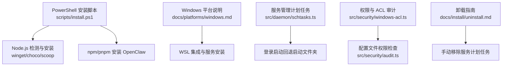
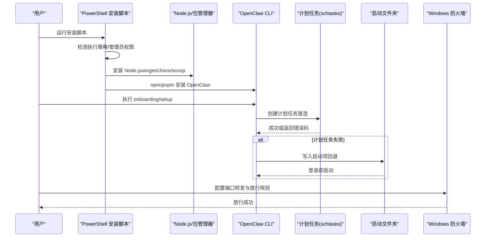
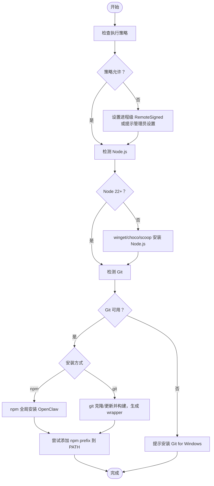
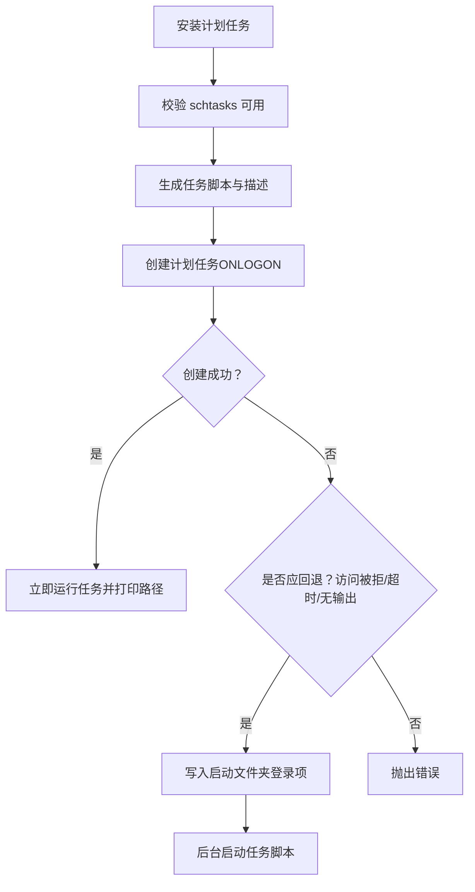
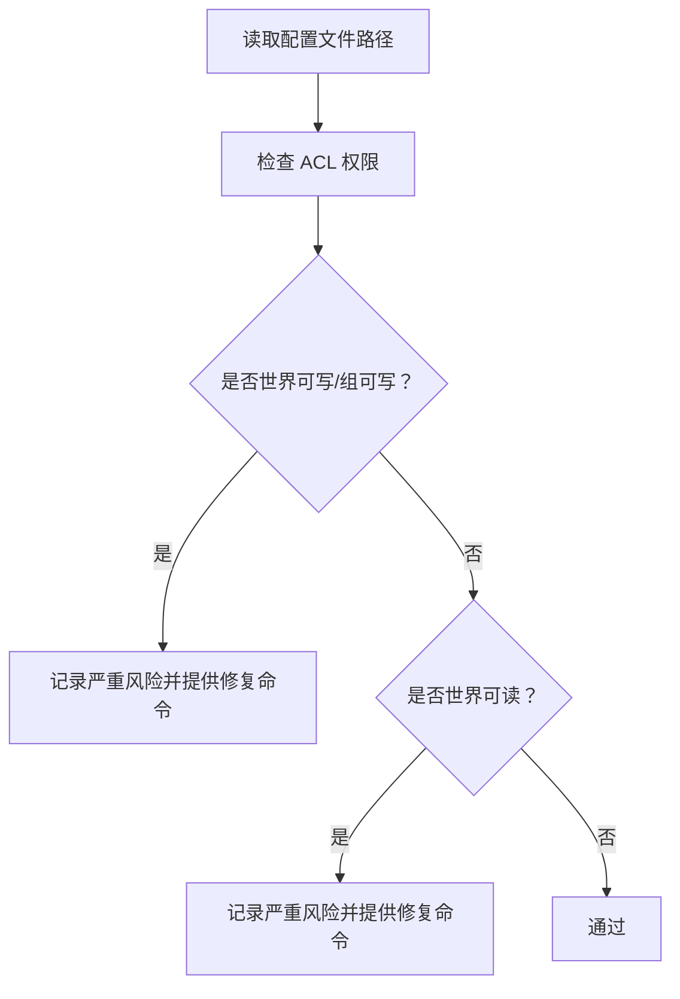
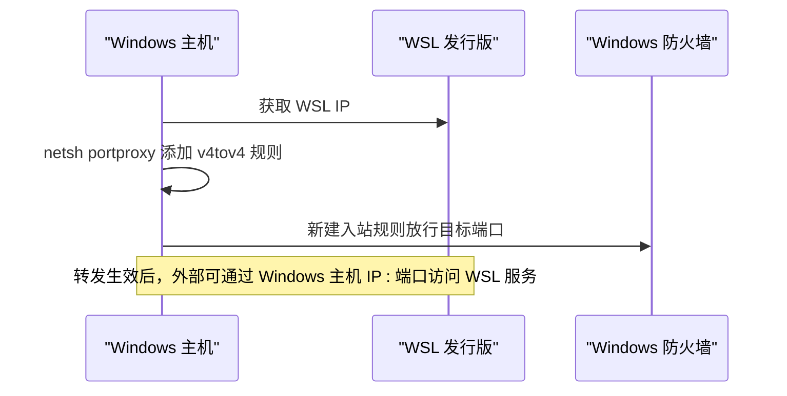
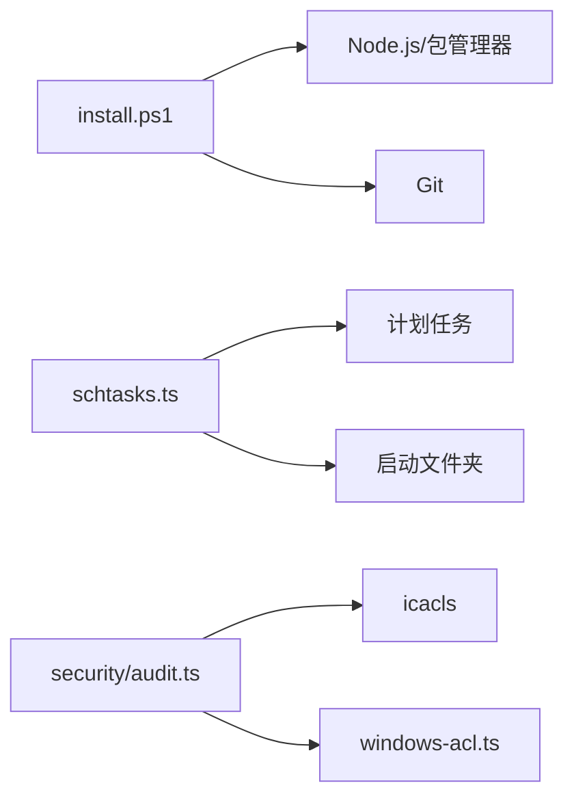

# Windows 安装与配置

<cite>
**本文档引用的文件**
- [scripts/install.ps1](file://scripts/install.ps1)
- [docs/platforms/windows.md](file://docs/platforms/windows.md)
- [docs/install/installer.md](file://docs/install/installer.md)
- [src/daemon/schtasks.ts](file://src/daemon/schtasks.ts)
- [src/security/windows-acl.ts](file://src/security/windows-acl.ts)
- [src/security/audit.ts](file://src/security/audit.ts)
- [docs/install/uninstall.md](file://docs/install/uninstall.md)
- [docs/help/troubleshooting.md](file://docs/help/troubleshooting.md)
</cite>

## 目录
1. [简介](#简介)
2. [项目结构](#项目结构)
3. [核心组件](#核心组件)
4. [架构总览](#架构总览)
5. [详细组件分析](#详细组件分析)
6. [依赖关系分析](#依赖关系分析)
7. [性能考虑](#性能考虑)
8. [故障排除指南](#故障排除指南)
9. [结论](#结论)
10. [附录](#附录)

## 简介
本指南面向 Windows 用户，提供 OpenClaw 的安装与配置方案，覆盖以下关键主题：
- Windows 版本兼容性与系统要求
- 权限配置与安全设置
- PowerShell 脚本安装流程
- Windows 服务（计划任务）配置与回退机制
- 防火墙与网络端口转发
- WSL 集成与远程浏览器工具支持
- Windows Terminal 配置与系统托盘集成现状
- 常见问题排查与性能调优建议

## 项目结构
围绕 Windows 安装与运行，相关文件主要分布在以下位置：
- 安装脚本与文档：scripts/install.ps1、docs/install/installer.md
- Windows 平台说明：docs/platforms/windows.md
- Windows 服务与启动项：src/daemon/schtasks.ts
- Windows 权限与 ACL 审计：src/security/windows-acl.ts、src/security/audit.ts
- 卸载与服务移除：docs/install/uninstall.md
- 故障排除：docs/help/troubleshooting.md

**图表来源**
- [scripts/install.ps1:1-360](file://scripts/install.ps1#L1-L360)
- [docs/platforms/windows.md:1-242](file://docs/platforms/windows.md#L1-L242)
- [src/daemon/schtasks.ts:1-200](file://src/daemon/schtasks.ts#L1-L200)
- [src/security/windows-acl.ts:1-200](file://src/security/windows-acl.ts#L1-L200)
- [src/security/audit.ts:289-322](file://src/security/audit.ts#L289-L322)
- [docs/install/uninstall.md:103-114](file://docs/install/uninstall.md#L103-L114)

**章节来源**
- [scripts/install.ps1:1-360](file://scripts/install.ps1#L1-L360)
- [docs/platforms/windows.md:1-242](file://docs/platforms/windows.md#L1-L242)
- [docs/install/installer.md:251-334](file://docs/install/installer.md#L251-L334)

## 核心组件
- PowerShell 安装器：自动检测并安装 Node.js（优先 winget/chocolatey/scoop），支持 npm 与 git 两种安装方式，并在安装后尝试将全局 npm bin 目录加入用户 PATH。
- Windows 服务安装：优先使用计划任务（Scheduled Task），失败时回退到当前用户的“启动”文件夹登录项；支持卸载清理。
- 权限与安全：通过 ACL 分类与审计，识别世界可写/可读等高危配置，提供修复与改进建议。
- WSL 集成：推荐在 WSL2 中运行 CLI/Gateway，提供开机自启、端口转发、防火墙放行等步骤。

**章节来源**
- [scripts/install.ps1:300-360](file://scripts/install.ps1#L300-L360)
- [src/daemon/schtasks.ts:36-43](file://src/daemon/schtasks.ts#L36-L43)
- [src/security/audit.ts:289-322](file://src/security/audit.ts#L289-L322)
- [docs/platforms/windows.md:185-242](file://docs/platforms/windows.md#L185-L242)

## 架构总览
下图展示 Windows 安装与服务启动的关键交互：

**图表来源**
- [scripts/install.ps1:300-360](file://scripts/install.ps1#L300-L360)
- [src/daemon/schtasks.ts:550-623](file://src/daemon/schtasks.ts#L550-L623)
- [docs/platforms/windows.md:140-184](file://docs/platforms/windows.md#L140-L184)

## 详细组件分析

### PowerShell 安装脚本（install.ps1）
- 功能要点
  - 执行策略检测与临时提升（进程级 RemoteSigned）
  - 自动安装 Node.js（winget/choco/scoop），要求 Node 22+
  - 支持 npm 与 git 两种安装方式，git 安装会生成 wrapper 脚本
  - 尝试将 npm 全局 bin 目录加入用户 PATH
  - 支持 DryRun、NoOnboard、NoGitUpdate 等参数
- 关键行为
  - 若执行策略受限，提示设置策略或以管理员身份运行
  - 若缺少 Git，优先 winget 安装，否则提示手动安装
  - npm 安装失败时返回错误码，便于自动化处理

**图表来源**
- [scripts/install.ps1:42-200](file://scripts/install.ps1#L42-L200)
- [scripts/install.ps1:202-260](file://scripts/install.ps1#L202-L260)
- [scripts/install.ps1:300-360](file://scripts/install.ps1#L300-L360)

**章节来源**
- [scripts/install.ps1:1-360](file://scripts/install.ps1#L1-L360)
- [docs/install/installer.md:251-334](file://docs/install/installer.md#L251-L334)

### Windows 服务与启动项（计划任务）
- 服务安装优先使用计划任务，失败条件包括访问被拒绝、超时、无输出等，此时回退到启动文件夹登录项
- 启动项脚本采用最小化窗口启动，避免干扰
- 支持查询、运行、删除计划任务，以及清理启动项与任务脚本
- 提供任务状态解析与结果码标准化

**图表来源**
- [src/daemon/schtasks.ts:36-43](file://src/daemon/schtasks.ts#L36-L43)
- [src/daemon/schtasks.ts:550-623](file://src/daemon/schtasks.ts#L550-L623)
- [src/daemon/schtasks.ts:277-284](file://src/daemon/schtasks.ts#L277-L284)
- [src/daemon/schtasks.ts:286-293](file://src/daemon/schtasks.ts#L286-L293)

**章节来源**
- [src/daemon/schtasks.ts:1-200](file://src/daemon/schtasks.ts#L1-L200)
- [src/daemon/schtasks.ts:550-654](file://src/daemon/schtasks.ts#L550-L654)

### 权限与安全（ACL 审计）
- ACL 分类：可信主体（系统/管理员）、世界（Everyone/Authenticated Users）、组
- 配置文件权限检查：若存在世界可写/组可写，标记为严重风险；若世界可读，标记为严重风险并提供修复建议
- 通过 icacls 命令进行权限检查与修复命令生成

**图表来源**
- [src/security/audit.ts:289-322](file://src/security/audit.ts#L289-L322)
- [src/security/windows-acl.ts:82-148](file://src/security/windows-acl.ts#L82-L148)

**章节来源**
- [src/security/audit.ts:289-322](file://src/security/audit.ts#L289-L322)
- [src/security/windows-acl.ts:1-200](file://src/security/windows-acl.ts#L1-L200)

### WSL 集成与网络端口转发
- 推荐在 WSL2 中运行 CLI/Gateway，启用 systemd 以支持用户服务安装
- 通过 netsh portproxy 将 Windows 端口转发至 WSL IP，允许另一台机器访问 WSL 内的服务
- 需要为转发端口在 Windows 防火墙中放行

**图表来源**
- [docs/platforms/windows.md:140-184](file://docs/platforms/windows.md#L140-L184)

**章节来源**
- [docs/platforms/windows.md:185-242](file://docs/platforms/windows.md#L185-L242)

### Windows Terminal 与系统托盘
- Windows Terminal：可在终端中直接运行 openclaw 命令；建议使用 PowerShell 作为默认终端
- 系统托盘：当前未提供 Windows 桌面应用，因此不涉及系统托盘集成

**章节来源**
- [docs/platforms/windows.md:238-242](file://docs/platforms/windows.md#L238-L242)

## 依赖关系分析
- 安装脚本依赖 Node.js 包管理器（npm/pnpm）与 Git
- 服务安装依赖 Windows 计划任务（schtasks）；当 schtasks 不可用或失败时，回退到启动文件夹
- 权限审计依赖 Windows ACL 工具（icacls）与系统用户上下文

**图表来源**
- [scripts/install.ps1:102-149](file://scripts/install.ps1#L102-L149)
- [src/daemon/schtasks.ts:550-623](file://src/daemon/schtasks.ts#L550-L623)
- [src/security/audit.ts:289-322](file://src/security/audit.ts#L289-L322)

**章节来源**
- [scripts/install.ps1:1-360](file://scripts/install.ps1#L1-L360)
- [src/daemon/schtasks.ts:1-200](file://src/daemon/schtasks.ts#L1-L200)
- [src/security/audit.ts:289-322](file://src/security/audit.ts#L289-L322)

## 性能考虑
- 启动时间与内存占用：可通过基准脚本与测试预算工具评估 CLI 启动耗时与回归阈值
- WSL 端口转发：频繁重启 WSL 会导致 IP 变化，需刷新 portproxy 规则以保持连通性
- 防火墙规则：仅对必要端口放行，减少不必要的网络暴露

**章节来源**
- [scripts/bench-cli-startup.ts:59-111](file://scripts/bench-cli-startup.ts#L59-L111)
- [scripts/test-perf-budget.mjs:98-127](file://scripts/test-perf-budget.mjs#L98-L127)
- [docs/platforms/windows.md:168-184](file://docs/platforms/windows.md#L168-L184)

## 故障排除指南
- 安装后无法识别 openclaw：确认 npm prefix 已加入 PATH，重启终端后重试
- Windows 执行策略限制：设置进程级 RemoteSigned 或以管理员身份设置 LocalMachine 级别
- Git 缺失导致 npm 安装失败：安装 Git for Windows 后重试
- 计划任务创建失败：检查权限与超时，必要时使用启动文件夹回退
- 配置文件权限问题：确保配置文件仅对受信任主体可写，避免世界可读/可写
- 卸载残留：按卸载指南删除计划任务与任务脚本，清理状态目录与工作区

**章节来源**
- [docs/help/troubleshooting.md:1-299](file://docs/help/troubleshooting.md#L1-L299)
- [docs/install/installer.md:372-416](file://docs/install/installer.md#L372-L416)
- [src/daemon/schtasks.ts:36-43](file://src/daemon/schtasks.ts#L36-L43)
- [src/security/audit.ts:289-322](file://src/security/audit.ts#L289-L322)
- [docs/install/uninstall.md:103-114](file://docs/install/uninstall.md#L103-L114)

## 结论
在 Windows 上部署 OpenClaw，推荐使用 PowerShell 安装脚本完成 Node.js 与 OpenClaw 的安装，并根据环境选择计划任务或启动文件夹作为服务安装方式。配合 WSL2 的 CLI/Gateway 运行、防火墙端口转发与严格的权限审计，可获得稳定且安全的运行体验。遇到问题时，可依据故障排除指南快速定位并解决。

## 附录
- 快速参考
  - 安装命令：iwr -useb https://openclaw.ai/install.ps1 | iex
  - 服务安装：openclaw gateway install（或计划任务）
  - 卸载命令：openclaw uninstall（或按手册删除计划任务与脚本）
  - WSL 端口转发：netsh interface portproxy 与防火墙放行

**章节来源**
- [docs/install/installer.md:271-307](file://docs/install/installer.md#L271-L307)
- [docs/install/uninstall.md:16-66](file://docs/install/uninstall.md#L16-L66)
- [docs/platforms/windows.md:140-184](file://docs/platforms/windows.md#L140-L184)