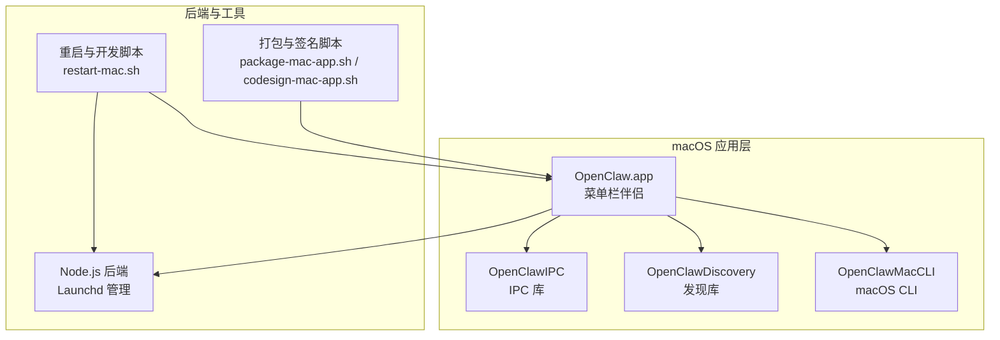
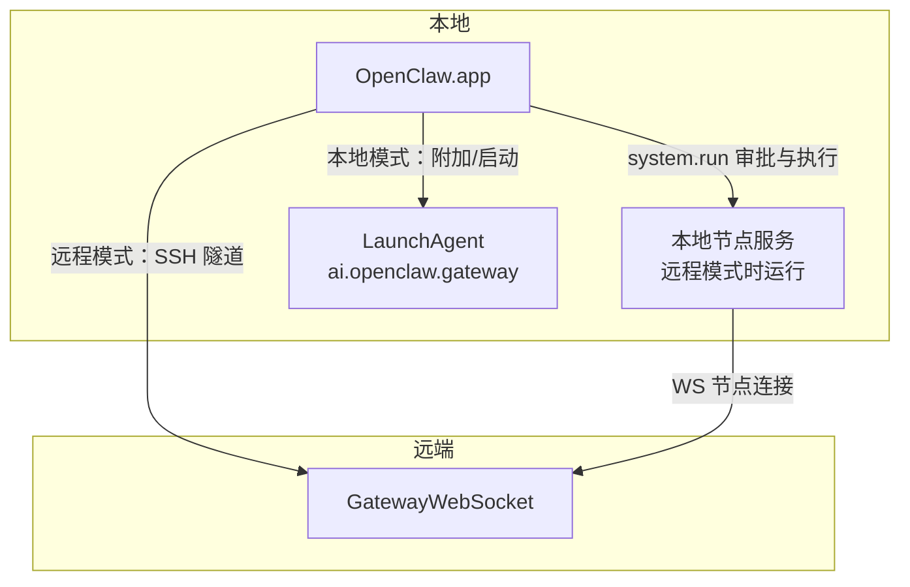
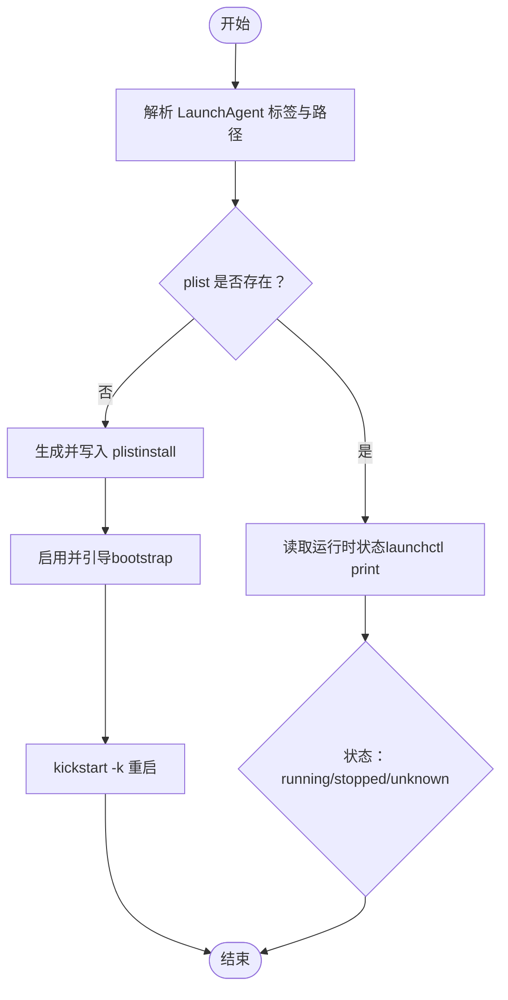
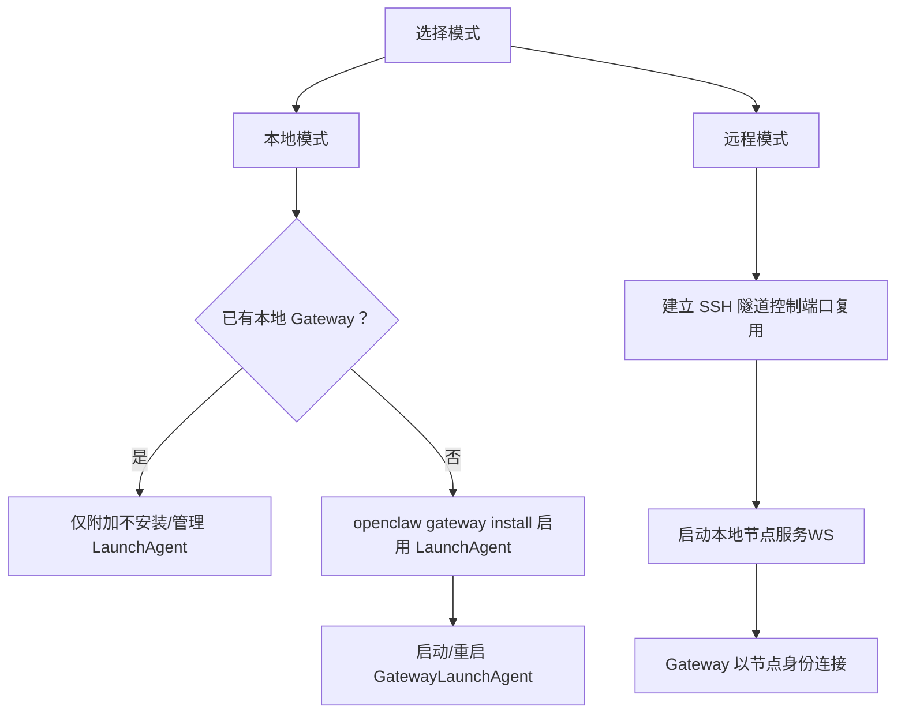
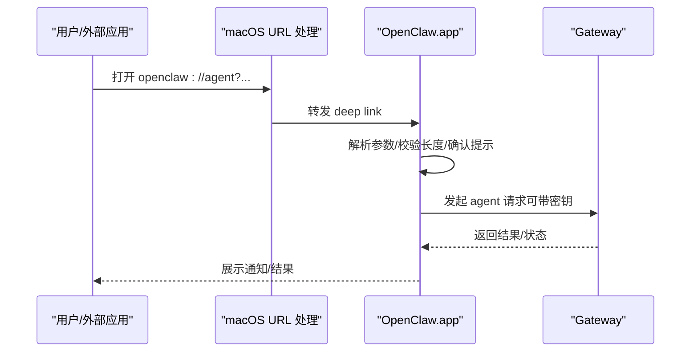
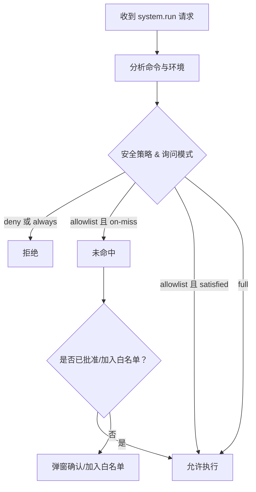
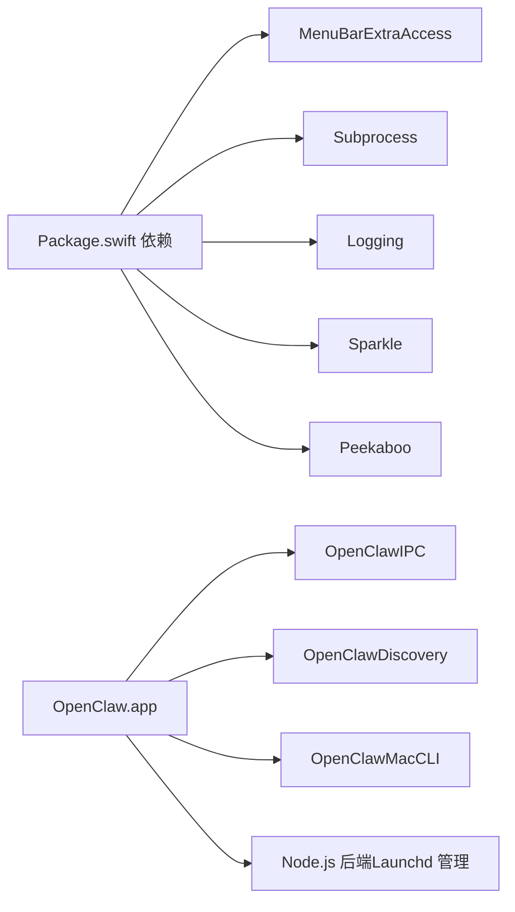

# macOS 安装与配置

<cite>
**本文引用的文件**
- [apps/macos/README.md](file://apps/macos/README.md)
- [apps/macos/Package.swift](file://apps/macos/Package.swift)
- [docs/platforms/macos.md](file://docs/platforms/macos.md)
- [docs/install/macos-vm.md](file://docs/install/macos-vm.md)
- [src/daemon/launchd.ts](file://src/daemon/launchd.ts)
- [apps/macos/Sources/OpenClaw/Resources/Info.plist](file://apps/macos/Sources/OpenClaw/Resources/Info.plist)
- [apps/macos/Sources/OpenClaw/DeepLinks.swift](file://apps/macos/Sources/OpenClaw/DeepLinks.swift)
- [apps/macos/Sources/OpenClaw/GatewayAutostartPolicy.swift](file://apps/macos/Sources/OpenClaw/GatewayAutostartPolicy.swift)
- [apps/macos/Sources/OpenClaw/DebugSettings.swift](file://apps/macos/Sources/OpenClaw/DebugSettings.swift)
- [scripts/restart-mac.sh](file://scripts/restart-mac.sh)
- [scripts/package-mac-app.sh](file://scripts/package-mac-app.sh)
- [src/infra/exec-approvals.ts](file://src/infra/exec-approvals.ts)
- [src/node-host/exec-policy.test.ts](file://src/node-host/exec-policy.test.ts)
</cite>

## 目录
1. [简介](#简介)
2. [项目结构](#项目结构)
3. [核心组件](#核心组件)
4. [架构总览](#架构总览)
5. [详细组件分析](#详细组件分析)
6. [依赖关系分析](#依赖关系分析)
7. [性能考量](#性能考量)
8. [故障排除指南](#故障排除指南)
9. [结论](#结论)
10. [附录](#附录)

## 简介
本指南面向在 macOS 上安装与配置 OpenClaw 的用户，聚焦于菜单栏伴侣应用（OpenClaw.app）的功能特性、权限管理（TCC）、Launchd 服务控制、本地与远程模式差异、Gateway 连接方式、节点服务管理、系统运行命令执行审批机制、深链接配置、状态目录放置建议、构建与开发工作流，以及连接性调试方法。

## 项目结构
OpenClaw 在 macOS 平台由 Swift 包构建，包含菜单栏应用、IPC 库、发现库与 CLI 工具；同时提供 Node.js 后端用于 Launchd 服务管理与打包脚本支持。

**图表来源**
- [apps/macos/Package.swift:6-16](file://apps/macos/Package.swift#L6-L16)
- [scripts/package-mac-app.sh:1-50](file://scripts/package-mac-app.sh#L1-L50)
- [scripts/restart-mac.sh:1-50](file://scripts/restart-mac.sh#L1-L50)

**章节来源**
- [apps/macos/Package.swift:1-93](file://apps/macos/Package.swift#L1-L93)
- [apps/macos/README.md:1-65](file://apps/macos/README.md#L1-L65)

## 核心组件
- 菜单栏伴侣（OpenClaw.app）
  - 显示通知与状态、统一处理 TCC 提示（通知、辅助功能、屏幕录制、麦克风、语音识别、自动化/AppleScript、位置、提醒事项等）。
  - 管理 Gateway（本地或远程），在本地模式下可自动安装/启动 LaunchAgent，在远程模式下通过 SSH 隧道连接并启动本地节点服务。
  - 暴露 macOS 特有能力（Canvas、Camera、Screen、system.run）作为节点能力。
  - 支持深链接 openclaw://agent 触发代理请求。
- Launchd 服务管理（Node.js）
  - 解析/写入 LaunchAgent，安装/卸载/重启/读取运行时状态，处理遗留标签迁移，确保日志路径安全。
- 打包与签名（Shell）
  - 构建 Swift 产物、复制资源、嵌入 Sparkle、签名、生成 .app。
- 开发与重启（Shell）
  - 清理进程、重建、重打包、按需签名、启动应用并验证。

**章节来源**
- [docs/platforms/macos.md:11-25](file://docs/platforms/macos.md#L11-L25)
- [src/daemon/launchd.ts:45-106](file://src/daemon/launchd.ts#L45-L106)
- [scripts/package-mac-app.sh:150-288](file://scripts/package-mac-app.sh#L150-L288)
- [scripts/restart-mac.sh:129-270](file://scripts/restart-mac.sh#L129-L270)

## 架构总览
OpenClaw 在 macOS 上以“菜单栏伴侣 + Gateway Broker”的形式运行：应用负责权限与节点能力暴露，Node 侧负责 Gateway 生命周期与 Launchd 控制；远程模式通过 SSH 隧道实现本地 UI 组件与远端 Gateway 的连通。

**图表来源**
- [docs/platforms/macos.md:26-34](file://docs/platforms/macos.md#L26-L34)
- [docs/platforms/macos.md:200-220](file://docs/platforms/macos.md#L200-L220)
- [src/daemon/launchd.ts:45-106](file://src/daemon/launchd.ts#L45-L106)

## 详细组件分析

### 菜单栏伴侣与权限管理（TCC）
- 应用注册深链接 openclaw://，并在 Info.plist 中声明各类 TCC 使用描述，便于首次运行时弹窗授权。
- 支持的权限类别包括：通知、屏幕录制、相机、麦克风、语音识别、自动化/AppleScript、位置、提醒事项等。
- 远程模式下，应用通过 SSH 隧道将本地 UI 组件与远端 Gateway 连通，避免直接暴露真实客户端 IP。

**章节来源**
- [apps/macos/Sources/OpenClaw/Resources/Info.plist:23-64](file://apps/macos/Sources/OpenClaw/Resources/Info.plist#L23-L64)
- [docs/platforms/macos.md:11-24](file://docs/platforms/macos.md#L11-L24)
- [docs/platforms/macos.md:200-220](file://docs/platforms/macos.md#L200-L220)

### Launchd 服务控制
- 解析 LaunchAgent 标签与 plist 路径，读取程序参数与日志路径。
- 支持安装、卸载、重启、打印运行时状态、修复引导失败、查找遗留标签并迁移。
- 处理 GUI 会话缺失错误提示，指导在有桌面登录会话的用户上下文中操作。

**图表来源**
- [src/daemon/launchd.ts:263-314](file://src/daemon/launchd.ts#L263-L314)
- [src/daemon/launchd.ts:461-528](file://src/daemon/launchd.ts#L461-L528)
- [src/daemon/launchd.ts:530-585](file://src/daemon/launchd.ts#L530-L585)

**章节来源**
- [src/daemon/launchd.ts:1-586](file://src/daemon/launchd.ts#L1-L586)

### 本地与远程模式
- 本地模式（默认）：若检测到已运行的 Gateway 则附加；否则通过 openclaw gateway install 启用 LaunchAgent。
- 远程模式：不启动本地 Gateway，仅通过 SSH 隧道连接远端 Gateway，并在本地启动节点服务以便远端访问本机能力。

**图表来源**
- [docs/platforms/macos.md:26-34](file://docs/platforms/macos.md#L26-L34)
- [docs/platforms/macos.md:200-220](file://docs/platforms/macos.md#L200-L220)

**章节来源**
- [docs/platforms/macos.md:26-34](file://docs/platforms/macos.md#L26-L34)

### 深链接 openclaw://agent
- 支持 openclaw://agent 动作，允许通过 URL 参数传递消息、会话键、思考模式、投递目标、超时与密钥。
- 无密钥时进行确认提示并限制消息长度；带有效密钥时可无打扰运行。
- 应用侧解析 URL 并触发代理请求，必要时弹窗确认。

**图表来源**
- [apps/macos/Sources/OpenClaw/DeepLinks.swift:57-103](file://apps/macos/Sources/OpenClaw/DeepLinks.swift#L57-L103)
- [apps/macos/Sources/OpenClaw/Resources/Info.plist:23-33](file://apps/macos/Sources/OpenClaw/Resources/Info.plist#L23-L33)
- [docs/platforms/macos.md:112-138](file://docs/platforms/macos.md#L112-L138)

**章节来源**
- [apps/macos/Sources/OpenClaw/DeepLinks.swift:1-107](file://apps/macos/Sources/OpenClaw/DeepLinks.swift#L1-L107)
- [apps/macos/Sources/OpenClaw/Resources/Info.plist:23-33](file://apps/macos/Sources/OpenClaw/Resources/Info.plist#L23-L33)
- [docs/platforms/macos.md:112-138](file://docs/platforms/macos.md#L112-L138)

### 系统运行命令执行审批（system.run）
- system.run 受“Exec approvals”策略控制，存储于本地 JSON 文件中，支持安全策略（deny/allowlist/full）、询问模式（off/on-miss/always）与白名单。
- 对包含特殊语法的原始 shell 命令按“未命中”处理，要求显式审批或允许特定 shell 二进制。
- 环境变量合并时进行过滤，对 shell 包装器仅保留有限白名单变量。

**图表来源**
- [src/infra/exec-approvals.ts:484-557](file://src/infra/exec-approvals.ts#L484-L557)
- [docs/platforms/macos.md:75-111](file://docs/platforms/macos.md#L75-L111)

**章节来源**
- [src/infra/exec-approvals.ts:484-557](file://src/infra/exec-approvals.ts#L484-L557)
- [src/node-host/exec-policy.test.ts:1-46](file://src/node-host/exec-policy.test.ts#L1-L46)
- [docs/platforms/macos.md:75-111](file://docs/platforms/macos.md#L75-L111)

### 构建与开发工作流
- 原生开发：在 apps/macos 目录使用 swift build/swift run；打包：scripts/package-mac-app.sh；快速重启：scripts/restart-mac.sh。
- 打包脚本负责 JS/UI 构建、复制资源、嵌入 Sparkle、签名与输出 .app。
- 开发脚本支持自动检测签名密钥、无签名快速流程、附加模式跳过 LaunchAgent 安装、等待 Gateway 端口检查等。

**章节来源**
- [apps/macos/README.md:1-65](file://apps/macos/README.md#L1-L65)
- [scripts/package-mac-app.sh:1-288](file://scripts/package-mac-app.sh#L1-L288)
- [scripts/restart-mac.sh:1-270](file://scripts/restart-mac.sh#L1-L270)

### 状态目录放置建议
- 避免将状态目录置于 iCloud 或其他云同步路径，防止同步竞争与延迟。
- 推荐使用本地非同步路径，如 ~/.openclaw；doctor 命令会检测并警告云同步路径。

**章节来源**
- [docs/platforms/macos.md:146-164](file://docs/platforms/macos.md#L146-L164)

### macOS VM 运行（隔离与 iMessage）
- 可在本地 Apple Silicon Mac 上使用 Lume 创建沙箱化 macOS VM，或使用托管 Mac 提供商。
- 在 VM 内安装 OpenClaw，配置通道与蓝泡泡（BlueBubbles）以获得 iMessage 能力。
- 支持克隆快照以快速恢复干净状态。

**章节来源**
- [docs/install/macos-vm.md:1-282](file://docs/install/macos-vm.md#L1-L282)

## 依赖关系分析
- Swift 包依赖：MenuBarExtraAccess、swift-subprocess、swift-log、Sparkle、Peekaboo 等。
- 应用与 Node.js 后端协作：应用负责 UI/TCC 与节点服务生命周期，Node.js 负责 LaunchAgent 安装/重启与日志路径管理。
- CLI 与应用：OpenClawMacCLI 与应用共享协议与工具库，支持独立调试 Gateway 连接与发现。

**图表来源**
- [apps/macos/Package.swift:17-57](file://apps/macos/Package.swift#L17-L57)

**章节来源**
- [apps/macos/Package.swift:1-93](file://apps/macos/Package.swift#L1-L93)

## 性能考量
- 远程模式通过 SSH 隧道复用控制端口，避免随机端口带来的不稳定；隧道使用 loopback，Gateway 将看到节点 IP 为 127.0.0.1。
- 本地模式下优先使用 LaunchAgent 自动启动，减少手动干预与启动延迟。
- 打包阶段合并多架构二进制与框架，保证发布包体积与兼容性。

**章节来源**
- [docs/platforms/macos.md:200-220](file://docs/platforms/macos.md#L200-L220)
- [scripts/package-mac-app.sh:190-218](file://scripts/package-mac-app.sh#L190-L218)

## 故障排除指南
- LaunchAgent 引导失败（GUI 会话缺失）
  - 现象：bootstrap/enable 失败，提示需要登录的 GUI 会话。
  - 处理：以目标用户登录桌面后重试 openclaw gateway install/restart。
- 无法连接 Gateway
  - 本地模式：确认 LaunchAgent 已安装并运行，或使用 openclaw gateway install/restart。
  - 远程模式：检查 SSH 隧道是否建立，确认 Gateway 地址与端口可达。
- 深链接被拦截或确认弹窗频繁
  - 无密钥时对长消息进行确认限制；短时间内的重复触发会被节流。
- 状态目录在云同步路径
  - doctor 命令会警告并建议迁移到本地非同步路径。

**章节来源**
- [src/daemon/launchd.ts:162-176](file://src/daemon/launchd.ts#L162-L176)
- [docs/platforms/macos.md:171-199](file://docs/platforms/macos.md#L171-L199)
- [apps/macos/Sources/OpenClaw/DeepLinks.swift:82-103](file://apps/macos/Sources/OpenClaw/DeepLinks.swift#L82-L103)

## 结论
OpenClaw 的 macOS 应用提供了完整的菜单栏伴侣体验，统一管理权限与 Gateway 生命周期，并在本地与远程模式间灵活切换。借助 Launchd 服务控制、深链接与系统运行审批机制，用户可在安全可控的前提下高效使用 macOS 特有能力与远端 Gateway 协同工作。推荐遵循状态目录放置建议与开发脚本流程，以获得稳定可靠的安装与调试体验。

## 附录

### 本地与远程模式对比速查
- 本地模式
  - 行为：附加现有 Gateway 或安装 LaunchAgent 启动。
  - 适用：本地 UI/浏览器自动化、无需远端 Gateway。
- 远程模式
  - 行为：SSH 隧道连接远端 Gateway，本地启动节点服务。
  - 适用：远端 Gateway + 本地 UI 能力组合。

**章节来源**
- [docs/platforms/macos.md:26-34](file://docs/platforms/macos.md#L26-L34)

### Launchd 控制速查
- 安装/卸载/重启/查看状态：通过 openclaw gateway install/restart/uninstall/status。
- 手动控制：launchctl kickstart/bootout 与 GUI 域标签。

**章节来源**
- [docs/platforms/macos.md:35-49](file://docs/platforms/macos.md#L35-L49)
- [src/daemon/launchd.ts:45-106](file://src/daemon/launchd.ts#L45-L106)

### 深链接参数参考
- openclaw://agent
  - 必填：message
  - 可选：sessionKey、thinking、deliver/to/channel、timeoutSeconds、key
  - 安全：无 key 时限制消息长度并弹窗确认；有 key 时可无打扰运行。

**章节来源**
- [docs/platforms/macos.md:112-138](file://docs/platforms/macos.md#L112-L138)
- [apps/macos/Sources/OpenClaw/DeepLinks.swift:75-103](file://apps/macos/Sources/OpenClaw/DeepLinks.swift#L75-L103)

### 构建与开发命令
- 原生开发：swift build / swift run OpenClaw
- 打包：scripts/package-mac-app.sh
- 快速重启：scripts/restart-mac.sh（支持 --no-sign/--sign/--attach-only）

**章节来源**
- [apps/macos/README.md:1-65](file://apps/macos/README.md#L1-L65)
- [scripts/package-mac-app.sh:1-50](file://scripts/package-mac-app.sh#L1-L50)
- [scripts/restart-mac.sh:80-110](file://scripts/restart-mac.sh#L80-L110)