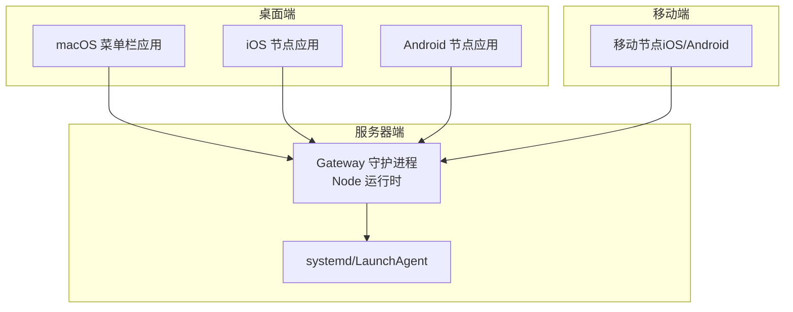
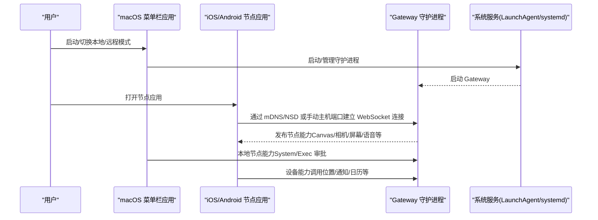
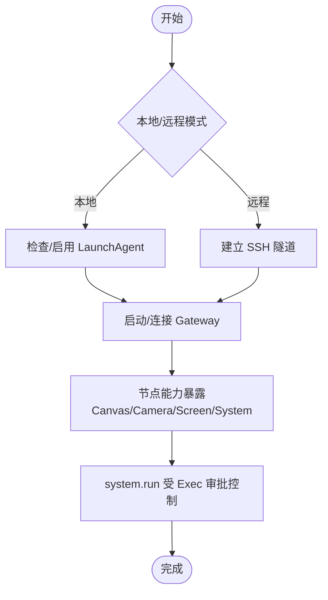
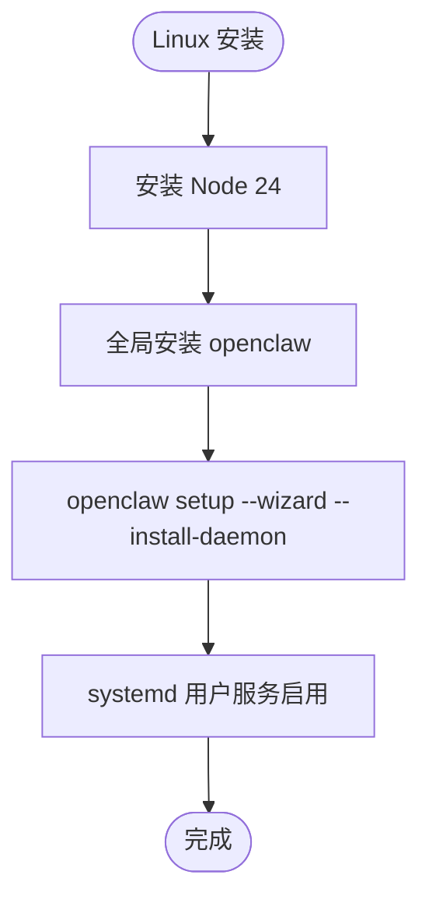
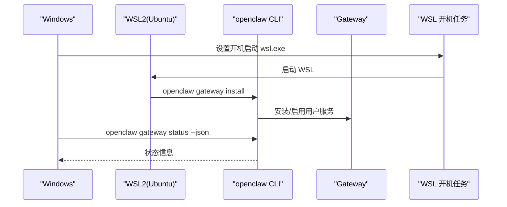
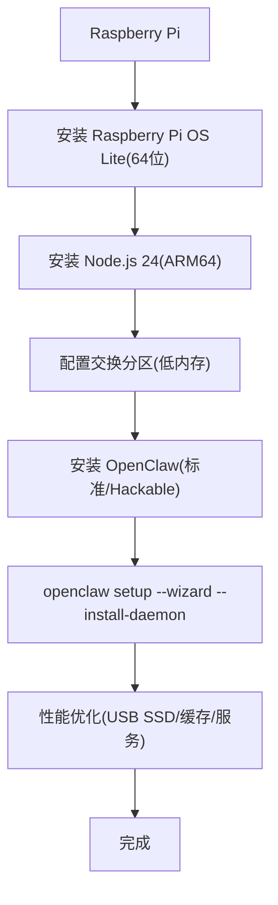
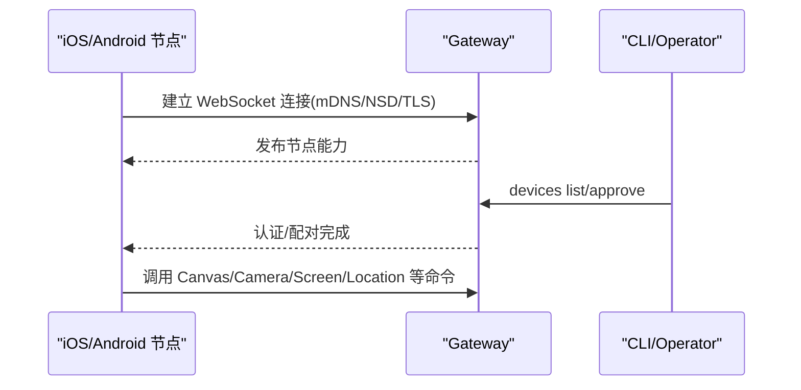
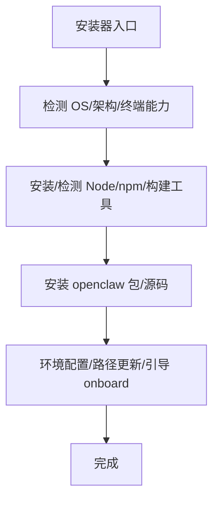
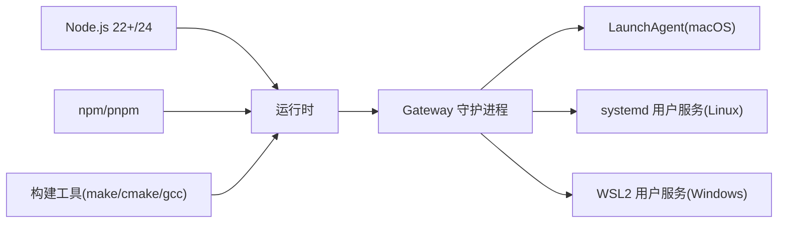

# 平台特定安装

<cite>
**本文引用的文件**
- [docs/platforms/index.md](file://docs/platforms/index.md)
- [docs/platforms/macos.md](file://docs/platforms/macos.md)
- [docs/platforms/linux.md](file://docs/platforms/linux.md)
- [docs/platforms/windows.md](file://docs/platforms/windows.md)
- [docs/platforms/raspberry-pi.md](file://docs/platforms/raspberry-pi.md)
- [docs/platforms/android.md](file://docs/platforms/android.md)
- [docs/platforms/ios.md](file://docs/platforms/ios.md)
- [scripts/install.sh](file://scripts/install.sh)
- [scripts/install.ps1](file://scripts/install.ps1)
- [apps/macos/README.md](file://apps/macos/README.md)
- [apps/android/README.md](file://apps/android/README.md)
- [apps/ios/README.md](file://apps/ios/README.md)
- [scripts/setup-auth-system.sh](file://scripts/setup-auth-system.sh)
- [scripts/sandbox-setup.sh](file://scripts/sandbox-setup.sh)
</cite>

## 目录
1. [简介](#简介)
2. [项目结构](#项目结构)
3. [核心组件](#核心组件)
4. [架构总览](#架构总览)
5. [详细组件分析](#详细组件分析)
6. [依赖关系分析](#依赖关系分析)
7. [性能考虑](#性能考虑)
8. [故障排查指南](#故障排查指南)
9. [结论](#结论)
10. [附录](#附录)

## 简介
本指南面向在 macOS、Linux、Windows（WSL2）与 Raspberry Pi 上安装与配置 OpenClaw 的用户，覆盖桌面应用、移动节点应用以及嵌入式设备部署路径。内容基于仓库内官方文档与安装脚本，聚焦平台差异、依赖项、权限与系统集成、兼容性与性能优化、安全配置等关键点。

## 项目结构
OpenClaw 提供统一的 TypeScript 核心与多端配套应用：
- 守护进程（Gateway）：跨平台运行，推荐 Node 作为运行时；Bun 不建议用于 Gateway（存在已知问题）。
- 桌面应用：macOS 菜单栏应用（本地/远程模式、LaunchAgent 管理、系统能力暴露、Exec 审批）。
- 移动节点：iOS 与 Android 应用（连接 Gateway、Canvas/A2UI、相机/屏幕/语音等能力）。
- 嵌入式与服务器：Linux（systemd 用户服务）、Windows（WSL2 推荐）、Raspberry Pi（持久化、性能优化、ARM 兼容性）。

**图表来源**
- [docs/platforms/index.md:11-54](file://docs/platforms/index.md#L11-L54)
- [docs/platforms/macos.md:9-24](file://docs/platforms/macos.md#L9-L24)
- [docs/platforms/android.md:10-20](file://docs/platforms/android.md#L10-L20)
- [docs/platforms/ios.md:10-18](file://docs/platforms/ios.md#L10-L18)

**章节来源**
- [docs/platforms/index.md:9-54](file://docs/platforms/index.md#L9-L54)

## 核心组件
- 守护进程（Gateway）
  - 推荐使用 Node 作为运行时；Bun 不建议用于 Gateway。
  - 支持 systemd 用户服务（Linux）、LaunchAgent（macOS），以及 WSL2（Windows）。
- 桌面应用（macOS）
  - 菜单栏状态与通知、TCC 权限管理、本地/远程模式、Exec 审批策略、节点能力（Canvas、Camera、Screen、System）。
- 移动节点应用
  - iOS：Canvas、屏幕快照、相机、位置、语音唤醒/对话模式、推送（官方构建通过中继）。
  - Android：Canvas、相机、语音、前台服务保持连接、设备能力（联系人、日历、运动等）。
- 嵌入式与服务器
  - Linux：systemd 用户服务最小示例与启用方式。
  - Windows：WSL2 推荐路径；原生 Windows CLI 逐步完善但建议通过 WSL2 使用。
  - Raspberry Pi：低成本自托管、性能优化、ARM 兼容性、自动启动与监控。

**章节来源**
- [docs/platforms/index.md:11-16](file://docs/platforms/index.md#L11-L16)
- [docs/platforms/linux.md:11-14](file://docs/platforms/linux.md#L11-L14)
- [docs/platforms/windows.md:11-17](file://docs/platforms/windows.md#L11-L17)
- [docs/platforms/raspberry-pi.md:10-14](file://docs/platforms/raspberry-pi.md#L10-L14)

## 架构总览
下图展示 Gateway 与各端的关系及控制流（桌面/移动/嵌入式）：

**图表来源**
- [docs/platforms/macos.md:26-33](file://docs/platforms/macos.md#L26-L33)
- [docs/platforms/android.md:26-39](file://docs/platforms/android.md#L26-L39)
- [docs/platforms/ios.md:20-27](file://docs/platforms/ios.md#L20-L27)

## 详细组件分析

### macOS 安装与配置
- 角色与职责
  - 菜单栏状态与通知、TCC 权限（通知、无障碍、屏幕录制、麦克风、语音识别、自动化/AppleScript）。
  - 管理 Gateway（本地或远程），暴露 macOS 特有能力（Canvas、Camera、Screen、system.run）。
  - 在远程模式下启动本地节点宿主服务，在本地模式下停止。
- 本地/远程模式
  - 本地：默认模式，若无本地 Gateway 则通过 openclaw gateway install 启用 LaunchAgent。
  - 远程：通过 SSH 隧道连接远端 Gateway，不启动本地进程。
- LaunchAgent 控制
  - 标签：ai.openclaw.gateway 或 ai.openclaw.<profile>；支持 kickstart/bootout。
- 节点能力
  - Canvas、Camera、Screen、System（system.run）。
  - system.run 受 Exec 审批控制，存储于本地 JSON 文件并支持允许列表与环境变量过滤。
- 深链接
  - openclaw://agent 支持消息触发与可选参数（会话键、思考模式、投递目标、超时、密钥）。
- 状态目录建议
  - 避免 iCloud 同步路径，优先本地非同步路径（如 ~/.openclaw）。
- 开发与打包
  - Swift 构建、打包脚本、签名行为与团队 ID 审核、库验证绕过（仅开发）。

**图表来源**
- [docs/platforms/macos.md:35-49](file://docs/platforms/macos.md#L35-L49)
- [docs/platforms/macos.md:75-111](file://docs/platforms/macos.md#L75-L111)

**章节来源**
- [docs/platforms/macos.md:9-24](file://docs/platforms/macos.md#L9-L24)
- [docs/platforms/macos.md:26-33](file://docs/platforms/macos.md#L26-L33)
- [docs/platforms/macos.md:35-49](file://docs/platforms/macos.md#L35-L49)
- [docs/platforms/macos.md:50-74](file://docs/platforms/macos.md#L50-L74)
- [docs/platforms/macos.md:75-111](file://docs/platforms/macos.md#L75-L111)
- [docs/platforms/macos.md:112-138](file://docs/platforms/macos.md#L112-L138)
- [docs/platforms/macos.md:146-164](file://docs/platforms/macos.md#L146-L164)
- [apps/macos/README.md:17-24](file://apps/macos/README.md#L17-L24)
- [apps/macos/README.md:25-65](file://apps/macos/README.md#L25-L65)

### Linux 安装与配置
- 运行时与推荐路径
  - 推荐 Node；Bun 不建议用于 Gateway。
- 快速入门（VPS）
  - 安装 Node 24；全局安装 openclaw；使用 openclaw setup --wizard --install-daemon；SSH 端口转发访问仪表盘。
- 安装与更新
  - Getting Started、更新与可选路径（Bun、Nix、Docker）。
- 守护进程安装（CLI）
  - wizard、gateway install、configure 流程；doctor 修复迁移。
- systemd 用户服务
  - 默认安装为用户服务；共享/常驻服务器可用系统服务；提供最小单元示例与启用方式。

**图表来源**
- [docs/platforms/linux.md:16-25](file://docs/platforms/linux.md#L16-L25)
- [docs/platforms/linux.md:26-31](file://docs/platforms/linux.md#L26-L31)
- [docs/platforms/linux.md:37-63](file://docs/platforms/linux.md#L37-L63)
- [docs/platforms/linux.md:65-95](file://docs/platforms/linux.md#L65-L95)

**章节来源**
- [docs/platforms/linux.md:9-14](file://docs/platforms/linux.md#L9-L14)
- [docs/platforms/linux.md:16-25](file://docs/platforms/linux.md#L16-L25)
- [docs/platforms/linux.md:26-31](file://docs/platforms/linux.md#L26-L31)
- [docs/platforms/linux.md:37-63](file://docs/platforms/linux.md#L37-L63)
- [docs/platforms/linux.md:65-95](file://docs/platforms/linux.md#L65-L95)

### Windows（WSL2）安装与配置
- 推荐路径
  - 通过 WSL2（Ubuntu）安装与使用；CLI + Gateway 在 Linux 内运行，工具链更兼容。
- 原生 Windows 状态
  - CLI 功能逐步改善；Scheduled Tasks 优先（若可用）；被阻止时回退到用户启动项。
- 守护进程安装（CLI）
  - wizard、gateway install、configure；doctor 修复迁移。
- 自动启动（Windows 登录前）
  - 在 WSL 中启用 linger；安装用户服务；以管理员身份创建开机启动任务；验证链路。
- 高级：WSL 服务对外暴露（portproxy）
  - 管理员权限刷新端口转发规则；防火墙放通；注意监听地址与可达性。

**图表来源**
- [docs/platforms/windows.md:68-95](file://docs/platforms/windows.md#L68-L95)
- [docs/platforms/windows.md:96-139](file://docs/platforms/windows.md#L96-L139)
- [docs/platforms/windows.md:140-184](file://docs/platforms/windows.md#L140-L184)

**章节来源**
- [docs/platforms/windows.md:9-17](file://docs/platforms/windows.md#L9-L17)
- [docs/platforms/windows.md:25-46](file://docs/platforms/windows.md#L25-L46)
- [docs/platforms/windows.md:68-95](file://docs/platforms/windows.md#L68-L95)
- [docs/platforms/windows.md:96-139](file://docs/platforms/windows.md#L96-L139)
- [docs/platforms/windows.md:140-184](file://docs/platforms/windows.md#L140-L184)

### Raspberry Pi 安装与配置
- 目标与硬件要求
  - 低成本自托管（约 $35-80 一次性成本），适合 24/7 个人助手、家庭自动化、Telegram/WhatsApp 机器人。
  - 推荐 Pi 4/5（2GB+ RAM，64 位 OS，16GB+ 存储或 USB SSD）。
- 系统准备
  - 使用 Raspberry Pi OS Lite（64 位）；启用 SSH；设置时区。
- 安装 Node.js 24（ARM64）
  - 通过 NodeSource 安装；验证版本。
- 交换分区（对低内存设备）
  - 创建并启用交换文件；写入 fstab；降低 swappiness。
- 安装 OpenClaw
  - 标准安装（推荐）或 hackable 安装（便于调试 ARM 问题）。
- 引导向导
  - 本地模式、API 密钥认证、首选频道（Telegram）、安装守护进程。
- 验证与访问
  - openclaw status、systemctl 状态、journalctl 日志；SSH 隧道访问仪表盘。
- 性能优化
  - 使用 USB SSD；启用 Node 模块编译缓存；systemd 服务微调；禁用 GPU/蓝牙（如不需要）。
- ARM 兼容性
  - 大多数功能在 ARM64 正常工作；部分外部二进制需 ARM 构建。
- 自动启动
  - 验证/启用 systemd 服务。

**图表来源**
- [docs/platforms/raspberry-pi.md:44-64](file://docs/platforms/raspberry-pi.md#L44-L64)
- [docs/platforms/raspberry-pi.md:79-89](file://docs/platforms/raspberry-pi.md#L79-L89)
- [docs/platforms/raspberry-pi.md:91-108](file://docs/platforms/raspberry-pi.md#L91-L108)
- [docs/platforms/raspberry-pi.md:110-135](file://docs/platforms/raspberry-pi.md#L110-L135)
- [docs/platforms/raspberry-pi.md:185-244](file://docs/platforms/raspberry-pi.md#L185-L244)

**章节来源**
- [docs/platforms/raspberry-pi.md:10-35](file://docs/platforms/raspberry-pi.md#L10-L35)
- [docs/platforms/raspberry-pi.md:44-64](file://docs/platforms/raspberry-pi.md#L44-L64)
- [docs/platforms/raspberry-pi.md:79-89](file://docs/platforms/raspberry-pi.md#L79-L89)
- [docs/platforms/raspberry-pi.md:91-108](file://docs/platforms/raspberry-pi.md#L91-L108)
- [docs/platforms/raspberry-pi.md:110-135](file://docs/platforms/raspberry-pi.md#L110-L135)
- [docs/platforms/raspberry-pi.md:143-154](file://docs/platforms/raspberry-pi.md#L143-L154)
- [docs/platforms/raspberry-pi.md:156-181](file://docs/platforms/raspberry-pi.md#L156-L181)
- [docs/platforms/raspberry-pi.md:185-244](file://docs/platforms/raspberry-pi.md#L185-L244)
- [docs/platforms/raspberry-pi.md:274-298](file://docs/platforms/raspberry-pi.md#L274-L298)
- [docs/platforms/raspberry-pi.md:322-336](file://docs/platforms/raspberry-pi.md#L322-L336)

### 移动应用配置（iOS 与 Android）
- iOS 节点应用
  - 连接 Gateway（LAN 或 tailnet）、Canvas、屏幕快照、相机、位置、语音唤醒/对话模式。
  - 官方构建使用推送中继（APNs 委托），避免直接暴露生产 APNs 凭据。
  - 发现路径：Bonjour（LAN）、Tailnet（跨网络）、手动主机端口。
- Android 节点应用
  - 连接 Gateway（LAN 或 tailnet）、Canvas、相机、语音、前台服务保持连接。
  - 设备能力：通知、联系人、日历、运动、照片等（受权限限制）。
  - 连接流程：启动 Gateway、在应用中选择发现或手动主机端口、批准配对请求、验证节点状态。

**图表来源**
- [docs/platforms/ios.md:20-51](file://docs/platforms/ios.md#L20-L51)
- [docs/platforms/ios.md:160-174](file://docs/platforms/ios.md#L160-L174)
- [docs/platforms/android.md:26-99](file://docs/platforms/android.md#L26-L99)

**章节来源**
- [docs/platforms/ios.md:10-18](file://docs/platforms/ios.md#L10-L18)
- [docs/platforms/ios.md:20-51](file://docs/platforms/ios.md#L20-L51)
- [docs/platforms/ios.md:52-99](file://docs/platforms/ios.md#L52-L99)
- [docs/platforms/ios.md:100-159](file://docs/platforms/ios.md#L100-L159)
- [docs/platforms/ios.md:160-174](file://docs/platforms/ios.md#L160-L174)
- [docs/platforms/ios.md:175-217](file://docs/platforms/ios.md#L175-L217)
- [docs/platforms/android.md:10-20](file://docs/platforms/android.md#L10-L20)
- [docs/platforms/android.md:26-99](file://docs/platforms/android.md#L26-L99)
- [docs/platforms/android.md:101-114](file://docs/platforms/android.md#L101-L114)
- [docs/platforms/android.md:123-155](file://docs/platforms/android.md#L123-L155)
- [docs/platforms/android.md:156-168](file://docs/platforms/android.md#L156-L168)

### 安装脚本与系统服务
- macOS/Linux 安装器（install.sh）
  - 支持检测 OS/架构、下载器选择、gum UI 引导、Node/npm 依赖、自动安装构建工具（Linux/macOS）、错误诊断与重试。
- Windows 安装器（install.ps1）
  - PowerShell 脚本，处理执行策略、Node/Git 安装、npm/git 安装方式、环境变量更新、提示 onboard。
- 认证系统设置（setup-auth-system.sh）
  - 长效 Claude Code Token、认证监控（定时器）、通知通道（ntfy、OpenClaw 消息）、Termux 小部件。
- Sandbox 构建（sandbox-setup.sh）
  - 构建 openclaw-sandbox:bookworm-slim Docker 镜像。

**图表来源**
- [scripts/install.sh:254-270](file://scripts/install.sh#L254-L270)
- [scripts/install.sh:657-673](file://scripts/install.sh#L657-L673)
- [scripts/install.ps1:300-360](file://scripts/install.ps1#L300-L360)

**章节来源**
- [scripts/install.sh:1-800](file://scripts/install.sh#L1-L800)
- [scripts/install.ps1:1-360](file://scripts/install.ps1#L1-L360)
- [scripts/setup-auth-system.sh:1-120](file://scripts/setup-auth-system.sh#L1-L120)
- [scripts/sandbox-setup.sh:1-8](file://scripts/sandbox-setup.sh#L1-L8)

## 依赖关系分析
- 运行时与包管理
  - Node 22+（推荐 24）；npm/pnpm；必要时自动安装构建工具（make/cmake/gcc 等）。
- 平台特定依赖
  - macOS：Xcode 命令行工具、cmake（brew 可选）。
  - Linux：apt/pacman/dnf/yum/apk 包管理器对应的 build-essential/python3/make/g++/cmake。
  - Windows：WSL2（推荐）；若原生 Windows，需处理执行策略与 Scheduled Tasks 回退。
- 系统服务
  - macOS：LaunchAgent（ai.openclaw.gateway 或带 profile 的标签）。
  - Linux：systemd 用户服务（openclaw-gateway[-<profile>].service）。
  - Windows：WSL2 用户服务；Windows 登录前链路通过开机任务与 linger。

**图表来源**
- [docs/platforms/index.md:11-16](file://docs/platforms/index.md#L11-L16)
- [scripts/install.sh:623-655](file://scripts/install.sh#L623-L655)
- [scripts/install.sh:569-621](file://scripts/install.sh#L569-L621)
- [docs/platforms/macos.md:35-49](file://docs/platforms/macos.md#L35-L49)
- [docs/platforms/linux.md:65-95](file://docs/platforms/linux.md#L65-L95)
- [docs/platforms/windows.md:96-139](file://docs/platforms/windows.md#L96-L139)

**章节来源**
- [docs/platforms/index.md:11-16](file://docs/platforms/index.md#L11-L16)
- [scripts/install.sh:569-655](file://scripts/install.sh#L569-L655)
- [docs/platforms/macos.md:35-49](file://docs/platforms/macos.md#L35-L49)
- [docs/platforms/linux.md:65-95](file://docs/platforms/linux.md#L65-L95)
- [docs/platforms/windows.md:96-139](file://docs/platforms/windows.md#L96-L139)

## 性能考虑
- macOS
  - LaunchAgent 生命周期与本地/远程模式切换；system.run 通过本地 Unix Socket 执行，减少跨进程开销。
- Linux
  - systemd 用户服务最小化重启抖动；合理 TimeoutStartSec；稳定环境变量。
- Windows（WSL2）
  - 启用 linger；开机任务；端口转发（portproxy）；防火墙放通；避免阻塞。
- Raspberry Pi
  - 使用 USB SSD；启用 Node 模块编译缓存；降低内存占用（禁用 GPU/蓝牙）；监控资源（内存/CPU 温度）。
- 移动端
  - Canvas/A2UI 命令需前台激活；语音功能在后台受限；尽量使用前台服务与最佳实践。

**章节来源**
- [docs/platforms/macos.md:61-74](file://docs/platforms/macos.md#L61-L74)
- [docs/platforms/linux.md:65-95](file://docs/platforms/linux.md#L65-L95)
- [docs/platforms/windows.md:140-184](file://docs/platforms/windows.md#L140-L184)
- [docs/platforms/raspberry-pi.md:185-244](file://docs/platforms/raspberry-pi.md#L185-L244)
- [docs/platforms/android.md:156-168](file://docs/platforms/android.md#L156-L168)
- [docs/platforms/ios.md:200-204](file://docs/platforms/ios.md#L200-L204)

## 故障排查指南
- macOS
  - LaunchAgent 未安装：通过 openclaw gateway install 启用；或手动 kickstart/bootout。
  - Exec 审批：检查 ~/.openclaw/exec-approvals.json；允许列表与环境变量过滤。
  - 状态目录：避免 iCloud 同步路径，必要时迁移到本地路径。
- Linux
  - systemd 用户服务：确认单元文件与启用状态；查看 journalctl 输出。
  - 守护进程安装：使用 wizard、gateway install、configure 或 doctor。
- Windows（WSL2）
  - Scheduled Tasks 被拒：回退到用户启动项；必要时快速失败避免挂起。
  - 登录前启动：确保 linger、开机任务、WSL 自启动；验证用户服务状态。
  - 端口转发：管理员权限刷新 portproxy；放通防火墙。
- Raspberry Pi
  - OOM：增加交换分区；减少服务；检查 CPU 降频。
  - 性能慢：使用 USB SSD；禁用无关服务；检查 WiFi 电源管理。
  - ARM 二进制：检查是否具备 ARM64 构建；必要时从源码构建或使用容器。
- 移动端
  - iOS：前台模式为佳；配对/认证错误会暂停重连；检查 Discovery 日志与手动主机端口。
  - Android：前台服务保持连接；相机/屏幕命令需前台激活；批准配对请求。

**章节来源**
- [docs/platforms/macos.md:35-49](file://docs/platforms/macos.md#L35-L49)
- [docs/platforms/macos.md:75-111](file://docs/platforms/macos.md#L75-L111)
- [docs/platforms/macos.md:146-164](file://docs/platforms/macos.md#L146-L164)
- [docs/platforms/linux.md:37-63](file://docs/platforms/linux.md#L37-L63)
- [docs/platforms/linux.md:65-95](file://docs/platforms/linux.md#L65-L95)
- [docs/platforms/windows.md:39-62](file://docs/platforms/windows.md#L39-L62)
- [docs/platforms/windows.md:96-139](file://docs/platforms/windows.md#L96-L139)
- [docs/platforms/windows.md:140-184](file://docs/platforms/windows.md#L140-L184)
- [docs/platforms/raspberry-pi.md:339-388](file://docs/platforms/raspberry-pi.md#L339-L388)
- [docs/platforms/ios.md:205-211](file://docs/platforms/ios.md#L205-L211)
- [docs/platforms/android.md:220-228](file://docs/platforms/android.md#L220-L228)

## 结论
OpenClaw 在多平台上提供了统一的 Gateway 与多端节点体验。通过官方文档与安装脚本，用户可在 macOS、Linux、Windows（WSL2）与 Raspberry Pi 上完成安装与配置，并结合桌面应用与移动节点实现本地/远程协同。针对各平台的权限、系统服务与性能优化，建议遵循本文档的步骤与最佳实践，以获得稳定可靠的运行体验。

## 附录
- 安全配置要点
  - macOS：Exec 审批策略、system.run 环境变量过滤、深链接密钥保护。
  - iOS：官方构建通过推送中继绑定网关身份，避免直接暴露 APNs 凭据。
  - Linux/Windows：systemd 用户服务最小权限；WSL 端口转发防火墙放通。
  - Raspberry Pi：禁用不必要的服务；监控资源与温度；ARM 兼容性测试。
- 认证与运维
  - setup-auth-system.sh：长时效 Token、认证监控定时器、通知通道与 Termux 小部件。
  - sandbox-setup.sh：构建沙箱镜像，便于隔离测试。

**章节来源**
- [docs/platforms/macos.md:75-111](file://docs/platforms/macos.md#L75-L111)
- [docs/platforms/ios.md:100-159](file://docs/platforms/ios.md#L100-L159)
- [scripts/setup-auth-system.sh:1-120](file://scripts/setup-auth-system.sh#L1-L120)
- [scripts/sandbox-setup.sh:1-8](file://scripts/sandbox-setup.sh#L1-L8)