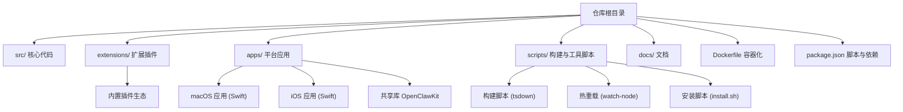
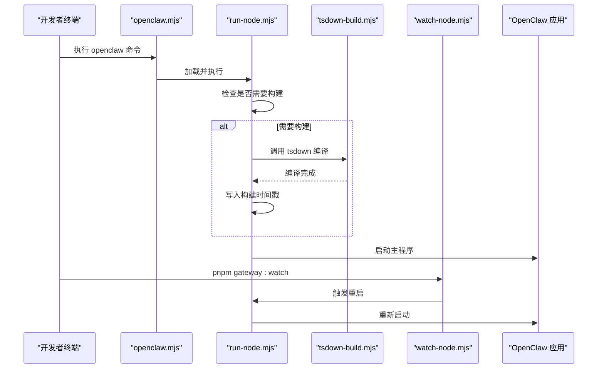
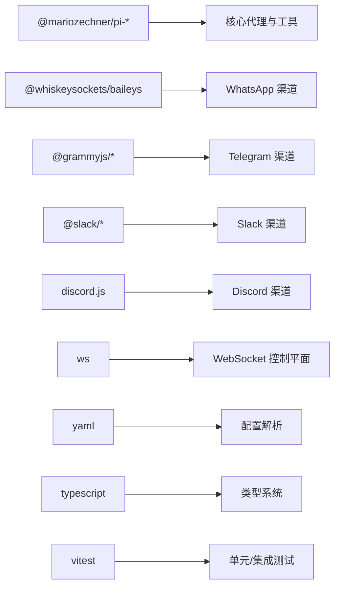

# 源码编译安装

<cite>
**本文档引用的文件**
- [README.md](file://README.md)
- [CONTRIBUTING.md](file://CONTRIBUTING.md)
- [package.json](file://package.json)
- [Dockerfile](file://Dockerfile)
- [scripts/install.sh](file://scripts/install.sh)
- [scripts/build-and-run-mac.sh](file://scripts/build-and-run-mac.sh)
- [scripts/run-node.mjs](file://scripts/run-node.mjs)
- [scripts/watch-node.mjs](file://scripts/watch-node.mjs)
- [scripts/tsdown-build.mjs](file://scripts/tsdown-build.mjs)
- [openclaw.mjs](file://openclaw.mjs)
- [tsconfig.json](file://tsconfig.json)
- [apps/macos/Package.swift](file://apps/macos/Package.swift)
- [Swabble/Package.swift](file://Swabble/Package.swift)
</cite>

## 目录
1. [简介](#简介)
2. [项目结构](#项目结构)
3. [核心组件](#核心组件)
4. [架构总览](#架构总览)
5. [详细组件分析](#详细组件分析)
6. [依赖关系分析](#依赖关系分析)
7. [性能考虑](#性能考虑)
8. [故障排除指南](#故障排除指南)
9. [结论](#结论)
10. [附录](#附录)

## 简介
本指南面向希望从源码编译并安装 OpenClaw 的开发者与贡献者，覆盖从 GitHub 克隆仓库、安装依赖、构建项目到链接 CLI 的完整流程。文档同时提供开发环境配置、构建脚本执行、调试模式设置、贡献者工作流、热重载配置以及本地测试环境搭建，并针对常见构建错误（依赖缺失、编译失败、权限问题）提供解决方案。

## 项目结构
OpenClaw 采用多语言混合架构：核心以 TypeScript/JavaScript 实现，CLI 通过 Node.js 运行；macOS 应用使用 Swift 构建；Swabble 子项目提供语音唤醒与语音处理能力；Dockerfile 提供容器化运行方案；大量脚本用于构建、打包、热重载与测试。

图表来源
- [package.json:1-481](file://package.json#L1-L481)
- [apps/macos/Package.swift:1-93](file://apps/macos/Package.swift#L1-L93)
- [Swabble/Package.swift:1-56](file://Swabble/Package.swift#L1-L56)

章节来源
- [package.json:1-481](file://package.json#L1-L481)
- [README.md:92-111](file://README.md#L92-L111)

## 核心组件
- CLI 启动入口：openclaw.mjs 负责 Node 版本校验、编译缓存启用与入口模块加载。
- 构建系统：基于 pnpm 的 tsdown 编译管线，生成 dist/ 输出。
- 开发运行时：run-node.mjs 在开发模式下自动检测变更并触发增量构建。
- 热重载：watch-node.mjs 基于 chokidar 监听源文件变化，支持自动重启。
- macOS 应用：Swift 工程，集成 IPC、发现、菜单栏控制与 Sparkle 更新。
- 安装脚本：install.sh 支持 macOS/Linux 自动检测环境、下载与验证、安装依赖与 CLI。

章节来源
- [openclaw.mjs:1-90](file://openclaw.mjs#L1-L90)
- [scripts/tsdown-build.mjs:1-21](file://scripts/tsdown-build.mjs#L1-L21)
- [scripts/run-node.mjs:1-367](file://scripts/run-node.mjs#L1-L367)
- [scripts/watch-node.mjs:1-152](file://scripts/watch-node.mjs#L1-L152)
- [apps/macos/Package.swift:1-93](file://apps/macos/Package.swift#L1-L93)
- [scripts/install.sh:1-800](file://scripts/install.sh#L1-L800)

## 架构总览
OpenClaw 的开发与运行路径由以下关键节点构成：版本检查 → 构建 → 运行 → 热重载。CLI 作为统一入口，开发模式下通过 run-node.mjs 驱动 tsdown 编译，watch-node.mjs 则在文件变更时触发重启。

图表来源
- [openclaw.mjs:1-90](file://openclaw.mjs#L1-L90)
- [scripts/run-node.mjs:306-357](file://scripts/run-node.mjs#L306-L357)
- [scripts/tsdown-build.mjs:1-21](file://scripts/tsdown-build.mjs#L1-L21)
- [scripts/watch-node.mjs:79-95](file://scripts/watch-node.mjs#L79-L95)

## 详细组件分析

### CLI 启动与版本校验
- Node 版本要求：最小版本为 22.12，若不满足会输出提示并退出。
- 编译缓存：在支持的环境下启用 compile cache 以提升启动速度。
- 入口加载：优先尝试 dist/entry.js 或 dist/entry.mjs，否则抛出缺失构建产物的错误。

章节来源
- [openclaw.mjs:5-36](file://openclaw.mjs#L5-L36)
- [openclaw.mjs:38-45](file://openclaw.mjs#L38-L45)
- [openclaw.mjs:83-89](file://openclaw.mjs#L83-L89)

### 构建系统与脚本
- 构建命令：package.json 中的 build 脚本串联 A2UI 打包、tsdown 编译、运行时后处理、插件 SDK 类型生成等步骤。
- tsdown 构建：通过 tsdown-build.mjs 调用 pnpm exec tsdown，支持日志级别控制。
- TypeScript 配置：tsconfig.json 指定 NodeNext 模块解析、严格模式、装饰器兼容等。

章节来源
- [package.json:224-228](file://package.json#L224-L228)
- [scripts/tsdown-build.mjs:1-21](file://scripts/tsdown-build.mjs#L1-L21)
- [tsconfig.json:1-30](file://tsconfig.json#L1-L30)

### 开发运行与热重载
- run-node.mjs：
  - 监控 src/ 与 extensions/ 变更，结合 .buildstamp 与 git HEAD 判断是否需要重建。
  - 自动同步运行时产物，写入构建时间戳后启动 CLI。
- watch-node.mjs：
  - 使用 chokidar 监听受关注路径，文件变更时向子进程发送 SIGTERM 触发重启。
  - 支持通过环境变量开启 watch 模式与自定义命令。

章节来源
- [scripts/run-node.mjs:213-253](file://scripts/run-node.mjs#L213-L253)
- [scripts/run-node.mjs:327-356](file://scripts/run-node.mjs#L327-L356)
- [scripts/watch-node.mjs:79-109](file://scripts/watch-node.mjs#L79-L109)

### macOS 应用构建
- Swift 工程：apps/macos/Package.swift 定义了 OpenClaw、OpenClawIPC、OpenClawDiscovery、OpenClawMacCLI 等产品与目标。
- 依赖：MenuBarExtraAccess、Subprocess、Logging、Sparkle、Peekaboo、OpenClawKit、Swabble 等。
- 资源：包含图标与设备模型资源，构建后可直接运行或打包。

章节来源
- [apps/macos/Package.swift:1-93](file://apps/macos/Package.swift#L1-L93)

### Swabble 子项目
- Swift 工程：Swabble/Package.swift 定义 Swabble、SwabbleKit、swabble CLI 等目标。
- 语言版本：Swift 6，启用严格并发特性，便于语音处理与唤醒门控。

章节来源
- [Swabble/Package.swift:1-56](file://Swabble/Package.swift#L1-L56)

### 安装脚本与环境准备
- 支持平台：macOS 与 Linux（含 WSL），自动检测 OS/架构并下载对应资源。
- Node 版本：默认要求 Node ≥ 22.16，可通过环境变量调整。
- 构建工具：在 Linux 上自动安装 build-essential、python3、make、g++、cmake；macOS 自动安装 Xcode 命令行工具与 cmake。
- 验证：下载后校验 SHA256，确保二进制完整性。

章节来源
- [scripts/install.sh:1-800](file://scripts/install.sh#L1-L800)

### Docker 化部署
- 多阶段构建：先安装 Bun 与 pnpm，再进行 UI 与核心构建，最后复制运行时资产到 slim 基础镜像。
- 可选功能：安装 Chromium/Xvfb、Docker CLI，便于沙箱与浏览器自动化。
- 健康检查：提供 /healthz 与 /readyz 探针端点。
- 默认绑定：容器内默认绑定 loopback，可通过网络模式或参数调整暴露策略。

章节来源
- [Dockerfile:1-250](file://Dockerfile#L1-L250)

## 依赖关系分析
OpenClaw 的依赖分为三类：
- 运行时依赖：@mariozechner/pi-*、@lancedb/lancedb、@whiskeysockets/baileys、@grammyjs/*、@slack/*、discord.js、ws、yaml 等。
- 开发依赖：typescript、vitest、oxlint、tsx、@vitest/coverage-v8 等。
- Peer 依赖：@napi-rs/canvas、node-llama-cpp（可选）。

图表来源
- [package.json:347-404](file://package.json#L347-L404)
- [package.json:405-427](file://package.json#L405-L427)

章节来源
- [package.json:347-427](file://package.json#L347-L427)

## 性能考虑
- 编译缓存：CLI 启动时启用 Node 编译缓存，减少重复编译开销。
- 热重载：watch-node.mjs 仅重启受影响进程，避免全量重建。
- 构建优化：tsdown 构建在 CI 与本地均支持并行与增量编译。
- Docker：使用 slim 基础镜像与按需安装组件，降低镜像体积与启动时间。

## 故障排除指南

### 依赖缺失与权限问题
- Linux 构建工具缺失：install.sh 会检测并自动安装 build-essential、python3、make、g++、cmake；若失败，检查 sudo 权限与包管理器可用性。
- macOS 构建工具缺失：install.sh 会提示安装 Xcode 命令行工具与 cmake；若未就绪，完成安装后再试。
- npm 日志诊断：install.sh 会提取 npm 错误码、syscall、errno 与调试日志路径，便于定位权限或网络问题。

章节来源
- [scripts/install.sh:569-621](file://scripts/install.sh#L569-L621)
- [scripts/install.sh:623-655](file://scripts/install.sh#L623-L655)
- [scripts/install.sh:744-783](file://scripts/install.sh#L744-L783)

### 编译失败
- Node 版本不匹配：确保 Node ≥ 22.12，CLI 会在启动前校验并提示升级。
- TypeScript 配置：tsconfig.json 使用 NodeNext 解析与严格模式，确保路径映射与装饰器配置正确。
- 构建脚本：tsdown-build.mjs 通过 pnpm exec 调用 tsdown，若失败请检查 pnpm 与 tsdown 安装状态。

章节来源
- [openclaw.mjs:17-34](file://openclaw.mjs#L17-L34)
- [tsconfig.json:10-18](file://tsconfig.json#L10-L18)
- [scripts/tsdown-build.mjs:7-14](file://scripts/tsdown-build.mjs#L7-L14)

### 热重载与开发体验
- 变更未触发重启：确认 run-node.mjs 的受监控路径（src/、extensions/、tsconfig.json、package.json、tsdown.config.ts）未被忽略。
- watch-node.mjs 忽略路径：检查 isRestartRelevantRunNodePath 逻辑，确保修改的文件属于受关注范围。
- 重启信号：watch-node.mjs 通过 SIGTERM 触发重启，若进程未响应，请检查子进程处理逻辑。

章节来源
- [scripts/run-node.mjs:29-46](file://scripts/run-node.mjs#L29-L46)
- [scripts/watch-node.mjs:27-28](file://scripts/watch-node.mjs#L27-L28)
- [scripts/watch-node.mjs:106-109](file://scripts/watch-node.mjs#L106-L109)

### macOS 应用构建
- Swift 工具链：确保 Xcode 与 Swift 6 已安装，Package.swift 指定了最低平台版本。
- 依赖解析：OpenClawKit、Swabble、Sparkle、Peekaboo 等包需可访问，必要时更新包索引。

章节来源
- [apps/macos/Package.swift:1-93](file://apps/macos/Package.swift#L1-L93)
- [Swabble/Package.swift:1-56](file://Swabble/Package.swift#L1-L56)

### Docker 部署
- 端口暴露：默认绑定 loopback，桥接网络下无法从宿主机访问，建议使用 host 网络或改为 lan 绑定并设置认证。
- 浏览器与 Docker CLI：如需浏览器自动化或沙箱容器管理，可在构建时添加相应参数以预装依赖。

章节来源
- [Dockerfile:238-249](file://Dockerfile#L238-L249)
- [Dockerfile:176-222](file://Dockerfile#L176-L222)

## 结论
通过本指南，您可以在本地完成 OpenClaw 的源码克隆、依赖安装、构建与运行，并掌握开发模式下的热重载与调试技巧。对于 macOS 用户，还可直接构建原生应用；对于容器化部署，Dockerfile 提供了完整的多阶段构建与运行时优化。遇到常见问题时，可依据脚本输出与日志快速定位并修复。

## 附录

### 从源码安装与构建步骤
- 克隆仓库与进入目录
- 安装依赖：推荐使用 pnpm，确保 Node ≥ 22.16
- 构建项目：pnpm build
- UI 构建：pnpm ui:build（首次运行会自动安装 UI 依赖）
- 安装 CLI：pnpm openclaw onboard --install-daemon
- 开发循环：pnpm gateway:watch（热重载）

章节来源
- [README.md:92-111](file://README.md#L92-L111)
- [package.json:224-228](file://package.json#L224-L228)

### 贡献者工作流程
- 提交前测试：pnpm build && pnpm check && pnpm test
- 保持 PR 聚焦：一次 PR 只处理一个主题
- 文档与 UI：遵循 CONTRIBUTING.md 的 UI 装饰器规范与文档要求

章节来源
- [CONTRIBUTING.md:88-111](file://CONTRIBUTING.md#L88-L111)
- [CONTRIBUTING.md:113-127](file://CONTRIBUTING.md#L113-L127)

### 调试模式与开发脚本
- 开发运行：pnpm start 或直接 node scripts/run-node.mjs
- 热重载：pnpm gateway:watch
- 守护进程：pnpm openclaw onboard --install-daemon

章节来源
- [package.json:261-263](file://package.json#L261-L263)
- [package.json:293-294](file://package.json#L293-L294)

### 本地测试环境搭建
- 单元测试：pnpm test:fast
- 端到端测试：pnpm test:e2e
- 网关测试：pnpm test:gateway
- UI 测试：pnpm test:ui
- 性能基准：pnpm test:perf:budget

章节来源
- [package.json:306-340](file://package.json#L306-L340)