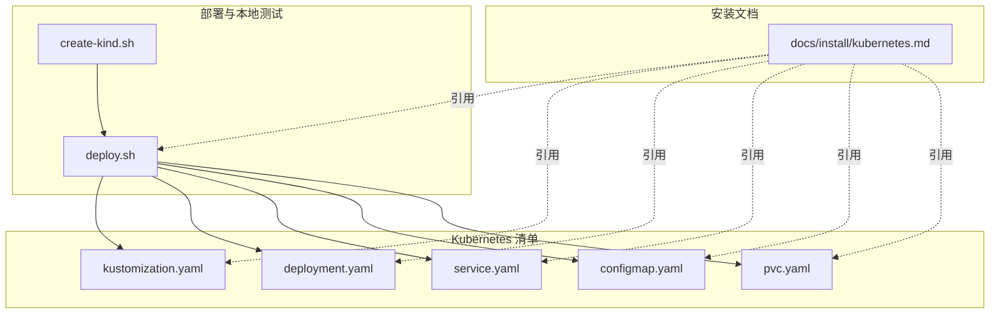
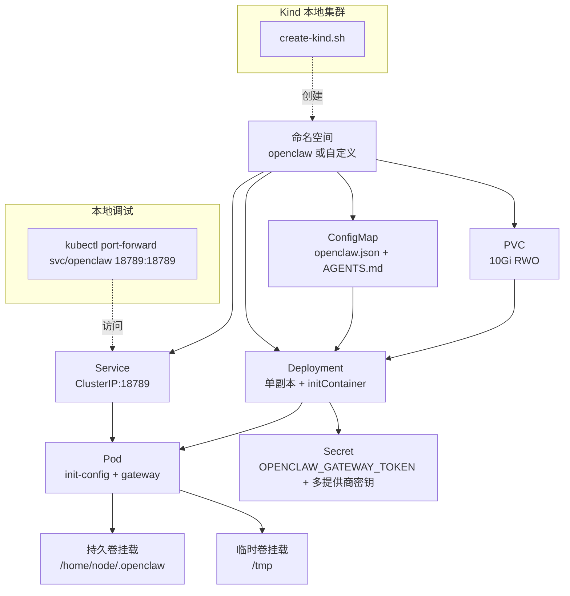
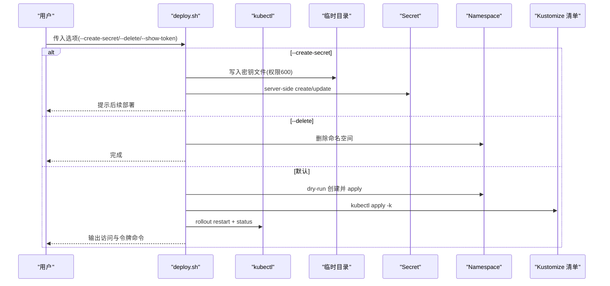
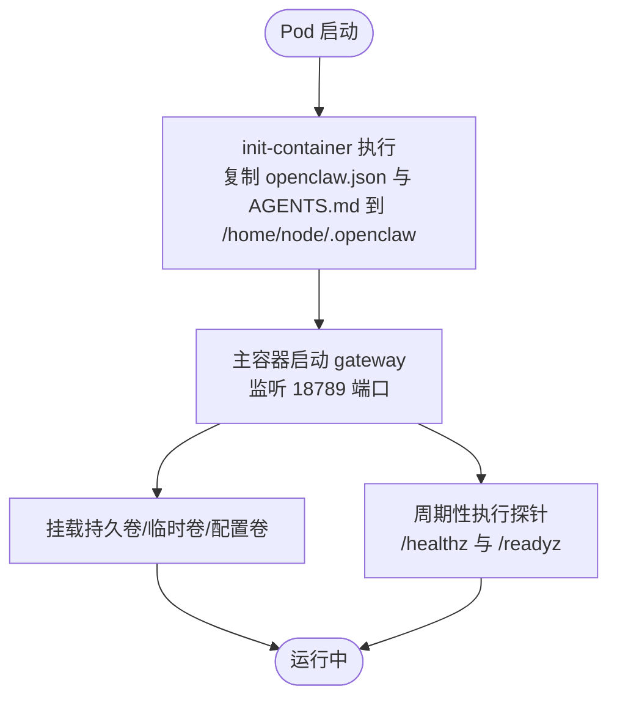
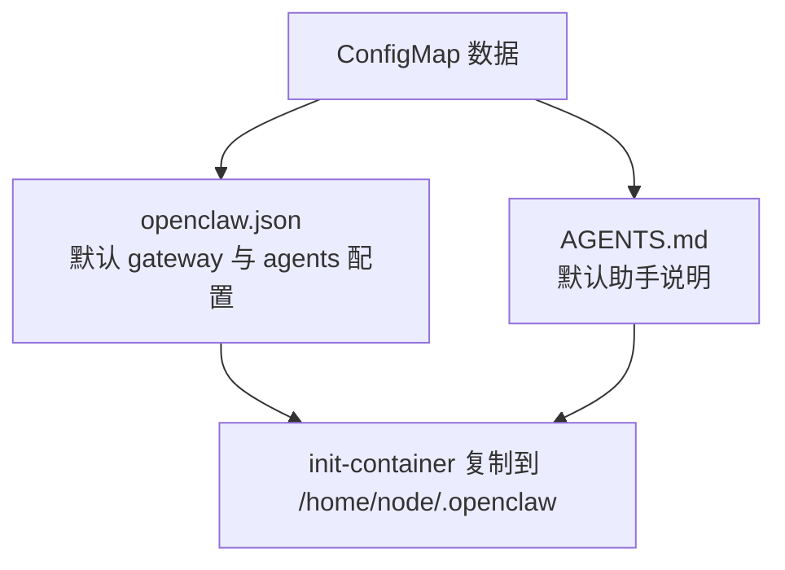
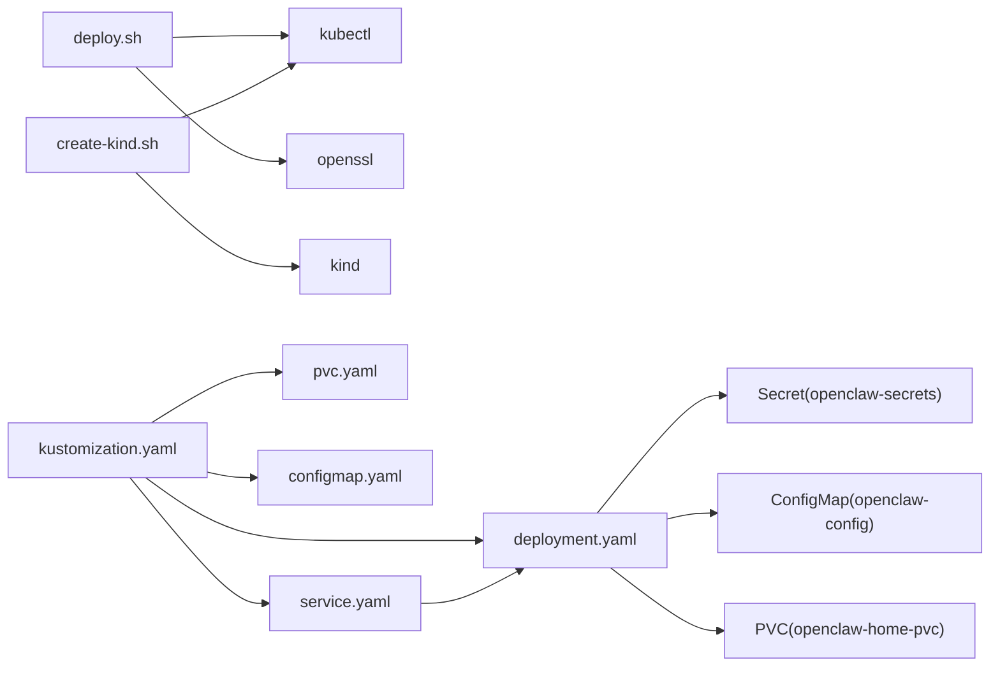

# Kubernetes 部署

<cite>
**本文引用的文件**
- [docs/install/kubernetes.md](file://docs/install/kubernetes.md)
- [scripts/k8s/deploy.sh](file://scripts/k8s/deploy.sh)
- [scripts/k8s/create-kind.sh](file://scripts/k8s/create-kind.sh)
- [scripts/k8s/manifests/kustomization.yaml](file://scripts/k8s/manifests/kustomization.yaml)
- [scripts/k8s/manifests/deployment.yaml](file://scripts/k8s/manifests/deployment.yaml)
- [scripts/k8s/manifests/service.yaml](file://scripts/k8s/manifests/service.yaml)
- [scripts/k8s/manifests/configmap.yaml](file://scripts/k8s/manifests/configmap.yaml)
- [scripts/k8s/manifests/pvc.yaml](file://scripts/k8s/manifests/pvc.yaml)
</cite>

## 目录
1. [简介](#简介)
2. [项目结构](#项目结构)
3. [核心组件](#核心组件)
4. [架构总览](#架构总览)
5. [详细组件分析](#详细组件分析)
6. [依赖关系分析](#依赖关系分析)
7. [性能考量](#性能考量)
8. [故障排除指南](#故障排除指南)
9. [结论](#结论)
10. [附录](#附录)

## 简介
本指南面向在 Kubernetes 集群上部署 OpenClaw Gateway 的用户，覆盖从集群准备、Kustomize 基础清单到 Secret 管理、持久化存储、自定义配置、多提供商 API 密钥管理、命名空间配置、安全加固、资源限制以及本地调试与 Kind 测试环境搭建等全流程。文档严格基于仓库中的安装文档与脚本，确保可操作性与一致性。

## 项目结构
与 Kubernetes 部署直接相关的文件位于 scripts/k8s 及其子目录，核心包括：
- 部署脚本：scripts/k8s/deploy.sh（负责 Namespace、Secret、Kustomize 应用与回滚）
- Kind 本地集群脚本：scripts/k8s/create-kind.sh（自动检测容器引擎并创建本地集群）
- Kustomize 基础清单：scripts/k8s/manifests/kustomization.yaml（聚合资源）
- 资源清单：
  - deployment.yaml（Deployment，含 initContainer、探针、安全上下文、卷挂载）
  - service.yaml（ClusterIP Service）
  - configmap.yaml（openclaw.json 与 AGENTS.md）
  - pvc.yaml（10Gi 存储）
- 安装文档：docs/install/kubernetes.md（使用说明、定制化、架构说明）

**图表来源**
- [scripts/k8s/manifests/kustomization.yaml:1-8](file://scripts/k8s/manifests/kustomization.yaml#L1-L8)
- [scripts/k8s/manifests/deployment.yaml:1-147](file://scripts/k8s/manifests/deployment.yaml#L1-L147)
- [scripts/k8s/manifests/service.yaml:1-16](file://scripts/k8s/manifests/service.yaml#L1-L16)
- [scripts/k8s/manifests/configmap.yaml:1-39](file://scripts/k8s/manifests/configmap.yaml#L1-L39)
- [scripts/k8s/manifests/pvc.yaml:1-13](file://scripts/k8s/manifests/pvc.yaml#L1-L13)
- [scripts/k8s/deploy.sh:1-232](file://scripts/k8s/deploy.sh#L1-L232)
- [scripts/k8s/create-kind.sh:1-210](file://scripts/k8s/create-kind.sh#L1-L210)
- [docs/install/kubernetes.md:1-192](file://docs/install/kubernetes.md#L1-L192)

**章节来源**
- [docs/install/kubernetes.md:179-192](file://docs/install/kubernetes.md#L179-L192)
- [scripts/k8s/manifests/kustomization.yaml:1-8](file://scripts/k8s/manifests/kustomization.yaml#L1-L8)

## 核心组件
- 命名空间与资源编排
  - 默认命名空间 openclaw，可通过环境变量 OPENCLAW_NAMESPACE 自定义
  - 使用 Kustomize 聚合 PVC、ConfigMap、Deployment、Service 四类资源
- Deployment
  - 单副本，Recreate 策略；initContainer 将 ConfigMap 中的配置复制到持久目录
  - 主容器运行 Gateway，暴露 18789 端口，配置健康与就绪探针
  - 安全上下文：非 root 用户 UID 1000，只读根文件系统，丢弃全部能力，启用默认 seccomp
  - 挂载持久卷与临时卷，环境变量从 Secret 注入（网关令牌与多个提供商 API Key）
- Service
  - ClusterIP 类型，端口 18789，供 port-forward 或 Ingress/LoadBalancer 使用
- ConfigMap
  - 包含 openclaw.json（默认绑定 loopback、令牌鉴权、控制界面启用）与 AGENTS.md
- PVC
  - 10Gi RWO 存储，用于保存 agent 工作区与配置
- Secret 管理
  - 通过 deploy.sh 生成临时文件后以 server-side apply 创建/更新，避免明文落盘
  - 支持保留现有网关令牌，仅更新新增或变更的提供商密钥
- Kind 本地测试
  - 自动检测 docker/podman，创建单控制面节点集群，便于本地验证

**章节来源**
- [scripts/k8s/deploy.sh:13-25](file://scripts/k8s/deploy.sh#L13-L25)
- [scripts/k8s/manifests/kustomization.yaml:1-8](file://scripts/k8s/manifests/kustomization.yaml#L1-L8)
- [scripts/k8s/manifests/deployment.yaml:1-147](file://scripts/k8s/manifests/deployment.yaml#L1-L147)
- [scripts/k8s/manifests/service.yaml:1-16](file://scripts/k8s/manifests/service.yaml#L1-L16)
- [scripts/k8s/manifests/configmap.yaml:1-39](file://scripts/k8s/manifests/configmap.yaml#L1-L39)
- [scripts/k8s/manifests/pvc.yaml:1-13](file://scripts/k8s/manifests/pvc.yaml#L1-L13)
- [scripts/k8s/create-kind.sh:1-210](file://scripts/k8s/create-kind.sh#L1-L210)

## 架构总览
下图展示从 Secret 到 Deployment、Service、PVC 与 ConfigMap 的整体关系，以及本地调试与 Kind 测试路径。

**图表来源**
- [scripts/k8s/manifests/deployment.yaml:1-147](file://scripts/k8s/manifests/deployment.yaml#L1-L147)
- [scripts/k8s/manifests/service.yaml:1-16](file://scripts/k8s/manifests/service.yaml#L1-L16)
- [scripts/k8s/manifests/configmap.yaml:1-39](file://scripts/k8s/manifests/configmap.yaml#L1-L39)
- [scripts/k8s/manifests/pvc.yaml:1-13](file://scripts/k8s/manifests/pvc.yaml#L1-L13)
- [scripts/k8s/deploy.sh:213-229](file://scripts/k8s/deploy.sh#L213-L229)
- [scripts/k8s/create-kind.sh:167-189](file://scripts/k8s/create-kind.sh#L167-L189)

## 详细组件分析

### 部署脚本（deploy.sh）工作流
该脚本负责：
- 校验 kubectl 与 openssl
- 解析参数：--create-secret、--delete、--show-token
- Secret 生成与应用：在临时目录写入密钥文件，使用 server-side apply 创建/更新 Secret，并清理临时文件
- 命名空间创建与 Kustomize 应用：dry-run 创建 Namespace 后 apply
- 回滚与状态检查：滚动重启 Deployment 并等待 rollout 完成
- 输出访问方式与令牌获取命令

**图表来源**
- [scripts/k8s/deploy.sh:85-159](file://scripts/k8s/deploy.sh#L85-L159)
- [scripts/k8s/deploy.sh:164-185](file://scripts/k8s/deploy.sh#L164-L185)
- [scripts/k8s/deploy.sh:213-229](file://scripts/k8s/deploy.sh#L213-L229)

**章节来源**
- [scripts/k8s/deploy.sh:1-232](file://scripts/k8s/deploy.sh#L1-L232)

### Deployment 安全与资源配置
- 安全上下文
  - 运行用户/组：UID 1000（非 root）
  - 只读根文件系统
  - 丢弃全部 Linux 能力
  - 默认 seccomp 运行时配置
  - 禁止特权提升
- 探针
  - 健康探针：/healthz
  - 就绪探针：/readyz
- 资源请求/限制
  - initContainer：CPU 50m-100m，内存 32Mi-64Mi
  - gateway 容器：CPU 250m-1000m，内存 512Mi-2Gi
- 卷
  - 持久卷：/home/node/.openclaw
  - 临时卷：/tmp
  - 配置卷：/config（来自 ConfigMap）

**图表来源**
- [scripts/k8s/manifests/deployment.yaml:24-50](file://scripts/k8s/manifests/deployment.yaml#L24-L50)
- [scripts/k8s/manifests/deployment.yaml:106-123](file://scripts/k8s/manifests/deployment.yaml#L106-L123)
- [scripts/k8s/manifests/deployment.yaml:124-147](file://scripts/k8s/manifests/deployment.yaml#L124-L147)

**章节来源**
- [scripts/k8s/manifests/deployment.yaml:1-147](file://scripts/k8s/manifests/deployment.yaml#L1-L147)

### ConfigMap 与默认配置
- openclaw.json 默认配置
  - 网关模式：local
  - 绑定：loopback（仅本地回环）
  - 端口：18789
  - 鉴权：token
  - 控制界面：启用
  - agents.defaults.workspace：~/.openclaw/workspace
  - cron：禁用
- AGENTS.md：默认助手说明文本

**图表来源**
- [scripts/k8s/manifests/configmap.yaml:8-39](file://scripts/k8s/manifests/configmap.yaml#L8-L39)

**章节来源**
- [scripts/k8s/manifests/configmap.yaml:1-39](file://scripts/k8s/manifests/configmap.yaml#L1-L39)

### PVC 与持久化存储
- 访问模式：ReadWriteOnce
- 请求容量：10Gi
- 挂载路径：/home/node/.openclaw（由 Deployment 指定）

**章节来源**
- [scripts/k8s/manifests/pvc.yaml:1-13](file://scripts/k8s/manifests/pvc.yaml#L1-L13)
- [scripts/k8s/manifests/deployment.yaml:139-141](file://scripts/k8s/manifests/deployment.yaml#L139-L141)

### Service 与端口转发
- Service：ClusterIP，端口 18789，目标端口 18789
- 本地调试：通过 kubectl port-forward 将 svc/openclaw:18789 映射到本地 127.0.0.1:18789

**章节来源**
- [scripts/k8s/manifests/service.yaml:1-16](file://scripts/k8s/manifests/service.yaml#L1-L16)
- [docs/install/kubernetes.md:77-82](file://docs/install/kubernetes.md#L77-L82)

### Kind 本地集群搭建
- 自动检测容器引擎（podman/docker），并校验可用性
- 创建单控制面节点集群，支持删除与上下文切换
- 集群创建后输出部署指引

**章节来源**
- [scripts/k8s/create-kind.sh:1-210](file://scripts/k8s/create-kind.sh#L1-L210)

## 依赖关系分析
- 脚本依赖
  - deploy.sh 依赖 kubectl 与 openssl；需连接到目标集群
  - create-kind.sh 依赖 kind 与 kubectl，并根据容器引擎动态配置
- 清单依赖
  - Kustomize 聚合 pvc、configmap、deployment、service
  - Deployment 依赖 ConfigMap（openclaw.json、AGENTS.md）、PVC、Secret（令牌与 API Key）
  - Service 选择器匹配 Deployment 标签

**图表来源**
- [scripts/k8s/deploy.sh:21-25](file://scripts/k8s/deploy.sh#L21-L25)
- [scripts/k8s/create-kind.sh:122-128](file://scripts/k8s/create-kind.sh#L122-L128)
- [scripts/k8s/manifests/kustomization.yaml:3-7](file://scripts/k8s/manifests/kustomization.yaml#L3-L7)
- [scripts/k8s/manifests/deployment.yaml:1-147](file://scripts/k8s/manifests/deployment.yaml#L1-L147)
- [scripts/k8s/manifests/service.yaml:1-16](file://scripts/k8s/manifests/service.yaml#L1-L16)

**章节来源**
- [scripts/k8s/deploy.sh:21-25](file://scripts/k8s/deploy.sh#L21-L25)
- [scripts/k8s/create-kind.sh:122-128](file://scripts/k8s/create-kind.sh#L122-L128)
- [scripts/k8s/manifests/kustomization.yaml:1-8](file://scripts/k8s/manifests/kustomization.yaml#L1-L8)

## 性能考量
- 资源配额
  - gateway 容器 CPU 250m-1000m，内存 512Mi-2Gi；initContainer CPU 50m-100m，内存 32Mi-64Mi
  - 建议结合实际负载与并发调用情况调整 requests/limits
- 存储
  - 10Gi 对于轻量 agent 工作区足够；若 agent 产生大量缓存或日志，建议评估扩容
- 探针
  - 健康与就绪探针间隔与超时已设定，避免过于频繁导致额外开销
- 安全上下文
  - 只读文件系统与默认 seccomp 有助于降低逃逸风险，但不会直接影响吞吐

[本节为通用建议，不直接分析具体文件]

## 故障排除指南
- 无法连接集群
  - 检查 kubeconfig 与集群连通性；脚本会提示“Cannot connect to cluster”
- 缺少工具
  - 确保安装 kubectl 与 openssl；脚本会提示缺失的命令
- Secret 未找到且环境无密钥
  - 需要导出至少一个提供商 API Key 或先执行 --create-secret
- 令牌获取
  - 通过 kubectl get secret 获取 OPENCLAW_GATEWAY_TOKEN；deploy.sh 支持 --show-token 输出
- 删除与重建
  - 使用 --delete 删除命名空间及所有资源；重新部署前可先清理
- 本地调试
  - 使用 kubectl port-forward svc/openclaw 18789:18789；确认令牌已在 Secret 中
- Kind 集群问题
  - 确认容器引擎响应；如 podman 未运行，需启动 podman machine；docker 未运行则启动 docker

**章节来源**
- [scripts/k8s/deploy.sh:21-25](file://scripts/k8s/deploy.sh#L21-L25)
- [scripts/k8s/deploy.sh:190-208](file://scripts/k8s/deploy.sh#L190-L208)
- [scripts/k8s/deploy.sh:225-231](file://scripts/k8s/deploy.sh#L225-L231)
- [scripts/k8s/create-kind.sh:130-137](file://scripts/k8s/create-kind.sh#L130-L137)

## 结论
本指南基于仓库内安装文档与脚本，提供了 OpenClaw 在 Kubernetes 上的最小可行部署方案。通过 Kustomize 管理基础资源，借助 deploy.sh 实现 Secret 的安全生成与应用，结合 Kind 可快速搭建本地测试环境。生产场景建议进一步完善 Ingress/TLS、RBAC、资源配额与监控告警，并按需扩展存储与网络策略。

[本节为总结性内容，不直接分析具体文件]

## 附录

### 快速开始步骤
- 准备集群与工具
  - 连接目标集群的 kubectl，确保 openssl 可用
- 导入至少一个提供商 API Key
  - 示例：export OPENAI_API_KEY="..."
- 部署
  - ./scripts/k8s/deploy.sh
- 本地调试
  - kubectl port-forward svc/openclaw 18789:18789 -n openclaw
  - 在浏览器打开 http://localhost:18789
- 获取网关令牌
  - kubectl get secret openclaw-secrets -n openclaw -o jsonpath='{.data.OPENCLAW_GATEWAY_TOKEN}' | base64 -d

**章节来源**
- [docs/install/kubernetes.md:23-41](file://docs/install/kubernetes.md#L23-L41)
- [scripts/k8s/deploy.sh:213-229](file://scripts/k8s/deploy.sh#L213-L229)

### 自定义配置与命名空间
- 自定义命名空间
  - OPENCLAW_NAMESPACE=my-namespace ./scripts/k8s/deploy.sh
- 自定义镜像
  - 修改 deployment.yaml 中的 image 字段
- 自定义 ConfigMap
  - 修改 scripts/k8s/manifests/configmap.yaml 中的 openclaw.json 与 AGENTS.md
- 添加更多提供商密钥
  - 重新执行 --create-secret 与部署；或直接 patch Secret 并重启 Deployment

**章节来源**
- [docs/install/kubernetes.md:130-134](file://docs/install/kubernetes.md#L130-L134)
- [docs/install/kubernetes.md:136-143](file://docs/install/kubernetes.md#L136-L143)
- [docs/install/kubernetes.md:105-128](file://docs/install/kubernetes.md#L105-L128)

### 安全加固与资源限制
- 安全上下文
  - 非 root 用户、只读根文件系统、丢弃全部能力、默认 seccomp
- 资源请求/限制
  - 已在 Deployment 中设定；可根据实际负载调整
- 探针
  - 健康与就绪探针已配置，避免过度探测

**章节来源**
- [scripts/k8s/manifests/deployment.yaml:13-24](file://scripts/k8s/manifests/deployment.yaml#L13-L24)
- [scripts/k8s/manifests/deployment.yaml:99-105](file://scripts/k8s/manifests/deployment.yaml#L99-L105)
- [scripts/k8s/manifests/deployment.yaml:106-123](file://scripts/k8s/manifests/deployment.yaml#L106-L123)

### 本地测试与 Kind 环境
- 创建本地集群
  - ./scripts/k8s/create-kind.sh
- 删除本地集群
  - ./scripts/k8s/create-kind.sh --delete
- 部署与调试
  - 导出 API Key 后执行 ./scripts/k8s/deploy.sh；随后 port-forward 访问

**章节来源**
- [docs/install/kubernetes.md:42-51](file://docs/install/kubernetes.md#L42-L51)
- [scripts/k8s/create-kind.sh:142-151](file://scripts/k8s/create-kind.sh#L142-L151)
- [scripts/k8s/create-kind.sh:200-210](file://scripts/k8s/create-kind.sh#L200-L210)