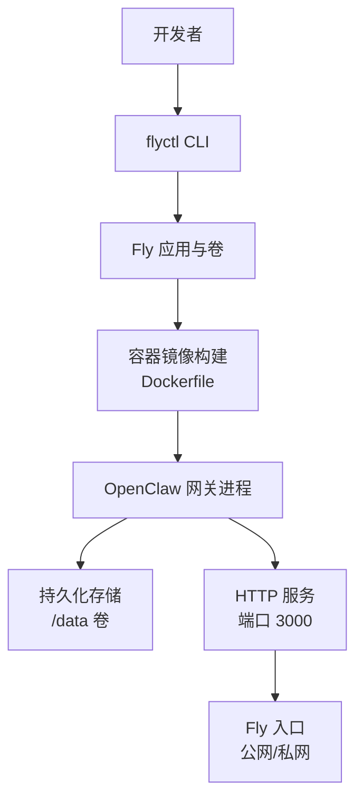
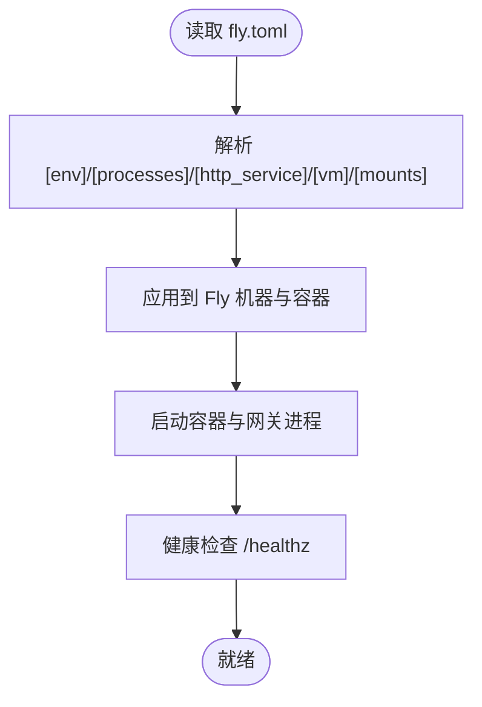
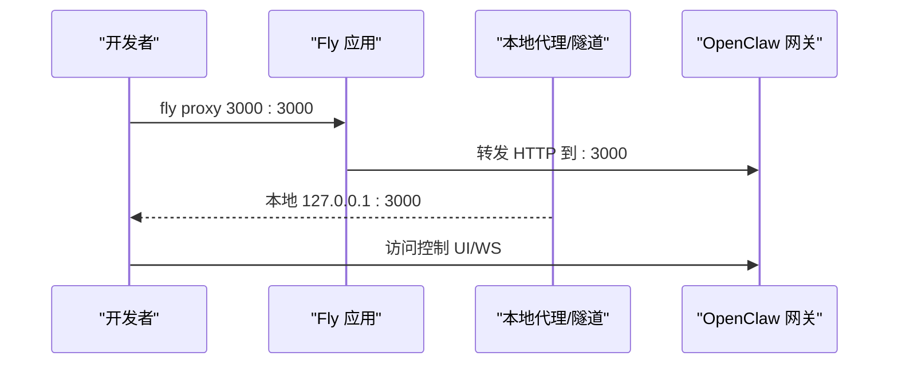
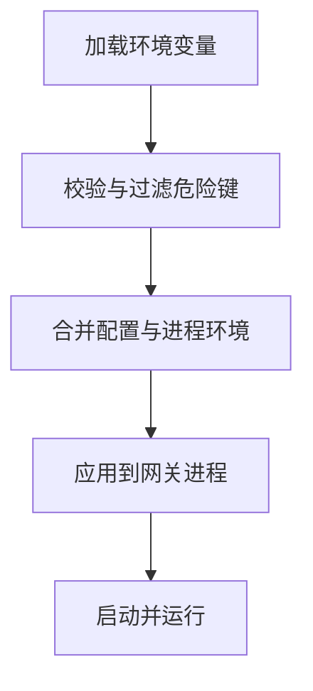
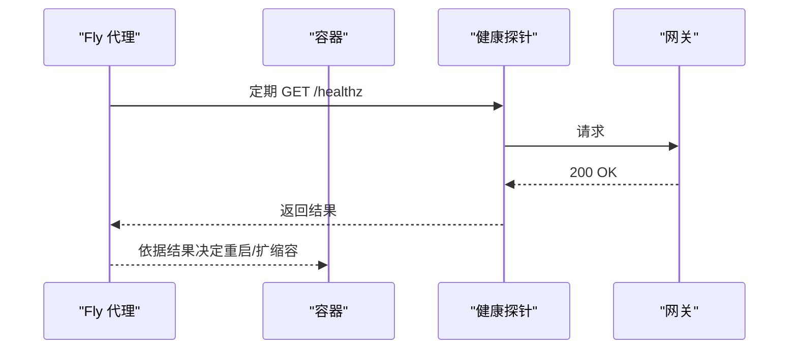
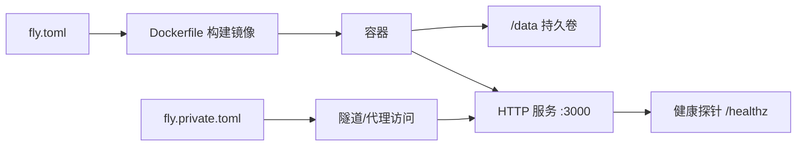
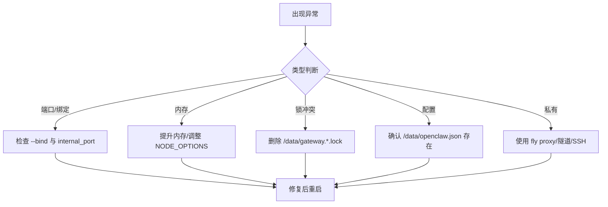

# Fly.io 部署

<cite>
**本文引用的文件**
- [fly.toml](file://fly.toml)
- [fly.private.toml](file://fly.private.toml)
- [Dockerfile](file://Dockerfile)
- [README.md](file://README.md)
- [docs/install/fly.md](file://docs/install/fly.md)
- [docs/gateway/gateway-lock.md](file://docs/gateway/gateway-lock.md)
- [docs/automation/troubleshooting.md](file://docs/automation/troubleshooting.md)
- [src/config/config.env-vars.test.ts](file://src/config/config.env-vars.test.ts)
- [openclaw.podman.env](file://openclaw.podman.env)
</cite>

## 目录
1. [简介](#简介)
2. [项目结构](#项目结构)
3. [核心组件](#核心组件)
4. [架构总览](#架构总览)
5. [详细组件分析](#详细组件分析)
6. [依赖关系分析](#依赖关系分析)
7. [性能考虑](#性能考虑)
8. [故障排除指南](#故障排除指南)
9. [结论](#结论)
10. [附录](#附录)

## 简介
本指南面向在 Fly.io 平台上部署 OpenClaw 的用户，覆盖应用创建、持久卷配置、环境变量与安全配置、fly.toml 参数详解、内存优化、健康检查与自动重启、私有部署（无公网暴露）等主题，并提供常见问题的排障方法、更新流程与监控建议。

## 项目结构
OpenClaw 提供了完整的 Fly.io 部署模板与文档，核心文件包括：
- fly.toml：标准公开部署配置（分配公网 IP，支持 HTTPS）
- fly.private.toml：私有部署配置（无公网入口，仅内网/隧道访问）
- Dockerfile：容器镜像构建脚本，含健康检查与非 root 用户运行
- docs/install/fly.md：官方 Fly.io 部署步骤与参数说明
- docs/gateway/gateway-lock.md：网关锁（单实例保护）机制
- docs/automation/troubleshooting.md：自动化任务（定时/心跳）排障
- src/config/config.env-vars.test.ts：环境变量加载与安全策略测试
- openclaw.podman.env：Podman 环境示例（可对照理解环境变量用法）



**图表来源**
- [fly.toml:1-35](file://fly.toml#L1-L35)
- [Dockerfile:243-249](file://Dockerfile#L243-L249)

**章节来源**
- [fly.toml:1-35](file://fly.toml#L1-L35)
- [fly.private.toml:1-40](file://fly.private.toml#L1-L40)
- [Dockerfile:1-250](file://Dockerfile#L1-L250)
- [docs/install/fly.md:1-491](file://docs/install/fly.md#L1-L491)

## 核心组件
- 应用与卷
  - 应用名、主区域、VM 规格与内存、挂载点等在 fly.toml 中定义
  - 持久卷 openclaw_data 挂载到 /data，用于保存状态、会话与配置
- 容器镜像
  - Dockerfile 使用多阶段构建，最终以非 root 用户运行
  - 健康检查通过 /healthz 与 /readyz 探针
- 网关进程
  - 默认绑定 127.0.0.1:3000（Loopback），Fly 需要 --bind lan 才能被代理访问
  - 支持 --allow-unconfigured 以首次运行无需完整配置
- 环境变量与安全
  - NODE_ENV、OPENCLAW_PREFER_PNPM、OPENCLAW_STATE_DIR、NODE_OPTIONS 等
  - 非 loopback 绑定需 OPENCLAW_GATEWAY_TOKEN 作为访问令牌
  - 环境变量加载遵循安全策略，避免危险键注入

**章节来源**
- [fly.toml:10-35](file://fly.toml#L10-L35)
- [Dockerfile:243-249](file://Dockerfile#L243-L249)
- [docs/install/fly.md:83-115](file://docs/install/fly.md#L83-L115)
- [src/config/config.env-vars.test.ts:1-134](file://src/config/config.env-vars.test.ts#L1-L134)

## 架构总览
下图展示 Fly.io 上 OpenClaw 的典型部署拓扑与数据流：

```mermaid
graph TB
subgraph "Fly.io"
subgraph "机器(Machine)"
subgraph "容器(Container)"
GW["OpenClaw 网关<br/>node dist/index.js gateway"]
VOL["持久卷挂载<br/>/data -> openclaw_data"]
end
LB["Fly 负载均衡/代理"]
end
end
LB --> |HTTP(S)| GW
GW --> |读写| VOL
GW --> |WebSocket| 客户端(浏览器/节点)
```

**图表来源**
- [fly.toml:20-35](file://fly.toml#L20-L35)
- [Dockerfile:243-249](file://Dockerfile#L243-L249)

## 详细组件分析

### fly.toml 参数详解
- app 与 primary_region：应用名与首选区域
- build.dockerfile：使用仓库根目录 Dockerfile
- env.*：生产环境、包管理偏好、状态目录、Node 内存上限
- processes.app：启动命令，包含 --allow-unconfigured、--port 3000、--bind lan
- http_service：内部端口 3000、强制 HTTPS、保持运行、最小运行机数 1
- vm.size/memory：CPU/内存规格
- mounts.source/destination：持久卷 openclaw_data -> /data



**图表来源**
- [fly.toml:7-35](file://fly.toml#L7-L35)
- [Dockerfile:243-249](file://Dockerfile#L243-L249)

**章节来源**
- [fly.toml:1-35](file://fly.toml#L1-L35)
- [docs/install/fly.md:44-92](file://docs/install/fly.md#L44-L92)

### 私有部署（无公网暴露）
- 使用 fly.private.toml，移除 [http_service] 块，不分配公网入口
- 通过 fly proxy、WireGuard 或 SSH 访问
- 适合仅出站调用、需要隐藏部署的场景



**图表来源**
- [fly.private.toml:27-31](file://fly.private.toml#L27-L31)
- [docs/install/fly.md:359-434](file://docs/install/fly.md#L359-L434)

**章节来源**
- [fly.private.toml:1-40](file://fly.private.toml#L1-L40)
- [docs/install/fly.md:359-474](file://docs/install/fly.md#L359-L474)

### 环境变量与安全配置
- 生产环境变量
  - NODE_ENV=production
  - OPENCLAW_PREFER_PNPM=1
  - OPENCLAW_STATE_DIR=/data
  - NODE_OPTIONS="--max-old-space-size=1536"
- 访问令牌
  - 非 loopback 绑定需 OPENCLAW_GATEWAY_TOKEN
- 安全策略
  - 环境变量加载时会过滤危险键（如 SHELL、HOME 等）
  - 支持从 ~/.openclaw/.env 注入敏感值（如 BRAVE_API_KEY）



**图表来源**
- [fly.toml:10-22](file://fly.toml#L10-L22)
- [src/config/config.env-vars.test.ts:46-82](file://src/config/config.env-vars.test.ts#L46-L82)

**章节来源**
- [fly.toml:10-22](file://fly.toml#L10-L22)
- [src/config/config.env-vars.test.ts:1-134](file://src/config/config.env-vars.test.ts#L1-L134)
- [openclaw.podman.env:1-25](file://openclaw.podman.env#L1-L25)

### 健康检查与自动重启
- Dockerfile 中定义 HEALTHCHECK，探针访问 /healthz
- fly.toml 设置 http_service.force_https、auto_stop_machines=false、min_machines_running=1
- 建议结合通道健康监控参数进行全局与通道级重启控制



**图表来源**
- [Dockerfile:247-248](file://Dockerfile#L247-L248)
- [fly.toml:20-26](file://fly.toml#L20-L26)

**章节来源**
- [Dockerfile:243-249](file://Dockerfile#L243-L249)
- [fly.toml:20-26](file://fly.toml#L20-L26)
- [docs/gateway/health.md:27-40](file://docs/gateway/health.md#L27-L40)

### 更新流程与监控建议
- 更新流程
  - git pull -> fly deploy -> fly status/logs 检查
  - 如需修改启动命令，可通过 fly machine update 指定新命令与内存
- 监控建议
  - 使用 fly logs 实时查看日志
  - 使用 fly status 查看机器状态
  - 结合自动化排障命令 openclaw status/gateway status/logs/doctor/cron status 等

**章节来源**
- [docs/install/fly.md:328-358](file://docs/install/fly.md#L328-L358)
- [docs/automation/troubleshooting.md:1-123](file://docs/automation/troubleshooting.md#L1-L123)

## 依赖关系分析
- fly.toml 依赖 Dockerfile 生成的镜像
- 网关进程依赖 /data 持久卷
- 健康检查依赖容器内 /healthz 端点
- 私有部署依赖隧道/代理访问



**图表来源**
- [fly.toml:7-35](file://fly.toml#L7-L35)
- [Dockerfile:243-249](file://Dockerfile#L243-L249)
- [fly.private.toml:27-31](file://fly.private.toml#L27-L31)

**章节来源**
- [fly.toml:1-35](file://fly.toml#L1-L35)
- [fly.private.toml:1-40](file://fly.private.toml#L1-L40)
- [Dockerfile:1-250](file://Dockerfile#L1-L250)

## 性能考虑
- 内存优化
  - 建议使用 2GB 内存起步，避免 OOM 导致容器重启
  - 可通过 fly machine update 调整内存大小
- Node 内存上限
  - NODE_OPTIONS="--max-old-space-size=1536" 控制 V8 堆大小
- CPU/内存规格
  - fly.toml 中 vm.size 与 memory 需匹配实际负载

**章节来源**
- [fly.toml:28-31](file://fly.toml#L28-L31)
- [fly.toml:14-15](file://fly.toml#L14-L15)
- [docs/install/fly.md:259-277](file://docs/install/fly.md#L259-L277)

## 故障排除指南

### 常见问题与修复
- 应用未监听预期地址
  - 症状：Fly 无法访问网关
  - 修复：确保 processes.app 包含 --bind lan，且 internal_port 与 --port 一致
- 健康检查失败/连接被拒绝
  - 症状：探针返回连接失败
  - 修复：确认 internal_port 与网关端口一致，且网关已绑定到 0.0.0.0
- 内存不足/频繁重启
  - 症状：容器反复重启、OOM 相关日志
  - 修复：提升内存至 2GB，必要时调整 NODE_OPTIONS
- 网关锁冲突
  - 症状：启动报错“另一个网关实例已在监听”
  - 修复：删除 /data 下的 gateway.*.lock 文件后重启
- 配置未生效
  - 症状：使用 --allow-unconfigured 时自动生成最小配置
  - 修复：确保 /data/openclaw.json 存在并正确重启
- 私有部署无法访问
  - 症状：无公网 URL
  - 修复：使用 fly proxy、WireGuard 或 SSH 访问



**图表来源**
- [docs/install/fly.md:245-321](file://docs/install/fly.md#L245-L321)
- [docs/gateway/gateway-lock.md:26-29](file://docs/gateway/gateway-lock.md#L26-L29)

**章节来源**
- [docs/install/fly.md:245-321](file://docs/install/fly.md#L245-L321)
- [docs/gateway/gateway-lock.md:1-35](file://docs/gateway/gateway-lock.md#L1-L35)

## 结论
通过 fly.toml 与 fly.private.toml，OpenClaw 可在 Fly.io 上实现稳定、可扩展且安全的部署。建议优先采用 2GB 内存起步，启用持久卷与健康检查，按需选择公开或私有部署模式，并结合自动化排障与监控工具保障运行质量。

## 附录

### 快速操作清单
- 创建应用与卷
  - fly apps create <app-name>
  - fly volumes create openclaw_data --size 1 --region <region>
- 设置密钥
  - fly secrets set OPENCLAW_GATEWAY_TOKEN=...
  - fly secrets set ANTHROPIC_API_KEY=...
  - fly secrets set DISCORD_BOT_TOKEN=...
- 部署与验证
  - fly deploy
  - fly status / fly logs
- 私有部署
  - fly deploy -c fly.private.toml
  - fly proxy 3000:3000 或 WireGuard/SSH 访问

**章节来源**
- [docs/install/fly.md:21-129](file://docs/install/fly.md#L21-L129)
- [docs/install/fly.md:372-434](file://docs/install/fly.md#L372-L434)