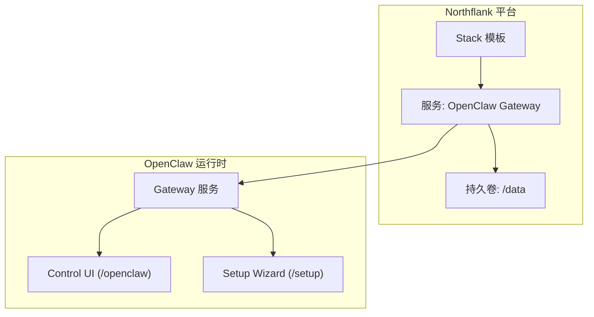
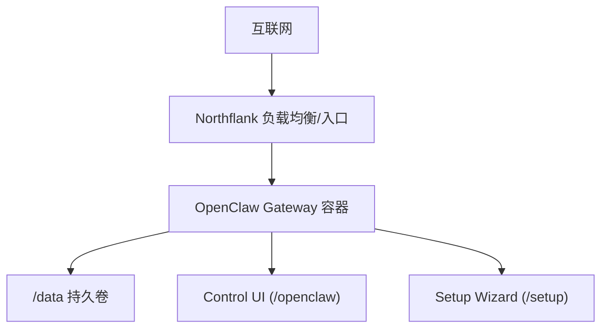
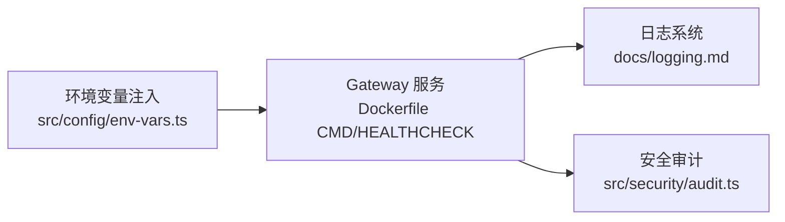

# Northflank 部署

<cite>
**本文引用的文件**
- [docs/install/northflank.mdx](file://docs/install/northflank.mdx)
- [docs/zh-CN/install/northflank.mdx](file://docs/zh-CN/install/northflank.mdx)
- [Dockerfile](file://Dockerfile)
- [docker-compose.yml](file://docker-compose.yml)
- [render.yaml](file://render.yaml)
- [src/config/env-vars.ts](file://src/config/env-vars.ts)
- [src/security/audit.ts](file://src/security/audit.ts)
- [docs/gateway/security/index.md](file://docs/gateway/security/index.md)
- [docs/logging.md](file://docs/logging.md)
</cite>

## 目录
1. [简介](#简介)
2. [项目结构](#项目结构)
3. [核心组件](#核心组件)
4. [架构总览](#架构总览)
5. [详细组件分析](#详细组件分析)
6. [依赖关系分析](#依赖关系分析)
7. [性能考虑](#性能考虑)
8. [故障排除指南](#故障排除指南)
9. [结论](#结论)
10. [附录](#附录)

## 简介
本指南面向在 Northflank 平台上部署 OpenClaw 的用户，基于仓库中的官方部署文档与容器镜像构建脚本，系统性说明服务配置、网络与安全、存储卷、密钥管理、可观测性与日志采集等关键主题。Northflank 提供“一键模板”与托管容器编排能力，OpenClaw 的 Gateway 由平台托管，用户通过浏览器内的 `/setup` 向导完成初始配置与密钥注入，随后通过 `/openclaw` 控制面板进行日常运维。

## 项目结构
与 Northflank 部署直接相关的关键文件与职责如下：
- 文档层
  - docs/install/northflank.mdx：官方英文部署指引（含环境变量、设置流程、频道令牌获取）
  - docs/zh-CN/install/northflank.mdx：中文本地化版本
- 容器与编排
  - Dockerfile：多阶段构建的生产镜像，内置健康检查与非 root 用户运行
  - docker-compose.yml：本地开发/测试用 compose 编排示例（便于理解端口、卷、健康检查）
  - render.yaml：Render 平台的参考配置（体现健康检查路径、环境变量、磁盘挂载），可类比理解 Northflank 的卷与环境变量机制
- 安全与配置
  - src/config/env-vars.ts：环境变量收集与注入逻辑（用于理解配置如何落地到运行时）
  - src/security/audit.ts：安全审计检查清单（用于对照部署基线）
  - docs/gateway/security/index.md：安全基线与风险控制要点
- 日志与可观测性
  - docs/logging.md：日志位置、读取方式与 OpenTelemetry 导出配置

**图表来源**
- [docs/install/northflank.mdx:1-54](file://docs/install/northflank.mdx#L1-L54)
- [Dockerfile:243-249](file://Dockerfile#L243-L249)

**章节来源**
- [docs/install/northflank.mdx:1-54](file://docs/install/northflank.mdx#L1-L54)
- [docs/zh-CN/install/northflank.mdx:1-61](file://docs/zh-CN/install/northflank.mdx#L1-L61)

## 核心组件
- 一键模板与部署流程
  - 通过 Northflank 模板一键部署 OpenClaw，设置必要环境变量后即可构建与运行
  - 部署完成后，通过公开域名访问 `/setup` 完成初始化配置，并在 `/openclaw` 打开控制面板
- 持久化存储
  - 使用 Northflank Volume（挂载点 `/data`），确保配置、凭据与工作区在重部署后不丢失
- 环境变量与密钥
  - 必需变量：`SETUP_PASSWORD`（用于 `/setup` 向导）
  - 可选变量：各渠道令牌（如 Telegram、Discord、Slack）与 Gateway 认证令牌
- 健康检查与探针
  - 镜像内置健康检查端点，便于平台进行存活与就绪探测

**章节来源**
- [docs/install/northflank.mdx:9-35](file://docs/install/northflank.mdx#L9-L35)
- [docs/zh-CN/install/northflank.mdx:16-42](file://docs/zh-CN/install/northflank.mdx#L16-L42)
- [Dockerfile:243-249](file://Dockerfile#L243-L249)

## 架构总览
下图展示在 Northflank 上的典型部署拓扑：平台负责容器编排与网络暴露，OpenClaw Gateway 在容器内运行，通过持久卷保存状态，用户通过浏览器访问 `/setup` 与 `/openclaw`。

**图表来源**
- [docs/install/northflank.mdx:21-35](file://docs/install/northflank.mdx#L21-L35)
- [Dockerfile:243-249](file://Dockerfile#L243-L249)

## 详细组件分析

### 服务配置与网络策略
- 绑定与认证
  - 默认镜像绑定回环地址以提升安全性；若需从外部访问，需显式配置绑定与认证（例如 token 或密码）
  - 建议在反向代理或平台入口层配置可信代理列表，确保客户端 IP 正确识别
- 入口与路由
  - `/setup` 与 `/openclaw` 为平台提供的公开访问路径，无需额外反向代理即可访问
- 端口与健康检查
  - 镜像内置健康检查端点，平台可据此进行存活与就绪探测

最佳实践
- 仅在必要时开放外网访问；默认保持回环绑定并通过平台入口暴露
- 为 `/openclaw` 配置强认证（token 或密码），避免无保护的管理界面暴露
- 若使用反向代理，务必正确设置可信代理与转发头，防止身份绕过

**章节来源**
- [Dockerfile:235-249](file://Dockerfile#L235-L249)
- [docs/gateway/security/index.md:319-359](file://docs/gateway/security/index.md#L319-L359)

### 负载均衡与自动扩缩容
- 负载均衡
  - 由 Northflank 平台统一处理入口流量分发
- 自动扩缩容
  - 仓库未提供平台特定的 HPA/HPA 配置示例；建议结合业务流量与资源占用情况，在平台控制台按需调整副本数与实例规格
  - 对于需要长连接或状态保持的服务，应关注平台对会话亲和性的支持

注意
- 本节为通用平台实践说明，具体扩缩容策略以平台实际能力为准

### 数据库与存储卷
- 存储卷
  - 使用 Northflank Volume 挂载 `/data`，确保配置、凭据与工作区持久化
  - 建议在部署前确认卷容量满足预期（如包含日志与缓存）
- 文件系统权限
  - 部署后可通过安全审计工具检查配置与状态目录的权限，避免世界可读/写

最佳实践
- 将敏感配置与凭据置于受控的卷内，避免硬编码在镜像或环境变量中
- 定期备份 `/data` 内容，特别是 `~/.openclaw` 与工作区

**章节来源**
- [docs/install/northflank.mdx:25-32](file://docs/install/northflank.mdx#L25-L32)
- [docs/gateway/security/index.md:604-612](file://docs/gateway/security/index.md#L604-L612)

### 网络策略与安全基线
- 安全基线
  - 建议采用最小权限原则：仅开放必要的入站通道与工具集
  - 强制启用认证与授权（token/password）、限制 DM 策略与组策略、启用沙箱与工作区隔离
- 可信代理与 HSTS
  - 若通过反向代理终止 TLS，应在代理层设置 HSTS；若由 Gateway 自身终止，可配置相应安全头
- 设备身份与 Origin 白名单
  - 非回环的 Control UI 部署需配置允许的 Origin 列表，避免跨源风险

**章节来源**
- [docs/gateway/security/index.md:146-174](file://docs/gateway/security/index.md#L146-L174)
- [docs/gateway/security/index.md:319-359](file://docs/gateway/security/index.md#L319-L359)

### 密钥管理与访问控制
- 环境变量注入
  - 配置系统会从配置中收集环境变量并在运行时注入，同时过滤危险变量
- 渠道令牌
  - Telegram、Discord、Slack 等渠道令牌可在 `/setup` 向导中配置，或通过环境变量注入
- 审计与修复
  - 使用安全审计命令定期检查配置与权限，必要时自动修复

**章节来源**
- [src/config/env-vars.ts:13-55](file://src/config/env-vars.ts#L13-L55)
- [docs/install/northflank.mdx:37-54](file://docs/install/northflank.mdx#L37-L54)
- [src/security/audit.ts:289-350](file://src/security/audit.ts#L289-L350)

### 性能调优与资源规划
- 容器内存与垃圾回收
  - 可通过环境变量设置 Node.js 堆大小，平衡内存占用与 GC 行为
- 浏览器自动化与 Playwright
  - 如需浏览器自动化能力，可在构建时安装 Chromium 与依赖，减少启动时的下载开销
- 日志级别与导出
  - 在高负载场景下，适当降低日志级别或启用 OTLP 导出，减轻 I/O 压力

**章节来源**
- [Dockerfile:166-190](file://Dockerfile#L166-L190)
- [docs/logging.md:116-141](file://docs/logging.md#L116-L141)

### 监控与日志采集
- 日志位置与读取
  - 文件日志默认位于临时目录，可通过 CLI 或 Control UI 的 Logs 标签页实时查看
- OpenTelemetry 导出
  - 可通过插件将诊断事件导出至 OTLP 收集器，支持指标、追踪与日志
- 建议
  - 在生产环境启用 OTLP 导出，并配合平台日志聚合服务统一收集

**章节来源**
- [docs/logging.md:20-82](file://docs/logging.md#L20-L82)
- [docs/logging.md:224-267](file://docs/logging.md#L224-L267)

## 依赖关系分析
OpenClaw 在容器内运行时的依赖关系如下：

**图表来源**
- [src/config/env-vars.ts:70-97](file://src/config/env-vars.ts#L70-L97)
- [Dockerfile:243-249](file://Dockerfile#L243-L249)
- [docs/logging.md:142-163](file://docs/logging.md#L142-L163)
- [src/security/audit.ts:289-350](file://src/security/audit.ts#L289-L350)

**章节来源**
- [src/config/env-vars.ts:1-98](file://src/config/env-vars.ts#L1-L98)
- [Dockerfile:243-249](file://Dockerfile#L243-L249)
- [docs/logging.md:142-163](file://docs/logging.md#L142-L163)
- [src/security/audit.ts:289-350](file://src/security/audit.ts#L289-L350)

## 性能考虑
- 堆内存参数
  - 通过环境变量设置 Node.js 最大堆大小，避免频繁 GC 导致抖动
- 浏览器自动化预装
  - 预装 Chromium 与 Playwright 依赖，缩短首次启动时间
- 日志与导出
  - 在高并发场景下，合理设置日志级别与采样率，避免 I/O 成为瓶颈

**章节来源**
- [Dockerfile:166-190](file://Dockerfile#L166-L190)
- [docs/logging.md:116-141](file://docs/logging.md#L116-L141)

## 故障排除指南
- Gateway 不可达
  - 使用诊断命令检查运行状态与日志输出
- 日志为空
  - 确认 Gateway 是否在运行且写入到配置的日志文件路径
- 需要更详细日志
  - 提升日志级别后重试，或使用 JSON 模式便于解析
- 安全基线检查
  - 使用安全审计命令检查权限、网络暴露与配置项，按提示修复

**章节来源**
- [docs/logging.md:347-353](file://docs/logging.md#L347-L353)
- [src/security/audit.ts:289-350](file://src/security/audit.ts#L289-L350)

## 结论
在 Northflank 上部署 OpenClaw 的关键在于：利用平台的一键模板快速完成部署，通过 `/setup` 向导完成初始配置与密钥注入，借助持久卷保障数据安全与连续性，并遵循安全基线与网络策略，确保 Gateway 的访问控制与日志可观测性满足生产要求。对于自动扩缩容与负载均衡，建议结合业务流量与平台能力进行配置与优化。

## 附录
- 关键路径与端口
  - `/setup`：初始化向导
  - `/openclaw`：控制面板
  - 健康检查端点：`/healthz`（存活）、`/readyz`（就绪）
- 参考配置文件
  - Dockerfile：镜像构建与运行时配置
  - docker-compose.yml：本地编排示例
  - render.yaml：平台参考配置（可类比理解卷与环境变量）

**章节来源**
- [docs/install/northflank.mdx:21-35](file://docs/install/northflank.mdx#L21-L35)
- [Dockerfile:243-249](file://Dockerfile#L243-L249)
- [docker-compose.yml:39-50](file://docker-compose.yml#L39-L50)
- [render.yaml:6-22](file://render.yaml#L6-L22)