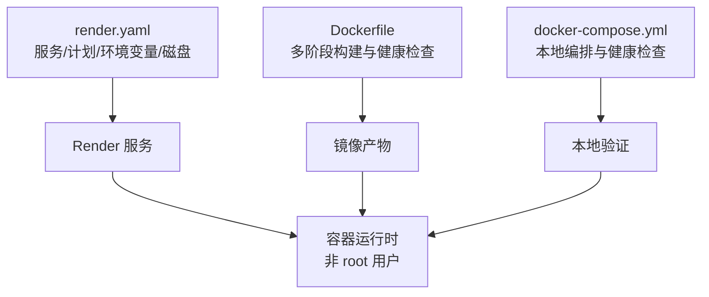
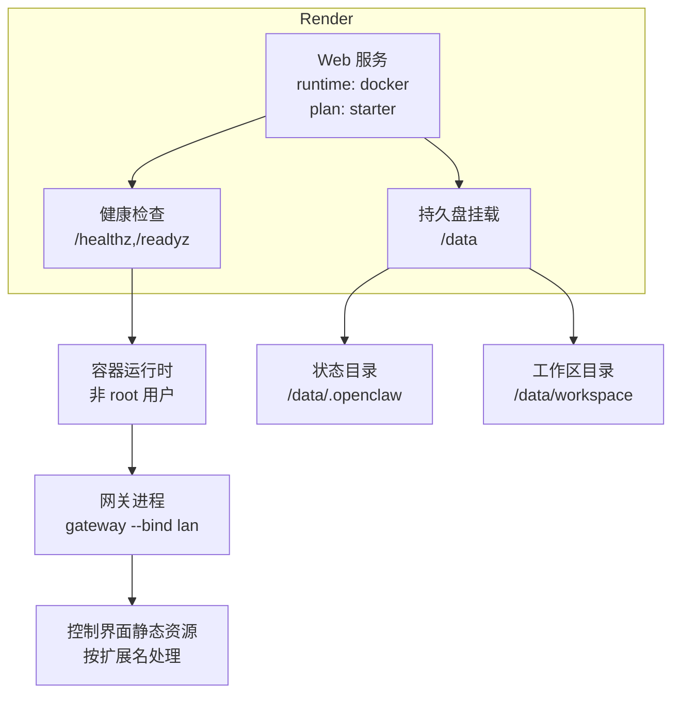
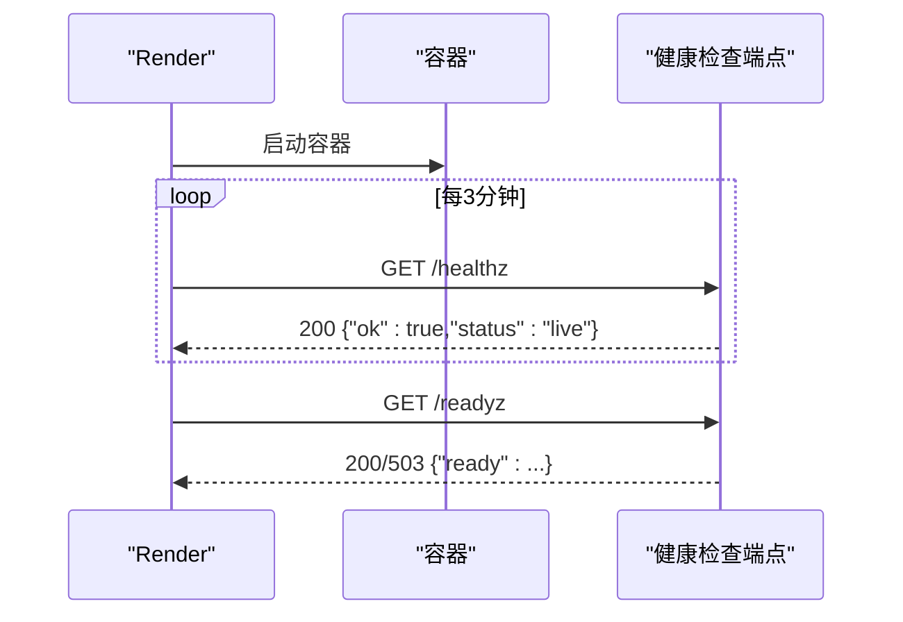
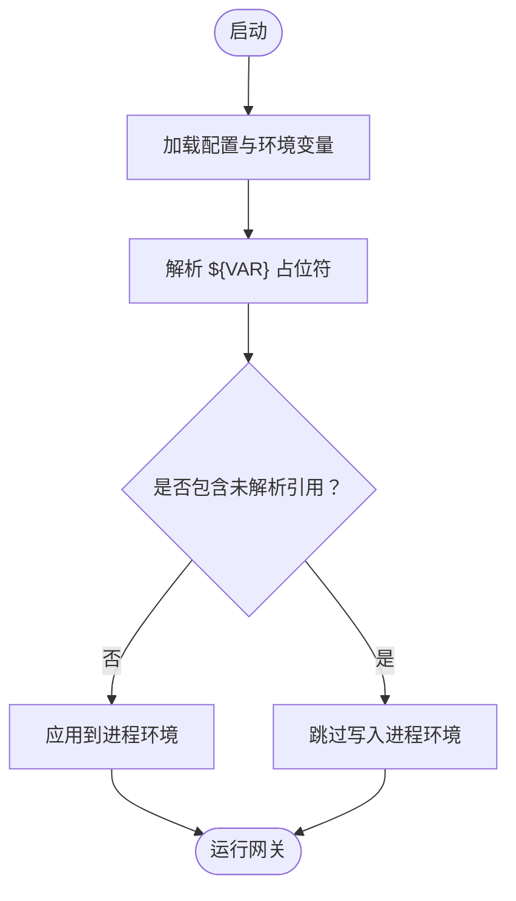
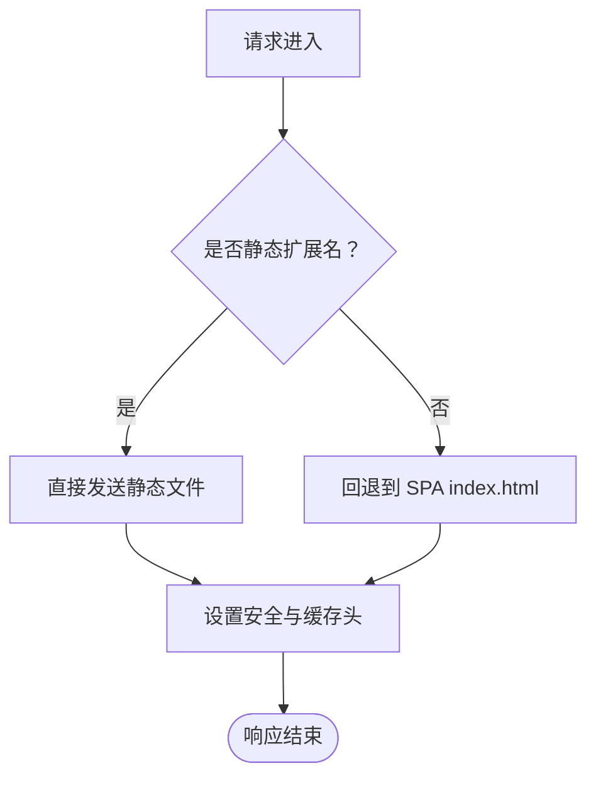
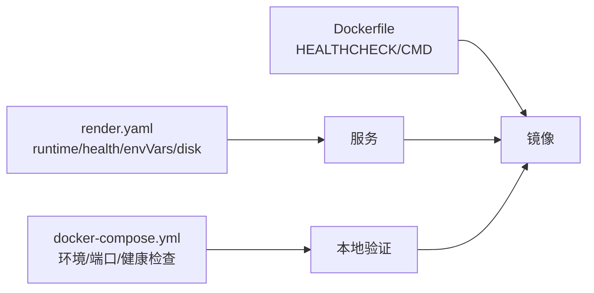

# Render 部署

<cite>
**本文引用的文件**
- [Dockerfile](file://Dockerfile)
- [render.yaml](file://render.yaml)
- [docker-compose.yml](file://docker-compose.yml)
- [docs/install/render.mdx](file://docs/install/render.mdx)
- [src/config/env-vars.ts](file://src/config/env-vars.ts)
- [src/config/env-substitution.ts](file://src/config/env-substitution.ts)
- [src/gateway/server-http.ts](file://src/gateway/server-http.ts)
- [src/gateway/server/readiness.test.ts](file://src/gateway/server/readiness.test.ts)
- [src/gateway/server.plugin-http-auth.test.ts](file://src/gateway/server.plugin-http-auth.test.ts)
- [src/gateway/server-http.probe.test.ts](file://src/gateway/server-http.probe.test.ts)
- [src/canvas-host/server.ts](file://src/canvas-host/server.ts)
- [src/gateway/control-ui.ts](file://src/gateway/control-ui.ts)
- [extensions/open-prose/skills/prose/state/postgres.md](file://extensions/open-prose/skills/prose/state/postgres.md)
- [extensions/diagnostics-otel/src/service.ts](file://extensions/diagnostics-otel/src/service.ts)
</cite>

## 目录
1. [简介](#简介)
2. [项目结构](#项目结构)
3. [核心组件](#核心组件)
4. [架构总览](#架构总览)
5. [详细组件分析](#详细组件分析)
6. [依赖关系分析](#依赖关系分析)
7. [性能考虑](#性能考虑)
8. [故障排除指南](#故障排除指南)
9. [结论](#结论)
10. [附录](#附录)

## 简介
本指南面向在 Render 平台上部署 OpenClaw 的用户，覆盖从镜像构建、环境变量与持久化存储、健康检查到静态资源处理、SSL 与自定义域名、性能优化、成本控制与监控集成的完整流程。文档基于仓库内现有的 Dockerfile、Render 蓝图与相关配置实现，确保可操作性与可追溯性。

## 项目结构
OpenClaw 在根目录提供了用于 Render 的蓝图文件与 Dockerfile，配合 docker-compose 便于本地联调。关键文件与职责如下：
- Dockerfile：多阶段构建，产出最小运行时镜像，内置健康检查与非 root 用户执行。
- render.yaml：Render 蓝图，声明服务类型、运行时、计划、健康检查路径、环境变量与持久盘挂载。
- docker-compose.yml：本地开发与调试用 compose 编排，便于验证网关与 CLI 的连通性。
- 文档：docs/install/render.mdx 提供了部署步骤、计划选择、自定义域名与常见问题等说明。

图表来源
- [Dockerfile:113-250](file://Dockerfile#L113-L250)
- [render.yaml:1-22](file://render.yaml#L1-L22)
- [docker-compose.yml:1-79](file://docker-compose.yml#L1-L79)

章节来源
- [Dockerfile:1-250](file://Dockerfile#L1-L250)
- [render.yaml:1-22](file://render.yaml#L1-L22)
- [docker-compose.yml:1-79](file://docker-compose.yml#L1-L79)
- [docs/install/render.mdx:1-160](file://docs/install/render.mdx#L1-L160)

## 核心组件
- 容器镜像与运行时
  - 使用 Node.js 24-bookworm 基础镜像，多阶段构建以减小体积；默认运行用户为非 root（node），提升安全性。
  - 内置健康检查端点 /healthz 与 /readyz，分别用于存活与就绪探测。
- Render 蓝图
  - 服务类型为 web，运行时为 docker，健康检查路径指向 /health；默认 Starter 计划，支持持久盘挂载与自动重启。
- 环境变量与配置注入
  - 支持通过 Blueprint 或本地 compose 注入关键变量（如 PORT、OPENCLAW_GATEWAY_TOKEN、OPENCLAW_STATE_DIR、OPENCLAW_WORKSPACE_DIR）。
  - 配置层支持环境变量替换与安全过滤，避免危险键注入。
- 静态资源与控制界面
  - 控制界面静态资源按扩展名分类处理，未命中静态文件时回退至 SPA 入口；对缓存与安全头进行限制。
- 数据存储
  - 通过持久盘挂载 /data，映射状态目录与工作区目录，保障重启后配置不丢失（Starter 及以上计划）。

章节来源
- [Dockerfile:228-249](file://Dockerfile#L228-L249)
- [render.yaml:1-22](file://render.yaml#L1-L22)
- [src/config/env-vars.ts:1-98](file://src/config/env-vars.ts#L1-L98)
- [src/config/env-substitution.ts:1-49](file://src/config/env-substitution.ts#L1-L49)
- [src/gateway/control-ui.ts:81-258](file://src/gateway/control-ui.ts#L81-L258)
- [extensions/open-prose/skills/prose/state/postgres.md:134-204](file://extensions/open-prose/skills/prose/state/postgres.md#L134-L204)

## 架构总览
下图展示了 Render 上的部署拓扑：Render 服务拉取 Dockerfile 构建的镜像，启动容器后通过健康检查端点进行探活；持久盘挂载提供状态与工作区数据；控制界面静态资源由网关内部处理。

图表来源
- [render.yaml:1-22](file://render.yaml#L1-L22)
- [Dockerfile:228-249](file://Dockerfile#L228-L249)
- [src/gateway/control-ui.ts:81-258](file://src/gateway/control-ui.ts#L81-L258)

## 详细组件分析

### 容器化与健康检查
- 健康检查端点
  - /healthz：返回存活状态，常用于 liveness 探测。
  - /readyz：返回就绪状态，支持详细失败信息；未认证外部请求仅返回简化状态。
  - /health 与 /ready 为别名，Blueprint 默认使用 /health。
- 探针行为
  - GET/HEAD 方法受支持；其他方法返回 405。
  - 就绪检查失败时返回 503，并在本地请求时包含详细失败项与运行时长。
- Dockerfile 中的 HEALTHCHECK 与 CMD
  - 使用 HTTP GET /healthz 进行存活检测；默认命令启动网关并允许未配置模式。

图表来源
- [Dockerfile:247-249](file://Dockerfile#L247-L249)
- [src/gateway/server-http.ts:205-257](file://src/gateway/server-http.ts#L205-L257)
- [src/gateway/server-http.probe.test.ts:1-155](file://src/gateway/server-http.probe.test.ts#L1-L155)
- [render.yaml:6](file://render.yaml#L6)

章节来源
- [Dockerfile:243-249](file://Dockerfile#L243-L249)
- [src/gateway/server-http.ts:205-257](file://src/gateway/server-http.ts#L205-L257)
- [src/gateway/server.plugin-http-auth.test.ts:144-175](file://src/gateway/server.plugin-http-auth.test.ts#L144-L175)
- [src/gateway/server.readiness.test.ts:208-234](file://src/gateway/server.readiness.test.ts#L208-L234)
- [render.yaml:6](file://render.yaml#L6)

### 环境变量与配置注入
- 关键变量
  - PORT：容器监听端口，默认 8080。
  - SETUP_PASSWORD：首次设置向导密码（Blueprint 中提示输入）。
  - OPENCLAW_STATE_DIR：状态目录，默认 /data/.openclaw。
  - OPENCLAW_WORKSPACE_DIR：工作区目录，默认 /data/workspace。
  - OPENCLAW_GATEWAY_TOKEN：网关访问令牌，Blueprint 自动生成。
- 变量注入机制
  - 配置层支持环境变量替换（如 ${VAR}），并在加载时解析；同时过滤危险键，避免覆盖系统级变量。
  - 若配置中存在未解析的 ${VAR} 引用，则不会写入进程环境，防止误注入占位符。

图表来源
- [src/config/env-substitution.ts:1-49](file://src/config/env-substitution.ts#L1-L49)
- [src/config/env-vars.ts:70-98](file://src/config/env-vars.ts#L70-L98)

章节来源
- [render.yaml:7-21](file://render.yaml#L7-L21)
- [src/config/env-vars.ts:1-98](file://src/config/env-vars.ts#L1-L98)
- [src/config/env-substitution.ts:1-49](file://src/config/env-substitution.ts#L1-L49)

### 静态文件处理与控制界面
- 静态资源扩展白名单：对 JS/CSS/JSON/图片/图标/文本等直接返回，未命中时回退至 SPA 入口。
- 安全与缓存：设置 CSP、X-Frame-Options、X-Content-Type-Options、Referrer-Policy 等安全头；静态资源禁用强缓存，允许浏览器重验证。
- Canvas 主机：支持自定义 basePath，缺失 index.html 时生成默认页面，确保静态资源可用。

图表来源
- [src/gateway/control-ui.ts:81-258](file://src/gateway/control-ui.ts#L81-L258)
- [src/canvas-host/server.ts:168-217](file://src/canvas-host/server.ts#L168-L217)

章节来源
- [src/gateway/control-ui.ts:81-258](file://src/gateway/control-ui.ts#L81-L258)
- [src/canvas-host/server.ts:168-217](file://src/canvas-host/server.ts#L168-L217)

### 数据库连接与状态存储
- 文件系统与 SQLite
  - 默认状态目录位于 OPENCLAW_STATE_DIR（/data/.openclaw），工作区位于 OPENCLAW_WORKSPACE_DIR（/data/workspace）。
  - 适合个人与小团队使用，无需额外依赖。
- PostgreSQL（可选）
  - 适用于高并发、协作或需要外部查询的场景；文档提供了本地/云服务搭建与安全建议。
  - 注意：连接字符串会传递给子会话，需使用受限权限用户与专用库。

章节来源
- [render.yaml:18-21](file://render.yaml#L18-L21)
- [extensions/open-prose/skills/prose/state/postgres.md:134-204](file://extensions/open-prose/skills/prose/state/postgres.md#L134-L204)

### Render 特有配置
- 计划选择
  - Free：免费，空闲 15 分钟后休眠，无持久盘，适合测试。
  - Starter：永不过载，带持久盘，适合个人与小团队。
  - Standard+：支持横向扩展，适合生产与多通道。
- 自定义域名
  - 在服务设置中添加域名，按指引配置 CNAME；Render 自动签发 TLS 证书。
- 日志与 Shell
  - Dashboard 提供构建/部署/运行日志；可打开 Shell 进入容器查看持久盘内容。

章节来源
- [docs/install/render.mdx:63-125](file://docs/install/render.mdx#L63-L125)
- [docs/install/render.mdx:110-116](file://docs/install/render.mdx#L110-L116)
- [docs/install/render.mdx:90-109](file://docs/install/render.mdx#L90-L109)

## 依赖关系分析
- Dockerfile 与 Blueprint 的耦合
  - Blueprint 的 runtime: docker 与 healthCheckPath: /health 与 Dockerfile 中的健康检查端点一致。
  - 环境变量（PORT、OPENCLAW_GATEWAY_TOKEN、OPENCLAW_STATE_DIR、OPENCLAW_WORKSPACE_DIR）由 Blueprint 注入，与容器内监听端口一致。
- 本地与云端一致性
  - docker-compose 与 Blueprint 在环境变量、端口与健康检查上保持一致，便于本地验证后再上线。

图表来源
- [Dockerfile:243-249](file://Dockerfile#L243-L249)
- [render.yaml:1-22](file://render.yaml#L1-L22)
- [docker-compose.yml:1-79](file://docker-compose.yml#L1-L79)

章节来源
- [Dockerfile:243-249](file://Dockerfile#L243-L249)
- [render.yaml:1-22](file://render.yaml#L1-L22)
- [docker-compose.yml:1-79](file://docker-compose.yml#L1-L79)

## 性能考虑
- 冷启动优化
  - Starter 计划避免 Free 的休眠与冷启动延迟；若必须使用 Free，建议在低峰时段触发预热。
- 资源规划
  - 垂直扩容（提高 CPU/内存）通常足以满足 OpenClaw 的负载；水平扩展需注意会话粘性或外部状态管理。
- 静态资源与缓存
  - 控制界面静态资源禁用强缓存，有利于迭代期间快速生效；生产中可通过 CDN 层进一步优化。
- 监控指标
  - 可启用诊断插件（OTEL 扩展）采集消息处理时延、队列深度、会话卡住等指标，辅助定位性能瓶颈。

章节来源
- [docs/install/render.mdx:117-125](file://docs/install/render.mdx#L117-L125)
- [extensions/diagnostics-otel/src/service.ts:201-241](file://extensions/diagnostics-otel/src/service.ts#L201-L241)

## 故障排除指南
- 服务无法启动
  - 检查部署日志，确认是否缺少 SETUP_PASSWORD；核对 PORT 是否与 Dockerfile 一致。
- 健康检查失败
  - Render 要求在 30 秒内返回 200 到 /health；若容器启动过慢，先在本地验证 docker build && docker run。
- 冷启动缓慢（Free）
  - Free 计划空闲后休眠，首次请求会有冷启动延迟；升级 Starter 可获得常驻实例。
- 配置丢失（Free）
  - Free 无持久盘，每次重新部署会重置配置；升级计划或定期导出 /setup/export。
- 端口与绑定
  - Dockerfile 默认绑定 127.0.0.1；在桥接网络下需改为 --bind lan 并设置鉴权，否则宿主不可达。

章节来源
- [docs/install/render.mdx:136-160](file://docs/install/render.mdx#L136-L160)
- [Dockerfile:235-247](file://Dockerfile#L235-L247)

## 结论
通过 Render 蓝图与 Dockerfile 的协同，OpenClaw 可以快速、安全地部署到 Render 平台。结合持久盘、健康检查与环境变量注入，可在 Starter 及以上计划下获得稳定的服务体验；Free 计划适合短期测试。配合诊断插件与合理的资源规划，可实现可观测与高性能的运行效果。

## 附录
- 快速对照清单
  - 在 Blueprint 中设置 PORT=8080、OPENCLAW_GATEWAY_TOKEN 自动生成、OPENCLAW_STATE_DIR 与 OPENCLAW_WORKSPACE_DIR 指向 /data 下的子目录。
  - 选择 Starter 计划以获得持久盘与常驻实例。
  - 如需数据库，参考 PostgreSQL 文档进行搭建与连接。
  - 在 Dashboard 查看日志与 Shell，必要时手动导出配置备份。