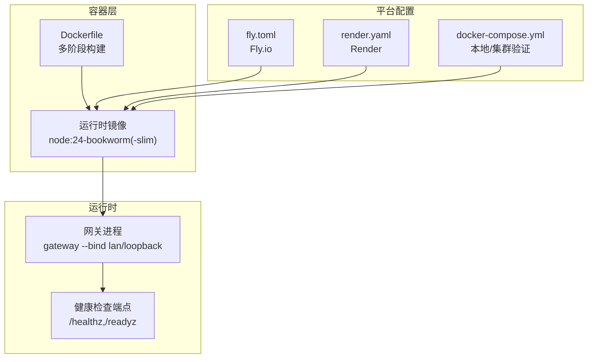
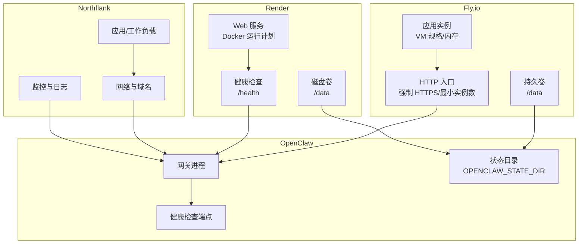
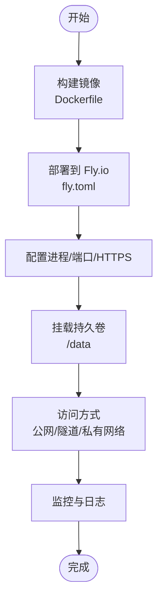
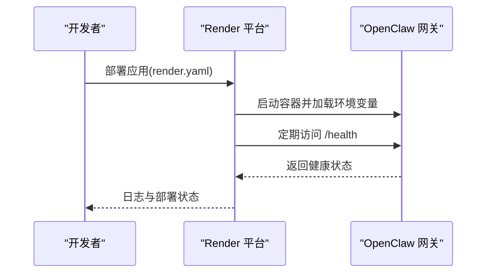
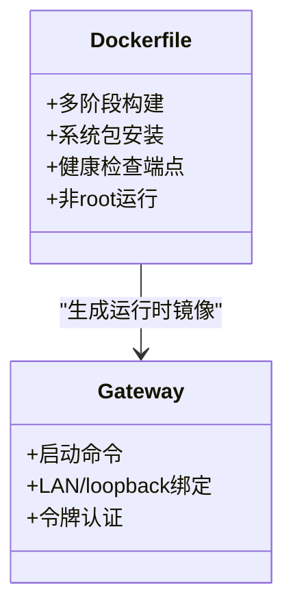
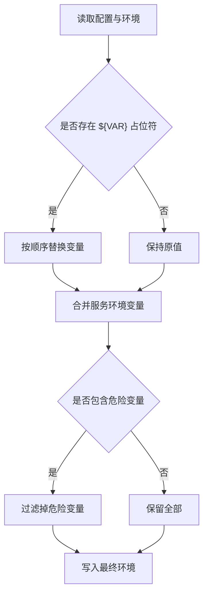
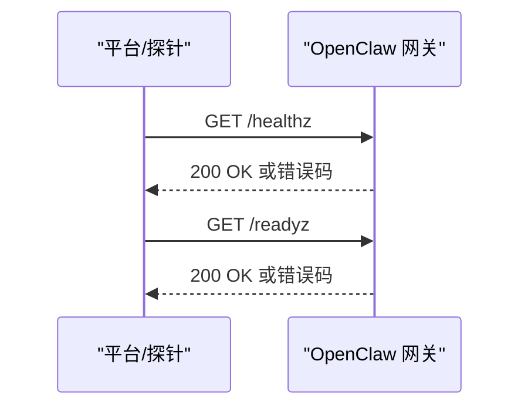
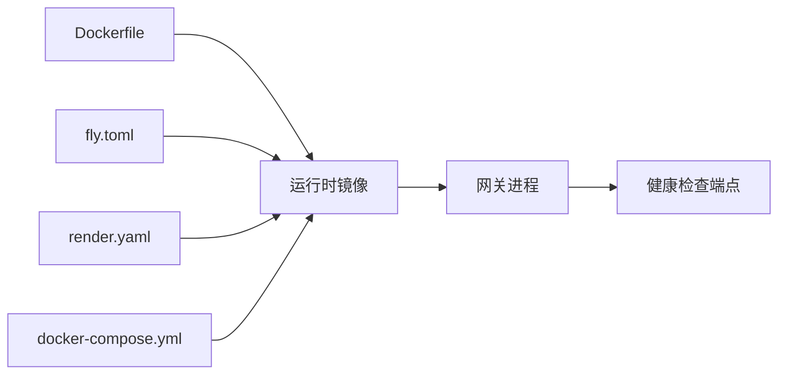

# 云平台部署

<cite>
**本文引用的文件**
- [fly.toml](file://fly.toml)
- [fly.private.toml](file://fly.private.toml)
- [render.yaml](file://render.yaml)
- [Dockerfile](file://Dockerfile)
- [docker-compose.yml](file://docker-compose.yml)
- [.dockerignore](file://.dockerignore)
- [src/commands/daemon-install-helpers.test.ts](file://src/commands/daemon-install-helpers.test.ts)
- [src/config/env-substitution.test.ts](file://src/config/env-substitution.test.ts)
- [src/gateway/server-channels.ts](file://src/gateway/server-channels.ts)
- [scripts/docker/cleanup-smoke/Dockerfile](file://scripts/docker/cleanup-smoke/Dockerfile)
- [scripts/docker/install-sh-e2e/Dockerfile](file://scripts/docker/install-sh-e2e/Dockerfile)
</cite>

## 目录
1. [简介](#简介)
2. [项目结构](#项目结构)
3. [核心组件](#核心组件)
4. [架构总览](#架构总览)
5. [详细组件分析](#详细组件分析)
6. [依赖关系分析](#依赖关系分析)
7. [性能考虑](#性能考虑)
8. [故障排查指南](#故障排查指南)
9. [结论](#结论)
10. [附录](#附录)

## 简介
本指南面向在 Fly.io、Render、Northflank 等主流云平台上部署 OpenClaw 的工程与运维人员。内容覆盖容器化构建、平台特定配置、环境变量管理、域名与 SSL、平台优化与成本控制、性能调优、监控与日志、以及可复用的自动部署流水线建议。文档中的所有技术细节均基于仓库内现有配置与实现进行归纳总结。

## 项目结构
OpenClaw 提供了完整的容器化运行时与多平台部署入口：
- 容器镜像定义：使用多阶段 Dockerfile 构建，支持 slim 与默认变体，并内置健康检查端点。
- 平台配置：Fly.io 使用 toml 配置；Render 使用 YAML 配置；同时提供 docker-compose 用于本地或自管集群验证。
- 运行时入口：通过 openclaw.mjs 或 dist/index.js 启动网关服务，支持 LAN 绑定与安全访问控制。

图表来源
- [Dockerfile:1-250](file://Dockerfile#L1-L250)
- [fly.toml:1-35](file://fly.toml#L1-L35)
- [render.yaml:1-22](file://render.yaml#L1-L22)
- [docker-compose.yml:1-79](file://docker-compose.yml#L1-L79)

章节来源
- [Dockerfile:1-250](file://Dockerfile#L1-L250)
- [fly.toml:1-35](file://fly.toml#L1-L35)
- [render.yaml:1-22](file://render.yaml#L1-L22)
- [docker-compose.yml:1-79](file://docker-compose.yml#L1-L79)

## 核心组件
- 容器镜像与运行时
  - 多阶段构建，最终运行时基于 node:24-bookworm(-slim)，非 root 用户执行，内置健康检查端点。
  - 支持通过构建参数启用浏览器与 Docker CLI，便于沙箱与自动化场景。
- 平台配置
  - Fly.io：定义应用名、主区域、构建参数、进程命令、HTTP 服务、VM 规格与持久盘挂载。
  - Render：定义 Web 服务、Docker 运行计划、健康检查路径、环境变量与磁盘挂载。
  - docker-compose：定义网关与 CLI 服务，支持健康检查与数据卷挂载。
- 环境变量与配置注入
  - 支持从配置中进行环境变量替换与合并，具备对危险变量的过滤策略。
  - 网关支持通过令牌与绑定模式控制外部访问。

章节来源
- [Dockerfile:1-250](file://Dockerfile#L1-L250)
- [fly.toml:1-35](file://fly.toml#L1-L35)
- [render.yaml:1-22](file://render.yaml#L1-L22)
- [docker-compose.yml:1-79](file://docker-compose.yml#L1-L79)
- [src/config/env-substitution.test.ts:45-77](file://src/config/env-substitution.test.ts#L45-L77)
- [src/commands/daemon-install-helpers.test.ts:130-239](file://src/commands/daemon-install-helpers.test.ts#L130-L239)

## 架构总览
下图展示 OpenClaw 在三大平台的典型部署拓扑与数据流：

图表来源
- [fly.toml:1-35](file://fly.toml#L1-L35)
- [render.yaml:1-22](file://render.yaml#L1-L22)
- [Dockerfile:243-249](file://Dockerfile#L243-L249)

## 详细组件分析

### Fly.io 部署配置与最佳实践
- 应用与区域
  - 应用名与主区域需按就近原则选择，以降低延迟。
- 构建与镜像
  - 指定 Dockerfile 路径，确保与仓库根部一致。
- 进程与端口
  - 进程命令启动网关，绑定 LAN 并监听 3000 端口；内部端口与进程映射一致。
  - 强制 HTTPS，保持机器常驻以维持长连接。
- VM 规格与内存
  - 建议使用共享 CPU 双核与 2GB 内存起步，结合实际并发与模型推理需求调整。
- 持久化存储
  - 将 /data 挂载到命名卷，确保状态与工作区持久化。
- 安全与访问
  - 若无需公网暴露，可移除 http_service 块，仅通过 fly proxy 或 WireGuard 访问。
- 域名与 SSL
  - Fly.io 自动分配域名与证书，强制 HTTPS；如需自定义域名，可在平台控制台绑定并启用证书。
- 成本与性能
  - 合理设置最小运行实例数，避免空闲时资源浪费；根据业务峰值提升 VM 规格。
- 监控与日志
  - 使用平台日志与指标面板；结合网关健康检查端点进行可用性告警。

图表来源
- [fly.toml:1-35](file://fly.toml#L1-L35)
- [Dockerfile:1-250](file://Dockerfile#L1-L250)

章节来源
- [fly.toml:1-35](file://fly.toml#L1-L35)
- [fly.private.toml:1-40](file://fly.private.toml#L1-L40)

### Render 部署配置与最佳实践
- 服务类型与运行计划
  - Web 服务 + Docker 运行计划，健康检查路径为 /health。
- 环境变量
  - 暴露端口、状态目录、工作区目录、网关令牌等；令牌建议生成并禁用同步。
- 存储
  - 创建磁盘卷并挂载至 /data，容量按需设置。
- 域名与 SSL
  - Render 支持绑定自定义域名与自动证书；健康检查路径需与网关一致。
- 成本与性能
  - Starter 计划适合开发与小规模生产；根据流量与并发升级计划。
- 监控与日志
  - 使用平台日志与指标；结合健康检查端点建立告警。

图表来源
- [render.yaml:1-22](file://render.yaml#L1-L22)
- [Dockerfile:243-249](file://Dockerfile#L243-L249)

章节来源
- [render.yaml:1-22](file://render.yaml#L1-L22)

### Northflank 部署配置与最佳实践
- 应用与工作负载
  - 在 Northflank 上创建应用，选择容器镜像源（可直接使用仓库构建产物）。
- 网络与域名
  - 配置入站规则与域名解析，启用 HTTPS；确保网关进程可被外部访问。
- 环境变量与密钥
  - 设置 OPENCLAW_STATE_DIR、OPENCLAW_WORKSPACE_DIR、OPENCLAW_GATEWAY_TOKEN 等。
- 存储
  - 使用持久卷挂载 /data，保障状态与工作区数据不丢失。
- 监控与日志
  - 开启容器日志与指标采集；结合健康检查端点进行可用性监控。
- 成本与性能
  - 根据并发与资源占用调整实例规格；启用自动扩缩容策略。

（本节为概念性说明，未直接分析具体文件）

### 容器化与运行时配置
- 多阶段构建
  - 基于 node:24-bookworm(-slim)，安装系统工具与可选组件（浏览器、Docker CLI），最终以非 root 用户运行。
- 健康检查端点
  - 内置 /healthz（存活）与 /readyz（就绪）端点，便于平台健康检查。
- 进程启动
  - 默认通过 openclaw.mjs 启动网关，支持 LAN 绑定与令牌认证。
- docker-compose
  - 定义网关与 CLI 服务，支持健康检查、端口映射与数据卷挂载。

图表来源
- [Dockerfile:1-250](file://Dockerfile#L1-L250)

章节来源
- [Dockerfile:1-250](file://Dockerfile#L1-L250)
- [docker-compose.yml:1-79](file://docker-compose.yml#L1-L79)

### 环境变量与配置注入
- 环境变量替换
  - 支持在配置中使用 ${VAR} 形式进行变量替换，同一字符串内可包含多个变量。
- 合并与优先级
  - 服务环境变量优先于配置中的变量；危险变量会被过滤。
- 空值处理
  - 空值与仅空白字符的变量将被丢弃，避免污染运行时环境。

图表来源
- [src/config/env-substitution.test.ts:45-77](file://src/config/env-substitution.test.ts#L45-L77)
- [src/commands/daemon-install-helpers.test.ts:130-239](file://src/commands/daemon-install-helpers.test.ts#L130-L239)

章节来源
- [src/config/env-substitution.test.ts:45-77](file://src/config/env-substitution.test.ts#L45-L77)
- [src/commands/daemon-install-helpers.test.ts:130-239](file://src/commands/daemon-install-helpers.test.ts#L130-L239)

### 健康检查与通道监控
- 健康检查端点
  - 网关内置 /healthz 与 /readyz，平台可定期探测以判断实例健康状态。
- 通道健康监控
  - 通道级别的健康监控可通过配置开启/关闭，支持账户维度覆盖。

图表来源
- [Dockerfile:243-249](file://Dockerfile#L243-L249)
- [src/gateway/server-channels.ts:136-175](file://src/gateway/server-channels.ts#L136-L175)

章节来源
- [Dockerfile:243-249](file://Dockerfile#L243-L249)
- [src/gateway/server-channels.ts:136-175](file://src/gateway/server-channels.ts#L136-L175)

## 依赖关系分析
- 镜像与平台配置
  - Fly.io 与 Render 均依赖 Dockerfile 生成的运行时镜像；两者通过各自配置文件定义进程、端口、存储与健康检查。
- docker-compose 与生产差异
  - docker-compose 用于本地与自管集群验证，与生产平台配置存在端口、绑定模式与健康检查差异，部署前需确认差异。
- 环境变量与安全
  - 网关启动前会进行环境变量合并与危险变量过滤，确保运行时安全。

图表来源
- [Dockerfile:1-250](file://Dockerfile#L1-L250)
- [fly.toml:1-35](file://fly.toml#L1-L35)
- [render.yaml:1-22](file://render.yaml#L1-L22)
- [docker-compose.yml:1-79](file://docker-compose.yml#L1-L79)

章节来源
- [Dockerfile:1-250](file://Dockerfile#L1-L250)
- [fly.toml:1-35](file://fly.toml#L1-L35)
- [render.yaml:1-22](file://render.yaml#L1-L22)
- [docker-compose.yml:1-79](file://docker-compose.yml#L1-L79)

## 性能考虑
- 内存与 CPU
  - Fly.io 建议从共享 CPU 双核与 2GB 内存起步；根据并发与模型推理负载动态调整。
- 运行时参数
  - 通过 NODE_OPTIONS 控制堆大小，避免 OOM；在容器环境中合理设置最大旧生代内存。
- 浏览器与沙箱
  - 如需浏览器自动化或沙箱隔离，可启用相应构建参数，但会增加镜像体积与启动时间。
- 健康检查间隔
  - 平台健康检查间隔应与网关端点响应时间匹配，避免误判。

（本节提供通用指导，未直接分析具体文件）

## 故障排查指南
- 健康检查失败
  - 确认 /healthz 与 /readyz 端点可达；检查网关进程是否正常启动。
- 环境变量问题
  - 检查配置中的占位符替换结果与服务环境变量优先级；确认危险变量已被过滤。
- 通道健康监控
  - 核对通道配置中的健康监控开关与账户覆盖项，必要时临时关闭以定位问题。
- 容器构建异常
  - 关注多阶段构建缓存与系统包安装步骤；在低内存主机上适当提高内存限制。

章节来源
- [Dockerfile:243-249](file://Dockerfile#L243-L249)
- [src/config/env-substitution.test.ts:45-77](file://src/config/env-substitution.test.ts#L45-L77)
- [src/gateway/server-channels.ts:136-175](file://src/gateway/server-channels.ts#L136-L175)

## 结论
通过统一的容器化构建与平台适配配置，OpenClaw 可在 Fly.io、Render、Northflank 等平台上实现稳定、可观测且可扩展的部署。建议在生产中结合平台特性启用 HTTPS、自定义域名与证书、持久化存储与健康检查，并根据业务负载优化实例规格与成本。

## 附录
- .dockerignore
  - 仓库提供了 .dockerignore 文件，建议在构建镜像时配合使用，减少无关文件进入镜像，缩短构建时间并减小镜像体积。
- 辅助镜像
  - 仓库包含清理与安装脚本的辅助 Dockerfile，可用于 CI 或本地测试场景。

章节来源
- [.dockerignore](file://.dockerignore)
- [scripts/docker/cleanup-smoke/Dockerfile:1-24](file://scripts/docker/cleanup-smoke/Dockerfile#L1-L24)
- [scripts/docker/install-sh-e2e/Dockerfile:1-22](file://scripts/docker/install-sh-e2e/Dockerfile#L1-L22)