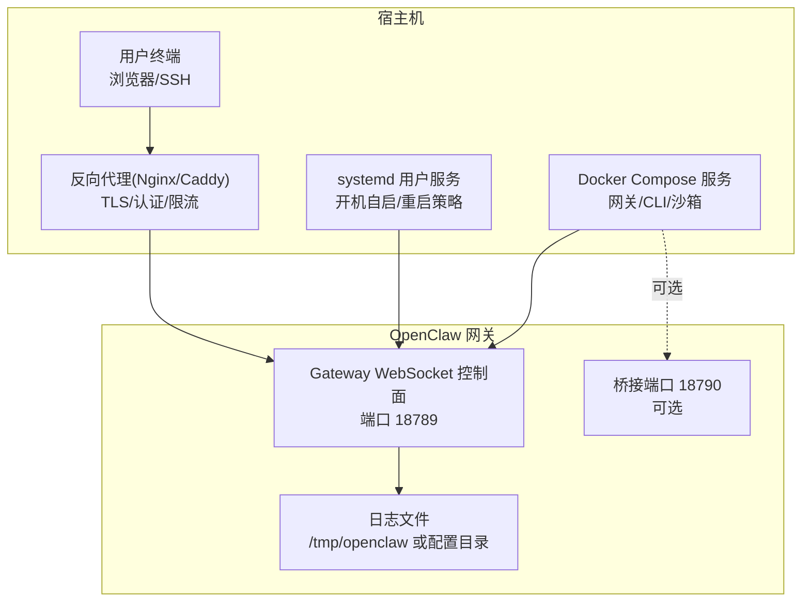
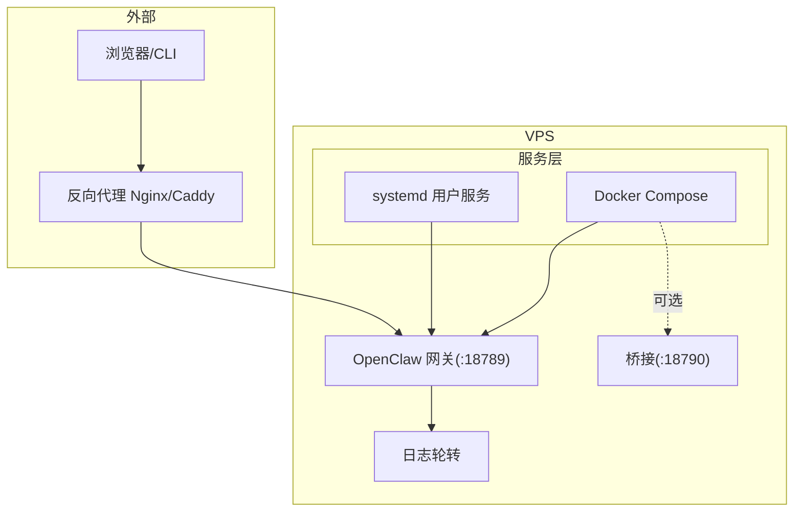
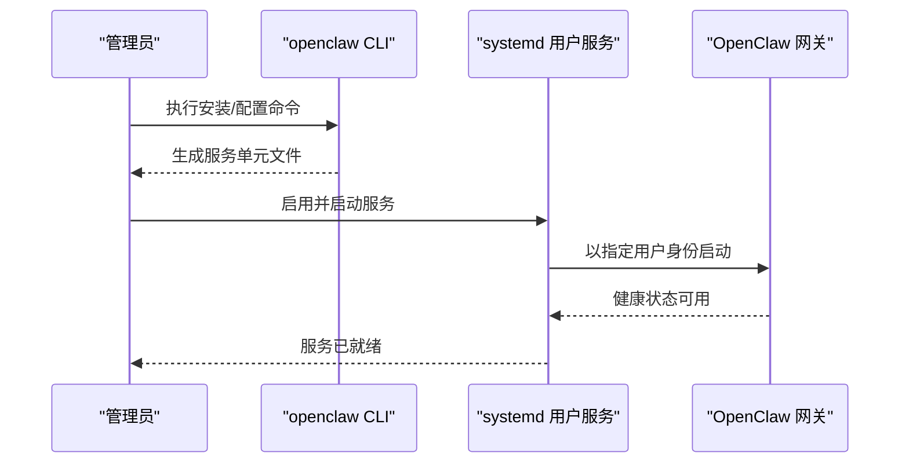
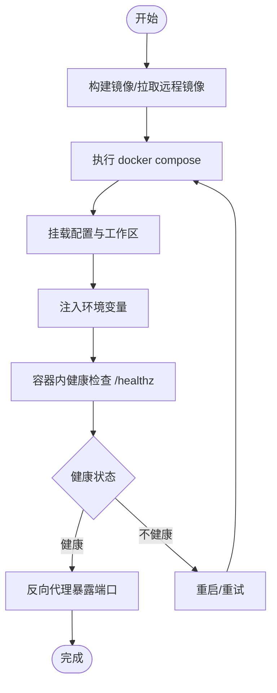
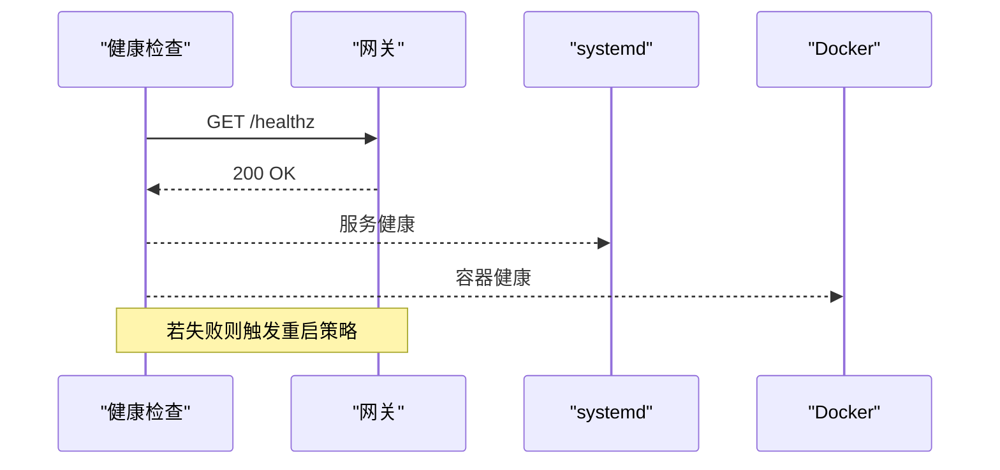
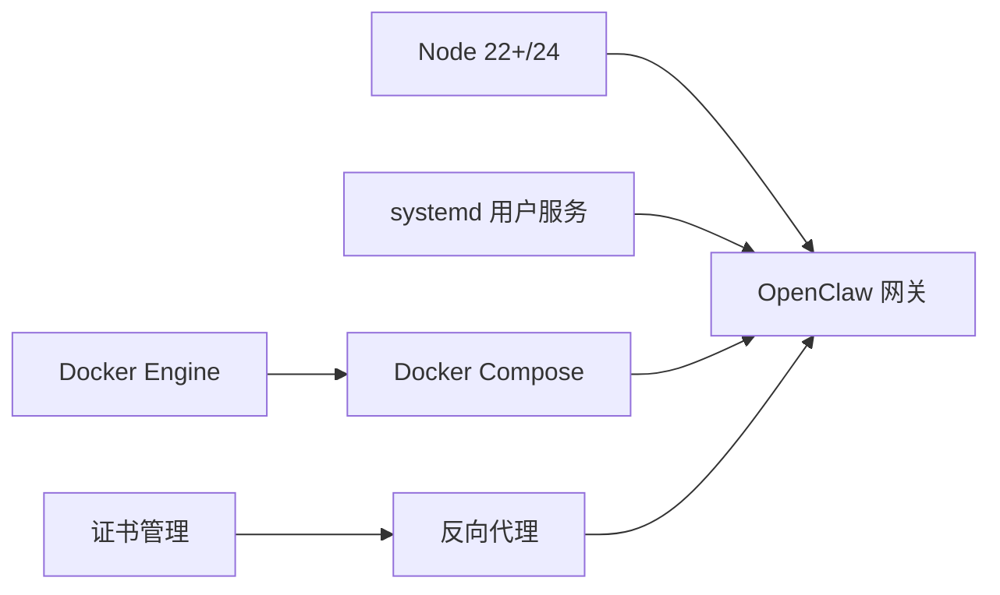

# 传统 VPS 部署

<cite>
**本文引用的文件**
- [README.md](file://README.md)
- [Dockerfile](file://Dockerfile)
- [docker-compose.yml](file://docker-compose.yml)
- [docs/install/docker.md](file://docs/install/docker.md)
- [docs/platforms/linux.md](file://docs/platforms/linux.md)
- [docs/install/updating.md](file://docs/install/updating.md)
- [scripts/systemd/openclaw-auth-monitor.service](file://scripts/systemd/openclaw-auth-monitor.service)
- [scripts/systemd/openclaw-auth-monitor.timer](file://scripts/systemd/openclaw-auth-monitor.timer)
- [scripts/auth-monitor.sh](file://scripts/auth-monitor.sh)
- [scripts/clawlog.sh](file://scripts/clawlog.sh)
- [scripts/setup-auth-system.sh](file://scripts/setup-auth-system.sh)
</cite>

## 目录
1. [简介](#简介)
2. [项目结构](#项目结构)
3. [核心组件](#核心组件)
4. [架构总览](#架构总览)
5. [详细组件分析](#详细组件分析)
6. [依赖关系分析](#依赖关系分析)
7. [性能与资源建议](#性能与资源建议)
8. [故障排查指南](#故障排查指南)
9. [结论](#结论)
10. [附录](#附录)

## 简介
本指南面向在传统 VPS（虚拟专用服务器）上部署 OpenClaw 的用户，覆盖以下主题：
- 系统要求与前置条件
- 两种主流部署路径：原生 systemd 服务与 Docker 容器化
- 反向代理与网络暴露的安全配置
- 自动启动、健康检查、日志轮转与审计
- 备份策略、更新流程与故障恢复
- 安全加固与防火墙配置要点

## 项目结构
OpenClaw 提供了多平台运行方式与丰富的运维参考文档。对于 VPS 部署，推荐使用原生 Node 运行或容器化两种方式，并结合 systemd 与反向代理实现稳定、可审计、可扩展的服务。

图示来源
- [docs/platforms/linux.md:71-95](file://docs/platforms/linux.md#L71-L95)
- [docker-compose.yml:24-38](file://docker-compose.yml#L24-L38)
- [Dockerfile:247-249](file://Dockerfile#L247-L249)

章节来源
- [docs/platforms/linux.md:16-95](file://docs/platforms/linux.md#L16-L95)
- [docker-compose.yml:1-79](file://docker-compose.yml#L1-L79)
- [Dockerfile:1-250](file://Dockerfile#L1-L250)

## 核心组件
- 网关控制平面（WebSocket + HTTP 健康检查）
- 可选的桥接端口（用于特定工具链）
- 日志与健康检查接口
- systemd 用户服务（原生部署）
- Docker Compose 编排（容器化部署）

章节来源
- [Dockerfile:243-249](file://Dockerfile#L243-L249)
- [docker-compose.yml:39-50](file://docker-compose.yml#L39-L50)
- [docs/platforms/linux.md:71-95](file://docs/platforms/linux.md#L71-L95)

## 架构总览
下图展示 VPS 上的典型部署拓扑：反向代理负责 TLS 终止、访问控制与请求转发；systemd 或 Docker Compose 启动网关；浏览器通过受控通道访问 Dashboard。

图示来源
- [docs/platforms/linux.md:71-95](file://docs/platforms/linux.md#L71-L95)
- [docker-compose.yml:24-38](file://docker-compose.yml#L24-L38)
- [Dockerfile:247-249](file://Dockerfile#L247-L249)

## 详细组件分析

### 一、系统要求与前置准备
- 操作系统：任意支持 Node 22+ 的 Linux 发行版（官方文档建议 Node 24）
- 软件依赖：Node、npm/pnpm（或 Bun，但不推荐作为网关运行时）
- 权限：systemd 用户服务或 Docker 容器运行需要非 root 用户权限与必要权限（如 Docker socket 访问）
- 存储：保留 ~/.openclaw 配置与工作区目录，避免频繁重建导致数据丢失
- 网络：开放 18789（网关）、18790（可选桥接），并按需配置反向代理

章节来源
- [docs/platforms/linux.md:16-31](file://docs/platforms/linux.md#L16-L31)
- [docs/install/docker.md:26-34](file://docs/install/docker.md#L26-L34)

### 二、原生 systemd 服务部署（推荐）
- 使用 openclaw 自带的安装与守护进程管理命令，生成 systemd 用户服务单元
- 单元最小示例包含 ExecStart、Restart、RestartSec 等基础字段
- 建议启用持久化（linger）以确保会话登录后仍保持服务运行

图示来源
- [docs/platforms/linux.md:37-95](file://docs/platforms/linux.md#L37-L95)

章节来源
- [docs/platforms/linux.md:37-95](file://docs/platforms/linux.md#L37-L95)

### 三、Docker 容器化部署
- 默认镜像基于 Debian Bookworm，非 root 用户运行，内置健康检查探针
- docker-compose 提供网关与 CLI 服务，支持挂载配置与工作区目录
- 支持可选的 Docker CLI 安装（用于沙箱功能），以及浏览器预装（减少首次启动等待）
- 健康检查通过 /healthz 探测，Compose 层面也定义了探测参数

图示来源
- [Dockerfile:247-249](file://Dockerfile#L247-L249)
- [docker-compose.yml:39-50](file://docker-compose.yml#L39-L50)
- [docs/install/docker.md:47-84](file://docs/install/docker.md#L47-L84)

章节来源
- [Dockerfile:1-250](file://Dockerfile#L1-L250)
- [docker-compose.yml:1-79](file://docker-compose.yml#L1-L79)
- [docs/install/docker.md:35-148](file://docs/install/docker.md#L35-L148)

### 四、反向代理与网络暴露
- 反向代理负责 TLS 终止、基本认证、速率限制与访问控制
- 网关默认绑定到回环地址，容器模式下可通过端口映射暴露；原生模式下建议通过 SSH 隧道或反代访问
- 文档提供了通过 SSH 隧道直连网关的快速路径

章节来源
- [docs/platforms/linux.md:16-25](file://docs/platforms/linux.md#L16-L25)
- [docs/install/docker.md:508-532](file://docs/install/docker.md#L508-L532)

### 五、健康检查与自动重启
- 容器内置 HEALTHCHECK 对 /healthz 进行探测
- systemd 服务建议配置 Restart=always 与合理的 RestartSec
- 可结合定时任务对认证过期进行监控与告警

图示来源
- [Dockerfile:247-249](file://Dockerfile#L247-L249)
- [docs/platforms/linux.md:81-84](file://docs/platforms/linux.md#L81-L84)

章节来源
- [Dockerfile:247-249](file://Dockerfile#L247-L249)
- [docs/platforms/linux.md:81-84](file://docs/platforms/linux.md#L81-L84)

### 六、日志轮转与审计
- 建议使用系统自带的日志轮转工具（如 systemd-journald、logrotate）对网关日志进行轮转
- 可结合 OpenClaw 内置日志输出位置与格式，统一采集与归档
- 提供 clawlog.sh 辅助脚本用于日志处理与归档

章节来源
- [scripts/clawlog.sh](file://scripts/clawlog.sh)

### 七、认证与安全监控
- 提供 systemd timer 与 service，周期性检查认证状态并支持通知（短信/ntfy 等）
- 可通过环境变量配置告警阈值与通知渠道
- 建议在反向代理层开启强密码认证与访问控制

章节来源
- [scripts/systemd/openclaw-auth-monitor.service](file://scripts/systemd/openclaw-auth-monitor.service)
- [scripts/systemd/openclaw-auth-monitor.timer](file://scripts/systemd/openclaw-auth-monitor.timer)
- [scripts/auth-monitor.sh](file://scripts/auth-monitor.sh)

### 八、备份策略
- 配置目录：~/.openclaw（含 openclaw.json、credentials、workspace 等）
- 工作区：~/.openclaw/workspace（技能、会话、媒体等）
- 建议定期打包并异地存储，结合版本控制记录关键配置变更

章节来源
- [docs/install/docker.md:542-544](file://docs/install/docker.md#L542-L544)

### 九、更新流程与回滚
- 推荐重新运行官网安装脚本进行升级，或使用 openclaw update
- 更新前后务必运行 doctor 并重启网关
- 如问题严重，可使用 pin 方式回退到已知稳定版本

章节来源
- [docs/install/updating.md:13-130](file://docs/install/updating.md#L13-L130)
- [docs/install/updating.md:224-276](file://docs/install/updating.md#L224-L276)

### 十、故障恢复方案
- 通过 openclaw doctor 诊断与修复常见问题
- 使用 openclaw gateway restart 快速重启服务
- 若为容器部署，可查看容器健康状态与日志，必要时重建服务

章节来源
- [docs/install/updating.md:187-223](file://docs/install/updating.md#L187-L223)

## 依赖关系分析
- 原生部署依赖 Node 运行时与 systemd 用户服务
- 容器化部署依赖 Docker Engine 与 Compose，可选安装 Docker CLI 以启用沙箱
- 反向代理依赖 Nginx/Caddy 与证书管理（如 Let’s Encrypt）

图示来源
- [docs/platforms/linux.md:16-31](file://docs/platforms/linux.md#L16-L31)
- [docs/install/docker.md:26-34](file://docs/install/docker.md#L26-L34)

## 性能与资源建议
- CPU/内存：根据并发会话与工具调用需求预留资源；容器部署建议启用 Docker CLI 以提升沙箱工具执行效率
- I/O：关注日志与媒体目录增长，合理配置磁盘配额与清理策略
- 网络：反向代理层启用压缩与缓存，降低带宽占用

## 故障排查指南
- 健康检查失败：检查 /healthz 是否可达，确认网关端口未被防火墙阻断
- 认证过期：使用定时监控服务与通知脚本提前预警
- 日志异常：确认日志轮转配置与磁盘空间，必要时切换到更详细的日志级别
- 更新后异常：运行 doctor 并回滚到稳定版本

章节来源
- [Dockerfile:247-249](file://Dockerfile#L247-L249)
- [scripts/systemd/openclaw-auth-monitor.service](file://scripts/systemd/openclaw-auth-monitor.service)
- [scripts/systemd/openclaw-auth-monitor.timer](file://scripts/systemd/openclaw-auth-monitor.timer)
- [scripts/auth-monitor.sh](file://scripts/auth-monitor.sh)
- [docs/install/updating.md:187-223](file://docs/install/updating.md#L187-L223)

## 结论
在传统 VPS 上部署 OpenClaw，建议优先采用原生 Node + systemd 的轻量方案；若需要更强隔离或自动化能力，可选择 Docker 容器化部署。无论哪种方式，都应配合反向代理、健康检查、日志轮转与认证监控，形成完整的可观测与可恢复体系。

## 附录

### A. systemd 用户服务最小示例
- 创建服务文件并启用开机自启
- 建议设置 Restart=always 与合理的 RestartSec

章节来源
- [docs/platforms/linux.md:71-95](file://docs/platforms/linux.md#L71-L95)

### B. Docker Compose 快速启动
- 本地构建镜像或拉取远程镜像
- 运行 onboarding 并启动网关
- 生成并注入网关令牌

章节来源
- [docs/install/docker.md:35-84](file://docs/install/docker.md#L35-L84)

### C. 反向代理配置要点
- TLS 终止与证书管理
- 基于 IP/用户/设备的访问控制
- 速率限制与请求头透传

章节来源
- [docs/platforms/linux.md:16-25](file://docs/platforms/linux.md#L16-L25)

### D. 安全加固清单
- 禁用 root 运行（容器镜像已默认非 root）
- 仅暴露必要端口，使用反向代理统一入口
- 开启健康检查与自动重启
- 定期审计认证状态与日志

章节来源
- [Dockerfile:230-234](file://Dockerfile#L230-L234)
- [scripts/systemd/openclaw-auth-monitor.service](file://scripts/systemd/openclaw-auth-monitor.service)
- [scripts/systemd/openclaw-auth-monitor.timer](file://scripts/systemd/openclaw-auth-monitor.timer)