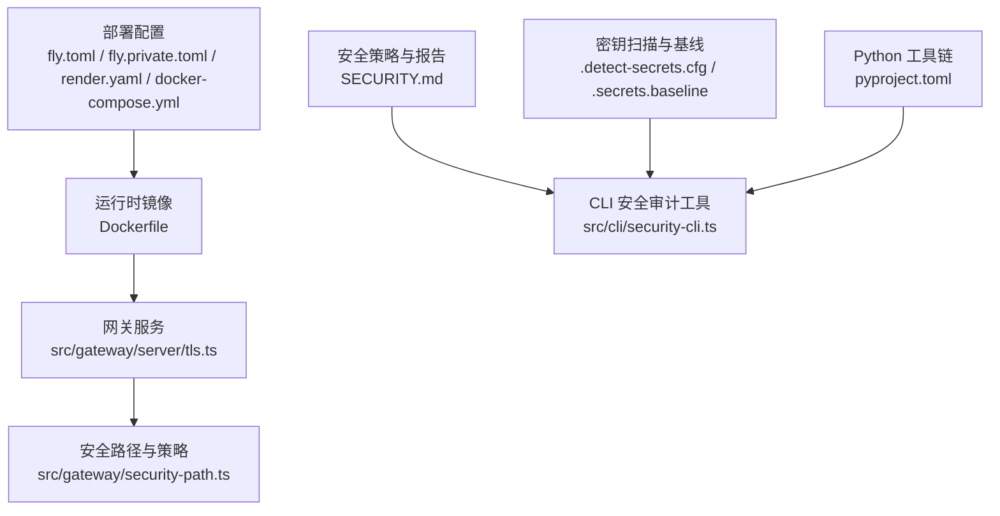
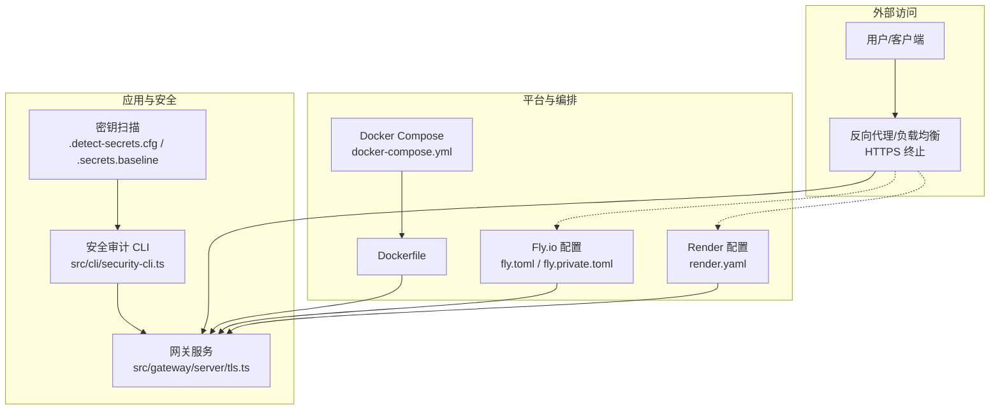
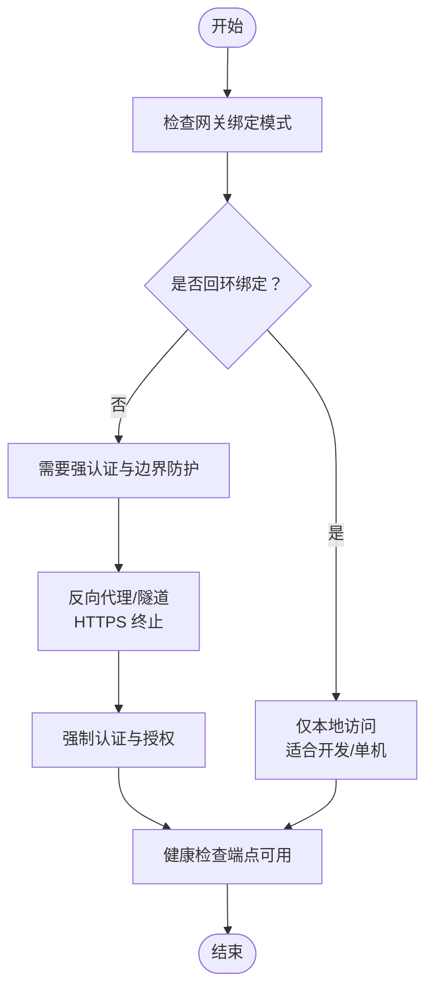
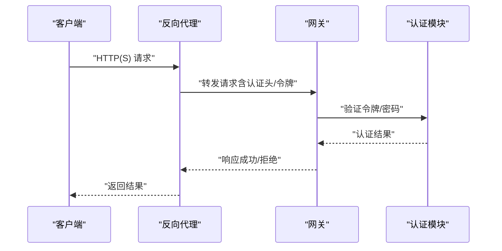
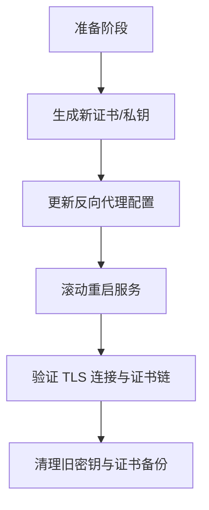
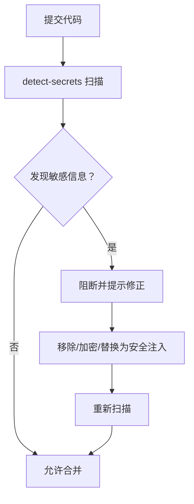
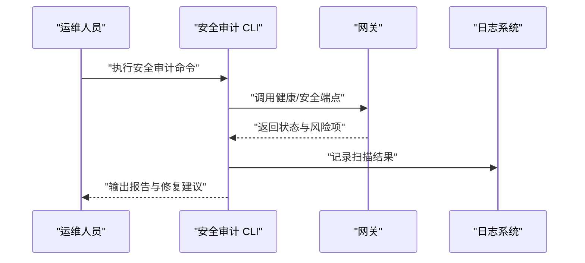
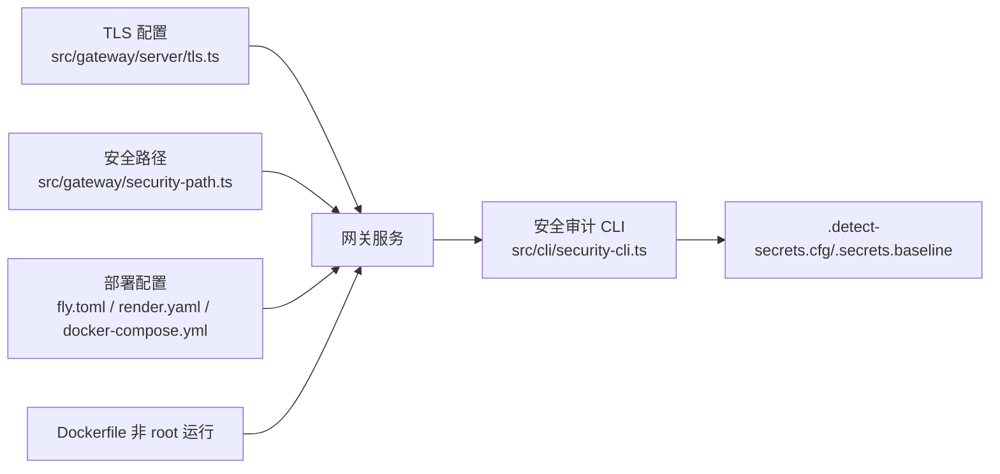

# 安全加固

<cite>
**本文引用的文件**
- [SECURITY.md](file://SECURITY.md)
- [fly.toml](file://fly.toml)
- [fly.private.toml](file://fly.private.toml)
- [render.yaml](file://render.yaml)
- [docker-compose.yml](file://docker-compose.yml)
- [Dockerfile](file://Dockerfile)
- [pyproject.toml](file://pyproject.toml)
- [src/cli/security-cli.ts](file://src/cli/security-cli.ts)
- [src/gateway/server/tls.ts](file://src/gateway/server/tls.ts)
- [src/gateway/security-path.ts](file://src/gateway/security-path.ts)
- [docs/cli/security.md](file://docs/cli/security.md)
- [.detect-secrets.cfg](file://.detect-secrets.cfg)
- [.secrets.baseline](file://.secrets.baseline)
</cite>

## 目录
1. [简介](#简介)
2. [项目结构](#项目结构)
3. [核心组件](#核心组件)
4. [架构总览](#架构总览)
5. [详细组件分析](#详细组件分析)
6. [依赖关系分析](#依赖关系分析)
7. [性能考量](#性能考量)
8. [故障排查指南](#故障排查指南)
9. [结论](#结论)
10. [附录](#附录)

## 简介
本指南面向 OpenClaw 生产环境的安全加固，聚焦网络安全配置、访问控制与身份认证、TLS 证书与密钥管理、敏感信息保护、系统安全扫描与漏洞评估、合规性检查以及入侵检测、审计日志与安全事件响应流程。文档基于仓库内现有安全策略、部署配置与 CLI 工具进行梳理，并提供可操作的加固建议与流程图示。

## 项目结构
OpenClaw 的安全相关资产主要分布在以下区域：
- 部署与运行时：Fly.io、Render、Docker Compose、Dockerfile
- 安全策略与报告：SECURITY.md
- CLI 安全工具：src/cli/security-cli.ts 及其文档
- 网络与 TLS：src/gateway/server/tls.ts、src/gateway/security-path.ts
- 漏洞扫描与密钥基线：.detect-secrets.cfg、.secrets.baseline
- Python 工具链配置（测试与 Lint）：pyproject.toml

图表来源
- [fly.toml:1-35](file://fly.toml#L1-L35)
- [fly.private.toml:1-40](file://fly.private.toml#L1-L40)
- [render.yaml:1-22](file://render.yaml#L1-L22)
- [docker-compose.yml:1-79](file://docker-compose.yml#L1-L79)
- [Dockerfile:1-250](file://Dockerfile#L1-L250)
- [src/gateway/server/tls.ts](file://src/gateway/server/tls.ts)
- [src/gateway/security-path.ts](file://src/gateway/security-path.ts)
- [SECURITY.md:1-293](file://SECURITY.md#L1-L293)
- [src/cli/security-cli.ts](file://src/cli/security-cli.ts)
- [.detect-secrets.cfg](file://.detect-secrets.cfg)
- [.secrets.baseline](file://.secrets.baseline)
- [pyproject.toml:1-11](file://pyproject.toml#L1-L11)

章节来源
- [fly.toml:1-35](file://fly.toml#L1-L35)
- [fly.private.toml:1-40](file://fly.private.toml#L1-L40)
- [render.yaml:1-22](file://render.yaml#L1-L22)
- [docker-compose.yml:1-79](file://docker-compose.yml#L1-L79)
- [Dockerfile:1-250](file://Dockerfile#L1-L250)
- [SECURITY.md:1-293](file://SECURITY.md#L1-L293)
- [src/cli/security-cli.ts](file://src/cli/security-cli.ts)
- [src/gateway/server/tls.ts](file://src/gateway/server/tls.ts)
- [src/gateway/security-path.ts](file://src/gateway/security-path.ts)
- [.detect-secrets.cfg](file://.detect-secrets.cfg)
- [.secrets.baseline](file://.secrets.baseline)
- [pyproject.toml:1-11](file://pyproject.toml#L1-L11)

## 核心组件
- 网关与服务器
  - 网关默认绑定回环地址以降低暴露面；在需要远程访问时应配合强认证与反向代理或隧道。
  - 提供健康检查端点用于容器编排与运维监控。
- 安全审计 CLI
  - 提供安全扫描与修复建议，支持深度扫描与自动修复模式。
- TLS 与证书
  - 网关支持 TLS 配置，结合外部反向代理实现 HTTPS 终止与证书管理。
- 密钥与敏感信息
  - 使用 detect-secrets 进行扫描，维护基线文件避免误报与漏报。
- 部署与隔离
  - Docker 非 root 用户运行、最小权限能力集、只读文件系统等增强容器安全。
  - 多云平台配置示例（Fly.io、Render），支持隐藏入口与私有网络访问。

章节来源
- [SECURITY.md:232-250](file://SECURITY.md#L232-L250)
- [src/cli/security-cli.ts](file://src/cli/security-cli.ts)
- [src/gateway/server/tls.ts](file://src/gateway/server/tls.ts)
- [Dockerfile:230-233](file://Dockerfile#L230-L233)
- [docker-compose.yml:52-79](file://docker-compose.yml#L52-L79)
- [.detect-secrets.cfg](file://.detect-secrets.cfg)
- [.secrets.baseline](file://.secrets.baseline)

## 架构总览
下图展示生产环境中的安全加固架构：网关通过受控边界接入，使用 TLS 终止与强认证；容器层采用非 root 运行与最小权限；CI/CD 中集成密钥扫描；外部平台（Fly.io/Render）提供隐藏入口与弹性伸缩。

图表来源
- [fly.toml:1-35](file://fly.toml#L1-L35)
- [fly.private.toml:1-40](file://fly.private.toml#L1-L40)
- [render.yaml:1-22](file://render.yaml#L1-L22)
- [docker-compose.yml:1-79](file://docker-compose.yml#L1-L79)
- [Dockerfile:1-250](file://Dockerfile#L1-L250)
- [src/gateway/server/tls.ts](file://src/gateway/server/tls.ts)
- [src/cli/security-cli.ts](file://src/cli/security-cli.ts)
- [.detect-secrets.cfg](file://.detect-secrets.cfg)
- [.secrets.baseline](file://.secrets.baseline)

## 详细组件分析

### 网络安全配置
- 绑定与暴露
  - 默认回环绑定降低暴露面；如需外网访问，必须启用强认证与防火墙策略。
  - 容器编排中可通过反向代理或平台隧道实现隐藏入口。
- 健康检查
  - 提供 /healthz 与 /readyz 端点，便于编排系统进行存活与就绪探测。
- 平台配置
  - Fly.io：强制 HTTPS、无公共入口的私有部署模板、VM 规格与挂载数据盘。
  - Render：健康检查路径、环境变量注入与磁盘挂载。
  - Docker Compose：端口映射、健康检查与容器安全选项。

图表来源
- [SECURITY.md:232-250](file://SECURITY.md#L232-L250)
- [fly.toml:20-26](file://fly.toml#L20-L26)
- [fly.private.toml:27-31](file://fly.private.toml#L27-L31)
- [docker-compose.yml:39-50](file://docker-compose.yml#L39-L50)

章节来源
- [SECURITY.md:232-250](file://SECURITY.md#L232-L250)
- [fly.toml:1-35](file://fly.toml#L1-L35)
- [fly.private.toml:1-40](file://fly.private.toml#L1-L40)
- [docker-compose.yml:1-79](file://docker-compose.yml#L1-L79)

### 访问控制策略与身份认证
- 身份认证
  - 网关通过令牌/密码进行认证；Web 控制界面默认仅本地使用，不建议公网暴露。
  - 强烈建议在非本地场景下启用反向代理认证或可信代理头。
- 授权与边界
  - 信任模型为“单一受信操作员”，会话标识为路由控制而非细粒度授权边界。
  - 插件与扩展被视为受信计算基，安装与启用需严格限制。
- 审计与告警
  - 建议在反向代理层开启访问日志与异常检测，结合安全审计 CLI 定期巡检。

图表来源
- [SECURITY.md:91-107](file://SECURITY.md#L91-L107)
- [SECURITY.md:232-250](file://SECURITY.md#L232-L250)
- [src/gateway/server/tls.ts](file://src/gateway/server/tls.ts)

章节来源
- [SECURITY.md:91-107](file://SECURITY.md#L91-L107)
- [SECURITY.md:232-250](file://SECURITY.md#L232-L250)
- [src/gateway/server/tls.ts](file://src/gateway/server/tls.ts)

### TLS 证书管理与密钥轮换
- TLS 终止
  - 建议在反向代理层完成 TLS 终止与证书管理，网关保持内部安全通信。
- 证书与密钥
  - 使用平台提供的证书管理或 ACME 自动签发；定期轮换证书与私钥。
  - 将私钥与证书置于只读卷中，避免明文存储于镜像或配置文件。
- 密钥轮换流程
  - 更新反向代理证书后，滚动重启网关与相关服务。
  - 在变更前后执行安全审计与连通性测试。

图表来源
- [src/gateway/server/tls.ts](file://src/gateway/server/tls.ts)

章节来源
- [src/gateway/server/tls.ts](file://src/gateway/server/tls.ts)

### 敏感信息保护
- 密钥扫描
  - 使用 detect-secrets 扫描仓库中的敏感信息，维护基线文件避免误报。
  - 在 CI/CD 中集成扫描步骤，阻止带密钥的提交。
- 存储与传输
  - 环境变量与密钥通过平台安全注入，避免硬编码到源码或镜像。
  - 使用只读卷与最小权限原则管理状态目录。

图表来源
- [.detect-secrets.cfg](file://.detect-secrets.cfg)
- [.secrets.baseline](file://.secrets.baseline)

章节来源
- [.detect-secrets.cfg](file://.detect-secrets.cfg)
- [.secrets.baseline](file://.secrets.baseline)
- [pyproject.toml:8-11](file://pyproject.toml#L8-L11)

### 系统安全扫描、漏洞评估与合规性检查
- CLI 安全审计
  - 使用安全审计 CLI 执行扫描与修复建议，支持深度模式与自动修复。
  - 结合平台文档了解扫描范围与修复指引。
- 漏洞评估
  - 定期对镜像与依赖进行漏洞扫描，关注 Node.js 版本安全补丁。
- 合规性检查
  - 遵循平台安全配置（如只读文件系统、最小权限能力集）。
  - 保留审计日志与变更记录，满足合规要求。

图表来源
- [src/cli/security-cli.ts](file://src/cli/security-cli.ts)
- [docs/cli/security.md](file://docs/cli/security.md)

章节来源
- [src/cli/security-cli.ts](file://src/cli/security-cli.ts)
- [docs/cli/security.md](file://docs/cli/security.md)

### 入侵检测、审计日志与安全事件响应
- 入侵检测
  - 在反向代理层启用 WAF/速率限制与异常检测规则。
  - 对异常登录、高失败率与异常路径访问进行告警。
- 审计日志
  - 记录网关访问日志、认证尝试与关键操作轨迹。
  - 日志集中化存储与索引，设置保留周期与访问权限。
- 事件响应
  - 制定事件分级与处置流程，包括隔离、取证与恢复。
  - 发生漏洞披露时，按安全策略进行报告与修复。

章节来源
- [SECURITY.md:1-293](file://SECURITY.md#L1-L293)

## 依赖关系分析
- 组件耦合
  - 网关服务依赖 TLS 配置与安全路径策略；部署配置影响访问边界与暴露面。
  - 安全审计 CLI 依赖网关健康端点与平台配置；密钥扫描贯穿 CI/CD。
- 外部依赖
  - 反向代理/平台（Fly.io/Render）负责入口与证书管理。
  - 容器运行时遵循非 root 与最小权限原则。

图表来源
- [src/gateway/server/tls.ts](file://src/gateway/server/tls.ts)
- [src/gateway/security-path.ts](file://src/gateway/security-path.ts)
- [src/cli/security-cli.ts](file://src/cli/security-cli.ts)
- [.detect-secrets.cfg](file://.detect-secrets.cfg)
- [.secrets.baseline](file://.secrets.baseline)
- [fly.toml:1-35](file://fly.toml#L1-L35)
- [render.yaml:1-22](file://render.yaml#L1-L22)
- [docker-compose.yml:1-79](file://docker-compose.yml#L1-L79)
- [Dockerfile:230-233](file://Dockerfile#L230-L233)

章节来源
- [src/gateway/server/tls.ts](file://src/gateway/server/tls.ts)
- [src/gateway/security-path.ts](file://src/gateway/security-path.ts)
- [src/cli/security-cli.ts](file://src/cli/security-cli.ts)
- [.detect-secrets.cfg](file://.detect-secrets.cfg)
- [.secrets.baseline](file://.secrets.baseline)
- [fly.toml:1-35](file://fly.toml#L1-L35)
- [render.yaml:1-22](file://render.yaml#L1-L22)
- [docker-compose.yml:1-79](file://docker-compose.yml#L1-L79)
- [Dockerfile:230-233](file://Dockerfile#L230-L233)

## 性能考量
- 容器安全与性能平衡
  - 非 root 运行与最小权限能力集对性能影响极小，显著提升安全性。
  - 只读文件系统与缓存优化需谨慎配置，避免写入路径导致性能退化。
- 网络与 TLS
  - 反向代理层的 TLS 终止与连接复用可降低网关 CPU 占用。
  - 合理设置健康检查间隔与超时，避免误判与资源浪费。

## 故障排查指南
- 常见问题定位
  - 认证失败：检查令牌/密码、代理头与回源鉴权配置。
  - 网络不可达：确认绑定模式、端口映射与防火墙策略。
  - TLS 异常：核对证书链、过期时间与反向代理重定向。
- 工具与命令
  - 使用安全审计 CLI 获取当前风险与修复建议。
  - 查看网关健康端点与日志，结合平台监控进行关联分析。

章节来源
- [SECURITY.md:282-293](file://SECURITY.md#L282-L293)
- [src/cli/security-cli.ts](file://src/cli/security-cli.ts)

## 结论
通过在入口层实施强认证与 TLS 终止、在容器层采用非 root 与最小权限、在 CI/CD 中集成密钥扫描与漏洞评估，并建立完善的审计日志与事件响应机制，OpenClaw 生产环境可在保证功能可用的同时显著提升整体安全性。建议将本文流程固化为标准操作程序（SOP），并定期复审与演练。

## 附录
- 关键参考文件
  - 安全策略与信任模型：[SECURITY.md:1-293](file://SECURITY.md#L1-L293)
  - CLI 安全审计文档：[docs/cli/security.md](file://docs/cli/security.md)
  - 网关安全路径：[src/gateway/security-path.ts](file://src/gateway/security-path.ts)
  - TLS 配置：[src/gateway/server/tls.ts](file://src/gateway/server/tls.ts)
  - 部署配置
    - Fly.io：[fly.toml:1-35](file://fly.toml#L1-L35)、[fly.private.toml:1-40](file://fly.private.toml#L1-L40)
    - Render：[render.yaml:1-22](file://render.yaml#L1-L22)
    - Docker Compose：[docker-compose.yml:1-79](file://docker-compose.yml#L1-L79)
    - Dockerfile：[Dockerfile:1-250](file://Dockerfile#L1-L250)
  - 密钥扫描与基线：[.detect-secrets.cfg](file://.detect-secrets.cfg)、[.secrets.baseline](file://.secrets.baseline)
  - Python 工具链：[pyproject.toml:1-11](file://pyproject.toml#L1-L11)