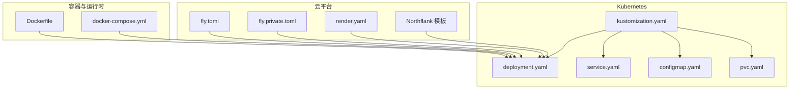
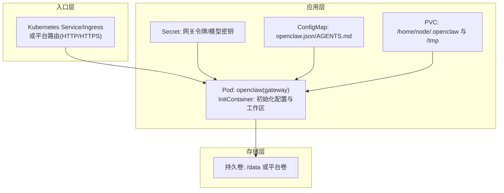
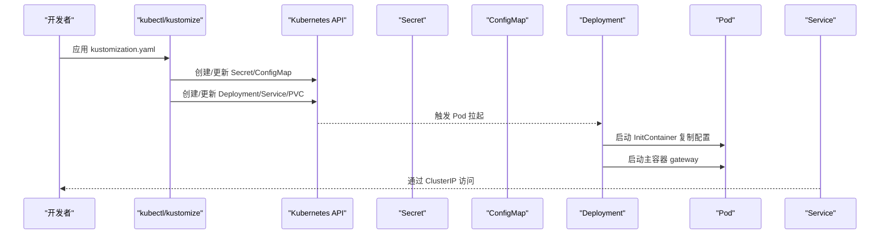
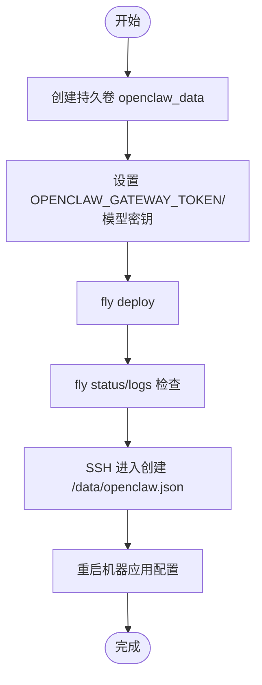
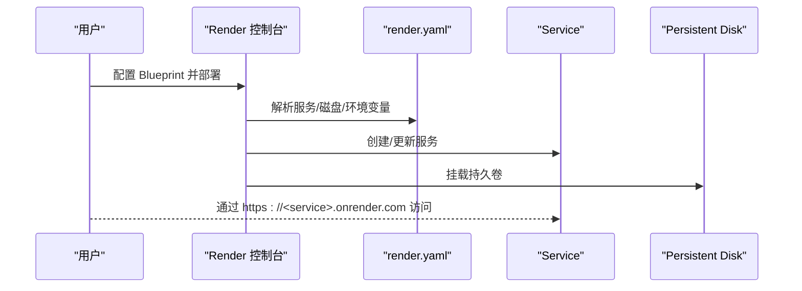
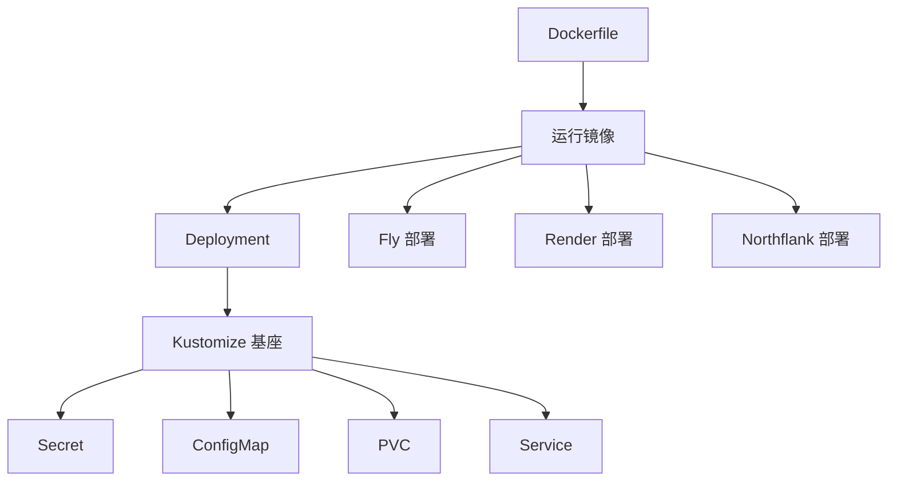

# 生产环境部署

<cite>
**本文引用的文件**
- [Dockerfile](file://Dockerfile)
- [docker-compose.yml](file://docker-compose.yml)
- [fly.toml](file://fly.toml)
- [fly.private.toml](file://fly.private.toml)
- [render.yaml](file://render.yaml)
- [scripts/k8s/manifests/kustomization.yaml](file://scripts/k8s/manifests/kustomization.yaml)
- [scripts/k8s/manifests/deployment.yaml](file://scripts/k8s/manifests/deployment.yaml)
- [scripts/k8s/manifests/service.yaml](file://scripts/k8s/manifests/service.yaml)
- [scripts/k8s/manifests/configmap.yaml](file://scripts/k8s/manifests/configmap.yaml)
- [scripts/k8s/manifests/pvc.yaml](file://scripts/k8s/manifests/pvc.yaml)
- [docs/install/kubernetes.md](file://docs/install/kubernetes.md)
- [docs/install/fly.md](file://docs/install/fly.md)
- [docs/install/render.mdx](file://docs/install/render.mdx)
- [docs/install/northflank.mdx](file://docs/install/northflank.mdx)
- [src/commands/backup-verify.ts](file://src/commands/backup-verify.ts)
- [src/security/audit.test.ts](file://src/security/audit.test.ts)
- [apps/android/app/src/main/java/ai/openclaw/app/gateway/GatewayTls.kt](file://apps/android/app/src/main/java/ai/openclaw/app/gateway/GatewayTls.kt)
- [apps/ios/Sources/Gateway/GatewayConnectionController.swift](file://apps/ios/Sources/Gateway/GatewayConnectionController.swift)
</cite>

## 目录
1. [简介](#简介)
2. [项目结构](#项目结构)
3. [核心组件](#核心组件)
4. [架构总览](#架构总览)
5. [详细组件分析](#详细组件分析)
6. [依赖关系分析](#依赖关系分析)
7. [性能考量](#性能考量)
8. [故障排查指南](#故障排查指南)
9. [结论](#结论)
10. [附录](#附录)

## 简介
本指南面向在生产环境中部署 OpenClaw 的工程团队，覆盖以下目标：
- 在 Kubernetes 集群中使用 Kustomize 进行最小化到可扩展的部署
- 在 Fly.io、Render、Northflank 等云平台进行一键或声明式部署
- 在传统 VPS 上通过 Docker Compose 快速上线
- 负载均衡与高可用、自动扩缩容策略建议
- 监控告警、日志聚合与性能调优
- 安全加固、网络策略与访问控制
- 灾难恢复、备份策略与运维自动化最佳实践

## 项目结构
OpenClaw 提供了多套生产级部署资产：
- 容器镜像与运行时：Dockerfile、运行参数与健康检查
- 编排与编排基座：Kubernetes Kustomize 清单、Docker Compose
- 云平台模板：Fly.io、Render、Northflank 的配置与文档
- 安全与合规：TLS 指纹校验、安全绑定审计、备份验证逻辑



图表来源
- [Dockerfile:1-250](file://Dockerfile#L1-L250)
- [docker-compose.yml:1-79](file://docker-compose.yml#L1-L79)
- [scripts/k8s/manifests/kustomization.yaml:1-8](file://scripts/k8s/manifests/kustomization.yaml#L1-L8)
- [scripts/k8s/manifests/deployment.yaml:1-147](file://scripts/k8s/manifests/deployment.yaml#L1-L147)
- [scripts/k8s/manifests/service.yaml:1-16](file://scripts/k8s/manifests/service.yaml#L1-L16)
- [scripts/k8s/manifests/configmap.yaml:1-39](file://scripts/k8s/manifests/configmap.yaml#L1-L39)
- [scripts/k8s/manifests/pvc.yaml:1-13](file://scripts/k8s/manifests/pvc.yaml#L1-L13)
- [fly.toml:1-35](file://fly.toml#L1-L35)
- [fly.private.toml:1-200](file://fly.private.toml#L1-L200)
- [render.yaml:1-22](file://render.yaml#L1-L22)

章节来源
- [Dockerfile:1-250](file://Dockerfile#L1-L250)
- [docker-compose.yml:1-79](file://docker-compose.yml#L1-L79)
- [scripts/k8s/manifests/kustomization.yaml:1-8](file://scripts/k8s/manifests/kustomization.yaml#L1-L8)
- [scripts/k8s/manifests/deployment.yaml:1-147](file://scripts/k8s/manifests/deployment.yaml#L1-L147)
- [scripts/k8s/manifests/service.yaml:1-16](file://scripts/k8s/manifests/service.yaml#L1-L16)
- [scripts/k8s/manifests/configmap.yaml:1-39](file://scripts/k8s/manifests/configmap.yaml#L1-L39)
- [scripts/k8s/manifests/pvc.yaml:1-13](file://scripts/k8s/manifests/pvc.yaml#L1-L13)
- [fly.toml:1-35](file://fly.toml#L1-L35)
- [fly.private.toml:1-200](file://fly.private.toml#L1-L200)
- [render.yaml:1-22](file://render.yaml#L1-L22)

## 核心组件
- 容器镜像与启动参数
  - 使用 Node.js 24 基础镜像，构建阶段安装 Bun 与 pnpm，运行阶段启用非 root 用户、只读根文件系统、丢弃全部能力，并提供内置健康探针端点
  - 支持通过环境变量注入模型提供商密钥与网关令牌，避免明文写入配置文件
- Kubernetes 部署基座
  - 单副本 Deployment + InitContainer 初始化配置与工作区；ClusterIP Service 暴露 18789 端口；ConfigMap 注入 openclaw.json 与 AGENTS.md；Secret 注入网关令牌与 API 密钥；PersistentVolumeClaim 提供持久存储
- 云平台部署模板
  - Fly.io：带持久卷与 HTTPS 强制、最小运行实例数、公开/私有部署模式
  - Render：Blueprint 声明式定义服务、磁盘、环境变量与健康检查路径
  - Northflank：无服务器式一键部署，浏览器内完成初始化与配置
- 安全与合规
  - 网关绑定与代理信任审计，防止将 loopback 绑定与非回环代理混用导致的安全风险
  - 移动端 TLS 指纹校验与 TOFU 允许策略，支持指纹存储与校验

章节来源
- [Dockerfile:228-249](file://Dockerfile#L228-L249)
- [scripts/k8s/manifests/deployment.yaml:50-147](file://scripts/k8s/manifests/deployment.yaml#L50-L147)
- [scripts/k8s/manifests/configmap.yaml:8-39](file://scripts/k8s/manifests/configmap.yaml#L8-L39)
- [scripts/k8s/manifests/service.yaml:8-16](file://scripts/k8s/manifests/service.yaml#L8-L16)
- [scripts/k8s/manifests/pvc.yaml:8-13](file://scripts/k8s/manifests/pvc.yaml#L8-L13)
- [fly.toml:10-35](file://fly.toml#L10-L35)
- [render.yaml:1-22](file://render.yaml#L1-L22)
- [src/security/audit.test.ts:1634-1689](file://src/security/audit.test.ts#L1634-L1689)
- [apps/android/app/src/main/java/ai/openclaw/app/gateway/GatewayTls.kt:35-66](file://apps/android/app/src/main/java/ai/openclaw/app/gateway/GatewayTls.kt#L35-L66)
- [apps/ios/Sources/Gateway/GatewayConnectionController.swift:508-535](file://apps/ios/Sources/Gateway/GatewayConnectionController.swift#L508-L535)

## 架构总览
下图展示了生产环境的典型拓扑：入口层（Ingress/LoadBalancer/平台路由）+ 应用层（OpenClaw Gateway Pod/VM）+ 存储层（PVC/平台卷）。不同平台的差异主要体现在入口暴露方式与健康检查路径。



图表来源
- [scripts/k8s/manifests/deployment.yaml:1-147](file://scripts/k8s/manifests/deployment.yaml#L1-L147)
- [scripts/k8s/manifests/service.yaml:1-16](file://scripts/k8s/manifests/service.yaml#L1-L16)
- [scripts/k8s/manifests/configmap.yaml:1-39](file://scripts/k8s/manifests/configmap.yaml#L1-L39)
- [scripts/k8s/manifests/pvc.yaml:1-13](file://scripts/k8s/manifests/pvc.yaml#L1-L13)
- [fly.toml:20-35](file://fly.toml#L20-L35)
- [render.yaml:18-22](file://render.yaml#L18-L22)

## 详细组件分析

### Kubernetes 部署（Kustomize）
- 部署策略
  - 单副本 Deployment，Recacreate 策略确保状态一致性；InitContainer 将 ConfigMap 内容复制到用户家目录并创建工作区
  - Pod 安全上下文：非 root、只读根文件系统、丢弃全部能力、默认 seccomp RuntimeDefault
  - 资源请求/限制：CPU/内存预留与上限，结合 HPA 实现自动扩缩容
  - 健康检查：/healthz（存活）、/readyz（就绪），初始延迟与周期可按负载调整
- 存储与配置
  - PVC 10Gi，挂载至 /home/node/.openclaw 与 /tmp
  - ConfigMap 注入 openclaw.json 与 AGENTS.md；Secret 注入网关令牌与各模型提供商密钥
- 可观测性
  - 健康检查端点与日志采集；Prometheus 可抓取 /metrics（如启用）；集中式日志落盘到集群外存储



图表来源
- [scripts/k8s/manifests/kustomization.yaml:1-8](file://scripts/k8s/manifests/kustomization.yaml#L1-L8)
- [scripts/k8s/manifests/deployment.yaml:24-147](file://scripts/k8s/manifests/deployment.yaml#L24-L147)
- [scripts/k8s/manifests/service.yaml:1-16](file://scripts/k8s/manifests/service.yaml#L1-L16)
- [scripts/k8s/manifests/configmap.yaml:1-39](file://scripts/k8s/manifests/configmap.yaml#L1-L39)
- [scripts/k8s/manifests/pvc.yaml:1-13](file://scripts/k8s/manifests/pvc.yaml#L1-L13)

章节来源
- [docs/install/kubernetes.md:1-192](file://docs/install/kubernetes.md#L1-L192)
- [scripts/k8s/manifests/deployment.yaml:1-147](file://scripts/k8s/manifests/deployment.yaml#L1-L147)
- [scripts/k8s/manifests/service.yaml:1-16](file://scripts/k8s/manifests/service.yaml#L1-L16)
- [scripts/k8s/manifests/configmap.yaml:1-39](file://scripts/k8s/manifests/configmap.yaml#L1-L39)
- [scripts/k8s/manifests/pvc.yaml:1-13](file://scripts/k8s/manifests/pvc.yaml#L1-L13)

### Fly.io 部署
- 关键要点
  - 使用持久卷 /data，设置 OPENCLAW_STATE_DIR=/data 以持久化状态
  - 非 loopback 绑定需设置 OPENCLAW_GATEWAY_TOKEN 并开启 HTTPS
  - 最小运行实例数与自动启停控制，适合长期在线场景
  - 支持公开/私有部署：通过 fly.private.toml 释放公网 IP，仅保留私网 IPv6
- 健康检查与端口
  - internal_port 必须与网关监听端口一致（默认 3000）
  - 建议内存不低于 2GB，避免 OOM 重启
- 私有部署
  - 通过 WireGuard、本地代理或 SSH 访问；Webhook 通过 ngrok 或 Tailscale Funnel



图表来源
- [fly.toml:1-35](file://fly.toml#L1-L35)
- [docs/install/fly.md:1-491](file://docs/install/fly.md#L1-L491)

章节来源
- [fly.toml:1-35](file://fly.toml#L1-L35)
- [fly.private.toml:1-200](file://fly.private.toml#L1-L200)
- [docs/install/fly.md:1-491](file://docs/install/fly.md#L1-L491)

### Render 部署
- 关键要点
  - Blueprint 声明式定义服务、磁盘、环境变量与健康检查路径 /health
  - Starter 计划提供持久磁盘；免费计划无持久磁盘，每次重部署会丢失配置
  - 自动构建与部署，支持自定义域名与 TLS
- 扩缩容
  - 垂直扩容：提升计划获得更高 CPU/内存
  - 水平扩容：Standard 及以上计划可增加实例数（需考虑会话粘性或外部状态）



图表来源
- [render.yaml:1-22](file://render.yaml#L1-L22)
- [docs/install/render.mdx:1-160](file://docs/install/render.mdx#L1-L160)

章节来源
- [render.yaml:1-22](file://render.yaml#L1-L22)
- [docs/install/render.mdx:1-160](file://docs/install/render.mdx#L1-L160)

### Northflank 部署
- 关键要点
  - 一键模板，无需服务器命令行
  - 浏览器内完成设置向导，持久卷保存配置与工作区
  - 适合快速试用与轻量生产

章节来源
- [docs/install/northflank.mdx:1-54](file://docs/install/northflank.mdx#L1-L54)

### 传统 VPS（Docker Compose）
- 关键要点
  - 单机多服务：openclaw-gateway + openclaw-cli
  - 端口映射：默认 18789/18790；健康检查基于本地 HTTP 探测
  - 持久化：通过宿主机目录映射 ~/.openclaw 与 workspace
  - 安全：CLI 容器降低权限与能力，避免特权提升

```mermaid
graph LR
GW["openclaw-gateway:18789/18790"] -- "映射到宿主机" -- H1["宿主机:18789/18790"]
CLI["openclaw-cli"] -- "网络共享" -- GW
CFG["~/.openclaw 挂载"] --- GW
WS["~/workspace 挂载"] --- GW
```

图表来源
- [docker-compose.yml:1-79](file://docker-compose.yml#L1-L79)

章节来源
- [docker-compose.yml:1-79](file://docker-compose.yml#L1-L79)

## 依赖关系分析
- 容器镜像与运行参数
  - Dockerfile 定义多阶段构建、运行时精简、非 root 用户与安全能力剥离
  - 运行时内置 /healthz 与 /readyz 探针，便于平台健康检查
- Kubernetes 清单
  - Kustomize 作为基座，组合 Secret、ConfigMap、PVC、Deployment、Service
  - InitContainer 保证首次启动配置就绪
- 云平台模板
  - Fly.io：持久卷 + 环境变量 + HTTPS 强制
  - Render：Blueprint 声明式定义服务与磁盘
  - Northflank：模板化一键部署



图表来源
- [Dockerfile:1-250](file://Dockerfile#L1-L250)
- [scripts/k8s/manifests/kustomization.yaml:1-8](file://scripts/k8s/manifests/kustomization.yaml#L1-L8)
- [fly.toml:1-35](file://fly.toml#L1-L35)
- [render.yaml:1-22](file://render.yaml#L1-L22)
- [docs/install/northflank.mdx:1-54](file://docs/install/northflank.mdx#L1-L54)

章节来源
- [Dockerfile:1-250](file://Dockerfile#L1-L250)
- [scripts/k8s/manifests/kustomization.yaml:1-8](file://scripts/k8s/manifests/kustomization.yaml#L1-L8)
- [fly.toml:1-35](file://fly.toml#L1-L35)
- [render.yaml:1-22](file://render.yaml#L1-L22)
- [docs/install/northflank.mdx:1-54](file://docs/install/northflank.mdx#L1-L54)

## 性能考量
- 内存与垃圾回收
  - 建议在资源限制中为 Node.js 设置合理的 --max-old-space-size，Fly.io 默认已设置，Kubernetes 与 VPS 需在环境变量中显式配置
- 启动与冷启动
  - Render 免费计划存在冷启动延迟；Kubernetes 与 Fly.io 通过预热与健康检查减少抖动
- I/O 与持久化
  - 使用 SSD 类型的持久卷；Kubernetes PVC 选择合适的 StorageClass；Fly/Render 的卷应具备高可用与快照能力
- 并发与会话
  - 对于多通道并发场景，建议采用水平扩展并配合会话粘性或外部状态存储（如 Redis）以避免会话丢失

## 故障排查指南
- 健康检查失败
  - 确认 internal_port 与网关监听端口一致；Kubernetes 中 /healthz 与 /readyz 是否可达
- 内存不足（OOM）
  - 提升内存配额；检查日志中的 SIGABRT/v8 错误；必要时降低日志级别
- 网关锁冲突
  - 删除 /data/gateway.*.lock 文件后重启机器
- 配置未生效
  - 确认 /data/openclaw.json 存在且可读；重启后生效
- 私有部署无法从公网访问
  - 使用 WireGuard、本地代理或 SSH；Webhook 通过 ngrok/Tailscale Funnel
- 安全绑定与代理信任
  - 不要将 loopback 绑定与非回环代理混用；审计配置避免 critical/warn 级别风险

章节来源
- [docs/install/kubernetes.md:154-168](file://docs/install/kubernetes.md#L154-L168)
- [docs/install/fly.md:245-327](file://docs/install/fly.md#L245-L327)
- [src/security/audit.test.ts:1634-1689](file://src/security/audit.test.ts#L1634-L1689)

## 结论
OpenClaw 提供了从单机到多云/多集群的完整生产部署路径。推荐优先采用 Kubernetes + Kustomize 作为标准基座，结合 Fly.io/Render/Northflank 的平台特性实现快速上线与弹性伸缩。同时，通过严格的 TLS 指纹校验、安全绑定审计与备份验证机制，确保生产环境的可用性、安全性与可恢复性。

## 附录

### 负载均衡与高可用
- Kubernetes
  - 使用 Ingress 控制器（NGINX/Contour/Traefik）或云厂商 L4/L7 负载均衡器
  - 配置多副本与滚动更新策略；HPA 基于 CPU/内存或自定义指标自动扩缩容
- 云平台
  - Fly.io：利用平台路由与最小运行实例数保障可用性
  - Render：通过计划升级与实例数扩展实现弹性
  - Northflank：模板化一键部署，适合轻量生产

### 监控告警与日志聚合
- 指标采集
  - Prometheus 抓取 /metrics（如启用）；结合 Grafana 展示
- 日志
  - 容器日志输出到 stdout/stderr；使用 Fluent Bit/Vector 收集并发送到集中式日志系统（如 Loki/Elasticsearch/Splunk）
- 告警
  - 基于健康检查失败、CPU/内存/磁盘阈值触发告警；结合值班流程

### 安全加固与访问控制
- 网络
  - Kubernetes：NetworkPolicy 限制入站/出站；Ingress TLS 终止；RBAC 最小权限
  - 云平台：Fly 私有部署隐藏公网暴露；Render/Northflank 通过平台防火墙与密钥管理
- 认证与授权
  - 网关令牌与模型密钥通过 Secret 管理；移动端 TLS 指纹校验与 TOFU 策略
- 配置审计
  - 定期审计 openclaw.json 与代理信任配置，避免 loopback 与非回环代理混用

章节来源
- [scripts/k8s/manifests/deployment.yaml:19-147](file://scripts/k8s/manifests/deployment.yaml#L19-L147)
- [apps/android/app/src/main/java/ai/openclaw/app/gateway/GatewayTls.kt:35-66](file://apps/android/app/src/main/java/ai/openclaw/app/gateway/GatewayTls.kt#L35-L66)
- [apps/ios/Sources/Gateway/GatewayConnectionController.swift:508-535](file://apps/ios/Sources/Gateway/GatewayConnectionController.swift#L508-L535)

### 灾难恢复与备份策略
- 备份
  - 使用内置备份工具导出配置与工作区；定期归档至对象存储（S3/GCS/OSS）
- 恢复
  - 备份验证流程确保归档完整性；在新环境导入备份并重新注册密钥
- 运维自动化
  - CI/CD 触发部署；蓝绿/金丝雀发布；自动化健康检查与回滚

章节来源
- [src/commands/backup-verify.ts:92-140](file://src/commands/backup-verify.ts#L92-L140)