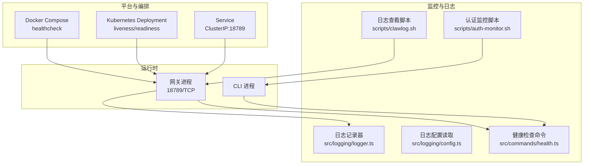
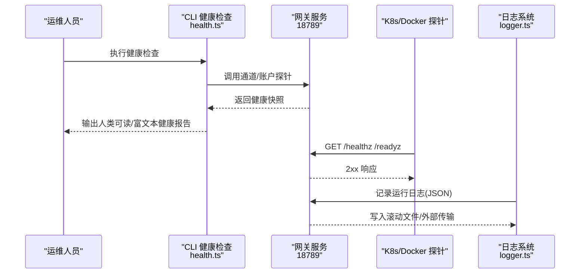
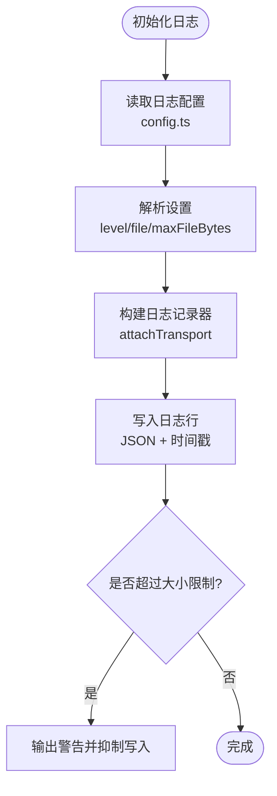
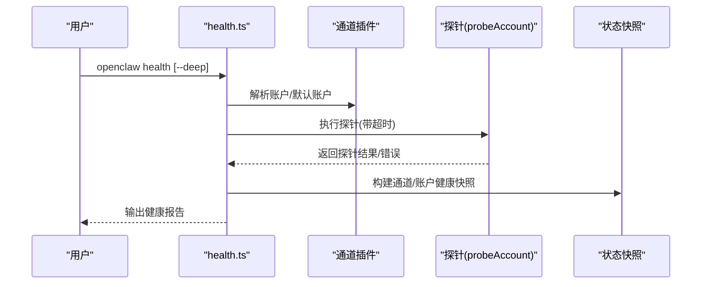
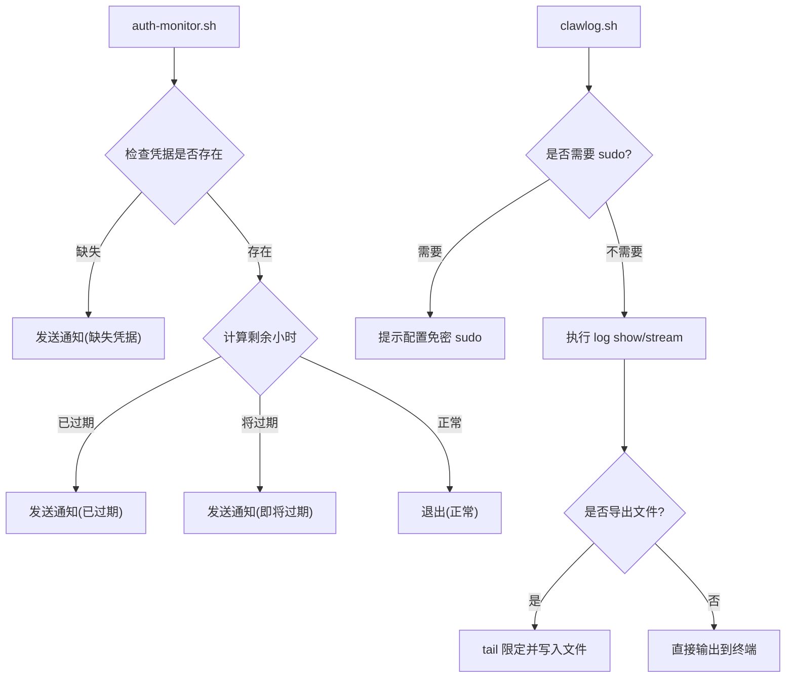
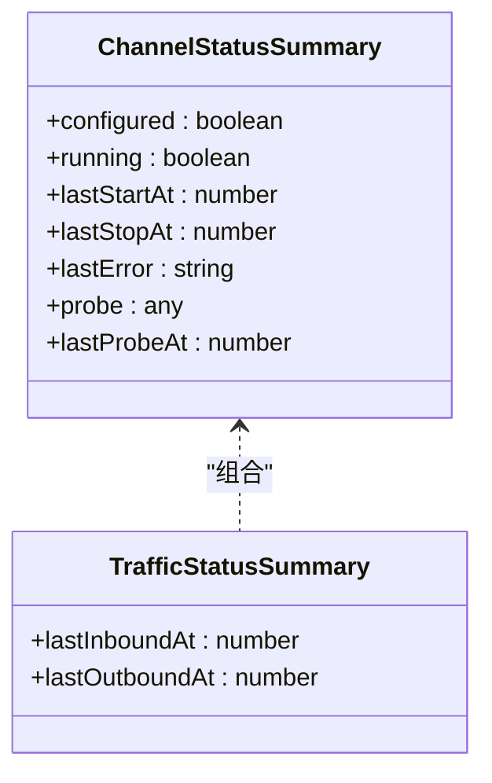
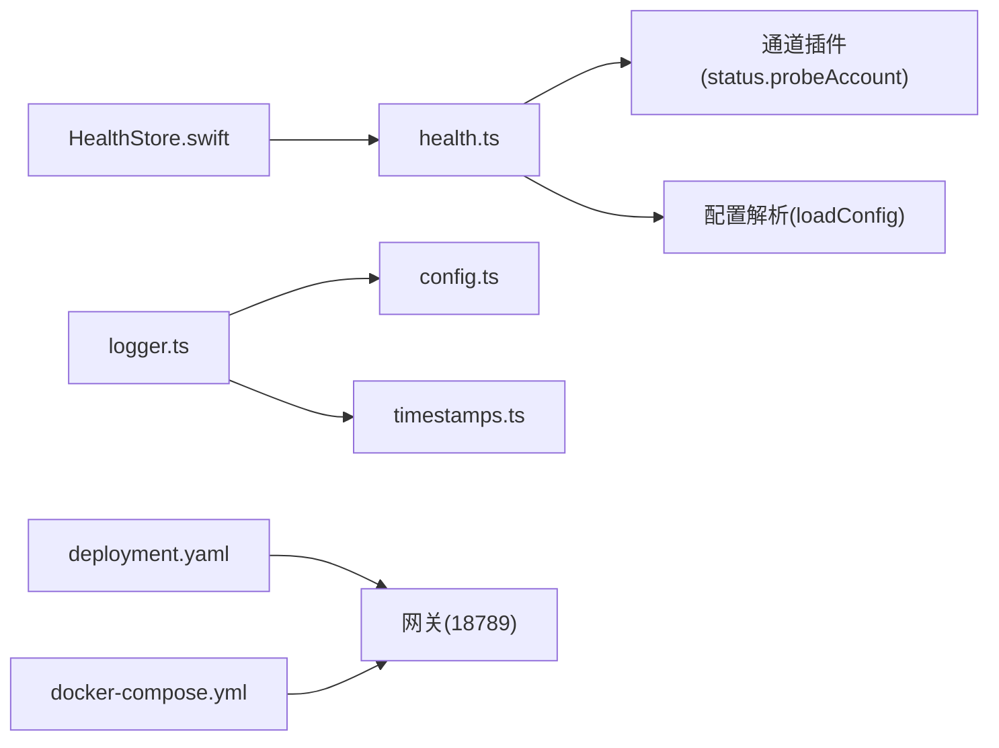

# 监控与日志

<cite>
**本文引用的文件**   
- [scripts/auth-monitor.sh](file://scripts/auth-monitor.sh)
- [scripts/clawlog.sh](file://scripts/clawlog.sh)
- [src/logging/logger.ts](file://src/logging/logger.ts)
- [src/logging/config.ts](file://src/logging/config.ts)
- [src/commands/health.ts](file://src/commands/health.ts)
- [apps/macos/Sources/OpenClaw/HealthStore.swift](file://apps/macos/Sources/OpenClaw/HealthStore.swift)
- [docker-compose.yml](file://docker-compose.yml)
- [scripts/k8s/manifests/deployment.yaml](file://scripts/k8s/manifests/deployment.yaml)
- [scripts/k8s/manifests/service.yaml](file://scripts/k8s/manifests/service.yaml)
- [extensions/shared/channel-status-summary.ts](file://extensions/shared/channel-status-summary.ts)
- [extensions/msteams/src/monitor-types.ts](file://extensions/msteams/src/monitor-types.ts)
- [extensions/nostr/src/nostr-bus.integration.test.ts](file://extensions/nostr/src/nostr-bus.integration.test.ts)
- [src/agents/pi-embedded-error-observation.ts](file://src/agents/pi-embedded-error-observation.ts)
- [src/agents/pi-embedded-error-observation.test.ts](file://src/agents/pi-embedded-error-observation.test.ts)
- [src/config/schema.help.ts](file://src/config/schema.help.ts)
</cite>

## 目录
1. [简介](#简介)
2. [项目结构](#项目结构)
3. [核心组件](#核心组件)
4. [架构总览](#架构总览)
5. [详细组件分析](#详细组件分析)
6. [依赖关系分析](#依赖关系分析)
7. [性能考量](#性能考量)
8. [故障排查指南](#故障排查指南)
9. [结论](#结论)
10. [附录](#附录)

## 简介
本指南面向 OpenClaw 生产环境，聚焦“指标采集、日志聚合与告警配置”，并结合现有代码库中的健康检查、日志记录与状态快照能力，给出可落地的监控与日志管理方案。内容覆盖：
- 指标采集：通道与账户健康度、心跳、会话状态、错误观测与指纹化、电路断路器等
- 日志聚合：统一日志格式、滚动与大小限制、外部传输、敏感信息脱敏
- 告警配置：基于健康检查与认证过期监控的自动化通知
- 运维脚本：健康检查命令、日志查看工具、认证过期监控脚本
- 健康检查与故障诊断：服务探针、状态快照与错误定位

## 项目结构
围绕监控与日志的关键目录与文件：
- 日志与配置：src/logging/*（日志记录、配置读取、脱敏）
- 健康检查：src/commands/health.ts（通道/账户健康快照）、apps/macos/Sources/OpenClaw/HealthStore.swift（macOS 健康状态描述）
- 运维脚本：scripts/clawlog.sh（macOS 统一日志查看）、scripts/auth-monitor.sh（认证过期监控）
- 容器与编排：docker-compose.yml（Docker 健康检查）、scripts/k8s/manifests/*（Kubernetes 探针与服务）
- 状态与指标：extensions/shared/channel-status-summary.ts（通道状态摘要）、extensions/nostr/src/nostr-bus.integration.test.ts（电路断路器指标序列）

图表来源
- [docker-compose.yml:39-50](file://docker-compose.yml#L39-L50)
- [scripts/k8s/manifests/deployment.yaml:106-123](file://scripts/k8s/manifests/deployment.yaml#L106-L123)
- [scripts/k8s/manifests/service.yaml:11-15](file://scripts/k8s/manifests/service.yaml#L11-L15)
- [src/commands/health.ts:1-200](file://src/commands/health.ts#L1-L200)
- [src/logging/logger.ts:1-348](file://src/logging/logger.ts#L1-L348)
- [src/logging/config.ts:1-25](file://src/logging/config.ts#L1-L25)
- [scripts/clawlog.sh:1-322](file://scripts/clawlog.sh#L1-L322)
- [scripts/auth-monitor.sh:1-90](file://scripts/auth-monitor.sh#L1-L90)

章节来源
- [docker-compose.yml:1-79](file://docker-compose.yml#L1-L79)
- [scripts/k8s/manifests/deployment.yaml:1-147](file://scripts/k8s/manifests/deployment.yaml#L1-L147)
- [scripts/k8s/manifests/service.yaml:1-16](file://scripts/k8s/manifests/service.yaml#L1-L16)
- [src/commands/health.ts:1-200](file://src/commands/health.ts#L1-L200)
- [src/logging/logger.ts:1-348](file://src/logging/logger.ts#L1-L348)
- [src/logging/config.ts:1-25](file://src/logging/config.ts#L1-L25)
- [scripts/clawlog.sh:1-322](file://scripts/clawlog.sh#L1-L322)
- [scripts/auth-monitor.sh:1-90](file://scripts/auth-monitor.sh#L1-L90)

## 核心组件
- 日志系统
  - 日志记录器：支持按级别输出到文件、外部传输、滚动与大小限制、时间戳格式化
  - 日志配置：从配置文件读取日志级别、输出路径、最大文件大小等
  - 脱敏与红名单：内置敏感字段脱敏策略，支持自定义正则模式
- 健康检查
  - 命令行健康检查：汇总通道/账户状态、心跳、会话数与最近会话
  - 平台健康描述：macOS 端对通道探针失败进行人性化描述
  - 编排探针：Docker/K8s 提供存活/就绪探针，调用 /healthz 与 /readyz
- 运维脚本
  - clawlog.sh：macOS 统一日志查看与导出，支持过滤、时间范围、错误筛选、JSON 输出
  - auth-monitor.sh：认证过期监控，支持 OpenClaw 通知与 ntfy.sh 推送
- 状态与指标
  - 通道状态摘要：被动式通道/账户状态、探针结果、流量时间戳
  - 错误观测与指纹：请求 ID 提取、消息指纹化、观察日志脱敏
  - 电路断路器指标：Relay 错误计数触发 open/half_open/close 的指标序列

章节来源
- [src/logging/logger.ts:1-348](file://src/logging/logger.ts#L1-L348)
- [src/logging/config.ts:1-25](file://src/logging/config.ts#L1-L25)
- [src/commands/health.ts:1-200](file://src/commands/health.ts#L1-L200)
- [apps/macos/Sources/OpenClaw/HealthStore.swift:147-163](file://apps/macos/Sources/OpenClaw/HealthStore.swift#L147-L163)
- [scripts/clawlog.sh:1-322](file://scripts/clawlog.sh#L1-L322)
- [scripts/auth-monitor.sh:1-90](file://scripts/auth-monitor.sh#L1-L90)
- [extensions/shared/channel-status-summary.ts:1-48](file://extensions/shared/channel-status-summary.ts#L1-L48)
- [src/agents/pi-embedded-error-observation.ts:78-129](file://src/agents/pi-embedded-error-observation.ts#L78-L129)
- [extensions/nostr/src/nostr-bus.integration.test.ts:380-402](file://extensions/nostr/src/nostr-bus.integration.test.ts#L380-L402)

## 架构总览
下图展示生产环境中的监控与日志链路：服务通过健康检查暴露状态；日志以统一 JSON 格式写入滚动文件；运维脚本用于实时查看与告警；容器编排提供探针保障可用性。

图表来源
- [src/commands/health.ts:1-200](file://src/commands/health.ts#L1-L200)
- [scripts/k8s/manifests/deployment.yaml:106-123](file://scripts/k8s/manifests/deployment.yaml#L106-L123)
- [docker-compose.yml:39-50](file://docker-compose.yml#L39-L50)
- [src/logging/logger.ts:126-184](file://src/logging/logger.ts#L126-L184)

## 详细组件分析

### 日志系统与配置
- 统一 JSON 输出：日志对象包含时间戳、级别、子系统与消息，便于下游解析
- 滚动与大小限制：按日期生成日志文件，超过阈值抑制写入并输出警告
- 外部传输：注册外部传输函数，实现日志转发至 ELK 或其他系统
- 配置读取：从配置文件读取日志级别、输出路径、最大文件大小等
- 敏感信息脱敏：内置脱敏规则，支持自定义正则；观察日志脱敏优先级更高

图表来源
- [src/logging/config.ts:8-24](file://src/logging/config.ts#L8-L24)
- [src/logging/logger.ts:73-106](file://src/logging/logger.ts#L73-L106)
- [src/logging/logger.ts:126-184](file://src/logging/logger.ts#L126-L184)
- [src/logging/logger.ts:193-208](file://src/logging/logger.ts#L193-L208)

章节来源
- [src/logging/logger.ts:1-348](file://src/logging/logger.ts#L1-L348)
- [src/logging/config.ts:1-25](file://src/logging/config.ts#L1-L25)

### 健康检查与状态快照
- 命令行健康检查：汇总通道/账户配置/运行/探针/错误、心跳周期、最近会话等
- 平台健康描述：macOS 端对超时/状态码/错误进行人性化描述
- 编排探针：K8s/Docker 使用 HTTP 探针访问 /healthz 与 /readyz

图表来源
- [src/commands/health.ts:489-795](file://src/commands/health.ts#L489-L795)
- [apps/macos/Sources/OpenClaw/HealthStore.swift:147-163](file://apps/macos/Sources/OpenClaw/HealthStore.swift#L147-L163)

章节来源
- [src/commands/health.ts:1-200](file://src/commands/health.ts#L1-L200)
- [src/commands/health.ts:489-795](file://src/commands/health.ts#L489-L795)
- [apps/macos/Sources/OpenClaw/HealthStore.swift:147-163](file://apps/macos/Sources/OpenClaw/HealthStore.swift#L147-L163)

### 运维脚本与自动化
- clawlog.sh：macOS 统一日志查看与导出，支持类别过滤、错误筛选、时间范围、JSON 输出
- auth-monitor.sh：认证过期监控，支持 OpenClaw 通知与 ntfy.sh 推送，避免频繁重复告警

图表来源
- [scripts/auth-monitor.sh:68-90](file://scripts/auth-monitor.sh#L68-L90)
- [scripts/clawlog.sh:28-322](file://scripts/clawlog.sh#L28-L322)

章节来源
- [scripts/auth-monitor.sh:1-90](file://scripts/auth-monitor.sh#L1-L90)
- [scripts/clawlog.sh:1-322](file://scripts/clawlog.sh#L1-L322)

### 状态与指标：通道、错误与断路器
- 通道状态摘要：被动式汇总配置/运行/探针/最后探针时间等
- 错误观测与指纹：提取请求 ID、稳定化结构化指纹、观察日志脱敏优先
- 断路器指标：Relay 错误触发 open/half_open/close 指标序列

图表来源
- [extensions/shared/channel-status-summary.ts:1-48](file://extensions/shared/channel-status-summary.ts#L1-L48)

章节来源
- [extensions/shared/channel-status-summary.ts:1-48](file://extensions/shared/channel-status-summary.ts#L1-L48)
- [src/agents/pi-embedded-error-observation.ts:78-129](file://src/agents/pi-embedded-error-observation.ts#L78-L129)
- [extensions/nostr/src/nostr-bus.integration.test.ts:380-402](file://extensions/nostr/src/nostr-bus.integration.test.ts#L380-L402)

## 依赖关系分析
- 健康检查依赖通道插件的探针能力与配置解析
- 日志系统依赖配置模块与时间戳模块，支持外部传输
- 编排层依赖网关的健康端点与就绪端点
- macOS 平台对通道探针失败进行人性化描述

图表来源
- [src/commands/health.ts:1-200](file://src/commands/health.ts#L1-L200)
- [src/logging/logger.ts:1-348](file://src/logging/logger.ts#L1-L348)
- [src/logging/config.ts:1-25](file://src/logging/config.ts#L1-L25)
- [scripts/k8s/manifests/deployment.yaml:1-147](file://scripts/k8s/manifests/deployment.yaml#L1-L147)
- [docker-compose.yml:1-79](file://docker-compose.yml#L1-L79)
- [apps/macos/Sources/OpenClaw/HealthStore.swift:147-163](file://apps/macos/Sources/OpenClaw/HealthStore.swift#L147-L163)

章节来源
- [src/commands/health.ts:1-200](file://src/commands/health.ts#L1-L200)
- [src/logging/logger.ts:1-348](file://src/logging/logger.ts#L1-L348)
- [src/logging/config.ts:1-25](file://src/logging/config.ts#L1-L25)
- [scripts/k8s/manifests/deployment.yaml:1-147](file://scripts/k8s/manifests/deployment.yaml#L1-L147)
- [docker-compose.yml:1-79](file://docker-compose.yml#L1-L79)
- [apps/macos/Sources/OpenClaw/HealthStore.swift:147-163](file://apps/macos/Sources/OpenClaw/HealthStore.swift#L147-L163)

## 性能考量
- 日志写入抑制：当日志文件达到大小上限时，系统仅输出一次警告并抑制后续写入，避免磁盘打满与 I/O 放大
- 测试优化：在测试环境中默认静默文件日志，减少配置加载开销
- 探针超时：健康检查与通道探针设置合理超时，避免阻塞主流程
- 滚动清理：按天滚动日志并在 24 小时后清理旧文件，控制存储占用

章节来源
- [src/logging/logger.ts:149-184](file://src/logging/logger.ts#L149-L184)
- [src/logging/logger.ts:323-347](file://src/logging/logger.ts#L323-L347)
- [src/commands/health.ts:75](file://src/commands/health.ts#L75)

## 故障排查指南
- 认证过期告警
  - 使用 auth-monitor.sh 监控 Claude Code 凭据过期，支持 OpenClaw 通知与 ntfy.sh 推送
  - 建议设置最小间隔避免频繁告警
- 日志查看与导出
  - 使用 clawlog.sh 查看最近日志、错误筛选、时间范围与类别过滤
  - 导出到文件时注意 sudo 权限与免密配置
- 健康检查
  - 使用 openclaw health 获取通道/账户健康快照，必要时添加 --deep 获取更详细信息
  - macOS 端若出现探针超时或状态异常，参考 HealthStore.swift 的描述逻辑定位原因
- 编排探针
  - K8s/Docker 探针返回非 2xx 时，检查网关端口与令牌配置

章节来源
- [scripts/auth-monitor.sh:1-90](file://scripts/auth-monitor.sh#L1-L90)
- [scripts/clawlog.sh:1-322](file://scripts/clawlog.sh#L1-L322)
- [src/commands/health.ts:1-200](file://src/commands/health.ts#L1-L200)
- [apps/macos/Sources/OpenClaw/HealthStore.swift:147-163](file://apps/macos/Sources/OpenClaw/HealthStore.swift#L147-L163)
- [scripts/k8s/manifests/deployment.yaml:106-123](file://scripts/k8s/manifests/deployment.yaml#L106-L123)
- [docker-compose.yml:39-50](file://docker-compose.yml#L39-L50)

## 结论
通过现有健康检查、日志系统与运维脚本，OpenClaw 已具备生产级的监控与日志基础能力。建议在此基础上：
- 引入外部日志传输（如 registerLogTransport），对接 ELK/OTel 管线
- 在 Grafana 中基于网关健康端点与通道探针数据构建仪表板
- 将 auth-monitor.sh 与健康检查命令纳入自动化巡检任务
- 对关键通道与错误观测建立告警规则（如断路器打开、错误指纹突增）

## 附录
- 配置项参考（日志与通道心跳等）
  - 日志控制：consoleLevel、consoleStyle、redactSensitive、redactPatterns
  - 通道心跳：heartbeat.showOk、heartbeat.showAlerts、heartbeat.useIndicator
- 相关类型与接口
  - MSTeams 监控日志器类型：MSTeamsMonitorLogger
  - 通道状态摘要：buildPassiveChannelStatusSummary/buildPassiveProbedChannelStatusSummary

章节来源
- [src/config/schema.help.ts:46-1414](file://src/config/schema.help.ts#L46-L1414)
- [extensions/msteams/src/monitor-types.ts:1-5](file://extensions/msteams/src/monitor-types.ts#L1-L5)
- [extensions/shared/channel-status-summary.ts:16-48](file://extensions/shared/channel-status-summary.ts#L16-L48)