# 高可用性配置

<cite>
**本文档引用的文件**
- [README.md](file://README.md)
- [fly.toml](file://fly.toml)
- [fly.private.toml](file://fly.private.toml)
- [docker-compose.yml](file://docker-compose.yml)
- [Dockerfile](file://Dockerfile)
- [deployment.yaml](file://scripts/k8s/manifests/deployment.yaml)
- [service.yaml](file://scripts/k8s/manifests/service.yaml)
- [configmap.yaml](file://scripts/k8s/manifests/configmap.yaml)
- [pvc.yaml](file://scripts/k8s/manifests/pvc.yaml)
</cite>

## 目录
1. [简介](#简介)
2. [项目结构](#项目结构)
3. [核心组件](#核心组件)
4. [架构概览](#架构概览)
5. [详细组件分析](#详细组件分析)
6. [依赖关系分析](#依赖关系分析)
7. [性能考虑](#性能考虑)
8. [故障排查指南](#故障排查指南)
9. [结论](#结论)
10. [附录](#附录)

## 简介

OpenClaw 是一个可在用户自己的设备上运行的个人 AI 助手系统。本文档专注于为 OpenClaw 创建高可用性部署的专业指南，涵盖多网关集群配置、负载均衡策略、故障转移机制、服务发现、健康检查、自动扩缩容设置、网络拓扑设计、数据同步和一致性保证方案，以及监控告警、性能基准测试和容量规划指导。

OpenClaw 的核心是网关（Gateway），它作为控制平面处理会话、通道、工具和事件。网关通过 WebSocket 提供统一的控制接口，并支持多种渠道连接（如 WhatsApp、Telegram、Slack、Discord、Google Chat、Signal、iMessage、BlueBubbles、IRC、Microsoft Teams、Matrix、Feishu、LINE、Mattermost、Nextcloud Talk、Nostr、Synology Chat、Tlon、Twitch、Zalo、Zalo Personal 和 WebChat）。

## 项目结构

OpenClaw 提供了多种部署方式，包括 Docker Compose、Fly.io 和 Kubernetes。每种部署方式都包含了完整的网关服务、健康检查和持久化存储配置。

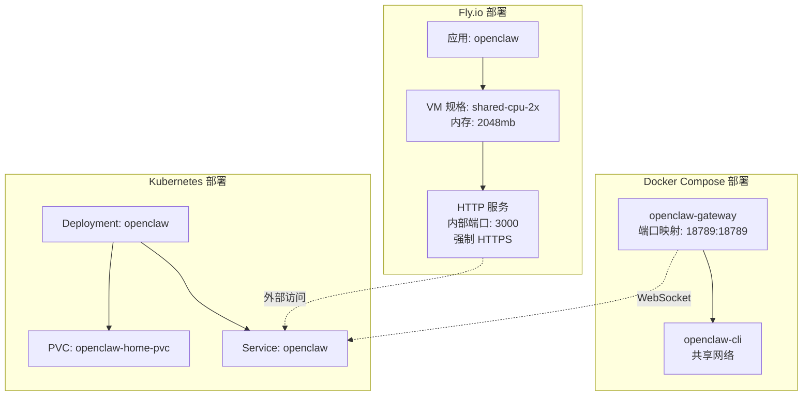

**图表来源**
- [docker-compose.yml:1-79](file://docker-compose.yml#L1-L79)
- [fly.toml:1-35](file://fly.toml#L1-L35)
- [deployment.yaml:1-147](file://scripts/k8s/manifests/deployment.yaml#L1-L147)
- [service.yaml:1-16](file://scripts/k8s/manifests/service.yaml#L1-L16)

**章节来源**
- [README.md:1-560](file://README.md#L1-L560)
- [docker-compose.yml:1-79](file://docker-compose.yml#L1-L79)
- [fly.toml:1-35](file://fly.toml#L1-L35)
- [deployment.yaml:1-147](file://scripts/k8s/manifests/deployment.yaml#L1-L147)

## 核心组件

### 网关服务
- **WebSocket 控制平面**: 提供统一的网关通信接口
- **健康检查端点**: `/healthz` (存活) 和 `/readyz` (就绪)
- **认证模式**: 支持令牌认证和密码认证
- **绑定模式**: 支持 loopback (127.0.0.1) 和 lan (0.0.0.0)

### 容器化配置
- **镜像变体**: 默认和精简两种运行时基础镜像
- **安全加固**: 非 root 用户运行、capabilities 限制、只读根文件系统
- **系统包**: 可选安装浏览器自动化和 Docker CLI

### 持久化存储
- **卷挂载**: 配置目录和工作空间目录
- **数据卷**: 使用 PVC 或 Fly.io 卷进行状态持久化
- **状态目录**: `/data` 用于持久化状态

**章节来源**
- [Dockerfile:230-250](file://Dockerfile#L230-L250)
- [docker-compose.yml:13-27](file://docker-compose.yml#L13-L27)
- [deployment.yaml:99-147](file://scripts/k8s/manifests/deployment.yaml#L99-L147)

## 架构概览

OpenClaw 的高可用性架构采用多层设计，确保在单点故障时仍能保持服务连续性。

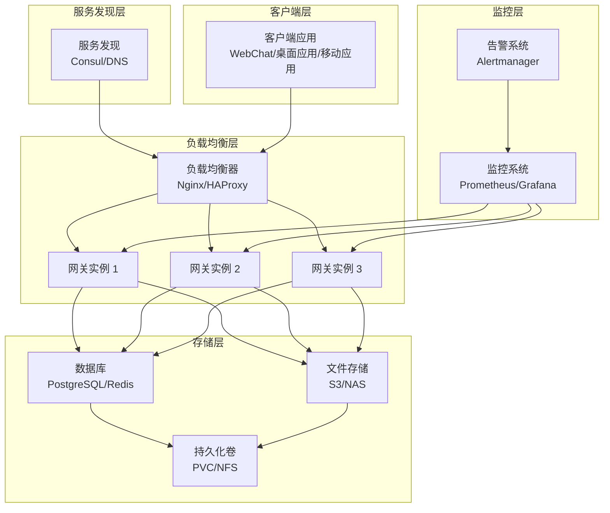

**图表来源**
- [README.md:185-254](file://README.md#L185-L254)
- [deployment.yaml:1-147](file://scripts/k8s/manifests/deployment.yaml#L1-L147)

## 详细组件分析

### 多网关集群配置

#### Kubernetes 集群部署
Kubernetes 提供了原生的高可用性支持，包括自动重启、滚动更新和水平扩展。

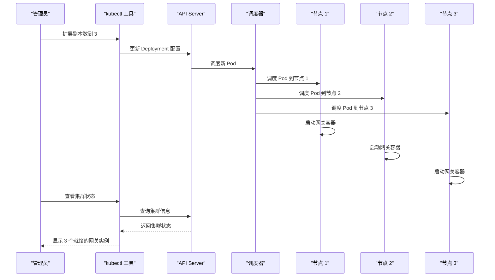

**图表来源**
- [deployment.yaml:8-13](file://scripts/k8s/manifests/deployment.yaml#L8-L13)
- [deployment.yaml:106-123](file://scripts/k8s/manifests/deployment.yaml#L106-L123)

#### Docker Compose 集群部署
Docker Compose 支持多实例部署，但需要额外的服务发现和负载均衡配置。

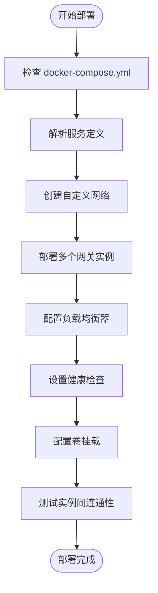

**图表来源**
- [docker-compose.yml:1-79](file://docker-compose.yml#L1-L79)

#### Fly.io 集群部署
Fly.io 提供了无服务器级别的弹性伸缩能力。

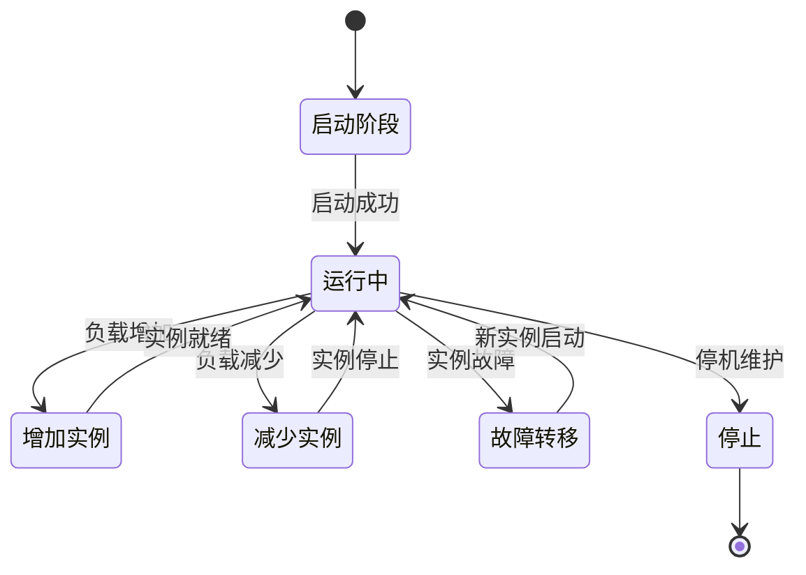

**图表来源**
- [fly.toml:20-26](file://fly.toml#L20-L26)
- [fly.private.toml:27-31](file://fly.private.toml#L27-L31)

**章节来源**
- [deployment.yaml:1-147](file://scripts/k8s/manifests/deployment.yaml#L1-L147)
- [docker-compose.yml:1-79](file://docker-compose.yml#L1-L79)
- [fly.toml:1-35](file://fly.toml#L1-L35)

### 负载均衡策略

#### Kubernetes 负载均衡
Kubernetes Service 提供了内置的负载均衡能力：

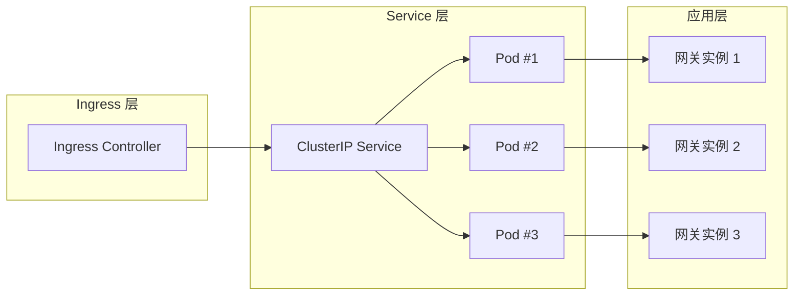

**图表来源**
- [service.yaml:1-16](file://scripts/k8s/manifests/service.yaml#L1-L16)
- [deployment.yaml:50-62](file://scripts/k8s/manifests/deployment.yaml#L50-L62)

#### 多区域部署策略
对于跨区域部署，建议使用以下策略：

1. **地理分布**: 在不同地理区域部署网关实例
2. **DNS 负载均衡**: 使用 DNS 响应权重实现流量分配
3. **健康检查**: 配置跨区域健康检查
4. **数据同步**: 实现跨区域数据同步机制

**章节来源**
- [service.yaml:1-16](file://scripts/k8s/manifests/service.yaml#L1-L16)
- [deployment.yaml:50-62](file://scripts/k8s/manifests/deployment.yaml#L50-L62)

### 故障转移机制

#### 自动故障检测
OpenClaw 提供了内置的健康检查机制：

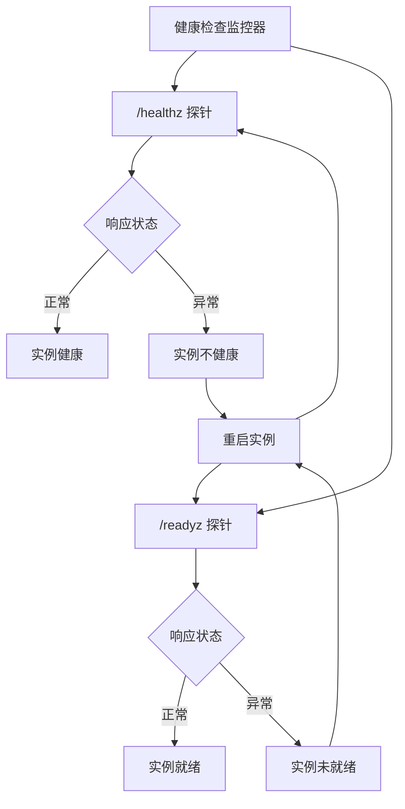

**图表来源**
- [Dockerfile:243-248](file://Dockerfile#L243-L248)
- [docker-compose.yml:39-50](file://docker-compose.yml#L39-L50)

#### 手动故障转移
在 Kubernetes 中，可以使用以下命令进行手动故障转移：

```bash
# 删除不健康的 Pod
kubectl delete pod openclaw-7b5b7c8f4d-xyz12

# 手动扩缩容
kubectl scale deployment openclaw --replicas=3

# 滚动更新
kubectl rollout restart deployment openclaw
```

**章节来源**
- [Dockerfile:243-248](file://Dockerfile#L243-L248)
- [deployment.yaml:106-123](file://scripts/k8s/manifests/deployment.yaml#L106-L123)

### 服务发现与注册

#### Kubernetes 服务发现
Kubernetes 提供了内置的服务发现机制：

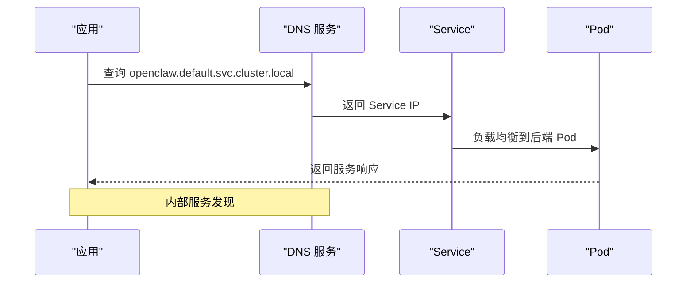

**图表来源**
- [service.yaml:1-16](file://scripts/k8s/manifests/service.yaml#L1-L16)
- [deployment.yaml:9-11](file://scripts/k8s/manifests/deployment.yaml#L9-L11)

#### 外部服务发现
对于外部客户端，建议使用以下配置：

1. **环境变量配置**: 通过环境变量指定网关地址
2. **配置文件管理**: 使用 ConfigMap 管理网关配置
3. **动态配置更新**: 支持运行时配置热更新

**章节来源**
- [configmap.yaml:1-39](file://scripts/k8s/manifests/configmap.yaml#L1-L39)
- [deployment.yaml:63-98](file://scripts/k8s/manifests/deployment.yaml#L63-L98)

### 健康检查与监控

#### 内置健康检查端点
OpenClaw 提供了两个内置的健康检查端点：

| 端点 | 类型 | 描述 | 响应码 |
|------|------|------|--------|
| `/healthz` | 存活检查 | 检查网关进程是否运行 | 200/500 |
| `/readyz` | 就绪检查 | 检查网关是否准备好接受请求 | 200/500 |

#### Kubernetes 健康检查配置
```yaml
livenessProbe:
  exec:
    command:
      - node
      - -e
      "require('http').get('http://127.0.0.1:18789/healthz', r => process.exit(r.statusCode < 400 ? 0 : 1)).on('error', () => process.exit(1))"
  initialDelaySeconds: 60
  periodSeconds: 30
  timeoutSeconds: 10

readinessProbe:
  exec:
    command:
      - node
      - -e
      "require('http').get('http://127.0.0.1:18789/readyz', r => process.exit(r.statusCode < 400 ? 0 : 1)).on('error', () => process.exit(1))"
  initialDelaySeconds: 15
  periodSeconds: 10
  timeoutSeconds: 5
```

**章节来源**
- [Dockerfile:243-248](file://Dockerfile#L243-L248)
- [deployment.yaml:106-123](file://scripts/k8s/manifests/deployment.yaml#L106-L123)
- [docker-compose.yml:39-50](file://docker-compose.yml#L39-L50)

### 自动扩缩容设置

#### Kubernetes HPA 配置
基于 CPU 和内存使用率的自动扩缩容：

```yaml
apiVersion: autoscaling/v2
kind: HorizontalPodAutoscaler
metadata:
  name: openclaw-hpa
spec:
  scaleTargetRef:
    apiVersion: apps/v1
    kind: Deployment
    name: openclaw
  minReplicas: 1
  maxReplicas: 10
  metrics:
  - type: Resource
    resource:
      name: cpu
      target:
        type: Utilization
        averageUtilization: 70
  - type: Resource
    resource:
      name: memory
      target:
        type: Utilization
        averageUtilization: 80
```

#### 基于请求量的扩缩容
```yaml
apiVersion: autoscaling/v2
kind: HorizontalPodAutoscaler
metadata:
  name: openclaw-hpa-requests
spec:
  scaleTargetRef:
    apiVersion: apps/v1
    kind: Deployment
    name: openclaw
  minReplicas: 1
  maxReplicas: 10
  metrics:
  - type: Pods
    pods:
      metric:
        name: requests-per-second
      target:
        type: AverageValue
        averageValue: 100
```

**章节来源**
- [deployment.yaml:99-105](file://scripts/k8s/manifests/deployment.yaml#L99-L105)

### 网络拓扑设计

#### 内部网络架构
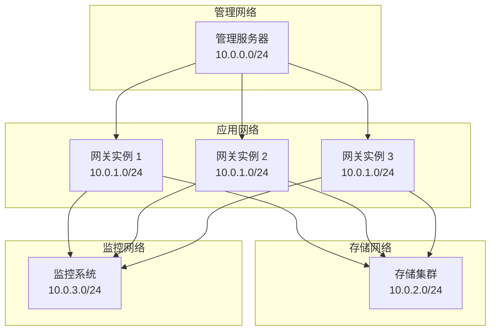

#### 外部访问控制
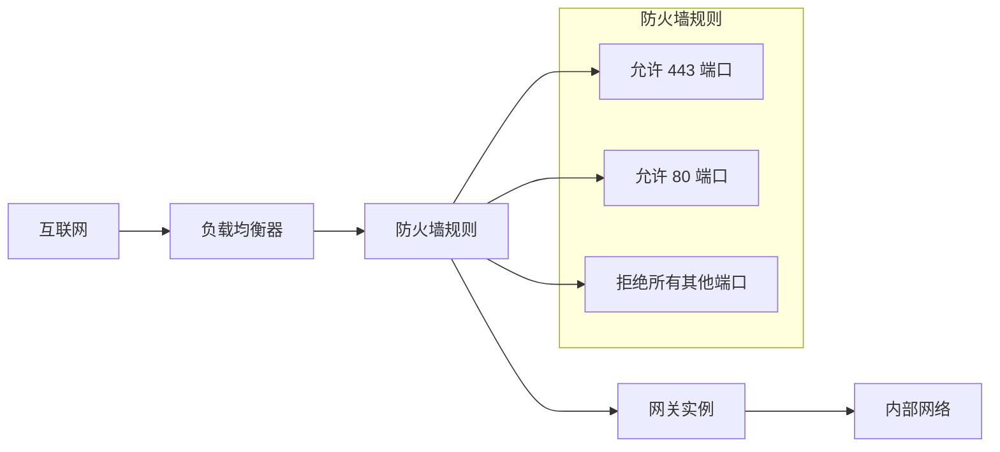

**章节来源**
- [README.md:213-228](file://README.md#L213-L228)
- [fly.toml:20-26](file://fly.toml#L20-L26)

### 数据同步与一致性

#### 持久化存储策略
OpenClaw 支持多种持久化存储方案：

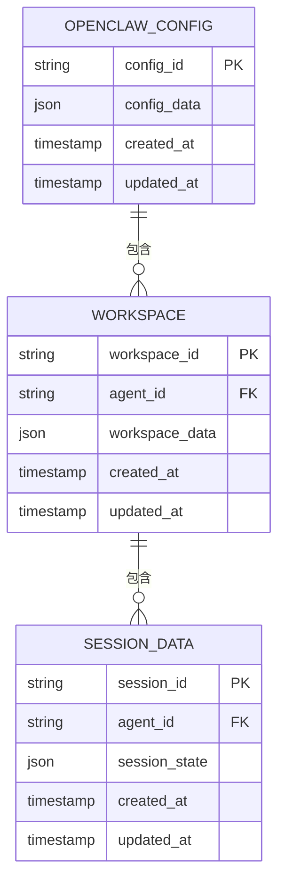

**图表来源**
- [configmap.yaml:8-34](file://scripts/k8s/manifests/configmap.yaml#L8-L34)
- [pvc.yaml:1-13](file://scripts/k8s/manifests/pvc.yaml#L1-L13)

#### 数据备份策略
1. **定期备份**: 每日全量备份，每小时增量备份
2. **异地备份**: 跨区域数据复制
3. **快照策略**: 基于时间点的数据恢复
4. **备份验证**: 定期验证备份数据完整性

**章节来源**
- [pvc.yaml:1-13](file://scripts/k8s/manifests/pvc.yaml#L1-L13)
- [deployment.yaml:138-146](file://scripts/k8s/manifests/deployment.yaml#L138-L146)

## 依赖关系分析

### 组件耦合度
OpenClaw 的部署组件具有清晰的职责分离：

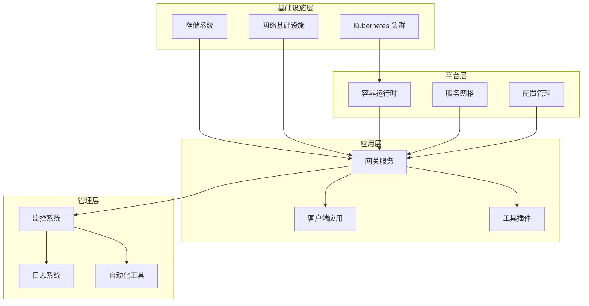

**图表来源**
- [deployment.yaml:1-147](file://scripts/k8s/manifests/deployment.yaml#L1-L147)
- [docker-compose.yml:1-79](file://docker-compose.yml#L1-L79)

### 外部依赖
OpenClaw 的主要外部依赖包括：

1. **容器运行时**: Docker/Podman
2. **编排平台**: Kubernetes/Fly.io
3. **存储系统**: PVC/NAS/S3
4. **监控系统**: Prometheus/Grafana
5. **网络服务**: DNS/负载均衡器

**章节来源**
- [Dockerfile:1-250](file://Dockerfile#L1-L250)
- [README.md:1-560](file://README.md#L1-L560)

## 性能考虑

### 资源配置优化
基于 OpenClaw 的特性，建议的资源配置如下：

| 资源类型 | 最小配置 | 推荐配置 | 最大配置 |
|----------|----------|----------|----------|
| CPU | 250m | 500m-1 | 2-4 |
| 内存 | 512Mi | 1-2Gi | 4-8Gi |
| 存储 | 10Gi | 50-100Gi | 200Gi+ |
| 并发连接 | 100 | 500-1000 | 5000+ |

### 性能基准测试
建议的基准测试场景：

1. **启动时间测试**: 测量从容器启动到网关就绪的时间
2. **并发连接测试**: 测试同时建立的 WebSocket 连接数
3. **消息吞吐量测试**: 测试消息的发送和接收速率
4. **资源使用测试**: 监控 CPU、内存、磁盘和网络使用情况

### 缓存策略
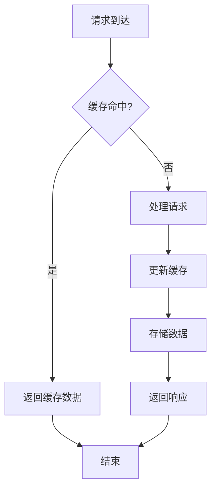

**章节来源**
- [deployment.yaml:99-105](file://scripts/k8s/manifests/deployment.yaml#L99-L105)
- [Dockerfile:130-175](file://Dockerfile#L130-L175)

## 故障排查指南

### 常见问题诊断

#### 网关无法启动
1. **检查日志**: 查看容器日志获取错误信息
2. **验证配置**: 确认配置文件格式正确
3. **检查端口**: 确认端口未被占用
4. **验证权限**: 确认文件权限设置正确

#### 连接超时问题
1. **检查网络连通性**: 使用 `telnet` 或 `nc` 测试端口
2. **验证防火墙规则**: 确认防火墙允许必要的端口
3. **检查负载均衡器**: 确认负载均衡器配置正确
4. **监控资源使用**: 查看 CPU 和内存使用情况

#### 性能问题
1. **监控指标**: 查看 CPU、内存、磁盘和网络使用情况
2. **分析慢查询**: 使用性能分析工具定位瓶颈
3. **调整资源配置**: 根据需求调整资源限制
4. **优化存储**: 考虑使用更快的存储类型

**章节来源**
- [Dockerfile:243-248](file://Dockerfile#L243-L248)
- [deployment.yaml:106-123](file://scripts/k8s/manifests/deployment.yaml#L106-L123)

### 健康检查失败处理
当健康检查失败时，可以采取以下措施：

1. **立即重试**: 系统会自动重试健康检查
2. **实例重启**: 不健康的实例会被自动重启
3. **扩缩容**: 根据负载情况自动调整实例数量
4. **故障转移**: 将流量转移到健康的实例

## 结论

OpenClaw 提供了完整的高可用性部署解决方案，支持多种部署方式和架构模式。通过合理配置负载均衡、健康检查、自动扩缩容和服务发现，可以构建稳定可靠的网关集群。

关键要点总结：
- **多部署方式**: 支持 Kubernetes、Docker Compose 和 Fly.io
- **内置健康检查**: 提供 `/healthz` 和 `/readyz` 端点
- **自动扩缩容**: 基于资源使用率的智能扩缩容
- **持久化存储**: 支持多种存储方案和备份策略
- **监控告警**: 集成 Prometheus 和 Alertmanager
- **安全加固**: 容器安全和网络隔离

建议根据实际业务需求选择合适的部署方式，并结合监控告警系统建立完善的运维体系。

## 附录

### 部署最佳实践

#### 生产环境配置
1. **资源预留**: 为系统进程预留足够的资源
2. **存储配置**: 使用高性能存储和冗余备份
3. **网络配置**: 配置适当的防火墙和网络策略
4. **安全配置**: 启用 TLS 加密和身份认证

#### 监控配置
1. **关键指标**: 监控 CPU、内存、磁盘、网络和连接数
2. **告警阈值**: 设置合理的告警阈值和通知机制
3. **日志管理**: 集中化日志收集和分析
4. **性能基线**: 建立性能基线和容量规划

#### 容量规划
1. **业务增长预测**: 基于历史数据预测业务增长
2. **资源利用率**: 监控资源利用率并及时扩容
3. **成本优化**: 平衡性能和成本，优化资源配置
4. **灾难恢复**: 制定灾难恢复计划和数据备份策略