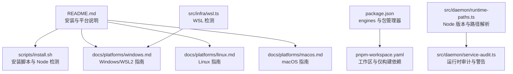
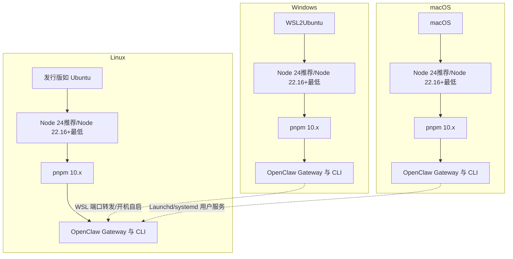
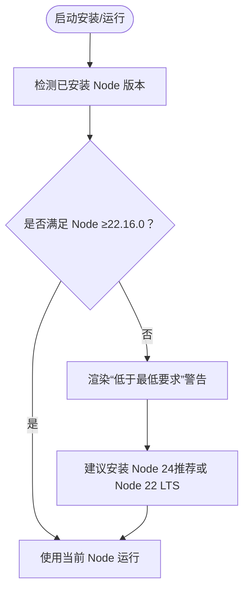
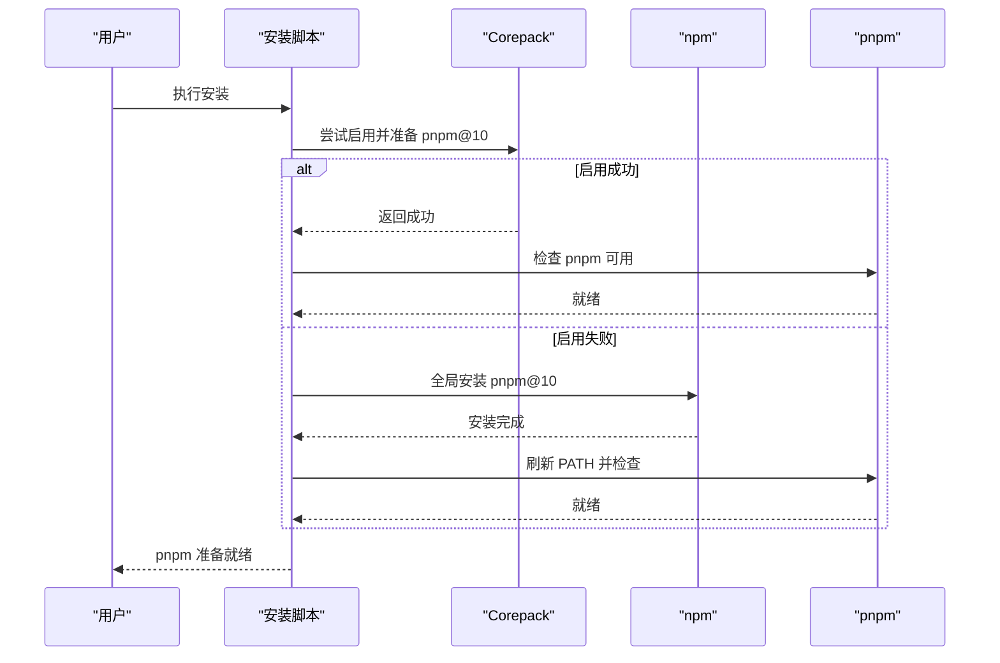
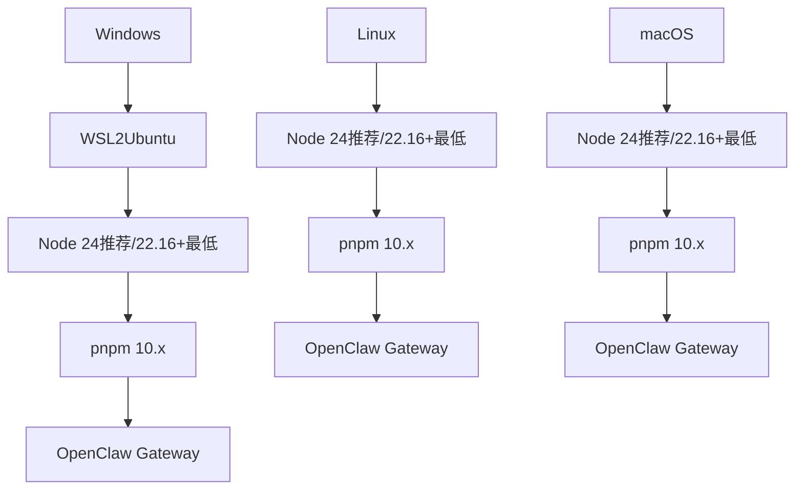
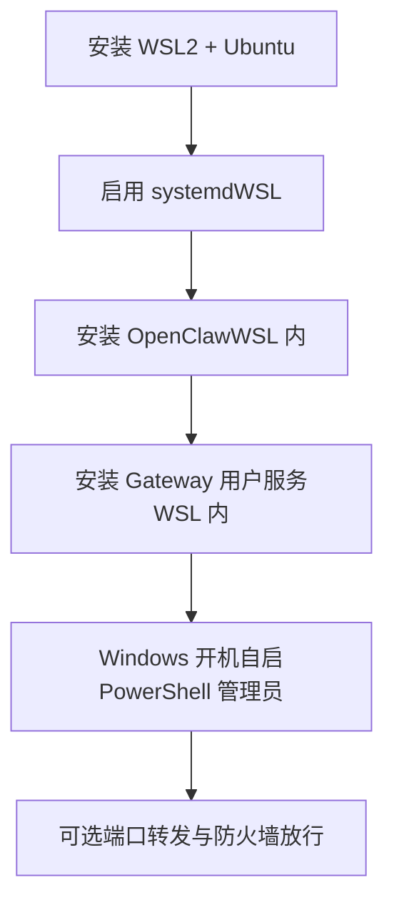
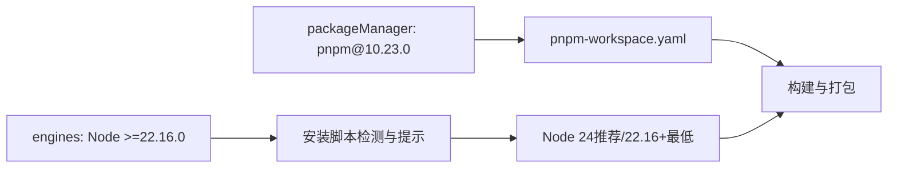
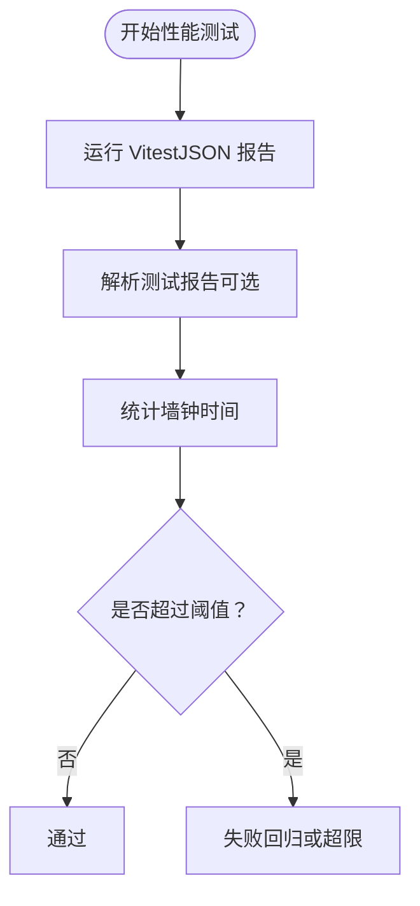

# 系统要求

<cite>
**本文引用的文件**
- [README.md](file://README.md)
- [package.json](file://package.json)
- [pnpm-workspace.yaml](file://pnpm-workspace.yaml)
- [scripts/install.sh](file://scripts/install.sh)
- [docs/platforms/windows.md](file://docs/platforms/windows.md)
- [docs/platforms/linux.md](file://docs/platforms/linux.md)
- [docs/platforms/macos.md](file://docs/platforms/macos.md)
- [src/daemon/runtime-paths.ts](file://src/daemon/runtime-paths.ts)
- [src/daemon/service-audit.ts](file://src/daemon/service-audit.ts)
- [src/infra/wsl.ts](file://src/infra/wsl.ts)
- [scripts/test-perf-budget.mjs](file://scripts/test-perf-budget.mjs)
- [scripts/check-cli-startup-memory.mjs](file://scripts/check-cli-startup-memory.mjs)
</cite>

## 目录
1. [简介](#简介)
2. [项目结构](#项目结构)
3. [核心组件](#核心组件)
4. [架构总览](#架构总览)
5. [详细组件分析](#详细组件分析)
6. [依赖关系分析](#依赖关系分析)
7. [性能考量](#性能考量)
8. [故障排查指南](#故障排查指南)
9. [结论](#结论)
10. [附录](#附录)

## 简介
本文件面向 OpenClaw 系统部署与运行，提供硬件与软件最低要求、Node.js 版本兼容性、操作系统支持范围、依赖工具（pnpm）及在 Windows 上推荐使用 WSL2 的方式，并结合仓库内现有脚本与文档中的约束，给出可操作的限制与建议。同时，基于仓库内置的性能与内存检测脚本，提供资源消耗评估方法，帮助用户在不同平台上进行可行性评估。

## 项目结构
- 运行时与安装入口：README 文档明确“首选设置：在终端中运行引导向导”，并指出“支持 macOS、Linux 和 Windows（通过 WSL2；强烈推荐）”。安装与更新流程见安装文档与安装脚本。
- 包管理器与工作区：根目录 package.json 声明 engines 节点版本要求，pnpm-workspace.yaml 定义了工作区与仅构建依赖列表，确保多包协作与二进制依赖的一致性。
- 平台文档：Windows、Linux、macOS 平台文档分别描述了安装路径、服务安装、WSL2 配置与注意事项等。

**图示来源**
- [README.md:28-31](file://README.md#L28-L31)
- [scripts/install.sh:19-22](file://scripts/install.sh#L19-L22)
- [docs/platforms/windows.md:11-15](file://docs/platforms/windows.md#L11-L15)
- [docs/platforms/linux.md:11-12](file://docs/platforms/linux.md#L11-L12)
- [docs/platforms/macos.md:11-24](file://docs/platforms/macos.md#L11-L24)
- [package.json:437-440](file://package.json#L437-L440)
- [pnpm-workspace.yaml:1-18](file://pnpm-workspace.yaml#L1-L18)
- [src/daemon/runtime-paths.ts:145-155](file://src/daemon/runtime-paths.ts#L145-L155)
- [src/daemon/service-audit.ts:327-346](file://src/daemon/service-audit.ts#L327-L346)
- [src/infra/wsl.ts:10-49](file://src/infra/wsl.ts#L10-L49)

**章节来源**
- [README.md:28-31](file://README.md#L28-L31)
- [package.json:437-440](file://package.json#L437-L440)
- [pnpm-workspace.yaml:1-18](file://pnpm-workspace.yaml#L1-L18)

## 核心组件
- Node.js 运行时与版本要求
  - 引导文档明确“运行时：Node ≥22”，并在安装脚本中定义默认推荐版本为 Node 24，最低要求为 Node 22.16+。
  - package.json 的 engines 字段声明了 Node >=22.16.0。
  - 运行时路径解析与警告逻辑会提示低于最低要求的系统 Node 版本。
- 包管理器 pnpm
  - README 指出“推荐使用 pnpm 构建源码”，package.json 中声明了 packageManager: pnpm@10.23.0，并在 pnpm-workspace.yaml 中定义了工作区与仅构建依赖。
  - 安装脚本提供自动检测与启用 pnpm 的能力，优先通过 Corepack，否则回退到全局安装。
- 平台支持与 WSL2（Windows）
  - Windows 平台文档明确“推荐通过 WSL2（Ubuntu 推荐）”，并提供了 systemd 启动、端口转发、开机自启等配置步骤。
  - 代码层面对 WSL 环境有检测函数，便于区分 Linux 与 WSL2 环境差异。
- 运行时审计与 PATH 建议
  - 审计逻辑会提示 PATH 中包含版本管理器或包管理器路径属于“建议最小化”的范畴，以降低潜在冲突风险。

**章节来源**
- [README.md:50-79](file://README.md#L50-L79)
- [scripts/install.sh:19-22](file://scripts/install.sh#L19-L22)
- [package.json:437-440](file://package.json#L437-L440)
- [pnpm-workspace.yaml:1-18](file://pnpm-workspace.yaml#L1-L18)
- [src/daemon/runtime-paths.ts:145-155](file://src/daemon/runtime-paths.ts#L145-L155)
- [src/daemon/service-audit.ts:317-324](file://src/daemon/service-audit.ts#L317-L324)
- [docs/platforms/windows.md:11-15](file://docs/platforms/windows.md#L11-L15)

## 架构总览
下图展示了 OpenClaw 在不同平台上的推荐运行方式与关键依赖：

**图示来源**
- [docs/platforms/windows.md:11-15](file://docs/platforms/windows.md#L11-L15)
- [docs/platforms/linux.md:11-12](file://docs/platforms/linux.md#L11-L12)
- [docs/platforms/macos.md:11-24](file://docs/platforms/macos.md#L11-L24)
- [scripts/install.sh:19-22](file://scripts/install.sh#L19-L22)
- [package.json:437-440](file://package.json#L437-L440)

## 详细组件分析

### Node.js 版本与兼容性
- 最低要求与推荐版本
  - README 明确“运行时：Node ≥22”。
  - 安装脚本定义默认推荐版本为 Node 24，最低要求为 Node 22.16+。
  - package.json 的 engines 字段为 >=22.16.0。
- 版本检测与警告
  - 运行时路径解析模块会根据系统 Node 路径解析版本，并渲染“低于最低要求”的警告提示，建议安装 Node 24 或 Node 22 LTS。
- 不同平台的差异
  - Windows 平台推荐通过 WSL2 使用 Linux 发行版与一致的工具链，避免原生 Windows 的兼容性问题。
  - Linux 与 macOS 平台可直接使用 Node 24（推荐）或 Node 22 LTS（当前 22.16+）。

**图示来源**
- [scripts/install.sh:19-22](file://scripts/install.sh#L19-L22)
- [src/daemon/runtime-paths.ts:145-155](file://src/daemon/runtime-paths.ts#L145-L155)
- [package.json:437-440](file://package.json#L437-L440)

**章节来源**
- [README.md:50-79](file://README.md#L50-L79)
- [scripts/install.sh:19-22](file://scripts/install.sh#L19-L22)
- [src/daemon/runtime-paths.ts:145-155](file://src/daemon/runtime-paths.ts#L145-L155)
- [package.json:437-440](file://package.json#L437-L440)

### 包管理器 pnpm
- 工作区与仅构建依赖
  - pnpm-workspace.yaml 定义了根工作区与仅构建依赖列表，确保二进制依赖在构建阶段正确处理。
  - package.json 声明了 packageManager: pnpm@10.23.0，保证与 CI/本地一致的包管理器版本。
- 自动安装与启用
  - 安装脚本会尝试通过 Corepack 启用 pnpm 并激活指定版本，若失败则回退到全局安装 pnpm@10，随后刷新 PATH 以确保可用。

**图示来源**
- [scripts/install.sh:1677-1710](file://scripts/install.sh#L1677-L1710)
- [scripts/install.sh:1712-1755](file://scripts/install.sh#L1712-L1755)
- [package.json:440-440](file://package.json#L440-L440)
- [pnpm-workspace.yaml:1-18](file://pnpm-workspace.yaml#L1-L18)

**章节来源**
- [pnpm-workspace.yaml:1-18](file://pnpm-workspace.yaml#L1-L18)
- [package.json:440-440](file://package.json#L440-L440)
- [scripts/install.sh:1677-1710](file://scripts/install.sh#L1677-L1710)
- [scripts/install.sh:1712-1755](file://scripts/install.sh#L1712-L1755)

### 操作系统支持与平台限制
- macOS
  - 推荐使用 macOS 应用作为菜单栏伴侣，负责权限管理、Gateway 生命周期与节点桥接。
  - 支持本地与远程模式，可通过 launchd 管理用户服务。
- Linux
  - Gateway 在 Linux 上完全受支持，推荐使用 Node 作为运行时；不推荐使用 Bun（存在 WhatsApp/Telegram 兼容性问题）。
  - 提供 systemd 用户服务安装与最小化配置示例。
- Windows
  - 强烈推荐通过 WSL2（Ubuntu）安装与运行，以获得一致的 Linux 工具链与兼容性。
  - 提供 systemd 启动、开机自启、端口转发等配置步骤；原生 Windows 的某些 CLI 功能仍处于改进中。

**图示来源**
- [docs/platforms/windows.md:11-15](file://docs/platforms/windows.md#L11-L15)
- [docs/platforms/linux.md:11-12](file://docs/platforms/linux.md#L11-L12)
- [docs/platforms/macos.md:11-24](file://docs/platforms/macos.md#L11-L24)
- [scripts/install.sh:19-22](file://scripts/install.sh#L19-L22)

**章节来源**
- [docs/platforms/windows.md:11-15](file://docs/platforms/windows.md#L11-L15)
- [docs/platforms/linux.md:11-12](file://docs/platforms/linux.md#L11-L12)
- [docs/platforms/macos.md:11-24](file://docs/platforms/macos.md#L11-L24)

### WSL2 在 Windows 上的推荐使用方式
- 安装与启用
  - 使用 `wsl --install` 安装 WSL2 与 Ubuntu；必要时在 PowerShell 中启用 systemd。
- 开机自启与服务安装
  - 在 WSL 内执行 `openclaw gateway install` 安装用户服务；在 Windows 管理员 PowerShell 中创建开机启动任务以确保 WSL 自动启动。
- 端口转发与可达性
  - 若需从其他机器访问 WSL 内的服务（如 Gateway），需通过 netsh 将 Windows 端口转发至 WSL IP，并在防火墙放行相应端口。
- 注意事项
  - Windows 原生 CLI 流程仍在改进中，推荐在 WSL2 内进行完整安装与运行。

**图示来源**
- [docs/platforms/windows.md:185-236](file://docs/platforms/windows.md#L185-L236)
- [docs/platforms/windows.md:96-139](file://docs/platforms/windows.md#L96-L139)
- [docs/platforms/windows.md:140-184](file://docs/platforms/windows.md#L140-L184)

**章节来源**
- [docs/platforms/windows.md:185-236](file://docs/platforms/windows.md#L185-L236)
- [docs/platforms/windows.md:96-139](file://docs/platforms/windows.md#L96-L139)
- [docs/platforms/windows.md:140-184](file://docs/platforms/windows.md#L140-L184)

### 运行时审计与 PATH 建议
- 审计规则
  - 当 PATH 中包含版本管理器或包管理器路径时，会提示“建议最小化 PATH”，以减少潜在冲突与安全风险。
- 实践建议
  - 在生产环境中尽量保持 PATH 精简，避免混用多个版本管理器或包管理器路径。

**章节来源**
- [src/daemon/service-audit.ts:317-324](file://src/daemon/service-audit.ts#L317-L324)

## 依赖关系分析
- Node.js 与包管理器
  - package.json 的 engines 字段与安装脚本共同确保运行时版本满足最低要求。
  - pnpm-workspace.yaml 与 package.json 的 packageManager 字段保证包管理器版本一致性。
- 平台差异
  - Windows 通过 WSL2 统一运行环境，避免原生 Windows 的兼容性问题；Linux/macOS 则直接使用各自发行版的包管理与服务管理器。

**图示来源**
- [package.json:437-440](file://package.json#L437-L440)
- [package.json:440-440](file://package.json#L440-L440)
- [pnpm-workspace.yaml:1-18](file://pnpm-workspace.yaml#L1-L18)
- [scripts/install.sh:19-22](file://scripts/install.sh#L19-L22)

**章节来源**
- [package.json:437-440](file://package.json#L437-L440)
- [package.json:440-440](file://package.json#L440-L440)
- [pnpm-workspace.yaml:1-18](file://pnpm-workspace.yaml#L1-L18)
- [scripts/install.sh:19-22](file://scripts/install.sh#L19-L22)

## 性能考量
- 单元测试性能预算
  - 仓库提供 test-perf-budget.mjs，用于测量 Vitest 运行的墙钟时间，并支持基于基线的回归阈值控制，防止整体测试耗时显著上升。
- CLI 启动内存占用
  - check-cli-startup-memory.mjs 通过进程资源使用钩子统计 CLI 子命令的峰值 RSS（最大常驻集大小），并设定不同场景的上限阈值，帮助评估启动阶段的内存消耗。
- 实施建议
  - 在 CI 中集成性能预算脚本，对关键场景（如 help、status --json、gateway status）设定合理上限，持续监控回归。
  - 结合平台差异（WSL2/Linux/macOS）进行对比测试，识别不同运行环境下的资源消耗差异。

**图示来源**
- [scripts/test-perf-budget.mjs:62-127](file://scripts/test-perf-budget.mjs#L62-L127)

**章节来源**
- [scripts/test-perf-budget.mjs:62-127](file://scripts/test-perf-budget.mjs#L62-L127)
- [scripts/check-cli-startup-memory.mjs:34-63](file://scripts/check-cli-startup-memory.mjs#L34-L63)

## 故障排查指南
- Node 版本不满足最低要求
  - 现象：安装脚本或运行时路径解析模块提示“低于最低要求”。
  - 处理：安装 Node 24（推荐）或 Node 22 LTS（当前 22.16+），并确保 PATH 优先指向该版本。
- pnpm 无法找到或版本不匹配
  - 现象：构建失败或脚本报错找不到 pnpm。
  - 处理：通过 Corepack 启用并激活 pnpm@10，或手动全局安装 pnpm@10，并刷新 PATH。
- Windows WSL2 端口不可达
  - 现象：从 Windows 主机或其他机器无法访问 WSL 内的 Gateway。
  - 处理：确认 netsh 端口转发规则已建立且防火墙放行；必要时在登录后刷新规则。
- PATH 包含版本管理器或包管理器路径
  - 现象：运行时审计提示“建议最小化 PATH”。
  - 处理：移除 PATH 中不必要的版本管理器或包管理器路径，保留稳定、单一来源。

**章节来源**
- [src/daemon/runtime-paths.ts:145-155](file://src/daemon/runtime-paths.ts#L145-L155)
- [scripts/install.sh:1677-1710](file://scripts/install.sh#L1677-L1710)
- [docs/platforms/windows.md:140-184](file://docs/platforms/windows.md#L140-L184)
- [src/daemon/service-audit.ts:317-324](file://src/daemon/service-audit.ts#L317-L324)

## 结论
- OpenClaw 的运行时要求为 Node ≥22.16.0，推荐使用 Node 24；包管理器建议使用 pnpm@10.x。
- Windows 平台强烈建议通过 WSL2（Ubuntu）安装与运行，以获得与 Linux/macOS 一致的工具链与兼容性。
- Linux 与 macOS 平台可直接使用 Node 与 pnpm；Linux 上不推荐使用 Bun（存在兼容性问题）。
- 通过仓库内置的性能与内存检测脚本，可在 CI 中持续监控启动与测试性能，辅助部署前的可行性评估。

## 附录
- 快速对照表
  - Node 最低版本：≥22.16.0（推荐 24）
  - 包管理器：pnpm@10.x
  - 操作系统：macOS、Linux、Windows（WSL2）
  - Windows 原生 CLI：仍在改进中，推荐 WSL2
  - Linux 运行时：Node（不推荐 Bun）