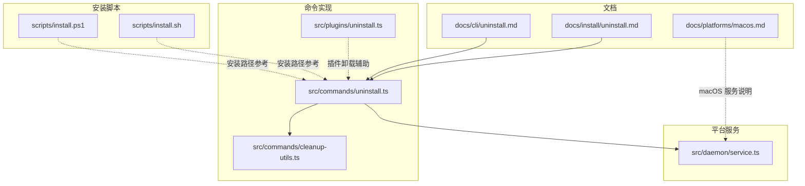
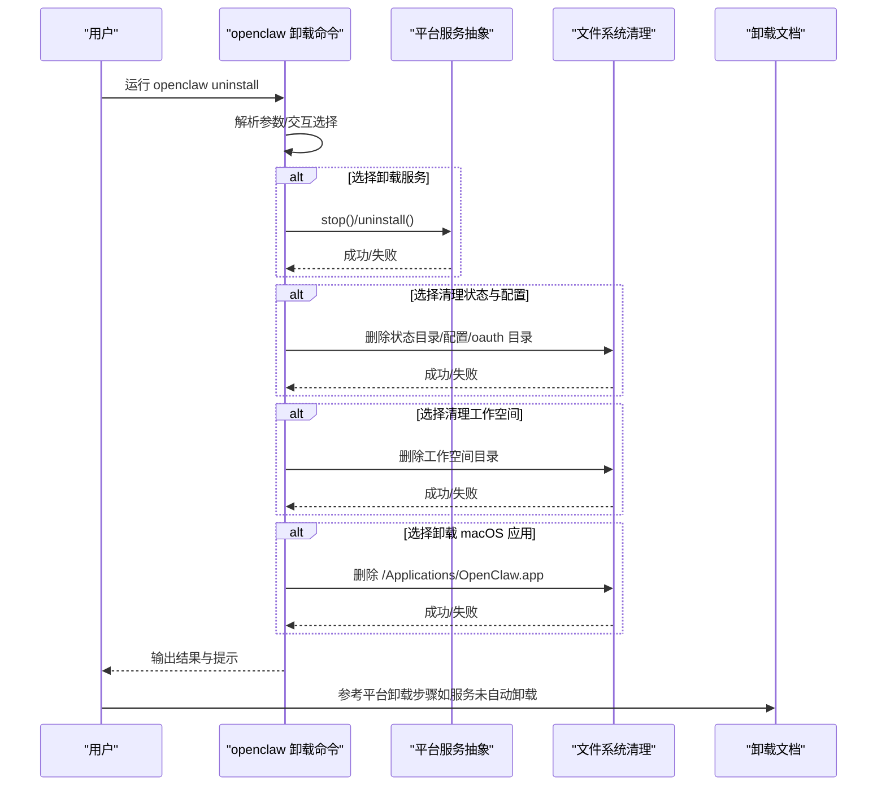
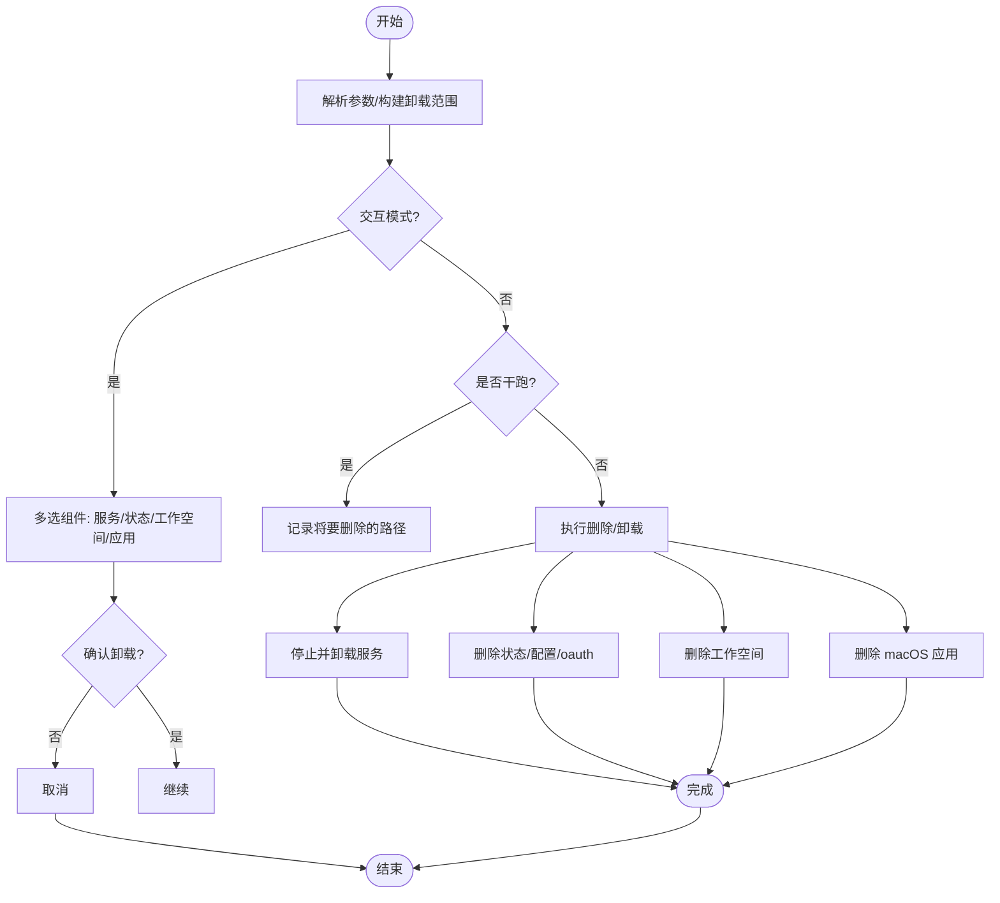
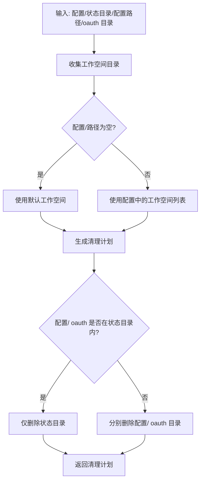
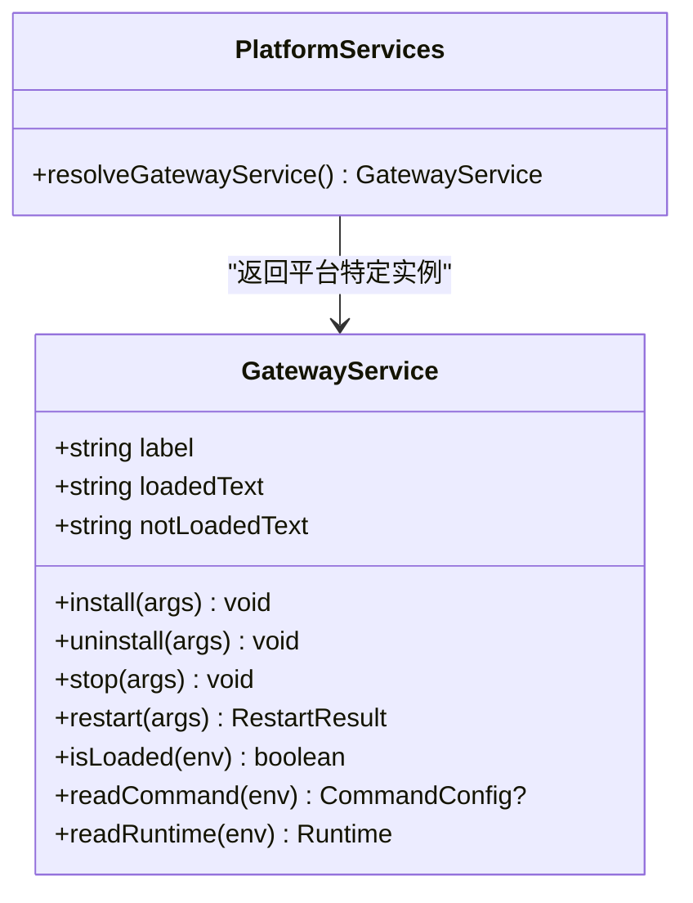
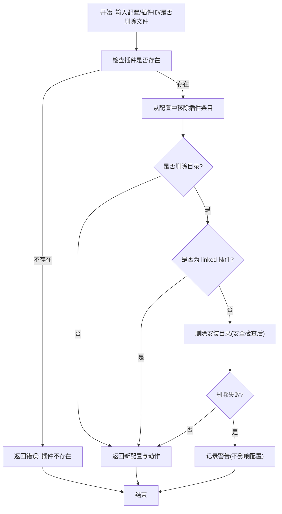
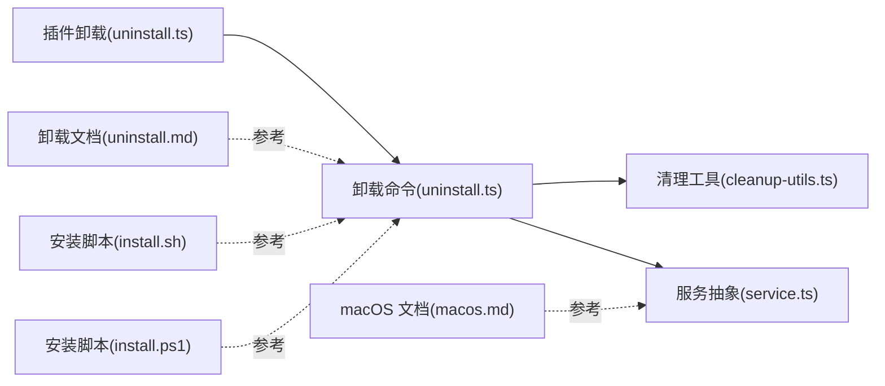

# 卸载程序

<cite>
**本文引用的文件**
- [docs/install/uninstall.md](file://docs/install/uninstall.md)
- [docs/cli/uninstall.md](file://docs/cli/uninstall.md)
- [src/commands/uninstall.ts](file://src/commands/uninstall.ts)
- [src/commands/cleanup-utils.ts](file://src/commands/cleanup-utils.ts)
- [src/plugins/uninstall.ts](file://src/plugins/uninstall.ts)
- [src/daemon/service.ts](file://src/daemon/service.ts)
- [scripts/install.sh](file://scripts/install.sh)
- [scripts/install.ps1](file://scripts/install.ps1)
- [docs/platforms/macos.md](file://docs/platforms/macos.md)
</cite>

## 目录
1. [简介](#简介)
2. [项目结构](#项目结构)
3. [核心组件](#核心组件)
4. [架构总览](#架构总览)
5. [详细组件分析](#详细组件分析)
6. [依赖关系分析](#依赖关系分析)
7. [性能考量](#性能考量)
8. [故障排查指南](#故障排查指南)
9. [结论](#结论)
10. [附录](#附录)

## 简介
本指南面向需要完全卸载 OpenClaw 的用户，覆盖以下内容：
- 完整卸载流程：停止服务、卸载服务、清理状态与配置、移除工作空间、移除 CLI 与 macOS 应用（可选）
- 不同操作系统下的操作路径：macOS（launchd）、Linux（systemd 用户单元）、Windows（计划任务）
- 手动清理与自动化卸载脚本使用方式
- 残留文件检查、服务停止与权限清理方法
- 卸载确认与数据备份建议

## 项目结构
与卸载直接相关的文档与实现分布在如下位置：
- 文档层：安装与卸载文档、平台说明
- 命令层：卸载命令实现、清理工具函数
- 平台层：服务管理（macOS/Windows/Linux）
- 脚本层：安装脚本（macOS/Linux/Windows）

图表来源
- [docs/install/uninstall.md](file://docs/install/uninstall.md)
- [docs/cli/uninstall.md](file://docs/cli/uninstall.md)
- [src/commands/uninstall.ts](file://src/commands/uninstall.ts)
- [src/commands/cleanup-utils.ts](file://src/commands/cleanup-utils.ts)
- [src/plugins/uninstall.ts](file://src/plugins/uninstall.ts)
- [src/daemon/service.ts](file://src/daemon/service.ts)
- [scripts/install.sh](file://scripts/install.sh)
- [scripts/install.ps1](file://scripts/install.ps1)

章节来源
- [docs/install/uninstall.md](file://docs/install/uninstall.md)
- [docs/cli/uninstall.md](file://docs/cli/uninstall.md)
- [src/commands/uninstall.ts](file://src/commands/uninstall.ts)
- [src/commands/cleanup-utils.ts](file://src/commands/cleanup-utils.ts)
- [src/plugins/uninstall.ts](file://src/plugins/uninstall.ts)
- [src/daemon/service.ts](file://src/daemon/service.ts)
- [scripts/install.sh](file://scripts/install.sh)
- [scripts/install.ps1](file://scripts/install.ps1)

## 核心组件
- 卸载命令入口：解析参数、交互选择、执行卸载动作
- 清理工具：安全删除路径、收集工作空间目录、判断是否在状态目录内
- 平台服务：跨平台服务安装/卸载/停止/重启、运行时信息读取
- 插件卸载：从配置中移除插件条目、可选删除已安装目录
- 安装脚本：提供安装路径参考，便于理解卸载目标

章节来源
- [src/commands/uninstall.ts](file://src/commands/uninstall.ts)
- [src/commands/cleanup-utils.ts](file://src/commands/cleanup-utils.ts)
- [src/daemon/service.ts](file://src/daemon/service.ts)
- [src/plugins/uninstall.ts](file://src/plugins/uninstall.ts)

## 架构总览
下图展示卸载流程在不同平台上的控制流与关键调用点。

图表来源
- [src/commands/uninstall.ts](file://src/commands/uninstall.ts)
- [src/commands/cleanup-utils.ts](file://src/commands/cleanup-utils.ts)
- [src/daemon/service.ts](file://src/daemon/service.ts)
- [docs/install/uninstall.md](file://docs/install/uninstall.md)

## 详细组件分析

### 卸载命令（openclaw uninstall）
- 功能要点
  - 支持交互式选择卸载范围（服务、状态与配置、工作空间、macOS 应用）
  - 支持非交互模式（需显式 --all 或 --yes）
  - 支持干跑（--dry-run）预览将要删除的路径
  - 自动推荐先创建备份
- 关键行为
  - 若选择卸载服务：检测并停止/卸载对应平台服务
  - 若选择清理状态与配置：删除状态目录、配置文件、oauth 目录；若配置或 oauth 在状态目录内则仅删除状态目录
  - 若选择清理工作空间：删除所有工作空间目录（默认与自定义）
  - 若选择卸载 macOS 应用：删除 /Applications/OpenClaw.app
- 安全性
  - 避免删除根目录或家目录
  - 对危险路径进行拒绝并输出错误

图表来源
- [src/commands/uninstall.ts](file://src/commands/uninstall.ts)
- [src/commands/cleanup-utils.ts](file://src/commands/cleanup-utils.ts)

章节来源
- [src/commands/uninstall.ts](file://src/commands/uninstall.ts)
- [docs/cli/uninstall.md](file://docs/cli/uninstall.md)

### 清理工具与安全删除
- 工作空间收集：从配置中读取默认与每个代理的工作空间路径，若未设置则使用默认工作空间
- 计划生成：判断配置文件与 oauth 目录是否位于状态目录内，决定是否分别删除
- 安全删除：对空路径、根目录、家目录进行拒绝，避免误删
- 会话目录列举：列出 agents 下的会话目录，便于进一步清理

图表来源
- [src/commands/cleanup-utils.ts](file://src/commands/cleanup-utils.ts)

章节来源
- [src/commands/cleanup-utils.ts](file://src/commands/cleanup-utils.ts)

### 平台服务管理（跨平台）
- 抽象统一：根据平台返回不同的服务对象（macOS launchd、Linux systemd、Windows 计划任务）
- 关键能力：安装、卸载、停止、重启、读取命令与运行时信息
- 使用场景：卸载命令通过该抽象停止并卸载对应平台的服务

图表来源
- [src/daemon/service.ts](file://src/daemon/service.ts)

章节来源
- [src/daemon/service.ts](file://src/daemon/service.ts)

### 插件卸载（从配置移除与可选删除目录）
- 行为概述
  - 从配置中移除插件条目（entries、installs、allow、load.paths、slots）
  - 对于源为“路径”的插件（linked），不删除其源目录
  - 可选删除已安装目录（非 linked 且路径安全）
- 返回值：包含新配置、执行的动作集合与警告信息

图表来源
- [src/plugins/uninstall.ts](file://src/plugins/uninstall.ts)

章节来源
- [src/plugins/uninstall.ts](file://src/plugins/uninstall.ts)

## 依赖关系分析
- 卸载命令依赖清理工具与平台服务抽象
- 平台服务抽象封装了 macOS/Windows/Linux 的具体实现
- 文档与脚本为用户提供安装路径参考，便于手工清理

图表来源
- [src/commands/uninstall.ts](file://src/commands/uninstall.ts)
- [src/commands/cleanup-utils.ts](file://src/commands/cleanup-utils.ts)
- [src/daemon/service.ts](file://src/daemon/service.ts)
- [src/plugins/uninstall.ts](file://src/plugins/uninstall.ts)
- [docs/install/uninstall.md](file://docs/install/uninstall.md)
- [docs/platforms/macos.md](file://docs/platforms/macos.md)
- [scripts/install.sh](file://scripts/install.sh)
- [scripts/install.ps1](file://scripts/install.ps1)

章节来源
- [src/commands/uninstall.ts](file://src/commands/uninstall.ts)
- [src/commands/cleanup-utils.ts](file://src/commands/cleanup-utils.ts)
- [src/daemon/service.ts](file://src/daemon/service.ts)
- [src/plugins/uninstall.ts](file://src/plugins/uninstall.ts)
- [docs/install/uninstall.md](file://docs/install/uninstall.md)
- [docs/platforms/macos.md](file://docs/platforms/macos.md)
- [scripts/install.sh](file://scripts/install.sh)
- [scripts/install.ps1](file://scripts/install.ps1)

## 性能考量
- 干跑模式：在执行前先输出将要删除的路径，避免误操作
- 递归删除：对工作空间与状态目录采用递归删除，注意磁盘 IO 开销
- 权限与路径：避免删除根目录与家目录，减少无效尝试带来的开销

## 故障排查指南
- 卸载命令报错
  - 确认非交互模式必须使用 --yes 或 --all
  - 检查是否有足够的权限执行删除与服务管理
  - 使用 --dry-run 预览将要删除的路径
- 服务未被卸载
  - macOS：检查 launchd 单元是否仍存在，必要时手动 bootout 与删除 plist
  - Linux：检查 systemd 用户单元是否启用，必要时禁用并删除单元文件
  - Windows：检查计划任务是否存在，必要时删除任务与脚本
- 配置或 oauth 未被删除
  - 若配置或 oauth 位于状态目录内，只会删除状态目录；请确认 OPENCLAW_CONFIG_PATH 与 oauth 目录位置
- 工作空间未被删除
  - 确认配置中是否设置了自定义工作空间路径；若未设置则使用默认路径
- 数据备份建议
  - 在执行状态与工作空间清理前，先创建备份快照，以便恢复

章节来源
- [src/commands/uninstall.ts](file://src/commands/uninstall.ts)
- [src/commands/cleanup-utils.ts](file://src/commands/cleanup-utils.ts)
- [docs/install/uninstall.md](file://docs/install/uninstall.md)

## 结论
通过 openclaw 卸载命令，可在交互或非交互模式下完成服务停止/卸载、状态与配置清理、工作空间移除以及 macOS 应用卸载。对于无法自动卸载的服务，可参考平台文档进行手动清理。建议在执行清理前创建备份，并使用干跑模式预览即将删除的内容。

## 附录

### 不同操作系统下的卸载方法
- macOS（launchd）
  - 停止并卸载：使用 openclaw gateway stop 与 openclaw gateway uninstall
  - 手动步骤：bootout 对应 label，删除 ~/Library/LaunchAgents 下的 plist
- Linux（systemd 用户单元）
  - 停止并卸载：systemctl --user disable --now 与删除单元文件
  - 手动步骤：禁用并删除 openclaw-gateway.service（或带 profile 的变体）
- Windows（计划任务）
  - 停止并卸载：schtasks /Delete /F 与删除 gateway.cmd
  - 手动步骤：删除任务与脚本文件

章节来源
- [docs/install/uninstall.md](file://docs/install/uninstall.md)
- [src/daemon/service.ts](file://src/daemon/service.ts)
- [docs/platforms/macos.md](file://docs/platforms/macos.md)

### 卸载确认与数据备份建议
- 卸载前建议先创建备份快照，再执行状态与工作空间清理
- 使用 --dry-run 预览删除内容，确认无误后再执行真实卸载
- 若服务未被卸载，按平台文档进行手动清理

章节来源
- [docs/cli/uninstall.md](file://docs/cli/uninstall.md)
- [src/commands/uninstall.ts](file://src/commands/uninstall.ts)