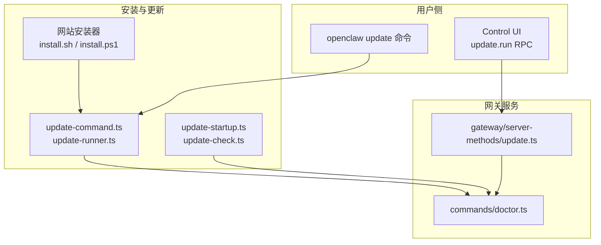
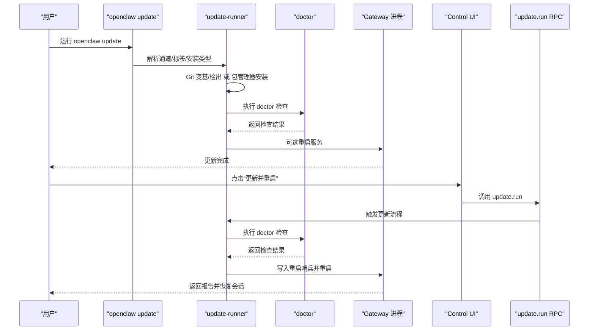
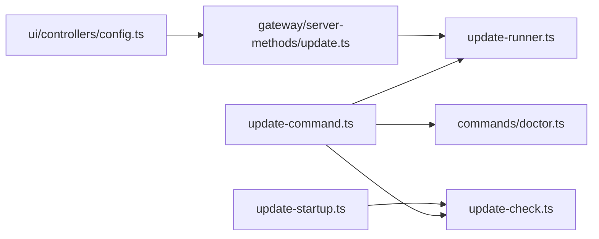

# 更新 OpenClaw

<cite>
**本文引用的文件**
- [docs/install/updating.md](file://docs/install/updating.md)
- [scripts/install.sh](file://scripts/install.sh)
- [scripts/install.ps1](file://scripts/install.ps1)
- [src/cli/update-cli/update-command.ts](file://src/cli/update-cli/update-command.ts)
- [src/infra/update-runner.ts](file://src/infra/update-runner.ts)
- [src/infra/update-check.ts](file://src/infra/update-check.ts)
- [src/infra/update-startup.ts](file://src/infra/update-startup.ts)
- [src/gateway/server-methods/update.ts](file://src/gateway/server-methods/update.ts)
- [ui/src/ui/controllers/config.ts](file://ui/src/ui/controllers/config.ts)
- [docs/web/control-ui.md](file://docs/web/control-ui.md)
- [src/cli/update-cli/progress.ts](file://src/cli/update-cli/progress.ts)
- [src/commands/doctor.ts](file://src/commands/doctor.ts)
- [docs/install/development-channels.md](file://docs/install/development-channels.md)
- [AGENTS.md](file://AGENTS.md)
</cite>

## 目录
1. [简介](#简介)
2. [项目结构](#项目结构)
3. [核心组件](#核心组件)
4. [架构总览](#架构总览)
5. [详细组件分析](#详细组件分析)
6. [依赖关系分析](#依赖关系分析)
7. [性能考量](#性能考量)
8. [故障排查指南](#故障排查指南)
9. [结论](#结论)
10. [附录](#附录)

## 简介
本指南面向 OpenClaw 用户与维护者，提供从网站安装器到源码安装的完整更新流程，覆盖自动更新配置、手动更新选项、开发通道切换、版本标签指定、包管理器更新方法、更新后验证与回滚策略，并特别说明 Control UI 更新与 RPC 更新路径及回滚策略。

## 项目结构
- 官方推荐更新路径：重新运行网站安装器（macOS/Linux），它会检测现有安装并进行就地升级，必要时执行 doctor 检查。
- CLI 更新命令：支持在源码安装或包管理器安装之间切换，按通道选择目标版本，执行依赖安装、构建、Control UI 构建、doctor 检查与可选重启。
- 控制界面（Control UI）：内置“更新并重启”（RPC: update.run），可在浏览器中触发更新流程并重启网关。
- 自动更新：网关启动时可检查更新并在稳定通道采用延迟与抖动策略，beta 通道按小时检查并应用。

图示来源
- [docs/install/updating.md:13-36](file://docs/install/updating.md#L13-L36)
- [src/cli/update-cli/update-command.ts:684-800](file://src/cli/update-cli/update-command.ts#L684-L800)
- [src/infra/update-runner.ts:325-800](file://src/infra/update-runner.ts#L325-L800)
- [src/infra/update-startup.ts:156-204](file://src/infra/update-startup.ts#L156-L204)
- [src/gateway/server-methods/update.ts:18-56](file://src/gateway/server-methods/update.ts#L18-L56)
- [src/commands/doctor.ts:73-370](file://src/commands/doctor.ts#L73-L370)

章节来源
- [docs/install/updating.md:9-36](file://docs/install/updating.md#L9-L36)
- [scripts/install.sh:1-2579](file://scripts/install.sh#L1-L2579)
- [scripts/install.ps1:1-360](file://scripts/install.ps1#L1-L360)

## 核心组件
- 网站安装器（install.sh / install.ps1）
  - macOS/Linux：支持检测 Node/npm/pnpm 环境，自动安装/升级 OpenClaw；支持 --install-method git 或包管理器；支持 --no-onboard 跳过向导；支持 --dry-run 预演。
  - Windows：PowerShell 安装脚本，支持 npm 或 git 安装模式，自动处理执行策略、Node/Git 检测与安装。
- CLI 更新命令（update-command.ts）
  - 支持 --channel 切换稳定/测试/开发通道；--tag 指定 dist-tag 或具体版本；--dry-run 预演；自动识别当前安装类型（git/package）并决定更新路径。
  - 执行流程：校验工作区干净、切换分支/标签、拉取/变基、安装依赖、构建、构建 Control UI、doctor 检查、可选重启。
- 更新运行器（update-runner.ts）
  - Git 流程：dev 通道预检候选提交、工作树隔离构建与静态检查；稳定/测试通道直接检出对应标签；失败时自动中止变基并清理。
  - 包管理器流程：解析安装根目录、生成安装规范、执行全局安装、doctor 检查。
- 自动更新（update-startup.ts / update-check.ts）
  - 启动时检查最新版本，稳定通道采用延迟与抖动策略，beta 通道按小时检查并应用。
- Control UI 更新（ui/controllers/config.ts + gateway/server-methods/update.ts）
  - RPC update.run 触发更新与重启，写入重启哨兵并通知最近活跃会话。
- Doctor 检查（commands/doctor.ts）
  - 更新前后执行修复与迁移、健康检查、服务修复等，确保配置与运行环境一致。

章节来源
- [src/cli/update-cli/update-command.ts:684-800](file://src/cli/update-cli/update-command.ts#L684-L800)
- [src/infra/update-runner.ts:325-800](file://src/infra/update-runner.ts#L325-L800)
- [src/infra/update-startup.ts:156-204](file://src/infra/update-startup.ts#L156-L204)
- [src/gateway/server-methods/update.ts:18-56](file://src/gateway/server-methods/update.ts#L18-L56)
- [ui/src/ui/controllers/config.ts:180-203](file://ui/src/ui/controllers/config.ts#L180-L203)
- [src/commands/doctor.ts:73-370](file://src/commands/doctor.ts#L73-L370)

## 架构总览
下图展示从用户发起更新到网关重启与 doctor 检查的整体流程，以及 Control UI 的 RPC 更新路径。

图示来源
- [src/cli/update-cli/update-command.ts:684-800](file://src/cli/update-cli/update-command.ts#L684-L800)
- [src/infra/update-runner.ts:325-800](file://src/infra/update-runner.ts#L325-L800)
- [src/commands/doctor.ts:73-370](file://src/commands/doctor.ts#L73-L370)
- [ui/src/ui/controllers/config.ts:180-203](file://ui/src/ui/controllers/config.ts#L180-L203)
- [src/gateway/server-methods/update.ts:18-56](file://src/gateway/server-methods/update.ts#L18-L56)

## 详细组件分析

### 推荐更新流程（网站安装器）
- macOS/Linux：重新运行官网安装脚本，自动检测现有安装并就地升级；支持 --install-method git 以源码安装；--no-onboard 跳过向导。
- Windows：使用 PowerShell 安装脚本，自动处理执行策略、Node/Git 检测与安装，支持 npm 或 git 安装模式。

章节来源
- [docs/install/updating.md:13-36](file://docs/install/updating.md#L13-L36)
- [scripts/install.sh:1-2579](file://scripts/install.sh#L1-L2579)
- [scripts/install.ps1:1-360](file://scripts/install.ps1#L1-L360)

### 全局安装更新（npm/pnpm）
- 使用 openclaw update --channel 切换通道（stable/beta/dev）。
- 使用 --tag 指定 dist-tag 或版本号；在 npm 安装场景下，会解析目标版本并生成全局安装规范。
- 若当前为源码安装，openclaw update 将尝试通过包管理器更新；若无法检测安装类型，建议参考“更新（全局安装）”。

章节来源
- [docs/install/updating.md:46-91](file://docs/install/updating.md#L46-L91)
- [src/cli/update-cli/update-command.ts:729-760](file://src/cli/update-cli/update-command.ts#L729-L760)
- [src/infra/update-check.ts:329-366](file://src/infra/update-check.ts#L329-L366)

### 源码安装更新（git）
- 推荐使用 openclaw update；要求工作区干净（无未提交更改），dev 通道会预检候选提交并进行隔离构建与静态检查，再执行变基。
- 若变基失败，自动中止并清理，避免污染工作区。
- 更新完成后执行 doctor 检查与可选重启。

章节来源
- [docs/install/updating.md:131-186](file://docs/install/updating.md#L131-L186)
- [src/cli/update-cli/update-command.ts:375-454](file://src/cli/update-cli/update-command.ts#L375-L454)
- [src/infra/update-runner.ts:400-658](file://src/infra/update-runner.ts#L400-L658)

### 开发通道切换与版本标签
- 通道语义：stable（发布版）、beta（预发布）、dev（main 快照）。
- 标签规范：优先使用 -beta.N 形式；兼容历史形式；保持标签不可变。
- 通道切换：openclaw update --channel 或在配置中设置 update.channel；--tag 可覆盖单次目标。

章节来源
- [docs/install/development-channels.md:61-78](file://docs/install/development-channels.md#L61-L78)
- [AGENTS.md:126-131](file://AGENTS.md#L126-L131)
- [src/cli/update-cli/update-command.ts:707-730](file://src/cli/update-cli/update-command.ts#L707-L730)

### 包管理器更新方法
- npm：npm i -g openclaw@latest 或 npm i -g github:openclaw/openclaw#main。
- pnpm：pnpm add -g openclaw@latest 或 pnpm add -g github:openclaw/openclaw#main。
- Bun：不推荐作为网关运行时（存在已知问题）。

章节来源
- [docs/install/updating.md:48-88](file://docs/install/updating.md#L48-L88)

### 自动更新配置
- 稳定通道：先等待稳定延迟，再按稳定抖动窗口随机分布。
- Beta 通道：按小时检查并应用。
- Dev 通道：不自动应用，需手动 openclaw update。
- 可通过 openclaw update --dry-run 预览自动化行为。

章节来源
- [docs/install/updating.md:92-117](file://docs/install/updating.md#L92-L117)
- [src/infra/update-startup.ts:156-204](file://src/infra/update-startup.ts#L156-L204)

### Control UI 更新与 RPC
- Control UI 提供“更新并重启”按钮，调用 update.run RPC。
- RPC 流程：解析配置通道、定位包根、执行更新、写入重启哨兵、重启网关并向最近活跃会话发送报告。
- 若变基失败，网关中止并重启，不应用更新。

章节来源
- [docs/web/control-ui.md:89-89](file://docs/web/control-ui.md#L89-L89)
- [ui/src/ui/controllers/config.ts:180-203](file://ui/src/ui/controllers/config.ts#L180-L203)
- [src/gateway/server-methods/update.ts:18-56](file://src/gateway/server-methods/update.ts#L18-L56)

### 更新前准备与更新步骤
- 准备：确认安装类型（全局/源码）、网关运行方式（前台/受管服务）、备份配置/凭证/工作区。
- 步骤：doctor 修复与迁移、健康检查、服务刷新、可选重启。
- 验证：openclaw doctor、openclaw health、openclaw gateway status。

章节来源
- [docs/install/updating.md:37-125](file://docs/install/updating.md#L37-L125)
- [src/commands/doctor.ts:73-370](file://src/commands/doctor.ts#L73-L370)

### 回滚策略
- 全局安装回滚：固定到已知可用版本（npm/pnpm install -g openclaw@<version>），重启并再次 doctor。
- 源码安装回滚：按日期检出历史提交（git fetch origin; git checkout "$(git rev-list -n 1 --before="YYYY-MM-DD" origin/main)"），重装依赖并重启。

章节来源
- [docs/install/updating.md:224-270](file://docs/install/updating.md#L224-L270)

### 更新后的验证步骤
- 基础：openclaw doctor、openclaw health、openclaw gateway status。
- 服务：根据平台使用 launchd/systemd 等方式重启服务。
- Control UI：确认页面可用、日志可实时查看、更新报告可见。

章节来源
- [docs/install/updating.md:187-223](file://docs/install/updating.md#L187-L223)
- [docs/web/control-ui.md:1-269](file://docs/web/control-ui.md#L1-L269)

## 依赖关系分析
- update-command.ts 依赖 update-runner.ts 执行实际更新逻辑，依赖 update-check.ts 解析通道与目标版本，依赖 doctor.ts 在更新后进行修复与迁移。
- Control UI 的 update.run 通过 RPC 调用 gateway/server-methods/update.ts，最终复用 update-runner.ts 的更新流程。
- 自动更新在启动阶段由 update-startup.ts 与 update-check.ts 协作，决定是否应用更新。

图示来源
- [src/cli/update-cli/update-command.ts:684-800](file://src/cli/update-cli/update-command.ts#L684-L800)
- [src/infra/update-runner.ts:325-800](file://src/infra/update-runner.ts#L325-L800)
- [src/infra/update-check.ts:329-366](file://src/infra/update-check.ts#L329-L366)
- [src/commands/doctor.ts:73-370](file://src/commands/doctor.ts#L73-L370)
- [src/gateway/server-methods/update.ts:18-56](file://src/gateway/server-methods/update.ts#L18-L56)
- [ui/src/ui/controllers/config.ts:180-203](file://ui/src/ui/controllers/config.ts#L180-L203)
- [src/infra/update-startup.ts:156-204](file://src/infra/update-startup.ts#L156-L204)

章节来源
- [src/cli/update-cli/update-command.ts:684-800](file://src/cli/update-cli/update-command.ts#L684-L800)
- [src/infra/update-runner.ts:325-800](file://src/infra/update-runner.ts#L325-L800)
- [src/gateway/server-methods/update.ts:18-56](file://src/gateway/server-methods/update.ts#L18-L56)
- [src/infra/update-startup.ts:156-204](file://src/infra/update-startup.ts#L156-L204)

## 性能考量
- Git dev 通道预检：通过临时工作树隔离构建与静态检查，避免主工作区被频繁变更。
- 包管理器安装：失败时自动重试（如 omit optional 依赖），减少人工干预。
- 自动更新抖动：稳定通道采用基于安装 ID 的哈希抖动，降低集中升级风险。

章节来源
- [src/infra/update-runner.ts:536-629](file://src/infra/update-runner.ts#L536-L629)
- [src/cli/update-cli/progress.ts:39-69](file://src/cli/update-cli/progress.ts#L39-L69)
- [src/infra/update-startup.ts:173-187](file://src/infra/update-startup.ts#L173-L187)

## 故障排查指南
- 权限错误（EACCES）：调整 npm prefix 或使用 sudo；或改用用户级前缀。
- 原生依赖构建失败：重试时忽略可选依赖（--omit=optional）。
- 变基冲突：工作区不干净或上游不存在会导致跳过；确保工作区干净并存在上游分支。
- 服务重启异常：多监听进程或禁用重启配置会阻止受管重启；使用 unmanaged 重启或修正配置。
- Doctor 失败：根据输出逐项修复，必要时启用 --fix 并重试。

章节来源
- [src/cli/update-cli/progress.ts:39-69](file://src/cli/update-cli/progress.ts#L39-L69)
- [src/infra/update-runner.ts:410-472](file://src/infra/update-runner.ts#L410-L472)
- [src/cli/daemon-cli/lifecycle.test.ts:273-294](file://src/cli/daemon-cli/lifecycle.test.ts#L273-L294)
- [src/commands/doctor.ts:73-370](file://src/commands/doctor.ts#L73-L370)

## 结论
- 推荐优先使用网站安装器进行就地升级，确保 doctor 检查与服务重启。
- 对于源码安装，使用 openclaw update 并遵循“干净工作区 + 变基 + doctor + 重启”的流程。
- 通过通道与标签灵活控制更新节奏，结合自动更新策略实现安全滚动。
- Control UI 的 update.run 提供便捷的浏览器内更新入口，失败时自动回滚并重启。

## 附录
- 常用命令速查
  - 重新运行安装器：curl -fsSL https://openclaw.ai/install.sh | bash
  - 源码安装更新：openclaw update
  - 全局安装更新：openclaw update --channel stable/beta/dev
  - 指定版本：openclaw update --tag <dist-tag|version|spec>
  - Dry-run：openclaw update --dry-run
  - Doctor：openclaw doctor
  - 重启：openclaw gateway restart
  - Health：openclaw health

章节来源
- [docs/install/updating.md:13-125](file://docs/install/updating.md#L13-L125)
- [src/cli/update-cli/update-command.ts:684-800](file://src/cli/update-cli/update-command.ts#L684-L800)
- [src/commands/doctor.ts:73-370](file://src/commands/doctor.ts#L73-L370)