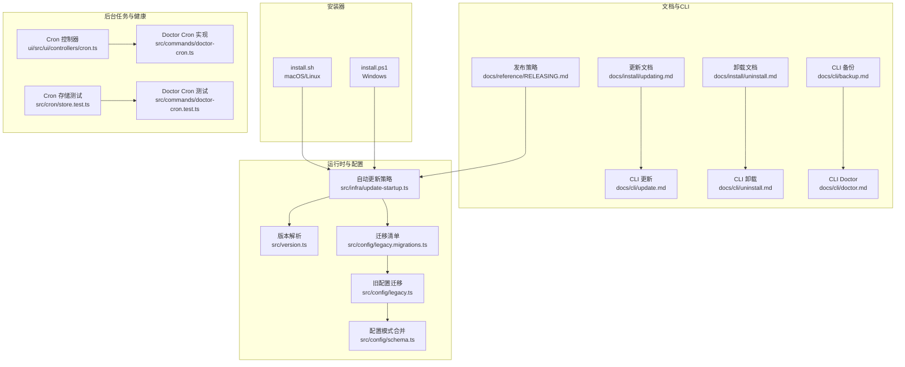
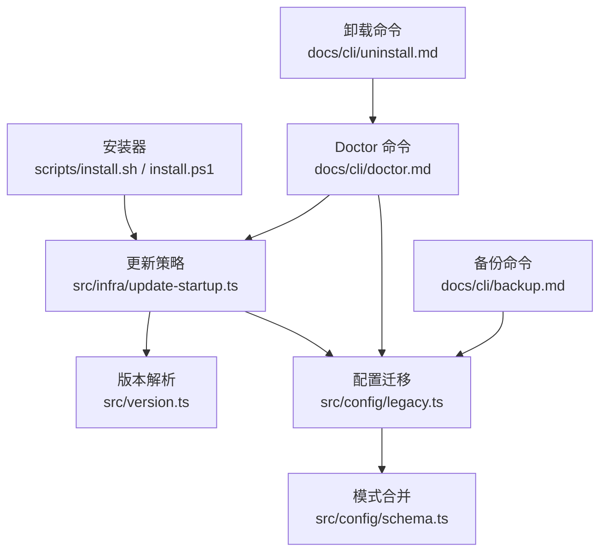
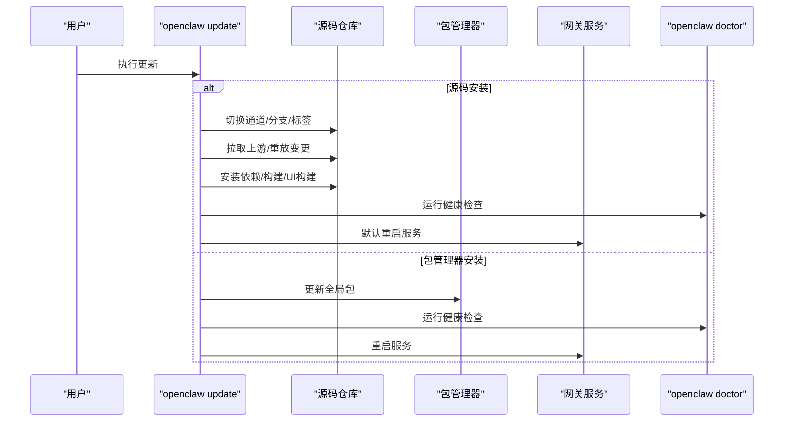
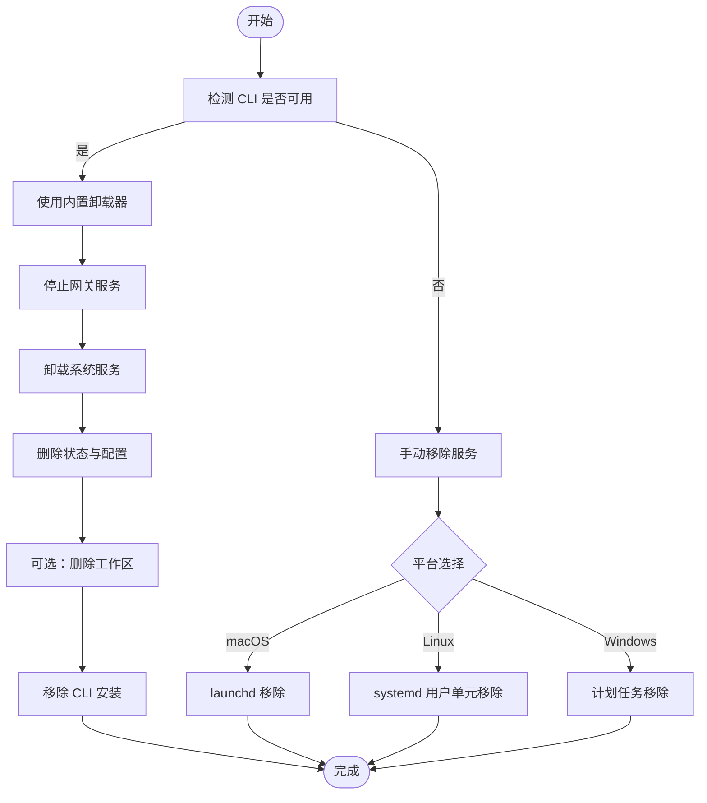
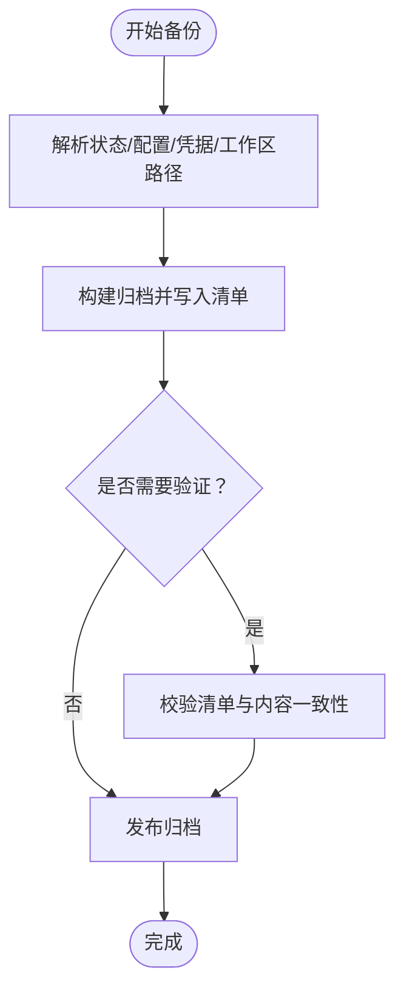
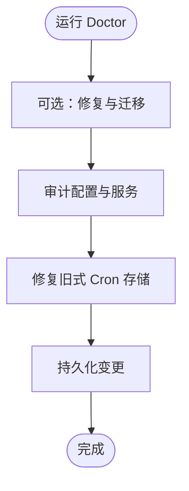
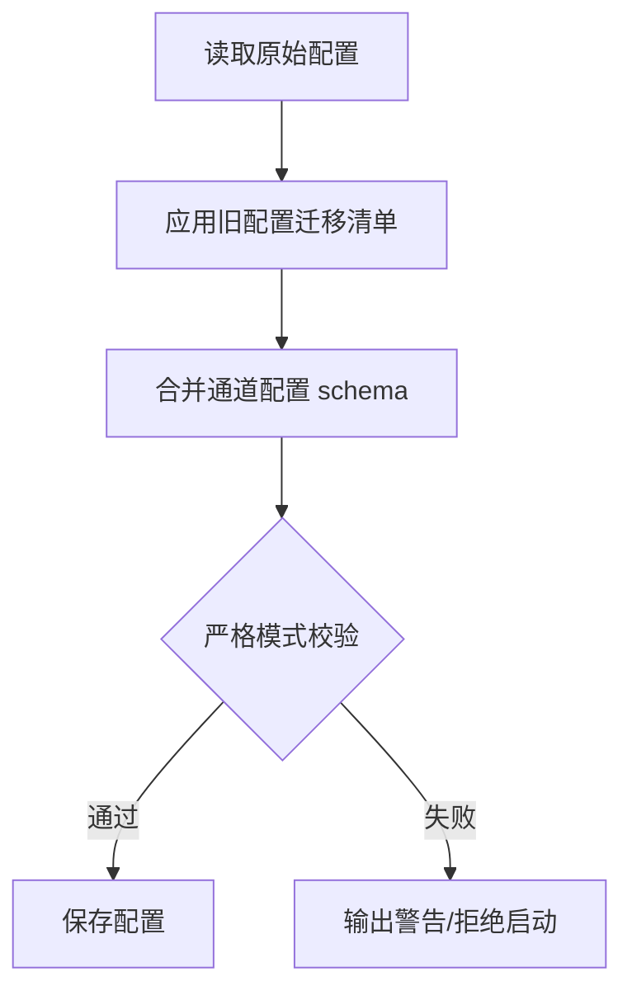
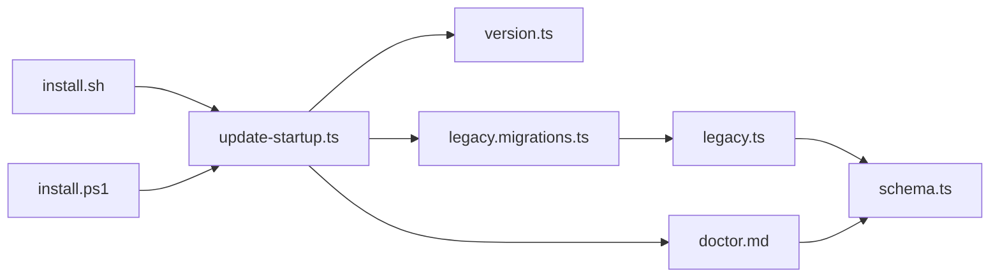

# 维护与更新

<cite>
**本文引用的文件**
- [docs/install/updating.md](file://docs/install/updating.md)
- [docs/install/uninstall.md](file://docs/install/uninstall.md)
- [docs/cli/update.md](file://docs/cli/update.md)
- [docs/cli/uninstall.md](file://docs/cli/uninstall.md)
- [docs/cli/backup.md](file://docs/cli/backup.md)
- [docs/cli/doctor.md](file://docs/cli/doctor.md)
- [docs/reference/RELEASING.md](file://docs/reference/RELEASING.md)
- [scripts/install.sh](file://scripts/install.sh)
- [scripts/install.ps1](file://scripts/install.ps1)
- [src/infra/update-startup.ts](file://src/infra/update-startup.ts)
- [src/version.ts](file://src/version.ts)
- [src/config/legacy.migrations.ts](file://src/config/legacy.migrations.ts)
- [src/config/legacy.ts](file://src/config/legacy.ts)
- [src/config/schema.ts](file://src/config/schema.ts)
- [ui/src/ui/controllers/cron.ts](file://ui/src/ui/controllers/cron.ts)
- [src/cron/service.issue-regressions.test.ts](file://src/cron/service.issue-regressions.test.ts)
- [src/cron/store.test.ts](file://src/cron/store.test.ts)
- [src/commands/doctor-cron.test.ts](file://src/commands/doctor-cron.test.ts)
- [src/commands/doctor-cron.ts](file://src/commands/doctor-cron.ts)
</cite>

## 目录
1. [简介](#简介)
2. [项目结构](#项目结构)
3. [核心组件](#核心组件)
4. [架构总览](#架构总览)
5. [详细组件分析](#详细组件分析)
6. [依赖关系分析](#依赖关系分析)
7. [性能考量](#性能考量)
8. [故障排查指南](#故障排查指南)
9. [结论](#结论)
10. [附录](#附录)

## 简介
本指南面向 OpenClaw 的维护者与使用者，提供从版本更新到卸载的完整操作手册，覆盖增量更新、全量升级与回滚策略，配置迁移与数据备份、状态同步方案，并给出常见问题诊断与自动化更新脚本使用建议。同时提供长期支持版本选择建议与维护时间表参考。

## 项目结构
围绕“维护与更新”的关键文档与实现分布在以下位置：
- 安装与更新文档：docs/install/updating.md、docs/cli/update.md
- 卸载与清理文档：docs/install/uninstall.md、docs/cli/uninstall.md
- 备份与健康检查：docs/cli/backup.md、docs/cli/doctor.md
- 版本命名与发布策略：docs/reference/RELEASING.md
- 安装器（macOS/Linux/Windows）：scripts/install.sh、scripts/install.ps1
- 自动更新与版本解析：src/infra/update-startup.ts、src/version.ts
- 配置迁移与模式合并：src/config/legacy.migrations.ts、src/config/legacy.ts、src/config/schema.ts
- 后台任务与健康状态：ui/src/ui/controllers/cron.ts、src/cron/store.test.ts、src/commands/doctor-cron.test.ts、src/commands/doctor-cron.ts

**图表来源**
- [docs/install/updating.md](file://docs/install/updating.md)
- [docs/install/uninstall.md](file://docs/install/uninstall.md)
- [docs/cli/update.md](file://docs/cli/update.md)
- [docs/cli/uninstall.md](file://docs/cli/uninstall.md)
- [docs/cli/backup.md](file://docs/cli/backup.md)
- [docs/cli/doctor.md](file://docs/cli/doctor.md)
- [docs/reference/RELEASING.md](file://docs/reference/RELEASING.md)
- [scripts/install.sh](file://scripts/install.sh)
- [scripts/install.ps1](file://scripts/install.ps1)
- [src/infra/update-startup.ts](file://src/infra/update-startup.ts)
- [src/version.ts](file://src/version.ts)
- [src/config/legacy.migrations.ts](file://src/config/legacy.migrations.ts)
- [src/config/legacy.ts](file://src/config/legacy.ts)
- [src/config/schema.ts](file://src/config/schema.ts)
- [ui/src/ui/controllers/cron.ts](file://ui/src/ui/controllers/cron.ts)
- [src/cron/store.test.ts](file://src/cron/store.test.ts)
- [src/commands/doctor-cron.test.ts](file://src/commands/doctor-cron.test.ts)
- [src/commands/doctor-cron.ts](file://src/commands/doctor-cron.ts)

**章节来源**
- [docs/install/updating.md](file://docs/install/updating.md)
- [docs/install/uninstall.md](file://docs/install/uninstall.md)
- [docs/cli/update.md](file://docs/cli/update.md)
- [docs/cli/uninstall.md](file://docs/cli/uninstall.md)
- [docs/cli/backup.md](file://docs/cli/backup.md)
- [docs/cli/doctor.md](file://docs/cli/doctor.md)
- [docs/reference/RELEASING.md](file://docs/reference/RELEASING.md)
- [scripts/install.sh](file://scripts/install.sh)
- [scripts/install.ps1](file://scripts/install.ps1)
- [src/infra/update-startup.ts](file://src/infra/update-startup.ts)
- [src/version.ts](file://src/version.ts)
- [src/config/legacy.migrations.ts](file://src/config/legacy.migrations.ts)
- [src/config/legacy.ts](file://src/config/legacy.ts)
- [src/config/schema.ts](file://src/config/schema.ts)
- [ui/src/ui/controllers/cron.ts](file://ui/src/ui/controllers/cron.ts)
- [src/cron/store.test.ts](file://src/cron/store.test.ts)
- [src/commands/doctor-cron.test.ts](file://src/commands/doctor-cron.test.ts)
- [src/commands/doctor-cron.ts](file://src/commands/doctor-cron.ts)

## 核心组件
- 更新与回滚
  - 推荐通过网站安装器重新执行以完成就地升级，或使用 CLI 命令进行源码仓库更新与 doctor 检查。
  - 支持通道切换（stable/beta/dev），并提供自动更新策略与稳定延迟/抖动窗口。
  - 回滚可通过固定版本号或按日期检出历史提交实现。
- 卸载与清理
  - 提供内置卸载器与手动服务移除步骤，覆盖 macOS、Linux、Windows 场景。
- 备份与恢复
  - CLI 备份可生成包含状态、配置、凭据与工作区的归档，支持校验与仅配置备份。
- 健康检查与修复
  - Doctor 命令执行修复、迁移与健康检查，必要时提示重启服务。
- 配置迁移与模式合并
  - 旧配置迁移与严格模式 schema 合并，确保升级后配置兼容性。
- 发布与版本管理
  - 公开发布通道（stable/beta/dev）、版本命名与发布节奏，维护者内部流程另有文档。

**章节来源**
- [docs/install/updating.md](file://docs/install/updating.md)
- [docs/cli/update.md](file://docs/cli/update.md)
- [docs/install/uninstall.md](file://docs/install/uninstall.md)
- [docs/cli/uninstall.md](file://docs/cli/uninstall.md)
- [docs/cli/backup.md](file://docs/cli/backup.md)
- [docs/cli/doctor.md](file://docs/cli/doctor.md)
- [docs/reference/RELEASING.md](file://docs/reference/RELEASING.md)
- [src/infra/update-startup.ts](file://src/infra/update-startup.ts)
- [src/config/legacy.migrations.ts](file://src/config/legacy.migrations.ts)
- [src/config/legacy.ts](file://src/config/legacy.ts)
- [src/config/schema.ts](file://src/config/schema.ts)

## 架构总览
下图展示“维护与更新”相关模块之间的交互关系，包括安装器、自动更新策略、版本解析、配置迁移与健康检查等。

**图表来源**
- [scripts/install.sh](file://scripts/install.sh)
- [scripts/install.ps1](file://scripts/install.ps1)
- [src/infra/update-startup.ts](file://src/infra/update-startup.ts)
- [src/version.ts](file://src/version.ts)
- [src/config/legacy.ts](file://src/config/legacy.ts)
- [src/config/schema.ts](file://src/config/schema.ts)
- [docs/cli/doctor.md](file://docs/cli/doctor.md)
- [docs/cli/backup.md](file://docs/cli/backup.md)
- [docs/cli/uninstall.md](file://docs/cli/uninstall.md)

## 详细组件分析

### 更新与回滚流程
- 增量更新（源码仓库）
  - 使用 CLI 命令在干净工作树上切换通道、拉取上游、重放变更、安装依赖、构建并运行 Doctor。
  - 支持预演（dry-run）与跳过重启选项。
- 全量升级（包管理器）
  - 在全局安装场景中，通过 npm/pnpm/bun 更新包版本，必要时自动安装本地构建工具。
- 自动更新（核心网关）
  - 可启用稳定延迟与抖动窗口，或按 beta 通道周期检查；稳定通道在延迟到期后应用。
- 回滚策略
  - 固定版本号回退；或按日期检出历史提交，再重建依赖与重启服务。
- 控制面板更新
  - 控制 UI 的“更新与重启”会触发相同的源码更新流程，并写入重启哨兵与报告。

**图表来源**
- [docs/cli/update.md](file://docs/cli/update.md)
- [docs/install/updating.md](file://docs/install/updating.md)
- [src/infra/update-startup.ts](file://src/infra/update-startup.ts)

**章节来源**
- [docs/cli/update.md](file://docs/cli/update.md)
- [docs/install/updating.md](file://docs/install/updating.md)
- [src/infra/update-startup.ts](file://src/infra/update-startup.ts)

### 卸载与清理流程
- 内置卸载器
  - 停止服务、卸载系统服务、删除状态与工作区、移除 CLI 安装、清理 macOS 应用。
- 手动服务移除
  - macOS（launchd）、Linux（systemd 用户单元）、Windows（计划任务）分别提供对应步骤。
- 源码安装注意事项
  - 先卸载服务再删除仓库目录，避免残留进程。

**图表来源**
- [docs/cli/uninstall.md](file://docs/cli/uninstall.md)
- [docs/install/uninstall.md](file://docs/install/uninstall.md)

**章节来源**
- [docs/cli/uninstall.md](file://docs/cli/uninstall.md)
- [docs/install/uninstall.md](file://docs/install/uninstall.md)

### 备份与恢复流程
- 备份范围
  - 状态目录、活动配置文件、OAuth/凭据目录、根据配置发现的工作区（可禁用）。
- 行为特性
  - 输出带清单的压缩归档；支持验证、仅配置备份；对无效配置在特定模式下仍可部分备份。
- 恢复建议
  - 使用相同安装方式与通道进行恢复；先恢复配置与凭据，再恢复工作区；最后运行 Doctor 与健康检查。

**图表来源**
- [docs/cli/backup.md](file://docs/cli/backup.md)

**章节来源**
- [docs/cli/backup.md](file://docs/cli/backup.md)

### 健康检查与修复
- Doctor 能力
  - 修复未知键、迁移旧配置、审计安全策略、检测并迁移旧式服务、Linux 持久化设置等。
- Cron 修复
  - 识别并修复旧式存储格式，迁移通知回退目标为 webhook 交付。
- 交互与非交互
  - 交互提示仅在 TTY 且非非交互模式下出现；定时任务或无终端场景会跳过交互。

**图表来源**
- [docs/cli/doctor.md](file://docs/cli/doctor.md)
- [src/commands/doctor-cron.ts](file://src/commands/doctor-cron.ts)
- [src/commands/doctor-cron.test.ts](file://src/commands/doctor-cron.test.ts)

**章节来源**
- [docs/cli/doctor.md](file://docs/cli/doctor.md)
- [src/commands/doctor-cron.ts](file://src/commands/doctor-cron.ts)
- [src/commands/doctor-cron.test.ts](file://src/commands/doctor-cron.test.ts)

### 配置迁移与模式合并
- 旧配置迁移
  - 对已知迁移清单顺序应用，生成变更记录；若无变更则不修改。
- 严格模式与 schema 合并
  - 严格对象与插件 schema 注册门控；合并通道配置 schema 并缓存结果。
- 未知键处理
  - 严格模式下未知键拒绝，避免静默破坏；Doctor 可在 dry-run 后写入修正配置。

**图表来源**
- [src/config/legacy.ts](file://src/config/legacy.ts)
- [src/config/legacy.migrations.ts](file://src/config/legacy.migrations.ts)
- [src/config/schema.ts](file://src/config/schema.ts)

**章节来源**
- [src/config/legacy.ts](file://src/config/legacy.ts)
- [src/config/legacy.migrations.ts](file://src/config/legacy.migrations.ts)
- [src/config/schema.ts](file://src/config/schema.ts)

### 发布与版本管理
- 发布通道
  - stable（npm latest）、beta（npm beta）、dev（main 分支）。
- 版本命名
  - 稳定版：YYYY.M.D；预发布：YYYY.M.D-beta.N；不零填充月日。
- 发布节奏
  - beta 先行，稳定版在最新 beta 验证后发布；维护者内部流程另行文档。

**章节来源**
- [docs/reference/RELEASING.md](file://docs/reference/RELEASING.md)

## 依赖关系分析
- 安装器与自动更新
  - 安装器负责环境准备与安装；自动更新策略由运行时模块解析并应用。
- 版本解析与发布策略
  - 版本解析模块提供统一版本来源；发布策略定义通道与命名规则。
- 配置迁移链路
  - 旧配置迁移 → 模式合并 → 严格校验；Doctor 在异常情况下提供交互修复。

**图表来源**
- [scripts/install.sh](file://scripts/install.sh)
- [scripts/install.ps1](file://scripts/install.ps1)
- [src/infra/update-startup.ts](file://src/infra/update-startup.ts)
- [src/version.ts](file://src/version.ts)
- [src/config/legacy.migrations.ts](file://src/config/legacy.migrations.ts)
- [src/config/legacy.ts](file://src/config/legacy.ts)
- [src/config/schema.ts](file://src/config/schema.ts)
- [docs/cli/doctor.md](file://docs/cli/doctor.md)

**章节来源**
- [scripts/install.sh](file://scripts/install.sh)
- [scripts/install.ps1](file://scripts/install.ps1)
- [src/infra/update-startup.ts](file://src/infra/update-startup.ts)
- [src/version.ts](file://src/version.ts)
- [src/config/legacy.migrations.ts](file://src/config/legacy.migrations.ts)
- [src/config/legacy.ts](file://src/config/legacy.ts)
- [src/config/schema.ts](file://src/config/schema.ts)
- [docs/cli/doctor.md](file://docs/cli/doctor.md)

## 性能考量
- 备份体积与时间
  - 工作区大小为主要驱动因素；可通过“仅配置备份”或“禁用工作区备份”降低体积与耗时。
- 自动更新节流
  - 稳定通道采用延迟与抖动窗口，避免集中应用；beta 通道按更短周期检查。
- 构建与 UI 构建
  - 源码更新流程包含依赖安装、构建与 UI 构建，建议在低峰时段执行。

[本节为通用指导，无需具体文件分析]

## 故障排查指南
- 更新后异常
  - 先运行 Doctor，查看修复建议；如涉及服务，优先使用服务管理器重启而非直接终止 PID。
- 配置问题
  - 无效配置可能导致备份失败；可使用“仅配置备份”或“禁用工作区备份”进行部分恢复。
- Cron 问题
  - 旧式存储格式会在 Doctor 中提示修复；修复后持久化变更并重新调度。
- 通道切换
  - 不同安装方式（源码/包管理器）与通道联动，必要时先切换安装方式再执行 Doctor 重写服务入口。

**章节来源**
- [docs/cli/doctor.md](file://docs/cli/doctor.md)
- [docs/cli/backup.md](file://docs/cli/backup.md)
- [src/commands/doctor-cron.ts](file://src/commands/doctor-cron.ts)
- [src/commands/doctor-cron.test.ts](file://src/commands/doctor-cron.test.ts)
- [docs/install/updating.md](file://docs/install/updating.md)

## 结论
通过统一的安装器、严格的配置迁移与健康检查、完善的备份与回滚策略，OpenClaw 能够在快速迭代的同时保障运维稳定性。建议在更新前后执行 Doctor 与健康检查，使用备份作为恢复保障，并结合自动更新策略合理安排维护窗口。

[本节为总结，无需具体文件分析]

## 附录

### 常见更新问题与解决方案
- 无法自动安装本地构建工具
  - 安装器会尝试自动安装构建工具；若失败，请按提示手动安装并重试。
- npm 安装失败
  - 安装器会提取错误码、syscall、errno 与调试日志路径，便于定位问题。
- 通道切换导致的安装方式不一致
  - 更新命令会保持通道与安装方式一致；必要时先切换安装方式再执行 Doctor。

**章节来源**
- [scripts/install.sh](file://scripts/install.sh)
- [scripts/install.ps1](file://scripts/install.ps1)
- [docs/cli/update.md](file://docs/cli/update.md)

### 自动化更新脚本使用
- 安装器
  - macOS/Linux：推荐使用网站安装器重新执行以完成就地升级。
  - Windows：使用 PowerShell 安装器，支持 npm 或 git 安装方式。
- 自动更新
  - 在配置中启用自动更新策略，稳定通道采用延迟与抖动窗口；beta 通道按周期检查。

**章节来源**
- [scripts/install.sh](file://scripts/install.sh)
- [scripts/install.ps1](file://scripts/install.ps1)
- [src/infra/update-startup.ts](file://src/infra/update-startup.ts)

### 长期支持版本选择与维护时间表
- 发布通道与命名
  - 稳定版、预发布版与开发版三通道；版本命名与发布节奏详见发布策略文档。
- 维护时间表
  - 维护者内部流程另行文档；对外公开信息以发布策略为准。

**章节来源**
- [docs/reference/RELEASING.md](file://docs/reference/RELEASING.md)