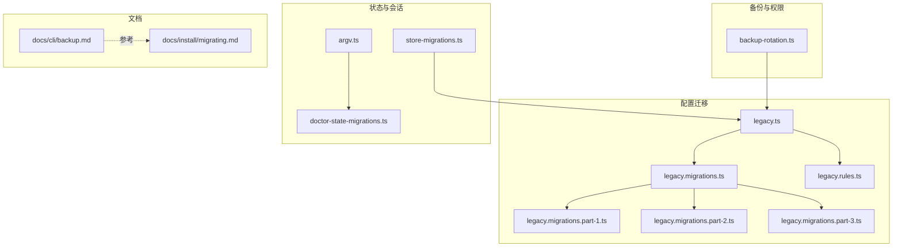
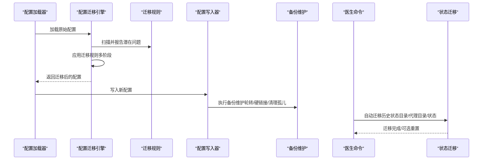
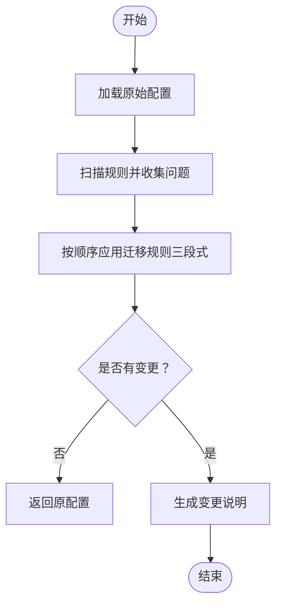
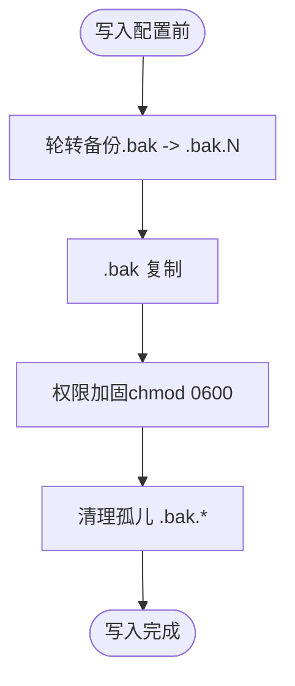
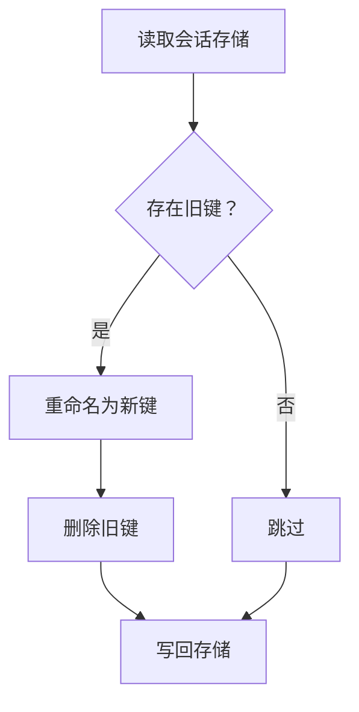
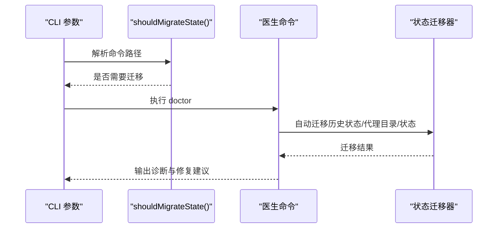
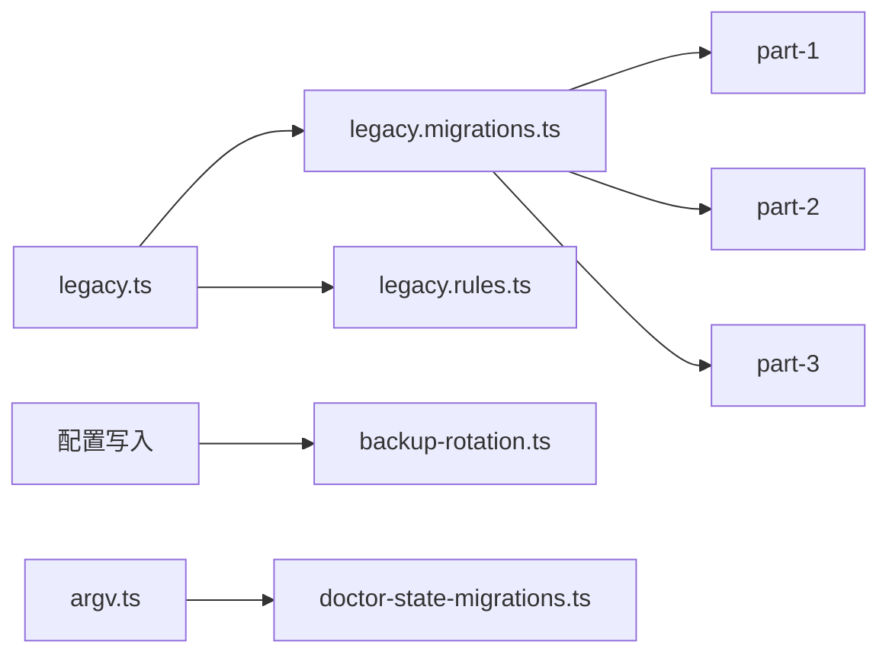

# 迁移策略

<cite>
**本文引用的文件**
- [src/config/legacy.ts](file://src/config/legacy.ts)
- [src/config/legacy.migrations.ts](file://src/config/legacy.migrations.ts)
- [src/config/legacy.migrations.part-1.ts](file://src/config/legacy.migrations.part-1.ts)
- [src/config/legacy.migrations.part-2.ts](file://src/config/legacy.migrations.part-2.ts)
- [src/config/legacy.migrations.part-3.ts](file://src/config/legacy.migrations.part-3.ts)
- [src/config/legacy.rules.ts](file://src/config/legacy.rules.ts)
- [src/config/backup-rotation.ts](file://src/config/backup-rotation.ts)
- [src/config/sessions/store-migrations.ts](file://src/config/sessions/store-migrations.ts)
- [src/cli/argv.ts](file://src/cli/argv.ts)
- [src/commands/doctor-state-migrations.ts](file://src/commands/doctor-state-migrations.ts)
- [docs/cli/backup.md](file://docs/cli/backup.md)
- [docs/install/migrating.md](file://docs/install/migrating.md)
</cite>

## 目录
1. [简介](#简介)
2. [项目结构](#项目结构)
3. [核心组件](#核心组件)
4. [架构总览](#架构总览)
5. [详细组件分析](#详细组件分析)
6. [依赖关系分析](#依赖关系分析)
7. [性能考量](#性能考量)
8. [故障排查指南](#故障排查指南)
9. [结论](#结论)
10. [附录](#附录)

## 简介
本文件面向 OpenClaw 的迁移场景，系统化梳理从旧版本到新版本的配置迁移、数据备份与状态同步策略，并覆盖以下主题：
- 配置文件迁移：旧版键值到新版路径的映射与自动迁移
- 数据备份：本地归档备份、校验与恢复建议
- 状态同步：会话与内存状态在主备环境下的同步与降级策略
- 跨版本迁移：旧版配置到新版 schema 的转换规则
- 安装方式迁移：全局安装与源码安装之间的迁移要点
- 跨平台迁移：不同操作系统与部署形态的注意事项
- 检查清单、回滚机制与数据完整性验证方法

## 项目结构
围绕迁移策略的关键代码分布在如下模块：
- 配置迁移：legacy.ts、legacy.migrations.*.ts、legacy.rules.ts
- 备份维护：backup-rotation.ts
- 会话存储迁移：store-migrations.ts
- 命令行入口：argv.ts（控制是否触发状态迁移）
- 医生命令导出：doctor-state-migrations.ts（暴露迁移与修复能力）
- 文档：backup.md、migrating.md（官方 CLI 与迁移指南）

**图表来源**
- [src/config/legacy.ts:1-59](file://src/config/legacy.ts#L1-L59)
- [src/config/legacy.migrations.ts:1-10](file://src/config/legacy.migrations.ts#L1-L10)
- [src/config/legacy.migrations.part-1.ts:1-616](file://src/config/legacy.migrations.part-1.ts#L1-L616)
- [src/config/legacy.migrations.part-2.ts:1-427](file://src/config/legacy.migrations.part-2.ts#L1-L427)
- [src/config/legacy.migrations.part-3.ts:1-385](file://src/config/legacy.migrations.part-3.ts#L1-L385)
- [src/config/legacy.rules.ts:1-213](file://src/config/legacy.rules.ts#L1-L213)
- [src/config/backup-rotation.ts:1-126](file://src/config/backup-rotation.ts#L1-L126)
- [src/config/sessions/store-migrations.ts:1-28](file://src/config/sessions/store-migrations.ts#L1-L28)
- [src/cli/argv.ts:303-328](file://src/cli/argv.ts#L303-L328)
- [src/commands/doctor-state-migrations.ts:1-13](file://src/commands/doctor-state-migrations.ts#L1-L13)
- [docs/cli/backup.md:1-77](file://docs/cli/backup.md#L1-L77)
- [docs/install/migrating.md:1-193](file://docs/install/migrating.md#L1-L193)

**章节来源**
- [src/config/legacy.ts:1-59](file://src/config/legacy.ts#L1-L59)
- [src/config/legacy.migrations.ts:1-10](file://src/config/legacy.migrations.ts#L1-L10)
- [src/config/backup-rotation.ts:1-126](file://src/config/backup-rotation.ts#L1-L126)
- [src/config/sessions/store-migrations.ts:1-28](file://src/config/sessions/store-migrations.ts#L1-L28)
- [src/cli/argv.ts:303-328](file://src/cli/argv.ts#L303-L328)
- [src/commands/doctor-state-migrations.ts:1-13](file://src/commands/doctor-state-migrations.ts#L1-L13)
- [docs/cli/backup.md:1-77](file://docs/cli/backup.md#L1-L77)
- [docs/install/migrating.md:1-193](file://docs/install/migrating.md#L1-L193)

## 核心组件
- 配置迁移引擎
  - 规则扫描与问题发现：findLegacyConfigIssues
  - 迁移应用：applyLegacyMigrations
  - 迁移规则集合：LEGACY_CONFIG_MIGRATIONS（分三部分拼接）
  - 迁移规则定义：LEGACY_CONFIG_RULES（用于提示与诊断）
- 备份维护
  - 维护流程：rotateConfigBackups → copyFile → hardenBackupPermissions → cleanOrphanBackups
  - 备份轮转数量：CONFIG_BACKUP_COUNT
- 会话存储迁移
  - 最佳-effort 迁移：字段重命名与兼容处理
- 命令行与医生
  - 控制是否进行状态迁移：shouldMigrateStateFromPath / shouldMigrateState
  - 医生命令导出：autoMigrateLegacyStateDir、runLegacyStateMigrations 等

**章节来源**
- [src/config/legacy.ts:16-58](file://src/config/legacy.ts#L16-L58)
- [src/config/legacy.migrations.ts:5-9](file://src/config/legacy.migrations.ts#L5-L9)
- [src/config/backup-rotation.ts:16-125](file://src/config/backup-rotation.ts#L16-L125)
- [src/config/sessions/store-migrations.ts:3-27](file://src/config/sessions/store-migrations.ts#L3-L27)
- [src/cli/argv.ts:303-328](file://src/cli/argv.ts#L303-L328)
- [src/commands/doctor-state-migrations.ts:2-12](file://src/commands/doctor-state-migrations.ts#L2-L12)

## 架构总览
下图展示迁移策略在运行时的交互关系：配置加载时执行迁移与规则检查；写入配置时执行备份维护；状态迁移由医生命令或启动参数触发。

**图表来源**
- [src/config/legacy.ts:16-58](file://src/config/legacy.ts#L16-L58)
- [src/config/legacy.migrations.ts:5-9](file://src/config/legacy.migrations.ts#L5-L9)
- [src/config/backup-rotation.ts:115-125](file://src/config/backup-rotation.ts#L115-L125)
- [src/commands/doctor-state-migrations.ts:2-12](file://src/commands/doctor-state-migrations.ts#L2-L12)
- [src/cli/argv.ts:303-328](file://src/cli/argv.ts#L303-L328)

## 详细组件分析

### 配置迁移引擎
- 功能要点
  - 规则扫描：基于 LEGACY_CONFIG_RULES 对配置路径进行匹配，输出问题列表
  - 迁移应用：遍历 LEGACY_CONFIG_MIGRATIONS（三段式），对配置树做结构性调整与字段重命名
  - 变更记录：迁移过程中累积变更说明，便于审计与用户提示
- 迁移范围
  - 通道配置迁移（channels.*）
  - 会话与线程绑定字段重命名
  - 流式传输模式标准化
  - 路由配置迁移（bindings、groupChat、queue、agentToAgent、transcribeAudio）
  - 工具与模型配置迁移（tools、agents.defaults、models）
  - 网关控制 UI 允许来源种子（非回环绑定场景）
  - 记忆检索、心跳、身份等顶层配置迁移
- 错误处理
  - 迁移过程采用“尽力而为”，避免因单点失败导致整体失败
  - 规则检查支持源值比对，确保仅在必要时迁移

**图表来源**
- [src/config/legacy.ts:16-58](file://src/config/legacy.ts#L16-L58)
- [src/config/legacy.migrations.ts:5-9](file://src/config/legacy.migrations.ts#L5-L9)
- [src/config/legacy.migrations.part-1.ts:97-616](file://src/config/legacy.migrations.part-1.ts#L97-L616)
- [src/config/legacy.migrations.part-2.ts:38-427](file://src/config/legacy.migrations.part-2.ts#L38-L427)
- [src/config/legacy.migrations.part-3.ts:100-385](file://src/config/legacy.migrations.part-3.ts#L100-L385)

**章节来源**
- [src/config/legacy.ts:16-58](file://src/config/legacy.ts#L16-L58)
- [src/config/legacy.migrations.ts:5-9](file://src/config/legacy.migrations.ts#L5-L9)
- [src/config/legacy.migrations.part-1.ts:97-616](file://src/config/legacy.migrations.part-1.ts#L97-L616)
- [src/config/legacy.migrations.part-2.ts:38-427](file://src/config/legacy.migrations.part-2.ts#L38-L427)
- [src/config/legacy.migrations.part-3.ts:100-385](file://src/config/legacy.migrations.part-3.ts#L100-L385)
- [src/config/legacy.rules.ts:49-212](file://src/config/legacy.rules.ts#L49-L212)

### 备份维护与权限加固
- 轮转策略
  - 将现有 .bak 移动到 .bak.1，依序向更高编号移动，最高编号文件被删除
  - 新写入的配置副本作为 .bak，随后统一权限加固
- 权限加固
  - 在支持 chmod 的平台上，将所有 .bak 文件权限设置为仅属主可读写
- 孤儿文件清理
  - 清理不在有效编号范围内的 .bak.* 文件，避免磁盘污染
- 调用顺序
  - rotate → copyFile → harden → cleanOrphan

**图表来源**
- [src/config/backup-rotation.ts:16-125](file://src/config/backup-rotation.ts#L16-L125)

**章节来源**
- [src/config/backup-rotation.ts:16-125](file://src/config/backup-rotation.ts#L16-L125)

### 会话存储迁移
- 目标
  - 将旧字段（如 provider、room）迁移到新字段（channel、groupChannel），并清理冗余键
- 策略
  - 遍历会话存储条目，按需重命名并删除旧键
  - 保持向后兼容，避免破坏性修改

**图表来源**
- [src/config/sessions/store-migrations.ts:3-27](file://src/config/sessions/store-migrations.ts#L3-L27)

**章节来源**
- [src/config/sessions/store-migrations.ts:3-27](file://src/config/sessions/store-migrations.ts#L3-L27)

### 状态迁移与医生命令
- 启动参数控制
  - shouldMigrateState / shouldMigrateStateFromPath 根据命令路径决定是否触发状态迁移
- 医生命令能力
  - autoMigrateLegacyStateDir、autoMigrateLegacyAgentDir、autoMigrateLegacyState、runLegacyStateMigrations 等
  - 支持重置测试用的迁移状态标记

**图表来源**
- [src/cli/argv.ts:303-328](file://src/cli/argv.ts#L303-L328)
- [src/commands/doctor-state-migrations.ts:2-12](file://src/commands/doctor-state-migrations.ts#L2-L12)

**章节来源**
- [src/cli/argv.ts:303-328](file://src/cli/argv.ts#L303-L328)
- [src/commands/doctor-state-migrations.ts:2-12](file://src/commands/doctor-state-migrations.ts#L2-L12)

## 依赖关系分析
- 配置迁移依赖
  - legacy.ts 依赖 legacy.migrations.ts 与 legacy.rules.ts
  - legacy.migrations.ts 由三段迁移文件拼接而成，分别处理不同维度的迁移
- 备份维护依赖
  - backup-rotation.ts 通过接口抽象（BackupRotationFs/BackupMaintenanceFs）解耦文件系统操作
- 状态迁移依赖
  - doctor-state-migrations.ts 导出迁移函数，供 CLI 或服务启动时调用
- 命令行入口
  - argv.ts 提供迁移开关判断，避免对健康检查、状态查询等命令触发不必要的迁移

**图表来源**
- [src/config/legacy.ts:1-3](file://src/config/legacy.ts#L1-L3)
- [src/config/legacy.migrations.ts:1-3](file://src/config/legacy.migrations.ts#L1-L3)
- [src/config/backup-rotation.ts:5-14](file://src/config/backup-rotation.ts#L5-L14)
- [src/cli/argv.ts:303-328](file://src/cli/argv.ts#L303-L328)
- [src/commands/doctor-state-migrations.ts:1-13](file://src/commands/doctor-state-migrations.ts#L1-L13)

**章节来源**
- [src/config/legacy.ts:1-3](file://src/config/legacy.ts#L1-L3)
- [src/config/legacy.migrations.ts:1-3](file://src/config/legacy.migrations.ts#L1-L3)
- [src/config/backup-rotation.ts:5-14](file://src/config/backup-rotation.ts#L5-L14)
- [src/cli/argv.ts:303-328](file://src/cli/argv.ts#L303-L328)
- [src/commands/doctor-state-migrations.ts:1-13](file://src/commands/doctor-state-migrations.ts#L1-L13)

## 性能考量
- 配置迁移
  - 迁移为一次性操作，复杂度与配置树规模线性相关；三段式拆分降低单次迭代成本
- 备份维护
  - 轮转与清理为 O(N) 文件操作，N 为备份数量；权限加固与目录扫描为常数开销
- 状态迁移
  - 历史状态迁移通常在首次启动或 doctor 时执行，建议在低负载时段运行
- 备份归档
  - 归档大小主要受工作区影响；可通过仅备份配置或禁用工作区来减小体积

[本节为通用指导，无需特定文件引用]

## 故障排查指南
- 配置迁移未生效
  - 检查是否存在旧版键值；使用规则扫描输出定位问题
  - 确认迁移顺序与变更说明是否符合预期
- 备份异常
  - 检查备份轮转与权限加固是否成功；确认孤儿文件已被清理
  - 若平台不支持 chmod/readdir，备份维护会尽力而为，但可能无法完全保证权限
- 状态迁移失败
  - 使用 doctor 命令查看迁移日志；必要时重置迁移状态标记后重试
- 迁移后行为异常
  - 确认命令路径是否触发了状态迁移（health/status/sessions/config get/unset 等不会触发）
  - 检查网关绑定模式与控制 UI 允许来源是否正确

**章节来源**
- [src/config/legacy.ts:16-58](file://src/config/legacy.ts#L16-L58)
- [src/config/backup-rotation.ts:16-125](file://src/config/backup-rotation.ts#L16-L125)
- [src/commands/doctor-state-migrations.ts:2-12](file://src/commands/doctor-state-migrations.ts#L2-L12)
- [src/cli/argv.ts:303-328](file://src/cli/argv.ts#L303-L328)

## 结论
OpenClaw 的迁移策略以“配置迁移 + 备份维护 + 状态迁移”为核心，辅以医生命令与 CLI 开关，形成从旧版本到新版本的平滑过渡路径。通过规则扫描与三段式迁移，系统能够自动适配键值结构变化；通过备份轮转与权限加固，保障配置变更的安全性；通过状态迁移与医生命令，确保历史数据与运行时状态的连续性。结合官方迁移指南与 CLI 文档，用户可在不同安装方式与平台间安全地完成迁移。

[本节为总结，无需特定文件引用]

## 附录

### 旧版本到新版本迁移流程（概要）
- 预备
  - 停止网关，备份状态目录与工作区
  - 确认新机器安装与环境准备就绪
- 迁移步骤
  - 复制状态目录与工作区至新机器
  - 在新机器上运行 doctor，自动应用配置迁移与修复
  - 启动网关并核对状态
- 验证
  - 使用 status、doctor、dashboard 等命令核对迁移结果

**章节来源**
- [docs/install/migrating.md:68-132](file://docs/install/migrating.md#L68-L132)

### 配置键值转换与遗留配置位置迁移
- 通道配置迁移：whatsapp/telegram/discord/slack/signal/imessage/msteams → channels.*
- 会话与线程绑定：threadBindings.ttlHours → idleHours
- 流式传输：streamMode/streaming/nativeStreaming → 统一到 streaming
- 路由配置：bindings/groupChat/queue/agentToAgent/transcribeAudio → 上移或改名
- 工具与模型：agent.* → agents.defaults 与 tools.*
- 网关控制 UI：seed 允许来源（非回环绑定）
- 其他：identity、heartbeat、memorySearch 等顶层键迁移

**章节来源**
- [src/config/legacy.migrations.part-1.ts:97-616](file://src/config/legacy.migrations.part-1.ts#L97-L616)
- [src/config/legacy.migrations.part-2.ts:38-427](file://src/config/legacy.migrations.part-2.ts#L38-L427)
- [src/config/legacy.migrations.part-3.ts:100-385](file://src/config/legacy.migrations.part-3.ts#L100-L385)

### 数据备份与恢复建议
- 备份内容
  - 状态目录、活动配置文件、OAuth/凭据目录、工作区（可选）
- 备份方式
  - 使用 openclaw backup 创建归档；支持 dry-run、verify、仅备份配置等选项
- 恢复建议
  - 停止网关，替换状态目录与工作区，运行 doctor 修复，重启网关

**章节来源**
- [docs/cli/backup.md:9-77](file://docs/cli/backup.md#L9-L77)

### 状态同步与降级策略
- 主备降级
  - 当主存储不可用时，切换到后备存储继续同步
- 同步触发
  - 通过 sync 接口触发，支持按原因与会话文件定向同步
- 并发与一致性
  - 迁移期间避免并发写入；必要时采用只读恢复流程

**章节来源**
- [src/config/sessions/store-migrations.ts:3-27](file://src/config/sessions/store-migrations.ts#L3-L27)

### 不同安装方式之间的迁移（全局到源码、源码到全局）
- 关键点
  - 确保状态目录与工作区一致迁移，避免仅复制配置文件
  - 注意 profile 与 OPENCLAW_STATE_DIR 的一致性
  - 权限与所有权需与运行用户匹配
- 建议
  - 使用 doctor 校验并修复差异后再启动

**章节来源**
- [docs/install/migrating.md:133-178](file://docs/install/migrating.md#L133-L178)

### 跨平台迁移注意事项
- 权限与平台差异
  - 备份维护在不支持 chmod/readdir 的平台会尽力而为
- 文件系统行为
  - 归档写入优先硬链接发布，不支持时回退到独占复制
- 绑定模式
  - 网关 bind 的主机别名已废弃，应使用 lan/loopback/custom/tailnet/auto

**章节来源**
- [src/config/backup-rotation.ts:38-71](file://src/config/backup-rotation.ts#L38-L71)
- [src/config/legacy.migrations.part-3.ts:100-144](file://src/config/legacy.migrations.part-3.ts#L100-L144)

### 迁移检查清单
- 迁移前
  - 停止网关，备份状态目录与工作区
  - 记录当前配置与状态
- 迁移中
  - 复制状态目录与工作区
  - 在新机器运行 doctor，确认迁移日志
- 迁移后
  - 启动网关，使用 status、doctor、dashboard 核对
  - 验证通道连接与会话历史

**章节来源**
- [docs/install/migrating.md:179-187](file://docs/install/migrating.md#L179-L187)

### 回滚机制与数据完整性验证
- 回滚
  - 利用备份轮转保留的 .bak 文件回滚到上一个稳定版本
- 完整性验证
  - 使用 openclaw backup verify 校验归档完整性
  - doctor 输出迁移与修复建议，辅助人工核验

**章节来源**
- [src/config/backup-rotation.ts:16-125](file://src/config/backup-rotation.ts#L16-L125)
- [docs/cli/backup.md:23-33](file://docs/cli/backup.md#L23-L33)