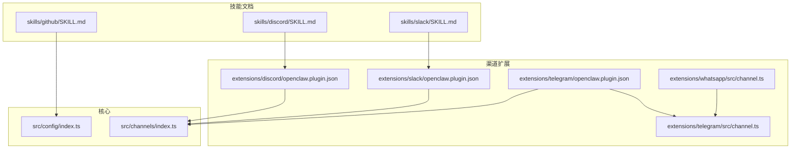
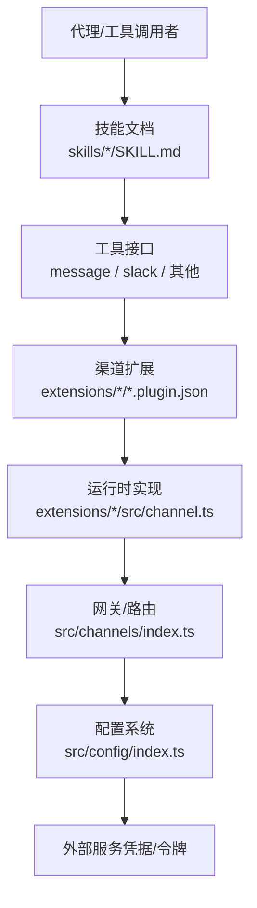
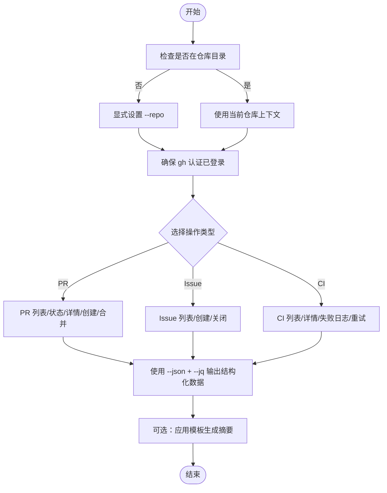
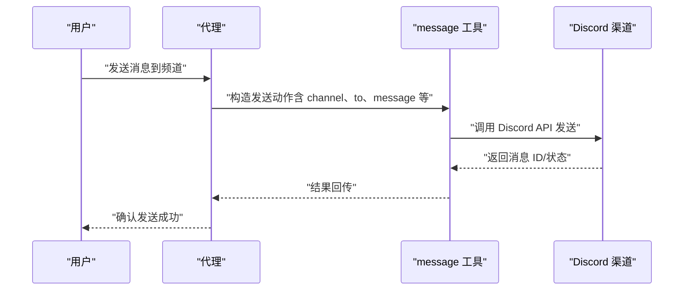
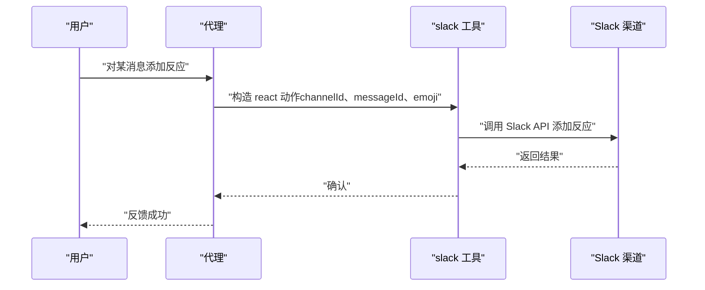
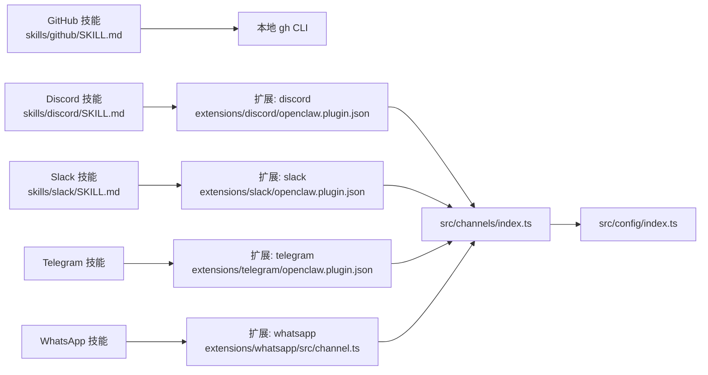

# 常用技能

<cite>
**本文引用的文件**
- [skills/github/SKILL.md](file://skills/github/SKILL.md)
- [skills/discord/SKILL.md](file://skills/discord/SKILL.md)
- [skills/slack/SKILL.md](file://skills/slack/SKILL.md)
- [extensions/discord/openclaw.plugin.json](file://extensions/discord/openclaw.plugin.json)
- [extensions/slack/openclaw.plugin.json](file://extensions/slack/openclaw.plugin.json)
- [extensions/telegram/openclaw.plugin.json](file://extensions/telegram/openclaw.plugin.json)
- [extensions/whatsapp/src/channel.ts](file://extensions/whatsapp/src/channel.ts)
- [extensions/telegram/src/channel.ts](file://extensions/telegram/src/channel.ts)
- [src/channels/index.ts](file://src/channels/index.ts)
- [src/config/index.ts](file://src/config/index.ts)
- [docs/channels/discord.md](file://docs/channels/discord.md)
- [docs/channels/slack.md](file://docs/channels/slack.md)
- [docs/channels/telegram.md](file://docs/channels/telegram.md)
- [docs/channels/whatsapp.md](file://docs/channels/whatsapp.md)
- [docs/tools/skills.md](file://docs/tools/skills.md)
- [docs/start/getting-started.md](file://docs/start/getting-started.md)
- [docs/cli/configure.md](file://docs/cli/configure.md)
- [docs/gateway/configuration.md](file://docs/gateway/configuration.md)
</cite>

## 目录
1. [简介](#简介)
2. [项目结构](#项目结构)
3. [核心组件](#核心组件)
4. [架构总览](#架构总览)
5. [详细组件分析](#详细组件分析)
6. [依赖关系分析](#依赖关系分析)
7. [性能考虑](#性能考虑)
8. [故障排除指南](#故障排除指南)
9. [结论](#结论)
10. [附录](#附录)

## 简介
本指南面向需要在 OpenClaw 中使用常用即时通讯与开发平台技能的用户，系统讲解以下技能的安装配置、参数设置、使用场景与最佳实践：  
- GitHub 集成技能（通过 gh CLI 进行问题、拉取请求、CI 运行等操作）  
- Discord 消息发送技能（通过 message 工具进行发送、编辑、删除、反应、搜索、线程、置顶等）  
- Telegram 群组管理技能（通过 Telegram 渠道能力进行消息与群组管理）  
- WhatsApp 消息处理技能（通过 WhatsApp 渠道能力进行消息收发与目标解析）  
- Slack 团队协作技能（通过 slack 工具进行反应、消息管理、成员信息与表情列表查询）

本指南同时提供技能间的协作机制与组合使用建议，帮助构建完整的自动化解决方案。

## 项目结构
OpenClaw 将“技能”以独立文档形式组织在 skills 目录中，将“渠道扩展”以插件形式组织在 extensions 目录中。技能文档描述功能、使用条件、命令与模板；渠道扩展定义渠道 ID、配置模式与运行时能力。

图表来源
- [skills/github/SKILL.md](file://skills/github/SKILL.md#L1-L164)
- [skills/discord/SKILL.md](file://skills/discord/SKILL.md#L1-L198)
- [skills/slack/SKILL.md](file://skills/slack/SKILL.md#L1-L145)
- [extensions/discord/openclaw.plugin.json](file://extensions/discord/openclaw.plugin.json#L1-L10)
- [extensions/slack/openclaw.plugin.json](file://extensions/slack/openclaw.plugin.json#L1-L10)
- [extensions/telegram/openclaw.plugin.json](file://extensions/telegram/openclaw.plugin.json#L1-L10)
- [extensions/whatsapp/src/channel.ts](file://extensions/whatsapp/src/channel.ts)
- [extensions/telegram/src/channel.ts](file://extensions/telegram/src/channel.ts)
- [src/config/index.ts](file://src/config/index.ts)
- [src/channels/index.ts](file://src/channels/index.ts)

章节来源
- [skills/github/SKILL.md](file://skills/github/SKILL.md#L1-L164)
- [skills/discord/SKILL.md](file://skills/discord/SKILL.md#L1-L198)
- [skills/slack/SKILL.md](file://skills/slack/SKILL.md#L1-L145)
- [extensions/discord/openclaw.plugin.json](file://extensions/discord/openclaw.plugin.json#L1-L10)
- [extensions/slack/openclaw.plugin.json](file://extensions/slack/openclaw.plugin.json#L1-L10)
- [extensions/telegram/openclaw.plugin.json](file://extensions/telegram/openclaw.plugin.json#L1-L10)
- [extensions/whatsapp/src/channel.ts](file://extensions/whatsapp/src/channel.ts)
- [extensions/telegram/src/channel.ts](file://extensions/telegram/src/channel.ts)
- [src/config/index.ts](file://src/config/index.ts)
- [src/channels/index.ts](file://src/channels/index.ts)

## 核心组件
- GitHub 技能：基于 gh CLI 的仓库、问题、拉取请求与 CI 运行操作，支持结构化输出与模板化摘要生成。  
- Discord 技能：通过 message 工具在 Discord 上执行发送、编辑、删除、反应、读取、搜索、线程、置顶等动作，并遵循富交互组件与传统嵌入的使用规范。  
- Slack 技能：通过 slack 工具对消息进行反应、发送、编辑、删除、读取、置顶/取消置顶、成员信息与表情列表查询。  
- Telegram 技能：通过 Telegram 渠道能力进行消息与群组管理（具体能力由扩展实现）。  
- WhatsApp 技能：通过 WhatsApp 渠道能力进行消息收发与目标解析（具体能力由扩展实现）。

章节来源
- [skills/github/SKILL.md](file://skills/github/SKILL.md#L1-L164)
- [skills/discord/SKILL.md](file://skills/discord/SKILL.md#L1-L198)
- [skills/slack/SKILL.md](file://skills/slack/SKILL.md#L1-L145)
- [extensions/telegram/openclaw.plugin.json](file://extensions/telegram/openclaw.plugin.json#L1-L10)
- [extensions/whatsapp/src/channel.ts](file://extensions/whatsapp/src/channel.ts)

## 架构总览
OpenClaw 的技能与渠道通过统一的配置与路由层协同工作。技能文档定义“做什么”，渠道扩展定义“如何接入”，配置系统提供“凭据与开关”，运行时负责“执行与回传”。

图表来源
- [skills/discord/SKILL.md](file://skills/discord/SKILL.md#L1-L198)
- [skills/slack/SKILL.md](file://skills/slack/SKILL.md#L1-L145)
- [extensions/discord/openclaw.plugin.json](file://extensions/discord/openclaw.plugin.json#L1-L10)
- [extensions/slack/openclaw.plugin.json](file://extensions/slack/openclaw.plugin.json#L1-L10)
- [extensions/telegram/openclaw.plugin.json](file://extensions/telegram/openclaw.plugin.json#L1-L10)
- [extensions/telegram/src/channel.ts](file://extensions/telegram/src/channel.ts)
- [extensions/whatsapp/src/channel.ts](file://extensions/whatsapp/src/channel.ts)
- [src/channels/index.ts](file://src/channels/index.ts)
- [src/config/index.ts](file://src/config/index.ts)

## 详细组件分析

### GitHub 技能
- 功能特性
  - 支持 PR 列表、状态检查、详情查看、创建与合并
  - 支持 Issue 列表、创建、关闭
  - 支持 CI 运行列表、详情查看、失败步骤日志与重试
  - 支持 GitHub API 查询与结构化输出
  - 提供 PR 审查摘要与问题分流模板
- 安装与前置要求
  - 安装 gh CLI 并完成认证与验证
  - 在非仓库目录时需显式指定仓库参数
- 使用场景
  - 快速审查 PR、查看 CI 失败原因、批量列出问题与 PR
  - 结合模板生成标准化摘要，用于团队评审与分流
- 最佳实践
  - 对频繁查询使用缓存策略降低速率限制影响
  - 使用结构化输出配合过滤器，减少手工解析

图表来源
- [skills/github/SKILL.md](file://skills/github/SKILL.md#L56-L164)

章节来源
- [skills/github/SKILL.md](file://skills/github/SKILL.md#L1-L164)

### Discord 技能（通过 message 工具）
- 功能特性
  - 发送文本、媒体、富交互组件 v2（推荐）
  - 反应、读取、编辑、删除消息
  - 搜索消息、创建线程、置顶/取消置顶
  - 设置在线状态与活动（常受权限限制）
- 安装与配置
  - 需要配置 channels.discord.token
  - 遵循动作权限门控（如 roles、moderation、presence、channels 等默认可能关闭）
  - 建议优先使用明确的 ID（guildId、channelId、messageId、userId）
- 使用场景
  - 自动化公告、工单流转通知、问题排查记录、投票与线程化讨论
- 最佳实践
  - 文本风格简洁、避免复杂表格
  - 用户提及使用 <@USER_ID> 格式
  - 富交互优先使用组件 v2，避免与传统 embeds 混用

图表来源
- [skills/discord/SKILL.md](file://skills/discord/SKILL.md#L30-L86)
- [extensions/discord/openclaw.plugin.json](file://extensions/discord/openclaw.plugin.json#L1-L10)

章节来源
- [skills/discord/SKILL.md](file://skills/discord/SKILL.md#L1-L198)
- [extensions/discord/openclaw.plugin.json](file://extensions/discord/openclaw.plugin.json#L1-L10)

### Slack 技能
- 功能特性
  - 反应、列出反应、发送/编辑/删除消息、读取最近消息
  - 置顶/取消置顶、列出置顶项
  - 获取成员信息、列出自定义表情
- 安装与配置
  - 需要配置 channels.slack（具体键位由扩展定义）
  - 使用 OpenClaw 配置的机器人令牌
- 使用场景
  - 快速标记任务完成、维护知识库链接、查询成员信息与表情
- 最佳实践
  - 复用消息上下文中的 channelId 与 messageId
  - 合理使用分组权限，避免越权操作

图表来源
- [skills/slack/SKILL.md](file://skills/slack/SKILL.md#L33-L42)
- [extensions/slack/openclaw.plugin.json](file://extensions/slack/openclaw.plugin.json#L1-L10)

章节来源
- [skills/slack/SKILL.md](file://skills/slack/SKILL.md#L1-L145)
- [extensions/slack/openclaw.plugin.json](file://extensions/slack/openclaw.plugin.json#L1-L10)

### Telegram 技能
- 功能特性
  - 通过 Telegram 渠道能力进行消息与群组管理（具体能力由扩展实现）
- 安装与配置
  - 渠道 ID 为 telegram，配置模式由扩展定义
- 使用场景
  - 群组公告、批量通知、自动化内容发布
- 最佳实践
  - 明确目标频道或群组 ID，避免误发
  - 结合富交互与媒体内容提升可读性

章节来源
- [extensions/telegram/openclaw.plugin.json](file://extensions/telegram/openclaw.plugin.json#L1-L10)
- [extensions/telegram/src/channel.ts](file://extensions/telegram/src/channel.ts)
- [docs/channels/telegram.md](file://docs/channels/telegram.md)

### WhatsApp 技能
- 功能特性
  - 通过 WhatsApp 渠道能力进行消息收发与目标解析（具体能力由扩展实现）
- 安装与配置
  - 渠道 ID 为 whatsapp，配置模式由扩展定义
- 使用场景
  - 客户服务自动回复、批量通知、事件提醒
- 最佳实践
  - 使用明确的联系人或群组 ID
  - 注意隐私与合规，避免未经同意的群发

章节来源
- [extensions/whatsapp/src/channel.ts](file://extensions/whatsapp/src/channel.ts)
- [docs/channels/whatsapp.md](file://docs/channels/whatsapp.md)

## 依赖关系分析
- 技能与渠道的耦合
  - GitHub 技能不依赖特定渠道扩展，而是通过本地 CLI 工具执行
  - Discord/Slack/Telegram/WhatsApp 技能依赖对应渠道扩展提供的运行时能力
- 配置与路由
  - 渠道扩展通过 openclaw.plugin.json 声明渠道 ID 与配置模式
  - 运行时通过 src/channels/index.ts 路由到具体扩展
  - 配置系统在 src/config/index.ts 提供凭据与开关

图表来源
- [skills/github/SKILL.md](file://skills/github/SKILL.md#L1-L164)
- [skills/discord/SKILL.md](file://skills/discord/SKILL.md#L1-L198)
- [skills/slack/SKILL.md](file://skills/slack/SKILL.md#L1-L145)
- [extensions/discord/openclaw.plugin.json](file://extensions/discord/openclaw.plugin.json#L1-L10)
- [extensions/slack/openclaw.plugin.json](file://extensions/slack/openclaw.plugin.json#L1-L10)
- [extensions/telegram/openclaw.plugin.json](file://extensions/telegram/openclaw.plugin.json#L1-L10)
- [extensions/whatsapp/src/channel.ts](file://extensions/whatsapp/src/channel.ts)
- [src/channels/index.ts](file://src/channels/index.ts)
- [src/config/index.ts](file://src/config/index.ts)

章节来源
- [src/channels/index.ts](file://src/channels/index.ts)
- [src/config/index.ts](file://src/config/index.ts)

## 性能考虑
- GitHub
  - 对重复查询使用缓存策略，减少 API 调用频率
  - 使用结构化输出与过滤器，避免不必要的数据传输
- Discord
  - 控制消息大小与附件数量，避免触发速率限制
  - 合理使用富交互组件，减少多次往返
- Slack
  - 批量操作前先读取上下文，避免重复查询
  - 使用分页与限制条数控制响应时间
- Telegram/WhatsApp
  - 明确目标 ID，避免广播风暴
  - 合理拆分大消息，分批发送

## 故障排除指南
- GitHub
  - 确认 gh 已正确认证且状态正常
  - 在非仓库目录时务必显式指定仓库参数
  - 遇到速率限制时启用缓存或降低查询频率
- Discord
  - 检查 channels.discord.actions.* 权限是否开启
  - 使用明确 ID，避免因名称变更导致错误
  - 富交互与传统嵌入不可混用
- Slack
  - 确认机器人令牌有效且具备相应权限
  - 复用消息上下文中的 channelId 与 messageId
- Telegram/WhatsApp
  - 确认扩展已正确加载且配置模式匹配
  - 检查目标 ID 是否存在且可访问

章节来源
- [skills/github/SKILL.md](file://skills/github/SKILL.md#L56-L164)
- [skills/discord/SKILL.md](file://skills/discord/SKILL.md#L12-L28)
- [skills/slack/SKILL.md](file://skills/slack/SKILL.md#L13-L20)
- [extensions/discord/openclaw.plugin.json](file://extensions/discord/openclaw.plugin.json#L1-L10)
- [extensions/slack/openclaw.plugin.json](file://extensions/slack/openclaw.plugin.json#L1-L10)

## 结论
通过将技能文档与渠道扩展解耦，OpenClaw 实现了跨平台即时通讯与开发平台的统一接入。结合配置系统与运行时路由，用户可以快速完成从安装配置到自动化执行的全流程。建议在实际部署中优先明确权限与目标 ID，合理使用富交互与结构化输出，并根据平台特性制定缓存与限流策略，以获得稳定高效的自动化体验。

## 附录
- 安装与配置参考
  - 通用配置与安装：[docs/start/getting-started.md](file://docs/start/getting-started.md)
  - CLI 配置：[docs/cli/configure.md](file://docs/cli/configure.md)
  - 网关配置：[docs/gateway/configuration.md](file://docs/gateway/configuration.md)
- 渠道与技能参考
  - Discord：[docs/channels/discord.md](file://docs/channels/discord.md)
  - Slack：[docs/channels/slack.md](file://docs/channels/slack.md)
  - Telegram：[docs/channels/telegram.md](file://docs/channels/telegram.md)
  - WhatsApp：[docs/channels/whatsapp.md](file://docs/channels/whatsapp.md)
  - 技能总览：[docs/tools/skills.md](file://docs/tools/skills.md)