# 生产力工具技能

<cite>
**本文档引用的文件**
- [skills/notion/SKILL.md](file://skills/notion/SKILL.md)
- [skills/obsidian/SKILL.md](file://skills/obsidian/SKILL.md)
- [skills/apple-notes/SKILL.md](file://skills/apple-notes/SKILL.md)
- [skills/trello/SKILL.md](file://skills/trello/SKILL.md)
- [skills/things-mac/SKILL.md](file://skills/things-mac/SKILL.md)
- [skills/apple-reminders/SKILL.md](file://skills/apple-reminders/SKILL.md)
- [skills/github/SKILL.md](file://skills/github/SKILL.md)
- [skills/gh-issues/SKILL.md](file://skills/gh-issues/SKILL.md)
- [skills/pdf/SKILL.md](file://skills/pdf/SKILL.md)
- [skills/model-usage/SKILL.md](file://skills/model-usage/SKILL.md)
- [docs/tools/skills.md](file://docs/tools/skills.md)
- [docs/tools/skills-config.md](file://docs/tools/skills-config.md)
- [README.md](file://README.md)
- [docs/start/getting-started.md](file://docs/start/getting-started.md)
</cite>

## 目录
1. [简介](#简介)
2. [项目结构](#项目结构)
3. [核心组件](#核心组件)
4. [架构总览](#架构总览)
5. [详细组件分析](#详细组件分析)
6. [依赖关系分析](#依赖关系分析)
7. [性能考虑](#性能考虑)
8. [故障排除指南](#故障排除指南)
9. [结论](#结论)
10. [附录](#附录)

## 简介
本指南面向希望在 OpenClaw 中高效使用生产力工具技能的用户与团队，系统讲解如何通过 Notion 页面管理、Obsidian 笔记同步、Apple Notes 集成、Trello 看板自动化等技能，构建从个人到团队的知识管理体系。内容覆盖安装配置、API 密钥与权限设置、数据同步策略、典型使用场景（自动任务创建、笔记分类整理、提醒设置、数据备份）以及工具间协作与数据流转。

## 项目结构
OpenClaw 使用“技能（Skill）”作为可插拔的能力单元，每个技能以独立目录包含 SKILL.md 文档与可选脚本。技能加载遵循优先级：工作空间技能 > 本地管理技能 > 内置技能；同时支持通过 ClawHub 进行技能的发现、安装与同步。

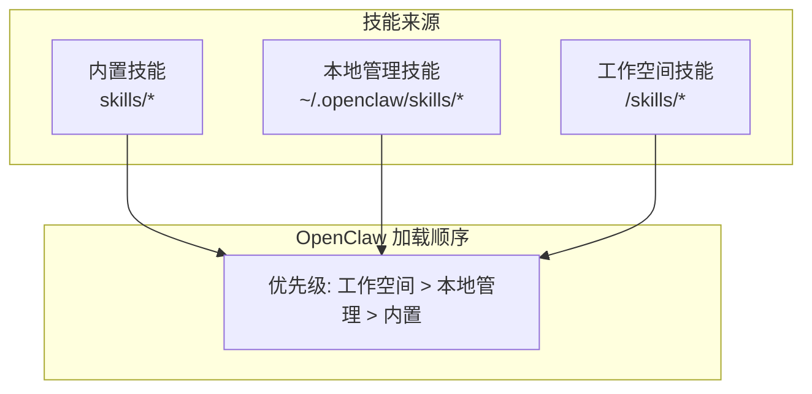

图表来源
- [docs/tools/skills.md](file://docs/tools/skills.md#L13-L40)

章节来源
- [docs/tools/skills.md](file://docs/tools/skills.md#L1-L303)
- [README.md](file://README.md#L458-L478)

## 核心组件
以下为本次文档聚焦的生产力工具技能概览，涵盖功能特性、前置条件、配置要点与典型用法。

- Notion 技能
  - 功能：通过 Notion API 创建/读取/更新页面、数据库与块，支持搜索、查询与内容追加。
  - 前置条件：需要在 Notion 中创建 Integration 并获取 API Key，按需分享目标页面/数据库给该 Integration。
  - 关键点：使用最新 Notion 版本头（2025-09-03），数据库在新版本中称为“数据源”，注意区分 database_id 与 data_source_id。
- Obsidian 技能
  - 功能：通过 obsidian-cli 对多库仓进行搜索、创建、移动/重命名、删除与内容编辑。
  - 前置条件：安装 obsidian-cli；在 macOS 上通过配置文件定位默认库；避免硬编码路径，优先使用工具解析。
- Apple Notes 技能
  - 功能：通过 memo CLI 在终端管理 Apple Notes，支持列表、搜索、创建、编辑、删除、移动与导出。
  - 前置条件：仅 macOS；安装 memo 并授予 Notes.app 的 Automation 权限。
- Trello 技能
  - 功能：通过 Trello REST API 列出看板、列表与卡片，创建卡片、移动卡片、添加评论与归档卡片。
  - 前置条件：获取 API Key 与 Token；注意速率限制与令牌权限范围。
- Things 3 技能（macOS）
  - 功能：读取 Inbox/Today/Upcoming，搜索项目/区域/标签；通过 URL Scheme 添加任务（支持预览模式）。
  - 前置条件：安装 things CLI；如读取本地数据库失败，需授予 Full Disk Access；可设置 THINGSDB/THINGS_AUTH_TOKEN。
- Apple Reminders 技能（macOS）
  - 功能：通过 remindctl 列表、添加、完成/删除提醒；支持日期过滤与 JSON/纯文本输出。
  - 前置条件：安装 remindctl；首次使用需授权访问 Reminders。
- GitHub 技能
  - 功能：通过 gh CLI 操作仓库 Issue/PR、CI 运行、代码审查与 API 查询；适合日常协作与状态检查。
  - 前置条件：安装 gh CLI 并完成认证。
- gh-issues 技能
  - 功能：自动抓取 Issue、派生子代理修复并提交 PR，随后监控评审评论并处理反馈；支持守望模式与定时模式。
  - 前置条件：具备 GH_TOKEN；可选择 Fork 模式推送分支与开 PR。
- PDF 处理技能
  - 功能：合并/拆分、提取文本/表格、旋转、加水印、创建 PDF、OCR、加密/解密、提取图片等。
  - 前置条件：Python 库与命令行工具（如 pypdf、pdfplumber、reportlab、qpdf、pdftotext、pytesseract 等）。
- Model usage 技能（macOS）
  - 功能：汇总 Codex/Claude 的按模型计费成本，支持当前模型或全量模型统计。
  - 前置条件：安装 codexbar CLI；当前仅支持 macOS。

章节来源
- [skills/notion/SKILL.md](file://skills/notion/SKILL.md#L1-L175)
- [skills/obsidian/SKILL.md](file://skills/obsidian/SKILL.md#L1-L82)
- [skills/apple-notes/SKILL.md](file://skills/apple-notes/SKILL.md#L1-L78)
- [skills/trello/SKILL.md](file://skills/trello/SKILL.md#L1-L96)
- [skills/things-mac/SKILL.md](file://skills/things-mac/SKILL.md#L1-L87)
- [skills/apple-reminders/SKILL.md](file://skills/apple-reminders/SKILL.md#L1-L119)
- [skills/github/SKILL.md](file://skills/github/SKILL.md#L1-L164)
- [skills/gh-issues/SKILL.md](file://skills/gh-issues/SKILL.md#L1-L866)
- [skills/pdf/SKILL.md](file://skills/pdf/SKILL.md#L1-L315)
- [skills/model-usage/SKILL.md](file://skills/model-usage/SKILL.md#L1-L70)

## 架构总览
OpenClaw 的技能体系由“技能定义 + 环境注入 + 调用执行”三部分组成。技能通过 metadata.openclaw 定义前置条件（二进制、环境变量、配置项），运行时根据配置注入环境变量与密钥，最终在宿主或沙箱环境中执行。

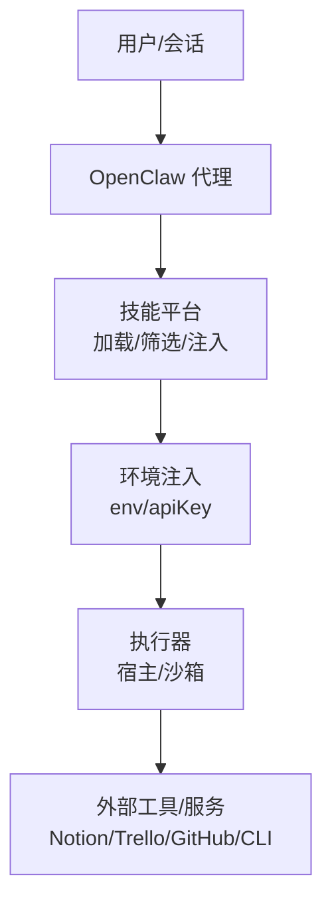

图表来源
- [docs/tools/skills.md](file://docs/tools/skills.md#L106-L147)
- [docs/tools/skills-config.md](file://docs/tools/skills-config.md#L1-L78)

章节来源
- [docs/tools/skills.md](file://docs/tools/skills.md#L106-L187)
- [docs/tools/skills-config.md](file://docs/tools/skills-config.md#L1-L78)

## 详细组件分析

### Notion 技能
- 安装与配置
  - 在 Notion 中创建 Integration，复制 API Key（以 ntn_ 或 secret_ 开头）。
  - 将 Key 存放在约定路径（例如 ~/.config/notion/api_key），并在 SKILL.md 中参考使用。
  - 将 Integration 分享到目标页面/数据库，确保有读写权限。
- API 基础
  - 所有请求需携带 Authorization: Bearer 与 Notion-Version: 2025-09-03。
  - 新版本中数据库称为“数据源”，端点前缀为 /data_sources/。
- 常用操作
  - 搜索：POST /v1/search，按标题检索页面与数据源。
  - 获取页面与内容块：GET /v1/pages/{page_id} 与 GET /v1/blocks/{page_id}/children。
  - 创建页面：POST /v1/pages，父对象使用 database_id。
  - 查询数据源：POST /v1/data_sources/{data_source_id}/query。
  - 更新页面属性：PATCH /v1/pages/{page_id}。
  - 追加块：PATCH /v1/blocks/{page_id}/children。
- 属性类型
  - 支持标题、富文本、选择、多选、日期、勾选框、数字、URL、邮箱、关联等。
- 注意事项
  - 速率限制约 3 请求/秒，遇到 429 时按 Retry-After 回退。
  - 单次追加最多 100 个子块，支持两级嵌套。
  - 数据库视图筛选在 UI 端生效，API 不支持直接设置。

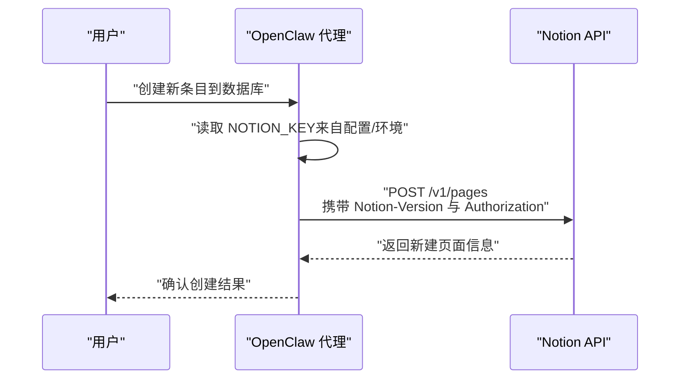

图表来源
- [skills/notion/SKILL.md](file://skills/notion/SKILL.md#L71-L85)

章节来源
- [skills/notion/SKILL.md](file://skills/notion/SKILL.md#L16-L175)

### Obsidian 技能
- 安装与配置
  - 安装 obsidian-cli；在 macOS 上通过 ~/Library/Application Support/obsidian/obsidian.json 解析默认库。
  - 避免在脚本中硬编码库路径，优先使用工具解析或 print-default。
- 快速上手
  - 设置默认库：obsidian-cli set-default "<库名>"。
  - 搜索：obsidian-cli search "关键词"（按名称）、obsidian-cli search-content "关键词"（按内容）。
  - 创建：obsidian-cli create "Folder/New note" --content "..." --open。
  - 移动/重命名：obsidian-cli move "旧路径" "新路径"（自动更新链接）。
  - 删除：obsidian-cli delete "路径"。
- 最佳实践
  - 多库并存时，优先读取配置而非猜测路径。
  - 直接编辑 .md 文件更高效，Obsidian 会自动感知变更。

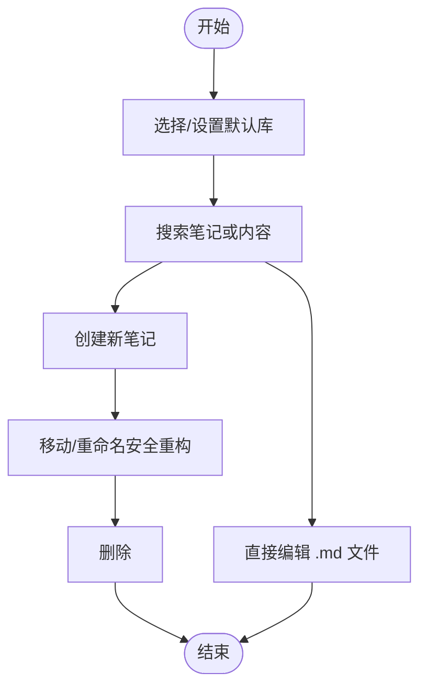

图表来源
- [skills/obsidian/SKILL.md](file://skills/obsidian/SKILL.md#L36-L82)

章节来源
- [skills/obsidian/SKILL.md](file://skills/obsidian/SKILL.md#L1-L82)

### Apple Notes 技能
- 安装与配置
  - 仅 macOS；安装 memo 并授予 Notes.app 的 Automation 权限。
- 常用操作
  - 列表/过滤/搜索：memo notes、memo notes -f "文件夹"、memo notes -s "关键词"。
  - 创建：memo notes -a（交互编辑器）或 memo notes -a "标题"。
  - 编辑/删除/移动：分别对应 -e/-d/-m（交互选择）。
  - 导出：memo notes -ex（HTML/Markdown）。
- 限制与注意事项
  - 无法编辑含图片/附件的笔记。
  - 交互提示需要终端可用。

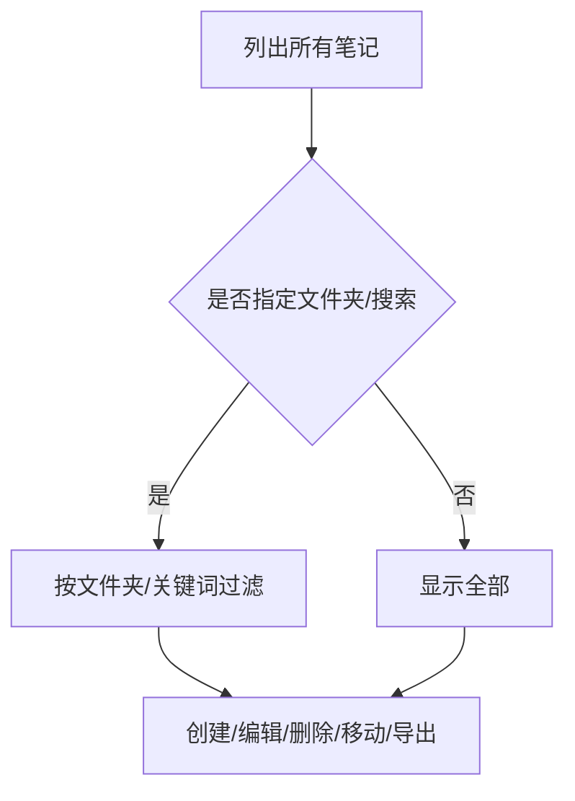

图表来源
- [skills/apple-notes/SKILL.md](file://skills/apple-notes/SKILL.md#L30-L78)

章节来源
- [skills/apple-notes/SKILL.md](file://skills/apple-notes/SKILL.md#L1-L78)

### Trello 技能
- 安装与配置
  - 获取 API Key 与 Token；设置环境变量 TRELLO_API_KEY 与 TRELLO_TOKEN。
- 常用操作
  - 列出看板/列表/卡片；创建卡片；移动卡片；添加评论；归档卡片。
- 速率限制
  - API Key 与 Token 各自限制，注意控制调用频率。

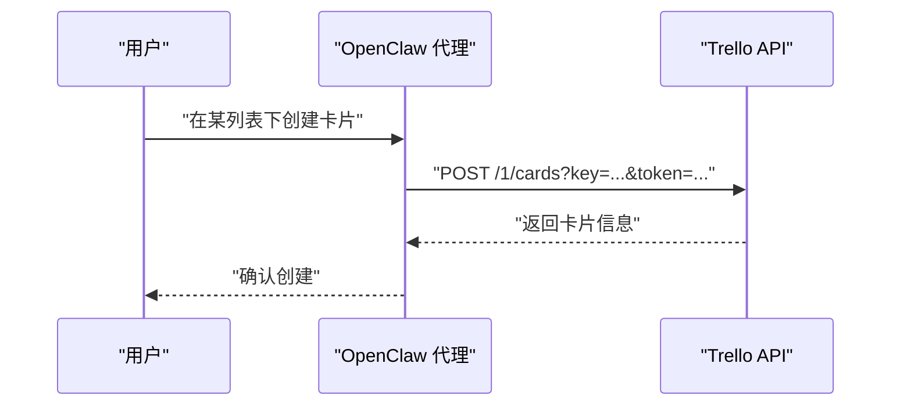

图表来源
- [skills/trello/SKILL.md](file://skills/trello/SKILL.md#L48-L76)

章节来源
- [skills/trello/SKILL.md](file://skills/trello/SKILL.md#L16-L96)

### Things 3 技能（macOS）
- 安装与配置
  - 安装 things CLI；如读取本地数据库失败，授予 Full Disk Access；可设置 THINGSDB/THINGS_AUTH_TOKEN。
- 常用操作
  - 读取：inbox、today、upcoming、search、projects/areas/tags。
  - 写入：推荐先 --dry-run 预览，再执行 add；支持设置备注、时间、截止日期、列表/区域、标题、标签、清单项等。
- 删除
  - 当前不支持直接删除；可通过标记完成/取消替代。

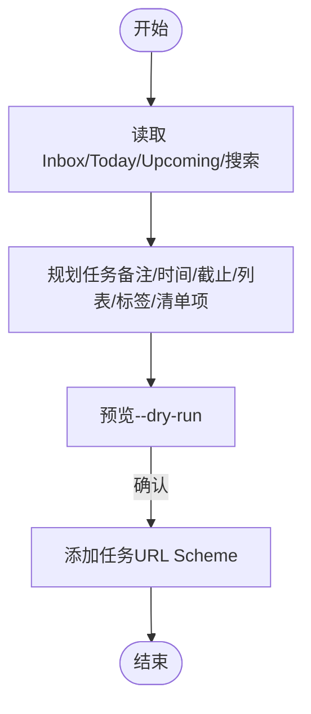

图表来源
- [skills/things-mac/SKILL.md](file://skills/things-mac/SKILL.md#L37-L87)

章节来源
- [skills/things-mac/SKILL.md](file://skills/things-mac/SKILL.md#L1-L87)

### Apple Reminders 技能（macOS）
- 安装与配置
  - 安装 remindctl；首次使用需授权访问 Reminders。
- 常用操作
  - 查看：today/tomorrow/week/overdue/all/具体日期。
  - 列表：list 列表名/创建/删除。
  - 添加：--title/--list/--due。
  - 完成/删除：complete/delete。
  - 输出格式：--json/--plain/--quiet。
- 日期格式
  - 支持 today/tomorrow/yesterday、YYYY-MM-DD、YYYY-MM-DD HH:mm、ISO 8601。

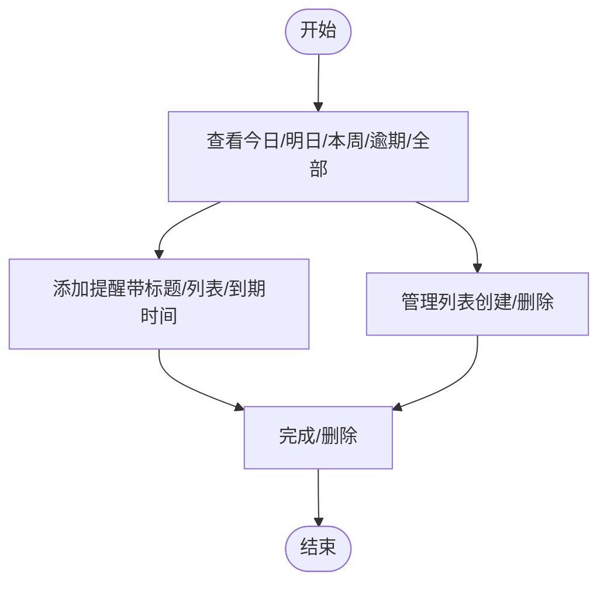

图表来源
- [skills/apple-reminders/SKILL.md](file://skills/apple-reminders/SKILL.md#L56-L119)

章节来源
- [skills/apple-reminders/SKILL.md](file://skills/apple-reminders/SKILL.md#L1-L119)

### GitHub 技能
- 安装与配置
  - 安装 gh CLI 并完成认证；在仓库上下文外使用 --repo owner/repo 指定仓库。
- 常用操作
  - PR：list/checks/view/create/merge。
  - Issue：list/create/close。
  - CI：list/view（含失败日志）/rerun。
  - API：使用 gh api 结合 --jq 进行字段提取与过滤。
- 最佳实践
  - 使用 --json 与 --jq 获取结构化输出；对重复查询使用缓存参数。

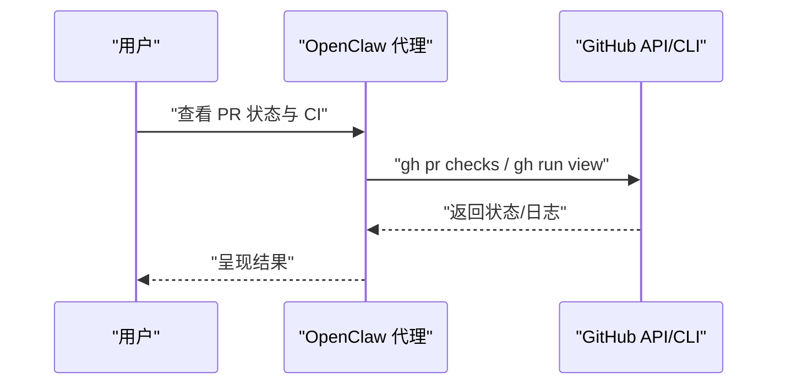

图表来源
- [skills/github/SKILL.md](file://skills/github/SKILL.md#L66-L164)

章节来源
- [skills/github/SKILL.md](file://skills/github/SKILL.md#L1-L164)

### gh-issues 技能
- 角色与流程
  - 作为编排者：抓取 Issue → 预检 → 生成子代理 → 自动修复 → 提交 PR → 监控评审评论并处理。
- 参数与模式
  - 支持 --label/--limit/--milestone/--assignee/--state/--fork/--watch/--interval/--reviews-only/--cron/--dry-run/--model/--notify-channel 等。
  - cron 模式：抓取 Issue 并触发单个子代理，不等待结果；后续轮询仅处理评审评论。
- 预检与并发
  - 预检包括：工作树状态、基分支记录、远程可达性、GH_TOKEN 有效性、已存在 PR/分支、声明跟踪（claim）。
  - 正常模式：最多 8 个子代理并发；cron 模式：逐个按游标推进。
- 子代理任务
  - 严格使用 curl + GitHub REST API，不使用 gh CLI；包含 SETUP、CONFIDENCE CHECK、BRANCH、ANALYZE、IMPLEMENT、TEST、COMMIT、PUSH、PR、REPORT、NOTIFY 等步骤。
- 结果收集与通知
  - 正常模式：汇总成功/失败/超时/跳过；可向 Telegram 通道发送最终摘要。
  - cron-review-only：仅处理评审评论，spawn 单个处理子代理。

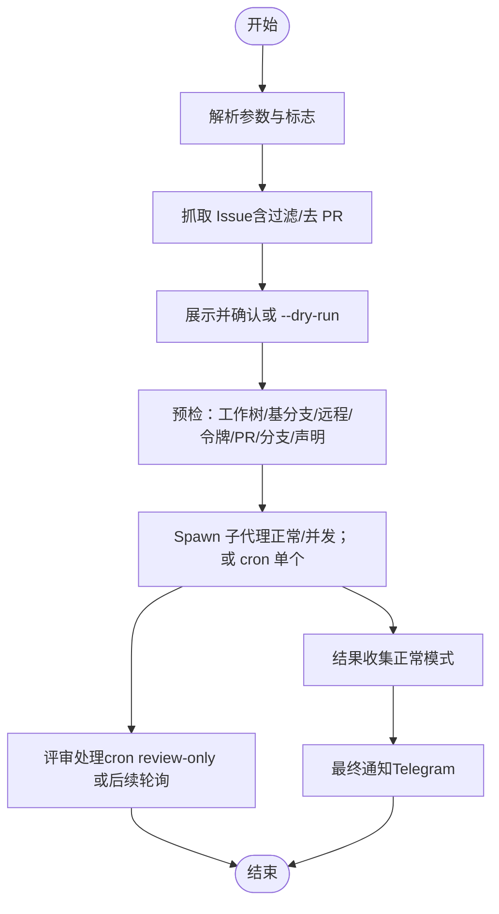

图表来源
- [skills/gh-issues/SKILL.md](file://skills/gh-issues/SKILL.md#L21-L553)

章节来源
- [skills/gh-issues/SKILL.md](file://skills/gh-issues/SKILL.md#L1-L866)

### PDF 处理技能
- 常见任务
  - 合并/拆分、提取文本/表格、旋转、加水印、创建 PDF、OCR、加密/解密、提取图片。
- 工具与库
  - Python：pypdf、pdfplumber、reportlab。
  - 命令行：pdftotext、qpdf、pdftk。
- 最佳实践
  - OCR 前先将扫描版 PDF 转换为图像再识别；注意字体与 Unicode 下标的兼容性。

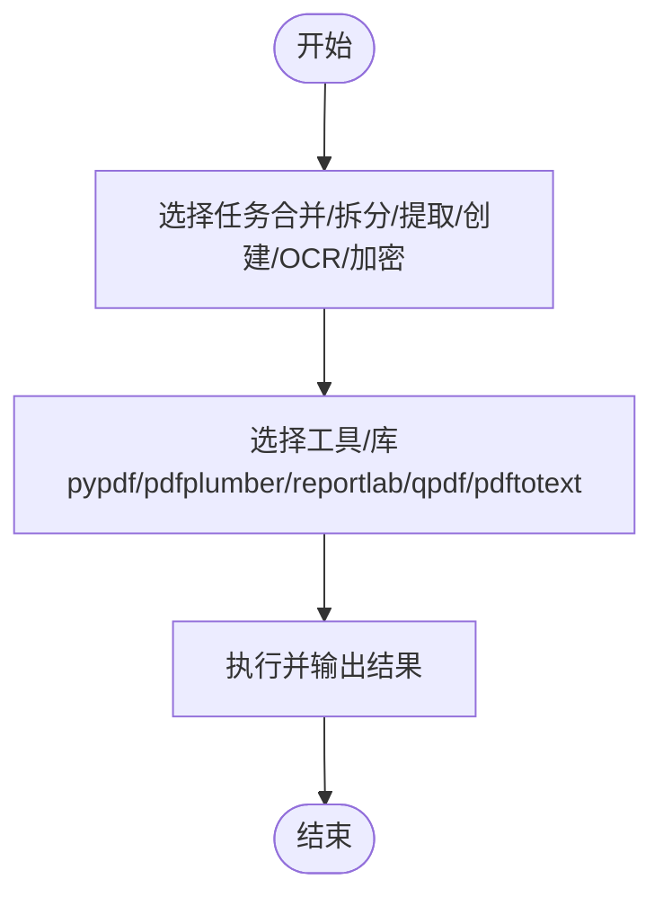

图表来源
- [skills/pdf/SKILL.md](file://skills/pdf/SKILL.md#L13-L315)

章节来源
- [skills/pdf/SKILL.md](file://skills/pdf/SKILL.md#L1-L315)

### Model usage 技能（macOS）
- 功能
  - 通过 codexbar CLI 获取按模型计费的成本 JSON，并进行当前模型或全量模型的汇总。
- 快速开始
  - 默认：codexbar cost --format json --provider <codex|claude>。
  - 文件/标准输入：将 JSON 写入临时文件或通过管道传入脚本。
- 输出
  - 文本或 JSON（--format json --pretty）；值为成本，不拆分 token。

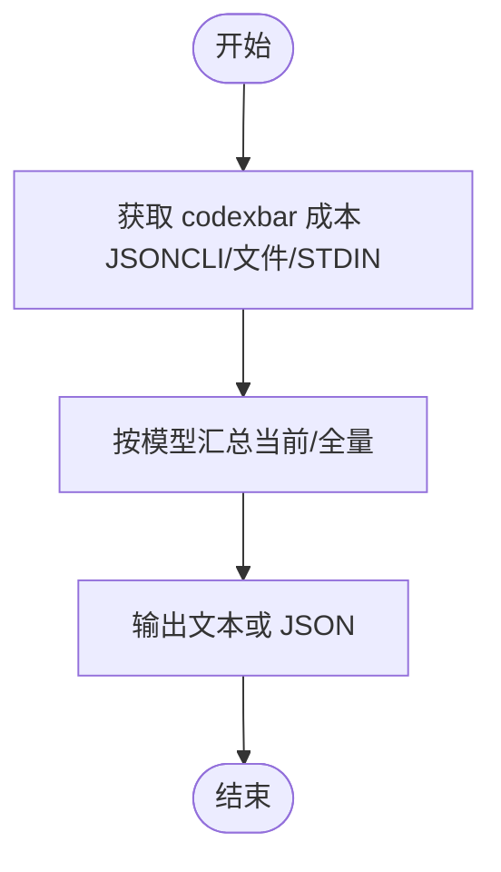

图表来源
- [skills/model-usage/SKILL.md](file://skills/model-usage/SKILL.md#L33-L70)

章节来源
- [skills/model-usage/SKILL.md](file://skills/model-usage/SKILL.md#L1-L70)

## 依赖关系分析
- 技能加载与筛选
  - 通过 metadata.openclaw.requres.bins/env/config 控制技能可用性；支持 primaryEnv 指定主密钥字段。
  - 支持安装器（brew/go/node/download）用于一键安装依赖二进制。
- 环境注入与沙箱
  - 运行时注入 env/apiKey；沙箱模式下需在容器内安装所需二进制并允许网络与写根 FS。
- 配置覆盖
  - 通过 ~/.openclaw/openclaw.json 的 skills.entries.<skillKey> 覆盖启用状态、密钥与自定义配置。

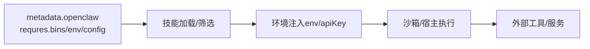

图表来源
- [docs/tools/skills.md](file://docs/tools/skills.md#L106-L187)
- [docs/tools/skills-config.md](file://docs/tools/skills-config.md#L1-L78)

章节来源
- [docs/tools/skills.md](file://docs/tools/skills.md#L106-L187)
- [docs/tools/skills-config.md](file://docs/tools/skills-config.md#L1-L78)

## 性能考虑
- Notion
  - 速率限制约 3 请求/秒；遇到 429 时按 Retry-After 回退；批量追加块时注意 payload 体积与元素数量上限。
- Trello
  - API Key 与 Token 各自速率限制；建议合并请求与合理节流。
- gh-issues
  - 正常模式并发上限 8；cron 模式逐个推进并使用游标文件与声明跟踪避免重复处理。
- PDF
  - OCR 与大文件处理耗时较长，建议异步执行并分批处理。

## 故障排除指南
- 技能不可用
  - 检查二进制是否存在（requires.bins）、环境变量是否就绪（requires.env）、配置项是否满足（requires.config）。
  - 若为沙箱运行，确认容器内已安装所需二进制且具备网络与写根权限。
- 认证失败
  - Notion：确认 API Key 是否正确存储于约定位置并被注入；检查 Integration 是否已分享到目标页面/数据库。
  - Trello：核对 TRELLO_API_KEY 与 TRELLO_TOKEN 的有效期与权限范围。
  - GitHub：核对 GH_TOKEN；若为空，检查配置文件中的密钥注入路径。
  - Apple Reminders/Notes：首次运行需授权访问；macOS 上需授予 Automation 权限。
- 数据库/本地读取失败
  - Things 3：如读取本地数据库失败，授予 Full Disk Access；必要时设置 THINGSDB/THINGS_AUTH_TOKEN。
  - Obsidian：避免硬编码路径，优先使用工具解析默认库。
- 评审处理未响应
  - gh-issues：cron-review-only 模式下仅处理评审评论；确认 GH_TOKEN 可用与 PR 列表匹配。

章节来源
- [docs/tools/skills.md](file://docs/tools/skills.md#L106-L187)
- [skills/notion/SKILL.md](file://skills/notion/SKILL.md#L16-L42)
- [skills/trello/SKILL.md](file://skills/trello/SKILL.md#L78-L83)
- [skills/gh-issues/SKILL.md](file://skills/gh-issues/SKILL.md#L70-L120)
- [skills/things-mac/SKILL.md](file://skills/things-mac/SKILL.md#L30-L36)

## 结论
通过上述技能，OpenClaw 能够将个人与团队的生产力工具串联为统一的工作流：笔记与知识管理（Notion/Obsidian/Apple Notes）、任务与看板（Things/Trello/Reminders）、代码协作（GitHub/gh-issues）与文档处理（PDF）、成本与资源追踪（Model usage）。结合合适的安装配置、权限设置与数据同步策略，可快速搭建从个人到团队的知识与任务管理体系。

## 附录
- 快速开始
  - 通过安装脚本与向导完成基础部署；打开 Control UI 进行首次聊天与技能体验。
- 技能安装与同步
  - 使用 ClawHub 安装/更新/同步技能；技能优先级为工作空间 > 本地管理 > 内置。
- 环境变量与配置
  - 通过 ~/.openclaw/openclaw.json 的 skills.entries.<skillKey> 注入 env/apiKey；沙箱模式下需额外配置容器环境。

章节来源
- [README.md](file://README.md#L28-L82)
- [docs/start/getting-started.md](file://docs/start/getting-started.md#L28-L78)
- [docs/tools/skills.md](file://docs/tools/skills.md#L50-L68)
- [docs/tools/skills-config.md](file://docs/tools/skills-config.md#L13-L39)