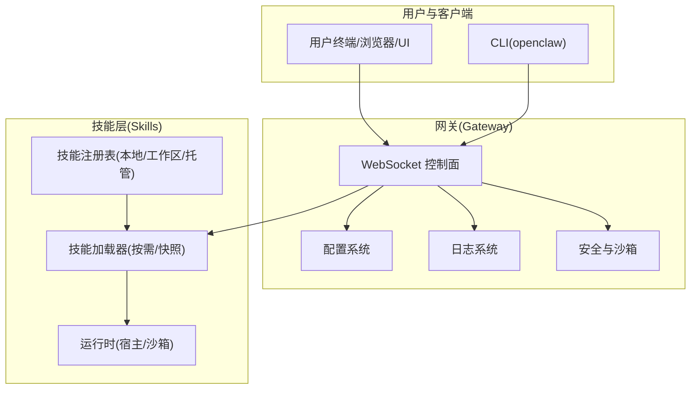
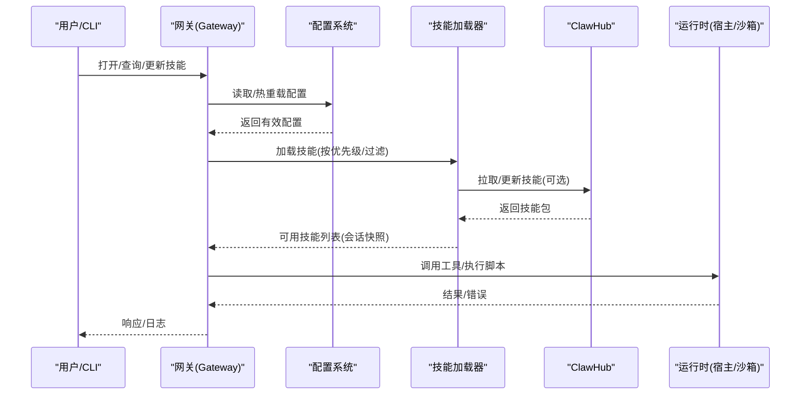
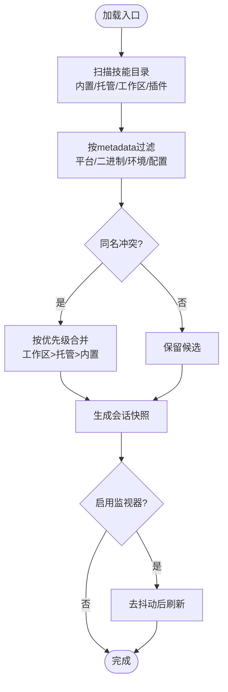
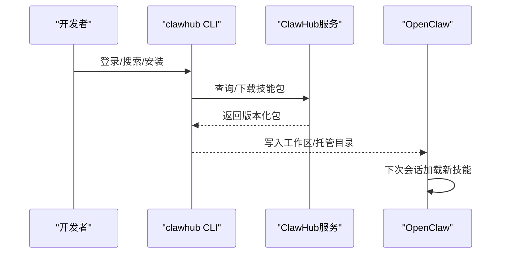
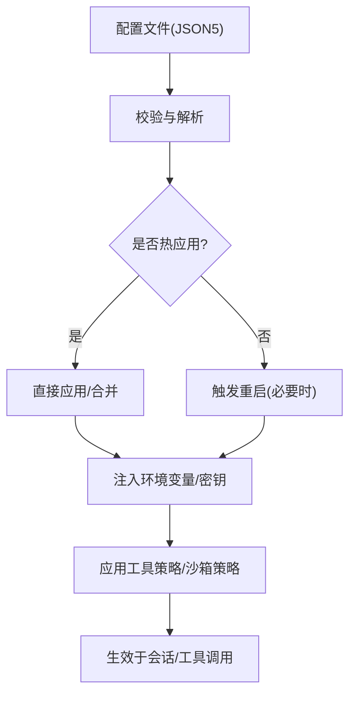
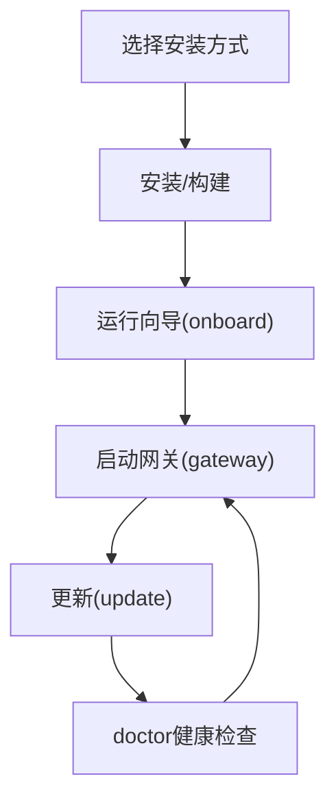
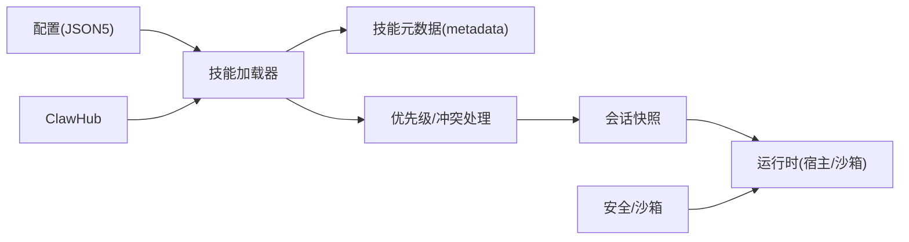

# 技能平台

<cite>
**本文引用的文件**
- [README.md](file://README.md)
- [docs/start/openclaw.md](file://docs/start/openclaw.md)
- [docs/tools/skills.md](file://docs/tools/skills.md)
- [docs/cli/skills.md](file://docs/cli/skills.md)
- [docs/install/index.md](file://docs/install/index.md)
- [docs/tools/skills-config.md](file://docs/tools/skills-config.md)
- [docs/tools/clawhub.md](file://docs/tools/clawhub.md)
- [docs/cli/update.md](file://docs/cli/update.md)
- [docs/cli/doctor.md](file://docs/cli/doctor.md)
- [docs/gateway/configuration.md](file://docs/gateway/configuration.md)
- [docs/gateway/sandboxing.md](file://docs/gateway/sandboxing.md)
- [docs/cli/logs.md](file://docs/cli/logs.md)
- [skills/skill-creator/SKILL.md](file://skills/skill-creator/SKILL.md)
- [extensions/acpx/openclaw.plugin.json](file://extensions/acpx/openclaw.plugin.json)
</cite>

## 目录
1. [简介](#简介)
2. [项目结构](#项目结构)
3. [核心组件](#核心组件)
4. [架构总览](#架构总览)
5. [详细组件分析](#详细组件分析)
6. [依赖分析](#依赖分析)
7. [性能考虑](#性能考虑)
8. [故障排除指南](#故障排除指南)
9. [结论](#结论)
10. [附录](#附录)

## 简介
本文件面向OpenClaw技能平台的使用者与维护者，提供从架构设计到日常运维的完整使用与管理指南。内容覆盖技能平台的安装与版本管理、技能商店（ClawHub）的使用、技能注册与加载机制、配置系统（含环境变量、权限与安全）、状态监控与日志、以及依赖管理、冲突解决与兼容性检查等。

## 项目结构
OpenClaw是一个多平台、多通道的个人AI助手，围绕“网关（Gateway）+ 代理（Agent）+ 工具（Skills）”的体系构建。技能平台作为工具生态的核心，通过统一的技能规范与加载策略，实现能力的模块化扩展与安全执行。

图示来源
- [README.md](file://README.md#L185-L202)
- [docs/tools/skills.md](file://docs/tools/skills.md#L11-L27)

章节来源
- [README.md](file://README.md#L185-L202)
- [docs/tools/skills.md](file://docs/tools/skills.md#L11-L27)

## 核心组件
- 技能注册与加载：支持三类来源（内置、托管、工作区），具备优先级与过滤规则；支持热重载与会话内快照复用。
- 技能商店（ClawHub）：公共技能注册表，提供浏览、搜索、安装、更新、发布与同步能力。
- 配置系统：集中式JSON5配置，支持热重载、分段包含、环境变量注入与密钥引用。
- 安全与沙箱：可选容器化执行，限制文件系统与进程访问，结合工具策略与权限模式。
- 版本管理：支持稳定/测试/开发渠道切换，提供更新与迁移指南。

章节来源
- [docs/tools/skills.md](file://docs/tools/skills.md#L13-L40)
- [docs/tools/clawhub.md](file://docs/tools/clawhub.md#L10-L36)
- [docs/gateway/configuration.md](file://docs/gateway/configuration.md#L10-L24)
- [docs/gateway/sandboxing.md](file://docs/gateway/sandboxing.md#L8-L18)
- [docs/cli/update.md](file://docs/cli/update.md#L9-L28)

## 架构总览
技能平台在“网关控制平面”的统一调度下，通过配置驱动技能加载与执行。技能来源与优先级决定最终可用能力集；ClawHub提供外部能力补充；安全策略确保执行边界可控。

图示来源
- [docs/tools/skills.md](file://docs/tools/skills.md#L106-L147)
- [docs/tools/clawhub.md](file://docs/tools/clawhub.md#L67-L72)
- [docs/gateway/sandboxing.md](file://docs/gateway/sandboxing.md#L19-L38)

章节来源
- [docs/tools/skills.md](file://docs/tools/skills.md#L106-L147)
- [docs/tools/clawhub.md](file://docs/tools/clawhub.md#L67-L72)
- [docs/gateway/sandboxing.md](file://docs/gateway/sandboxing.md#L19-L38)

## 详细组件分析

### 技能注册与加载机制
- 来源与优先级
  - 内置技能（随安装/应用打包）
  - 托管技能（~/.openclaw/skills）
  - 工作区技能（<workspace>/skills）
  - 插件自带技能（启用插件后参与加载）
- 过滤与准入
  - 基于元数据（metadata.openclaw）的运行时过滤，支持平台、二进制、环境变量、配置项要求。
  - 支持always/include白名单、os过滤、安装器定义等。
- 环境注入与会话快照
  - 在单次代理回合中注入环境变量，回合结束后恢复。
  - 会话开始时对可用技能做快照，后续回合复用；支持监视器自动刷新。
- 远程节点与macOS技能
  - 当Linux网关连接macOS节点且允许system.run时，可在满足条件时将macOS专属技能纳入候选。

图示来源
- [docs/tools/skills.md](file://docs/tools/skills.md#L13-L40)
- [docs/tools/skills.md](file://docs/tools/skills.md#L106-L147)
- [docs/tools/skills.md](file://docs/tools/skills.md#L248-L253)

章节来源
- [docs/tools/skills.md](file://docs/tools/skills.md#L13-L40)
- [docs/tools/skills.md](file://docs/tools/skills.md#L106-L147)
- [docs/tools/skills.md](file://docs/tools/skills.md#L248-L253)

### 技能商店（ClawHub）功能与使用
- 功能概览
  - 公共注册表，支持浏览、搜索、下载、报告与审核。
  - 提供CLI工具，支持登录、搜索、安装、更新、发布、同步等。
- 工作流
  - 默认安装到当前工作目录的skills或OpenClaw工作区；下次会话生效。
  - 支持版本管理、标签、变更日志与并发上传。
- 安全与治理
  - 新用户发布门槛；举报与审核机制；Moderator权限与封禁策略。

图示来源
- [docs/tools/clawhub.md](file://docs/tools/clawhub.md#L10-L36)
- [docs/tools/clawhub.md](file://docs/tools/clawhub.md#L67-L72)
- [docs/tools/clawhub.md](file://docs/tools/clawhub.md#L118-L186)

章节来源
- [docs/tools/clawhub.md](file://docs/tools/clawhub.md#L10-L36)
- [docs/tools/clawhub.md](file://docs/tools/clawhub.md#L67-L72)
- [docs/tools/clawhub.md](file://docs/tools/clawhub.md#L118-L186)

### 配置系统（参数、环境变量、权限与安全）
- 配置位置与热重载
  - JSON5配置文件位于~/.openclaw/openclaw.json；支持$include拆分组织；大部分字段热应用，网关服务器相关需重启。
- 环境变量与密钥
  - 支持从父进程、.env、全局.env导入；支持在字符串值中进行环境变量替换；支持SecretRef对象引用。
- 权限与安全
  - 工具策略与沙箱模式共同约束执行范围；可配置工作区挂载只读/读写；支持自定义bind mount与网络策略。
- 多代理路由与会话管理
  - 支持多代理隔离与绑定规则；会话作用域与重置策略可配置。

图示来源
- [docs/gateway/configuration.md](file://docs/gateway/configuration.md#L349-L387)
- [docs/gateway/configuration.md](file://docs/gateway/configuration.md#L449-L538)
- [docs/gateway/sandboxing.md](file://docs/gateway/sandboxing.md#L39-L79)

章节来源
- [docs/gateway/configuration.md](file://docs/gateway/configuration.md#L349-L387)
- [docs/gateway/configuration.md](file://docs/gateway/configuration.md#L449-L538)
- [docs/gateway/sandboxing.md](file://docs/gateway/sandboxing.md#L39-L79)

### 版本管理与安装流程
- 安装方式
  - 推荐安装脚本一键安装Node与OpenClaw并引导向导；也支持npm/pnpm、从源码构建、Docker/Podman/Nix/Ansible/Bun等。
- 更新与通道
  - 支持stable/beta/dev通道切换；提供更新向导与dry-run预览；Git源码分支采用dev/分支与标签策略。
- 升级后的健康检查
  - 使用doctor进行健康检查与修复建议；必要时自动重启网关服务。

图示来源
- [docs/install/index.md](file://docs/install/index.md#L24-L141)
- [docs/cli/update.md](file://docs/cli/update.md#L62-L91)
- [docs/cli/doctor.md](file://docs/cli/doctor.md#L9-L33)

章节来源
- [docs/install/index.md](file://docs/install/index.md#L24-L141)
- [docs/cli/update.md](file://docs/cli/update.md#L62-L91)
- [docs/cli/doctor.md](file://docs/cli/doctor.md#L9-L33)

### 技能状态监控与日志
- 日志查看
  - 通过openclaw logs远程查看网关日志，支持跟随输出、JSON格式、限制行数与时区转换。
- 性能与成本
  - 技能列表注入prompt有确定性字符/令牌开销；可通过减少技能数量与精简描述降低token占用。
- 故障排查
  - doctor提供常见问题诊断与修复建议；针对沙箱、通道、配置错误给出提示。

章节来源
- [docs/cli/logs.md](file://docs/cli/logs.md#L9-L28)
- [docs/tools/skills.md](file://docs/tools/skills.md#L269-L286)
- [docs/cli/doctor.md](file://docs/cli/doctor.md#L9-L33)

### 依赖管理、冲突解决与兼容性
- 依赖声明与安装器
  - 技能元数据可声明二进制依赖、环境变量与配置项要求；支持brew/npm/pnpm/yarn/bun等安装器。
- 冲突与优先级
  - 同名技能按工作区>托管>内置优先级合并；未显式声明元数据时默认可用但受配置开关影响。
- 兼容性检查
  - 平台过滤（darwin/linux/win32）；二进制存在性检查；沙箱内二进制需同时存在于容器镜像。
- 插件与技能联动
  - 插件可声明自带技能目录；启用插件后参与加载与过滤；可通过插件配置进行准入控制。

章节来源
- [docs/tools/skills.md](file://docs/tools/skills.md#L125-L187)
- [extensions/acpx/openclaw.plugin.json](file://extensions/acpx/openclaw.plugin.json#L1-L106)

## 依赖分析
技能平台的耦合关系主要体现在“配置→加载→执行”的链路中：

图示来源
- [docs/tools/skills.md](file://docs/tools/skills.md#L106-L147)
- [docs/gateway/sandboxing.md](file://docs/gateway/sandboxing.md#L19-L38)

章节来源
- [docs/tools/skills.md](file://docs/tools/skills.md#L106-L147)
- [docs/gateway/sandboxing.md](file://docs/gateway/sandboxing.md#L19-L38)

## 性能考虑
- 技能prompt注入成本：技能列表注入prompt具有确定性开销，建议控制技能数量与描述长度。
- 监视器与热重载：启用watch可实现近实时刷新，但需权衡文件系统IO与内存占用。
- 沙箱初始化：首次进入沙箱会触发容器创建与setupCommand执行，注意网络与权限配置以避免阻塞。

章节来源
- [docs/tools/skills.md](file://docs/tools/skills.md#L269-L286)
- [docs/gateway/sandboxing.md](file://docs/gateway/sandboxing.md#L199-L217)

## 故障排除指南
- 常见问题定位
  - doctor：运行健康检查与修复建议，识别配置错误、沙箱不可用、遗留文件等问题。
  - logs：远程查看网关日志，定位异常堆栈与时间线。
- 通道与模型问题
  - 使用doctor检查通道认证与配额；必要时调整模型与失败回退策略。
- 沙箱问题
  - 确认Docker可用与镜像构建；检查网络策略与bind mount安全性；必要时降低workspaceAccess或关闭沙箱进行对比测试。
- 技能缺失
  - 使用openclaw skills list/check查看可用与缺失项；核对metadata过滤条件与安装器；确认ClawHub安装路径与工作区优先级。

章节来源
- [docs/cli/doctor.md](file://docs/cli/doctor.md#L9-L33)
- [docs/cli/logs.md](file://docs/cli/logs.md#L9-L28)
- [docs/gateway/sandboxing.md](file://docs/gateway/sandboxing.md#L185-L231)
- [docs/cli/skills.md](file://docs/cli/skills.md#L9-L26)

## 结论
OpenClaw技能平台通过标准化的技能规范、灵活的加载与过滤机制、完善的配置与安全策略，实现了能力的模块化扩展与可控执行。配合ClawHub的公共生态与版本管理，用户可以快速发现、安装、更新并备份技能；通过doctor与logs等工具，能够高效地进行状态监控与问题诊断。建议在生产环境中启用沙箱、严格工具策略与最小权限原则，并定期使用doctor进行健康巡检。

## 附录
- 快速参考
  - 安装与更新：参见安装与更新文档，推荐使用安装脚本并遵循通道策略。
  - 技能管理：使用openclaw skills命令查看可用与缺失项；通过ClawHub进行安装/更新/同步。
  - 配置与环境：通过openclaw config与Control UI编辑配置；合理使用环境变量与SecretRef。
  - 安全与合规：启用沙箱、限制bind mount与网络、最小权限原则；定期审查工具策略与权限模式。

章节来源
- [docs/install/index.md](file://docs/install/index.md#L24-L141)
- [docs/cli/skills.md](file://docs/cli/skills.md#L9-L26)
- [docs/tools/clawhub.md](file://docs/tools/clawhub.md#L118-L186)
- [docs/gateway/configuration.md](file://docs/gateway/configuration.md#L449-L538)
- [docs/gateway/sandboxing.md](file://docs/gateway/sandboxing.md#L185-L231)