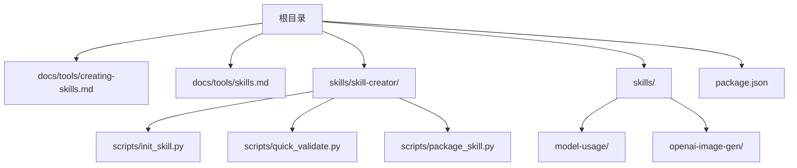
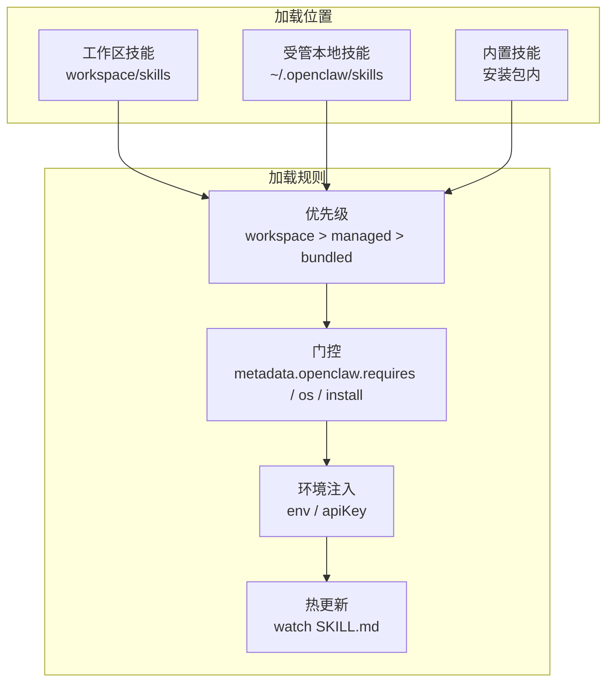
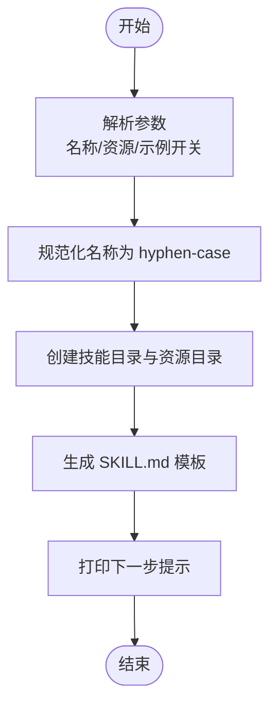
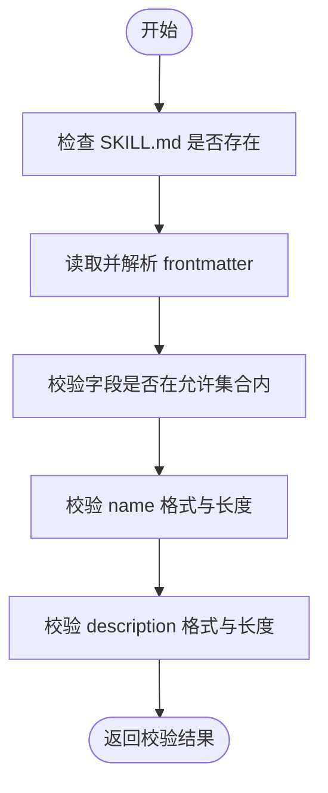
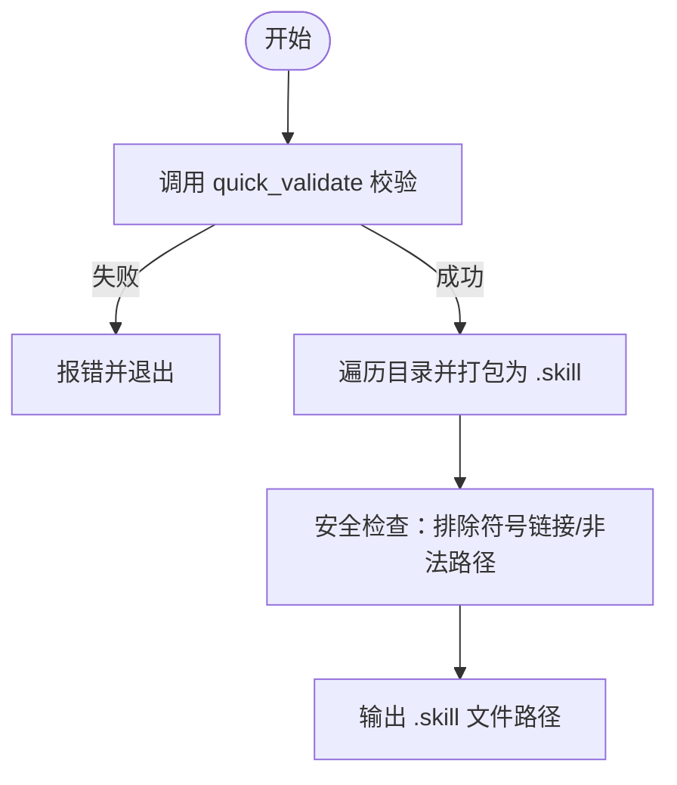
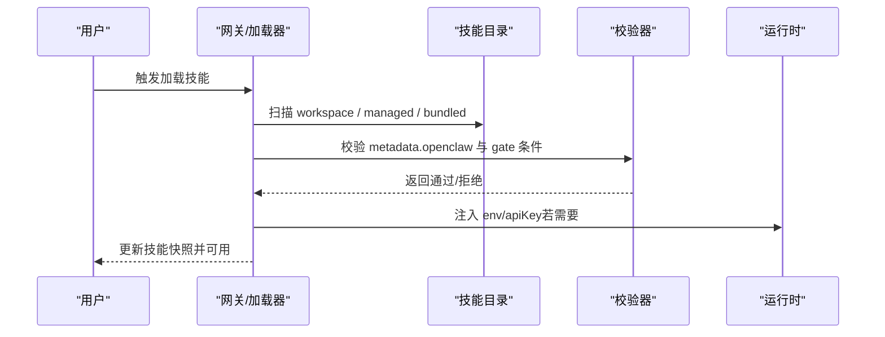
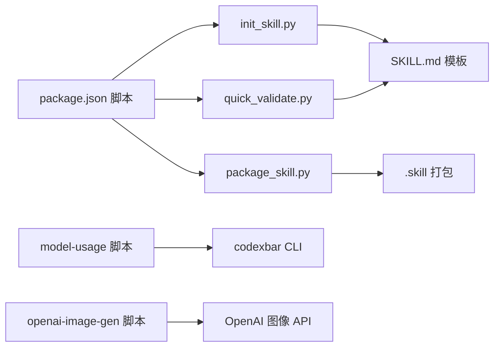

# 技能开发

<cite>
**本文引用的文件**
- [README.md](file://README.md)
- [CONTRIBUTING.md](file://CONTRIBUTING.md)
- [package.json](file://package.json)
- [docs/tools/creating-skills.md](file://docs/tools/creating-skills.md)
- [docs/tools/skills.md](file://docs/tools/skills.md)
- [skills/skill-creator/SKILL.md](file://skills/skill-creator/SKILL.md)
- [skills/skill-creator/scripts/init_skill.py](file://skills/skill-creator/scripts/init_skill.py)
- [skills/skill-creator/scripts/package_skill.py](file://skills/skill-creator/scripts/package_skill.py)
- [skills/skill-creator/scripts/quick_validate.py](file://skills/skill-creator/scripts/quick_validate.py)
- [skills/model-usage/scripts/model_usage.py](file://skills/model-usage/scripts/model_usage.py)
- [skills/openai-image-gen/scripts/gen.py](file://skills/openai-image-gen/scripts/gen.py)
</cite>

## 目录
1. [简介](#简介)
2. [项目结构](#项目结构)
3. [核心组件](#核心组件)
4. [架构总览](#架构总览)
5. [详细组件分析](#详细组件分析)
6. [依赖关系分析](#依赖关系分析)
7. [性能考虑](#性能考虑)
8. [故障排查指南](#故障排查指南)
9. [结论](#结论)
10. [附录](#附录)

## 简介
本指南面向在 OpenClaw 平台上开发“技能（Skill）”的开发者，覆盖从项目初始化、目录与文件组织规范、核心组件职责、最佳实践、测试方法，到打包与发布的完整流程。OpenClaw 的技能采用“AgentSkills 兼容”的目录结构，以 SKILL.md 作为元数据与使用说明的载体，并可选地包含 scripts/、references/、assets/ 等资源目录。

## 项目结构
OpenClaw 仓库中与技能开发直接相关的关键位置如下：
- 根级文档与贡献指南：用于了解整体目标、运行环境与贡献流程
- 技能模板与工具：skills/skill-creator 提供初始化、校验与打包脚本
- 示例技能：skills/ 下包含大量真实技能示例，可参考其结构与实现
- 工具链与构建脚本：package.json 中定义了构建、测试、格式化等脚本

图表来源
- [docs/tools/creating-skills.md](file://docs/tools/creating-skills.md#L1-L59)
- [docs/tools/skills.md](file://docs/tools/skills.md#L1-L303)
- [skills/skill-creator/scripts/init_skill.py](file://skills/skill-creator/scripts/init_skill.py#L1-L379)
- [skills/skill-creator/scripts/quick_validate.py](file://skills/skill-creator/scripts/quick_validate.py#L1-L160)
- [skills/skill-creator/scripts/package_skill.py](file://skills/skill-creator/scripts/package_skill.py#L1-L140)
- [skills/model-usage/scripts/model_usage.py](file://skills/model-usage/scripts/model_usage.py#L1-L321)
- [skills/openai-image-gen/scripts/gen.py](file://skills/openai-image-gen/scripts/gen.py#L1-L329)
- [package.json](file://package.json#L1-L458)

章节来源
- [README.md](file://README.md#L1-L560)
- [CONTRIBUTING.md](file://CONTRIBUTING.md#L1-L187)
- [package.json](file://package.json#L1-L458)

## 核心组件
- SKILL.md：技能的元数据与使用说明，遵循 YAML frontmatter 与 Markdown 正文的结构；frontmatter 必须包含 name 与 description，其他字段按需使用
- 资源目录（可选）
  - scripts/：可执行脚本（如 Python/Bash），用于自动化、数据处理或调用外部工具
  - references/：参考文档，按需加载到上下文中
  - assets/：输出使用的资源文件（模板、图标、字体等），不直接加载到上下文
- 初始化与打包工具：由 skill-creator 提供，帮助快速生成模板、进行基础校验与打包为 .skill 文件
- 示例技能：通过 model-usage 与 openai-image-gen 等示例，展示如何编写脚本、处理参数、调用外部 API 与生成输出

章节来源
- [docs/tools/skills.md](file://docs/tools/skills.md#L78-L187)
- [skills/skill-creator/SKILL.md](file://skills/skill-creator/SKILL.md#L46-L126)
- [skills/skill-creator/scripts/init_skill.py](file://skills/skill-creator/scripts/init_skill.py#L23-L108)
- [skills/skill-creator/scripts/package_skill.py](file://skills/skill-creator/scripts/package_skill.py#L28-L112)
- [skills/model-usage/scripts/model_usage.py](file://skills/model-usage/scripts/model_usage.py#L1-L321)
- [skills/openai-image-gen/scripts/gen.py](file://skills/openai-image-gen/scripts/gen.py#L1-L329)

## 架构总览
技能在 OpenClaw 中的生命周期与加载规则如下：
- 加载顺序与优先级：工作区技能（workspace） > 受管本地技能（managed/local） > 内置技能（bundled）
- 过滤与门控：通过 metadata.openclaw 中的 requires、os、install 等字段在加载时进行条件过滤
- 环境注入：根据配置向进程注入 env 与 apiKey
- 热更新：默认监视 SKILL.md 变更并热刷新技能快照

图表来源
- [docs/tools/skills.md](file://docs/tools/skills.md#L13-L187)
- [docs/tools/skills.md](file://docs/tools/skills.md#L254-L267)

章节来源
- [docs/tools/skills.md](file://docs/tools/skills.md#L13-L187)

## 详细组件分析

### 组件一：技能目录与文件组织规范
- 必需文件
  - SKILL.md：包含 YAML frontmatter（name、description 必填），正文为使用说明与工作流
- 推荐文件
  - scripts/：存放可执行脚本，便于重复使用与确定性执行
  - references/：存放参考文档，按需加载，避免 SKILL.md 过长
  - assets/：存放输出资源，不直接加载到上下文
- 命名与结构建议
  - 使用小写、数字与短横线组合的名称，避免多余文档文件（如 README、INSTALLATION_GUIDE 等）

章节来源
- [docs/tools/skills.md](file://docs/tools/skills.md#L78-L106)
- [skills/skill-creator/SKILL.md](file://skills/skill-creator/SKILL.md#L46-L126)

### 组件二：初始化与模板生成（init_skill.py）
- 功能要点
  - 将输入名称规范化为 hyphen-case
  - 生成包含 frontmatter 与 TODO 指引的 SKILL.md 模板
  - 可选创建 scripts/、references/、assets/ 目录及示例文件
  - 输出下一步操作提示
- 使用场景
  - 新建技能时快速搭建骨架
  - 需要示例文件时一键生成

图表来源
- [skills/skill-creator/scripts/init_skill.py](file://skills/skill-creator/scripts/init_skill.py#L255-L317)

章节来源
- [skills/skill-creator/scripts/init_skill.py](file://skills/skill-creator/scripts/init_skill.py#L1-L379)

### 组件三：基础校验（quick_validate.py）
- 校验内容
  - SKILL.md 存在性
  - frontmatter 格式与字段合法性（name、description、metadata 等）
  - 名称与描述的字符集、长度与格式约束
- 用途
  - 在提交/打包前进行轻量级自检，确保基本合规

图表来源
- [skills/skill-creator/scripts/quick_validate.py](file://skills/skill-creator/scripts/quick_validate.py#L67-L149)

章节来源
- [skills/skill-creator/scripts/quick_validate.py](file://skills/skill-creator/scripts/quick_validate.py#L1-L160)

### 组件四：打包与分发（package_skill.py）
- 功能要点
  - 对技能目录进行验证（前置依赖 quick_validate）
  - 打包为 .skill 文件（zip 格式），排除敏感路径与符号链接
  - 输出打包结果路径
- 安全注意
  - 拒绝打包符号链接，防止路径逃逸

图表来源
- [skills/skill-creator/scripts/package_skill.py](file://skills/skill-creator/scripts/package_skill.py#L28-L112)

章节来源
- [skills/skill-creator/scripts/package_skill.py](file://skills/skill-creator/scripts/package_skill.py#L1-L140)

### 组件五：示例脚本与最佳实践
- model-usage：演示如何调用外部 CLI（codexbar）并聚合模型成本数据，适合学习参数解析、外部命令调用与 JSON 处理
- openai-image-gen：演示如何封装外部 API 请求、参数标准化、输出目录与产物清单生成，适合学习脚本化工具的健壮性设计

章节来源
- [skills/model-usage/scripts/model_usage.py](file://skills/model-usage/scripts/model_usage.py#L1-L321)
- [skills/openai-image-gen/scripts/gen.py](file://skills/openai-image-gen/scripts/gen.py#L1-L329)

### 组件六：技能加载与门控（概念流程）
- 门控字段（metadata.openclaw）
  - requires.bins/anyBins：PATH 中必须存在的二进制
  - requires.env：环境变量存在或可在配置中提供
  - requires.config：openclaw.json 中某路径为真值
  - os：平台过滤
  - install：安装器规格（brew/npm/go/download 等）
- 环境注入
  - 在一次会话运行期间注入 env 与 apiKey，结束后恢复原环境
- 热更新
  - 监视 SKILL.md 变更，触发技能快照刷新

图表来源
- [docs/tools/skills.md](file://docs/tools/skills.md#L106-L187)
- [docs/tools/skills.md](file://docs/tools/skills.md#L230-L247)

章节来源
- [docs/tools/skills.md](file://docs/tools/skills.md#L106-L187)

## 依赖关系分析
- 技能开发工具链
  - init_skill.py、quick_validate.py、package_skill.py 位于 skills/skill-creator/scripts，分别负责初始化、校验与打包
  - package.json 中定义了构建、测试、格式化与发布相关的脚本，可配合技能开发流程使用
- 示例技能对工具链的依赖
  - model-usage 依赖 codexbar CLI
  - openai-image-gen 依赖 OpenAI 图像接口与网络访问能力

图表来源
- [skills/skill-creator/scripts/init_skill.py](file://skills/skill-creator/scripts/init_skill.py#L255-L317)
- [skills/skill-creator/scripts/quick_validate.py](file://skills/skill-creator/scripts/quick_validate.py#L67-L149)
- [skills/skill-creator/scripts/package_skill.py](file://skills/skill-creator/scripts/package_skill.py#L28-L112)
- [package.json](file://package.json#L217-L334)
- [skills/model-usage/scripts/model_usage.py](file://skills/model-usage/scripts/model_usage.py#L34-L48)
- [skills/openai-image-gen/scripts/gen.py](file://skills/openai-image-gen/scripts/gen.py#L157-L207)

章节来源
- [package.json](file://package.json#L217-L334)

## 性能考虑
- 上下文窗口与 token 成本
  - 技能列表会被注入到系统提示词中，存在固定与按技能线性增长的成本；应保持 SKILL.md 精炼，将细节放入 references/ 并按需加载
- 技能快照复用
  - 会话启动时快照技能列表，同一会话后续轮次复用；变更生效于新会话或热更新
- 脚本执行效率
  - 将重复逻辑放入 scripts/，减少上下文加载与模型推理负担
- 外部调用优化
  - 合理设置超时、重试与缓存策略，避免阻塞主线程

章节来源
- [docs/tools/skills.md](file://docs/tools/skills.md#L269-L286)

## 故障排查指南
- 常见问题
  - SKILL.md 缺失或格式错误：使用 quick_validate.py 进行基础校验
  - 名称不符合规范（大小写、连字符、长度）：参考 init_skill.py 的规范化逻辑
  - 打包失败（符号链接/路径逃逸）：确认未包含符号链接，且输出目录不在技能根内
  - 外部工具不可用：检查 PATH 与环境变量，必要时通过 metadata.openclaw.install 指定安装器
- 测试与验证
  - 使用 openclaw agent 或 CLI 进行本地测试
  - 参考示例技能的脚本实现，学习参数解析、错误处理与输出组织

章节来源
- [skills/skill-creator/scripts/quick_validate.py](file://skills/skill-creator/scripts/quick_validate.py#L67-L149)
- [skills/skill-creator/scripts/package_skill.py](file://skills/skill-creator/scripts/package_skill.py#L75-L112)
- [docs/tools/skills.md](file://docs/tools/skills.md#L106-L187)

## 结论
通过统一的目录结构与工具链，OpenClaw 使技能开发具备高一致性与可维护性。建议遵循“精简 SKILL.md + 详尽 references/ + 可执行 scripts/”的设计原则，结合 init_skill.py、quick_validate.py 与 package_skill.py 完成从创建到分发的全流程，同时关注性能与安全，确保技能在多平台与多会话场景下的稳定运行。

## 附录
- 快速起步
  - 创建技能目录并在其中编写 SKILL.md
  - 如需脚本与参考材料，按需创建 scripts/、references/、assets/
  - 使用 init_skill.py 生成模板与示例文件
  - 使用 quick_validate.py 进行基础校验
  - 使用 package_skill.py 打包为 .skill 文件
- 参考文档
  - 技能创建与最佳实践：docs/tools/creating-skills.md
  - 技能加载与门控：docs/tools/skills.md
  - 示例技能：skills/model-usage、skills/openai-image-gen

章节来源
- [docs/tools/creating-skills.md](file://docs/tools/creating-skills.md#L1-L59)
- [docs/tools/skills.md](file://docs/tools/skills.md#L1-L303)
- [skills/model-usage/scripts/model_usage.py](file://skills/model-usage/scripts/model_usage.py#L1-L321)
- [skills/openai-image-gen/scripts/gen.py](file://skills/openai-image-gen/scripts/gen.py#L1-L329)