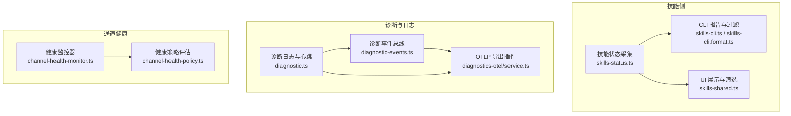
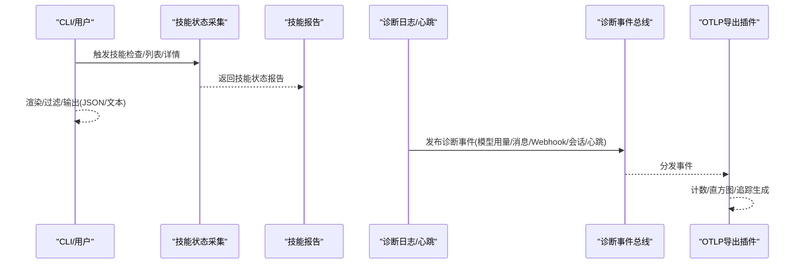
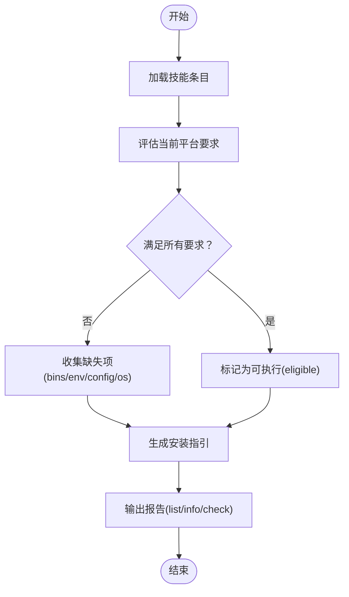
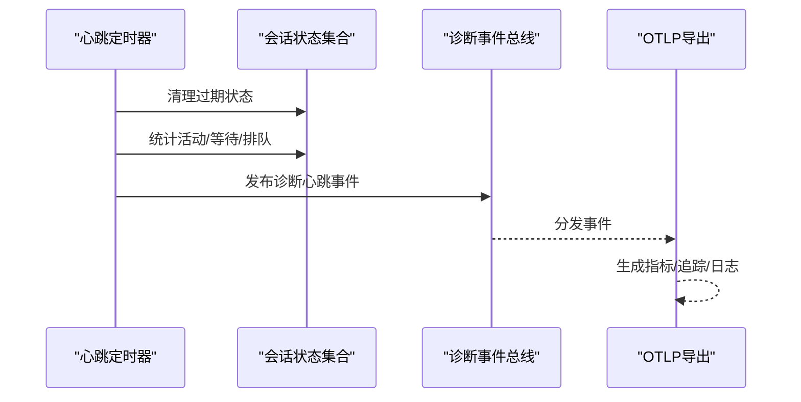
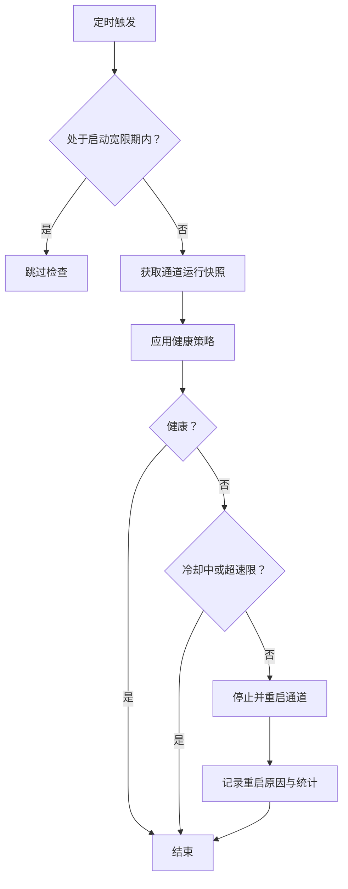
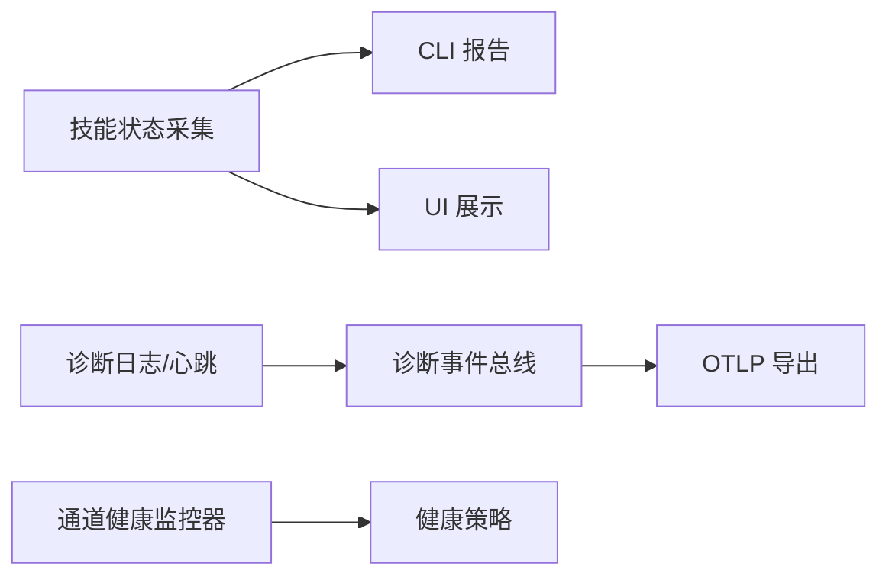

# 技能监控

<cite>
**本文引用的文件**
- [src/gateway/channel-health-monitor.ts](file://src/gateway/channel-health-monitor.ts)
- [src/gateway/channel-health-policy.ts](file://src/gateway/channel-health-policy.ts)
- [src/agents/skills-status.ts](file://src/agents/skills-status.ts)
- [src/cli/skills-cli.ts](file://src/cli/skills-cli.ts)
- [src/cli/skills-cli.format.ts](file://src/cli/skills-cli.format.ts)
- [ui/src/ui/views/skills-shared.ts](file://ui/src/ui/views/skills-shared.ts)
- [src/logging/diagnostic.ts](file://src/logging/diagnostic.ts)
- [src/infra/diagnostic-events.ts](file://src/infra/diagnostic-events.ts)
- [extensions/diagnostics-otel/src/service.ts](file://extensions/diagnostics-otel/src/service.ts)
- [docs/logging.md](file://docs/logging.md)
- [docs/tools/skills.md](file://docs/tools/skills.md)
- [docs/cli/skills.md](file://docs/cli/skills.md)
</cite>

## 目录
1. [简介](#简介)
2. [项目结构](#项目结构)
3. [核心组件](#核心组件)
4. [架构总览](#架构总览)
5. [详细组件分析](#详细组件分析)
6. [依赖关系分析](#依赖关系分析)
7. [性能考量](#性能考量)
8. [故障排除指南](#故障排除指南)
9. [结论](#结论)
10. [附录](#附录)

## 简介
本文件面向OpenClaw技能监控与诊断场景，聚焦以下目标：
- 技能状态监控：运行状态、可执行性、缺失依赖、安装指引
- 日志与诊断：日志级别、输出格式、过滤规则、诊断事件
- 性能分析：执行时延、队列深度、会话卡滞、并发控制
- 故障排除：常见问题定位与解决路径
- 健康检查：自动化周期检查、重启策略、告警与恢复
- 最佳实践：运维建议与配置要点

## 项目结构
围绕“技能监控”，OpenClaw在以下模块形成闭环：
- 技能状态采集与展示：CLI与UI读取技能状态报告，评估可执行性与缺失项
- 诊断事件与心跳：运行期产生结构化诊断事件，定时心跳汇总关键指标
- 导出插件：将诊断事件转为OTLP指标/追踪/日志，接入外部可观测平台
- 通道健康监控：对消息通道进行周期性健康检查与自动重启

图表来源
- [src/agents/skills-status.ts](file://src/agents/skills-status.ts#L227-L253)
- [src/cli/skills-cli.ts](file://src/cli/skills-cli.ts#L40-L81)
- [src/cli/skills-cli.format.ts](file://src/cli/skills-cli.format.ts#L272-L301)
- [ui/src/ui/views/skills-shared.ts](file://ui/src/ui/views/skills-shared.ts#L1-L52)
- [src/infra/diagnostic-events.ts](file://src/infra/diagnostic-events.ts#L150-L242)
- [src/logging/diagnostic.ts](file://src/logging/diagnostic.ts#L333-L410)
- [extensions/diagnostics-otel/src/service.ts](file://extensions/diagnostics-otel/src/service.ts#L72-L686)
- [src/gateway/channel-health-policy.ts](file://src/gateway/channel-health-policy.ts#L57-L132)
- [src/gateway/channel-health-monitor.ts](file://src/gateway/channel-health-monitor.ts#L76-L200)

章节来源
- [src/agents/skills-status.ts](file://src/agents/skills-status.ts#L1-L254)
- [src/cli/skills-cli.ts](file://src/cli/skills-cli.ts#L1-L82)
- [src/cli/skills-cli.format.ts](file://src/cli/skills-cli.format.ts#L272-L301)
- [ui/src/ui/views/skills-shared.ts](file://ui/src/ui/views/skills-shared.ts#L1-L52)
- [src/infra/diagnostic-events.ts](file://src/infra/diagnostic-events.ts#L1-L243)
- [src/logging/diagnostic.ts](file://src/logging/diagnostic.ts#L1-L434)
- [extensions/diagnostics-otel/src/service.ts](file://extensions/diagnostics-otel/src/service.ts#L1-L686)
- [src/gateway/channel-health-policy.ts](file://src/gateway/channel-health-policy.ts#L1-L149)
- [src/gateway/channel-health-monitor.ts](file://src/gateway/channel-health-monitor.ts#L1-L201)

## 核心组件
- 技能状态采集与报告
  - 通过构建工作区技能状态报告，计算每个技能的可执行性、缺失要求、允许列表阻断、禁用状态等
  - CLI提供list/info/check三类输出；UI用于可视化展示与交互
- 诊断事件与心跳
  - 运行期产生结构化事件（模型用量、Webhook入出、消息队列、会话状态、卡滞、尝试次数、心跳）
  - 定时心跳汇总Webhook收发/错误计数、等待/活动会话数、队列总数，并触发卡滞检测
- OTLP导出插件
  - 将诊断事件映射为指标（计数器/直方图）与追踪（Span），并可选导出主日志为OTLP
- 通道健康监控
  - 周期扫描通道运行快照，依据策略判定健康状况并按冷却与速率限制自动重启

章节来源
- [src/agents/skills-status.ts](file://src/agents/skills-status.ts#L169-L225)
- [src/cli/skills-cli.ts](file://src/cli/skills-cli.ts#L40-L81)
- [src/cli/skills-cli.format.ts](file://src/cli/skills-cli.format.ts#L272-L301)
- [ui/src/ui/views/skills-shared.ts](file://ui/src/ui/views/skills-shared.ts#L1-L52)
- [src/infra/diagnostic-events.ts](file://src/infra/diagnostic-events.ts#L150-L242)
- [src/logging/diagnostic.ts](file://src/logging/diagnostic.ts#L333-L410)
- [extensions/diagnostics-otel/src/service.ts](file://extensions/diagnostics-otel/src/service.ts#L170-L686)
- [src/gateway/channel-health-policy.ts](file://src/gateway/channel-health-policy.ts#L57-L132)
- [src/gateway/channel-health-monitor.ts](file://src/gateway/channel-health-monitor.ts#L76-L200)

## 架构总览
下图展示从技能状态到诊断事件、再到OTLP导出的整体链路，以及通道健康监控的自愈流程。

图表来源
- [src/cli/skills-cli.ts](file://src/cli/skills-cli.ts#L40-L81)
- [src/agents/skills-status.ts](file://src/agents/skills-status.ts#L227-L253)
- [src/logging/diagnostic.ts](file://src/logging/diagnostic.ts#L333-L410)
- [src/infra/diagnostic-events.ts](file://src/infra/diagnostic-events.ts#L195-L227)
- [extensions/diagnostics-otel/src/service.ts](file://extensions/diagnostics-otel/src/service.ts#L619-L664)

章节来源
- [src/cli/skills-cli.ts](file://src/cli/skills-cli.ts#L1-L82)
- [src/agents/skills-status.ts](file://src/agents/skills-status.ts#L1-L254)
- [src/logging/diagnostic.ts](file://src/logging/diagnostic.ts#L1-L434)
- [src/infra/diagnostic-events.ts](file://src/infra/diagnostic-events.ts#L1-L243)
- [extensions/diagnostics-otel/src/service.ts](file://extensions/diagnostics-otel/src/service.ts#L1-L686)

## 详细组件分析

### 组件A：技能状态监控与报告
- 能力概述
  - 采集技能元数据、环境变量、配置路径、二进制依赖、操作系统限制
  - 计算每个技能是否“可执行”（eligible），并列出缺失项（二进制/环境/配置/OS）
  - 提供安装指引（brew/node/go/uv/download）
- 输出形态
  - CLI list/info/check三种模式，支持JSON输出
  - UI以卡片形式展示技能状态、缺失项与原因
- 关键指标
  - 可执行技能数、被允许列表阻断数、禁用数、缺失依赖数
  - 缺失项分类：二进制、环境变量、配置路径、操作系统

图表来源
- [src/agents/skills-status.ts](file://src/agents/skills-status.ts#L169-L225)
- [src/cli/skills-cli.format.ts](file://src/cli/skills-cli.format.ts#L272-L301)
- [ui/src/ui/views/skills-shared.ts](file://ui/src/ui/views/skills-shared.ts#L1-L52)

章节来源
- [src/agents/skills-status.ts](file://src/agents/skills-status.ts#L1-L254)
- [src/cli/skills-cli.ts](file://src/cli/skills-cli.ts#L1-L82)
- [src/cli/skills-cli.format.ts](file://src/cli/skills-cli.format.ts#L272-L301)
- [ui/src/ui/views/skills-shared.ts](file://ui/src/ui/views/skills-shared.ts#L1-L52)
- [docs/tools/skills.md](file://docs/tools/skills.md#L1-L303)
- [docs/cli/skills.md](file://docs/cli/skills.md#L1-L27)

### 组件B：诊断事件与心跳（日志与指标）
- 事件类型
  - 模型用量：token计数、成本、上下文大小、时延
  - Webhook：接收/处理/错误、时延
  - 消息：入队/出队、处理结果（完成/跳过/错误）、时延
  - 队列：车道入队/出队、等待时延、队列深度
  - 会话：状态切换、卡滞告警、尝试次数
  - 心跳：聚合Webhook/队列/会话状态
- 心跳逻辑
  - 定时清理过期会话状态
  - 统计活动/等待/排队总量
  - 对长时间无活动且无排队的会话发出卡滞告警
- OTLP导出
  - 指标：计数器/直方图
  - 追踪：Span（模型用量、Webhook/消息处理、会话卡滞）
  - 日志：可选OTLP导出主日志

图表来源
- [src/logging/diagnostic.ts](file://src/logging/diagnostic.ts#L333-L410)
- [src/infra/diagnostic-events.ts](file://src/infra/diagnostic-events.ts#L150-L242)
- [extensions/diagnostics-otel/src/service.ts](file://extensions/diagnostics-otel/src/service.ts#L619-L664)

章节来源
- [src/logging/diagnostic.ts](file://src/logging/diagnostic.ts#L1-L434)
- [src/infra/diagnostic-events.ts](file://src/infra/diagnostic-events.ts#L1-L243)
- [extensions/diagnostics-otel/src/service.ts](file://extensions/diagnostics-otel/src/service.ts#L1-L686)
- [docs/logging.md](file://docs/logging.md#L142-L353)

### 组件C：通道健康监控与自动恢复
- 周期检查
  - 启动宽限期、连接宽限期、事件过期阈值
  - 冷却周期与每小时最大重启次数
- 健康评估
  - 未托管账户、未运行、忙碌态、启动期、断连、静默套接字（半死连接）
- 自动重启
  - 按冷却与速率限制执行重启
  - 记录重启原因（静默套接字、停止/放弃、断连、卡滞）

图表来源
- [src/gateway/channel-health-monitor.ts](file://src/gateway/channel-health-monitor.ts#L76-L200)
- [src/gateway/channel-health-policy.ts](file://src/gateway/channel-health-policy.ts#L57-L132)

章节来源
- [src/gateway/channel-health-monitor.ts](file://src/gateway/channel-health-monitor.ts#L1-L201)
- [src/gateway/channel-health-policy.ts](file://src/gateway/channel-health-policy.ts#L1-L149)

## 依赖关系分析
- 技能侧
  - 技能状态采集依赖平台探测（二进制、环境、配置、允许列表）
  - CLI与UI依赖报告结构进行渲染与交互
- 诊断侧
  - 诊断日志与心跳依赖全局事件总线分发
  - OTLP导出插件订阅事件并映射为指标/追踪/日志
- 通道健康
  - 健康监控器依赖通道管理器快照与策略评估

图表来源
- [src/agents/skills-status.ts](file://src/agents/skills-status.ts#L227-L253)
- [src/cli/skills-cli.ts](file://src/cli/skills-cli.ts#L40-L81)
- [ui/src/ui/views/skills-shared.ts](file://ui/src/ui/views/skills-shared.ts#L1-L52)
- [src/logging/diagnostic.ts](file://src/logging/diagnostic.ts#L333-L410)
- [src/infra/diagnostic-events.ts](file://src/infra/diagnostic-events.ts#L195-L227)
- [extensions/diagnostics-otel/src/service.ts](file://extensions/diagnostics-otel/src/service.ts#L619-L664)
- [src/gateway/channel-health-monitor.ts](file://src/gateway/channel-health-monitor.ts#L76-L200)
- [src/gateway/channel-health-policy.ts](file://src/gateway/channel-health-policy.ts#L57-L132)

章节来源
- [src/agents/skills-status.ts](file://src/agents/skills-status.ts#L1-L254)
- [src/cli/skills-cli.ts](file://src/cli/skills-cli.ts#L1-L82)
- [ui/src/ui/views/skills-shared.ts](file://ui/src/ui/views/skills-shared.ts#L1-L52)
- [src/logging/diagnostic.ts](file://src/logging/diagnostic.ts#L1-L434)
- [src/infra/diagnostic-events.ts](file://src/infra/diagnostic-events.ts#L1-L243)
- [extensions/diagnostics-otel/src/service.ts](file://extensions/diagnostics-otel/src/service.ts#L1-L686)
- [src/gateway/channel-health-monitor.ts](file://src/gateway/channel-health-monitor.ts#L1-L201)
- [src/gateway/channel-health-policy.ts](file://src/gateway/channel-health-policy.ts#L1-L149)

## 性能考量
- 执行时间统计
  - 模型用量、Webhook/消息处理均提供时延直方图，便于识别慢调用
- 内存与并发
  - 会话状态集合按需清理，避免长期驻留；队列深度/等待时延直方图帮助发现背压
- 采样与导出
  - 支持追踪采样率与指标刷新间隔，平衡可观测性与开销
- 通道健康
  - 通过冷却与速率限制防止风暴式重启，保护上游服务

章节来源
- [extensions/diagnostics-otel/src/service.ts](file://extensions/diagnostics-otel/src/service.ts#L170-L242)
- [src/logging/diagnostic.ts](file://src/logging/diagnostic.ts#L333-L410)
- [src/gateway/channel-health-monitor.ts](file://src/gateway/channel-health-monitor.ts#L76-L200)

## 故障排除指南
- 技能相关
  - 使用CLI检查技能可执行性与缺失项，结合UI查看原因与安装指引
  - 若被允许列表阻断，调整配置或移除阻断项
- 日志与诊断
  - 使用CLI实时跟踪日志，选择TTY/JSON/Plain样式；必要时提升日志级别
  - 启用诊断标志位进行定向调试，不改变文件日志级别
  - 开启OTLP导出后，结合外部可观测平台检索模型用量、Webhook/消息时延与错误
- 通道健康
  - 关注通道静默套接字、断连、卡滞等重启原因
  - 调整健康策略参数（宽限期、事件过期阈值）以适配不同通道特性

章节来源
- [docs/cli/skills.md](file://docs/cli/skills.md#L1-L27)
- [docs/tools/skills.md](file://docs/tools/skills.md#L1-L303)
- [docs/logging.md](file://docs/logging.md#L142-L353)
- [src/gateway/channel-health-policy.ts](file://src/gateway/channel-health-policy.ts#L57-L132)
- [src/gateway/channel-health-monitor.ts](file://src/gateway/channel-health-monitor.ts#L76-L200)

## 结论
OpenClaw通过“技能状态+诊断事件+OTLP导出+通道健康监控”的组合，提供了端到端的技能监控与诊断能力。配合CLI与UI，既能快速定位技能缺失与配置问题，也能在运行期持续观测性能与稳定性，并在通道异常时自动恢复，降低人工干预成本。

## 附录
- 最佳实践
  - 在生产环境启用诊断与OTLP导出，设置合理的采样率与刷新间隔
  - 使用CLI定期巡检技能状态，保持缺失项最小化
  - 针对长连接通道适当放宽事件过期阈值，避免误判
  - 通过诊断标志位进行局部深潜，减少全局高冗余日志